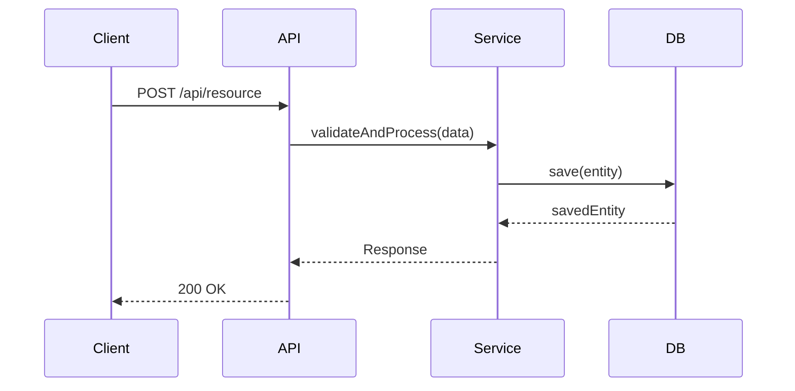

# 設計原則

## 核心原則

### 1. 型別安全優先（Type Safety First）

**強制要求**：
- 所有公開介面必須明確定義型別
- TypeScript 專案：禁止使用 `any` 型別，使用 `unknown` 配合型別守衛
- Python 專案：提供完整的 type hints
- 資料邊界必須進行驗證（如 API 輸入、資料庫查詢結果）

**範例**（TypeScript）：
```typescript
// ❌ 錯誤
function process(data: any): any {
  return data.value;
}

// ✅ 正確
interface InputData {
  value: string;
  timestamp: number;
}

interface OutputData {
  processed: string;
  metadata: Record<string, unknown>;
}

function process(data: InputData): OutputData {
  return {
    processed: data.value.toUpperCase(),
    metadata: { timestamp: data.timestamp }
  };
}
```

### 2. 視覺化溝通（Visual Communication）

**要求**：
- 複雜架構必須使用 Mermaid 圖表
- 系統邊界圖、序列圖、狀態圖優先
- 圖表必須包含關鍵資訊（元件名稱、資料流向、互動時序）

**範例**：


### 3. 正式專業語氣（Formal Technical Tone）

**要求**：
- 使用正式技術文件語氣
- 避免口語化、模糊描述
- 使用被動語態描述系統行為
- 精確的技術術語

**範例**：
- ❌ "這個功能會把資料存起來"
- ✅ "本元件負責將驗證後的資料持久化至資料庫"

### 4. 可追溯性（Traceability）

**要求**：
- 每個設計元件必須對應至少一個需求 ID
- 使用格式：`[需求 1.2]`、`[需求 2.3, 2.4]`
- 在元件說明中明確標示對應關係

### 5. 介面優先設計（Interface-First Design）

**要求**：
- 先定義介面契約，再說明實作細節
- 明確輸入、輸出、錯誤處理
- 使用 TypeScript interface 或等效方式定義

### 6. 關注點分離（Separation of Concerns）

**要求**：
- 清楚劃分層級（Presentation, Business Logic, Data Access）
- 避免跨層級直接呼叫
- 明確定義層級間的介面

### 7. 錯誤處理策略（Error Handling Strategy）

**要求**：
- 定義錯誤分類（驗證錯誤、業務邏輯錯誤、系統錯誤）
- 說明錯誤傳播機制
- 提供錯誤回復策略

### 8. 效能意識（Performance Awareness）

**要求**：
- 識別潛在效能瓶頸
- 說明快取策略
- 考慮資料量增長的影響

### 9. 安全性考量（Security Considerations）

**要求**：
- 識別安全邊界
- 說明驗證與授權機制
- 考慮常見安全威脅（OWASP Top 10）

### 10. 可測試性（Testability）

**要求**：
- 設計時考慮單元測試可行性
- 避免緊耦合
- 使用依賴注入模式

## 設計文件結構要求

### 必要章節
1. **概述** - 設計目標、範圍與邊界
2. **架構設計** - 架構模式、技術棧、系統邊界圖
3. **元件與介面契約** - 核心元件、介面定義、資料模型
4. **資料流程** - 流程圖、資料轉換
5. **技術決策** - 關鍵決策、選型理由、參考資料
6. **非功能性設計** - 效能、安全性、可擴展性、錯誤處理
7. **測試策略** - 單元測試、整合測試、端對端測試
8. **風險與挑戰** - 風險登記表

### 可選章節
- 部署考量
- 監控與告警
- 資料遷移策略
- 向後相容性

## 審查檢查清單

設計文件完成後，必須通過以下檢查：

- [ ] 所有介面定義使用強型別
- [ ] 複雜架構包含 Mermaid 圖表
- [ ] 每個元件標示對應的需求 ID
- [ ] 包含錯誤處理策略
- [ ] 包含效能與安全性考量
- [ ] 技術決策有明確理由和參考資料
- [ ] 使用正式技術語氣
- [ ] 資料流程清晰可追蹤

---

*遵循這些原則，確保設計文件的品質、一致性和可維護性。*
