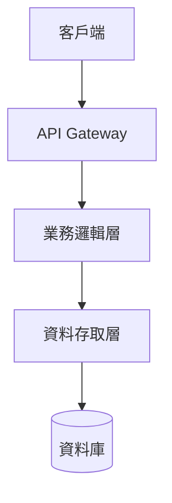
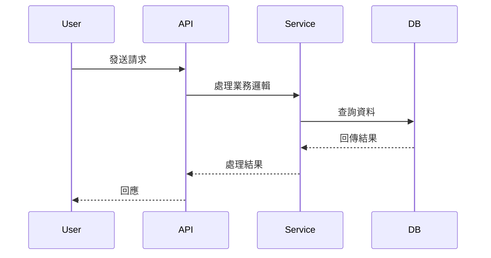

# 技術設計：{{FEATURE_NAME}}

> 建立時間：{{TIMESTAMP}}
> 需求文件：requirements.md

## 概述

### 設計目標
<!-- 從需求文件提取核心目標，說明本設計要達成什麼 -->

### 範圍與邊界
<!-- 明確說明此設計涵蓋的範圍，以及不涵蓋的部分 -->

## 架構設計

### Architecture Pattern & Boundary Map
<!-- 說明整體架構模式（如 MVC, Clean Architecture, Microservices 等）-->
<!-- 使用 Mermaid 圖表呈現系統邊界、主要模組及其互動關係 -->



### Technology Stack & Alignment
<!-- 列出使用的技術棧，並說明如何與現有系統對齊 -->

| 層級 | 技術 | 版本 | 說明 |
|------|------|------|------|
| 前端 | - | - | - |
| 後端 | - | - | - |
| 資料庫 | - | - | - |
| 快取 | - | - | - |

## Components & Interface Contracts

### 核心元件

#### 元件 1：[元件名稱]
**責任**：
<!-- 此元件負責什麼功能 -->

**介面定義**：
```typescript
// 定義公開介面、輸入輸出型別
interface ComponentInterface {
  method(param: Type): ReturnType;
}
```

**與需求對應**：
- [需求 ID] - [對應說明]

#### 元件 2：[元件名稱]
<!-- 重複上述結構 -->

### 資料模型

```typescript
// 定義主要資料結構
interface DataModel {
  id: string;
  // ...其他欄位
}
```

### API 設計

#### Endpoint 1
```
POST /api/v1/resource
Content-Type: application/json

Request:
{
  "field": "value"
}

Response:
{
  "id": "123",
  "status": "success"
}
```

## 資料流程

### 主要流程圖



### 資料轉換

<!-- 說明資料在各層級間如何轉換 -->

## 技術決策

### 決策 1：[決策主題]
**問題**：
<!-- 需要解決什麼問題 -->

**選項**：
1. 選項 A - [優缺點]
2. 選項 B - [優缺點]

**決定**：選擇 [選項]

**理由**：
<!-- 為什麼選擇這個選項 -->

**參考資料**：
- [研究文件連結或來源]

## 非功能性設計

### 效能考量
<!-- 效能目標、瓶頸分析、優化策略 -->

### 安全性設計
<!-- 驗證、授權、資料保護策略 -->

### 可擴展性
<!-- 如何支援未來擴展 -->

### 錯誤處理
<!-- 錯誤處理策略、回退機制 -->

## 測試策略

### 單元測試
<!-- 需要測試的元件和方法 -->

### 整合測試
<!-- 需要測試的整合點 -->

### 端對端測試
<!-- 關鍵使用者流程 -->

## 部署考量

### 環境需求
<!-- 開發、測試、正式環境的需求 -->

### 部署步驟
<!-- 部署流程概述 -->

### 監控與告警
<!-- 需要監控的指標 -->

## 風險與挑戰

| 風險 | 影響 | 機率 | 緩解策略 |
|------|------|------|---------|
| - | - | - | - |

## 參考文件

- [需求文件](requirements.md)
- [研究記錄](research.md)
- [相關技術文件]

## 附錄

### 名詞解釋
<!-- 技術名詞、領域術語解釋 -->

### 變更歷史
| 日期 | 版本 | 變更內容 | 修改者 |
|------|------|---------|--------|
| {{TIMESTAMP}} | 1.0 | 初始版本 | AI |

---

*本文件遵循專案規範中的設計原則，所有介面定義採用強型別，避免使用 `any` 型別。*
