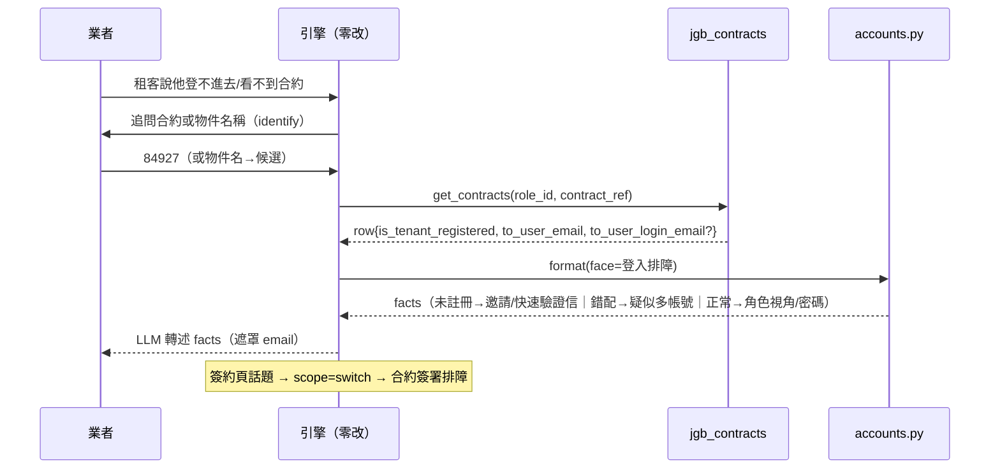

# 技術設計：account-conversational-facets

> 建立時間：2026-07-03
> 需求文件：requirements.md（R1–R10）　研究記錄：research.md（jgb2 五路真碼盤查＋b2c 現況＋33 案歸類）

## 概述

### 設計目標
在既有面向化底座（母子分類＋三層脈絡＋config_for_category＋face 貫穿＋FACE_BUILDERS）上，以**純資料為主、單一 builder 為輔**掛上帳號領域四個子面向（外部類：註冊驗證排障、登入排障；內部類：帳號綁定異動、團隊成員權限），引擎零改程式。決定性判因的載體依 grounding 有無分流：登入排障走 `jgb_contracts` 現值＋builder；其餘三面向走「子層脈絡決定性分流框架＋answer_rules 硬規則」。

### 範圍與邊界
- 涵蓋：四面向四件套資料、`services/jgb/accounts.py` 新領域檔（1 個 builder）、知識產製（33 案轉製＋10 筆補標）、G/J 清單契約文件、路由/整合/e2e 測試。
- 不涵蓋：引擎修改、jgb2 端實作（G-A1/A2 與 J 清單修復）、tenant `mode=b2b` 存量風險根治、簽約頁問題（合約域）、B.Bug 事故對話化。

## 架構設計

### Architecture Pattern & Boundary Map

沿用資料驅動面向化模式。與前兩域的結構差異：**三面向無 grounding**（select='category'），僅登入排障掛 API。

```mermaid
graph TD
    U[使用者訊息] --> RT[檢索＋reranker ≥0.75]
    RT -->|categories| CFG[config_for_category]
    subgraph 帳號中心（母，薄脈絡：名詞對照＋代問模式一句）
      CFG --> F1[註冊驗證排障<br/>select=category]
      CFG --> F2[登入排障<br/>select=api jgb_contracts]
      CFG --> F3[帳號綁定異動<br/>select=category＋申請書出口]
      CFG --> F4[團隊成員權限<br/>select=category]
    end
    F2 --> ENG[conversational_engine<br/>（零改）]
    ENG -->|face=登入排障| ACC[services/jgb/accounts.py<br/>build_login_trouble_facts]
    ACC -->|facts| LLM[LLM 轉述]
    F1 & F3 & F4 -->|子層脈絡分流框架＋知識| LLM
    F2 -.->|簽約頁話題 scope=switch| CONTRACT[合約域簽署排障]
```

### Technology Stack & Alignment
同前兩域（Python/FastAPI、PostgreSQL＋pgvector、bge reranker、jgb2 X-API-Key）。新知識部署綁 reranker semantic model 重建。無新相依。

## Components & Interface Contracts

### 元件 1：母分類與四子分類（category_config 資料）
**責任**：進場路由識別＋面向互轉集合（母衍生 faces——四面向天然互轉，R7.1）。
母 `帳號中心`（無 config、不接對話）＋子 `註冊驗證排障`/`登入排障`/`帳號綁定異動`/`團隊成員權限`。
**對應**：R1.1, R1.2, R7.1。

### 元件 2：三層系統脈絡（knowledge_base category='系統脈絡' 資料）
**責任**：base＋母＋子疊加（≤4500 字，R1.5）。
- 母層（薄，~150 字）：名詞對照（主帳號/子帳號、綁定、角色視角、團隊/成員/角色）＋代問模式一句——**不含任何外部/內部類機制細節**（R1.3 由子層互斥天然滿足＋母層自律）。
- 子層各 300–600 字，內容即 research 證實的決定性分流框架：
  - 註冊驗證排障：Email 主路徑/手機可跳過；驗證碼 TTL 300s、錯 3 次失效、重發即換碼舊碼失效、冷卻 120s 內重按不產碼、ver_id 對碼法；「此帳號/手機已註冊」→ 轉綁定異動；B.Bug 特徵（全面錯誤/多業者同報/金鑰字樣）→ 導客服。
  - 登入排障：帳密帳號無法 LINE 快速登入（無綁定 row、無補綁功能）→ 改帳密登入；email 以「當初註冊的確切寫法」登入（大小寫敏感現況）；忘記密碼自助雙路徑／忘記帳號 SMS 取星號提示；登入後看不到資料 → 角色視角切換／疑似登錯帳號。
  - 帳號綁定異動：自助 vs 後台判定表（姓名自助但簽署後鎖定；Email/手機換綁=後台）；藍字連動兩但書（簽署前連動、簽署後快照不動）；資料異動申請書骨架。
  - 團隊成員權限：成員需先註冊；可見範圍三層（show_estate/show_owner_estate/逐筆指派）；成員無權限 → 成員列表「變更角色」；新增社區/合約各需 edit_estate/add_contract。
**對應**：R1.3, R1.5, R2.2, R2.5, R3.2, R4.1, R5.1。

### 元件 3：對話 config（4 筆資料）

```python
# persona_role 專屬鍵（R1.6）：pm_account_register / pm_account_login /
#   pm_account_binding / pm_account_team
# 外部類 persona 定調代問模式（R1.7）：給業者可執行動作＋可轉述租客的指引
{
  "註冊驗證排障": {"select": "category", "converge_kind": "answer"},   # 兩輪分流：管道×現象
  "登入排障":     {"select": "api", "endpoint": "jgb_contracts",
                   "required_slots": ["contract_ref"],                 # 有合約可查→grounded；
                   "converge_kind": "answer"},                          # MAX_ASKS 保底→知識收斂
  "帳號綁定異動": {"select": "category", "converge_kind": "answer"},   # 分流：自助/後台→申請書出口
  "團隊成員權限": {"select": "category", "converge_kind": "answer"},
}
```
紅線（answer_rules 釘死，R6）：不輸出驗證碼值／不代辦後台操作／不建議分身帳號／申請書關鍵 token（service@jgbsmart.com、修改前/後值）／email 手機遮罩。
**對應**：R1.6, R1.7, R2.3, R4.2, R4.3, R6.2。

### 元件 4：`services/jgb/accounts.py`（新領域檔，1 builder）

```python
AccountFaceBuilder = Callable[[dict, str], str]   # (contract_row, user_question) -> facts

def build_login_trouble_facts(contract: dict, user_question: str = "") -> str:
    """登入排障 facts（R3.3）：由合約現值決定性判定——
    is_tenant_registered=False → 未註冊（引導註冊/快速驗證信 72h）；
    True 且 to_user_login_email 與邀請 email 不一致（密文防護沿 G2：非 email 格式視同不可用）
      → 疑似登錯帳號/多帳號；
    True 且一致 → 帳號正常，轉角色視角/密碼路徑。
    欄位缺失（master 未併 G2）→ 降級輸出僅含 is_tenant_registered 分支（存在性驅動，R6.4）。"""

ACCOUNT_FACE_BUILDERS: dict[str, AccountFaceBuilder] = {"登入排障": build_login_trouble_facts}
```
接入點：`jgb_response_formatter` 的 jgb_contracts 分支已收 face——只需在 contracts face 分發處讓「登入排障」face route 到 accounts.py（資料列面向字面僅出現於本檔＋資料，慣例同前兩域）。face=None/未註冊 → 原路（恆等，R10.1）。
**對應**：R3.3, R6.1, R6.4, R6.5, R10.1。

### 元件 5：錨點知識與 backfill（資料）
- 錨點：每面向口語起手句各 1–2 筆（自 33 案措辭取材），**target_user=['property_manager'] only**（b2c 定案：tenant 落雙角色單發知識；research 主題 6）；避開「簽」「帳單」強詞防跨域誤吸。
- backfill：3435-3440/3544-3547 十筆逐筆定案（預判：3436 掛登入排障、3439+3544-3547 掛團隊成員權限、3437 掛帳號綁定異動、3435/3438/3440 維持單發教學；人工確認後套用）。
- 新知識：機制類 16 案轉製（個案資訊剝除，R8.5）＋help 中心帳號文章素材。
**對應**：R7.3, R7.4, R8.1-8.5。

### 元件 6：G/J 契約文件（交付 jgb2）
- **G-A1**：以 phone/email 查該業者名下租客註冊/綁定狀態——資料源 `existed_lessees`（lessor_role_id 圈定、防枚舉）、授權沿三層模型＋`tenants:read`；標注待確認（欄位加密）。**G-A2**：團隊成員權限查詢（role_user＋character）。存在性驅動，上線前 R3.3/R5.3 走降級。
- **J 清單**（缺陷回報 5 條）：email 大小寫、invite character NULL、authPhone 未擋、status-overview 權限點、Email 冷卻起算——修復後部分知識口徑可簡化（如大小寫提醒可撤）。
**對應**：R9.1-9.4。

## 資料流程（登入排障主流程）



## 技術決策

### 決策 1：母分類結構 → 一母「帳號中心」＋薄母層
機制事實：子層脈絡本互不疊加；faces 由母衍生。兩母分類需 faces 明列＋雙母層，無實質隔離收益（research 選型 1）。R1.3 驗收=整合測試斷言外部面向脈絡不含內部類關鍵詞。

### 決策 2：登入排障掛 API（其餘三面向純資料）
`jgb_contracts` 現值（is_tenant_registered master 即有）能決定性判「未註冊/錯配/正常」三分支——這是本領域最高頻內部案型（實案 24/26/9）的正解；不掛 API 就只能教使用者自查。代價是一個 builder＋face 分發一行，同構前例成熟。

### 決策 3：b2c 初版=錨點 pm-only
config 無角色維度、一 category 一 config（research 主題 6）；tenant 直接問時落雙角色單發知識（3435-3438 現成）。不為 b2c 開雙 config（機制不存在，屬引擎議題）。

### 決策 4：「決定性」的無 API 載體
三個純資料面向的決定性=子層脈絡分流框架（機制數字寫死：300s/3 次/120s/72h）＋answer_rules 紅線＋知識條件句；**LLM 不得自創機制數字**（e2e 以機制 token 斷言把關，如「5 分鐘」「三次」）。

## 非功能性設計

- **安全**：驗證碼值紅線（G 清單明文排除＋answer_rules）；email/手機遮罩沿 `_mask_email` 慣例；G-A1 防枚舉授權界定寫入契約。
- **錯誤處理**：G 欄位缺失存在性降級（R6.4）；密文/非預期格式視同不可用（R6.5）；B.Bug 特徵→導客服短路。
- **效能**：無新服務；脈絡長度預算自檢 ≤4500。
- **可擴展**：G-A1/A2 上線→登入排障/團隊權限升級 grounded（builder 已留位）；LINE 官方帳號開放後外部類擴 LINE 綁定情境。

## 測試策略

- **單元**：build_login_trouble_facts 全分支矩陣（未註冊/錯配/一致/欄位缺失/密文）；face=None 恆等＋mutation 證明；紅線 token（不出現驗證碼樣式數字）。
- **整合**（真 DB＋stub jgb2）：四面向 config_for_category 進場；三層脈絡疊加正確且外部面向不含內部類關鍵詞（R1.3）；登入排障 identify→ground→分支；面向互轉線索保留；跨域 switch（→合約簽署排障）。
- **e2e**（preview 真 LLM）：每面向口語第一句進場；登入排障真資料多輪；機制 token 斷言（5 分鐘/三次/確切寫法）；申請書出口 token；進對話 vs 單發各一例。
- **路由回歸**：`test_facet_entry_routing_req.py` 擴帳號案例——三組誤吸邊界點名覆蓋（登入 vs 簽署排障、3436 重疊、「看不到帳單」歸帳務）。

## 部署考量

1. migrations（categories/context/configs）→ 2. 知識批次（審核後）＋10 筆補標 → 3. reranker 重建 → 4. 清快取 → 5. 煙囪（每面向一句）。與 contract/billing 的統一部署 runbook 合併執行；G/J 清單交付 jgb2 不阻塞。

## 風險與挑戰

| 風險 | 影響 | 機率 | 緩解 |
|---|---|---|---|
| 登入 vs 簽署排障錨點誤吸 | 中 | 中 | 錨點避「簽」字＋路由雙向案例紅→調→綠 |
| LLM 自創機制數字 | 中 | 中 | 脈絡寫死數字＋e2e token 斷言＋answer_rules |
| jgb2 修復 J1（大小寫）後知識口徑過時 | 低 | 中 | 口徑寫「確切寫法」不寫「大小寫 bug」；J 修復後知識微調 |
| existed_lessees 加密未確認 | G-A1 細節 | 低 | 契約標注待確認；存在性驅動不阻塞 |

## 參考文件
- [需求文件](requirements.md)、[研究記錄](research.md)、[落差分析](gap-analysis.md)
- 前例：contract/billing spec 的 design.md、g1-g4-api-contract.md、billing-api-contract.md

### 變更歷史
| 日期 | 版本 | 變更內容 |
|---|---|---|
| 2026-07-03 | 1.0 | 初始版本（五路真碼盤查定案） |
