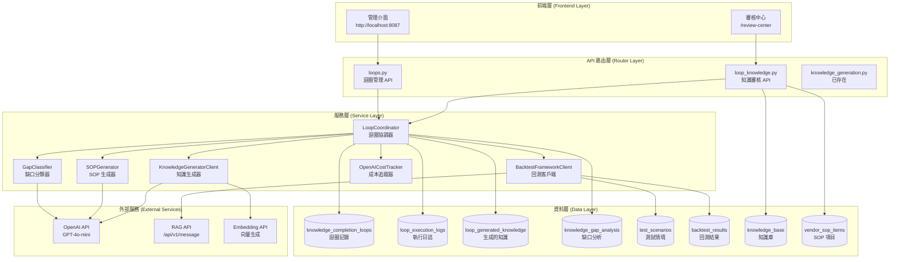
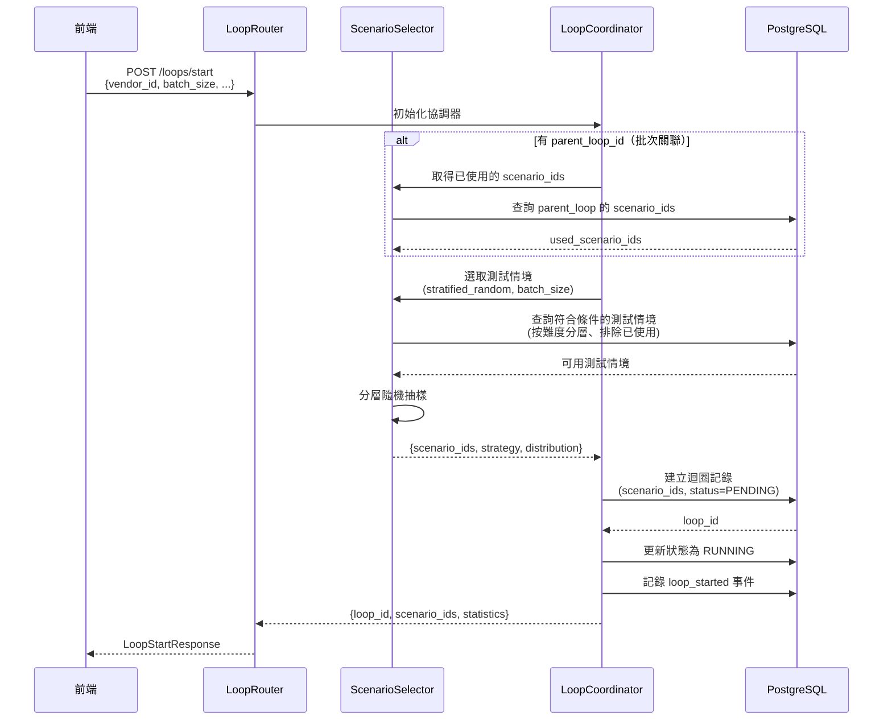
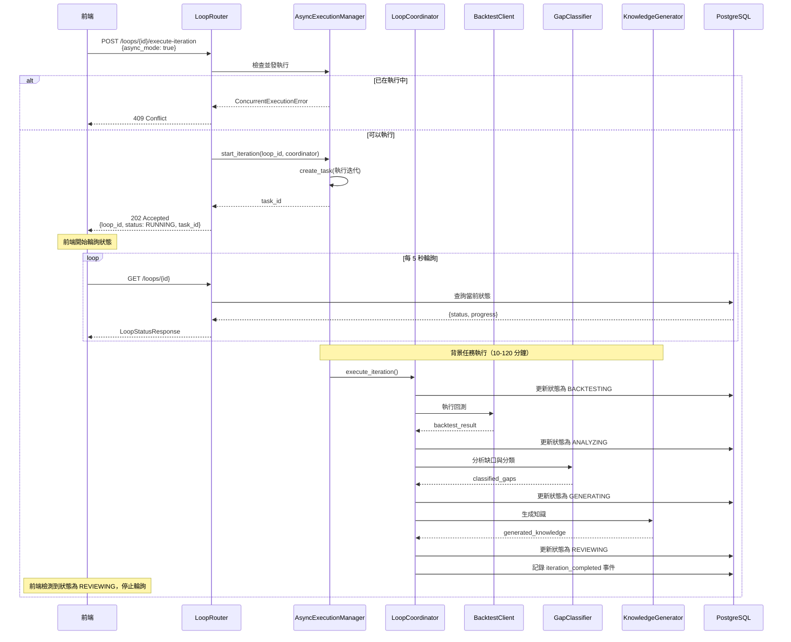
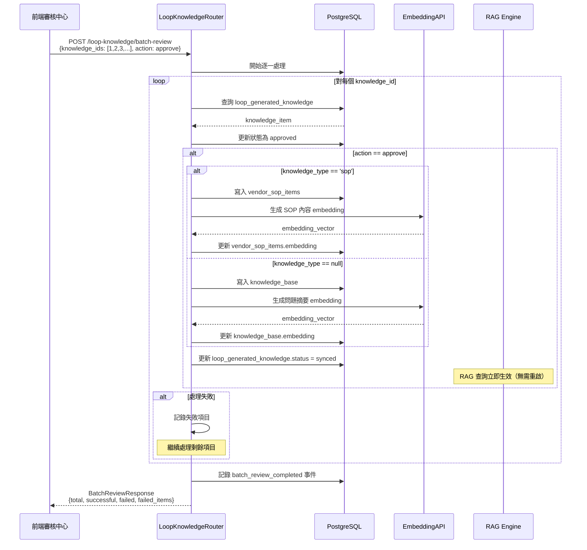
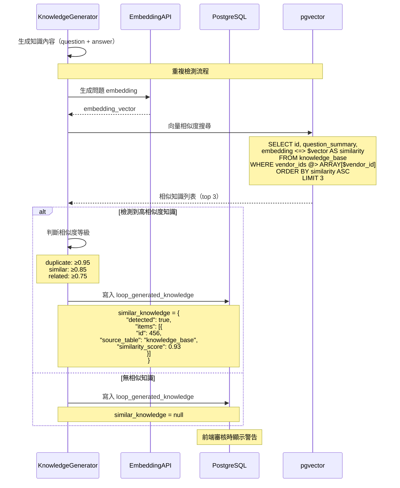

# 技術設計：backtest-knowledge-refinement

> 建立時間：2026-03-27T00:00:00Z
> 需求文件：requirements.md

## 概述

### 設計目標

本設計旨在完善現有的知識庫完善迴圈系統（Knowledge Completion Loop），建立完整的前後端整合架構，實現以下核心目標：

1. **前端 API 整合**：設計完整的 RESTful API 路由層，支援前端管理介面操作迴圈生命週期
2. **非同步執行架構**：實現長時間迭代任務的背景執行機制，避免 HTTP 請求超時問題
3. **批量審核效率提升**：設計高效的批量審核 API，支援一次審核 10-50 個知識項目
4. **固定測試集保證**：確保同一迴圈的所有迭代使用相同測試情境，保證結果可比較性
5. **可選驗證回測**：提供驗證效果回測功能，支援快速驗證知識改善幅度

### 範圍與邊界

**本設計涵蓋**：
- 前端 API 路由層完整設計（`routers/loops.py`）
- 迴圈生命週期管理 API（啟動、執行迭代、暫停、恢復、取消、完成）
- 知識審核 API（單一審核、批量審核、查詢待審核知識）
- 驗證回測 API（可選功能）
- 非同步執行框架設計與實作
- 資料庫架構補充與對齊

**本設計不涵蓋**：
- 前端 Vue.js 介面實作（僅定義 API 契約）
- OpenAI API 的具體 prompt 設計（已由現有 GapClassifier、SOPGenerator 處理）
- 測試情境生成邏輯（已由現有系統處理）
- 既有回測框架的修改（使用現有 BacktestFrameworkClient）

---

## 架構設計

### Architecture Pattern & Boundary Map

本系統採用 **分層架構（Layered Architecture）** 搭配 **狀態機模式（State Machine Pattern）**，確保迴圈生命週期管理的清晰性與可追溯性。



**邊界說明**：
- **前端邊界**：透過 RESTful API 與後端通訊，無直接資料庫存取
- **服務邊界**：所有業務邏輯集中在服務層，路由層僅負責請求驗證與回應格式化
- **資料邊界**：所有資料存取透過連接池（asyncpg/psycopg2），使用參數化查詢防止 SQL 注入
- **外部服務邊界**：OpenAI API 調用透過 tenacity 實作重試機制，避免暫時性錯誤

### Technology Stack & Alignment

| 層級 | 技術 | 版本 | 說明 |
|------|------|------|------|
| **前端** | Vue.js 3 | 3.x | 管理介面與審核中心（現有） |
| **API 框架** | FastAPI | 0.100+ | 高效能非同步 Web 框架 |
| **非同步執行** | asyncio | Python 標準庫 | 背景任務執行（create_task） |
| **資料庫** | PostgreSQL | 14+ | 主要資料庫 |
| **向量擴展** | pgvector | 0.5+ | 向量相似度搜尋（重複檢測） |
| **資料庫驅動** | asyncpg<br/>psycopg2 | - | 非同步/同步驅動 |
| **AI 服務** | OpenAI API | gpt-4o-mini | 知識分類、聚類、生成 |
| **重試機制** | tenacity | - | API 調用失敗重試 |
| **資料驗證** | Pydantic | 2.x | 請求/回應模型驗證 |

**技術對齊說明**：
- 沿用現有 FastAPI 框架，無需引入新的 Web 框架
- 使用 asyncio 而非 Celery，避免增加系統依賴（Redis/RabbitMQ）
- 資料庫驅動維持雙模式：asyncpg（API）、psycopg2（批次腳本）
- 向量搜尋使用現有 pgvector 擴展，無需額外向量資料庫

---

## Components & Interface Contracts

### 核心元件

#### 元件 1：LoopRouter（迴圈路由器）

**責任**：
- 處理前端對迴圈生命週期的所有 HTTP 請求
- 驗證請求參數與業者身份
- 初始化 LoopCoordinator 並調用對應方法
- 格式化回應並處理錯誤

**介面定義**：
```python
from fastapi import APIRouter, HTTPException, Request, BackgroundTasks
from pydantic import BaseModel, Field
from typing import Optional, List, Dict
from enum import Enum

router = APIRouter()

# ============================================
# Request/Response Models
# ============================================

class LoopStartRequest(BaseModel):
    """啟動迴圈請求"""
    loop_name: str = Field(..., description="迴圈名稱", max_length=200)
    vendor_id: int = Field(..., description="業者 ID", gt=0)
    batch_size: int = Field(50, description="批次大小", ge=1, le=3000)
    max_iterations: int = Field(10, description="最大迭代次數", ge=1, le=50)
    target_pass_rate: float = Field(0.85, description="目標通過率", ge=0.0, le=1.0)
    scenario_filters: Optional[Dict] = Field(None, description="測試情境篩選條件")
    parent_loop_id: Optional[int] = Field(None, description="父迴圈 ID（批次關聯）")
    budget_limit_usd: Optional[float] = Field(None, description="成本預算上限（USD）", ge=0)

class LoopStartResponse(BaseModel):
    """啟動迴圈回應"""
    loop_id: int
    loop_name: str
    vendor_id: int
    status: str
    scenario_ids: List[int] = Field(description="固定測試集 ID 列表")
    scenario_selection_strategy: str = Field(description="選取策略")
    difficulty_distribution: Dict[str, int] = Field(description="難度分布")
    initial_statistics: Dict
    created_at: str

class ExecuteIterationRequest(BaseModel):
    """執行迭代請求"""
    async_mode: bool = Field(True, description="是否非同步執行")

class ExecuteIterationResponse(BaseModel):
    """執行迭代回應"""
    loop_id: int
    current_iteration: int
    status: str
    message: str
    backtest_result: Optional[Dict] = None  # 同步模式時返回完整結果
    execution_task_id: Optional[str] = None  # 非同步模式時返回任務 ID

class LoopStatusResponse(BaseModel):
    """迴圈狀態回應"""
    loop_id: int
    loop_name: str
    vendor_id: int
    status: str
    current_iteration: int
    max_iterations: int
    current_pass_rate: Optional[float]
    target_pass_rate: float
    scenario_ids: List[int]
    total_scenarios: int
    progress: Dict  # {phase: str, percentage: float, message: str}
    created_at: str
    updated_at: str
    completed_at: Optional[str]

class ValidateLoopRequest(BaseModel):
    """驗證迴圈請求"""
    validation_scope: str = Field("failed_plus_sample", description="驗證範圍")
    sample_pass_rate: float = Field(0.2, description="抽樣比例", ge=0.0, le=1.0)

class ValidateLoopResponse(BaseModel):
    """驗證迴圈回應"""
    loop_id: int
    validation_result: Dict
    validation_passed: bool
    affected_knowledge_ids: List[int]
    regression_detected: bool
    regression_count: int
    next_action: str

class CompleteBatchResponse(BaseModel):
    """完成批次回應"""
    loop_id: int
    status: str
    summary: Dict
    message: str

# ============================================
# API Endpoints
# ============================================

@router.post("/start", response_model=LoopStartResponse)
async def start_loop(request: LoopStartRequest, req: Request):
    """
    [需求 10.1, 10.4] 啟動新迴圈

    - 建立新的迴圈記錄
    - 選取固定測試集（分層隨機抽樣）
    - 初始化成本追蹤器
    """
    pass

@router.post("/{loop_id}/execute-iteration", response_model=ExecuteIterationResponse)
async def execute_iteration(
    loop_id: int,
    request: ExecuteIterationRequest,
    req: Request,
    background_tasks: BackgroundTasks
):
    """
    [需求 10.2] 執行迭代

    - 支援非同步執行模式（預設）
    - 執行完整的 8 步驟流程
    - 防止並發執行
    """
    pass

@router.get("/{loop_id}", response_model=LoopStatusResponse)
async def get_loop_status(loop_id: int, req: Request):
    """
    [需求 10.2] 查詢迴圈狀態

    - 返回當前狀態與進度
    - 前端輪詢使用
    """
    pass

@router.post("/{loop_id}/validate", response_model=ValidateLoopResponse)
async def validate_loop(
    loop_id: int,
    request: ValidateLoopRequest,
    req: Request
):
    """
    [需求 9] 驗證效果回測（可選功能）

    - 執行驗證回測
    - 支援三種驗證範圍
    - 檢測 regression
    """
    pass

@router.post("/{loop_id}/complete-batch", response_model=CompleteBatchResponse)
async def complete_batch(loop_id: int, req: Request):
    """
    [需求 10.4] 完成批次

    - 標記迴圈為 COMPLETED
    - 返回統計摘要
    """
    pass

@router.post("/{loop_id}/pause")
async def pause_loop(loop_id: int, req: Request):
    """[需求 10.5] 暫停迴圈"""
    pass

@router.post("/{loop_id}/resume")
async def resume_loop(loop_id: int, req: Request):
    """[需求 10.5] 恢復迴圈"""
    pass

@router.post("/{loop_id}/cancel")
async def cancel_loop(loop_id: int, req: Request):
    """[需求 10.5] 取消迴圈"""
    pass

@router.post("/start-next-batch", response_model=LoopStartResponse)
async def start_next_batch(
    request: LoopStartRequest,
    req: Request
):
    """
    [需求 10.4] 啟動下一批次

    - 創建新迴圈並關聯父迴圈
    - 自動選取未處理的測試情境
    """
    pass
```

**與需求對應**：
- [需求 10.1, 10.4] - 迴圈生命週期管理
- [需求 10.2] - 非同步執行與狀態查詢
- [需求 9] - 驗證效果回測
- [需求 10.5] - 暫停、恢復、取消操作

---

#### 元件 2：LoopKnowledgeRouter（知識審核路由器）

**責任**：
- 處理知識審核相關的 HTTP 請求
- 提供單一審核與批量審核功能
- 查詢待審核知識清單
- 執行知識同步到正式庫

**介面定義**：
```python
from fastapi import APIRouter, HTTPException, Request
from pydantic import BaseModel, Field
from typing import Optional, List, Dict

router = APIRouter()

# ============================================
# Request/Response Models
# ============================================

class PendingKnowledgeQuery(BaseModel):
    """待審核知識查詢參數"""
    loop_id: Optional[int] = Field(None, description="迴圈 ID")
    vendor_id: int = Field(..., description="業者 ID")
    knowledge_type: Optional[str] = Field(None, description="知識類型: sop/null")
    status: str = Field("pending", description="狀態: pending/approved/rejected")
    limit: int = Field(50, description="返回數量", ge=1, le=200)
    offset: int = Field(0, description="偏移量", ge=0)

class PendingKnowledgeItem(BaseModel):
    """待審核知識項目"""
    id: int
    loop_id: int
    iteration: int
    question: str
    answer: str
    knowledge_type: Optional[str]
    sop_config: Optional[Dict]
    similar_knowledge: Optional[Dict] = Field(
        None,
        description="重複檢測結果，格式：{detected: bool, items: [{id, source_table, question_summary, similarity_score}]}"
    )
    duplication_warning: Optional[str] = Field(
        None,
        description="重複警告文字，例如：'檢測到 1 個高度相似的知識（相似度 93%）'"
    )
    status: str
    created_at: str

class PendingKnowledgeResponse(BaseModel):
    """待審核知識回應"""
    total: int
    items: List[PendingKnowledgeItem]

class ReviewKnowledgeRequest(BaseModel):
    """審核知識請求"""
    action: str = Field(..., description="動作: approve/reject")
    modifications: Optional[Dict] = Field(None, description="修改內容")
    review_notes: Optional[str] = Field(None, description="審核備註")

class ReviewKnowledgeResponse(BaseModel):
    """審核知識回應"""
    knowledge_id: int
    action: str
    synced: bool
    synced_to: Optional[str]  # knowledge_base/vendor_sop_items
    synced_id: Optional[int]
    message: str

class BatchReviewRequest(BaseModel):
    """批量審核請求"""
    knowledge_ids: List[int] = Field(..., description="知識 ID 列表", min_items=1, max_items=100)
    action: str = Field(..., description="動作: approve/reject")
    modifications: Optional[Dict] = Field(None, description="批量修改欄位")

class BatchReviewFailedItem(BaseModel):
    """批量審核失敗項目"""
    knowledge_id: int
    error: str

class BatchReviewResponse(BaseModel):
    """批量審核回應"""
    total: int
    successful: int
    failed: int
    failed_items: List[BatchReviewFailedItem]
    duration_ms: int

# ============================================
# API Endpoints
# ============================================

@router.get("/loop-knowledge/pending", response_model=PendingKnowledgeResponse)
async def get_pending_knowledge(
    query: PendingKnowledgeQuery,
    req: Request
):
    """
    [需求 8.1] 查詢待審核知識

    - 支援篩選條件（迴圈、業者、類型、狀態）
    - 支援分頁
    """
    pass

@router.post("/loop-knowledge/{knowledge_id}/review", response_model=ReviewKnowledgeResponse)
async def review_knowledge(
    knowledge_id: int,
    request: ReviewKnowledgeRequest,
    req: Request
):
    """
    [需求 8.2] 單一知識審核

    - 審核通過立即同步到正式庫
    - 生成 embedding 向量
    - 記錄審核事件
    """
    pass

@router.post("/loop-knowledge/batch-review", response_model=BatchReviewResponse)
async def batch_review_knowledge(
    request: BatchReviewRequest,
    req: Request
):
    """
    [需求 8.3] 批量審核知識

    - 支援一次審核 1-100 個知識項目
    - 部分成功模式（容錯）
    - 記錄失敗項目供重試
    """
    pass
```

**與需求對應**：
- [需求 8.1] - 待審核知識查詢
- [需求 8.2] - 單一審核與立即同步
- [需求 8.3] - 批量審核功能

---

#### 元件 3：AsyncExecutionManager（非同步執行管理器）

**責任**：
- 管理長時間運行的迭代任務
- 追蹤任務狀態與進度
- 防止並發執行
- 處理任務錯誤與超時

**介面定義**：
```python
from typing import Dict, Optional
import asyncio
from datetime import datetime

class AsyncExecutionManager:
    """非同步執行管理器"""

    def __init__(self, db_pool):
        self.db_pool = db_pool
        self.running_tasks: Dict[int, asyncio.Task] = {}  # loop_id -> Task

    async def start_iteration(
        self,
        loop_id: int,
        coordinator: LoopCoordinator
    ) -> str:
        """
        啟動非同步迭代任務

        Args:
            loop_id: 迴圈 ID
            coordinator: 協調器實例

        Returns:
            task_id: 任務 ID

        Raises:
            ConcurrentExecutionError: 當迴圈已在執行中
        """
        # 檢查並發執行
        if loop_id in self.running_tasks:
            raise ConcurrentExecutionError(f"Loop {loop_id} 已在執行中")

        # 建立背景任務
        task = asyncio.create_task(
            self._execute_iteration_background(loop_id, coordinator)
        )
        self.running_tasks[loop_id] = task

        return f"task_{loop_id}_{datetime.now().timestamp()}"

    async def _execute_iteration_background(
        self,
        loop_id: int,
        coordinator: LoopCoordinator
    ):
        """背景執行迭代（內部方法）"""
        try:
            # 執行完整的迭代流程
            result = await coordinator.execute_iteration()

            # 更新狀態為 REVIEWING
            await coordinator._update_loop_status(LoopStatus.REVIEWING)

            # 記錄成功事件
            await coordinator._log_event(
                event_type="iteration_completed",
                event_data=result
            )

        except BudgetExceededError as e:
            # 預算超出，停止迴圈
            await coordinator._update_loop_status(LoopStatus.FAILED)
            await coordinator._log_event(
                event_type="budget_exceeded",
                event_data={"error": str(e)}
            )

        except Exception as e:
            # 其他錯誤
            await coordinator._update_loop_status(LoopStatus.FAILED)
            await coordinator._log_event(
                event_type="iteration_failed",
                event_data={"error": str(e), "traceback": traceback.format_exc()}
            )

        finally:
            # 清理任務記錄
            self.running_tasks.pop(loop_id, None)

    def is_running(self, loop_id: int) -> bool:
        """檢查迴圈是否正在執行"""
        return loop_id in self.running_tasks

    async def cancel_task(self, loop_id: int):
        """取消執行中的任務"""
        task = self.running_tasks.get(loop_id)
        if task:
            task.cancel()
            self.running_tasks.pop(loop_id, None)

class ConcurrentExecutionError(Exception):
    """並發執行錯誤"""
    pass
```

**與需求對應**：
- [需求 10.2] - 非同步執行模式
- [需求 10.5] - 取消操作

---

#### 元件 4：ScenarioSelector（測試情境選取器）

**責任**：
- 實作測試情境選取策略（分層隨機抽樣）
- 避免批次間重複選取
- 記錄選取策略與分布

**介面定義**：
```python
from typing import List, Dict, Optional
from enum import Enum
import random

class SelectionStrategy(str, Enum):
    """選取策略"""
    STRATIFIED_RANDOM = "stratified_random"  # 分層隨機抽樣
    SEQUENTIAL = "sequential"  # 順序選取
    FULL_RANDOM = "full_random"  # 完全隨機

class DifficultyDistribution(BaseModel):
    """難度分布配置"""
    easy: float = Field(0.2, description="簡單題比例", ge=0, le=1)
    medium: float = Field(0.5, description="中等題比例", ge=0, le=1)
    hard: float = Field(0.3, description="困難題比例", ge=0, le=1)

class ScenarioSelector:
    """測試情境選取器"""

    def __init__(self, db_pool):
        self.db_pool = db_pool

    async def select_scenarios(
        self,
        vendor_id: int,
        batch_size: int,
        strategy: SelectionStrategy = SelectionStrategy.STRATIFIED_RANDOM,
        distribution: Optional[DifficultyDistribution] = None,
        exclude_scenario_ids: Optional[List[int]] = None,
        filters: Optional[Dict] = None
    ) -> Dict:
        """
        選取測試情境

        Args:
            vendor_id: 業者 ID
            batch_size: 批次大小
            strategy: 選取策略
            distribution: 難度分布（分層抽樣時使用）
            exclude_scenario_ids: 排除的情境 ID（避免重複）
            filters: 額外篩選條件

        Returns:
            {
                "scenario_ids": List[int],
                "selection_strategy": str,
                "difficulty_distribution": Dict[str, int],
                "total_available": int
            }
        """
        if strategy == SelectionStrategy.STRATIFIED_RANDOM:
            return await self._stratified_random_sampling(
                vendor_id, batch_size, distribution, exclude_scenario_ids, filters
            )
        elif strategy == SelectionStrategy.SEQUENTIAL:
            return await self._sequential_selection(
                vendor_id, batch_size, exclude_scenario_ids, filters
            )
        else:  # FULL_RANDOM
            return await self._full_random_selection(
                vendor_id, batch_size, exclude_scenario_ids, filters
            )

    async def _stratified_random_sampling(
        self,
        vendor_id: int,
        batch_size: int,
        distribution: Optional[DifficultyDistribution],
        exclude_scenario_ids: Optional[List[int]],
        filters: Optional[Dict]
    ) -> Dict:
        """
        [需求 4.4] 分層隨機抽樣

        - 按難度等級分層
        - 每層按比例隨機選取
        - 確保涵蓋不同難度
        """
        if not distribution:
            distribution = DifficultyDistribution()

        # 計算每個難度的目標數量
        target_easy = int(batch_size * distribution.easy)
        target_medium = int(batch_size * distribution.medium)
        target_hard = batch_size - target_easy - target_medium

        selected_ids = []
        actual_distribution = {"easy": 0, "medium": 0, "hard": 0}

        # 對每個難度等級抽樣
        for difficulty, target_count in [
            ("easy", target_easy),
            ("medium", target_medium),
            ("hard", target_hard)
        ]:
            # 查詢該難度的可用情境
            query = """
                SELECT id FROM test_scenarios
                WHERE difficulty = $1
                  AND status = 'approved'
                  AND ($2::INTEGER[] IS NULL OR id != ALL($2))
                ORDER BY RANDOM()
                LIMIT $3
            """
            rows = await self.db_pool.fetch(
                query,
                difficulty,
                exclude_scenario_ids,
                target_count
            )

            ids = [row["id"] for row in rows]
            selected_ids.extend(ids)
            actual_distribution[difficulty] = len(ids)

        return {
            "scenario_ids": selected_ids,
            "selection_strategy": "stratified_random",
            "difficulty_distribution": actual_distribution,
            "total_available": len(selected_ids)
        }

    async def get_used_scenario_ids(
        self,
        vendor_id: int,
        parent_loop_id: Optional[int] = None
    ) -> List[int]:
        """
        [需求 4.4] 取得已使用的測試情境 ID

        - 查詢關聯批次的 scenario_ids
        - 用於避免批次間重複
        """
        if parent_loop_id:
            # 查詢同一父迴圈的所有子迴圈
            query = """
                SELECT DISTINCT unnest(scenario_ids) as scenario_id
                FROM knowledge_completion_loops
                WHERE vendor_id = $1
                  AND (id = $2 OR parent_loop_id = $2)
            """
            rows = await self.db_pool.fetch(query, vendor_id, parent_loop_id)
        else:
            # 查詢所有迴圈的 scenario_ids
            query = """
                SELECT DISTINCT unnest(scenario_ids) as scenario_id
                FROM knowledge_completion_loops
                WHERE vendor_id = $1
            """
            rows = await self.db_pool.fetch(query, vendor_id)

        return [row["scenario_id"] for row in rows]
```

**與需求對應**：
- [需求 4.4] - 測試情境選取策略
- [需求 4.5] - 迭代間測試情境一致性
- [需求 10.4] - 批次間避免重複

---

#### 元件 5：LoopCoordinator Extensions（協調器擴展）

**責任**：
- 擴展現有 LoopCoordinator，新增缺少的方法
- 實作 load_loop() 方法支援跨 session 續接
- 實作驗證回測方法（可選）

**介面定義**：
```python
class LoopCoordinator:
    """完善迴圈協調器（擴展版本）"""

    # ... 現有方法 ...

    async def load_loop(self, loop_id: int) -> Dict:
        """
        [需求 10.6.1] 載入已存在的迴圈

        Args:
            loop_id: 迴圈 ID

        Returns:
            迴圈狀態資訊

        Raises:
            LoopNotFoundError: 迴圈不存在
        """
        # 從資料庫載入迴圈資訊
        loop_record = await self._fetch_loop_record(loop_id)
        if not loop_record:
            raise LoopNotFoundError(f"Loop {loop_id} 不存在")

        # 初始化協調器狀態
        self.loop_id = loop_id
        self.vendor_id = loop_record["vendor_id"]
        self.loop_name = loop_record["loop_name"]
        self.current_status = LoopStatus(loop_record["status"])
        self.config = LoopConfig(**loop_record["config"])

        # 初始化成本追蹤器
        self.cost_tracker = OpenAICostTracker(
            loop_id=loop_id,
            db_pool=self.db_pool,
            budget_limit_usd=self.config.budget_limit_usd
        )

        # 更新生成器的 cost_tracker
        self.knowledge_generator.cost_tracker = self.cost_tracker
        self.sop_generator.cost_tracker = self.cost_tracker

        return {
            "loop_id": self.loop_id,
            "status": self.current_status.value,
            "current_iteration": loop_record["current_iteration"],
            "loaded_at": datetime.now().isoformat()
        }

    async def validate_loop(
        self,
        validation_scope: str = "failed_plus_sample",
        sample_pass_rate: float = 0.2
    ) -> Dict:
        """
        [需求 9] 驗證效果回測（可選功能）

        Args:
            validation_scope: 驗證範圍（failed_only/all/failed_plus_sample）
            sample_pass_rate: 抽樣比例（僅在 failed_plus_sample 時使用）

        Returns:
            驗證結果
        """
        # 驗證狀態
        if self.current_status != LoopStatus.REVIEWING:
            raise InvalidStateError(
                current_state=self.current_status.value,
                target_state="validate"
            )

        # 取得固定測試集
        scenario_ids = await self._get_scenario_ids()

        # 根據驗證範圍選取測試案例
        if validation_scope == "failed_only":
            # 只測試失敗案例
            test_scenario_ids = await self._get_failed_scenario_ids(
                iteration=self.config.current_iteration
            )
        elif validation_scope == "all":
            # 測試所有案例
            test_scenario_ids = scenario_ids
        else:  # failed_plus_sample
            # 失敗案例 + 抽樣通過案例
            failed_ids = await self._get_failed_scenario_ids(
                iteration=self.config.current_iteration
            )
            passed_ids = [sid for sid in scenario_ids if sid not in failed_ids]

            # 隨機抽樣通過案例
            sample_size = int(len(passed_ids) * sample_pass_rate)
            sampled_passed_ids = random.sample(passed_ids, min(sample_size, len(passed_ids)))

            test_scenario_ids = failed_ids + sampled_passed_ids

        # 執行驗證回測
        self.current_status = LoopStatus.VALIDATING
        await self._update_loop_status(LoopStatus.VALIDATING)

        validation_result = await self.backtest_client.execute_backtest(
            vendor_id=self.vendor_id,
            scenario_ids=test_scenario_ids,
            run_name=f"Validation_{self.loop_id}_Iter{self.config.current_iteration}"
        )

        # 檢測 regression（如果測試了通過案例）
        regression_detected = False
        regression_count = 0
        if validation_scope in ["all", "failed_plus_sample"]:
            regression_count = await self._detect_regression(
                validation_result,
                scenario_ids
            )
            regression_detected = regression_count > 0

        # 判斷驗證是否通過
        improvement = validation_result["pass_rate"] - self.config.last_pass_rate
        validation_passed = (
            (improvement >= 0.05 or validation_result["pass_rate"] >= 0.7)
            and not regression_detected
        )

        # 更新知識狀態
        if not validation_passed:
            await self._mark_knowledge_need_improvement()

        # 記錄驗證事件
        await self._log_event(
            event_type="validation_completed",
            event_data={
                "validation_scope": validation_scope,
                "test_count": len(test_scenario_ids),
                "pass_rate": validation_result["pass_rate"],
                "improvement": improvement,
                "regression_detected": regression_detected,
                "regression_count": regression_count,
                "validation_passed": validation_passed
            }
        )

        # 更新狀態
        await self._update_loop_status(LoopStatus.RUNNING)

        return {
            "validation_result": validation_result,
            "validation_passed": validation_passed,
            "improvement": improvement,
            "regression_detected": regression_detected,
            "regression_count": regression_count,
            "next_action": "continue" if validation_passed else "adjust_knowledge"
        }

    async def _detect_regression(
        self,
        validation_result: Dict,
        original_scenario_ids: List[int]
    ) -> int:
        """
        檢測 regression

        Returns:
            regression 案例數量
        """
        # 查詢原本通過的案例
        query = """
            SELECT scenario_id
            FROM backtest_results
            WHERE run_id = (
                SELECT MAX(id) FROM backtest_runs
                WHERE vendor_id = $1
                  AND scenario_id = ANY($2)
            )
            AND passed = true
        """
        previously_passed = await self.db_pool.fetch(
            query,
            self.vendor_id,
            original_scenario_ids
        )
        previously_passed_ids = [row["scenario_id"] for row in previously_passed]

        # 檢查現在是否失敗
        regression_count = 0
        for result in validation_result["results"]:
            if (result["scenario_id"] in previously_passed_ids
                and not result["passed"]):
                regression_count += 1

        return regression_count
```

**與需求對應**：
- [需求 10.6.1] - load_loop() 跨 session 續接
- [需求 9] - 驗證效果回測

---

### 資料模型

#### 資料庫架構補充

**knowledge_completion_loops 表完整欄位**：
```sql
-- 基於需求文件 requirements.md 第 3.1 節，確保所有必要欄位存在
ALTER TABLE knowledge_completion_loops
ADD COLUMN IF NOT EXISTS loop_name VARCHAR(200),  -- 迴圈名稱
ADD COLUMN IF NOT EXISTS parent_loop_id INTEGER REFERENCES knowledge_completion_loops(id),  -- 父迴圈 ID（批次關聯）
ADD COLUMN IF NOT EXISTS target_pass_rate DECIMAL(5,2) DEFAULT 0.85,  -- 目標通過率
ADD COLUMN IF NOT EXISTS max_iterations INTEGER DEFAULT 10,  -- 最大迭代次數
ADD COLUMN IF NOT EXISTS current_iteration INTEGER DEFAULT 0,  -- 當前迭代次數
ADD COLUMN IF NOT EXISTS current_pass_rate DECIMAL(5,2),  -- 當前通過率
ADD COLUMN IF NOT EXISTS scenario_ids INTEGER[],  -- 固定測試集 ID 列表
ADD COLUMN IF NOT EXISTS selection_strategy VARCHAR(50),  -- 選取策略（stratified_random/sequential/full_random）
ADD COLUMN IF NOT EXISTS difficulty_distribution JSONB,  -- 難度分布（{easy: 10, medium: 25, hard: 15}）
ADD COLUMN IF NOT EXISTS completed_at TIMESTAMP;  -- 完成時間

-- 索引
CREATE INDEX IF NOT EXISTS idx_loops_scenario_ids ON knowledge_completion_loops USING GIN (scenario_ids);
CREATE INDEX IF NOT EXISTS idx_loops_vendor_status ON knowledge_completion_loops(vendor_id, status);
CREATE INDEX IF NOT EXISTS idx_loops_parent ON knowledge_completion_loops(parent_loop_id);
```

**重要說明**：
- 此 SQL 確保與需求文件定義的架構完全一致
- `scenario_ids` 欄位用於儲存固定測試集，確保迭代間測試一致性（需求 4.5）
- `parent_loop_id` 用於批次關聯，避免批次間重複選取測試情境（需求 4.4）
- `max_iterations` 和 `target_pass_rate` 用於迭代控制邏輯

**knowledge_gap_analysis 表建立**（如果不存在）：
```sql
CREATE TABLE IF NOT EXISTS knowledge_gap_analysis (
    id SERIAL PRIMARY KEY,
    loop_id INTEGER REFERENCES knowledge_completion_loops(id),
    iteration INTEGER NOT NULL,
    scenario_id INTEGER REFERENCES test_scenarios(id),
    test_question TEXT NOT NULL,
    gap_type VARCHAR(20),  -- sop_knowledge/form_fill/system_config/api_query
    failure_reason VARCHAR(50),  -- NO_MATCH/LOW_CONFIDENCE/WRONG_INTENT/etc.
    priority VARCHAR(10),  -- p0/p1/p2
    cluster_id INTEGER,  -- 聚類 ID
    should_generate_knowledge BOOLEAN DEFAULT true,
    classification_metadata JSONB,  -- OpenAI 分類的完整結果
    created_at TIMESTAMP DEFAULT CURRENT_TIMESTAMP
);

-- 索引
CREATE INDEX idx_gap_analysis_loop_iteration ON knowledge_gap_analysis(loop_id, iteration);
CREATE INDEX idx_gap_analysis_scenario ON knowledge_gap_analysis(scenario_id);
CREATE INDEX idx_gap_analysis_cluster ON knowledge_gap_analysis(cluster_id);
```

#### Pydantic 模型

所有請求/回應模型已在各元件的介面定義中列出，遵循以下原則：
- 使用 Pydantic BaseModel 確保型別安全
- 所有欄位明確定義型別，禁止使用 `Any`
- 使用 Field 定義驗證規則與描述
- 可選欄位使用 Optional[T] 明確標示

---

### API 設計

#### 完整 API 端點清單

**迴圈管理 API (`/api/v1/loops`)**：
```
POST   /api/v1/loops/start                           啟動新迴圈
POST   /api/v1/loops/{loop_id}/execute-iteration     執行迭代
GET    /api/v1/loops/{loop_id}                       查詢迴圈狀態
POST   /api/v1/loops/{loop_id}/validate              驗證效果回測（可選）
POST   /api/v1/loops/{loop_id}/complete-batch        完成批次
POST   /api/v1/loops/{loop_id}/pause                 暫停迴圈
POST   /api/v1/loops/{loop_id}/resume                恢復迴圈
POST   /api/v1/loops/{loop_id}/cancel                取消迴圈
POST   /api/v1/loops/start-next-batch                啟動下一批次
GET    /api/v1/loops                                 列出迴圈（分頁）
```

**知識審核 API (`/api/v1/loop-knowledge`)**：
```
GET    /api/v1/loop-knowledge/pending                查詢待審核知識
POST   /api/v1/loop-knowledge/{knowledge_id}/review  單一審核
POST   /api/v1/loop-knowledge/batch-review           批量審核
```

#### API 錯誤處理

**標準錯誤回應格式**：
```json
{
  "error_code": "LOOP_NOT_FOUND",
  "message": "迴圈不存在",
  "details": {
    "loop_id": 123
  },
  "timestamp": "2026-03-27T00:00:00Z"
}
```

**錯誤碼定義**：
- `400 BAD_REQUEST` - 參數驗證錯誤
- `404 NOT_FOUND` - 迴圈或知識不存在
- `409 CONFLICT` - 並發執行衝突、狀態不允許操作
- `422 UNPROCESSABLE_ENTITY` - 業務邏輯錯誤（預算超出、狀態轉換非法）
- `500 INTERNAL_SERVER_ERROR` - 系統錯誤（資料庫錯誤、OpenAI API 錯誤）
- `503 SERVICE_UNAVAILABLE` - 外部服務不可用（OpenAI API 超時）

---

## 資料流程

### 主要流程圖

#### 流程 1：迴圈啟動與固定測試集選取



#### 流程 2：非同步執行迭代



#### 流程 3：批量審核與立即同步



#### 流程 4：知識生成時的重複檢測



**重複檢測機制說明**：

1. **檢測時機**：知識生成時（`KnowledgeGenerator.generate_knowledge_batch()` 方法內）
2. **檢測範圍**：
   - `knowledge_base` 表（一般知識）
   - `vendor_sop_items` 表（SOP 知識）
   - `loop_generated_knowledge` 表（同一迴圈已生成但未審核的知識）
3. **相似度閾值**：
   ```python
   SIMILARITY_THRESHOLDS = {
       "duplicate": 0.95,    # 幾乎完全相同，建議拒絕
       "similar": 0.85,      # 高度相似，建議人工判斷
       "related": 0.75       # 相關知識，僅供參考
   }
   ```
4. **檢測結果儲存**：
   - 儲存到 `loop_generated_knowledge.similar_knowledge` 欄位（JSONB 格式）
   - 前端審核時顯示警告提示：「⚠️ 檢測到相似知識：[知識標題]（相似度 93%）」
5. **性能優化**：
   - 使用 pgvector IVFFlat 索引加速搜尋
   - 限制搜尋範圍：只搜尋相同 vendor_id 的知識
   - 限制返回數量：LIMIT 3（只顯示前 3 個最相似的）
   - 批量生成時可並發執行檢測

**前端審核介面調整**：
- 在待審核知識列表中，若 `similar_knowledge.detected = true`，顯示警告圖標
- 點擊知識項目時，顯示相似知識詳情：
  ```
  ⚠️ 重複檢測警告

  檢測到 1 個高度相似的知識（相似度 93%）：
  - [knowledge_base #456] 租金繳納日期說明

  建議：請人工判斷是否為重複內容，避免知識庫重複
  ```

---

### 資料轉換

**測試情境 → 回測結果 → 知識缺口 → 生成知識 → 正式知識庫**

```
test_scenarios (測試情境)
    ↓ [回測執行]
backtest_results (回測結果)
    ↓ [缺口分析]
knowledge_gap_analysis (知識缺口分析)
    ↓ [智能分類與聚類]
classified_gaps (分類後的缺口)
    ↓ [知識生成 + 重複檢測]
loop_generated_knowledge (生成的知識，status=pending)
    ↓ [人工審核批准]
loop_generated_knowledge (status=approved)
    ↓ [立即同步]
knowledge_base / vendor_sop_items (正式知識庫)
    ↓ [RAG 查詢]
使用者問答
```

---

## 技術決策

### 決策 1：非同步執行框架選擇

**問題**：
迭代執行耗時 10-120 分鐘，如何避免前端 HTTP 請求超時？

**選項**：
1. **FastAPI BackgroundTasks** - 內建、簡單、無狀態追蹤
2. **asyncio.create_task** - 保持任務狀態、配合資料庫追蹤
3. **Celery / Redis Queue** - 生產級、分散式、引入額外依賴

**決定**：選擇 **asyncio.create_task + 資料庫狀態追蹤**

**理由**：
- 現有系統已使用 FastAPI 非同步框架，天然支援 asyncio
- 迴圈狀態已儲存於 `knowledge_completion_loops` 表，無需額外狀態管理服務
- 前端輪詢模式簡單可靠，無需 WebSocket 或 Server-Sent Events
- 避免引入 Celery/Redis Queue 等重量級依賴，降低系統複雜度
- 實作簡單，可在單一服務內完成（無需獨立 Worker 程序）

**參考資料**：
- FastAPI BackgroundTasks 文檔：https://fastapi.tiangolo.com/tutorial/background-tasks/
- Python asyncio 官方文檔：https://docs.python.org/3/library/asyncio.html

---

### 決策 2：批量審核錯誤處理策略

**問題**：
批量審核 10-50 個知識項目時，如何處理部分失敗？

**選項**：
1. **全成功或全失敗（事務模式）** - 資料一致性強，但一個失敗導致全部失敗
2. **部分成功（容錯模式）** - 最大化成功數量，需管理部分失敗狀態

**決定**：選擇 **部分成功（容錯模式）**

**理由**：
- 審核操作不需強一致性，部分成功優於全部失敗
- 失敗項目保持 `pending` 狀態，可稍後重試
- 提升使用者體驗，避免因單一項目錯誤導致整批審核失敗
- 返回詳細的成功/失敗統計與失敗項目清單，供使用者處理

**實作細節**：
- 使用 try-except 包裹每個項目的處理邏輯
- 記錄失敗項目到 `failed_items` 列表
- 繼續處理剩餘項目，不中斷批次執行
- 最終返回統計結果：`{total, successful, failed, failed_items}`

**參考資料**：
- REST API 設計最佳實踐：https://restfulapi.net/

---

### 決策 3：測試情境選取策略

**問題**：
初次建立迴圈時，如何選取測試情境？

**選項**：
1. **分層隨機抽樣** - 按難度分層，每層按比例隨機選取
2. **順序選取** - 按 ID 順序選取前 N 題
3. **完全隨機** - 完全隨機選取 N 題

**決定**：選擇 **分層隨機抽樣**（預設），同時支援其他策略

**理由**：
- 確保測試覆蓋不同難度等級（easy 20%, medium 50%, hard 30%）
- 避免測試集偏向某一難度，導致結果不具代表性
- 保持隨機性，避免順序選取的可預測性
- 可配置難度分布比例，適應不同測試需求
- 同時提供其他策略作為備選（`SelectionStrategy` 枚舉）

**實作細節**：
- 使用 `ORDER BY RANDOM() LIMIT N` 對每個難度層進行隨機抽樣
- 將選取結果儲存到 `knowledge_completion_loops.scenario_ids` 欄位
- 記錄選取策略與實際分布到 `selection_strategy` 和 `difficulty_distribution` 欄位

---

### 決策 4：驗證回測功能實作優先級

**問題**：
驗證效果回測是否為必要功能？

**選項**：
1. **優先實作** - 作為核心功能，與迭代執行同等優先級
2. **可選實作** - 標記為可選功能，優先實作核心流程
3. **不實作** - 依賴每次迭代的回測自然驗證效果

**決定**：選擇 **可選實作（延後實作）**

**理由**：
- 標準工作流程已足夠：每次迭代的回測已經驗證知識效果
- 驗證回測的價值場景有限：快速驗證、Regression 檢測、高品質要求
- 實作複雜度較高，但使用頻率低
- 優先實作核心迭代流程、批量審核等高頻功能
- 預留 API 端點與介面設計，日後可隨時補充實作

**降級方案（無驗證回測時的工作流程）**：
- 人工審核批准知識後，知識立即同步到正式庫（`knowledge_base` / `vendor_sop_items`）
- 知識狀態直接標記為 `approved`（跳過驗證步驟）
- 迴圈狀態從 `REVIEWING` 直接轉回 `RUNNING`（移除 `VALIDATING` 狀態）
- 人工決定是否執行下一次完整迭代（重新測試所有固定測試集）：
  - 選擇「繼續迭代」：執行完整回測（測試所有 50 題），驗證整體改善幅度
  - 選擇「完成批次」：標記迴圈為 `COMPLETED`，結束流程
- 前端提示訊息：「驗證回測功能未啟用，建議執行完整迭代以驗證知識改善效果」

**降級方案的影響**：
- ✅ 核心流程仍完整可用（7 步驟：回測 → 分析 → 分類 → 聚類 → 生成 → 審核 → 完整迭代）
- ✅ 審核後的知識立即生效，無需等待驗證
- ⚠️  無法自動標記知識為 `need_improvement`（需人工判斷）
- ⚠️  無法執行 Regression 檢測（檢測審核通過的知識是否導致其他問題惡化）
- ⚠️  效果驗證依賴完整迭代（測試所有題目），耗時較長（50 題約 10-15 分鐘）

**狀態機調整**：
```python
# 降級方案的狀態轉換（移除 VALIDATING）
REVIEWING → RUNNING  # 審核完成後直接回到執行狀態
RUNNING → REVIEWING  # 迭代執行完成後進入審核

# 完整方案的狀態轉換（保留 VALIDATING，未來實作）
REVIEWING → VALIDATING → RUNNING  # 審核後驗證，驗證後回到執行
```

**實作策略**：
- 在設計文件中完整定義 API 契約與流程
- 在 `LoopCoordinator` 中實作 `validate_loop()` 方法
- 在路由層實作 `POST /loops/{loop_id}/validate` 端點
- 標註為可選功能，優先級低於核心流程

---

## 非功能性設計

### 效能考量

**效能目標**：
- API 回應時間（非同步啟動）：< 1 秒
- 迭代執行時間：50 題 10-15 分鐘、500 題 60-90 分鐘、3000 題 90-120 分鐘
- 批量審核 10 項：< 5 秒（不含 embedding 生成）
- 批量審核 50 項：< 20 秒（不含 embedding 生成）
- 前端輪詢頻率：每 5 秒

**瓶頸分析**：
1. **OpenAI API 速率限制**：3,500 req/min
   - 緩解策略：控制並發數（預設 5），使用 tenacity 重試
2. **Embedding 生成延遲**：每個知識項目需調用 embedding API
   - 緩解策略：批量審核時異步生成，前端顯示進度
3. **向量相似度搜尋**：重複知識檢測需搜尋大量向量
   - 緩解策略：使用 pgvector IVFFlat 索引加速搜尋
4. **資料庫連接池耗盡**：長時間執行任務佔用連接
   - 緩解策略：使用連接池，及時釋放連接，合理設定 min_size/max_size

**優化策略**：
- 使用 Redis 快取常用查詢結果（迴圈狀態、待審核知識清單）
- 批量操作使用 `executemany` 提升資料庫寫入效能
- 向量搜尋使用 `LIMIT` 限制返回數量，避免全表掃描

### 安全性設計

**威脅模型（STRIDE）**：
- **Spoofing（偽造）**：未授權存取其他業者的迴圈
- **Tampering（竄改）**：修改迴圈狀態導致流程混亂
- **Information Disclosure（資訊洩漏）**：洩漏其他業者的知識內容
- **Denial of Service（阻斷服務）**：惡意大量請求導致成本爆炸
- **Elevation of Privilege（提升權限）**：繞過審核流程直接同步知識

**安全措施**：
1. **業者隔離**：所有 API 驗證 `vendor_id`，確保只能操作自己的迴圈
2. **參數驗證**：使用 Pydantic 驗證所有請求參數，防止注入攻擊
3. **狀態機保護**：使用狀態機驗證操作合法性，防止非法狀態轉換
4. **併發控制**：使用資料庫樂觀鎖防止並發執行導致狀態混亂
5. **預算控制**：使用 `OpenAICostTracker` 追蹤成本，超過預算自動停止
6. **速率限制**：在 API Gateway 層實作速率限制（如：每分鐘 60 次請求）
7. **敏感資料保護**：OpenAI API Key 透過環境變數注入，不記錄到日誌

**輸入驗證點**：
- API 請求參數（Pydantic 自動驗證）
- 資料庫查詢結果（檢查是否為空、型別是否正確）
- 外部 API 回應（檢查狀態碼、回應格式）

### 可擴展性

**水平擴展**：
- FastAPI 應用可透過 Docker Compose 或 Kubernetes 水平擴展
- 使用資料庫連接池，避免連接數限制
- 使用 Redis 快取，降低資料庫負載

**垂直擴展**：
- 增加資料庫 CPU/記憶體，提升查詢效能
- 使用更快的 pgvector 索引類型（HNSW 代替 IVFFlat）

**業者擴展**：
- 資料庫層級的 `vendor_id` 隔離，支援無限業者
- 每個業者獨立的迴圈執行，互不干擾

**未來擴展點**：
- 支援多種 LLM 提供者（Claude、Gemini）
- 支援自訂知識生成 prompt 模板
- 支援多語言知識庫（英文、日文等）

### 錯誤處理

**錯誤分類**：
1. **驗證錯誤（4xx）**：參數格式錯誤、業務邏輯錯誤
   - 處理策略：立即返回錯誤，提示使用者修正
2. **暫時性錯誤（5xx）**：OpenAI API 限流、資料庫連接超時
   - 處理策略：使用 tenacity 重試，最多重試 3 次
3. **永久性錯誤（5xx）**：OpenAI API Key 無效、資料庫連接失敗
   - 處理策略：更新迴圈狀態為 FAILED，記錄錯誤到日誌

**錯誤傳播機制**：
- 服務層拋出自訂例外（`KnowledgeCompletionError`, `InvalidStateError`）
- 路由層捕獲例外，轉換為 `HTTPException` 並返回標準錯誤格式
- 所有錯誤記錄到 `loop_execution_logs` 表，包含完整 traceback

**回退機制**：
- 迭代執行失敗時，保持當前迭代次數不增加，可重新執行
- 批量審核失敗時，保持失敗項目狀態為 `pending`，可稍後重試
- 預算超出時，自動停止迴圈，避免成本爆炸

---

## 測試策略

### 單元測試

**需要測試的元件和方法**：
- `ScenarioSelector.select_scenarios()` - 測試三種選取策略
- `ScenarioSelector._stratified_random_sampling()` - 測試分層抽樣邏輯
- `AsyncExecutionManager.start_iteration()` - 測試並發控制
- `LoopCoordinator.load_loop()` - 測試載入已存在的迴圈
- `LoopCoordinator.validate_loop()` - 測試驗證回測邏輯

**測試框架**：pytest

**模擬策略**：
- 使用 pytest-asyncio 測試非同步函數
- 使用 pytest-mock 模擬資料庫連接與外部 API 調用
- 使用測試資料庫（PostgreSQL with pgvector）進行整合測試

### 整合測試

**需要測試的整合點**：
1. **API → Service**：測試 API 端點調用服務層方法
2. **Service → Database**：測試資料庫操作（CRUD、狀態轉換）
3. **Service → OpenAI API**：測試 OpenAI API 調用與錯誤處理
4. **Service → RAG API**：測試回測執行與結果記錄

**測試場景**：
- 啟動迴圈並執行完整迭代流程（50 題，模擬 OpenAI API）
- 批量審核 20 個知識項目（包含 2 個失敗項目）
- 驗證回測執行並檢測 regression

### 端對端測試

**關鍵使用者流程**：
1. **完整迴圈流程**：
   - 啟動迴圈（50 題）
   - 執行迭代（非同步）
   - 前端輪詢狀態
   - 批量審核知識
   - 驗證效果回測
   - 完成批次
2. **批次間流程**：
   - 完成第一批次（50 題）
   - 啟動第二批次（另 50 題，避免重複）
   - 執行迭代
   - 完成第二批次
3. **錯誤處理流程**：
   - 並發執行檢測（嘗試同時執行兩次迭代）
   - 預算超出停止（設定低預算限制）
   - OpenAI API 限流重試

**測試工具**：
- 前端：Playwright 或 Cypress
- 後端：pytest + httpx（模擬 HTTP 請求）

---

## 部署考量

### 環境需求

**開發環境**：
- Docker Compose（本地開發）
- PostgreSQL 14+ with pgvector
- Python 3.9+
- Node.js 16+（前端）

**測試環境**：
- 同開發環境
- 獨立測試資料庫

**正式環境**：
- Docker Compose 或 Kubernetes
- PostgreSQL 14+ with pgvector（生產級配置）
- Redis（快取層）
- 負載平衡器（Nginx 或 HAProxy）

### 部署步驟

1. **資料庫遷移**：
   ```bash
   # 補充缺少的欄位
   psql -U postgres -d aichatbot -f migrations/add_loop_scenario_ids.sql
   ```

2. **環境變數設定**：
   ```bash
   # .env
   OPENAI_API_KEY=sk-...
   DB_HOST=aichatbot-postgres
   DB_PORT=5432
   DB_NAME=aichatbot
   DB_USER=aichatbot
   DB_PASSWORD=aichatbot_password
   REDIS_HOST=aichatbot-redis
   ```

3. **啟動服務**：
   ```bash
   docker-compose up -d
   ```

4. **驗證部署**：
   ```bash
   # 健康檢查
   curl http://localhost:8100/health

   # 測試 API
   curl -X POST http://localhost:8100/api/v1/loops/start \
     -H "Content-Type: application/json" \
     -d '{"loop_name": "測試迴圈", "vendor_id": 2, "batch_size": 50}'
   ```

### 監控與告警

**需要監控的指標**：
- **系統指標**：CPU、記憶體、磁碟使用率
- **API 指標**：請求數、回應時間、錯誤率
- **迴圈指標**：執行中的迴圈數、平均迭代時間、通過率趨勢
- **成本指標**：OpenAI API 調用次數、總成本、預算使用率
- **資料庫指標**：連接池使用率、慢查詢數量、向量搜尋延遲

**告警規則**：
- OpenAI API 錯誤率 > 10%
- 迴圈執行時間 > 150 分鐘（500 題預期 90 分鐘）
- 預算使用率 > 90%
- 資料庫連接池使用率 > 80%

**監控工具**：
- Prometheus + Grafana（指標監控）
- ELK Stack（日誌聚合）
- Sentry（錯誤追蹤）

---

## 風險與挑戰

| 風險 | 影響 | 機率 | 緩解策略 |
|------|------|------|---------|
| OpenAI API 速率限制導致回測失敗 | 高 | 中 | 實作重試機制（tenacity），控制並發數，使用成本追蹤器 |
| 非同步任務執行失敗無法追蹤 | 中 | 低 | 所有狀態記錄到資料庫，前端輪詢狀態，使用 loop_execution_logs 追蹤錯誤 |
| 批量審核部分失敗導致狀態不一致 | 中 | 中 | 採用部分成功模式，記錄失敗項目供重試，不使用資料庫事務 |
| 資料庫架構與需求文件不匹配 | 高 | 高 | 優先驗證實際架構，必要時補充欄位（scenario_ids, max_iterations） |
| 驗證回測功能實作複雜度高但使用頻率低 | 低 | 中 | 標記為可選功能，優先實作核心流程，預留 API 端點 |
| 長時間執行任務佔用資料庫連接 | 中 | 中 | 使用連接池，及時釋放連接，合理設定 pool size |
| 前端輪詢頻率過高導致伺服器負載 | 低 | 低 | 設定輪詢頻率為 5 秒，使用 Redis 快取迴圈狀態 |
| 併發執行導致狀態混亂 | 高 | 低 | 使用資料庫樂觀鎖，返回 409 Conflict 錯誤 |

---

## 參考文件

- [需求文件](requirements.md)
- [研究記錄](research.md)
- [現有協調器實作](../../rag-orchestrator/services/knowledge_completion_loop/coordinator.py)
- [現有狀態機模型](../../rag-orchestrator/services/knowledge_completion_loop/models.py)
- [現有回測框架](../../scripts/backtest/backtest_framework_async.py)
- [FastAPI 官方文檔](https://fastapi.tiangolo.com)
- [OpenAI API 文檔](https://platform.openai.com/docs/api-reference)
- [pgvector 文檔](https://github.com/pgvector/pgvector)

---

## 附錄

### 名詞解釋

- **迴圈（Loop）**：一組固定的測試情境（例如 50 題），對應一個 `loop_id`
- **迭代（Iteration）**：在同一迴圈內反覆執行回測、生成知識、優化流程
- **批次（Batch）**：等同於迴圈，用於區分不同的測試集
- **固定測試集**：迴圈啟動時選取的測試情境 ID 列表，所有迭代使用相同測試集
- **分層隨機抽樣**：按難度等級分層，每層按比例隨機選取測試情境
- **部分成功模式**：批量操作允許部分項目失敗，繼續處理剩餘項目
- **非同步執行**：API 立即返回，實際執行在背景進行，前端輪詢狀態

### 變更歷史

| 日期 | 版本 | 變更內容 | 修改者 |
|------|------|---------|--------|
| 2026-03-27 | 1.0 | 初始版本 | AI |

---

*本文件遵循專案規範中的設計原則，所有介面定義採用強型別，避免使用 `any` 型別。*
