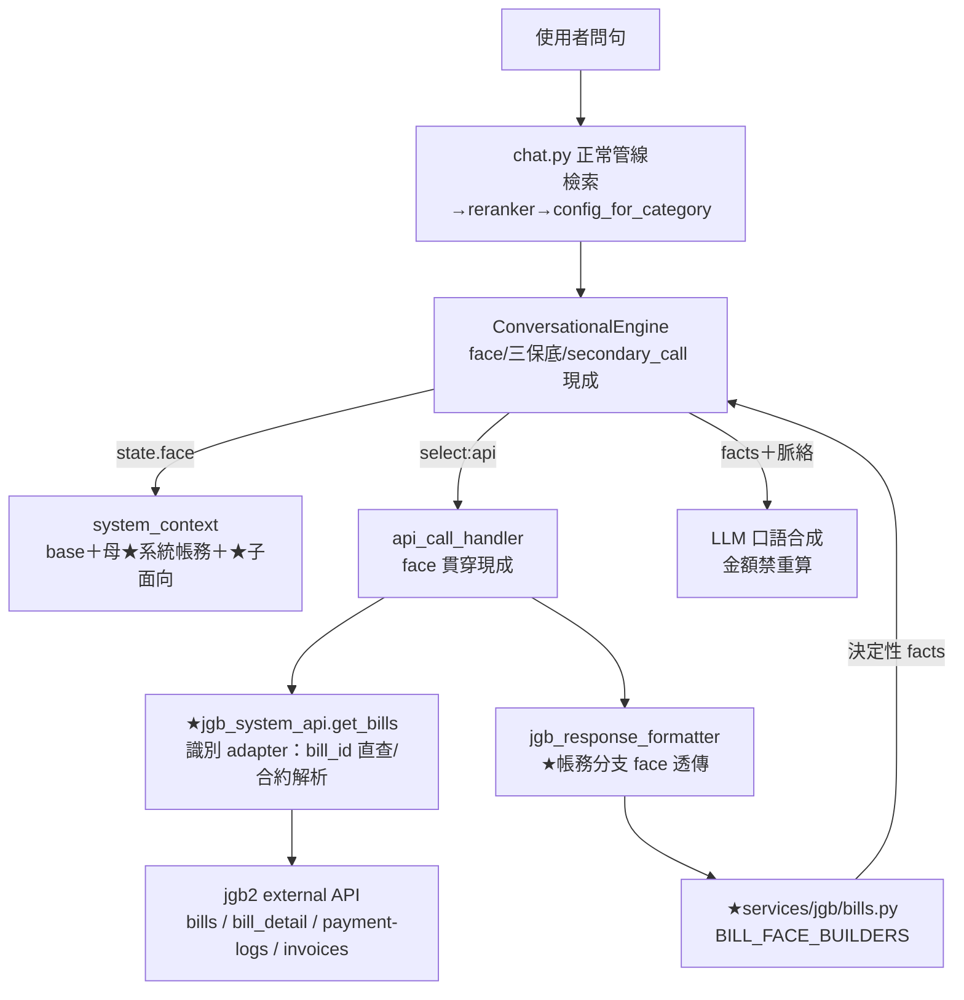
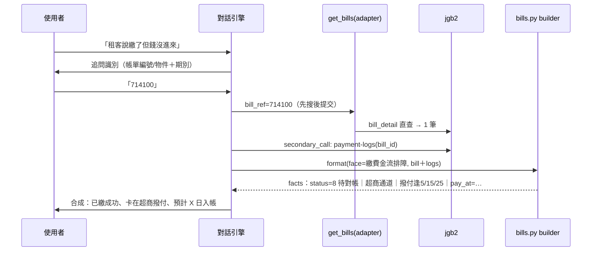

# 技術設計：billing-conversational-facets

> 建立時間：2026-07-03
> 需求文件：requirements.md（R1–R11）
> 研究記錄：research.md（jgb2 五路盤查：金流狀態機 §一、帳單產生 §二、發票 §三、滯納金 §四、API 露出面與分支風險 §五、修正結論 §六）
> 落差分析：gap-analysis.md

## 概述

### 設計目標

在母分類 `系統帳務` 下新增 5 個子面向（`繳費金流排障`、`帳單異常`、`發票`、`滯納金`、`帳單設定引導`），把 v1.1 的單發診斷升級為面向化多輪對話。兩條主線與合約 spec 相同：

1. **資料驅動擴充**：面向掛載、進場、切換、脈絡疊加全由資料驅動，引擎零改（機制已定型並真站驗證）[需求 1.4]。
2. **決定性計算**：金流階段、判因、發票狀態、滯納金規則由 `services/jgb/` 領域檔以 research 證實的狀態機與規則算出；**金額一律引用系統存值，LLM 禁止重算**[需求 7.1, 7.2]。

### 範圍與邊界

- **改動程式**：`jgb_response_formatter.py`（face 透傳補進帳務四分支）、`services/jgb/bills.py`（BILL_FACE_BUILDERS＋builders＋既有 diagnose 函式重用）、`services/jgb/payments.py`/`invoices.py`（builder 素材函式）、`jgb_system_api.get_bills`（識別 adapter，見決策 1）。
- **新增資料**：category_config 6 列（母＋5 子）、系統脈絡 6 列、對話 config 5 筆、知識與錨點（migrations）。
- **不改**：對話引擎（face 貫穿/三保底/secondary_call 全沿用）、檢索 pipeline、合約 6 面向。
- **外部依賴**：帳務 G 清單（research §五候選表）；**分支前提：現行測試基準為 jgb2 preview，preview→master 併版為兩 spec 共同的部署依賴（存在性驅動，不併不炸）**[需求 10.2]。

## 架構設計

### Architecture Pattern & Boundary Map

沿用「設定驅動對話引擎＋領域專屬 formatter」，與合約面向完全同構（★＝本次新增）：



**邊界原則**：面向字面只出現在資料列與 `services/jgb/` 領域檔；引擎/handler/formatter 入口不解讀 [需求 1.4]。點退帳單/封存話題 → scope=switch 導合約域退租收尾 [需求 3.3, 8.2]。

### Technology Stack & Alignment

同 contract-conversational-facets（Python/FastAPI、PostgreSQL＋pgvector、bge reranker、jgb2 X-API-Key）。新知識部署綁 reranker semantic model 重建 [需求 11.4]。

## Components & Interface Contracts

### 元件 1：face 透傳補進帳務 formatter 分支

`format_jgb_response` 現只有 `jgb_contracts` 分支收 face；補 `jgb_bills`／`jgb_bill_detail`／`jgb_payment_logs`／`jgb_invoice_logs` 四分支透傳（簽名不變，face 預設 None → 現行為，零回歸）[需求 1.4, 11.1]。

```python
# jgb_response_formatter.py（僅列變更分支）
if endpoint in ("jgb_bills", "jgb_bill_detail"):
    from services.jgb.bills import format_bill_response
    return format_bill_response(data, user_question=user_question, face=face)
# payment_logs / invoice_logs 分支同理帶 face（未命中 → 現行 diagnose_* 路由）
```

### 元件 2：BILL_FACE_BUILDERS（`services/jgb/bills.py`）

與 contracts.py 同構：註冊表＋純函式 builder，face 未命中 fallback 現行 diagnose 路由（零回歸）。

```python
BillFaceBuilder = Callable[[dict, str], str]   # (bill_row_複合, user_question) -> facts

BILL_FACE_BUILDERS: dict[str, BillFaceBuilder] = {
    "繳費金流排障": build_payment_flow_facts,
    "帳單異常":     build_bill_anomaly_facts,
    "發票":         build_invoice_facts,
    "滯納金":       build_late_fee_facts,
    # "帳單設定引導" 無 builder（select='category' 知識收尾）
}
```

**各 builder 決定性規則**（ground truth 見 research 對應節）：

| builder | 輸入 | 決定性輸出 |
|---|---|---|
| `build_payment_flow_facts` | bill.status/pay_at/complete_at/online_payment_action＋attach `payment_logs`（secondary_call） | 金流階段（1/32/2/8/16 解碼）；**status=8＋超商通道 → 撥付逢 5/15/25 時程**；status=2 無 pay_at → 查無繳費紀錄引導核對；金額不符異常/無分支可判 → 導客服附事實 [需求 2.2, 2.3]；VA 效期 facts 存在性驅動（G）[需求 7.4] |
| `build_bill_anomaly_facts` | bill_detail 品項/期間/rate＋合約計費欄位 | 金額類：逐項列存值（品項/金額/期間/比例），禁重算 [需求 3.2]；缺漏類：產生時點閘（提前一月）/補產規則/封存；可見類：payer＋READY＋active 三條件機械判 [需求 3.1, 3.4] |
| `build_invoice_facts` | bill.invoice_status＋attach `invoices`/`invoice_logs` | 狀態解碼（0/1/2＋Invoice.status 0-4）；**失敗判準＝invoice_status=2 或 number 空**；分類器七類語意；設定未啟用 → 指出設定位置；開立時點依團隊 invoice_mode 三軌 [需求 4.1–4.3]；不虛構號碼/日期 [需求 4.4] |
| `build_late_fee_facts` | 合約滯納金欄位（G：preview 三欄）＋帳單結算值 | **兩套機制分流**：延遲金版（付款後結算公式）vs 排程版（未付款開單，階梯/固定額）；引用存值不重算 [需求 5.1, 5.2]；個案減免導客服 [需求 5.3] |

### 元件 3：識別 adapter（`jgb_system_api.get_bills` 擴充）

**問題**：master bills index 無 bill_id 直查、無名稱 keyword（research §六-1），單端點 search_params 蓋不住「給帳單編號」與「給物件名稱」兩種識別。
**解法**（領域檔內 adapter，零改引擎）：

```python
async def get_bills(self, role_id, user_id=None, month=None, status=None,
                    contract_ids=None, bill_ref=None, **kwargs) -> dict:
    """bill_ref 識別語意參數（adapter）：
    純數字 → 先 get_bill_detail(bill_id) 直查（單筆包成列）；查無 →
    當合約識別 → get_contracts(keyword/ids) 解析 contract_id → bills?contract_id 列候選。
    候選 label 由 result_mapping 讀 title/sub_title/date_expire/total（零硬編）。"""
```

對話 config 的 grounding_scope 維持既有形狀：`endpoint=jgb_bills`、`required_slots=["bill_ref"]`、`search_params` 依序試（後端當裁判慣例）[需求 2.1]。

### 元件 4：面向資料四件套（純資料，零程式）

| 資料 | 內容 | 需求 |
|---|---|---|
| category_config 6 列 | 母 `系統帳務`＋5 子分類（冪等 migration） | 1.1 |
| 系統脈絡 6 列 | 母：帳單狀態機表（1/32/2/8/16/64）＋名詞（待對帳=已繳未入帳）；子各一列 300–600 字（金流排障含超商撥付時程、異常含三條件、發票含三軌時點、滯納金含兩機制、設定引導含分流框架）——內容以 research §一–§四撰寫 | 1.3, 1.5 |
| 對話 config 5 筆 | 4 診斷 select='api'（endpoint=jgb_bills＋adapter）＋設定引導 select='category'；persona_role 用 `pm_billing_*` 專屬鍵；金流排障/發票宣告 secondary_call（payment_logs/invoices attach）[需求 7.5]；persona 各寫面向差異＋「API 現值為準、金額只引用不計算」 | 1.2, 1.6, 2.x–6.x |
| 知識 | 既有 27+ 筆盤點補標（人工確認）＋新知識（Excel 11 則/回測缺口/help 帳務篇）＋**修正 3531/3532（滯納金兩機制）與虛擬帳號過期歸因**＋錨點（一種講法一筆） | 9.1–9.4 |

**form_fill 處置定案**（R8.4，混合制）：6 筆精確診斷句（3495/3496/3498/3499/3503/3504）**維持 form_fill 單發**（精確問句即答體驗好）；新面向錨點只掛模糊起手句；路由測試驗兩者互不誤吸。

### API 設計（帳務 G 清單，jgb2 端）

research §五候選表為完整版；**首波必要**（其餘選配）：

```
（併版）preview → master：滯納金三欄、bills/{id} 直查、is_archived   ← 兩 spec 共同依賴
GET /external/v1/bills        + status 欄補正（現行 bit_status 誤植 bug）
GET /external/v1/payment-logs   （現有欄位已足夠金流排障首版）
```

消費端存在性驅動＋非明文/非預期格式防護（G2 教訓）[需求 10.2, 10.4]。

## 資料流程（主要流程：繳費金流排障）



## 技術決策

1. **識別 adapter 放領域檔而非引擎**：引擎 search_params 是同端點多組嘗試；跨端點解析屬 JGB 領域知識（bill↔contract 關係），放 `jgb_system_api.get_bills`——引擎零改、後端當裁判慣例不變。**參考**：research §六-1。
2. **form_fill 混合制**：精確診斷句保留 form_fill、模糊句進面向——與「進對話 vs 單發」準則一致，避免雙軌遷移期。**參考**：gap-analysis §二 R8。
3. **滯納金 facts 按機制分流不按「版本」**：真碼是兩套機制（付款後 vs 排程），白名單團隊定分支；知識同步修正。**參考**：research §四。
4. **差額發票只解讀不操作**：完整子系統，群組操作導客服。**參考**：research §三。
5. **金額紅線**：builder 只輸出存值欄位（total/final_total/details）；persona＋answer_rules 雙釘「不計算、不改寫數字」（沿封存主詞雙釘模式）。

## 非功能性設計

- **效能**：診斷面向 1–2 次 API/收斂輪＋secondary_call 1 次；三保底已控無效查詢。
- **安全**：payments.data/買受人欄位不進 facts；輸出遮罩協定；身分保底擋無 role_id。
- **錯誤處理**：G 缺欄位降級；金額不符/無分支 → 導客服附事實；沿用 0/N 筆三態。

## 測試策略

- **單元**：各 builder × 狀態/機制矩陣（金流 1/32/2/8/16×通道、發票 invoice_status×number 空、滯納金兩機制×白名單、可見性三條件）；face=None 恆等＋突變驗證。
- **整合**：識別 adapter 三路（bill_id 直查/合約解析/候選）；secondary_call attach；config 進場；跨域 switch 雙向。
- **e2e**（preview 真資料）：每面向口語第一句；金流排障真帳單（84908 的 5 筆可用）；進場路由回歸擴帳務案例（含與合約錨點互不誤吸）[需求 11.2, 11.5]。

## 部署考量

1. migrations（categories/context/configs）→ 2. 知識批次（審核後）＋修正 3531/3532 → 3. reranker 重建 → 4. 清快取 → 5. 煙囪。與合約 spec 部署可合併執行；**preview→master 併版時程由 jgb2 排定，不阻塞（存在性驅動）**。

## 風險與挑戰

| 風險 | 影響 | 機率 | 緩解 |
|---|---|---|---|
| 帳單識別比合約模糊（無編號、口語期別） | 追問輪增加 | 高 | adapter 合約解析路＋候選 label 帶期別/金額；e2e 用真實口語調校 |
| bills API bit_status 誤植 bug | builder 判讀錯位 | 確定存在 | 首版按「值=status 單值」消費（v1.1 同）；G 補正後切換（存在性驅動） |
| 帳務錨點與合約錨點互吸（封存/點退語彙重疊） | 誤進場 | 中 | 錨點避開合約域語彙＋路由測試互不誤吸案例把關 |
| 金額幻覺 | 信任損害 | 低 | 金額紅線雙釘＋e2e token 斷言金額原樣 |

## 參考文件

- requirements.md／research.md／gap-analysis.md
- `contract-conversational-facets/design.md`（同構前例）＋ acceptance-report.md（三保底/調校模式）

### 變更歷史
| 日期 | 版本 | 變更內容 | 修改者 |
|------|------|---------|--------|
| 2026-07-03 | 1.0 | 初始版本（五路盤查後定案） | AI |
