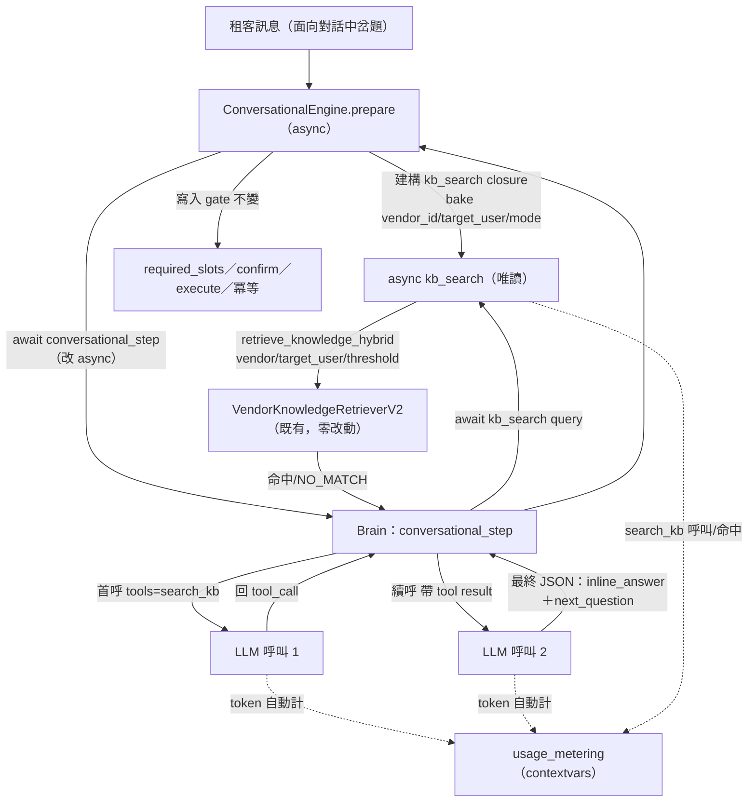
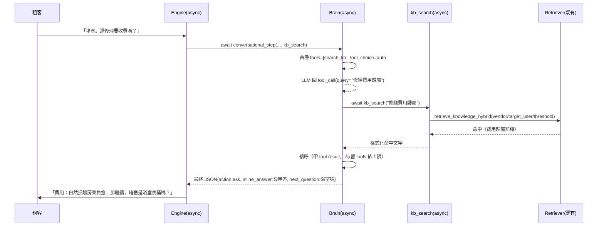

# 技術設計：brain-kb-grounding（Brain 知識庫落地）

> 建立時間：2026-07-20
> 需求文件：requirements.md（R1–R6）
> 研究記錄：research.md（發現流程：Extension／輕量）

## 概述

### 設計目標
在面向對話的決策核心 Brain（`llm_answer_optimizer.conversational_step`）掛載 OpenAI function calling 工具 `search_kb`，使 Brain 在遇到知識性岔題（費用歸屬/時程/規定）時，能查詢既有知識庫檢索服務後再作答，讓 `inline_answer` 從「憑規則文字與模型印象」升級為「知識庫背書」。這是 agent 模式（LLM＋工具＋迴圈）在本系統的最小落點，成效數據供 A 區（進場路由 agent 化）後續評估。

### 範圍與邊界
- **範圍內**：`conversational_step` 改 async 並植入受控工具圈（上限 1）、`search_kb` 工具定義、引擎注入 async 檢索 callback（bake 脈絡）、命中/無命中落地規則、工具圈計量埋點、岔題三態測試。
- **範圍外**：A 區進場路由 agent 化（gate 於回測現代化）、多工具擴充（SOP/lookup/API）、知識內容補建、Brain 輸出 schema 變更、引擎寫入 gate 變更、檢索管線與 embedding 流程變更、回測現代化。

## 架構設計

### Architecture Pattern & Boundary Map

模式：**Callback-injected Tool Loop**——工具圈邏輯內聚於 Brain（決策核心的天然歸屬），檢索脈絡由 async 引擎經 closure 注入，檢索執行留在既有 async 世界。跨 sync/async 邊界的解法為「Brain 改 async、引擎呼叫點加 await」，而非在 running loop 內硬橋接。



**邊界不變量**：`search_kb` 純唯讀；寫入 gate（`conversational_engine.py:664-686` confirm/execute/冪等）不在本設計觸及路徑內。

### Technology Stack & Alignment

| 層級 | 技術 | 版本 | 說明 |
|------|------|------|------|
| LLM 抽象 | llm_provider.chat_completion | 現有 | `**kwargs` 直透 SDK，傳 `tools`/`tool_choice` 零改動（`llm_provider.py:104-114`） |
| LLM SDK | openai | 1.54.0 | 新 tools API（`tools=[]`、`message.tool_calls`），與舊 functions 先例並存 |
| 檢索 | VendorKnowledgeRetrieverV2 | 現有 | `retrieve_knowledge_hybrid` async，零改動、僅新增呼叫方（R2.1） |
| 計量 | usage_metering | 現有 | contextvars 自動涵蓋工具圈第二次呼叫；`set_facet_info` 埋點（R5） |
| 引擎 | ConversationalEngine | 現有 | `__init__` 已注入 retriever、prepare 持 vendor_id、config.persona_role（R2.2 脈絡同源） |

## Components & Interface Contracts

### 元件 1：Brain 工具圈（`conversational_step` 改 async）

**責任**：以 tools 參數發起首呼；若回 tool_call 則 `await kb_search`、將結果注入後續呼；上限 1 次工具呼叫，達限去 tools 強制收斂；產出的最終 JSON schema 與現行完全一致。

**介面定義**：
```python
# services/llm_answer_optimizer.py
from typing import Awaitable, Callable, List, Optional

# 引擎注入的唯讀檢索 callback；回傳「命中組話用文字」或 NO_MATCH sentinel
KbSearch = Callable[[str], Awaitable[str]]  # async (query) -> str

async def conversational_step(  # 由 sync 改為 async（唯一呼叫點加 await）
    self,
    rules_text: str,
    system_context_md: str,
    state: dict,
    user_message: str,
    faces: Optional[List[str]] = None,
    kb_search: Optional[KbSearch] = None,  # 缺省（None）→ 不掛工具＝現行行為（R1.3 安全降級）
) -> Optional[dict]:
    """
    kb_search is None → 維持單次 json_object 呼叫，行為與現行 100% 一致（不掛 tools）。
    kb_search 提供 → 首呼帶 tools=[SEARCH_KB_TOOL]、tool_choice='auto'；
      模型回 tool_call → await kb_search(query)（至多 1 次）→ 注入 tool result → 續呼取最終 JSON；
      達工具上限或第二呼 → 移除 tools 強制收斂為最終 JSON。
    最終 JSON 驗證與現行同（action∈{ask,converge,confirm}、extracted_fields、next_question、inline_answer、scope）。
    任一步例外 → 回 None（呼叫端既有降級，R4.2）。
    """
```

**工具定義（模組常數）**：
```python
SEARCH_KB_TOOL = {
    "type": "function",
    "function": {
        "name": "search_kb",
        "description": "查詢知識庫回答使用者岔出的事實性問題（費用歸屬/時程/規定等）。"
                       "僅在需要事實性答案時呼叫；純槽位填寫、閒聊、可由既有規則回答者不呼叫。",
        "parameters": {
            "type": "object",
            "properties": {
                "query": {"type": "string", "description": "要查詢的知識性問題（精簡主題式）"}
            },
            "required": ["query"],
        },
    },
}
NO_MATCH_SENTINEL = "NO_MATCH"  # kb_search 查無達標命中時的回傳（prompt 契約：據此誠實回退）
MAX_TOOL_CALLS = 1              # R1.2 單輪工具呼叫上限
```

**與需求對應**：1.1（tool call）、1.2（上限強制）、1.3（缺 callback＝現行）、1.4（schema 不變）、3.1/3.2（落地規則注入 prompt）、4.2（例外回 None）。

### 元件 2：引擎檢索 callback 建構（closure 注入脈絡）

**責任**：在呼叫 Brain 前，以當前會話脈絡建構 async `kb_search`，內部呼叫既有 retriever 並將結果格式化為「命中組話文字」或 NO_MATCH。脈絡（vendor_id/target_user/mode）於 closure 固定，與 FAQ 主路徑同源。

**介面定義**：
```python
# services/conversational_engine.py（新增私有方法）
def _make_kb_search(self, config, state) -> "KbSearch":
    vendor_id = state.get("vendor_id")                    # 由 _start 寫入 state（:424）—已驗證
    target_user = getattr(config, "persona_role", None)   # =target_user（:169/174）
    mode = "b2c"  # 交易面向修繕為 b2c；由 config 決定（與檢索主路徑一致）
    # 與 FAQ 主路徑同源閾值：chat.py:2797 用 env KB_SIMILARITY_THRESHOLD（預設 0.55），
    # 非決策樹本地常數 KNOWLEDGE_MIN_THRESHOLD(0.6)。R2.3 要求「與 FAQ 一致」→ 用同一 env。
    kb_threshold = float(os.getenv("KB_SIMILARITY_THRESHOLD", "0.55"))

    async def kb_search(query: str) -> str:
        try:
            results = await self.retriever.retrieve_knowledge_hybrid(
                query=query, vendor_id=vendor_id, top_k=3,
                similarity_threshold=kb_threshold,  # 同 FAQ 主路徑，不另設寬鬆（R2.3）
                target_user=target_user, mode=mode,
            )
            # retriever 已於 application 端以 similarity_threshold 過濾（tech.md 檢索管線）；
            # 回傳非空即達標命中。回傳列每筆含 final `similarity`（_finalize_scores，:346）。
            if not results:
                return NO_MATCH_SENTINEL                 # R3.2 誠實回退訊號
            return _format_kb_hits_for_tool(results)     # 序列化 answer 供 Brain 據實組話
        except Exception as e:
            print(f"⚠️ [search_kb] 檢索失敗，降級：{e}")
            return NO_MATCH_SENTINEL                      # R4.1 失敗＝等同未掛工具（Brain 走無命中回退）
    return kb_search
```

呼叫點（`conversational_engine.py:631`）改為：
```python
step = await self.optimizer.conversational_step(
    rules_text, system_md, state, user_message,
    faces=faces, kb_search=self._make_kb_search(config, state),
)
```

**與需求對應**：2.1（重用 retriever）、2.2（脈絡同源）、2.3（既有閾值）、4.1（失敗降級）、4.4（唯讀）。

### 元件 3：落地規則（prompt 契約 + Brain schema_note）

**責任**：擴充 Brain 的 schema_note（`llm_answer_optimizer.py:855-861` 附近），使模型：(a) 僅對事實性岔題呼叫 search_kb；(b) 有命中時 inline_answer 據檢索文字組話、不引入庫外事實；(c) 收到 NO_MATCH 時誠實告知無法確認或回退規則指引、不憑印象補答；(d) 岔題答完接回 next_question（沿用 R3.1 現行）。

**與需求對應**：3.1、3.2、3.3、1.1。

### 資料模型

工具圈為記憶體內 message 流轉，不落庫。計量需 **1 個新欄位**（覆核修正）——既有 `usage_events` 只有固定欄位 `_FACET_COLS=(facet_key,turn_number)`、`_SCORE_COLS=(knowledge_score,sop_score,decision_case)`、`duration_ms`，**無自由 metadata/JSON 欄位**可放 search_kb 狀態，故 R5.2 的呼叫率/命中率無現成儲存目標。

**決定**：新增單一欄位 `usage_events.search_kb_status VARCHAR(16) NULL`，取值 `null`（本輪未呼叫工具）/`'hit'`（呼叫且命中）/`'miss'`（呼叫但 NO_MATCH）。以既有 fire-and-forget 計量管線寫入（新增 `set_search_kb_status(status)` 對映，比照 `set_facet_info`，`usage_metering.py:200-202` 模式）。附前向 migration（可空、預設 null，不破壞既有查詢）。

```python
# 工具圈記憶體結構（不落庫）
class ToolTurn(TypedDict):
    query: str          # 模型擬定的查詢
    hit: bool           # 是否達標命中
```

**R5.2/R5.3 驗收 SQL（切分鍵＝search_kb_status，落定分母分子）**：
```sql
-- 岔題輪工具呼叫率（分母＝面向對話輪；分子＝呼叫過工具的輪）
SELECT facet_key,
       count(*) FILTER (WHERE search_kb_status IS NOT NULL)::float / count(*) AS call_rate,
       count(*) FILTER (WHERE search_kb_status = 'hit')::float
         / NULLIF(count(*) FILTER (WHERE search_kb_status IS NOT NULL), 0) AS hit_rate
FROM usage_events WHERE facet_key IS NOT NULL GROUP BY facet_key;

-- R5.3 岔題輪 P90 延遲增量：工具輪 vs 一般輪的 duration_ms P90 差
SELECT
  percentile_disc(0.9) WITHIN GROUP (ORDER BY duration_ms)
    FILTER (WHERE search_kb_status IS NOT NULL) AS p90_tool_turn,
  percentile_disc(0.9) WITHIN GROUP (ORDER BY duration_ms)
    FILTER (WHERE search_kb_status IS NULL) AS p90_plain_turn
FROM usage_events WHERE facet_key IS NOT NULL;  -- 增量＝前者−後者，目標 ≤3s
```

### API 設計

無新增對外 API。對外行為經同一 chat API 契約（`routers/chat.py`），與 conversational-repair 通道無關原則一致（requirements R8.3 系承接）。

## 資料流程

### 主要流程圖（岔題命中）



### 資料轉換
- **tool_call → query**：模型自 message.tool_calls[0].function.arguments 解析 `query`。
- **檢索結果 → tool result 文字**：`_format_kb_hits_for_tool` 取 top 命中 answer 串接；無命中回 `NO_MATCH`。
- **tool result → inline_answer**：第二呼由模型據 tool result 組話，引擎沿用 `_inline`（`:659`）注入回覆前綴（現行機制不變）。

## 技術決策

### 決策 1：跨 sync/async 邊界——Brain 改 async（路線 B）而非兩階段編排（A2）

**問題**：sync `conversational_step` 在 running async loop 內被呼叫，工具圈需查 async 檢索，`asyncio.run` 會炸。

**選項**：
1. **B 改 async + async callback**：呼叫點單點加 await；工具圈內聚 Brain；檢索留 async。
2. A2 兩階段（plan/resume，引擎編排）：Brain 保持 sync，但拆兩公開方法、跨界攜帶 message 歷史、工具圈外洩引擎。
3. C sync 檢索路徑：違「非同步優先」、reranker 若 async 仍卡、雙路徑維護。

**決定**：選 **B**。

**理由**：實碼確認 `conversational_step` **生產程式**唯一呼叫點（engine:631）且已在 async 內、引擎已握 retriever＋vendor_id＋persona_role——B 的生產 surface（呼叫點加 await + 簽名 async + 內部工具圈）小於 A2（兩方法 + message 攜帶）。工具圈是「模型帶工具迴圈」，其歸屬本就是 Brain。差距分析原推 A2 係基於未確認單一呼叫點的保守估計，實碼推翻之。

**測試層波及（覆核修正，不得省略）**：async 化在**生產程式**只動一點，但**測試層波及約 25 個檔**——`conversational_step` 被單元測試直接 sync 呼叫（`tests/unit/conversational/test_brain_dialog_history_req.py`、`test_brain_transaction_req.py`、`test_step_scope_face_req.py`）、被引擎測試以 `MagicMock.return_value=dict` 設樁（十餘檔）、被整合測試以 sync `def conversational_step` 假 optimizer 替身（`tests/integration/conversational/*_req.py` 8 檔）。改 async 後這些將取得 coroutine 或 `await dict` 崩潰。**此遷移為本案一級交付項**（tasks 須獨立列出）：(a) brain 單元測試改 async；(b) 引擎測試 mock 全改 `AsyncMock`；(c) 整合/e2e 假 optimizer 改 async def。R6.2「既有測試全綠」以此遷移完成為前提。

**參考資料**：research.md 主題 1；`conversational_engine.py:393,497,631`；`llm_answer_optimizer.py:825`。

### 決策 2：無命中以 sentinel 字串表達 + 明確通過判準（覆核修正）

**問題**：檢索 0 命中如何讓 Brain 走誠實回退而非硬編。本案價值核心＝「查不到就誠實、不憑印象」（R3.2），但既有 Brain 驗證（`llm_answer_optimizer.py:903-914`）只查 action 列舉/型別，**不檢查 inline_answer 是否含庫外事實**——僅靠 prompt 自律不足以擔保價值。

**決定**：
1. kb_search 回固定 `"NO_MATCH"`，prompt 契約規定「收到 NO_MATCH 即誠實告知無法確認或回退規則指引，不補庫外事實」。
2. **R3.2 通過判準明訂（不落在 prompt 自律）**：NO_MATCH 時 inline_answer 須落在**封閉回退話術集**語義（「無法確認／建議洽客服／回退規則既有指引」），**不得出現事實性斷言**（費用歸屬結論、具體金額/天數/期限數字、政策裁定）。
3. **決定性測試 gate**：mock kb_search 回 NO_MATCH 的 e2e/unit，以 negative 斷言鎖住——inline_answer 不得含金額/天數/「由房東負擔」「由租客負擔」等歸屬結論詞；命中案則正向斷言 inline_answer 與檢索 answer 語義一致。此為 R6.3「無事實幻覺」的可執行判準，取代純人工對照。

**理由**：sentinel 字串 in/out 與現有 Brain 慣例一致、schema 不變（R1.4）；判準 2 + 測試 gate 3 把「不憑印象」從 prompt 期望升級為可驗收條件——這是本案價值不被幻覺掏空的關鍵。完全結構化封閉（固定話術常數直出、不經 LLM）為備選，若測試發現模型仍越界再升級。

### 決策 3：沿用既有 KB 閾值，不為工具另設

**決定**：`kb_search` 用 `KB_MIN_THRESHOLD`（現行 0.6）判命中。

**理由**：R2.3 要求與 FAQ 一致；寬鬆閾值會把低相關知識當事實回，放大幻覺風險。

## 非功能性設計

### 效能考量
- 岔題輪新增一次檢索＋一次 LLM 呼叫；目標 P90 增量 ≤3s（R5.3）。
- 非岔題輪：模型不呼叫工具＝單次呼叫，無額外延遲（tool_choice=auto）。
- 無命中快回退（sentinel），不重試、不二次查。

### 安全性設計
- `search_kb` 純唯讀，無寫入副作用（R4.4）。
- 脈絡三過濾（vendor/target_user/mode）於 closure 固定，與 FAQ 同 retriever，杜絕越權檢索（R2.2）。
- 寫入 gate 完全在本設計路徑外，冪等/確認機器值判定不變（R4.3）。

### 可擴展性
- 工具定義為模組常數；未來加 SOP/lookup/API 工具＝再注入 callback，Brain 工具圈框架可複用（本案僅開 search_kb 一個，避免一次過大）。

### 錯誤處理
| 失敗點 | 行為 | 需求 |
|---|---|---|
| kb_search 檢索例外/超時 | 回 NO_MATCH → Brain 誠實回退 | 4.1 |
| 第二次 LLM 呼叫失敗/驗證不過 | conversational_step 回 None → 引擎既有降級、不建單 | 4.2 |
| kb_search=None（未注入） | 單次呼叫＝現行行為 | 1.3 |
| 模型連續要求工具 > 上限 | 去 tools 強制收斂最終 JSON | 1.2 |

## 測試策略

**前置遷移（一級交付，見技術決策 1）**：async 化波及約 25 個測試檔——brain 單元測試改 async、引擎測試 mock 改 `AsyncMock`、整合/e2e 假 optimizer 改 async def。此遷移完成才談 R6.2 全綠。

### 單元測試
- `conversational_step(kb_search=None)`（**async 測試**）：輸出與現行逐位一致（回歸鎖）。
- 工具圈：mock kb_search 命中 → 第二呼帶 tool result、最終 inline_answer 含命中內容（正向語義斷言）。
- 工具圈：mock kb_search 回 NO_MATCH → inline_answer 落封閉回退話術、**negative 斷言不得含金額/天數/歸屬結論詞**（決策 2 gate，R3.2/R6.3 可執行判準）。
- 上限：mock 模型連續 tool_call → 達 1 次後去 tools 收斂。
- 例外：kb_search 拋錯 → 回 NO_MATCH 路徑；第二呼失敗 → 回 None。
- schema：最終輸出仍過既有驗證（action/extracted_fields/next_question）。

### 整合測試
- `_make_kb_search` 以真 retriever 對修繕域知識查詢，驗脈絡過濾（vendor/target_user）生效、閾值＝FAQ 主路徑（`KB_SIMILARITY_THRESHOLD`）一致。
- 計量：工具圈兩次 LLM token 皆入 usage_events；`search_kb_status` 欄位 hit/miss/null 正確落庫，R5.2/R5.3 驗收 SQL 可跑出 call_rate/hit_rate/P90 增量（R5.1/5.2/5.3）。

### 端對端測試（岔題三態）
- **有命中**：修繕面向中問費用 → 查庫答案與知識庫一致、接回槽位（R3.1/R6.3）。
- **無命中**：問庫中無知識的岔題 → 誠實告知、接回槽位、無幻覺（R3.2）。
- **檢索失敗降級**：注入 retriever 故障 → 行為等同現行、面向不中斷（R4.1）。
- **回歸**：無岔題 A 類情境 ≤3 輪不退步；FAQ 快路徑/診斷面向/表單流程一致（R6.1/R6.4）。
- **對照留檔**：費用/規定實測集「憑印象 vs 查庫」對照，供 B 區價值判定與 A 區評估（R6.3）。

## 部署考量

### 環境需求
沿用既有 `KB_SIMILARITY_THRESHOLD`（與 FAQ 主路徑同源，預設 0.55）。可選 `SEARCH_KB_ENABLED` 開關預設開，供快速回退（design 建議加，實作階段定）。**1 個前向 migration**：`usage_events.search_kb_status VARCHAR(16) NULL`（可空、預設 null，不破壞既有查詢，非破壞性）。無 embedding 重建、無 semantic-model 重建。

### 部署步驟
程式碼變更隨 rag-orchestrator 容器部署 + 套用 `search_kb_status` 欄位 migration（可空、向後相容）；照既有 runbook。無破壞性操作。

### 監控與告警
- SQL 監控：search_kb 岔題輪呼叫率、命中率、岔題輪 P90 延遲增量。
- 未達 P90≤3s 目標 → 觸發設計覆核（R5.3）。

## 風險與挑戰

| 風險 | 影響 | 機率 | 緩解策略 |
|------|------|------|---------|
| async 化破壞現行 Brain | 高 | 低 | 單一呼叫點；kb_search=None 分支＝逐位現行；unit 回歸鎖 |
| 工具結果幻覺（庫外事實） | 高 | 中 | NO_MATCH 誠實回退＋prompt 禁庫外事實＋R6.3 對照 |
| 岔題延遲超標 | 中 | 中 | 上限 1、無命中快退、P90 量測與覆核 |
| 模型濫呼工具 | 中 | 中 | prompt 限事實性岔題＋呼叫率監控 |
| 脈絡漏帶越權檢索 | 高 | 低 | closure 固定三過濾、與 FAQ 同 retriever、整合測試驗 |

## 參考文件
- [需求文件](requirements.md)
- [研究記錄](research.md)
- [差距分析](gap-analysis.md)
- 既有：`docs/architecture/facet-architecture.md`、conversational-repair spec（inline_answer R3.1 來源）

## 附錄

### 名詞解釋
- **kb_search callback**：引擎注入 Brain 的 async 唯讀檢索閉包，脈絡（vendor/target_user/mode）於建構時固定。
- **NO_MATCH sentinel**：檢索無達標命中的固定回傳字串，Brain 據此誠實回退。
- **工具圈**：Brain 首呼→（tool_call）→await 檢索→續呼→最終 JSON 的受控迴圈（上限 1）。

### 變更歷史
| 日期 | 版本 | 變更內容 | 修改者 |
|------|------|---------|--------|
| 2026-07-20 | 1.0 | 初始版本（路線 B 定案） | AI |

---

*本文件遵循專案設計原則；介面採 Python type hints（KbSearch/TypedDict），邊界輸入於 kb_search 與最終 JSON 驗證處把關。*
