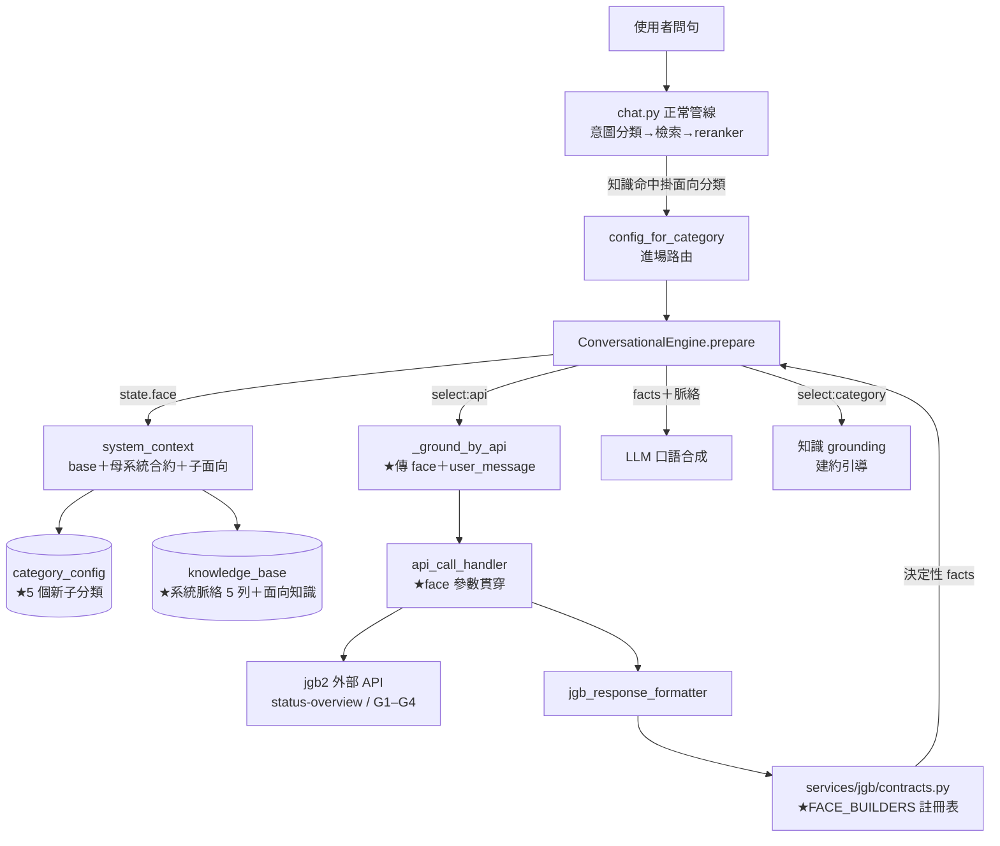
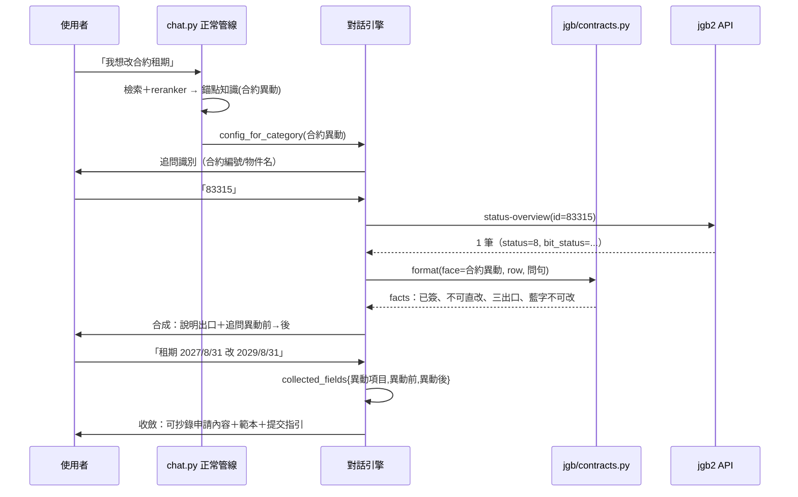

# 技術設計：contract-conversational-facets

> 建立時間：2026-07-02
> 需求文件：requirements.md（R1–R11）
> 研究記錄：research.md（jgb2 ground truth §一–§五、異動申請書契約 §六、面向收斂 §七、設計定案 §八）
> 落差分析：gap-analysis.md（選項評估與建議策略）

## 概述

### 設計目標

在既有面向化架構（`domain-conversational-facets`）之上，於母分類 `系統合約` 下新增 5 個子面向（`合約異動`、`退租收尾`、`續約`、`建約引導`、`簽署排障`），使合約領域對話涵蓋完整生命週期。設計遵循兩條主線：

1. **資料驅動擴充**：面向掛載、進場路由、換面向、脈絡疊加全部由資料（category_config、系統脈絡列、對話 config、知識）驅動，通用引擎僅擴充一個選配參數。
2. **決定性計算**：三出口分流、收尾步驟、簽署進度全部由 JGB 專屬 formatter 以位元旗標與狀態機決定性算出（facts），LLM 僅負責口語合成 [需求 7.1]。

### 範圍與邊界

- **改動程式**：`conversational_engine.py`（1 個呼叫點加參數）、`api_call_handler.py`（參數貫穿）、`jgb_response_formatter.py`（參數貫穿）、`services/jgb/contracts.py`（FACE_BUILDERS 註冊表＋3 個 fact-builder＋續約 facts 補欄位）。
- **新增資料**：category_config 5 列、系統脈絡 5 列、對話 config 5 筆、錨點與面向知識若干（migrations）。
- **不改**：引擎 ask/converge 範式、候選辨識、插點 A/B、檢索 pipeline、reranker、表單機制、DB schema 核心、售前與 `狀態判斷` 行為 [需求 11.1]。
- **外部依賴**：jgb2 外部 API G1–G4 欄位（存在性驅動，兩端獨立部署 [需求 10.2, 10.3]）。

## 架構設計

### Architecture Pattern & Boundary Map

沿用既有「設定驅動對話引擎＋領域專屬 formatter」分層。新增部分以粗框標示：



**邊界原則**：面向字面（`合約異動` 等）只允許出現在兩處——資料列與 `services/jgb/contracts.py`（JGB 領域檔）。通用引擎、handler、formatter 入口僅透傳 `Optional[str]` 參數，不解讀其值 [需求 1.4]。

### Technology Stack & Alignment

| 層級 | 技術 | 對齊說明 |
|------|------|---------|
| 對話引擎 | Python / FastAPI（rag-orchestrator） | 既有 `conversational_engine.py`，僅加選配參數 |
| 決定性解碼 | `services/jgb/contracts.py`（純函式） | 沿用 `ContractBit`／`check_can_*` 既有模式 |
| 面向資料 | PostgreSQL（category_config、knowledge_base、conversational configs） | 沿用 facet-architecture §六 資料佈局 |
| 檢索/排序 | pgvector＋reranker | 不改；新知識部署綁 semantic model 重建 [需求 11.6] |
| 外部資料 | jgb2 `/api/external/v1/contracts/status-overview`（X-API-Key） | 既有 endpoint；G1/G2/G4 欄位擴充，G3 於 bills |

## Components & Interface Contracts

### 元件 1：face 參數貫穿（engine → handler → formatter）

**責任**：把「當輪面向」與「使用者原句」帶到決定性 formatter，使其產出面向對應的 fact 集；未傳或未命中時行為與現行完全一致。

**介面定義**（Python type hints；僅列變更簽名）：

```python
# conversational_engine.py::_ground_by_api 內（呼叫點）
result = await self.api_handler.execute_api_call(
    api_config, session_data, form_data,
    user_input=user_message,              # 既有參數通道，補傳
    face=state.get("face"),               # ★新增選配
)

# api_call_handler.py
async def execute_api_call(
    self, api_config: dict, session_data: dict, form_data: dict,
    user_input: str | None = None, knowledge_answer: str | None = None,
    face: str | None = None,              # ★透傳，不解讀
) -> dict: ...                            # 回傳 {success, data, formatted_response} 不變

# jgb_response_formatter.py
def format_jgb_response(
    api_result: dict, endpoint: str = "", user_question: str = "",
    form_data: dict | None = None,
    face: str | None = None,              # ★透傳至領域模組
) -> str: ...
```

**與需求對應**：[需求 2.2, 3.1, 6.1, 7.1]；預設值 None → 現行為 [需求 11.1]。

### 元件 2：FACE_BUILDERS 註冊表與三個 fact-builder（`services/jgb/contracts.py`）

**責任**：依 face 產出該面向的決定性 facts 文字；欄位存在性驅動 G1–G4 分支 [需求 10.3]。

**介面定義**：

```python
class CheckResult(TypedDict):
    ok: bool                  # 可否執行該操作
    reasons: list[str]        # 不可時的缺件（人可讀）
    facts: list[str]          # 決定性事實句（餵 LLM）

FaceBuilder = Callable[[dict, str], str]   # (contract_row, user_question) -> facts 文字

FACE_BUILDERS: dict[str, FaceBuilder] = {
    "合約異動": build_change_exit_facts,
    "退租收尾": build_closeout_facts,
    "簽署排障": build_sign_facts,
    "續約":     build_renew_facts,        # 包裝既有 check_can_renew ＋ 到期/鏈 facts
    # "狀態判斷" 不註冊 → fallback 現行 _build_response（零回歸）
}

def format_contract_response(
    contracts: list[dict] | dict, user_question: str = "",
    keyword: str = "", face: str | None = None,
) -> str:
    # face 命中註冊表 → builder；否則 → 現行意圖關鍵字/狀態路由
```

**各 builder 的決定性規則**（ground truth 見 research.md §一–§三）：

| builder | 輸入欄位 | 決定性輸出 |
|---|---|---|
| `build_change_exit_facts` | `status` | 三出口 facts：status==1→可直接編輯；status∈{2,4}→取消退回（主路徑保留租客資料）；status>=8→不可直改，複製重建或異動申請書 [需求 2.2, 2.6]；附「藍字不可改」事實 |
| `build_closeout_facts` | `bit_status`、`date_end`、`early_termination_*` | 步驟鏈 facts：提前解約(256/512)→點退(64/128)→封存（通用指引；G3 後個人化）→轉歷史時點（每日排程）[需求 3.1, 3.3, 3.4]；重用 `check_can_move_out`（點交點退互不相依 [需求 3.2]） |
| `build_sign_facts` | `bit_status`、`to_user_email/phone`、`to_user_connect`；G1 時間戳、G2 登入信箱（存在才輸出） | 「還差誰簽」（bit 4/8）＋發送通道＋綁定狀態 [需求 6.1, 6.2]；G1→效期判斷與過期清資料說明 [需求 6.4]；G2→信箱錯配比對 [需求 6.3] |
| `build_renew_facts` | `date_end`、`father_id`、`is_tenant_registered`、G4 `is_newest` | 剩餘天數、可否系統續約（雙簽完成＋未過期）、免註冊單方確認/已註冊重簽、已被續約提示 [需求 4.1, 4.3, 4.5] |

**與需求對應**：[需求 2.2, 3.1–3.5, 4.1–4.5, 6.1–6.4, 7.1, 7.4, 10.3]。

### 元件 3：面向資料四件套（純資料，零程式）

**責任**：面向的進場、脈絡、追問、知識 [需求 1.1–1.3]。

| 資料 | 內容 | 需求 |
|---|---|---|
| `category_config` 5 列 | `合約異動`／`退租收尾`／`續約`／`建約引導`／`簽署排障`，parent=`系統合約` → `_domain_faces` 自動納入換面向集合 | 1.1, 8.1 |
| 系統脈絡 5 列 | `categories=[<面向>]` 各一列（300–600 字）；`合約異動` 列含申請書三段格式骨架（research.md §八-4） | 1.3, 2.4, 1.5 |
| 對話 config 5 筆 | `topic_scope.category=<面向>`；診斷 4 面向 `grounding_scope.select='api'`（endpoint=jgb_contracts，沿用狀態判斷參數形狀）；`建約引導` select='category' | 1.2, 5.1 |
| 知識 | 每面向錨點＋知識 8–15 筆（help 官方 45 篇＋Excel 案例轉製；`建約引導` 掛共同承租/條款法律） | 5.5, 9.1–9.3 |
| **既有知識盤點＋補標** | 既有 JGB 知識中合約類逐筆歸屬：一筆知識掛一個主面向（互斥）；不適合對話化者維持單發不掛面向。backfill migration（前例：conversational-diagnosis backfill） | 9.3, 11.2 |

**進對話 vs 單發準則**（設計審查議題 3 定案）：**具體操作問句**（「補充條款在哪改」）→ 單發知識、不掛錨點；**模糊起手問句**（「我要開始簽約」「合約怎麼建」）→ 錨點進對話兩輪分流。e2e 各驗一例。

**persona 規則分工**（research.md §八-5）：五份獨立、只寫面向差異——`合約異動`：追問「要改什麼」＋申請書槽位（異動項目/異動前/異動後）；`退租收尾`：確認退租型態；`續約`：直趨收斂；`建約引導`：兩輪分流（方式/對象）＋「涉及特定合約現況→scope=switch」[需求 5.1, 5.3, 5.4]；`簽署排障`：確認問題現象。

### 元件 4：secondary_call 契約（G3-gated，本 spec 僅定契約）

**責任**：單筆收斂後執行第二個 API 查詢（如退租收尾查帳單封存），結果併入 formatter [需求 3.3 後態]。

```python
# grounding_scope 擴充（設定，通用；未宣告＝不執行）
{
  "secondary_call": {
    "endpoint": "jgb_bills",
    "params": {"contract_id": "{row.id}"},      # 以主查詢結果列插值
    "attach_as": "bills"                        # formatter 以此鍵取得
  }
}
```

實作條件：G3 欄位上線。未實作期間 `build_closeout_facts` 輸出通用封存指引 [需求 3.3, 7.4]。

### 資料模型

無新表、無 schema 變更。沿用：`category_config(category_value, parent_value, is_active, display_order)`、`knowledge_base(category, categories, target_user, metadata)`、對話 config（`topic_scope`、`grounding_scope`、`persona_role`）。

### API 設計（外部契約：G1–G4，jgb2 端）

```
GET /api/external/v1/contracts/status-overview   （既有，加欄位）
  + contract_inviting_at / contract_inviting_expire_at
  + contract_inviting_sign_at / contract_finish_sign_at        (G1)
  + to_user_login_email                                         (G2)
  + is_newest                                                   (G4)

GET /api/external/v1/bills                        （既有，加欄位）
  + is_archived / archive_ymd                                   (G3)
```

AIChatbot 端以「欄位存在才輸出對應 facts」消費，缺欄位不報錯 [需求 10.1–10.3]。

## 資料流程

### 主要流程：合約異動樹（含申請書出口）



### 面向切換資料流 [需求 8.1–8.3]

- **面向內**（診斷 ↔ 診斷）：brain 回 `face` → 換系統脈絡；`collected_fields`（含已鎖定合約）在 state 上自然保留，不重問識別 [需求 8.2]。
- **跨 grounding 型態**（建約引導 → 診斷）：brain 判 `scope=switch` → 關會話 → chat.py 對當前訊息重路由 → 進正確 config（機制現成，research.md §八-3）。

### 資料轉換

`bit_status:int` →（`ContractBit` 位元判斷）→ `CheckResult.facts:list[str]` →（builder 組裝）→ facts 文字 →（LLM＋面向脈絡）→ 口語回覆。全程 API 現值優先，脈絡僅供解讀 [需求 7.2]。

## 技術決策

### 決策 1：formatter 面向感知的傳遞方式
**問題**：新面向需要 formatter 產出不同 fact 集，但現行鏈路不傳 face/user_message。
**選項**：A. 選配參數貫穿＋JGB 檔內註冊表；B. 超集 facts 由 LLM 自選；C. 每面向獨立 endpoint 包裝。
**決定**：A。**理由**：改動最小（3 個簽名加選配參數）、決定性選材不靠 LLM（違反 B）、不複製端點（違反 C）；預設 None 保證零回歸。面向字面落在 JGB 領域檔，符合「引擎零硬編、JGB 邏輯獨立檔案」既有慣例。**參考**：gap-analysis §二、research.md §八-1。

### 決策 2：退租收尾的帳單資料來源
**問題**：單 config 單 endpoint，收尾需要 contracts＋bills。
**決定**：兩階段——本 spec 通用指引；G3 上線後以通用 `secondary_call` 設定機制補（元件 4）。**理由**：不為單一面向改引擎；G3 時程外部不可控，降級態即常態設計 [需求 7.4]。**參考**：research.md §八-2。

### 決策 3：跨 grounding 型態切換走 scope=switch
**問題**：face 切換不換 config，建約引導（知識型）切診斷（API 型）會 grounding 錯配。
**決定**：面向內走 face、跨型態走 scope=switch 重路由。**理由**：scope=switch 本來就換 config，零機制改動；護欄與售前不波及。**參考**：research.md §八-3、gap-analysis §二 R8。

### 決策 4：申請書產出＝脈絡骨架＋LLM 填值（非 formatter 模板）
**問題**：可抄錄文字要決定性模板還是 LLM 合成。
**決定**：固定三段骨架寫入 `合約異動` 面向脈絡，LLM 按骨架填 `collected_fields`；e2e 斷言關鍵 token。**理由**：申請內容含使用者口語訴求的轉寫（異動前→後），本質是語言工作；骨架＋斷言兜住格式漂移。**參考**：research.md §六、§八-4。

## 非功能性設計

### 效能考量
- 系統脈絡逐面向載入（base＋母＋單一子），實測母 994 字＋子 ≤600 字，總量 <2200 字，遠低於 4500 上限 [需求 1.5]；per-key 快取沿用。
- face 參數不增加 API 呼叫次數；secondary_call（未來）僅單筆收斂後執行一次。

### 安全性設計
- jgb2 API 沿用 X-API-Key per-vendor 驗證與 role_id 白名單；G2 新增之登入信箱屬個資，僅用於錯配比對事實句，不在回覆中完整揭露（遮罩形式：`g***@gmail.com`）。
- 申請書出口不代填個資欄位，僅轉寫使用者提供之異動內容。

### 可擴展性
- 新面向＝資料四件套（零程式）[需求 1.4]；FACE_BUILDERS 為 JGB 檔內字典，帳單領域未來以 `services/jgb/bills.py` 平行擴充。
- G1–G4 欄位存在性驅動：jgb2 部署先後不影響 AIChatbot [需求 10.2, 10.3]。

### 錯誤處理
- API 失敗/0 筆/N 筆：沿用 `_ground_by_api` 三態（ask 降級、清無效槽、候選反問）[需求 7.3]。
- face 未命中註冊表：fallback 現行路由（不報錯）。
- G 欄位缺失：builder 略過該 facts 分支，輸出既有欄位 facts＋（必要時）引導問句 [需求 7.4]。
- 特殊個案/事故語彙：persona 規則判 scope=switch 或直接導客服話術 [需求 5.6]。

## 測試策略

### 單元測試（決定性層）
- 各 builder × 狀態/旗標矩陣：三出口（status 1/2/4/8/16…）、收尾步驟鏈（256/512/64/128 組合×點交獨立）、簽署進度（bit 4/8×通道×G1/G2 有無欄位）、續約（到期前後×免註冊×is_newest 有無）[需求 11.3]。
- face 未註冊 fallback＝現行輸出（狀態判斷矩陣不變）[需求 11.1]。

### 整合測試
- 5 個 config 進場→追問→鎖定→收斂全流程（mock API）；面向內 face 切換保留合約鎖定 [需求 8.2]；scope=switch 重路由 [需求 8.1]。
- 申請書收斂 payload 完整性（三槽位齊→產出；缺→追問）[需求 2.4]。

### 端對端測試（正常管線）[需求 11.4, 11.5]
- 每面向口語第一句進場：意圖分類→檢索→reranker→config_for_category→引擎（型態照既有 e2e 12 案）[需求 8.3]。
- 收斂後下一句回正常流程（含 reranker）；scope=switch 銜接。
- 申請書出口關鍵 token 斷言（`service@jgbsmart.com`、「異動前」「異動後」、合約 ID）。
- 回歸：狀態判斷既有 363 測試全綠＋檢索 80% 基準集重跑 [需求 11.1, 11.2]。

## 部署考量

### 部署步驟（migrations 依序）
1. `add_contract_facet_categories_v2.sql`：category_config 5 子分類（parent=`系統合約`）。
2. `seed_contract_facet_system_context.sql`：系統脈絡 5 列（含申請書骨架）。
3. `seed_contract_facet_configs.sql`：對話 config 5 筆。
4. `backfill_contract_knowledge_facet_categories.sql`：既有合約類知識補標主面向（盤點清單先經人工確認）。
5. 知識匯入（審核通過後）：錨點＋面向知識。
6. **reranker semantic model 重建**（綁定步驟，不可省）[需求 11.6]。
7. 服務重啟或後台儲存任一 config（清系統脈絡快取）。

### 外部依賴時程
G1–G4 由 jgb2 端獨立部署；AIChatbot 不等待（存在性驅動）。G3 上線後追加 secondary_call 任務。

### 監控與告警
- 進場命中率：新錨點知識檢索排名（回測基準集）。
- 對話收斂率／降級率（既有 conversational 記錄）。
- formatter fallback 次數（face 未命中計數 log）。

## 風險與挑戰

| 風險 | 影響 | 機率 | 緩解策略 |
|------|------|------|---------|
| 新錨點與既有知識/售前搶路由 | 進錯面向或不進場 | 中 | target_user 隔離＋80% 基準集回測＋reranker 重建 [需求 11.2, 11.6] |
| formatter 改動波及狀態判斷 | 既有面向回歸 | 低 | face=None fallback＋既有矩陣測試先綠再動 [需求 11.1] |
| 申請書產出格式漂移 | 可抄錄性下降 | 低 | 脈絡骨架＋e2e token 斷言 |
| G1–G4 時程延宕 | 簽署排障/收尾部分分支缺 | 中 | 降級分支即常態設計，欄位上線即自動啟用 [需求 10.3] |
| 五面向知識品質不齊 | 回答空泛 | 中 | 官方文章為主幹＋程式盤查修正版為準＋人工審核 [需求 9.4, 9.5] |

## 參考文件

- [需求文件](requirements.md)
- [研究記錄](research.md)（jgb2 ground truth、申請書契約、面向收斂、設計定案）
- [落差分析](gap-analysis.md)
- `.kiro/specs/domain-conversational-facets/facet-architecture.md`（面向化架構定案）
- `.kiro/specs/conversational-diagnosis/research.md`（引擎整合 ground truth）

## 附錄

### 名詞解釋
- **face**：對話 state 中的當輪面向鍵，等於 category_config 子分類值。
- **fact-builder**：以合約資料列決定性產出事實句集合的純函式。
- **三出口**：合約異動分流結果（直改／取消退回／複製重建或申請書）。
- **存在性驅動**：以 API 回傳欄位是否存在決定分支啟用，取代版本協商。

### 變更歷史
| 日期 | 版本 | 變更內容 | 修改者 |
|------|------|---------|--------|
| 2026-07-02 | 1.0 | 初始版本 | AI |

---

*本文件遵循專案設計原則：介面採 Python type hints 強型別、決定性層與語言層分離、所有元件標注需求追溯 ID。*
