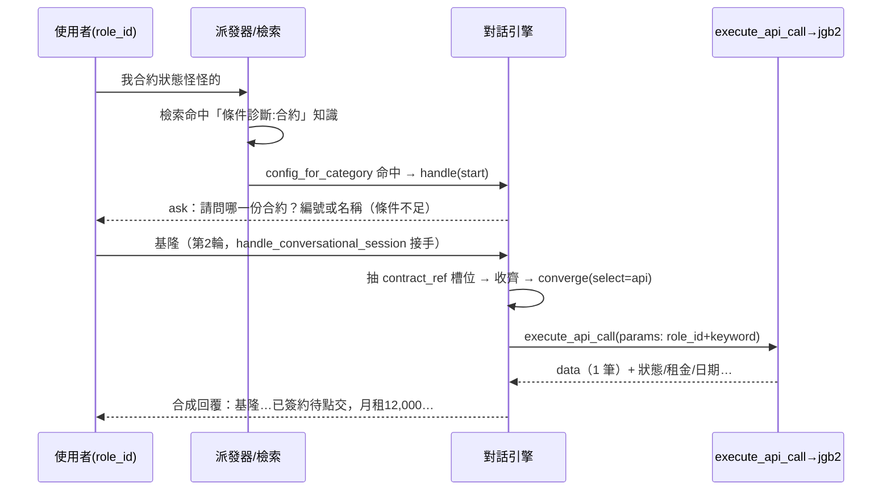

# 技術設計：conversational-diagnosis（對話式診斷框架，合約為首案）

> 建立時間：2026-06-30　需求：requirements.md（R1–R8）｜研究：research.md｜落差：gap-analysis.md
> 性質：Extension（既有對話引擎 + API 呼叫 + 檢索路由之加性擴充）

## 概述

### 設計目標
為既有對話引擎新增兩項貫通能力——**(A) API grounding**（收斂時以 API 回傳為合成底稿）與 **(B) 分類路由進對話**（依檢索到知識的分類導入診斷面向）——並以**讀設定、不寫死面向**的方式實作，使合約為第一個可運作面向，未來 `jgb_*` 面向零改程式擴充。[需求 R1–R8]

### 範圍與邊界
**涵蓋**：對話引擎 `select:"api"` grounding + 設定驅動收斂門檻、`_build_knowledge_response` 分類路由、`conversational_config` 依分類查設定、前端設定頁 api 欄位、合約首案資料。
**不涵蓋**：派發器/檢索/reranker/DB schema/後端設定 payload/既有表單機制/`api_call_handler` 內部邏輯（全部不改，只重用）；售前流程不變；寫入類（報修建立）維持表單；prod base_url 切換（上線作業）。

## 架構設計

### Architecture Pattern & Boundary Map
擴充「對話引擎（Adaptive Q&A → Converge → Ground → Synthesize）」並在「檢索→處理」邊界新增分類路由出口。

```mermaid
graph TD
    M[/api/v1/message 派發器] --> R[Step4 智能檢索]
    R --> KB[_build_knowledge_response]
    KB --> Q{best_knowledge 分類<br/>= 診斷面向?}
    Q -->|否| F[既有:觸發表單 / 直接知識]
    Q -->|是 ★③| CFG[config_for_category ★③附]
    CFG --> ENG[engine.handle start_if_absent]
    ENG --> STEP[conversational_step: ask / converge]
    STEP -->|ask| A1[回追問（條件不足）★①]
    STEP -->|converge| G{grounding_scope.select}
    G -->|vector/category/ids| GK[撈知識（既有）]
    G -->|api ★②| GA[execute_api_call 重用]
    GA --> CNT{回傳筆數}
    CNT -->|1| SY[合成回覆]
    CNT -->|0| A0[ask:查無，重問識別]
    CNT -->|N| AN[ask:列候選+存 state]
    GK --> SY
    classDef new fill:#eef7ee,stroke:#3a3;
    class CFG,ENG,GA,CNT,AN,A0 new;
```

> 第 2 輪以後：使用者回覆 → 派發器 Step0 `handle_conversational_session`（既有，檢查 `form_id='conversational'`）自動接手，`prepare` 以 `config_key` 還原面向設定。**續對話零改。**

### Technology Stack & Alignment
| 層級 | 技術 | 說明 |
|------|------|------|
| 對話引擎 | Python / `ConversationalEngine`（既有） | 加 `select:api` 分支、注入 `api_handler` |
| API 呼叫 | `APICallHandler.execute_api_call`（既有，不改） | slot 走 `form_data` 通道重用 |
| 設定 | `ConversationalConfig` dataclass + DB（對話規則） | 加 `by_category` 索引/查詢 |
| 前端 | Vue `ConversationalConfigView.vue` | grounding 加 `api` 選項 + 欄位 |
| 型別 | Python type hints（`Optional`、dataclass、TypedDict 風格 dict 契約） | 邊界明確 |

## Components & Interface Contracts

### 核心元件 1：API grounding（engine `_converge_grounding` 新分支）[R3.1–R3.6, R6.3]
```python
# conversational_engine.py — __init__ 加注入
def __init__(self, db_pool, optimizer, retriever, get_system_context,
             rules_loader, api_handler):  # ★ 新增 api_handler
    ...
    self.api_handler = api_handler  # APICallHandler（get_api_call_handler(db_pool)）

# _converge_grounding 內新增分支（select=="api"）
# 介面語意：回 (grounding_text, ctx, cta_mode) 沿用既有；多筆/0 筆改回 ask（見元件3）
async def _ground_by_api(self, state: dict, config: "ConversationalConfig"
                         ) -> "ApiGroundingResult":
    """以收齊槽位呼叫設定指定之 API，回傳分類後的結果（1/0/N）。"""
```
- 流程：組 `session_data = {role_id, vendor_id, session_id, user_id}`（取自 state）+ `form_data = state['collected_fields']` → 呼叫
  `self.api_handler.execute_api_call(api_config, session_data, form_data)` → 依 `grounding_scope.result_mapping.list_path` 取資料列、判筆數（1/0/N）；單筆以 `result_mapping` 欄位 + `formatted_response` 組 grounding 文字。
- `api_config` 由 `config.grounding_scope` 提供：`{endpoint, params}`（params 用 `{session.role_id}`/`{form.<slot>|if_numeric|if_text}`）。**api_call_handler 不改**。
- **零合約硬編**：清單路徑、id/label/refine 欄位一律取自 `result_mapping`（R6.1）。

### 核心元件 2：設定驅動收斂門檻（`_has_basic_info`）[R2.1, R2.5, R6.1]
```python
def _has_basic_info(fields: dict, config: "ConversationalConfig") -> bool:
    """有設 required_slots → 全部到齊才算足夠；未設 → 維持售前預設（identity/scale/pain）。"""
    required = (config.grounding_scope or {}).get("required_slots")
    if required:
        return all(fields.get(k) for k in required)
    return any(k in fields for k in ("identity", "scale", "pain"))  # 既有預設
```
- 呼叫點 `prepare`（:134）改傳 `config`。售前無 `required_slots` → 行為不變。

### 核心元件 3：API 結果三路處置 + `prepare` 控制流（多筆/0 筆/單筆）[R3.4, R3.5, R3.6]
> ⚠️ 控制流（審查 Issue 2）：API 結果可使「已決定 converge」**降級回 ask**，故須在 `prepare` 明確處理，並為「候選選擇輪」加 **pre-LLM 確定性分支**。

```python
ApiGroundingResult = Dict[str, Any]
#   {"kind":"converge", "grounding": str}                       # 1 筆 → 合成
#   {"kind":"ask", "answer": str}                                # 0 筆 / API 失敗 → 重問或降級
#   {"kind":"ask", "answer": str, "candidates":[{"id","label"}]} # N 筆 → 列候選
```

**`prepare` 整合（兩個明確插點）**：
```python
async def prepare(self, ...):
    state = await self.get_state(...) or await self._start(...)
    config = ... ; rules_text = ...

    # 【插點 A — pre-LLM 候選選擇輪（審查 Issue 2）】
    # state 有未決候選時，本輪為「選擇」而非新問題：確定性比對，不經 LLM step。
    if state.get("pending_candidates"):
        picked = _match_candidate(user_message, state["pending_candidates"])  # 序號/名稱/id
        if picked is None:
            return {"kind": "ask", "answer": _ask_pick_again(state["pending_candidates"])}
        state["collected_fields"]["contract_id"] = picked["id"]
        state.pop("pending_candidates"); await self._save(...)
        # 落入下方收斂（以單一 id 走 select:api）

    step = self.optimizer.conversational_step(rules_text, system_md, state, user_message)
    # ...（既有 extracted_fields / ask / 門檻補問，元件①）...

    if step["action"] == "converge":
        gscope = (config.grounding_scope or {})
        if gscope.get("select") == "api":
            r = await self._ground_by_api(state, config)          # 元件1
            if r["kind"] == "ask":                                 # 【插點 B — converge 降級回 ask】
                if r.get("candidates"):
                    state["pending_candidates"] = r["candidates"]; await self._save(...)
                return {"kind": "ask", "answer": r["answer"]}
            grounding = r["grounding"]                             # 1 筆 → 照常合成
        else:
            grounding, ctx, cta = await self._converge_grounding(...)  # 既有知識 grounding
        return {"kind": "converge", "grounding": grounding, ...}
```
- API 例外/逾時：`_ground_by_api` 回安全 `ask`（請稍後再試/轉專人），不拋出（R3.6）。
- 確定性比對 `_match_candidate`：依使用者輸入比對候選的序號（1/2/3）、`label`（物件名稱）或 `id`；無法判定 → 再次列出反問。
- 售前（`select` 非 api）完全走既有 `_converge_grounding`，插點 A/B 不觸發（無 pending_candidates、select≠api）。

### 核心元件 4：依分類查設定（`conversational_config`）[R1.3, R6.2]
```python
# _cache 新增 by_category 索引；_load 時建立
_cache["by_category"]: Dict[str, ConversationalConfig]  # category_value -> config

async def config_for_category(db_pool, category: Optional[str]
                              ) -> Optional["ConversationalConfig"]:
    """依知識分類取「topic_scope.mode=='category' 且 category 命中」之啟用設定；無則 None。"""
```
- 建索引：遍歷設定，`topic_scope.mode=='category'` 者以其 `category` 為鍵入 `by_category`。

### 核心元件 5：分類路由出口（`chat.py handle_retrieval` 知識分支入口）[R1.1, R1.2, R1.4, R4.4]
> ⚠️ 注入點（審查 Issue 1）：**置於 `handle_retrieval` 決策為 `knowledge` 後、串流/表單分支之前**，**不放在 `_build_knowledge_response` 內部**。理由：`_build_knowledge_response` 回 `VendorChatResponse` 且其呼叫端會再包串流；若於該深度回傳 `_conversational_respond` 的 `StreamingResponse` 會雙重包裝/型別不符。於 `handle_retrieval` 入口攔截可直接回 `_conversational_respond`（其本身已處理 stream/非 stream + 降級）。

```python
# handle_retrieval：decision['type']=='knowledge' 後、進入 stream/form 分支之前
best_knowledge = decision['knowledge_list'][0] if decision['knowledge_list'] else None
if best_knowledge and best_knowledge.get('similarity', 0) >= form_trigger_threshold:
    diag_cfg = await config_for_category(db_pool, _knowledge_category(best_knowledge))
    if diag_cfg is not None:
        # _conversational_respond 已封裝 stream→SSE / 非 stream→JSON / 降級→None
        resp = await _conversational_respond(request, req, start_if_absent=True, config=diag_cfg)
        if resp is not None:
            return resp
        # 降級（引擎 brain 失敗）→ 落回既有知識/表單處理
# 否則：維持既有 stream/form/知識回應分支不變
```
- **重用**：直接呼叫既有 `_conversational_respond(start_if_absent=True, config=diag_cfg)`（chat.py:769）——不需新寫 `_start_diagnosis_conversation`，回應型別契約與既有對話一致。
- **降級**：`_conversational_respond` 回 None（引擎降級）時，落回既有知識/表單處理，不阻斷（R7）。
- `_knowledge_category(best_knowledge)`：取該知識的分類（`categories` 多值取首個會話診斷分類或既有 `category` 欄位，實作以實際欄位為準）。

### 核心元件 6：後台設定頁（前端）[R5.1–R5.4]
- `ConversationalConfigView.vue`：grounding 下拉加 `api`；`g_select==='api'` 時顯示 `endpoint`（下拉，來源 api_endpoints/jgb_*）、`params`（key→模板字串）、`required_slots`（字串清單）輸入。
- 組 payload 時把上述塞進 `config.grounding_scope`；後端 payload 不變。

### 資料模型：ConversationalConfig.grounding_scope（api 型）
```jsonc
{
  "select": "api",
  "endpoint": "jgb_contracts",
  "required_slots": ["contract_ref"],
  "params": {
    "role_id": "{session.role_id}",
    "contract_ids": "{form.contract_ref|if_numeric}",
    "keyword": "{form.contract_ref|if_text}"
  },
  // ⚠️ result_mapping（審查 Issue 3）：多筆/單筆結果如何取清單與識別/顯示欄位——
  //   設定化，使多筆處理不寫死合約欄位（帳單/修繕面向填各自欄位）。
  "result_mapping": {
    "list_path": "data",        // API 回傳中「資料列陣列」的路徑（jgb2: result['data']['data']）
    "id_field": "id",           // 候選/單筆的識別欄位
    "label_field": "title",     // 候選顯示用欄位（物件名稱）
    "refine_param": "contract_ids"  // 選定候選後，以 id 帶回此參數做單筆收斂
  }
}
```
> 註1：slot 透過 `form_data` 通道傳入，故模板用 `{form.<slot>}`（重用既有 resolver，不新增語法）。
> 註2：`_ground_by_api` 與 `_match_candidate` 一律由 `result_mapping` 取欄位，程式中不得出現合約欄位名硬編（R6.1）。未來面向（帳單等）只需於設定填各自 `list_path/id_field/label_field`。

## 資料流程

### 主要流程圖（合約首案，2 輪）


### 資料轉換
- 對話 `collected_fields` → `form_data` → `_resolve_param_value` → API 參數。
- API `data` → 筆數判斷（1/0/N）→ grounding 文字 → `synthesize_presales_answer` → 自然語回覆。

## 技術決策

### 決策 1：API grounding 重用 `execute_api_call`，slot 走 form_data 通道
**問題**：引擎要打 API 但不應重寫 API 邏輯，且 resolver 無 `{slot.x}`。
**決定**：把 `collected_fields` 當 `form_data` 傳入既有 `execute_api_call`，config 用 `{form.<slot>}`。
**理由**：api_call_handler / resolver **零改**（R7.3）；參數映射與表單一致、可直接從表單搬遷。

### 決策 2：收斂門檻設定化、向後相容
**決定**：`_has_basic_info` 讀 `required_slots`，無則維持售前預設。
**理由**：R2 條件不足靠此；售前不回歸（R7.1）。

### 決策 3：多筆→存候選 state + 下一輪確定性對應（含 prepare pre-LLM 分支）
**決定**：N 筆回 ask 並存 `pending_candidates`；下一輪以 **pre-LLM 確定性分支**（不依賴 LLM step）比對使用者選擇 → 設 id 槽位 → 單筆收斂。候選的清單/識別/顯示欄位由 `result_mapping` 設定（不寫死合約）。
**理由**：留在既有 ask/converge 範式、避免重複打 API 與非結構化反問（R3.5）；確定性比對使選擇可測、通用（審查 Issue 2/3）。

### 決策 4：分類路由置於 `handle_retrieval` 知識分支入口（非 `_build_knowledge_response` 內部）
**決定**：在 `handle_retrieval` 決策為 `knowledge` 後、串流/表單分支之前插分類路由；命中→`_conversational_respond` 起對話，否則維持既有。
**理由**：避免在回 `VendorChatResponse` 的深層函式回傳 `StreamingResponse` 造成型別/雙重包裝衝突；分類於檢索後已知；topic-gated（不吸全角色流量，R7.2）（審查 Issue 1）。

### 決策 5：全設定驅動、不寫死面向
**決定**：select/endpoint/params/required_slots/topic_scope 皆讀設定；程式無合約硬編。
**理由**：R6 通用性；未來面向只加設定 + 標分類。

## 非功能性設計
- **效能**：API grounding 僅在收斂單次呼叫；多筆走 state 避免重複呼叫；合約 API 已限欄位 select。
- **安全性**：role_id 由可信呼叫端帶入；API Key 由既有 `JGBSystemAPI` 環境管理；查無不杜撰（R3.4）。
- **可擴展性**：新面向 = 1 筆對話規則 + 標分類 + （如新端點）api_registry 既有對應；零改程式（R6.2）。
- **錯誤處理**：API 失敗/逾時→安全 ask 降級（R3.6）；引擎既有 brain 失敗→回 None 落回一般流程（不變）。

## 測試策略
- **單元**：`_has_basic_info`（有/無 required_slots）；`config_for_category`（命中/未命中/未啟用）；`_ground_by_api` 三路（1/0/N，mock api_handler）；參數映射（slot→form_data）。[R2,R3,R1.3]
- **整合**：`_build_knowledge_response` 分類命中→起對話 vs 未命中→表單（mock engine/檢索）。[R1]
- **端對端（真 jgb2 API，role_id=20151）**：模糊→追問→收齊→真狀態/資訊；一般問題轉知識；0 筆重問、多筆反問；售前流程不回歸。[R4,R8]
- 放置：`tests/unit|integration/conversational/`、`tests/e2e/chat_flow/`。

## 部署考量
- **環境**：沿用既有；上線把 `JGB_API_BASE_URL`/`JGB_API_KEY` 由 preview 換 prod（既有 env，非本功能）。
- **部署步驟**：rag-orchestrator 程式更新（無 migration）；knowledge-admin 前端重建；DB 新增 1 筆對話規則 + 合約知識分類補標（資料，非 schema）。
- **監控**：沿用既有日誌（API 呼叫、對話收斂）。

## 風險與挑戰
| 風險 | 影響 | 機率 | 緩解 |
|------|------|------|------|
| 起對話回應契約與既有不一致（SSE/JSON） | 中 | 中 | 元件5 複用既有對話回應路徑 `_convert_*`；e2e 比對 |
| 多筆候選對應解析不準 | 中 | 中 | 候選存 state + 序號/名稱確定性比對；e2e 覆蓋 |
| 殘留合約硬編破壞通用性 | 中 | 低 | 決策5 + 通用性測試（以第二假面向 mock 驗零改程式） |
| 售前回歸 | 高 | 低 | 向後相容預設 + 售前 e2e |

## 參考文件
- [需求](requirements.md) [研究](research.md) [落差](gap-analysis.md)
- steering：dialogue.md、knowledge.md

## 附錄

### 名詞解釋
- **API grounding**：以 API 回傳資料作為 LLM 合成事實底稿的 grounding 方式（`select:"api"`）。
- **必填槽位**：收斂前須收齊的識別資訊（合約=contract_ref）。
- **pending_candidates**：多筆 API 結果暫存於對話 state 的候選清單，供下一輪選擇對應。

### 變更歷史
| 日期 | 版本 | 變更 | 修改者 |
|------|------|------|--------|
| 2026-06-30 | 1.0 | 初版（取向 A + 兩阻點定案 + 5 決策）| AI |
| 2026-06-30 | 1.1 | 依設計驗證補 3 修正：注入點上移至 handle_retrieval（Issue1）、prepare 多筆/降級控制流明確化（Issue2）、result_mapping 設定化（Issue3）| AI |

---
*本設計遵循專案設計原則；介面採型別註記，行為保持與通用性為最高約束。*
