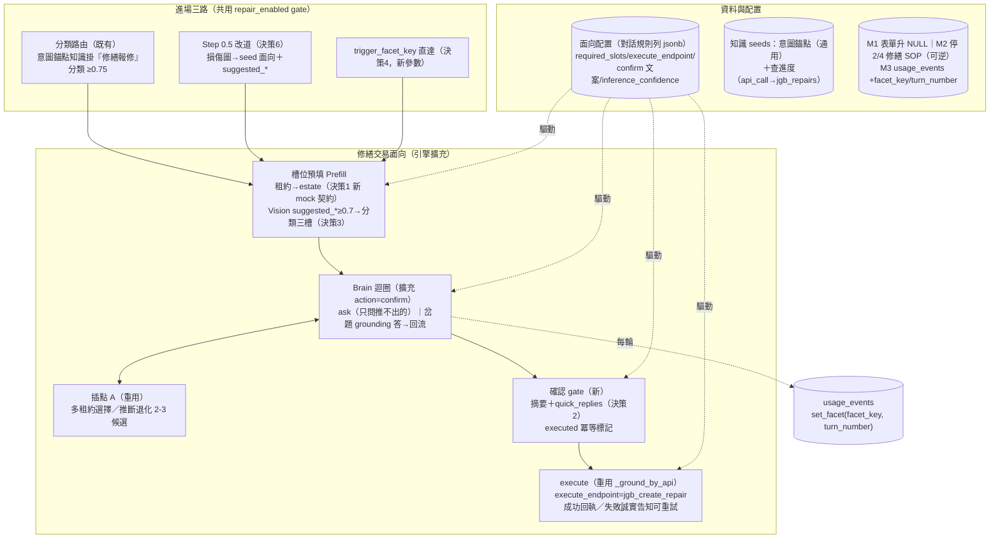
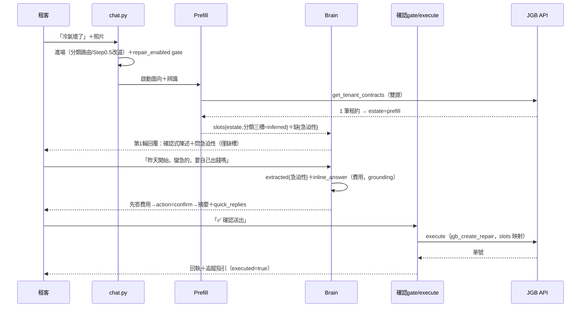

# 技術設計：conversational-repair（對話式修繕）

> 建立時間：2026-07-11
> 需求：requirements.md（R1–R8）　落差：gap-analysis.md　研究：research.md（六決策）
> 北極星：requirements.md 目標形態腳本——實作不得妥協。

## 概述

### 設計目標
引擎長出「交易」能力（確認 gate／執行／回執）並以修繕為第一個交易面向落地：推斷＋確認為主、填寫為輔、對話原生，A 類 3 輪完成建單［R1–R4］；四業者同步切換新形態［R6］；輪數可觀測［R7］；零回歸［R8］。

### 範圍與邊界
- 全案 extend：引擎新增 confirm/execute 語義分支＋接線（image/預填/埋點）＋配置與知識資料＋3 個 migration。唯一新參數：`trigger_facet_key`。
- 不動：表單機（僅 schema 供欄位契約）、既有診斷面向、SOP 機制本體（僅資料層停用修繕子集）、embedding 流程。
- LINE gateway 另案；本案通道無關（身份與訊息走既有 chat API 契約）。

## 架構設計

### Architecture Pattern & Boundary Map



### Technology Stack & Alignment
| 層 | 技術 | 對齊 |
|---|---|---|
| 引擎 | conversational_engine／conversational_step（既有） | brain schema 加值、prepare 加分支——沿用 structured JSON 輸出＋驗證房式 |
| 辨識 | image_recognition_service（GPT-4o Vision，既有） | 直接消費 suggested_*，零改動 |
| API | jgb_system_api＋api_call_handler（既有） | 新 mock 方法 get_tenant_contracts；execute 走既有註冊表 |
| 計量 | usage_metering contextvar hooks | `set_facet` 比照 set_path/set_comparison＋P0 欄位偵測降級 |
| 配置 | knowledge_base 對話規則列 jsonb | 新鍵全塞 grounding_scope，不膨脹 dataclass |

## Components & Interface Contracts

### 元件 1：Brain 交易語義（修改 llm_answer_optimizer.conversational_step＋conversational_rules）

```python
class BrainStep(TypedDict, total=False):
    action: str            # 'ask' | 'converge' | 'confirm'（新）
    converge_kind: str     # 'answer' | 'recommend'（confirm 時不用）
    extracted_fields: Dict[str, Any]   # 本輪抽到的槽位（含使用者對推斷槽位的否定/修正）
    next_question: str
    inline_answer: str     # 岔題的即答內容（有則先答再接 next_question，R3.1）
    scope: str             # 'stay' | 'switch'（既有護欄）
```

- brain 規則範本（交易面向版）：required_slots 全齊（含推斷槽位）→ `action='confirm'`；任何槽位被否定 → 更新後重出 confirm［R4.5］；使用者於 confirm 階段同意詞/確認鈕 → 由引擎（非 brain）判定進 execute。
- 與需求對應：3.1、3.2、4.1、4.5。

### 元件 2：引擎 confirm/execute 分支（修改 conversational_engine）

```python
# state 新鍵（form_sessions.collected_data 內，向後相容）
class TransactionState(TypedDict, total=False):
    slots: Dict[str, SlotValue]     # 統一槽位表
    executed: bool                  # 冪等標記（R4.4）：True 後同意詞不再觸發 execute
    execute_result: Optional[Dict]  # 回執資料（單號等）
    user_turns: int                 # 使用者訊息計數（R7）

class SlotValue(TypedDict):
    value: Any
    source: str      # 'prefill' | 'inferred' | 'user' | 'candidate_pick'
    confirmed: bool  # 出現於已同意之確認摘要 → True
```

- **confirm 流程**：brain 回 confirm → 引擎組摘要（配置 `confirm_template` 嵌槽位）＋quick_replies［決策 2］→ `_save` 後等下一輪；下一輪引擎先於 brain 判定確認鈕 value／明確同意 → execute；「修改」→ 回 brain（帶否定語境）；「取消」→ 既有 `_close` 路徑、槽位丟棄［R3.3］。
- **execute 流程**：重用 `_ground_by_api` 通道呼叫 `grounding_scope.execute_endpoint`（jgb_create_repair，params 自 slots 映射——沿用 params_from_form 同款映射語彙）；成功 → `executed=True`＋回執文案（單號＋追蹤指引，R4.2）；失敗 → executed 不設、誠實告知＋「再試一次」quick reply［R4.3］。
- **冪等**［R4.4］：`executed=True` 後的同意詞回「已為您建單 #X」不重複執行；會話收斂後保留（沿用「收斂不關會話」既有慣例）供追問。
- 與需求對應：4.1–4.5、3.3、3.4。

### 元件 3：槽位預填 Prefill（新增薄模組，面向啟動時執行）

```python
async def prefill_repair_slots(identity: Identity, image_urls: List[str],
                               config: ConversationalConfig) -> PrefillResult:
    """estate：get_tenant_contracts(role_id, user_id)（決策1 mock 契約）
         1 筆→slots['estate']（source='prefill'）；N 筆→pending_candidates（插點A）；
         0 筆→degraded（誠實降級文案，R2.1/R2.2）
       分類三槽＋急迫性：Vision suggested_*，confidence≥inference_confidence（預設0.7）
         →source='inferred'；不足→候選清單（插點A 退化，R2.3/R2.4）"""

class PrefillResult(TypedDict):
    slots: Dict[str, SlotValue]
    candidates: Optional[List[Candidate]]   # 多租約或分類候選
    degraded: Optional[str]                 # 降級文案 key
```

- 新 mock：`jgb_system_api.get_tenant_contracts(role_id, user_id)`——契約見 research 決策 1；真端點列 E 級依賴（J 清單）。
- 與需求對應：2.1–2.5。

### 元件 4：image 通道（修改 chat.py 續跑 hook＋面向進場）

- 進場（三路）與 `handle_conversational_session` 續跑：`request.image_urls` 有值 → 辨識（既有服務）→ suggested_* 依門檻併入 slots／候選［R2.6，G2 修復］。
- Step 0.5 改道［決策 6］：`is_damage` 且信心足 → 不打 SOP 檢索，直接 seed 修繕面向（等同 E2 進場）；其餘維持現行降級。
- 與需求對應：1.1、2.3、2.6。

### 元件 5：進場與 gate（修改 chat.py）

- `trigger_facet_key: Optional[str]`（chat API 新選填參數）：命中 config registry 且 enabled → 直接 seed 面向；未命中 → 照常管線［決策 4，R1.3］。
- `repair_enabled` gate：三路進場共用 helper——vendor_configs 讀值（預設 true），false → 降級文案＋客服管道參數［R1.5］。
- 分類路由零改動：意圖錨點知識掛「修繕報修」分類（by_category 1:1）。
- 與需求對應：1.1–1.5。

### 元件 6：資料與 migration

| 件 | 內容 |
|---|---|
| M1（加性） | `form_schemas.jgb_repair_create` vendor_id 2→NULL（附回復）［R6.1，修 vendor 4］ |
| M2（可逆） | `vendor_sop_items` 停用 `vendor_id IN (2,4) AND next_form_id='jgb_repair_create'`（is_active=false；rollback 回 true）［R6.3；不碰其餘 250 條 R6.5］ |
| M3（加性） | `usage_events` ADD `facet_key VARCHAR(60)`、`turn_number SMALLINT`（IF NOT EXISTS；P0 欄位偵測降級沿用）［R7.1］ |
| 知識 seeds | ①修繕意圖錨點（vendor_ids 空、掛「修繕報修」分類、question 主題關鍵字式）②查進度（action_type=api_call→jgb_repairs）③修繕面向對話規則列（jsonb 配置全集）——均走既有 embedding 生成［R8.2］ |
| 配置鍵（grounding_scope 內） | `execute_endpoint`、`required_slots`、`confirm_template`、`inference_confidence`、`prefill_api`、`degraded_messages`、`candidate_max` |

### 元件 7：埋點（修改 usage_metering＋引擎）

```python
def set_facet(facet_key: Optional[str] = None, turn_number: Optional[int] = None) -> None:
    """比照 set_path 房式：ctx None/finalized 靜默、值截斷；引擎每輪 user_turns+=1 後呼叫。"""
```
- P50/P90 查詢：`SELECT percentile_cont(0.5) WITHIN GROUP (ORDER BY mx) FROM (SELECT MAX(turn_number) mx FROM usage_events WHERE facet_key='repair' GROUP BY session_id) t;`［R7.2］
- 與需求對應：7.1–7.3。

## 資料流程（情境 A）



## 技術決策
六項均於 research.md 定案（介面形狀 mock 先行／confirm=摘要+quick_replies／門檻 0.7 配置化／trigger_facet_key／埋點兩欄／Step 0.5 一律進面向），此處不重複；追溯見各元件標注。

## 非功能性設計
- **效能**：Prefill 增 1 次 API＋（有圖時）1 次 Vision——Vision 既有 15s timeout、失敗降級為無推斷（槽位轉詢問型），不阻斷對話。
- **安全**：雙證沿用（無 role_id/user_id 不進面向、不預填）；execute 僅在明確同意後；冪等防重複寫入；取消不留殘單。
- **錯誤處理**：brain 失敗→回 None 降級一般流程（絕不建單，R3.4）；execute 失敗→誠實告知＋重試（R4.3）；G1 API 0 筆/失敗→降級文案。
- **可擴展**：交易語義（confirm/execute/prefill/冪等）全配置驅動——下一個交易面向（退租等）＝加配置與 seeds，引擎零改動（目標）。

## 測試策略
| 層 | 測試 | 需求 |
|---|---|---|
| unit | BrainStep confirm 解析／SlotValue 分型／冪等（executed 後同意不重執行）／set_facet 房式 | 4.1、4.4、7.1 |
| unit | Prefill 分型矩陣：1/N/0 筆租約×信心 ≥/< 門檻×無圖 | 2.1–2.5 |
| integration | execute 走 mock create_repair 成功/失敗；image→suggested_* 併入；trigger_facet_key 驗證 | 4.2、4.3、2.6、1.3 |
| e2e（G-gated） | 情境 A（≤3 輪）/B/C/D/E/F 逐場景；R6.4 四業者驗收矩陣（decision_case 佐證 SOP 不攔截） | 1.x–6.x |
| 回歸 | FAQ 快路徑/既有面向/prospect/非修繕表單/非修繕 SOP 全綠 | 8.1、6.5 |

## 部署考量
順序：M1/M3（加性）→ 知識 seeds＋面向配置（含 embedding 生成）→ 推程式 → 煙囪（情境 A 真跑＋埋點入庫）→ **M2 停 SOP（切換時刻，使用者執行）** → 四業者驗收矩陣。semantic-model 免重建（新知識走既有 embedding 流程）；runbook 增補本案節。

## 風險與挑戰
承 research.md 風險登記（G1 談判／Vision 準確率／brain 判定誤差／切換突變）——處置均已內建於設計（退化路徑/門檻配置/quick reply 決定性/可逆 migration）。

## 參考文件
[需求](requirements.md)｜[研究](research.md)｜[落差](gap-analysis.md)｜docs/conversation-first-architecture-assessment.md §6.6

### 變更歷史
| 日期 | 版本 | 變更 | 修改者 |
|---|---|---|---|
| 2026-07-11 | 1.0 | 初始版本（六決策定案後） | AI |
