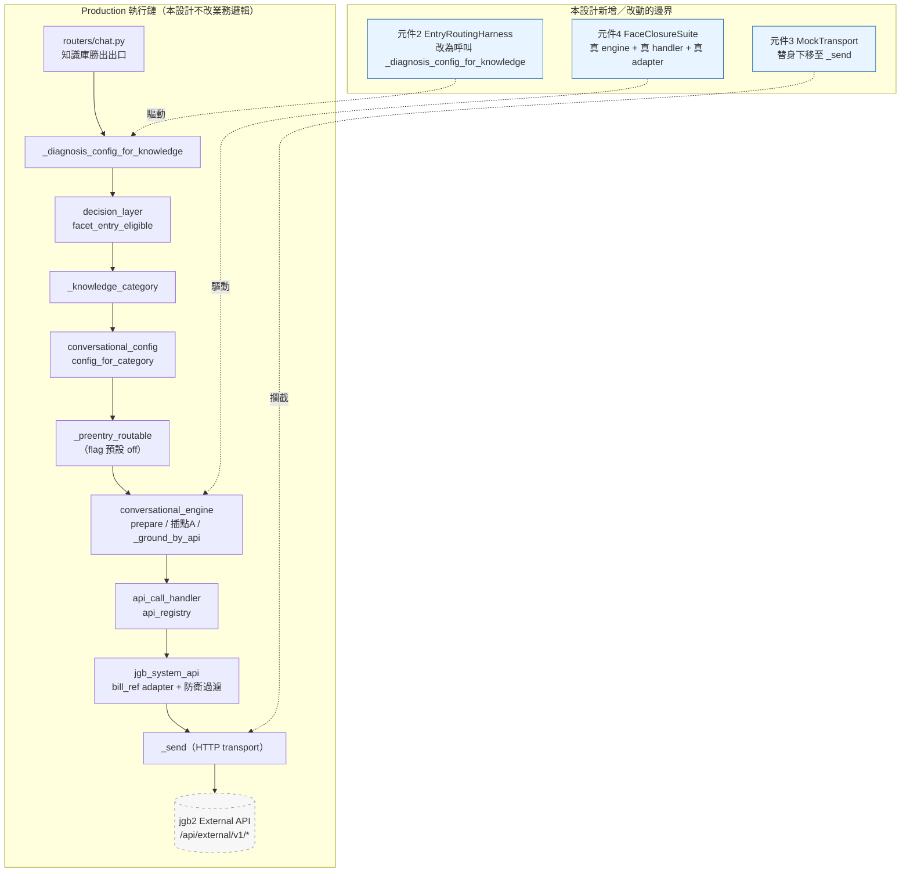
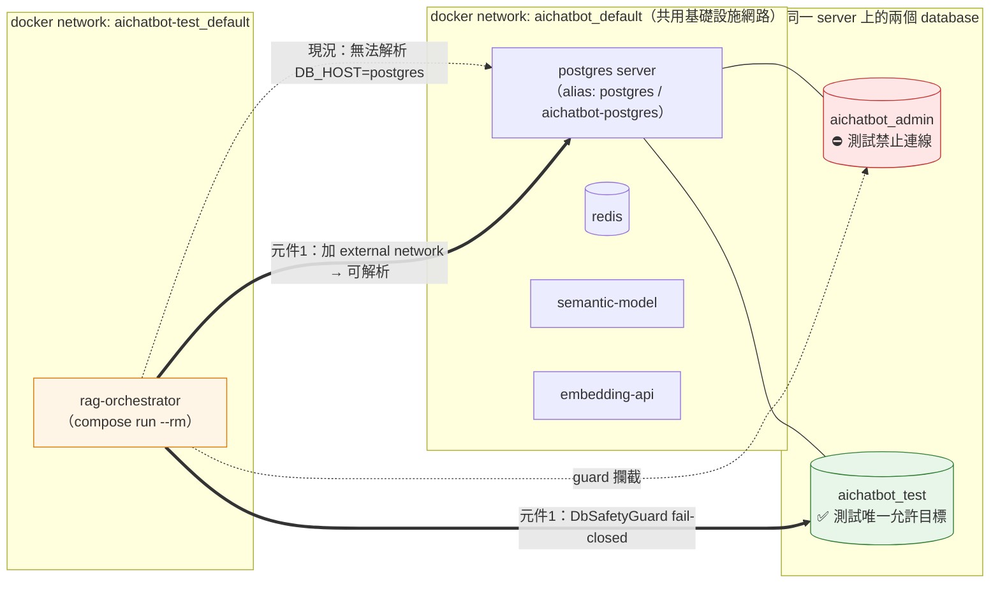
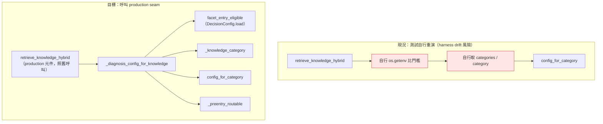
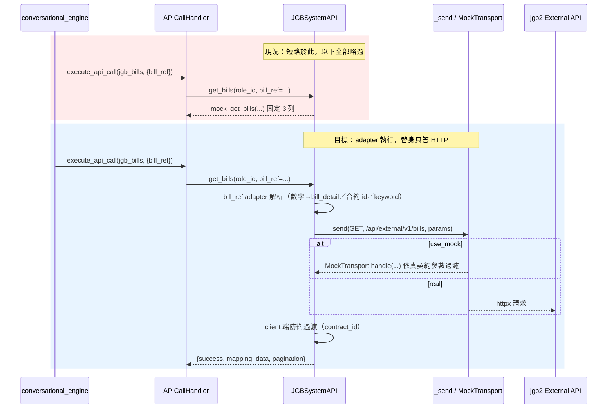
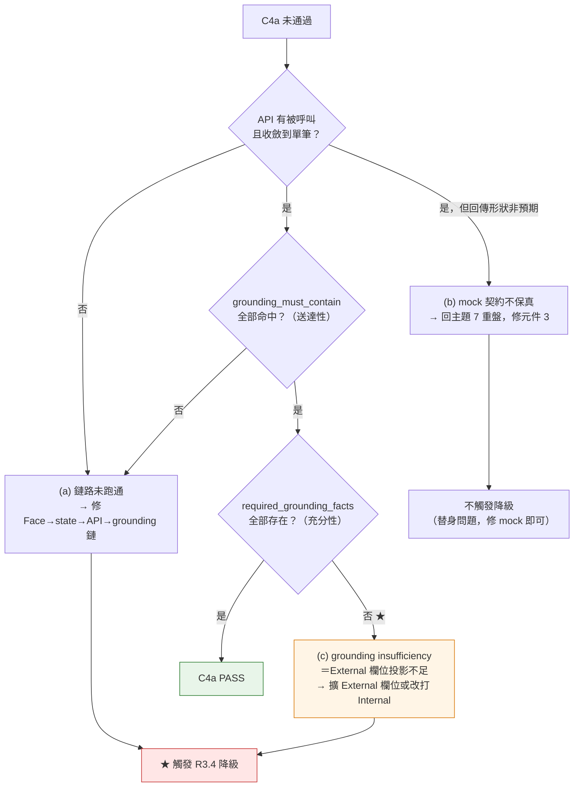
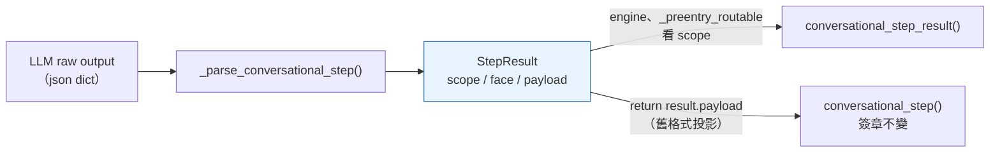
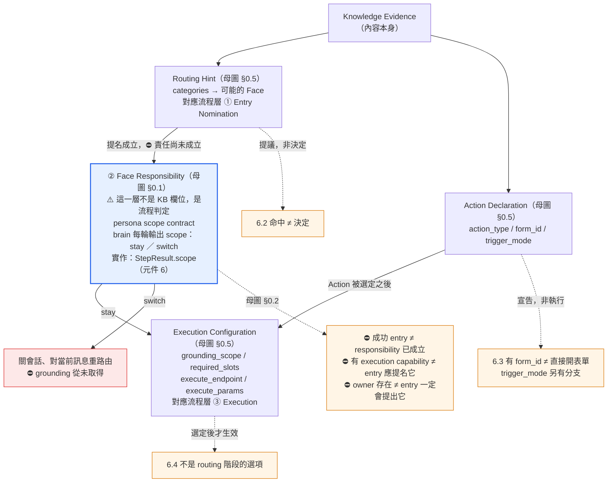
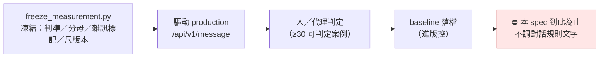
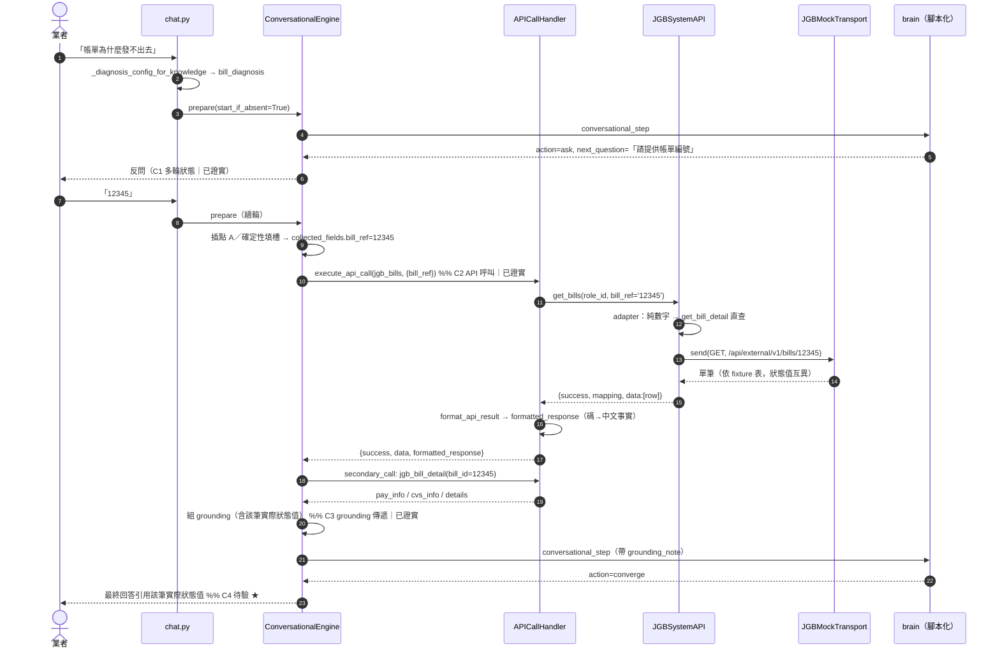

# 技術設計：conversational-routing-execution

> 建立時間：2026-08-23T03:50:17Z｜語言 zh-TW
> 需求文件：[requirements.md](./requirements.md)｜研究記錄：[research.md](./research.md)
> 發現流程：**Light Discovery**（功能擴展／既有系統整合；`.kiro/settings/rules/design-discovery-light.md`）

## 概述

### 設計目標

本設計要達成一件事：**讓「面向執行鏈是否真的閉環」成為可被反覆執行的事實，而非推論。**

為此需要三個前提依序成立：

1. **量測工具本身要可信**——`make test-integration` 目前結構上永遠 skip，任何以其為據的結論皆無效［需求 1］。
2. **量測要驅動 production code path**——現行進場路由回歸測試自行重演決策鏈，違反 R9.4［需求 2、9.4］。
3. **替身要有契約**——mock 掛在 `bill_ref` adapter 之前，連 rag 端自己的識別解析都一併略過，
   使 C4 在結構上不可能收斂［需求 3、4］。

三者成立後，才處理已知缺陷［需求 5］、責任分層文件化［需求 6］與對話品質基準［需求 10］。

### 範圍與邊界

**涵蓋**：Knowledge retrieval 勝出之後的 Face routing／Direct answer 接縫，
以及 Face execution 的**可驗證性**。

**不涵蓋**［需求 8 全表］（沿用 requirements.md「架構定位」與需求 8，本設計不重述依據）：
既有 Form Session 優先序、SOP ‖ Knowledge 仲裁本身、SOP trigger modes、Form Engine、
API Engine、交易面向引擎的業務邏輯、always-on query rewrite、新的全域 routing selector、
pre-entry gate 上線、KB 全面結構化、hybrid recall、澄清分岔。

**本設計不做的三件事，額外聲明**：

| 不做 | 理由 |
|---|---|
| 不新建 Decision Engine／中央 selector | ［需求 6.7］pre-entry gate 實測錯路由攔截 1/13 |
| 不變更 DB schema | ［需求 6.8］語義分層先落於文件與審查流程 |
| 不調整任何檢索／進場門檻 | ［需求 2.3］6 筆資訊型問題以 final ≥0.945 進面向，門檻擋不到 |

---

## 架構設計

### Architecture Pattern & Boundary Map

本設計的架構模式為 **「量測邊界下移，執行鏈不動」**：不重構對話主幹，
而是把三處**替身／複刻的邊界**從「業務方法層」下移到「外部依賴層」，
使 production 邏輯在測試中真正被執行。



**邊界原則（本設計的唯一架構主張）**：

> **Mock 不准吃掉你正在驗的東西。**
>
> 落為可執行規則：
>
> ```text
> 對旨在驗證 production control-flow closure 的 integration／E2E 測試：
>   替身 SHALL NOT 跨越「被驗證的 production 邏輯」；
>   對 JGB external dependency，其最遠上游替身邊界為 HTTP transport（_send）。
>
> Unit tests 不受此限制——
>   unit 層的驗證對象就是單一函式／類別，mock 掉其協作者正是該層的方法。
> ```

⚠️ **本規則不是「所有 mock 一律只能放 HTTP」**。判準是**替身與驗證目標的相對位置**，
不是替身的絕對層級：同一個 `APICallHandler` mock，在驗 `conversational_engine` 分支邏輯的
unit 測試裡完全正當，在宣稱「證明 API grounding 閉環」的測試裡就是吃掉了驗證目標。

違反此規則的判定式（三問）：

1. 這個測試**宣稱**證明什麼能力？
2. 該能力的 production 實作**跨越哪幾層**？
3. 替身是否落在那幾層**之內**？→ 是則違規。

現況三處違反此規則者（皆宣稱驗證跨層閉環），與本設計的處置：

| 位置 | 現況替身層 | 被略過的 production 邏輯 | 處置 |
|---|---|---|---|
| `jgb_system_api.get_bills` | **業務方法層** | `bill_ref` adapter、`contract_id` 參數組裝、client 端防衛過濾 | 元件 3：下移至 `_send` |
| `test_facet_entry_routing_req.py::_route` | **整段複刻** | `facet_entry_eligible`、`_knowledge_category`、`_preentry_routable`、`DecisionConfig` 讀值 | 元件 2：改為呼叫 |
| `test_facet_diagnosis_multiturn::C3` | **`APICallHandler` 整顆** | `api_registry` 派發、參數插值、`format_api_result` | 元件 4：改用真 handler |

### 測試層級與執行環境邊界



### Technology Stack & Alignment

沿用既有技術棧，**不引入任何新的外部依賴**（Light Discovery 第 4 階段：不適用）。

| 層級 | 技術 | 版本／來源 | 對齊說明 |
|------|------|-----------|---------|
| 執行期 | Python | 3.11（容器） | 對齊 `steering/testing-code.md` 一、host 3.9 會收集失敗 |
| 測試框架 | pytest ＋ `asyncio_mode=auto` | `rag-orchestrator/pytest.ini` | 沿用 `--strict-markers` 與 `unit/integration/e2e/req` 四 marker |
| 測試入口 | `scripts/run-tests.sh` ＋ `Makefile` | 既有 | 元件 1 在其上補旗標與網路，入口不新增 |
| 容器編排 | docker compose | `docker-compose.dev.yml`（`name: aichatbot-test`）| 元件 1 新增 external network 參照 |
| HTTP client | `httpx.AsyncClient` | 既有 `jgb_system_api._send` | 元件 3 的替身掛點 |
| 決策讀值 | `services/decision_layer.DecisionConfig` | 既有唯一讀值點（**spec `retrieval-decision-layer` R7.4**；該 spec 已封存至 `.kiro/specs/archive/`，但本元件仍在生產環境運行）| 元件 2 改由此取門檻，不自行 `os.getenv` |
| 量測凍結 | `scripts/backtest/freeze_measurement.py` | 既有 | 元件 7 沿用，不另起爐灶 |
| 埋點 | `usage_events`（`facet_key`／`turn_number`／`facet_event`／`decision_snapshot`）| 既有 | 元件 7 直接 SQL 聚合，不新增欄位 |

---

## Components & Interface Contracts

### 元件 1：TestRunner 供裝與失效可見性

**責任**：使 `make test-integration` / `make test-e2e` 在結構上有能力真正執行，
並使「因環境略過」「因標記未啟用略過」「真的跑完且全過」三者在輸出與退出碼上可分辨。

**三個獨立缺口，三個獨立修法**（見 research.md 主題 8.1）：

| 缺口 | 修法 | 需求 |
|---|---|---|
| 旗標未傳遞 | `run-tests.sh` 依 `LAYER` 注入 `RUN_INTEGRATION=1`／`RUN_E2E=1` 至 `docker compose run -e` | 1.1、1.5 |
| 網路不通 | `docker-compose.dev.yml` 加入 external network `aichatbot_default`；`DB_HOST` 預設維持 `postgres`（實查已確認該 alias 存在於該網路）| 1.2 |
| **接上網路後可觸及 production DB** | **`DbSafetyGuard`：fail closed**（見下）| 1.2（安全前提）|
| 失效不可見 | ①`pytest.ini` `addopts` 加 `-ra`；②skip reason 加型別前綴；③`pytest_sessionfinish` 決定退出碼 | 1.3、1.4 |

#### 1-A：測試資料庫安全邊界（fail closed）

> ⚠️ **把測試容器接上 `aichatbot_default` 就等於讓它看得見 production database。**
> `session_id` 前綴隔離與 `finally` 清理是**清理機制，不是隔離機制**——
> 它們假設測試已經連到正確的庫。連錯庫時，它們清的就是 production 的資料。

**主要對策（結構性）**：測試連**同一台 postgres server 上的獨立 database**
（`aichatbot_test`），而非 production 的 `aichatbot_admin`。
網路連通只解決「能不能到得了 server」，**database 選擇才是隔離邊界**。

**次要對策（fail-closed backstop）**：

```python
from typing import Final, Optional

class ProductionDatabaseRefused(RuntimeError):
    """解析出的資料庫無法被證明為非 production → 拒絕連線（不降級、不警告後繼續）。"""

#: 唯一允許的測試資料庫白名單；不在此列者一律拒絕（不是黑名單）
ALLOWED_TEST_DATABASES: Final[frozenset[str]] = frozenset({
    "aichatbot_test",
    "aichatbot_ci",
})

def assert_non_production_db(*, db_name: str, db_env: Optional[str]) -> None:
    """Integration/E2E 測試連線前的守門（R1.2 安全前提）。

    SHALL fail closed：**除非**能明確證明目標為非 production，否則拒絕。
    兩道皆須通過：
      1. db_env != "production"（缺值視為未證明 → 拒絕）
      2. db_name ∈ ALLOWED_TEST_DATABASES（白名單，非黑名單）
    違反 → raise ProductionDatabaseRefused，**不得降級為 skip 或 warning**。
    """
```

**掛載點**：`tests/conftest.py` 的 session 級 autouse fixture，
在任何 `asyncpg.create_pool` 之前執行；`RUN_INTEGRATION=1` 或 `RUN_E2E=1` 時一律生效。

> ⚠️ 這是本設計**第二個刻意不 fail-open 的地方**（第一個是空跑守門）。
> 其餘所有 gate 維持 fail-open——但「可能寫到 production DB」不在可 fail-open 之列。

#### 1-B：守門的供裝條件（缺一即整層不可達，須逐條完成）

> ⚠️ `DB_ENV` **目前在整個 repo 不存在**（實查：除本設計外零命中）。
> 守門的「缺值視為未證明 → 拒絕」意味著**不注入就是全紅**。以下三點是它的完成條件，不是選配。

| # | 供裝項 | 位置 | 值 |
|---|---|---|---|
| 1 | `DB_ENV` 注入 | `docker-compose.dev.yml` `environment` | `DB_ENV: ${DB_ENV:-test}` |
| 2 | `DB_ENV` 注入 | `.github/workflows/tests.yml` integration job `env` | `DB_ENV: test` |
| 3 | 測試庫名 | ①`docker-compose.dev.yml` `DB_NAME` 預設；②CI 的 `POSTGRES_DB` **與** job `DB_NAME` | 皆改為 `aichatbot_test` |
| 4 | **e2e 層目標庫與供裝** | 見下方 1-B-e2e | `aichatbot_test`（與 integration 同庫）|

#### 1-B-e2e：e2e 層的供裝條件（守門一併生效，不可略過）

> ⚠️ 1-A 的守門作用域涵蓋 `RUN_E2E=1`。既有 e2e 以 `TestClient(app)` 在同一程序內起整服務、
> 讀**同一組 `DB_*`**，故 `DB_NAME` 預設一改，e2e 立即受同一道守門管轄。
> v1.3 只寫了 integration 的供裝，**這是缺口**。

| 供裝項 | C4b 是否需要 | 說明 |
|---|---|---|
| 面向配置（`category='對話規則'` 的 `bill_diagnosis`／`billing_anomaly`）| ✅ 必要 | 無配置則面向不存在 |
| 系統脈絡知識（`系統脈絡：*`）| ✅ 必要 | 三層 `system_md` 注入 |
| 對話規則（`load_rules` 依 `persona_role`）| ✅ 必要 | 缺則引擎降級 |
| **完整 KB ＋ embedding（供真檢索命中錨點）** | ⚠️ **取決於進場方式**（見下）| **最重的一項** |

**收窄候選（實作時先驗證，未經驗證不得寫進任務）**：
C4b 的驗證對象是「**真 brain 是否使用 grounding 作答**」，**不是**「檢索是否命中」——
後者是 Requirement 2 的事。若能經 **Step 0.4 `trigger_facet_key` 直達面向**進場
（production 既有路徑，非 harness 捏造），即可跳過分類與檢索，
供裝需求由「完整 KB＋embedding」降為「面向配置＋系統脈絡＋規則」。

> ⚠️ **這是候選，不是結論**：`handle_trigger_facet` 現行一律走 `_seed_repair_facet`，
> 而 chat.py 的分類路由出口對「未宣告 `enabled_gate`／`prefill_api` 的診斷面向」
> 走的是 `_conversational_respond`。**兩條路徑是否等價，須讀碼或實跑確認**——
> 確認前，C4b 的供裝以「完整 KB＋embedding」估算，不得先按樂觀值排任務。

**「供裝未完成即全數拒絕」的預期行為，同時適用 integration 與 e2e 兩層。**

**CI 庫名為何要改而不是加白名單**：CI 現行 `POSTGRES_DB: aichatbot_admin`
（`.github/workflows/tests.yml`）——它只是**與 production 同名的臨時 service container**，
並非 production。但守門判的是**名字**，把 `aichatbot_admin` 加進白名單等於在所有環境
一併解除對真 production 庫的保護。**改 CI 的庫名成本近乎零，改白名單則毀掉守門的全部價值。**

#### 1-C：CI 與本地入口分工（定案，取代「本地與 CI 同一支」的舊宣稱）

`run-tests.sh` 檔頭宣稱「本地與 CI 同一支」——實查不成立：CI 直接跑 `python3 -m pytest`，
不經該腳本。**本設計定案為分層而非強行統一**：

| 關注點 | 歸屬 | 理由 |
|---|---|---|
| 旗標注入語義、skip 型別前綴、**空跑守門**、**DB 守門** | **pytest 層**（`conftest.py` / `pytest_sessionfinish`）| 兩邊共用同一份不變量；CI 與本地不可能各有一套 |
| 容器啟動、network attach、`pip install -r requirements-test.txt` | **各自的 runner**（`run-tests.sh` ／ GH Actions service containers）| 供裝方式本質不同，強行統一只會增加間接層 |

→ 處置：**修正 `run-tests.sh` 檔頭的宣稱**（改為「不變量與 CI 同源，供裝方式各自負責」），
不強迫 CI 改走該腳本。

#### 1-C-ci：守門在 CI 的**實際效力**（v1.3 的宣稱過強，此節取代）

v1.3 寫「守門掛 pytest 層故本地與 CI 同時生效」——**執行**確實兩邊都跑，
但**阻擋力**在 CI 端目前為零：

```yaml
# .github/workflows/tests.yml（現況）
integration:
  continue-on-error: true                      # ← job 級吞噬
  ...
  run: |
    python3 -m pytest -m integration ... || \  # ← step 級吞噬
      echo "integration 尚未全綠…—非阻擋，待後續供裝。"
```

兩層吞噬皆為**既有且合理的決定**（integration 的 schema／seed 尚未供裝，
此時硬擋只會讓 CI 長紅）。問題在於：它們**連結構性失效一起吞掉**——
`ProductionDatabaseRefused` 與空跑守門在 CI 完全不產生訊號。
而「`DB_ENV` 未注入／CI 庫名未改」的風險，v1.3 指名的緩解正是這條已被推翻的宣稱。

**修法：以退出碼區分「測試沒過」與「結構性失效」，只讓後者穿透吞噬。**

```python
# conftest.py
EXIT_TEST_FAILURE: Final[int]        = 1    # 既有 pytest 語義：有測試失敗 → CI 刻意不擋
EXIT_STRUCTURAL_FAILURE: Final[int]  = 10   # 空跑守門 / DB 守門 → **必須擋**
# ⚠️ 不用 3：pytest 保留 0–5，其中 3 ＝ internal error。
#    借用它雖然同樣會被硬擋（安全性無虞），但 CI 報告會把
#    「pytest 自己炸掉」與「本設計的不變量失敗」混為一談，失去可辨識性。
#    10 在 pytest 保留區之外，能唯一辨識結構性失效。
```

```yaml
# .github/workflows/tests.yml（目標）
integration:
  # continue-on-error: true  ← 移除；非阻擋改由下方 step 級判斷達成，語義更精確
  run: |
    python3 -m pytest -m integration -p no:cacheprovider --tb=short; rc=$?
    if [ "$rc" -eq 10 ]; then
      echo "❌ 結構性失效（空跑守門／DB 守門）—— 硬擋"; exit 1
    fi
    [ "$rc" -ne 0 ] && echo "integration 尚未全綠—非阻擋，待後續供裝。"
    exit 0
```

| 情境 | 退出碼 | CI 行為 |
|---|---|---|
| 測試有失敗（schema／seed 未供裝）| 1 | **不擋**（維持既有刻意決定）|
| 該層 gate-skip ≠ 0（旗標沒傳到）| **10** | **硬擋** |
| DB 無法證明為非 production | **10** | **硬擋** |
| pytest 自身 internal error | 3（pytest 保留）| 由既有 `|| echo` 處理，與本設計的 10 可區分 |

> ⚠️ **`continue-on-error: true` 必須移除**——它在 job 級吞噬，
> 留著會連 `exit 1` 一起吃掉，使上表的「硬擋」失效。
> 移除後，普通測試失敗的非阻擋性由 step 級的 `exit 0` 保證，語義比 job 級旗標精確。

> ⚠️ 若基於任何理由**不移除** `continue-on-error`，則 1-C 的正確宣稱是
> 「守門在 CI **只執行、不具阻擋力**」，且「`DB_ENV` 未注入／CI 庫名未改」
> 的風險**必須另指一個真的會在 CI 產生非 0 的把關點**，不得留空。

**既有測試的遷移**：現行 integration 測試以 `os.getenv("DB_NAME", "aichatbot_admin")` 取庫名，
預設值即 production 庫；遷移由上表第 3 項統一處理，測試檔本身零改動。
**在 `aichatbot_test` 供裝（schema／seed）完成之前，1-A 的守門會使 integration 層
在本地與 CI 皆全數拒絕連線——這是預期行為，不是回歸**，且供裝為元件 1 的完成條件。

**介面定義**：

```python
# scripts/run-tests.sh —— 以環境變數表達（shell，無型別系統；契約以註解與測試鎖定）
#   LAYER ∈ {unit, integration, e2e, all}
#   注入規則（決定性，非啟發式）：
#     integration → RUN_INTEGRATION=1
#     e2e         → RUN_E2E=1
#     all         → RUN_INTEGRATION=1, RUN_E2E=1
#     unit        → 皆不注入（維持離線）
#   退出碼：一律由 pytest hook 決定並回傳，**shell 不解析人類可讀 summary**
#     （解析 summary 文字是另一種靜默失效來源）

# rag-orchestrator/tests/conftest.py —— skip 型別化
from typing import Literal, Final

SkipKind = Literal["gate", "env"]

GATE_SKIP_PREFIX: Final[str] = "[gate]"   # 標記未啟用（RUN_INTEGRATION/RUN_E2E 未設）
ENV_SKIP_PREFIX: Final[str] = "[env]"     # 環境不足（DB/外部服務不可達）

def pytest_collection_modifyitems(config: "pytest.Config",
                                  items: "list[pytest.Item]") -> None:
    """既有職責不變；新增：skip reason 一律以型別前綴開頭（R1.3）。"""

def pytest_terminal_summary(terminalreporter: "TerminalReporter",
                            exitstatus: int, config: "pytest.Config") -> None:
    """輸出分類統計：gate_skipped / env_skipped / passed / failed（R1.3）。"""

def pytest_sessionfinish(session: "pytest.Session", exitstatus: int) -> None:
    """空跑守門——退出碼在此決定，不交給 shell 解析摘要文字（R1.4）。

    不變量：**被明確請求的那一層，gate-skip 數必須為 0。**
      `[gate]` 的定義即「RUN_INTEGRATION／RUN_E2E 未設」；
      既然 runner 已注入該旗標，跑 `make test-integration` 時
      integration 層的 gate-skip 應為 **0**，而不只是「不到 100%」。
      環境不足另走 `[env]`，不計入本不變量。

    違反 → session.exitstatus = EXIT_STRUCTURAL_FAILURE（10；避開 pytest 保留的 0–5）。
    """
```

> **為何從「gate-skip < 100%」收緊為「gate-skip == 0」**：
> 前者只擋得住「整層都沒跑」，擋不住「旗標傳到一半」——
> 例如日後新增 marker 或子層時漏傳，會有部分測試靜默 gate-skip 而總數不為 100%。
> `[gate]` 與 `[env]` 的型別區分（1.3）正是為了讓這條更強的不變量可判定。

`env`-skip 的產生點沿用既有慣例（各測試 fixture 內 `pytest.skip(f"{ENV_SKIP_PREFIX} 無法連 DB：{e}")`），
**不改動任何測試的判定邏輯**——只把既有 reason 字串加上前綴。

**與需求對應**：［需求 1.1］［需求 1.2］［需求 1.3］［需求 1.4］［需求 1.5］

**驗收**：`make test-integration` 的 passed/failed/skipped 三個數字與繞過 runner 直跑一致［需求 1 驗收段］。

> ⚠️ **附帶收斂項**：`run-tests.sh` 檔頭宣稱「本地與 CI 同一支」，
> 但 `.github/workflows/tests.yml` 的 integration job 直接跑 `python3 -m pytest`，未經該腳本。
> 本元件應一併使 CI 改走 `run-tests.sh`，或修正該宣稱——**兩者擇一，不得留著假宣稱**。

---

### 元件 2：EntryRoutingHarness（進場路由回歸改為驅動 production seam）

**責任**：把面向進場路由回歸測試從「自行重演決策鏈」改為「呼叫 production 決策函式」，
使 Requirement 2 的失敗判定有意義。

**現況與目標的差異**：



**介面定義**：

```python
from typing import Literal, Optional, TypedDict

RouteKind = Literal["dialog", "single"]

class RouteOutcome(TypedDict):
    """進場路由的可斷言結果（測試用值物件，不進 production）。"""
    kind: RouteKind
    facet_key: Optional[str]        # dialog 時為命中的面向 key，single 時 None
    category: Optional[str]         # 觸發該面向的 categories 元素
    top1_similarity: Optional[float]
    top1_summary: Optional[str]
    reason: Optional[str]           # ⚠️ 僅供失敗訊息，**永不進斷言**（見下方註）

async def route_via_production(
    retriever: "VendorKnowledgeRetrieverV2",
    db_pool: "asyncpg.Pool",
    question: str,
    *,
    vendor_id: int,
    target_user: str,
    mode: str,
) -> RouteOutcome:
    """驅動 production 進場決策（R9.4：不重建管線）。

    內部僅做兩件事：
      1. 呼叫 production `retrieve_knowledge_hybrid` 取 best_knowledge；
      2. 呼叫 production `routers.chat._diagnosis_config_for_knowledge(
             db_pool, best_knowledge, DecisionConfig.load(), user_message=question)`。
    門檻、雙欄位退化、pre-entry gate 一律不在本函式內複刻。

    ⚠️ **檢索呼叫的每一個參數皆 SHALL 取自 production 讀值點**，harness 不得自行 `os.getenv`：
        similarity_threshold ← DecisionConfig.load().kb_threshold
        top_k                ← 與 production 請求預設對齊（非硬編 5）
        target_user / mode   ← 由呼叫端明示傳入（本來就是請求參數）
    """
```

#### ⚠️ 門檻對碼結果（v1.6 更正 v1.3 的錯誤陳述）

v1.3 寫「production 走 0.55、harness 走 0.65，兩者不同」——**這是錯的**。四點對碼實查：

| 讀值點 | 值 | 說明 |
|---|---|---|
| `routers/chat.py` 真呼叫點 | `DecisionConfig.load().kb_threshold` | 唯一讀值點，正確 |
| `services/decision_layer.py` 程式**預設** | `0.55` | ⚠️ **env 已設，此預設永不生效** |
| **容器內 `KB_SIMILARITY_THRESHOLD` 實測** | **`0.65`** | ← **production 的實際生效值** |
| `docs/retrieval-parameters.md` 參數台帳 | `0.65` | 與實測一致 ✅ |

**更正後的結論**：

| 參數 | drift 狀態 | 說明 |
|---|---|---|
| `similarity_threshold` | **潛在，非現行** | harness 的 `os.getenv("KB_SIMILARITY_THRESHOLD", "0.65")` 讀的是**同一顆 env**，容器內兩邊都解析為 `0.65`。**僅在 env 未設時**才會分歧（0.65 vs 0.55）|
| `top_k` | **現行，確實存在** | harness 硬編 `5`，production 為 `request.top_k` |

→ 契約要求「取自 production 讀值點」**仍然成立且必要**（消除潛在 drift），
但 `HARNESS_DRIFT` 第 ④ 項的指名依據要精確：**現行環境下能造成紅綠差異的是 `top_k`，
不是門檻**。把門檻誤指為分歧點會導向錯誤的修正。

> ⚠️ **另一項發現（本 spec 範圍外，記錄備查）**：`DecisionConfig` 的程式預設 `0.55`
> 與參數台帳的 `0.65` **不一致**。目前靠 env 覆蓋而無害，但任何 env 未設的環境
> （新機器、新容器、CI）會靜默跑在 0.55。**建議另立 follow-up 對齊**，不在本 spec 修。

> ⚠️ **`RouteOutcome.reason` 的契約限制**：production seam 只回 `cfg | None`，
> 不區分 `below-threshold`／`no-facet-config`／`preentry-blocked`。該欄位若要有值，
> 只能由 `best_knowledge` ＋ `DecisionConfig` 事後推導——**那仍是複刻**。
> 故本契約明訂：`reason` **僅用於 pytest 失敗訊息的可讀性，永不作為斷言依據**。
> 否則等於把被禁止的複刻從主路徑挪進診斷路徑。

**設計決策（見「技術決策 2」）**：不把 `_diagnosis_config_for_knowledge` 搬家，
測試直接 import 該私有函式。零 production 改動是本元件的硬約束——
Requirement 2 要判定的是「有沒有回歸」，此時改動 production 會讓判定失去對照意義。

**三向判定協議**［需求 2.2 的擴充］：

| 判定 | 定義 | 處置 |
|---|---|---|
| `REGRESSION` | 以 production seam 執行仍失敗，且該行為在產品上是錯的 | **修程式**，斷言不動 |
| `EXPECTATION_DRIFT` | 以 production seam 執行仍失敗，但產品行為已合理改變 | 更新斷言，**必須記錄改判依據與日期** |
| `HARNESS_DRIFT` | 以 production seam 執行即通過（原失敗來自複刻失真）| 斷言與程式皆不動，**但須指名分歧點** |

> ⚠️ ［需求 2.2］「不得以更新斷言作為預設處置」在此具體化為**兩道書面依據要求**：
>
> | 判定 | 必須提出 | 不得作為依據 |
> |---|---|---|
> | `EXPECTATION_DRIFT` | 產品行為為何合理改變（改判依據＋日期）| 「測試沒過」本身 |
> | `HARNESS_DRIFT` | **具體是哪一處複刻分歧使該案由紅轉綠**——**四者**擇一指名：<br/>①**進場**門檻讀值點（測試自行 `os.getenv` vs `facet_entry_eligible`／`DecisionConfig`）<br/>②雙欄位退化（自行取 `categories`／`category` vs `_knowledge_category`）<br/>③`_preentry_routable` 缺席<br/>④**檢索呼叫參數**——現行環境下為 **`top_k` 5 vs `request.top_k`**（候選集大小不同）；門檻在 env 已設時兩邊同值，**僅 env 未設時**才分歧（見「門檻對碼結果」）| 「改走 production seam 就綠了」本身 |
>
> **無法指名分歧點者一律回退為 `REGRESSION` 處理。**
>
> ⚠️ ④是 v1.3 補上的——漏列它會強迫把「候選集不同造成的差異」誤判為 `REGRESSION`，
> 導致去修一段沒有壞的程式。**枚舉不完整的判定表，比沒有判定表更危險。**
> 理由：「改 harness 就綠」比「改斷言就綠」更隱蔽——若不要求指名，
> 5 個失敗可以全判 `HARNESS_DRIFT` 而使 Requirement 2 自動結案，
> 這正是 2.2 想擋的事，只是換了個更難察覺的形式。

**與需求對應**：［需求 2.1］［需求 2.2］［需求 2.3］［需求 9.4］

---

### 元件 3：JGBMockTransport（契約級外部依賴替身）

**責任**：把 jgb2 的替身從**業務方法層**下移到**HTTP transport 層**，
使 `bill_ref` adapter、參數組裝、client 端防衛過濾等 rag 端 production 邏輯在測試中真正執行。

**現況與目標**：



**介面定義**：

```python
from typing import Any, Final, Literal, Optional, Protocol, TypedDict

HttpMethod = Literal["GET", "POST"]

class TransportResponse(TypedDict, total=False):
    """External API 回應外殼（對齊 BillApiController@index / @show）。"""
    success: bool
    mapping: dict[str, dict[str, str]]
    data: list[dict[str, Any]] | dict[str, Any]
    pagination: "Pagination"
    error: dict[str, Any]

class Pagination(TypedDict):
    current_page: int
    per_page: int
    total: int
    total_pages: int
    has_more: bool

class Transport(Protocol):
    """HTTP transport 契約；real 與 mock 兩實作，JGBSystemAPI 僅依賴本 Protocol。"""
    async def send(self, method: HttpMethod, path: str, *,
                   params: Optional[dict[str, Any]] = None,
                   data: Optional[dict[str, Any]] = None) -> TransportResponse: ...

class JGBMockTransport:
    """契約保真替身：只回答 HTTP，不承擔任何 rag 端邏輯（R4.1、R9.4）。

    契約基準為 research.md 主題 7（jgb2 原始碼盤查，附 file:line），
    不得由推測產生；jgb2 演進導致行為不符時，**先重盤主題 7 再改本類**。
    """

    #: 路由表：(method, path template) → endpoint_key。
    #: ⚠️ **不得以 `path in WHITELIST` 判定**——detail path 實際為
    #: `/api/external/v1/bills/12345`，字面永遠不會命中 `.../{bill_id}` 樣板。
    ROUTES: Final[tuple[tuple[HttpMethod, str, str], ...]] = (
        ("GET", "/api/external/v1/bills",             "bills"),
        ("GET", "/api/external/v1/bills/{bill_id}",   "bill_detail"),
    )

    #: 已遷移至 transport 層的 endpoint_key；未列者仍走既有方法級 mock（漸進遷移，零回歸）
    MIGRATED_ENDPOINTS: Final[frozenset[str]] = frozenset({"bills", "bill_detail"})

    #: 分頁常數（BillApiController:13-14）
    DEFAULT_PER_PAGE: Final[int] = 50
    MAX_PER_PAGE: Final[int] = 200

    def __init__(self, fixtures: "BillFixtureTable") -> None: ...

    @classmethod
    def resolve_endpoint(cls, method: HttpMethod, path: str) -> Optional[str]:
        """以樣板比對解析 endpoint_key；無對應回 None。

        樣板段（`{bill_id}`）比對任意單一 path segment 並抽出為參數，
        段數不同一律不匹配。**這是 detail 路由能被命中的唯一機制。**
        """

    async def send(self, method: HttpMethod, path: str, *,
                   params: Optional[dict[str, Any]] = None,
                   data: Optional[dict[str, Any]] = None) -> TransportResponse:
        """依真 API **實際存在**的參數過濾（R4.1）。

        `/bills` 支援：role_id（必填，缺→400）、user_id、contract_id（單數）、
        bill_id、status、type、month（YYYY-MM 比對 date_expire 整數區間）、
        sort_by（白名單 date_expire/created_at/total/updated_at）、sort_direction、
        page、per_page。**不存在 `bill_ref`**——`bill_ref` 是 rag 端 adapter，
        絕不可在此虛構（research.md 主題 7 已擋下一次）。

        `/bills/{bill_id}`：查無回 404「帳單不存在或無權存取」；
        回傳於 formatBill 之上加 pay_info / cvs_info / details，
        mapping 為 getMapping() 再加 unit_type。

        ⚠️ **未遷移端點一律 fail loudly**：
            resolve_endpoint 回 None，或 endpoint_key ∉ MIGRATED_ENDPOINTS
            → raise UnmigratedMockEndpointError。
            **SHALL NOT fallback 至真實 HTTP。**
        """

class UnmigratedMockEndpointError(RuntimeError):
    """USE_MOCK_JGB_API=true，但請求抵達 transport 且該端點尚未遷移。

    漸進遷移期最危險的事故是**靜默打真 API**：
        某端點的方法級 mock 被移除
        ＋ 該端點未入 MIGRATED_ENDPOINTS（或 path matcher 沒命中）
        → 請求穿過 transport 打到真的 jgb2。
    整套 integration 測試會看起來仍然通過，但實際上已在對外部系統發真請求，
    且結果不再決定性。故此路徑**必須拋例外，不得降級**。
    """
```

**三態決定表**（`use_mock` 為真時，請求抵達 `_send`）：

| `resolve_endpoint` | `∈ MIGRATED_ENDPOINTS` | 行為 |
|---|---|---|
| 命中 | ✅ | `JGBMockTransport` 依契約回應 |
| 命中 | ❌ | **raise `UnmigratedMockEndpointError`** |
| 未命中（無此路由）| — | **raise `UnmigratedMockEndpointError`** |

> 正常情況下未遷移端點**根本到不了 `_send`**（其方法級 mock 在上游短路）。
> 因此本例外若被觸發，本身就是「有人拆掉了方法級 mock 卻沒完成遷移」的**告警訊號**——
> 這正是它存在的目的，不是防禦性冗餘。

**Fixture 表**：

```python
class BillFixture(TypedDict):
    """單筆帳單的測試事實；欄位為 External 白名單投影（~30 欄）之子集。"""
    id: int
    contract_id: int
    estate_id: int
    type: int
    bit_status: int
    status: int
    invoice_status: int
    title: str
    sub_title: str
    total: float
    final_total: float
    date_expire: int          # YYYYMMDD 整數
    # …（其餘沿用既有 _mock_get_bills 既有欄位形狀，不新增 External 不存在的欄位）

class BillFixtureTable:
    """多筆、可依 bill_id / contract_id 收斂到唯一列的固定資料集。

    設計要求（R4.2）：
      - 至少 3 筆分屬 2 個 contract_id，使 contract_id 過濾可觀測；
      - 每筆的 bit_status / invoice_status 互異，使 C4「引用該筆的實際狀態值」
        在斷言上可與其他筆區分（否則答對答錯無法分辨）；
      - 不得含任何真實個資（見「安全性設計」）。
    """
    def rows(self) -> list[BillFixture]: ...
    def by_id(self, bill_id: int) -> Optional[BillFixture]: ...
```

**改動點**：`JGBSystemAPI.get_bills` 與 `get_bill_detail` 移除方法級 `if self.use_mock: return self._mock_*`，
改由 `_send` 依 `use_mock` 派發至 `JGBMockTransport`。
其餘 ~18 個端點**不動**，仍走既有方法級 mock——`MIGRATED_ENDPOINTS` 即為遷移進度的唯一事實。

> ⚠️ **已知的混合邊界狀態（有意為之，須記錄）**：`get_bills` 的 `bill_ref` adapter 在
> **非數字**分支會呼叫 `get_contracts`，而 `jgb_contracts` 尚未遷移 → 該分支在 mock 下
> 仍打到方法級 mock。故本階段真正被端到端執行的是 adapter 的**數字分支**（`bill_id` 直查）。
> 元件 4 的斷言**只覆蓋數字分支**；keyword 分支的閉環待 `jgb_contracts` 遷移後再補，
> **不得聲稱 adapter 已全分支證實**。

**與需求對應**：［需求 4.1］［需求 4.2］［需求 4.3］［需求 3.1］［需求 9.4］

> ［需求 4.3］mock 啟用仍由測試自身以 `monkeypatch.setenv("USE_MOCK_JGB_API", "true")` 控制，
> 沿用 `test_facet_diagnosis_multiturn_integration_req.py` 既有慣例（硬設而非 `setdefault`，
> 避免常駐容器組態蓋不掉）。

---

### 元件 4：FaceClosureSuite（API-grounded Face 閉環，C4a／C4b 分離）

**責任**：證實 Face 執行鏈閉環。**但「閉環」有兩個不同的斷言對象，必須分開命名**——
否則本設計最核心的原則（測試通過真的代表它聲稱的能力）會在最後一公里自己破掉。

#### ⚠️ 為何 C4 必須拆成 C4a／C4b

一個 brain 被腳本化的測試，最多只能證明到 grounding **送達** answer stage；
它證不到 production 的 LLM brain **會不會正確使用** grounding。
把後者也算進「C4 通過」，等於用腳本化的 brain 替真 brain 背書。

| | **C4a｜Deterministic Closure** | **C4b｜Production-brain Smoke** |
|---|---|---|
| 證明 | production execution plumbing 能把 grounding 送到 answer stage | 真 brain 會**使用** grounding 作答 |
| 層級 | integration | e2e |
| brain | **腳本化**（零 OpenAI，R7.1）| **真 `conversational_step`** |
| jgb2 | `JGBMockTransport`（決定性）| 同左（資料仍須決定性）|
| 斷言到 | **`grounding` 字串**含該筆實際狀態值 | **最終回答文字**引用該筆實際狀態值 |
| 規模 | 兩個面向 × 完整多輪 | 兩個面向 × 少量案例（規模與成本量級須標明，R7.2）|
| 擋 CI | ✅ 是 | ❌ 否（e2e 預設略過，非阻擋）|

**組成**：

| 元件 | C4a | C4b | 既有 C3 測試 |
|---|---|---|---|
| DB | 真 | 真 | 真 |
| `ConversationalEngine` | 真 | 真 | 真 |
| **`APICallHandler`** | **真** | **真** | ❌ 整顆 `MagicMock` |
| `JGBSystemAPI` ＋ adapter | 真 | 真 | — |
| jgb2 HTTP | `JGBMockTransport` | `JGBMockTransport` | — |
| brain (`conversational_step`) | **腳本化** | **真（真 LLM）** | 腳本化 |

**介面定義**：

```python
class ChainClosureAssertion(TypedDict):
    """C4a 的斷言基準：斷言對象為 grounding，**不觸及最終回答文字**（R3.1、R4.2）。"""
    facet_key: str                          # 例：bill_diagnosis / billing_anomaly
    query: str                              # 原問題——required_grounding_facts 依它而定
    converged_row_id: int                   # 鏈路收斂到的那一筆
    grounding_must_contain: list[str]       # 該筆的實際狀態值字面（**送達性**）
    required_grounding_facts: list[str]     # ★ 回答 query 所**必需**的事實鍵（**充分性**）
    api_calls_expected: list[str]           # 實際發生的 endpoint_key 序列（含 secondary）

async def assert_chain_closure(expected: ChainClosureAssertion) -> None:
    """C4a：以腳本化 brain 驗資料鏈閉環——**送達性與充分性分開斷言**。

    ⚠️ 本函式 **SHALL NOT** 對最終回答文字下斷言——
    腳本化 brain 的輸出是測試自己寫的，對它斷言等於自證。
    """

class BrainGroundingAssertion(TypedDict):
    """C4b 的斷言基準：斷言對象為真 brain 產出的最終回答（R3.2）。"""
    facet_key: str
    converged_row_id: int
    answer_must_contain: list[str]          # 最終回答必須引用的該筆實際值字面
    answer_must_not_contain: list[str]      # 泛用 KB 答案的特徵字面（R3.2 反向鎖）

async def assert_brain_uses_grounding(expected: BrainGroundingAssertion) -> None:
    """C4b：以真 conversational_step 驗 brain 是否採用 grounding 作答。

    ⚠️ 真 LLM 有非決定性——斷言僅鎖「該筆的實際值字面是否出現」與
    「是否退回泛用 KB 答案」，**不鎖措辭**。失敗歸類為答案品質問題（→ 元件 10），
    不歸類為 plumbing 失敗（見下方降級規則）。
    """
```

**涵蓋面向**［需求 3.3］：`bill_diagnosis` 與 **`billing_anomaly`**，證明非單一面向特例。

| 面向 | `endpoint` | `secondary_call` | 證明什麼 |
|---|---|---|---|
| `bill_diagnosis` | `jgb_bills` | `jgb_bill_detail` | 含二次查詢的完整鏈路 |
| **`billing_anomaly`** | `jgb_bills` | **無** | 無二次查詢時仍收斂且引用實際值 |

**為何不選 `contract_diag`**（requirements.md 3.3 的舉例，「例如」二字使替換合規）：
`contract_diag` 走 `jgb_contracts`，其 External 契約**尚未盤查**（research.md 主題 7 末段）。
選它等於替本 spec 引入一項未編列的前置工作，且違反「不得以推測契約撰寫 fixture」
（主題 7 已擋下過一次同型錯誤）。

**選 `billing_anomaly` 的三個收益**：
① 共用**同一份已盤好**的 `jgb_bills` 契約，零新增契約盤查；
② 與 `bill_diagnosis` 形成「有／無 `secondary_call`」的對照，比換一個未盤契約的面向**證得更多**；
③ 兩者皆為 b2b 診斷型面向，`role_id` 授權形態一致，fixture 表可完全共用。

> 實查（2026-08-23）：21 個啟用面向中走 `jgb_bills` 的有四個——
> `bill_diagnosis`、`billing_anomaly`、`billing_flow`（`jgb_payment_logs`）、
> `billing_invoice`（`jgb_invoices`）。後二者的 `secondary_call` 端點未盤，故不選。
>
> `jgb_contracts`／`jgb_meters`／`jgb_team_members`／`jgb_estate_status` 的契約盤查
> **維持 research.md 主題 7 的原判：輪到時再補，不在本 spec**。

#### ⚠️ 為何 C4a 必須另立 `required_grounding_facts`（v1.6 修正的邏輯洞）

v1.5 的 (c) 判定寫成「grounding 有實際狀態值，**但答不出診斷理由**」——
**這兩件事互斥，且後半句 C4a 根本看不到**（C4a 依定義不看最終回答）。
反例是本 spec 的代表題：

```text
query = 「這張帳單為什麼發不出去？」

External 回：status=未發送、bit_status=47
但沒有：失敗原因（late_fee_info／invoice_info／data 只有 Internal 有）

→ API 有跑 ✅｜單筆收斂 ✅｜grounding 含狀態值 ✅｜C4a PASS
   但回答「為什麼」所需的事實根本不在 grounding 裡。
```

**結果是 (c) 永遠可能漏判，而 (c) 是會觸發 Req.3.4 降級的兩型之一。**

修法：把 C4a 的斷言拆成**兩個正交維度**，兩者皆為 deterministic、皆不看 LLM：

| 維度 | 欄位 | 問的是 |
|---|---|---|
| **送達性** | `grounding_must_contain` | 拿到的資料**有沒有送到** grounding |
| **充分性** | `required_grounding_facts` | grounding 裡的事實**夠不夠回答這個 query** |

`required_grounding_facts` 由**題目**決定、於測試中**執行前明示**（R4.2 的斷言基準紀律）：
「為什麼發不出去」需要失敗原因類事實；「這期帳單多少錢」只需金額與期別。
它比對的是 formatter 產出的 **facts 鍵**，不是 LLM 的措辭——**充分性是資料問題，不是語言問題**。

**C4a 失敗判型（v1.6：(c) 由充分性維度 deterministic 判出）**：



> ⚠️ **`required_grounding_facts` 為空的測試案例不構成 C4a 通過的證據**——
> 那等於沒有驗充分性。每個 C4a 案例 SHALL 明列該題所需的事實鍵。

> (c) 之所以要獨立成一類：「這張帳單為什麼發不出去」需要**原因**，
> 而 External 只給 `status`／`bit_status`／`invoice_status` 等**結果狀態**；
> `late_fee_info`／`invoice_info`／`data` 只有 Internal 有。
> 判成 (c) 者**與修鏈路是完全不同的工作**，不得混入本 spec 的修復迴圈，須另立案。

**降級規則**［需求 3.4］（2026-08-23 業主裁示）：

**R3.4 的降級判定只看 C4a**——它驗的才是「執行鏈是否閉環」。

| C4a 失敗型 | 觸發 R3.4 降級？ | 處置 |
|---|---|---|
| **(a) 鏈路未跑通** | ✅ **是** | routing 相關工作降為 P1 以下；「Face → state → API → grounding → answer」執行鏈修復升 **P0** |
| (b) mock 契約不保真 | ❌ 否 | 純替身問題，回主題 7 重盤契約、修元件 3，優先序不動 |
| **(c) External 欄位投影不足** | ✅ **是** | 同 (a) 降級；**且**「擴 External 欄位或改打 Internal」**另立案**，不進本 spec 的修復迴圈 |

**C4b 失敗不觸發 R3.4**：C4a 過而 C4b 不過，代表 plumbing 是好的、
brain 沒有正確使用 grounding——那是**答案品質問題**，歸入元件 10 的
「反問對題率／前提衝突處理率」基準，不是執行鏈失敗。
把它算進 3.4 會讓「執行鏈修復升 P0」指向一個不需要修執行鏈的問題。

> ## ✅ Req.3.2 的歸屬（2026-08-23 業主裁示：**列為上線 gate，不擋 CI**）
>
> **背景**：requirements.md 把 3.1–3.3 同列為證據 A，3.4 以「閉環無法證實」為降級觸發，
> 故 3.2「最終回答 SHALL 引用該筆的實際狀態值」原本是**有阻擋力的**。
> v1.2 把 3.2 移入 C4b 並讓 C4b 不觸發 3.4，兩者疊加會使 3.2 既不擋 CI 也不觸發降級——
> 該推導未經裁示，由本節取代。
>
> **定案**：3.2 的阻擋力**保留，但移至上線 gate**。
>
> | 面向 | 定案 |
> |---|---|
> | CI 阻擋 | ❌ **否**——C4b 用真 LLM，非決定性，不進 CI 阻擋路徑 |
> | R3.4 降級觸發 | ❌ **否**——維持「只看 C4a」（業主前次裁示不變）|
> | **上線 gate** | ✅ **是**——**C4b 未通過，本 spec 的 production-facing 變更不得上線** |
> | 放行點 | 元件 4 的完成報告，逐面向列出 C4b 的斷言結果與實際引用字面 |
> | 放行人 | **業主**（人工放行；不得由測試綠燈自動視為放行）|
>
> **gate 覆蓋範圍**＝「部署考量」節列出的三項 production-facing 變更
> （元件 3 mock 分支位置、元件 6 `FACET_SCOPE_SALVAGE`、元件 8 `repair_create` 觸發知識）。
>
> **為何選這個而非「C4b 失敗即觸發 R3.4」**：後者會讓 routing 工作的優先序
> 由非決定性的 LLM 結果決定，一次抖動就凍結整條線。上線 gate 保留了 3.2 的
> SHALL 效力，又把非決定性隔離在人工判斷之後。
>
> **requirements.md 無須修訂**：3.2 的 SHALL 效力未被削弱，只是明確了執行點；
> 3.4 的觸發範圍維持業主前次裁示的 (a)(c)。
>
> ⚠️ **報告紀律**：C4b 未通過而僅 C4a 通過時，
> SHALL 表述為「執行鏈閉環已證實，**最終答案能力尚未放行**」。

**(c) 為何也觸發降級**：判為 (c) 代表面向拿不到診斷所需欄位——
15/21 面向為 API-grounded 是面向機制的核心價值主張，該主張此時**尚未被證實**。
在核心價值未證實的狀態下照常推進 routing 工作，正是 Requirement 3.4 想擋的事。
「另立案」處理的是**修法歸屬**（那是與修鏈路完全不同的工作），
不是**優先序豁免**——兩者不可混為一談。

**與需求對應**：［需求 3.1］（C4a）［需求 3.2］（C4b — **上線 gate，業主人工放行**）［需求 3.3］（兩面向，兩者皆涵蓋）
［需求 3.4］（僅 C4a 觸發）［需求 3.5］［需求 7.1］（C4a 零 LLM）［需求 7.2］（C4b 成本量級須標明）

> ⚠️ **證據命名紀律**：報告 Requirement 3 的結論時，
> 「C4a 通過」SHALL 表述為「**執行鏈閉環已證實**」，
> SHALL NOT 表述為「最終答案能力已證實」——後者要 C4b。

---

### 元件 5：Real API Contract Smoke（契約漂移偵測）

**責任**：確認「mock 假設與現實 contract 是否漂移」，**不驗證控制流**［需求 4.4］。

```python
class ContractDrift(TypedDict):
    endpoint: str
    kind: Literal["missing_param", "extra_param", "missing_field",
                  "shape_change", "mapping_change"]
    detail: str

async def smoke_contract(endpoint_key: str) -> list[ContractDrift]:
    """少量打 staging／真 API，僅比對 params → endpoint → response schema。

    明確不做：
      - 不比對資料值（真資料會變）；
      - 不作為 Requirement 3 的驗收證據（R4.4）；
      - 不進 CI 的阻擋路徑（外部相依，e2e 層、預設略過）。
    回傳空 list ＝ 無漂移。
    """
```

**與需求對應**：［需求 4.4］［需求 7.2］

---

### 元件 6：ConversationalStep 契約分層（`scope` 救援）

**責任**：使 `action` 越界時不再連同可用的 `scope` 一併丟棄［需求 5.2］。

**現況**：`llm_answer_optimizer.conversational_step` 的驗證順序為
`action` 白名單 → …→ `scope` 正規化，故 `action` 越界即 `return None`，`scope` 陪葬。

**介面定義**：

**設計取向**：真正做成**兩層**——解析層產出 `StepResult`，相容層只是它的一個投影。
**不引入 `action=None` 這種半合法狀態**：那只是把舊的 validator bug 換成新的 contract bug，
任何仍假設 `action ∈ {ask, converge, confirm}` 的 caller 都會被它咬到。



```python
from dataclasses import dataclass

VALID_ACTIONS: Final[frozenset[str]] = frozenset({"ask", "converge", "confirm"})

@dataclass(frozen=True)
class StepResult:
    """brain 單輪輸出的分層契約——**scope 驗證與 action 驗證徹底分離**。

    不變量：
      - `scope` 恆有值（缺省／越界一律正規化為 'stay'）；
      - `payload` 若非 None，則 `payload['action'] ∈ VALID_ACTIONS` **必然成立**
        ——payload 內**永不出現** action=None 或越界值；
      - `payload is None` 唯一意義：本輪不可作為 ask/converge/confirm 使用。
    """
    scope: Literal["stay", "switch"]
    face: Optional[str]
    payload: Optional[dict[str, Any]]

def _parse_conversational_step(raw: dict[str, Any]) -> StepResult:
    """唯一的解析／驗證點。順序：先正規化 scope/face，再驗 action。

    action 越界 → payload=None，但 scope/face 完整保留。
    """

async def conversational_step_result(...) -> Optional[StepResult]:
    """**新的主要介面**；engine 與 _preentry_routable 遷移至此。

    回 None 僅代表「LLM 呼叫本身失敗」（例外／空回應），與「輸出不合法」區分開。
    """

async def conversational_step(...) -> Optional[dict[str, Any]]:
    """**相容層**——簽章與回傳形狀與現行**逐位一致**，等價於：

        result = await conversational_step_result(...)
        return result.payload if result else None

    action 合法 → 既有 dict；action 越界 → None。**永遠不會回傳 action=None 的 dict。**
    現行任何 caller 的假設（`action ∈ VALID_ACTIONS`）皆不受影響。
    """
```

**呼叫端遷移與旗標語義**：

| 呼叫點 | 遷移至 | `FACET_SCOPE_SALVAGE` 控制什麼 | 使用者可見 delta |
|---|---|---|---|
| `conversational_engine`（進場輪）| `conversational_step_result` | `payload is None` ＋ `scope=switch` 時是否**依 scope 行動** | 無（現況已是關會話回 None）|
| `conversational_engine`（續輪）| 同上 | 同上 | 無；但 `decision_snapshot` 由 `facet_engine_degraded` 改為 switch 語義 |
| `chat._preentry_routable` | 同上 | 同上 | ⚠️ **有**——由 fail-open 轉為實際擋下進場；受 `PREENTRY_ROUTABILITY_GATE`（預設 `false`）二重保護 |
| 其他既有 caller（若日後新增）| **不遷移** | — | 走相容層，零感知 |

> **旗標作用點的精確定義**：`FACET_SCOPE_SALVAGE` **不改變解析結果**——
> `StepResult` 永遠帶著正確的 `scope`。旗標只控制**呼叫端在 `payload is None` 時
> 是否依 `scope` 行動**（off ＝ 一律當作既有的 brain 失敗降級）。
> 如此旗標是純粹的行為開關，回退時不需要回退解析層。

> ⚠️ ［需求 5.2］要求獨立驗收。本設計據 research.md 主題 8.6 修正其**理由**：
> blast radius 比原先估計小（前二列在預設組態下無使用者可見差異），
> 但**歸因值域改變**與**pre-entry gate 語義由 fail-open 轉為實擋**兩項仍需單獨可回退，
> 故仍以 `FACET_SCOPE_SALVAGE` 旗標獨立上線，**不得與其他改動同批**。

**與需求對應**：［需求 5.2］

---

### 元件 7：`skip_refine` 語義定案

**責任**：判定並記錄「宣告與行為不一致」是哪一邊錯［需求 5.1］。

**設計判定（讀碼推得，須以重現測試確認）**：

```text
skip_refine 的正確語義 ＝ 「候選數 > candidate_cap 時，跳過『請提供更明確識別』那一輪，
                          直接截斷列出前 cap 筆候選」
                       ≠ 「跳過選定候選後的重查」
```

選定候選後於**插點 A** 呼叫 `_ground_by_api` 重查，是取得單筆＋`secondary_call` 詳情的**既有正確設計**。
Requirement 5.1 觀測到的「仍重查 API」推測並非行為與宣告不符，而是元件 3 的 mock 缺陷
使重查無法收斂、外觀像是旗標失效。

**處置**：

1. 先完成元件 3；
2. 以 `bill_diagnosis` 重現原觀測情境。若重查後收斂至單筆 → 判定 `skip_refine` **語義正確、宣告正確**，
   處置為**文件與命名**（建議在配置鍵註解與 `steering/dialogue.md` 明寫「跳過補識別輪，非跳過重查」）；
3. 若仍不收斂 → 回到 Requirement 5.1 原始二選一，修正其一並記錄哪一邊是正確語義。

> **不得在元件 3 完成前先改 `skip_refine` 的實作**——那會在錯誤的症狀上動刀。

**與需求對應**：［需求 5.1］［需求 4.1］

---

### 元件 8：`repair_create` 進場點（先判型，再補 metadata）

**責任**：為 `repair_create` 建立**正確**的 Face entry point［需求 5.3］，
並防止補 metadata 時開出跨角色的進場路徑。

**阻塞事實**（research.md 主題 8.7，實查 DB）：

| id | 語義 | `target_user` | 與 `repair_create` 的落差 |
|---|---|---|---|
| 3365 | 修繕**進度查詢**（`form_fill` → `jgb_repair_query`）| `{property_manager, tenant}` | 意圖不符（查進度 ≠ 建單）|
| 4249 | 業者**受理**修繕申請（`direct_answer`）| `{property_manager}` | 意圖不符 ＋ **角色不符** |
| 1558 | 維修進度查詢（`api_call`）| NULL | 意圖不符 |

`repair_create` 面向為 `persona_role=tenant_repair`／`target_user=tenant`／`mode=b2c`，
且 `config_for_category` **不比對 `target_user`／`mode`**。

**三個選項**：

| 選項 | 做法 | 風險 | 評價 |
|---|---|---|---|
| A | 照字面補 3365／4249 的 `categories=['修繕報修']` | 業者問句進 b2c 租客面向；查進度進建單面向 | ❌ 兩重語義不符，不採 |
| B | A ＋ 於 `config_for_category` 加 `target_user`／`mode` 相容 gate | 需動 production 查表層 | ⚠️ 治了角色但治不了意圖 |
| **C** | **新增租客向報修觸發知識**，`categories=['修繕報修']`、`target_user=['tenant']`；3365／4249 維持現狀 | 新增知識即新增 entry point，須依 R6.6 走完整回歸 | ✅ **推薦** |

**推薦 C 的理由**：`repair_create` 缺的是「**租客表達要報修**」這個進場點，
而 3365／4249 都不是那個意思。補一筆語義正確的知識，比替兩筆語義不符的知識加標籤更小、更可回退。

> ⚠️ 選項 B 的 gate 若最終仍需要，應設計為**面向宣告了 `target_user`／`mode` 時才比對、
> 未宣告則 fail-open**（沿用既有 gate 慣例）。但它**不是本需求的解**——
> 它是一條獨立的防護，適用於全部 21 個面向，宜另行評估，不與 5.3 綁定。

**上線四步**［需求 5.3 ①②③④］：

```python
class EntryPointChange(TypedDict):
    """metadata 變更即 routing 變更，須與程式碼變更同等審查（R6.6）。"""
    knowledge_ids: list[int]
    facet_key: str                        # repair_create
    added_categories: list[str]           # ['修繕報修']
    declared_entry_points: list[str]      # ① 明確記錄新增的 Face entry points
    regression_baseline: str              # ② 以現行 production routing 規則執行的回歸標識
    misroute_probe_cases: list[str]       # ③ 已知資訊型問題不得誤進 repair_create
    gate_passed: bool                     # ④ 通過後始得上線
```

**驗收位置補正**：3365／1558 的掛帳 WARN 在 `make audit` 的**不變量 1**
（動作知識必有面向接管），非 requirements.md 所記的不變量 4
（不變量 4 ＝ 每個面向 category 必有系統脈絡知識）。
兩條皆與修繕相關但語義不同，驗收時須對到正確那條——若採選項 C，
新增知識若為 `direct_answer` 則不入不變量 1 的分母，此時**不變量 4** 才是該面向的把關者。

> ［需求 5.3］⚠️ 本元件**不等待任何尚不存在的 Handling Decision**，
> 直接驗證 metadata 變更的 runtime effect。

**與需求對應**：［需求 5.3］［需求 6.6］

---

### 元件 9：KB 單列三欄（Routing Hint／Action Declaration／Execution Configuration）文件化

> ⛔ **2026-09-01 更正：本節講的是母圖 §0.5，⛔ 不是母圖 §0.1 的「責任三層」。**
> 母圖裡有**兩張刻意分開的三層表**，舊版本節把它們混為一談：
>
> ```text
> 母圖 §0.1  流程責任三層   ① Entry Nomination ② Face Responsibility ③ Execution
>                          → 講「這一輪的責任判給誰」
> 母圖 §0.5  KB 單列三欄    Routing Hint ／ Action Declaration ／ Execution Configuration
>                          → 講「一列知識攜帶什麼欄位」   ← **本節是這一張**
> ```
>
> ⚠️ 舊版圖把 `Routing Hint --> Execution Configuration` 畫成**直線**，
> 等於母圖 §0.4 明文警告的錯誤：「舊圖把 Face entry → execution 畫成直線，
> 會讓人以為進場即執行。**進場與執行之間永遠隔著第②層**，
> 且它可以在 grounding 前把會話關掉。」
> 下圖已把第②層補回，並以虛線框標明它**不是 KB 欄位**、而是流程層。

**責任**：把 KB 單列攜帶的三欄落於文件與審查流程，**不變更 DB schema、不新建 component**［需求 6.8、6.7］。



⚠️ **第②層在程式裡確實存在且運行中**（2026-09-01 對碼實查）：

```text
進場前  chat.py 符號 _preentry_routable      旗標 PREENTRY_ROUTABILITY_GATE
進場後  conversational_engine.py             `if step.get("scope") == "switch"` → 關會話重路由
解析    llm_answer_optimizer.py 符號 _parse_conversational_step（strict schema enum stay/switch）
⚠️ 旗標實際生效值一律 printenv 實查，⛔ 不從本檔取值（會腐化）
```

**文件改動清單**：

| 文件 | 改動 | 需求 |
|---|---|---|
| `docs/architecture/COMPLETE_CONVERSATION_ARCHITECTURE.md` | ①以三層描述 KB 攜帶的資訊；②回寫已知過時參數（見下）| 6.1–6.5 |
| `docs/architecture/facet-architecture.md` | `grounding_scope` 定位為 Execution Configuration，非 routing 選項 | 6.4 |
| `.kiro/steering/dialogue.md` | 補三層速查表；補 `skip_refine` 語義（元件 7）| 6.1 |
| `.kiro/steering/knowledge.md` | 明確區分 `knowledge_categories`（知識主題）與 `routing_faces`（允許提出哪些 Face）| 6.5 |
| 審查流程（PR checklist）| routing／action metadata 變更 ＝ 程式碼變更等級審查 | 6.6 |

**母圖過時處回寫**（research.md 主題 1 末段，待本輪驗證後執行）：
`QUERY_REWRITE_MODEL`（已改 gpt-4o-mini）、`KNOWLEDGE_MIN_THRESHOLD`（實際 `KB_SIMILARITY_THRESHOLD`）、
`LLM_SYNTHESIS_TEMP`（實際 0.1）；並補上 `FORM_TRIGGER_THRESHOLD`、`RELEVANCE_GATE_*`、
`ENABLE_QUERY_REWRITE_B2B`、`PREENTRY_ROUTABILITY_GATE`。
**參數的唯一真實來源仍為 `docs/retrieval-parameters.md`**，母圖只引用不複製。

**與需求對應**：［需求 6.1］［需求 6.2］［需求 6.3］［需求 6.4］［需求 6.5］［需求 6.6］［需求 6.7］［需求 6.8］

---

### 元件 10：FaceDialogueQualityBaseline（先量現況，不調規則）

**責任**：建立面向內對話品質的**可重複量測**與基準［需求 10］。

```python
class FaceDialogueMetrics(TypedDict):
    """五項指標；分子分母定義於量測前凍結（R10.5、R9.3）。"""
    on_target_ask_rate: float        # 反問對題率：反問是否針對使用者實際訴求
    premise_honored_rate: float      # 前提衝突處理率：已陳述事實是否被納入
    turns_p50: float                 # 輪數分佈（per-session MAX 聚合，沿用 M3 慣例）
    turns_p90: float
    repeat_ask_rate: float           # 重複詢問率：是否重問已回答過的欄位
    grounding_utilization_rate: float  # ★ grounding 採用率（見下，C4b 失敗的量化落點）

class GroundingUtilizationCase(TypedDict):
    """grounding_utilization_rate 的單筆判定；可回溯至具體事實鍵（R4.2）。"""
    facet_key: str
    query: str
    grounding_facts_present: list[str]   # 該輪 grounding 實際具備的事實鍵
    required_facts: list[str]            # 回答該 query 所需（與 C4a 同一份定義）
    in_denominator: bool                 # required ⊆ present 才進分母
    facts_used_in_answer: list[str]      # 最終回答實際採用者
    counted_as_used: bool                # 判定結果（人／協作代理，非 LLM 大量標註，R7.3）

class RequiredSlotsFinding(TypedDict):
    """required_slots 設計合理性（R10.4）。"""
    facet_key: str
    unnecessary_slots: list[str]     # 面向實際不需要卻索取
    missing_slots: list[str]         # 必要卻遺漏
```

**資料來源分層**：

| 指標 | 來源 | 是否需新埋點 |
|---|---|---|
| `turns_p50` / `turns_p90` | `usage_events.facet_key` ＋ `turn_number`（per-session MAX）| ❌ 既有 |
| `repeat_ask_rate` | `usage_events` ＋ 面向 session state 的 `dialog` 歷程 | ❌ 既有 |
| `on_target_ask_rate` | 需對「反問文字 vs 使用者原句」下判定 | ✅ 需判定程序 |
| `premise_honored_rate` | 同上 | ✅ 需判定程序 |
| **`grounding_utilization_rate`** | 需對「grounding 事實 vs 最終回答」下判定 | ✅ 需判定程序 |

#### ★ `grounding_utilization_rate`（v1.6 新增；C4b 失敗的量化落點）

**分母**：grounding **已具備足以回答原問題之必要事實**的收斂輪
（＝C4a 的 `required_grounding_facts` 全部存在的那些輪）。
**分子**：最終回答**正確採用**該 grounding 事實的輪。

> **為何非補不可**：v1.5 寫「C4b 失敗 → 歸入元件 10」，但元件 10 原本五項指標
> **沒有任何一項在問「grounding 給對了，答案到底有沒有採用」**——
> 那條 traceability 是斷的。要嘛補這個指標，要嘛把該歸屬刪掉另列 future work；
> **本設計選擇補指標**，因為它正是本輪已得原則的下一步延伸：
>
> ```text
> routing evidence   ≠ answer evidence          （本輪已驗，research.md 主題 1）
> answer evidence available ≠ answer evidence used   ← 本指標量的就是這一段
> ```

**三層責任切割因此變得乾淨**：

| 層 | 問的問題 | 證據形態 |
|---|---|---|
| **C4a** | evidence **到沒到、夠不夠** | deterministic，零 LLM |
| **C4b** | 真 brain **有沒有用** | 少量案例，上線 gate |
| **元件 10** | 大樣本量化**用得好不好** | ≥30 可判定案例（R9.3）|

**與 C4b 的關係**：C4b 是同一件事的**少量、gate 化**版本；
`grounding_utilization_rate` 是它的**大樣本、基準化**版本。
C4b 未通過時，該案例 SHALL 併入本指標的分母與分子計算，使失敗有量化落點而非僅一則敘述。

**判定程序**［需求 7.3］：由人／協作代理直接判斷，
**不得**為省事外包給大量 LLM 呼叫產生不可靠標註（本輪已有 43 案 × 6 次事後複核發現誤判的前例）。

#### ⚠️ 元件 10 **不是 pytest 測試**，不在 1-A 守門的作用域內

本元件為 **`scripts/backtest/` 下的獨立量測腳本**，與既有
`freeze_measurement.py`／`decision_replay.py` **同一慣例**（在主機上跑、驅動線上服務），
**不以 pytest marker 收集、不經 `run-tests.sh`**。

> ⚠️ **v1.5 稱本元件對 production「唯讀」——該宣稱不成立，已於 v1.6 盤查後改正。**

**盤查結果（2026-08-23，讀碼）**：`/api/v1/message` **有持久化寫入**，至少三處：

| 寫入 | 位置 | 觸發條件 |
|---|---|---|
| `usage_events` INSERT | `services/usage_metering.py`（`INSERT INTO usage_events`）| **每請求**（計量啟用時）|
| `form_sessions` INSERT／UPDATE | `services/form_manager.py` | 進入面向／表單會話時 |
| Redis `SETEX` | `services/cache_service.py` | 快取寫入 |

→ 依三分法，本元件落在**第二類：有受控寫入**。正確表述為
**「受控 measurement writes」**，不是唯讀。

**受控機制（沿用專案既有慣例，不自創）**：
`usage_metering.INTERNAL_RULES` 已以 **session_id 前綴**判定內部流量並標
`is_internal=True`／`internal_kind`；`vendor_quotas` 的額度計算明文排除
`is_internal = FALSE` 之外者；`make audit` 不變量 5 更會在
「內部前綴 session 卻未標 internal」時 **FAIL**。

| | 元件 10 量測腳本 | pytest integration／e2e |
|---|---|---|
| 目標庫 | **production**（`aichatbot_admin`）| `aichatbot_test` |
| 存取形態 | **受控 measurement writes** ＋ `SELECT` 聚合 | 讀寫測試資料 |
| 1-A 守門 | **不適用**（不在 pytest 收集範圍）| 適用 |
| 安全依據 | 見下方四條 | fail-closed 守門 |

**四條安全條件（缺一即不得對 production 跑 baseline）**：

1. **專用 measurement session prefix**：所有請求的 `session_id` SHALL 帶
   `INTERNAL_RULES` 認得的前綴（建議新增 `r10_` 並補進 `_SMOKE_PREFIXES`），
   使 `is_internal=True`／`internal_kind` 自動成立 → **不污染計量、不計入額度**。
2. **保留而非清除 `usage_events`**：那正是本元件要聚合的資料，且已被標為 internal；
   刪除反而破壞不變量 5 的可稽核性。
3. **`form_sessions` 定義 cleanup**：量測產生的面向會話 SHALL 於腳本結束時依
   session prefix 清除（與既有 e2e 的 `finally` 清理慣例一致）。
4. **業務資料零寫入**：本元件 SHALL NOT 觸發任何交易面向
   （`grounding_scope.execute_endpoint` 存在者，如 `repair_create`）——
   那會真的建單。腳本 SHALL 以面向白名單限制驅動範圍。

> ⚠️ **第 4 條是硬邊界**：若量測範圍需涵蓋交易面向，
> 依三分法即落入第三類「有業務資料寫入可能」→ **不准直接對 production 做 baseline**，
> 須改用測試庫或 staging。本 spec 的元件 10 範圍限於**診斷面向**，故適用第二類。

**為何本元件不該是 pytest 測試**：它量的是 production 現況基準、不是程式碼正確性；
放進 pytest 會讓 `make test-e2e` 的結果隨 production 資料浮動，
違反 `steering/testing-code.md` 七「可重複」鐵則。

**量測紀律**（沿用既有工具，不另起爐灶）：



**與需求對應**：［需求 10.1］（五項指標）［需求 10.2］［需求 10.3］［需求 10.4］［需求 10.5］
［需求 9.3］（≥30 案例）［需求 9.4］（驅動 production）［需求 7.3］（人／代理判定，不外包大量 LLM 標註）
［需求 3.2］（C4b 失敗於此取得量化落點）

---

## 資料流程

### C4 閉環主流程（元件 3 ＋ 元件 4）



### 資料轉換

| 階段 | 輸入 | 輸出 | 轉換責任 |
|---|---|---|---|
| adapter | `bill_ref: str`（使用者語彙）| `bill_id: int` ／ `contract_id: int` ／ keyword | `jgb_system_api.get_bills`（rag 端，**非真 API 參數**）|
| transport | HTTP params | External 白名單投影（~30 欄）| `JGBMockTransport` ／ 真 API |
| 防衛過濾 | `data: list[row]` | 依 `contract_id` 濾後的 list | `jgb_system_api`（上游無視參數時的保險）|
| formatter | 原始碼值（`bit_status=47`）| 中文事實（「雙方簽名完成＋已發點交…」）| `format_api_result`（**決定性算，不交給 LLM 解碼**）|
| grounding | 中文事實 ＋ 識別頭（`id｜label`）| `grounding_note` | `conversational_engine` |
| 合成 | `grounding_note` ＋ 三層 `system_md` | 最終回答 | brain（只組話，不解碼）|

> ⚠️ **機械解碼一律走 formatter，不交給 LLM**——已證實 LLM 解碼會幻覺／張冠李戴／代碼外洩。
> 本設計不改變這條分工。

---

## 技術決策

### 決策 1：mock 邊界下移至 HTTP transport，而非替 `_mock_get_bills` 補參數

**問題**：`_mock_get_bills` 恆回 3 筆、不依任何參數過濾，導致 C4 無法收斂單筆。

**選項**：

1. **替 `_mock_get_bills` 補過濾參數**
   - 優點：改動最小、風險最低。
   - 缺點：**`use_mock` 短路仍在 adapter 之前**——`bill_ref` 解析、`contract_id` 參數組裝、
     client 端防衛過濾在測試中永遠不執行。等於「用替身重寫了 rag 自己的邏輯」，
     違反 R9.4 與 research.md 主題 6 的「Mock 僅替換外部依賴」。
     且極易滑向「讓 mock 依 `bill_ref` 過濾」——真 API 沒有這個參數，那是憑空造行為（主題 7 已擋下一次）。
2. **mock 下移至 `_send`（HTTP transport）**
   - 優點：替身只答 HTTP，rag 端全部 production 邏輯照跑；`bill_ref` 不可能被誤造成真 API 參數
     （transport 只看得到 `/bills?...` 的真實 query）。
   - 缺點：需為端點建 fixture 表；一次全遷移 20 個端點成本高。
3. 直接打 staging／真 API 驗 C4
   - 缺點：不決定性，且違反 R4.4（真 API 只用於確認契約漂移，不作為控制流驗收）。

**決定**：選項 2，**並以 `MIGRATED_ENDPOINTS`（endpoint_key，非 path 字面）漸進遷移**——
`bill_diagnosis` 阻塞的兩個 bills 端點先行，其餘維持既有方法級 mock，零回歸。

**理由**：選項 1 的缺點不是「不夠好」，而是**它會讓 C4 通過而不代表閉環**——
那正是本 spec 最需要避免的失敗形態（mock 造假通過）。
選項 2 使「mock 不准吃掉正在驗的東西」對 **JGB external dependency 這條路徑**成為結構性約束，
而非紀律要求——unit 層仍可自由 mock 協作者（見「邊界原則」的適用範圍）。

**參考資料**：research.md 主題 6（量測紀律）、主題 7（`jgb_bills` API 契約盤查）、主題 8.3。

---

### 決策 2：進場路由測試改為 import production 私有函式，而非把它搬家

**問題**：`test_facet_entry_routing_req.py::_route` 自行重演進場鏈，
與 production 的 `_diagnosis_config_for_knowledge` 至少三處不同（門檻讀值點、雙欄位退化、pre-entry gate）。

**選項**：

1. **測試直接 `from routers.chat import _diagnosis_config_for_knowledge`**
   - 優點：**零 production 改動**；驅動真實 code path。
   - 缺點：依賴 Python 私有命名慣例（`_` 前綴）。
2. 搬至 `services/facet_entry.py`，`chat.py` re-export
   - 優點：介面較正式。
   - 缺點：Requirement 2 要判定的是「有沒有回歸」，此時動 production 會讓判定失去對照意義；
     且 `_diagnosis_config_for_knowledge` 目前只有一個呼叫點，搬家沒有實質收益。

**決定**：選項 1。搬家（若日後需要）留待 Requirement 2 判定完成、產品行為確認穩定之後。

**理由**：**判定期不動被判定的東西**。這與元件 7「不得在元件 3 完成前先改 `skip_refine`」是同一條紀律。

**參考資料**：research.md 主題 8.2；requirements.md ［需求 9.4］。

---

### 決策 3：`repair_create` 補新知識（選項 C），而非替 3365／4249 加標籤

**問題**：`修繕報修` 有 0 個知識進場點，面向完全打不開。

**選項**：見元件 8 的 A／B／C 三選項表。

**決定**：選項 C——新增語義正確的租客向報修觸發知識。

**理由**：`repair_create` 缺的是「租客表達要報修」這個進場點；3365 是查進度、4249 是業者受理，
兩者都不是那個意思。且 4249 只掛 `property_manager`，而 `config_for_category` 不比對角色——
照字面補標會替 b2b 業者開一條通往 b2c 租客面向的路徑。
**補一筆語義正確的知識，比替兩筆語義不符的知識加標籤更小、更可回退。**

**參考資料**：research.md 主題 8.7（實查 DB）；`seed_repair_facet_config.sql`；
`services/conversational_config.py::config_for_category`。

---

### 決策 4：`FACET_SCOPE_SALVAGE` 以旗標獨立上線，理由修正為「歸因 ＋ gate 語義」

**問題**：修 `conversational_step` 的驗證順序會啟用一條 mid-session switch 能力，
requirements.md 記其 blast radius 未量。

**選項**：

1. 直接修，與其他改動同批 —— ［需求 5.2］明文禁止。
2. **修 ＋ `FACET_SCOPE_SALVAGE` 旗標，預設 off，獨立驗收後才開**。

**決定**：選項 2。

**理由（對 requirements.md 的一處修正）**：實際 blast radius 比原估計小——
`step is None` 與 `scope=switch` 在 `chat.py` 續輪皆走「關會話 ＋ 重路由」，
預設組態下**使用者可見行為相同**。真正的 delta 有二：
① `decision_snapshot` 的歸因值域由 `facet_engine_degraded` 改為 switch 語義；
② `_preentry_routable` 由 fail-open 轉為**實際擋下進場**（受 `PREENTRY_ROUTABILITY_GATE` 保護，預設 off）。
兩者都應單獨可回退，故**獨立上線的結論不變，理由更精確**。

**參考資料**：research.md 主題 8.6；既有測試 `test_scope_switch_closes_session`。

---

### 決策 5：`make test-integration` 加設「空跑守門」，而非只補旗標

**問題**：183 筆全被 gate-skip 時 pytest 仍回 exit 0，與「真的跑完且全過」在退出碼上無法分辨。

**選項**：

1. 只補旗標 —— 本次修好，但同類失效日後仍會靜默重演。
2. **補旗標 ＋ 空跑守門**，且守門的兩項參數如下（與元件 1 逐字一致）：
   - **不變量**：被明確請求的那一層，**gate-skip == 0**（非「不到 100%」）——
     旗標既已注入，該層就不該有任何 gate-skip；環境不足另走 `[env]`，不計入。
   - **判定與退出碼的所在層**：`pytest_sessionfinish`。
     **shell 不解析人類可讀 summary**——解析摘要文字本身即是另一種靜默失效來源。

**決定**：選項 2。

**理由**：符合 `scripts/audit/check_invariants.sh` 檔頭已立的維護準則
——「**修掉一類 bug ＝ 加一條不變量**：凡是『本該永遠成立、壞了會靜默』的事實」。
「要求跑 integration 卻一筆都沒跑」正是這類事實。

**參考資料**：`scripts/audit/check_invariants.sh` 維護準則第 1 條；requirements.md ［需求 1.4］。

---

## 非功能性設計

### 效能考量

| 項目 | 影響 | 說明 |
|---|---|---|
| `JGBMockTransport` | **趨近零** | 純記憶體查表，無 IO；較既有方法級 mock 多出 adapter 與防衛過濾的執行，量級為微秒 |
| integration 層總時長 | 預期不變 | 既有 183 測試 36 秒；元件 4 新增約 6–10 個多輪案例 |
| 元件 10 量測 | 受控 | 驅動 production `/api/v1/message`，屬 e2e 層、預設略過；規模與預期成本量級須於文件標明［需求 7.2］|
| 外部 LLM 呼叫 | **unit／integration 維持零**［需求 7.1］| brain 與合成 LLM 一律腳本化 |

### 安全性設計

| 邊界 | 威脅 | 對策 |
|---|---|---|
| Mock fixture | 真實個資（帳單金額、租客姓名、電話）進版控 | fixture 一律合成值；沿用既有 mock 的假資料形狀，不從 production DB 匯出 |
| `USE_MOCK_JGB_API` **預設 `true`** | 環境變數漏設即靜默走假資料 | ⚠️ 現況風險，本設計**不改預設值**（超出範圍），但列入風險登記並建議另立不變量檢查 prod 組態 |
| `suppress_head_id` | 內部個資（成員 `user_id`）進 grounding 底稿 | 既有遮罩防線不動；元件 4 的斷言不得繞過該防線取值 |
| External vs Internal | 誤改打 Internal 而繞過權限圈定 | `api_registry` 維持全指向 External；若 C4 判為 (c)，**另立案**評估，不在本 spec 內切換 |
| **測試容器接上共用 network** | **測試誤連／誤寫 production DB** | 元件 1-A：①主要對策＝連獨立 database `aichatbot_test`；②backstop＝`assert_non_production_db` **fail closed**（`DB_ENV != production` ＋ 白名單雙驗，違反即 raise，不降級）。`session_id` 前綴隔離與 `finally` 清理維持，但**定位為清理機制、非隔離機制** |
| Mock 端點漸進遷移 | 方法級 mock 被移除而 path matcher 未命中 → **靜默打真 API** | 元件 3：`UnmigratedMockEndpointError` **fail loudly**，SHALL NOT fallback 至真實 HTTP |
| C4b 使用真 LLM | 成本失控 | ［需求 7.2］規模受控、e2e 層預設略過、預期成本量級於文件標明 |

### 可擴展性

- **端點遷移**：`MIGRATED_ENDPOINTS` 即遷移進度事實；新增端點 ＝ 盤契約（附 file:line）→ 建 fixture → 入 `ROUTES` ＋ `MIGRATED_ENDPOINTS`。
- **面向擴充**：元件 4 的 `ClosureAssertion` 以 `facet_key` 參數化，新面向加一組斷言即可，無需新測試骨架。
- **指標擴充**：元件 10 的 `FaceDialogueMetrics` 為 `TypedDict`，新增指標須同步更新凍結判準（否則即為換尺）。

### 錯誤處理

沿用既有三類與 fail-open 慣例，**本設計不引入新的錯誤傳播機制**：

| 分類 | 例 | 策略 |
|---|---|---|
| 驗證錯誤 | brain `action` 越界 | 元件 6：保住 `scope`，其餘照舊回 None |
| 業務邏輯錯誤 | API 回 0 筆／多筆 | 既有：0 筆清無效槽位後追問；多筆列候選 |
| 系統錯誤 | API 逾時／連線失敗 | 既有：`_fallback_response` → 引擎降級 ask，不阻斷 |
| **量測工具錯誤** | 該層 gate-skip ≠ 0 | 元件 1 新增：`pytest_sessionfinish` 非 0 結束（**不 fail-open**——量測工具的靜默失效正是本 spec 的起因）|
| **安全邊界錯誤** | 解析出的 DB 無法證明為非 production | 元件 1-A：raise `ProductionDatabaseRefused`（**不 fail-open**）|
| **替身邊界錯誤** | mock 模式下請求抵達未遷移端點 | 元件 3：raise `UnmigratedMockEndpointError`（**不 fail-open**）|

> ⚠️ **例外聲明**：本設計有且僅有**三處**不採 fail-open，皆為「靜默失效會使結論失真或造成外部副作用」者：
> ①元件 1 空跑守門、②元件 1-A 測試 DB 守門、③元件 3 未遷移端點守門。
> 其餘所有 gate（`_preentry_routable`、`enabled_gate`、`config_for_category` 未命中）
> 維持 fail-open——**產品路徑的 gate 故障不得阻斷對話**，這條不變。

**判準（何時可以不 fail-open）**：僅當該失效同時滿足
「①發生在測試／量測路徑而非產品路徑」且「②靜默通過會使結論失真或造成外部副作用」。
兩條缺一即維持 fail-open。

---

## 測試策略

### 單元測試

| 對象 | 案例 | 需求 |
|---|---|---|
| `JGBMockTransport.send` | 依 `bill_id` 收斂單筆；依 `contract_id` 過濾；`month` 區間比對；`per_page` 上限 200；查無回 404 形狀 | 4.1 |
| `JGBMockTransport` mapping | `status` 六值／`invoice_status` 三值／`type` 六值；`show` 另加 `unit_type` | 4.1 |
| `pagination` 形狀 | 五鍵齊全（`current_page`／`per_page`／`total`／`total_pages`／`has_more`）| 4.1 |
| `conversational_step` 驗證順序 | `action` 越界 ＋ `scope=switch`，旗標 on／off 兩種回傳；`action` 合法時**逐位與現行一致** | 5.2 |
| skip reason 型別前綴 | `[gate]` 與 `[env]` 分類統計正確；被請求層的 gate-skip == 0 才回 0 | 1.3、1.4 |
| `assert_non_production_db` | `DB_ENV` 缺值→拒絕；庫名不在白名單→拒絕；兩條皆過→放行 | 1.2 |
| `resolve_endpoint` 樣板比對 | `/bills/12345` → `bill_detail`；`/bills` → `bills`；段數不符→None | 4.1 |
| 未遷移端點 | mock 模式抵達 transport → raise `UnmigratedMockEndpointError`（**不得回真 HTTP**）| 4.3 |
| `_parse_conversational_step` | action 越界＋scope=switch → `payload is None` 且 `scope=='switch'`；相容層回 None | 5.2 |

### 整合測試

| 對象 | 案例 | 需求 |
|---|---|---|
| `route_via_production` | 既有全部 DIALOG／SINGLE／BOUNDARY 案例改走 production seam | 2.1、9.4 |
| `bill_diagnosis` **C4a** | 反問 → 收齊 → adapter（數字分支）→ transport → `secondary_call` → **grounding 含實際狀態值** | 3.1 |
| `billing_anomaly` **C4a** | 同上，**無 `secondary_call`** 的對照組（第二個面向）| 3.1、3.3 |
| 測試 DB 守門 | 指向 `aichatbot_admin` 時 raise `ProductionDatabaseRefused`；指向 `aichatbot_test` 時放行 | 1.2 |
| `skip_refine` 語義 | 候選 > cap 時不追問直接列候選；選定後重查收斂單筆 | 5.1 |
| `repair_create` 進場 | 新增知識後可進場；已知資訊型問題不誤進 | 5.3 |

### 端對端測試

| 對象 | 案例 | 需求 |
|---|---|---|
| **C4b production-brain smoke** | 真 `conversational_step` × 兩面向 × 少量案例；**最終回答**引用該筆實際值、未退回泛用 KB 答案 | 3.2、7.2 |
| Real API contract smoke | `jgb_bills`／`jgb_bill_detail` 的 params → endpoint → schema 漂移偵測 | 4.4 |
| 對話品質 baseline | 驅動 `/api/v1/message`，≥30 可判定案例 | 10.1、9.3 |

### 結論分級（橫向約束）

| 通過範圍 | 可聲稱 | 不可聲稱 |
|---|---|---|
| 現有基準（241 筆未污染集／72 筆 cohort）| 「技術可行／regression-safe」［需求 9.1］| 「routing 品質確實提升」 |
| production holdout | 「routing 品質確實提升」［需求 9.2］| — |
| deterministic contract 驗證、單一 bug 重現、已知 case 回歸 | 結論成立，**不需湊 30 題**［需求 9.3 但書］| 任何比較性／泛化結論 |

---

## 部署考量

### 環境需求

- 測試：Python 3.11 容器（`docker-compose.dev.yml`）＋ 可解析 `postgres` 的 network。
- 量測：可達 production `/api/v1/message` 的環境。

### 部署步驟

本 spec 的產出**多為測試基礎設施與文件**，僅三項會進入 production 執行路徑。
⚠️ **三項共用一道前置 gate：C4b 未通過並經業主人工放行前，皆不得上線**（Req.3.2 裁示）。

| # | 變更 | 上線條件 |
|---|---|---|
| 1 | 元件 3：`get_bills`／`get_bill_detail` 的 mock 分支位置 | `USE_MOCK_JGB_API=false` 的 prod 不受影響；仍須以真 API smoke 確認 adapter 路徑未變。⚠️ prod 若誤設 `true`，新增的 `UnmigratedMockEndpointError` 會使未遷移端點**拋例外而非靜默假資料**——行為改變但方向正確 |
| 2 | 元件 6：`FACET_SCOPE_SALVAGE` | **獨立上線**，預設 off，不得與其他改動同批［需求 5.2］|
| 3 | 元件 8：`repair_create` 新增觸發知識 | 四步 gate 全過始得上線［需求 5.3］；**換庫／推版時 reranker（semantic-model）須一併重建**，否則排序與新資料不同步 |

> 部署指令由使用者自行執行，本設計不代打包腳本、不追蹤部署狀態；
> 節序沿 `docs/deployment-runbook.md`。

### 監控與告警

| 指標 | 來源 | 用途 |
|---|---|---|
| `make audit` 不變量 1／4 | `scripts/audit/check_invariants.sh` | `repair_create` 進場點是否仍成立 |
| `usage_events.decision_snapshot->>'decision_case'` | 既有埋點 | `facet_engine_degraded` 比例；元件 6 上線後應下降 |
| `usage_events` per-session MAX `turn_number` | 既有埋點 | P50≤4／P90≤6（`steering/dialogue.md` M3 目標）|
| 被請求層的 gate-skip 數 | `pytest_sessionfinish`（非 shell 解析）| **≠ 0 即結構性失效**，退出碼 **10** |
| CI integration step 的退出碼 | GH Actions | 收到 **10** → 硬擋（區別於測試失敗的 1 與 pytest internal error 的 3）|

---

## 風險與挑戰

| 風險 | 影響 | 機率 | 緩解策略 |
|------|------|------|---------|
| **C4 判為 (c) External 欄位投影不足** | 高——與修鏈路是完全不同的工作，本 spec 無法收束 | 中 | 元件 4 的判型流程先行；判為 (c) **觸發 3.4 降級**（核心價值未證實），修法本身另立案 |
| `jgb_contracts` 契約未盤 | **低**（已解除）| — | 第二面向改用 `billing_anomaly`，共用已盤好的 `jgb_bills` 契約；contracts 契約維持「輪到時再補」|
| 測試容器接上共用 network 後誤連 production DB | **高** | 低 | 元件 1-A fail-closed 雙驗＋獨立 `aichatbot_test` 庫；**`finally` 清理不再被當作隔離防線** |
| `aichatbot_test` 庫的 schema／seed 供裝未完成 | 中——integration 層會全數拒絕連線 | **高** | 這是守門的**預期行為，不是回歸**；供裝列為元件 1 的完成條件之一 |
| C4a 過而 C4b 不過被誤讀為「閉環失敗」 | 中——會誤觸執行鏈 P0 | 中 | 證據命名紀律：C4a=執行鏈閉環、C4b=brain 使用 grounding；R3.4 只看 C4a |
| C4b 因真 LLM 抖動而反覆未過，卡住上線 | 中 | 中 | 斷言只鎖「該筆實際值字面是否出現」與「是否退回泛用 KB 答案」，**不鎖措辭**；放行為人工判斷，可在記錄理由後放行 |
| `DB_ENV` 未注入／CI 庫名未改 | 高——integration／e2e 層在本地與 CI 皆全紅 | 已知 | 元件 1-B 四項供裝條件逐條完成；**CI 端的把關靠 1-C-ci 的退出碼 10 穿透兩層吞噬**（`continue-on-error` 須移除），不靠「掛 pytest 層就會生效」|
| **e2e／C4b 的 KB＋embedding 供裝量被低估** | 中——C4b 是上線 gate，供裝不足即無法放行 | 中 | 1-B-e2e 以「完整 KB＋embedding」估算；`trigger_facet_key` 收窄為**待驗證候選**，未驗證前不得按樂觀值排任務 |
| adapter 僅數字分支被證實 | 中——不得聲稱 adapter 全分支閉環 | 高（已知）| 元件 3 明文記錄混合邊界狀態；keyword 分支待 `jgb_contracts` 遷移 |
| `USE_MOCK_JGB_API` 預設 `true` | 高——組態漏設即靜默走假資料 | 低 | 本設計不改預設值（超出範圍）；建議另立不變量檢查 prod 組態，列入 follow-up |
| Requirement 2 判出大量 `EXPECTATION_DRIFT` | 中——可能是判定標準被放寬 | 中 | 每筆 `EXPECTATION_DRIFT` 需書面依據，且依據不得為「測試沒過」本身 |
| 元件 8 選項 C 的新知識造成誤進場 | 中 | 中 | R6.6 四步 gate；誤進場探針案例（`misroute_probe_cases`）為必要條件 |
| 元件 10 在無基準時被拿去調規則 | 高——本輪已五次因小樣本翻盤 | 中 | ［需求 10.5］本 spec **到 baseline 落檔為止**，設計上不提供任何規則調整介面 |
| `make audit` 需 DB 在線，CI 無法跑 | 低 | 高 | 維持現狀（本地／部署前跑）；不在本 spec 內改變 |

---

## 參考文件

- [需求文件](requirements.md)
- [研究記錄](research.md)——尤其**命題狀態表**與**主題 8（程式碼盤查）**
- [完整對話架構（現況正本）](../../../docs/architecture/COMPLETE_CONVERSATION_ARCHITECTURE.md)
- [參數台帳（參數唯一真實來源）](../../../docs/retrieval-parameters.md)
- [面向架構](../../../docs/architecture/facet-architecture.md)
- [檢索管線](../../../docs/architecture/retriever-pipeline.md)
- [部署 runbook](../../../docs/deployment-runbook.md)
- Steering：[testing-code.md](../../steering/testing-code.md)、[testing.md](../../steering/testing.md)、[dialogue.md](../../steering/dialogue.md)、[knowledge.md](../../steering/knowledge.md)

---

## 附錄

### 執行順序（依 requirements.md 優先序 DAG，補上本設計的元件編號）

```mermaid
graph TD
    C1["元件1 TestRunner 供裝<br/>［需求1］"] --> C2["元件2 EntryRoutingHarness<br/>［需求2］"]
    C1 --> C3["元件3 JGBMockTransport<br/>［需求4］"]
    C3 --> C4["元件4 C4a 閉環<br/>［需求3.1/3.3］"]
    C4 --> C4B["元件4 C4b brain smoke<br/>［需求3.2］不擋 CI，**上線 gate**"]
    C4B -.失敗.-> C10
    C4B ==>|"業主人工放行"| SHIP["production-facing 變更<br/>元件3 / 元件6 / 元件8 可上線"]
    style SHIP fill:#e8f5e9,stroke:#2e7d32
    C4 -->|"失敗(a)/(c)"| P0["execution chain 升 P0<br/>routing 工作降級［3.4］"]
    C4 -->|失敗(b)| C3
    C4 -->|"失敗(c) 修法歸屬"| OUT["另立案：External 欄位投影<br/>不在本 spec"]
    C4 -->|通過| C7["元件7 skip_refine 語義定案<br/>［需求5.1］"]
    C3 --> C7
    C4 --> C6["元件6 FACET_SCOPE_SALVAGE<br/>［需求5.2］獨立上線"]
    C4 --> C8["元件8 repair_create 進場點<br/>［需求5.3］"]
    C7 --> C9["元件9 三層責任文件化<br/>［需求6］"]
    C6 --> C9
    C8 --> C9
    C9 --> C10["元件10 對話品質 baseline<br/>［需求10］"]
    C1 --> C10
    C5["元件5 Contract Smoke<br/>［需求4.4］"] -.橫向.-> C3

    style C1 fill:#e8f4ff,stroke:#2b6cb0
    style P0 fill:#ffe6e6,stroke:#c53030
    style OUT fill:#f7f7f7,stroke:#999,stroke-dasharray: 5 5
```

> ⚠️ **不得依需求編號順序執行**。［需求 4］是［需求 3］可驗的前提。

### 名詞解釋

| 名詞 | 意義 |
|---|---|
| **Face（面向）** | 有狀態的多輪 Orchestrator；分診斷型（唯讀，照 facts 組話）與交易型（寫入，走確認 gate）|
| **C1–C4** | API-grounded Face 閉環的四個檢查點：多輪狀態／API 呼叫／grounding 傳遞／最終答案引用真實資料 |
| **C4a** | Deterministic closure——腳本化 brain，證明 **execution plumbing 把 grounding 送到 answer stage**。R3.4 降級只看它 |
| **C4b** | Production-brain smoke——真 `conversational_step`，證明 **brain 會使用 grounding 作答**。不擋 CI、不觸發 R3.4，但**是 production-facing 變更的上線 gate**（業主人工放行）|
| **Route-R1–R5** | 72 筆 routing cohort 的人工標註類別（正確-錨點／正確-一般KB／方向對但證據錯／明確錯路由／可議）|
| **Req.N** | 本 spec requirements.md 的需求編號（與 Route-RN 不得混用）|
| **harness drift** | 測試自行重演 production 邏輯而與其產生分歧；本設計新增的第三種失敗型態 |
| **Routing Hint** | `categories` → 可能的 Face，**提議而非決定** |
| **Action Declaration** | `action_type`／`form_id`／`trigger_mode`，**宣告而非立即執行** |
| **Execution Configuration** | `grounding_scope`／`required_slots`／`execute_*`，**Face／Action 選定後才生效** |
| **External vs Internal** | jgb2 的兩套不同投影 API；`api_registry` 全指向 External（受限白名單投影）|

### 變更歷史

| 日期 | 版本 | 變更內容 | 修改者 |
|------|------|---------|--------|
| 2026-08-23T03:50:17Z | 1.0 | 初始版本；Light Discovery 完成，新增主題 8 至 research.md | AI |
| 2026-08-23 | 1.6 | 業主第三輪審查，3 blocker ＋ 2 cleanup 全數修正：①**C4a 補 `required_grounding_facts`**——原 (c) 判定要求「答不出診斷理由」而 C4a 依定義不看回答，(c) 永遠可能漏判；改為送達性／充分性兩個正交且 deterministic 的維度；②元件 10 **補第五指標 `grounding_utilization_rate`**，使「C4b 失敗歸元件 10」的 traceability 閉合；③**盤查 `/api/v1/message` 持久化副作用**（`usage_events`／`form_sessions`／Redis 皆有寫入）→ 「唯讀」宣稱撤回，改為「受控 measurement writes」＋ 四條安全條件（沿用既有 `INTERNAL_RULES` session 前綴機制），交易面向列為硬邊界；④**0.55／0.65 四點對碼**——v1.3「production 走 0.55」為誤述，實際 env 設 0.65，門檻為潛在而非現行 drift，現行 drift 是 `top_k`；⑤結構性失效退出碼 3 → **10**（避開 pytest 保留區）| AI |
| 2026-08-23 | 1.5 | 收尾 `plan-verifier` 回 REVISE（2×P2，皆為 v1.3 的 DB 守門引入的副作用），兩項查證屬實並修正：①守門作用域涵蓋 `RUN_E2E=1` 但供裝只寫了 integration → 補 1-B-e2e（含 `trigger_facet_key` 收窄候選，標為待驗證），並把**元件 10 明確定位為 `scripts/backtest/` 腳本、不在 pytest 收集範圍**，其 production 存取為唯讀；②「守門掛 pytest 層故 CI 同時生效」在 CI 不成立（`continue-on-error: true` ＋ `\|\| echo` 雙層吞噬）→ 補 1-C-ci，以退出碼 3 區分結構性失效並穿透吞噬，`continue-on-error` 須移除 | AI |
| 2026-08-23 | 1.4 | 業主裁示 Req.3.2 歸屬：**列為上線 gate、不擋 CI、不觸發 R3.4**，放行人為業主（人工）；`requirements.md` 無須修訂（SHALL 效力保留，僅明確執行點）| AI |
| 2026-08-23 | 1.3 | 獨立 `plan-verifier` 覆核回 REVISE（4×P2），四項全數查證屬實並修正：①補元件 1-B（`DB_ENV` 注入點、CI 庫名 `aichatbot_test`）與 1-C（CI／runner 分工定案，取代「同一支入口」假宣稱）；②`route_via_production` 明訂檢索參數取自 production 讀值點（0.55／`request.top_k`），`HARNESS_DRIFT` 枚舉補第 4 項「檢索呼叫參數」；③**Req.3.2 的歸屬標示為待業主拍板**（原 v1.2 自行推導其失去阻擋力，未經裁示）；④決策 5 與監控表對齊元件 1 的「gate-skip == 0 ＋ `pytest_sessionfinish` 決定退出碼」| AI |
| 2026-08-23 | 1.2 | 業主第二輪審查後修正五處：①新增元件 1-A 測試 DB **fail-closed** 守門（`finally` 清理降格為清理機制）；②C4 拆為 **C4a／C4b**，證據名稱與能力聲稱對齊；③邊界原則由「一律 HTTP」收窄為「mock 不准吃掉正在驗的東西」，unit 層不受限；④`StepResult` 落為真正的兩層契約，**移除 `action=None` 半合法狀態**；⑤`MIGRATED_PATHS` 改為 `ROUTES` 樣板比對 ＋ `endpoint_key`，未遷移端點 **fail loudly 不回真 HTTP**。另：空跑守門收緊為「被請求層 gate-skip == 0」且退出碼由 `pytest_sessionfinish` 決定；跨 spec ID `R7.4` 消歧 | AI |
| 2026-08-23 | 1.1 | `/kiro:validate-design` 覆核後修正三處：①R3.4 降級改為 (a)(c) 觸發、(b) 不觸發（業主裁示）；②第二面向由 `contract_diag` 改為 `billing_anomaly`，解除 `jgb_contracts` 契約盤查前置；③`HARNESS_DRIFT` 增設「須指名分歧點」書面依據要求 | AI |

---

*本文件遵循 `.kiro/settings/rules/design-principles.md`：介面定義採強型別（Python type hints ＋ `TypedDict`／`Protocol`／`Literal`），複雜流程以 Mermaid 呈現，每個元件標示對應需求 ID。*
