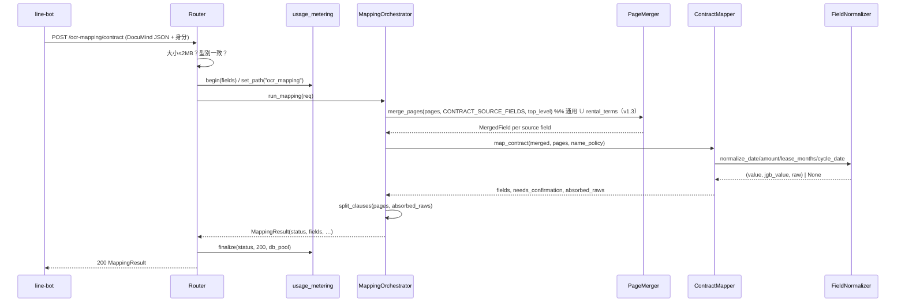

# 技術設計：documind-ocr-mapping

> 建立時間：2026-09-03
> 需求文件：requirements.md（v4）　研究記錄：research.md　落差分析：validation_gap.md　版本：1.3
> 發現流程：light（擴充型）

## 概述

### 設計目標
本設計提供一支同步、無狀態的 HTTP 端點，接收 DocuMind OCR 回應 JSON，經多頁合併、領域映射與決定性換算後，回傳帶逐欄出處與信心度的 JGB 欄位草稿。所有數值僅由 OCR 文字或決定性規則產生；LLM（若啟用）只准回傳原文片段。[需求 1–9]

### 範圍與邊界
- 涵蓋：`transcript` 與 `contract` 兩型的映射、多頁合併、曆法／數字換算、押金規則、未映射條款、信心度透傳、計量、契約測試。
- 不涵蓋：呼叫 DocuMind、檔案處理、寫入 JGB、LIFF 介面、DocuMind 認證與併發保護（上線前置條件，由 line-bot 側負責）。[需求「範圍外」]

## 架構設計

### Architecture Pattern & Boundary Map
採用既有 rag-orchestrator 的 **Router → Service（純函式管線）** 分層；本案 Service 層不接觸資料庫，唯一副作用為 `usage_events` 計量與（旗標開啟時）一次 OpenAI 呼叫。

```mermaid
graph TD
    LB[line-bot-platform] -->|POST /api/v1/ocr-mapping/{type}<br/>X-API-Key| MW[api_key_auth middleware<br/>既有・零改動]
    MW --> R[routers/ocr_mapping.py]
    R -->|body ≤ 2MB, type 守門| M[services/ocr_mapping/mapper.py<br/>MappingOrchestrator]
    M --> PM[page_merger.py]
    M --> TM[transcript_mapper.py]
    M --> CM[contract_mapper.py]
    CM --> FN[field_normalizer.py<br/>民國年・中文數字・租期]
    CM --> DP[deposit_rule.py<br/>二選一・⛔不推算]
    CM --> NS[name_splitter.py]
    M --> CS[clause_splitter.py]
    R -->|begin/set_path/add_llm_usage/finalize| UM[usage_metering<br/>既有]
    UM --> DB[(usage_events)]
    R -->|MappingResult JSON| LB
```

邊界：虛線路徑僅在旗標開啟時存在；DocuMind 與 JGB 皆在系統邊界之外，本服務不與其通訊。

### Technology Stack & Alignment

| 層級 | 技術 | 版本 | 說明 |
|------|------|------|------|
| 後端 | FastAPI + Pydantic v2 | 既有 | `APIRouter(prefix="/api/v1/ocr-mapping")`，沿用 `document_converter.py` 骨架 |
| 認證 | `services/api_key_auth.py` | 既有 | 全域 middleware，本端點不列豁免 [需求 1.6] |
| 計量 | `services/usage_metering.py` | 既有 | 端點內 `begin／set_path／add_llm_usage／finalize` [需求 9.3] |
| LLM | `services/llm_provider.get_llm_provider` | 既有 | 僅 R8；`response_format=json_object` [需求 8] |
| 測試 | pytest（容器內 3.11）、`@pytest.mark.req` | 既有 | `tests/unit/ocr_mapping/` 新領域 [需求 10] |
| 新依賴 | 無 | — | ⛔ 不引入 `cn2an`（research.md 選型 1） |

## Components & Interface Contracts

### 核心元件

#### 元件 1：`routers/ocr_mapping.py`（OcrMappingRouter）
**責任**：HTTP 邊界——大小守門、型別守門、計量包覆、錯誤碼對映；不含任何映射邏輯。**v1.3**：D1 定案 A，元件 8 作廢——本端點全程無 LLM、無外呼。

**介面定義**：
```python
router = APIRouter(prefix="/api/v1/ocr-mapping", tags=["ocr-mapping"])

@router.post("/{document_type}", response_model=MappingResult)
async def map_document(document_type: str, request: Request) -> MappingResult | JSONResponse: ...
# ⚠️ 路徑參數刻意宣告 str（非 Enum）：不支援型別要走本端點的 400 UNSUPPORTED_DOCUMENT_TYPE，
#    ⛔ 不被 FastAPI 自動變成 422；body 以 request.body() 手讀，先建計量 context 再守門（拒絕亦計量）

class DocumentType(str, Enum):
    transcript = "transcript"
    contract = "contract"
```
**錯誤碼**（沿用 `{"detail": str, "error_code": str}`）：`DOCUMENT_TYPE_MISMATCH`(400)、`UNSUPPORTED_DOCUMENT_TYPE`(400)、`BODY_TOO_LARGE`(413)、`INVALID_DOCUMIND_PAYLOAD`(422)、`MAPPING_ERROR`(500，未預期例外，仍 `finalize(status="error")`)。`OCR_MAPPING_MAX_BODY_MB` 壞值／≤0／空 ⇒ 回預設 2。

**與需求對應**：[需求 1.1–1.6, 9.3, 9.3a, 9.3b]

#### 元件 2：`services/ocr_mapping/models.py`（契約模型）
**責任**：輸入（DocuMind 回應）與輸出（草稿）的 Pydantic 型別；`fields` 鍵集合對同型恆定。

**介面定義**：
```python
class DocuMindPage(BaseModel):
    page_number: int
    ocr_raw: OcrRaw                      # {text: str, confidence: float}
    structured_data: dict[str, Any]      # 依型別而異，於 mapper 內再以型別化模型解析
    field_confidences: dict[str, float] = {}
    llm_postprocessed: Optional[dict] = None

class OcrMappingRequest(BaseModel):
    document_type: DocumentType
    total_pages: int
    pages: list[DocuMindPage]
    needs_review: bool
    review_item_id: Optional[str] = None
    stats: Optional[DocuMindStats] = None
    field_confidences: dict[str, float] = {}   # 頂層（可能空）
    consensus: Optional[dict[str, Any]] = None
    vendor_id: int
    role_id: str
    user_id: Optional[str] = None
    mode: Literal["b2c", "b2b"] = "b2c"
    target_user: Optional[str] = None          # 供 usage_metering.begin 判 user_type
    session_id: Optional[str] = None           # 前綴命中 INTERNAL_RULES ⇒ is_internal

class FieldSource(str, Enum):
    ocr = "ocr"; derived = "derived"; llm_extracted = "llm_extracted"; absent = "absent"

class FieldValue(BaseModel):                   # 沿用 repair_prefill.SlotValue 的「值＋出處」語意
    value: Optional[Union[str, int, float, list[str]]] = None
    jgb_value: Optional[Union[str, int, float]] = None
    confidence: Optional[float] = None
    confidence_source: Literal["field", "page_level"] = "field"
    source: FieldSource = FieldSource.absent
    raw: Optional[str] = None
    page: Optional[int] = None
    conflicts: list[FieldConflict] = []        # {value, page, confidence}

class Provenance(BaseModel):
    document_type: DocumentType
    total_pages: int
    needs_review: bool
    review_item_id: Optional[str]
    documind_estimated_cost: Optional[float]
    mapping_version: str
    notes: list[str] = []

class MappingResult(BaseModel):
    status: Literal["draft", "ready"]
    document_type: DocumentType
    fields: dict[str, FieldValue]              # 鍵集合由 TRANSCRIPT_FIELDS / CONTRACT_FIELDS 常數定義
    needs_confirmation: list[str]
    unmapped_clauses: list[str]
    provenance: Provenance
```
**與需求對應**：[需求 1.1, 3.5, 7.4, 9.1, 9.2]

#### 元件 3：`services/ocr_mapping/page_merger.py`（PageMerger）
**責任**：把多頁 `structured_data` 合併為每欄一個 `MergedField`，記錄衝突；頂層共識非空時直接採用。

**介面定義**：
```python
@dataclass(frozen=True)
class MergedField:
    value: Optional[Any]; confidence: Optional[float]; page: Optional[int]
    conflicts: tuple[FieldConflict, ...]; confidence_source: Literal["field", "page_level"]

def merge_pages(pages: Sequence[DocuMindPage], field_names: Sequence[str],
                top_level_confidences: Mapping[str, float], consensus: Optional[Mapping[str, Any]]) -> dict[str, MergedField]: ...
```
規則：單頁非空→採用；多頁相同→採用、`confidence=max`、`page=首見`；多頁不同→`field_confidences` 最高者為值、其餘進 `conflicts`；`llm_postprocessed is None` 的頁照常參與；頂層 `consensus` 有該欄位時優先且不再做頁級合併。**非標量葉值**（dict、含 dict 的 list）先以 `json.dumps(sort_keys=True)` 字串化再比較（v1.1，符號 `_merge_one`）——DocuMind 回巢狀物件時 ⛔ 不得拋例外。
**與需求對應**：[需求 2.1–2.6]

#### 元件 4：`services/ocr_mapping/field_normalizer.py`（FieldNormalizer）
**責任**：全部決定性換算；每個函式回 `(value, jgb_value, raw)` 或 `None`（表示無法決定性解析）。⛔ 無 LLM、⛔ 無猜測。

**介面定義**：
```python
class NormalizedDate(NamedTuple):
    iso: str            # "2025-01-21"
    ymd: int            # 20250121
    raw: str
    calendar: Literal["roc", "gregorian"]

def normalize_date(text: str) -> Optional[NormalizedDate]: ...      # 民國三格式 + 西元三格式
def normalize_amount(text: str) -> Optional[tuple[int, str]]: ...    # 壹萬參仟捌佰元整 / 13,800元 → 13800；含「約」「以上」→ None
def normalize_area(text: str) -> Optional[tuple[float, str]]: ...    # "3,406.98平方公尺" → 3406.98
def normalize_lease_months(text: str) -> Optional[tuple[int, str]]: ... # 壹年→12、貳年→24、N個月→N
def normalize_cycle_date(text: str) -> Optional[tuple[int, str]]: ...  # 「每月五日前」→5；範圍外 1–31 → None
```
**與需求對應**：[需求 3.2, 4.1, 4.2, 5.1–5.6]

#### 元件 5：`services/ocr_mapping/transcript_mapper.py`（TranscriptMapper）
**責任**：五欄映射、面積數值化、多所有權人陣列、土地謄本註記。

**介面定義**：
```python
TRANSCRIPT_FIELDS: Final = ("land_number", "building_number", "area", "rights_scope", "owner")
def map_transcript(merged: Mapping[str, MergedField], pages: Sequence[DocuMindPage]) -> tuple[dict[str, FieldValue], list[str]]:  # (fields, notes)
```
**與需求對應**：[需求 3.1–3.5]

#### 元件 6：`services/ocr_mapping/contract_mapper.py`（ContractMapper）
**責任**：通用合約欄位＋租約專用 `rental_terms` → JGB 租約欄位（需求 4.1 表）、來源優先序（需求 4.6）、`date_end` 三來源擇一、必填缺漏標記、`payment_method` 轉條款。內含兩個子規則模組：

**來源優先序（v1.3，需求 4.6）**：`CONTRACT_RENTAL_MAP`（`rental_terms.date_start／date_end／monthly_rent／payment_day／tenant_name`）優先於 `CONTRACT_SOURCE_MAP`；`_prefer()` 在兩者皆可解析且不同時把通用值放進 `conflicts` 並吸收其 raw；租約值解析不了則退回通用、不算衝突。擷取群形狀各有專用換算：`_rental_rent_field`（無「元」的「13,800」「壹萬參仟捌佰」）、`_payment_day_field`（「5」；「月初／月底」不猜）、`field_normalizer._ROC_SPACED`（「114 1 21」）。⛔ `rental_terms.deposit` 不入表（金額／月數混鍵）。`CONTRACT_SOURCE_FIELDS`＝兩表聯集，供元件 9 交給元件 3 合併。

```python
CONTRACT_FIELDS: Final = ("date_start", "date_end", "lease_signing_date", "lease_months", "rent", "currency",
                          "cycle_date", "cycle", "deposit_type", "deposit", "deposit_amount",
                          "to_user_last_name", "to_user_first_name", "party_b_full_name",
                          "early_termination_days", "early_termination_penalty", "early_termination_penalty2")
REQUIRED_FOR_WRITE: Final = ("date_start", "date_end", "cycle_date", "rent")   # JGB isWriteDone 無條件必填

class ContractMapping(NamedTuple):
    fields: Dict[str, FieldValue]; needs_confirmation: List[str]; unmapped_from_fields: List[str]; absorbed_raws: List[str]

def map_contract(merged: Mapping[str, MergedField], pages: Sequence[DocuMindPage], *,
                 name_policy: NamePolicy = NamePolicy.split) -> ContractMapping: ...   # v1.3：與程式逐字同步（第三輪 verifier F4）
```

`deposit_rule.py`（v1.1：月數與金額**不限先後**，視窗內任何「N 個月」皆計）：
```python
class DepositDecision(NamedTuple):
    deposit_type: FieldValue; deposit: FieldValue; deposit_amount: FieldValue; needs_confirmation: bool
def decide_deposit(raw_text: Optional[str], page: Optional[int], confidence: Optional[float]) -> DepositDecision: ...
```
不變式（以測試守）：`deposit.value` 與 `deposit_amount.value` **不得同時非空**；`source∉{derived, llm_extracted}`。⚠️ 已知限制（獨立驗證 N2，DEFER）：它守輸出形狀，擋不住「推算後標成 `ocr` 並清掉兄弟欄」的洗白；真正守門是 `decide_deposit` 本身不含乘除。[需求 6.1–6.6]

`name_splitter.py`：
```python
class NamePolicy(str, Enum): split = "split"; keep_full = "keep_full"      # D3
def split_name(full: str, policy: NamePolicy) -> tuple[FieldValue, FieldValue, FieldValue]:  # (last, first, full)
```
複姓表命中取兩字，否則首字；`policy=split` 時兩欄一律進 `needs_confirmation`。
**到期日與提前終止（v1.1）**：`_END_DATE` 先讀「…起至 <日期> 止」明文 → `date_end`；`_LEASE_WINDOW`（遇標點即停）→ `lease_months` → 推算值只當 fallback，與明文不一致才進 `conflicts` 反白；`_ET_WINDOW`＋`_ET_DAYS`「N 日／天前」→ `early_termination_days`（derived、反白）。⛔ 全部決定性、無 LLM。

**與需求對應**：[需求 4.1–4.5, 6.1–6.6]

#### 元件 7：`services/ocr_mapping/clause_splitter.py`（ClauseSplitter）
**責任**：對 `ocr_raw.text` 粗切條款、過濾無金額／期間／義務語者、去除**整段**落在已映射 `raw` 內或**拿掉已映射片段後無任何訊號**者（v1.1：部分重疊 ⛔ 不整條刪，寧多列不可丟）。

```python
def split_clauses(pages: Sequence[DocuMindPage], absorbed_raws: Iterable[str]) -> list[str]: ...
```
**與需求對應**：[需求 7.1–7.3]

#### 元件 8：`services/ocr_mapping/second_pass_extractor.py`（⛔ **作廢**，v1.3——D1 定案 A）
**狀態**：未實作、不再實作。DocuMind 已輸出 `rental_terms`（見元件 6 來源優先序）；缺的欄位由 DocuMind 側補樣式，⛔ chatai 不對 OCR 內文跑 LLM。以下介面保留供追溯。

**（作廢前的責任）**：對缺漏欄位以 LLM 取得**原文片段**，交 FieldNormalizer 換算；片段必須可在 `ocr_raw.text`（空白／全半形正規化後）中定位。

```python
class SpanHit(NamedTuple): field: str; evidence_span: str; page: int; llm_confidence: float
async def extract_spans(missing: Sequence[str], pages: Sequence[DocuMindPage], provider: LLMProvider,
                        timeout_s: float) -> list[SpanHit]: ...
def resolve_spans(hits: Sequence[SpanHit], pages: Sequence[DocuMindPage]) -> dict[str, FieldValue]: ...  # 定位失敗 → absent；confidence=min(llm, page ocr_raw.confidence)
```
⛔ 對 `rent／deposit_amount／date_start／date_end` 只接受片段，數值一律由元件 4 產生。
**與需求對應**：[需求 8.1–8.6（已作廢）]

#### 元件 9：`services/ocr_mapping/mapper.py`（MappingOrchestrator）
**責任**：串接元件 3–7（元件 8 已作廢），以 `CONTRACT_SOURCE_FIELDS` 交元件 3 合併，彙整 `needs_confirmation`（去重、順序穩定）、決定 `status`、組 `Provenance`。

```python
def run_mapping(req: OcrMappingRequest, *, name_policy: NamePolicy = NamePolicy.split) -> MappingResult: ...
# v1.3：最終簽名——同步、無 I/O、無 LLM；元件 8 已作廢（D1 定案 A）。
```
`status` 規則：`needs_review` 為真 **或** 任一 `REQUIRED_FOR_WRITE` 為 `absent` ⇒ `draft`；否則 `ready`。
**與需求對應**：[需求 1.4, 4.4, 7.5, 7.6, 9.1]

### 資料模型
見元件 2；`fields` 的鍵集合由 `TRANSCRIPT_FIELDS`／`CONTRACT_FIELDS` 常數固定 [需求 4.3, 9.1]。

### API 設計

```
POST /api/v1/ocr-mapping/contract
X-API-Key: <既有機制>
Content-Type: application/json

Request:
{ "document_type": "contract", "total_pages": 12, "pages": [ {…DocuMind 頁…} ],
  "needs_review": true, "review_item_id": "9856…", "stats": {"estimated_cost": 0.11},
  "vendor_id": 1, "role_id": "20151", "user_id": "12291", "mode": "b2c", "target_user": "landlord",
  "session_id": "backtest_session_ocr_demo01" }

Response 200:
{ "status": "draft", "document_type": "contract",
  "fields": { "date_start": {"value":"2025-01-21","jgb_value":20250121,"confidence":0.9,"source":"derived","raw":"中華民國114年1月21日","page":1,"conflicts":[]},
              "deposit": {"value":null,"jgb_value":null,"confidence":null,"source":"absent"}, … },
  "needs_confirmation": ["cycle_date","to_user_last_name","to_user_first_name"],
  "unmapped_clauses": ["半年繳整年優惠6000"],
  "provenance": {"document_type":"contract","total_pages":12,"needs_review":true,"review_item_id":"9856…","documind_estimated_cost":0.11,"mapping_version":"1.0.0","notes":[]} }

Response 400: {"detail":"…","error_code":"DOCUMENT_TYPE_MISMATCH"}
Response 413: {"detail":"…","error_code":"BODY_TOO_LARGE"}
```

## 資料流程

### 主要流程圖



### 資料轉換
`DocuMind pages[].structured_data`（鍵依型）→ `MergedField`（跨頁一欄一值＋衝突）→ `FieldValue`（JGB 鍵名、`value`／`jgb_value`／`source`／`raw`）→ `MappingResult`。轉換全程保留 `raw`，使每個 `derived` 值可逆對照 [需求 5.6]。

## 技術決策

### 決策 1：計量落點
**問題**：既有 middleware 只計量 `/api/v1/message`。
**選項**：1. 擴 middleware 路徑集合——需複製「讀 body 後回灌 `_receive`」技巧、動 usage-metering spec；2. 端點內 `begin／finalize`——純函式呼叫、冪等、零改既有。
**決定**：選項 2。**理由**：research.md 主題 1；⛔ 不得雙落點。**參考**：`services/usage_metering.py` 符號 `finalize`。

### 決策 2：中文數字／民國年換算自寫
**決定**：自寫 `FieldNormalizer`。**理由**：research.md 選型 1（詞彙封閉、零依賴、`raw` 可逆）。

### 決策 3：租約特有欄位（D1，✅ 業主 2026-09-04 定案 **A**）
**選項**：A DocuMind 供給租約欄位；B `SecondPassExtractor`。
**決定**：**A**。**理由**：查 `~/jgb/DocuMind` 原碼發現 `contract` 型早已輸出 `rental_terms`（research.md 主題 3 更正），chatai 只需加映射表；B 會讓 OCR 內文經 LLM，違反「AI 不碰數字」且多一段延遲。**代價**：DocuMind 樣式 63/76 條要求「標籤：值」制式寫法，自由文句合約仍靠 chatai 的 `ocr_raw.text` 正則；`deposit` 混鍵、`cycle`／`early_termination_penalty*` 待 DocuMind 補（BACKLOG）。元件 8 與 `ENABLE_OCR_SECOND_PASS` 作廢。

### 決策 4：端點形狀（D2，⚠️ 待業主）
**決定**：新資源 `POST /api/v1/ocr-mapping/{document_type}`。**理由**：research.md 選型 2。

### 決策 5：姓名切分（D3，⚠️ 待業主）
**決定**：`NamePolicy` 可切換，預設 `split`＋兩欄恆進 `needs_confirmation`，並保留 `party_b_full_name`。

### 決策 6：日期雙值
**決定**：`value` ISO ＋ `jgb_value` `Ymd` 整數（需求 v2 已定）。**參考**：`jgb_system_api.py` mock `"date_start": 20260401`。

## 非功能性設計

### 效能考量
純規則路徑無 I/O，預期 < 200 ms；R8 路徑以「只送含押金／繳／解約關鍵詞的頁」控制 prompt 量，逾時 8 s 後降級。[需求 9.4]

### 安全性設計
- 認證沿用 `X-API-Key` middleware；本端點 ⛔ 不加入 `_EXEMPT_*`。[需求 1.6]
- 個資：日誌僅記欄位名／`source`／`confidence`；`usage_events` 不落值；`ocr_raw.text` 只送既有 OpenAI 通道。[需求 9.5]
- ⚠️ **回應體本身帶個資**：每欄 `raw` 是原文片段（承租人姓名、地址、金額）——這是給 LIFF 比對用的設計；「不落個資」只約束 chatai 的日誌與計量，⛔ 不代表回應可任意寫進呼叫端 log。
- 輸入驗證：Pydantic 嚴格模型、2 MB 上限、型別枚舉。[需求 1.2–1.5]
- 上線前置（範圍外）：DocuMind 加認證與 IP 白名單、line-bot 串列化——未滿足前只在 `backtest_session_` 前綴下驗證。

### 可擴展性
新增文件型別＝新增一支 `*_mapper.py` 與一組 `*_FIELDS` 常數，Router 與 Orchestrator 零改動；映射表以模組常數表達，D1 選 A 時只替換 `CONTRACT_SOURCE_MAP`。

### 錯誤處理
| 類別 | 例 | 處置 |
|------|----|------|
| 驗證錯誤 | 型別不符、超大、Pydantic 失敗 | 400／413／422 ＋ `error_code`；計量 `finalize(status="rejected", http_status)` |
| 資料缺漏 | 空頁、欄位抽不到 | 200 `draft`，`absent`＋`needs_confirmation`，⛔ 不 500 [需求 1.4] |
| 外部失敗 | R8 LLM 逾時／例外 | 略過第二段、`provenance.notes` 記錄、200 [需求 8.5] |
| 系統錯誤 | 未預期例外 | 500，計量 `finalize(status="error", 500)`，日誌不含個資 |

## 測試策略

### 單元測試（`tests/unit/ocr_mapping/`，marker `unit`）
- `test_field_normalizer_req.py`：R5 每條正反例（民國三格式、西元三格式、大寫金額、千分位、「約」→None、租期詞）。
- `test_deposit_rule_req.py`：R6.1–6.4 正例；**突變控制**：注入 `deposit_amount ÷ rent` 後 R6.5 測試必紅 [需求 10.3]。
- `test_page_merger_req.py`：R2.1–2.6（含 `llm_postprocessed=None`、頂層 consensus 優先）。
- `test_transcript_mapper_req.py`、`test_contract_mapper_req.py`：R3／R4 逐條；`fields` 鍵集合恆定。
- `test_clause_splitter_req.py`：R7.1–7.3。
- `test_models_contract_req.py`：以 Pydantic 直接驗請求／回應契約（沿用 `test_api_request_contract_req.py` 模式）。
- `test_rental_terms_req.py`（v1.3）：R4.6 來源優先序 24 案例——租約值優先／同值不同寫法不衝突／解析不了退回通用／「114 1 21」／無「元」月租／「月初」不猜／`deposit` 不消費／`run_mapping` 端到端。
- fixture：DocuMind 文件樣本（謄本 4 頁，去識別化）。

### 整合測試（`integration`，`RUN_INTEGRATION=1`）
- 端點內計量：呼叫一次後 `usage_events` 出現 `processing_path='ocr_mapping'`、無欄位值 [需求 9.3, 9.5]。

### 端對端測試（`e2e`，`RUN_E2E=1`；**暫掛至真實 fixture 到位**）
- 真實謄本／合約回應經正式端點，逐欄對照人工判讀，落 `.kiro/specs/documind-ocr-mapping/e2e-*.md` [需求 10.4]。

## 部署考量

### 環境需求
| 變數 | 預設 | 說明 |
|------|------|------|
| `OCR_MAPPING_MAX_BODY_MB` | `2` | 413 門檻 |

### 部署步驟
與既有服務同流程：`docker compose build rag-orchestrator` → `up -d`；無 migration。⚠️ 生產由業主依 runbook 執行，本 spec 不排部署。

### 監控與告警
`usage_events` 依 `processing_path='ocr_mapping'` 聚合：呼叫量、`draft` 比例、`needs_confirmation` 平均長度、R8 觸發率與成本。

## 風險與挑戰

| 風險 | 影響 | 機率 | 緩解策略 |
|------|------|------|---------|
| D1 未拍板致 `contract` 型抽不到租約欄位 | 高 | 高 | 兩路並存、旗標切換；拍板後零架構改動 |
| 無真實 fixture | 高 | 高 | 單測以文件樣本；e2e 暫掛並在驗收矩陣標明 |
| OCR 噪音致 `evidence_span` 定位失敗 | 中 | 中 | 正規化空白／全半形；失敗降 `absent` |
| 姓名切分誤判 | 低 | 中 | 恆進 `needs_confirmation`＋保留全名 |
| 計量雙落點 | 中 | 低 | 只在端點內記，middleware 不動 |

## 參考文件
- [需求文件](requirements.md)、[研究記錄](research.md)、[落差分析](validation_gap.md)
- line-bot `docs/chatai-integration-scenario.md` v5、`docs/jgb-contract-api-spec.md`
- chatai：`services/usage_metering.py`、`services/jgb/repair_prefill.py`、`routers/document_converter.py`

## 附錄

### 名詞解釋
- **決定性換算**：無 LLM、無猜測、同輸入恆同輸出的規則轉換。
- **假可逆**：字面可回復但實務上單向的動作（本案無 DB 寫入，不適用）。

### 變更歷史
| 日期 | 版本 | 變更內容 | 修改者 |
|------|------|---------|--------|
| 2026-09-03 | 1.0 | 初始版本 | AI |
| 2026-09-03 | 1.1 | 兩輪獨立驗證＋實打回修 8 條：元件 6 加明文到期日／提前終止日數／押金不限順序、元件 7 吸收規則改「剩餘無訊號才刪」、元件 3 非標量葉值字串化、元件 1 壞 env 回預設與 500 `MAPPING_ERROR` 仍計量；N2 記為已知限制 | AI |
| 2026-09-03 | 1.2 | 第三輪文件↔程式審查 3 條 P2 全 FIX（文件面）：元件 9 簽名改為實際同步過渡簽名；元件 3 本文補非標量葉值字串化；安全性設計補「回應體 `raw` 帶個資」；R5.4「半年」改寫為「N年半」；收尾審查再抓 1 條：元件 8 呼叫者三處不一致 ⇒ 定案 router 接入（架構圖／序列圖／元件 1／元件 9 同步） | AI |
| 2026-09-04 | 1.3 | D1 定案 A：元件 6 加 `CONTRACT_RENTAL_MAP`／`_prefer` 來源優先序、`date_end` 三來源；元件 4 加 `_ROC_SPACED`；元件 8 與三個 `OCR_SECOND_PASS*` 環境變數作廢；架構圖／序列圖移除 SP／LLM；決策 3 結案 | AI |

---

*本文件遵循專案規範中的設計原則，所有介面定義採用強型別（Python type hints），不使用未型別化的自由結構作為公開契約。*
