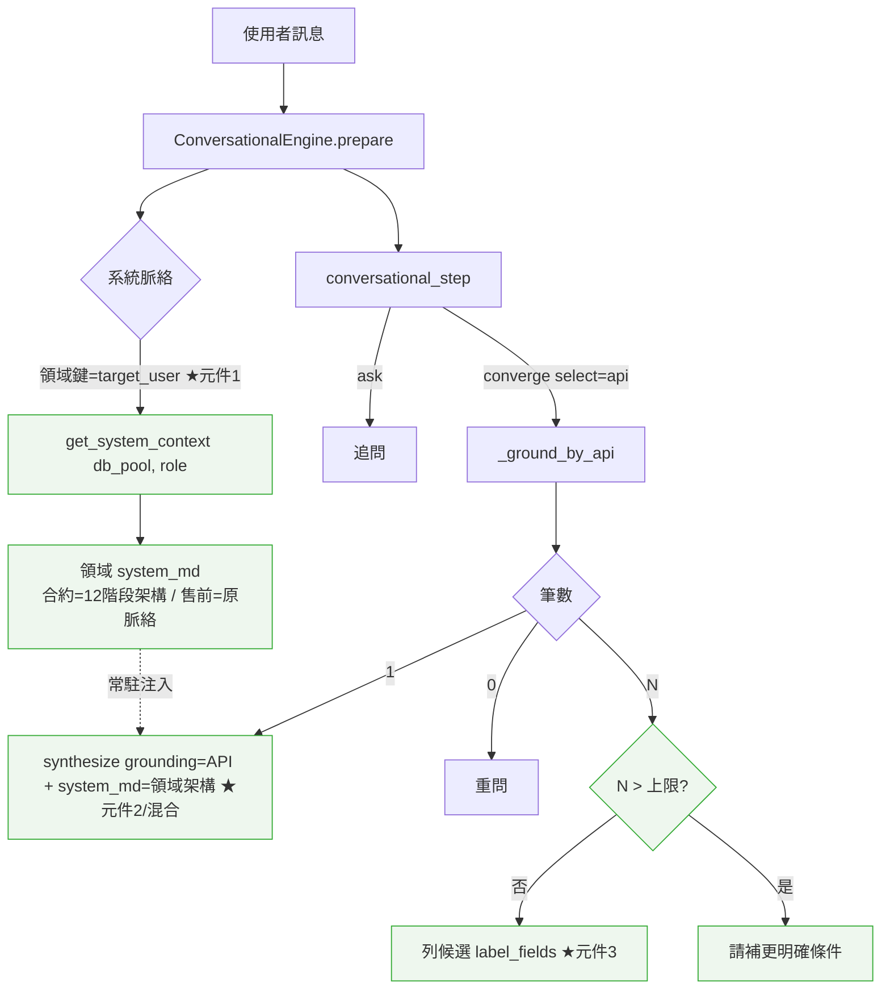
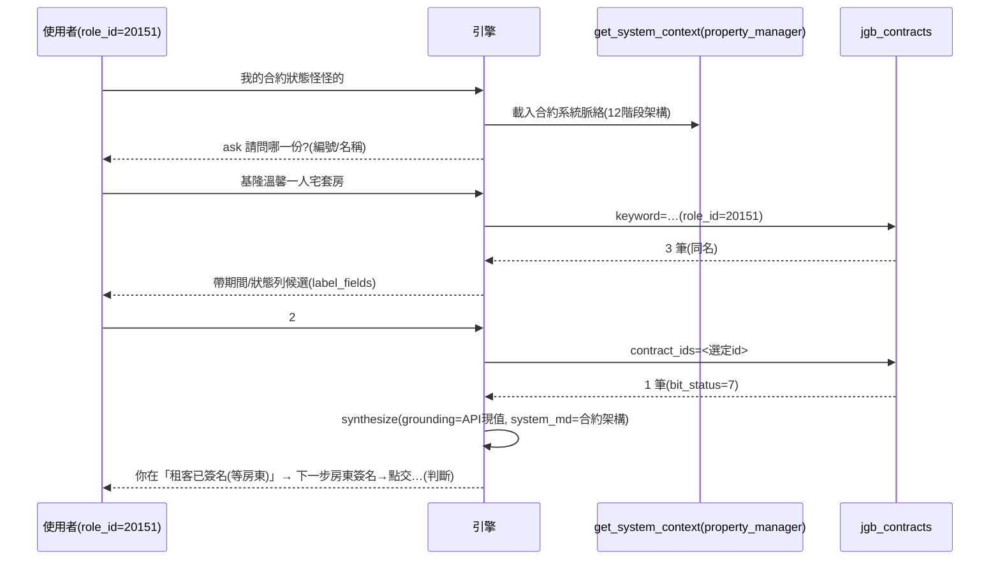

# 技術設計：domain-conversational-facets（領域化對話面向）

> 建立時間：2026-07-01　需求：requirements.md（R1–R8）｜落差：gap-analysis.md｜研究：research.md
> 性質：Extension（既有對話引擎 + 系統脈絡 + grounding 之加性擴充）

## 概述

### 設計目標
把對話面向從「全域一份系統脈絡 + 收斂時各自檢索」升級為「**以母分類組織的領域**，每領域自帶系統脈絡/規則/知識/API」，並讓診斷型收斂具備**領域框架**以判斷（而非複述 API）。[R1–R8]

### 範圍與邊界
**涵蓋**：`get_system_context` per-領域化、混合 grounding（領域知識 + API）、候選可辨識、合約領域基底架構資料、通用零硬編。
**不涵蓋**：派發器/檢索 pipeline/reranker/表單/DB schema 核心；售前對話行為（僅其系統脈絡改由領域機制供給、內容不變）；`conversational-diagnosis` 既有能力重做（本 spec 為其上增修）。

### 承接關係
建於 `conversational-diagnosis`（已交付 select:api 三路、插點 A/B、分類路由、依分類查設定）之上。

## 架構設計

### Architecture Pattern & Boundary Map
擴充三個邊界：**(1) 系統脈絡載入**（全域→per-領域）、**(2) 收斂合成底稿**（API→API＋領域知識）、**(3) 多筆候選呈現**（title→帶區別欄位）。



> 核心決策（見技術決策 D3）：**基底架構走 per-領域 system_md（常駐注入）**，故「混合」發生在 `synthesize(grounding=API, system_md=領域架構)`——`_ground_by_api` 零改。

### Technology Stack & Alignment
| 層級 | 技術 | 說明 |
|------|------|------|
| 系統脈絡 | `system_context.py`（既有） | 參數化為 per-領域（照 `load_rules` 模式），per-key 快取 |
| 對話引擎 | `ConversationalEngine`（既有） | `_get_system_context` 呼叫點傳領域鍵；`_ground_by_api` 候選建構擴充 |
| 領域組織 | `category_config.parent_value`（既有欄位） | 母/子分類，慣例組織，不建新表 |
| 合成 | `synthesize_presales_answer`（既有，已吃 grounding+system_md） | 直接重用，不改 |
| 型別 | Python type hints、dataclass、TypedDict 風格 dict 契約 | 邊界明確 |

## Components & Interface Contracts

### 核心元件 1：per-領域系統脈絡（`system_context.py`）[R2, R1.3]
> ⚠️ 修正（審查 Issue 1）：**疊加（layered）而非取代**。現有系統脈絡（id 3622, `target_user=NULL`, 1377 字）是**共用產品底座**；領域脈絡若取代它會丟失產品底座或被迫重複。改為「共用 base ＋ 領域 append」串接。
```python
# 疊加載入：共用 base（通用產品脈絡）＋ 領域 append（該領域基底架構）；快取 per-key。
async def get_system_context(db_pool, domain_key: Optional[str] = None) -> str:
    """回「base ＋（領域 append，若有）」。
    - base = category='系統脈絡' 且 target_user IS NULL 的通用列（現有 3622）。
    - 領域 append = category='系統脈絡' 且 target_user @> [domain_key]（如合約=property_manager）。
    - 無 domain_key 或無領域 append → 只回 base；base 亦無 → MINIMAL_FALLBACK。
    per-key 記憶體快取（key＝domain_key 或 ""）。"""
```
- 領域鍵＝`target_user`（照 `load_rules(db_pool, role)` 同構；合約=property_manager）。
- 查詢：分別取 base（`target_user IS NULL`）與領域 append（`target_user @> [domain_key]`）；`system_md = base + ("\n\n" + append if append)`。
- **售前不回歸**：售前無領域 append → 只吃 base（現有 3622）→ **與現況完全相同**（疊加設計反而比取代更安全）。
- 快取：`_cache: Dict[str, Optional[str]]`（key＝domain_key 或 `""`，值＝已串接的 system_md）；`reset_cache` 清全部。
- 引擎呼叫點（`conversational_engine.py` prepare 與插點A 兩處）：`self._get_system_context(self.db_pool, config.persona_role)`。`app.py` 注入的 fn 簽名向後相容（新增可選參數）。

### 核心元件 2：混合 grounding（合成底稿＝API＋領域 system_md）[R3, R4.1 修訂, R5.3]
- **不新增元件**：收斂決策已回 `grounding`（API）與 `system_md`（領域架構，元件1）；`handle/stream_answer` 呼叫既有 `synthesize_presales_answer(grounding, ctx, system_md, …)` 時，LLM 底稿**自然同時含兩者**。
- 合成端 prompt/persona 規則加一條原則（rules_text 資料，非程式）：「**以 API 現值為準，領域架構僅供解讀，不得以通則覆寫實際資料**」[R3.2]。
- `bit_status` 逐位元解讀：由既有 `jgb_response_formatter`（已能逐位元，見 research.md 真 API 驗證）產 `formatted_response`；領域 system_md 提供 12 階段語義供 LLM 解讀 [R5.3]。
- **可選 escape hatch（R3.3/R3.4 向後相容）**：`grounding_scope.knowledge_ref`（`{select:category|ids,…}`）——若某面向要「收斂時檢索領域知識」而非常駐 system_md，`_ground_by_api` 收斂時以既有 `_grounding_by_category`/`_grounding_by_ids` 撈並併入 grounding。**預設不設＝走 system_md（元件1）**；未設不改行為。

### 核心元件 3：多筆候選可辨識（`_ground_by_api` 候選建構）[R4]
> ⚠️ 修正（審查 Issue 2）：**「列候選」與「請補條件」適用情境不同,不可混為單一門檻**。真 API 只吃 `keyword`/`contract_ids`——**同名多份**(如「基隆溫馨一人宅套房」回 3 筆同名)補任何文字條件重查仍回同筆數,**唯一出路是列候選帶區別欄位選序號**;**請補條件**只對「不同名的大集合」(如「套房」50 筆→補完整名縮小)有效。
```python
# result_mapping 擴充（設定，payload 不變）
# {
#   "list_path":"data", "id_field":"id", "label_field":"title",   # 既有
#   "label_fields":["title","date_start","date_end","status"],     # ★候選標籤多欄位(辨識用)
#   "label_date_fields":["date_start","date_end"],                 # ★可選：日期格式化(Ymd→Y/m/d)
#   "candidate_cap": 8                                             # ★可選：列候選上限
# }
```
**候選 label**：有 `label_fields` → 依序取值（`label_date_fields` 者格式化）以「｜」串接；無 → 沿用單 `label_field`（向後相容）。id/label 欄位一律讀 `result_mapping`（零硬編,R6.1）。

**分流（N 筆時）**：
- **N ≤ candidate_cap** → **列候選**（帶 label_fields 區別欄位）存 `pending_candidates`,由插點A 序號/名稱/id 比對選擇 [R4.1/R4.4]。**同名多份靠此解決**（區別欄位使可辨識）。
- **N > candidate_cap** →
  - 先嘗試**請補更明確識別**（完整名稱/編號/期間關鍵字）→ 使用者補後**重查**（對不同名大集合有效,收斂 keyword）[R4.3]；
  - 但**若補條件無法縮小**（同名多份的極端,重查仍 > cap）→ 最終退回**截斷列前 candidate_cap 筆帶區別欄位**並提示「僅顯示前 N 筆,可給合約編號直接指定」,避免死迴圈。
- `candidate_cap` 未設＝不限（既有行為,向後相容）。
- 註：對「同名多份」最可靠的收斂是**序號選擇或給 id（contract_ids 精確查）**;keyword 補條件對同名無效——此為 D4 分流的核心依據（真資料佐證）。

### 核心元件 4：領域組織（母分類 + 領域鍵，慣例）[R1]
- 不建新表：一個領域＝一個母分類值（`category_config.parent_value`），其四件套以既有欄位對應：
  - 系統脈絡：`category='系統脈絡'` + `target_user=[領域鍵]`（元件1）。
  - 對話規則：`category='對話規則'` + `target_user=[領域鍵]`（既有 `load_rules`）。
  - 一般知識：`categories` 掛該領域（母分類父層展開，既有 `_grounding_by_category`）。
  - API 設定：診斷 config 的 `grounding_scope`（既有）。
- 診斷面向 `topic_scope.category` 宣告領域；領域鍵沿用其 `persona_role`（=target_user）。

### 核心元件 5：合約領域資料（首案）[R5]
- 合約系統脈絡：把 `knowledge-contract-base.md`（已對齊真碼）落成 `category='系統脈絡'`、`target_user=[property_manager]` 之列（種子）。
- 一般合約知識維持 `direct_answer`（三出口不變，R5.4）。

### 資料模型：ConversationalConfig.grounding_scope（api 型・擴充）
```jsonc
{
  "select": "api", "endpoint": "jgb_contracts", "required_slots": ["contract_ref"],
  "params": { ... },                                  // 既有
  "result_mapping": {
    "list_path":"data", "id_field":"id", "label_field":"title",
    "label_fields":["title","date_start","date_end"], // ★R4
    "label_date_fields":["date_start","date_end"],     // ★R4
    "candidate_cap": 8,                                // ★R4
    "refine_param":"contract_ids"
  },
  "knowledge_ref": null                                // ★R3 可選；null=領域知識走 system_md
}
```

## 資料流程

### 合約查詢（多筆→選擇→單筆，含混合）


## 技術決策

### D1：領域＝母分類 + 慣例（不建新表）[R1, R6]
**決定**：以 `category_config.parent_value` 當領域、四件套用既有欄位對應。**理由**：零 schema、與既有父層展開/`load_rules`/`topic_scope` 一致；新領域＝加資料。

### D2：領域鍵＝`target_user`，**疊加載入**（照 `load_rules`）[R2；審查 Issue 1]
**決定**：系統脈絡按 `target_user` 分領域，**共用 base（NULL 通用列）＋ 領域 append 串接**（非取代）。**理由**：與既有規則載入同構；現有 3622（NULL）確認為共用底座 → 疊加保底座、不重複；售前無 append＝只吃 base＝**完全不變**（比取代更安全）。**替代**：取代式（會丟底座）；母分類鍵（受保留分類限制）；config ref（多接線）。

### D3：混合 grounding 走 system_md（選項 A）+ 預算閘 [R3；審查關鍵決策/Issue 3]
**決定**：領域基底架構＝**per-領域 system_md append，常駐注入**；混合發生於 `synthesize(grounding=API, system_md=base+架構)`，`_ground_by_api` 零改。
**理由**：判斷框架應為**常駐背景**（含追問輪）；`synthesize` 本就吃 system_md → 幾乎零改。
**⚠️ 可行性閘（Issue 3）**：現有 base 1377 字、上限 `MAX_CHARS_WARN=4500`。**task 前先做 spike**：把合約架構壓到目標 **append ≤ ~2500 字**（base+append ≤ ~3900，留餘裕）且仍夠 LLM 判斷。**Fallback 觸發**：若壓不下（append > ~2500 仍需完整）→ 改**選項 B**：`grounding_scope.knowledge_ref` 於收斂時以 `_grounding_by_category` 撈合約管理知識併入 grounding（不佔每輪 token）。escape hatch 已在元件2 保留。
**替代（記錄）**：B 收斂時檢索（追問輪無框架）；C A+B 併用。

### D4：候選分流（列候選 vs 請補條件）+ 區別欄位 [R4；審查 Issue 2]
**決定**：`result_mapping.label_fields`（+日期格式化）組帶區別欄位之候選標籤；**N ≤ cap → 列候選選序號（同名多份靠此解）**；**N > cap → 請補更明確識別重查（對不同名大集合有效），補不動則截斷列前 cap 筆提示給編號**。**理由**：真 API 只吃 keyword/contract_ids → 同名多份補條件重查無效,只能列候選/給 id;不可用單一門檻混淆兩情境。

### D5：全向後相容預設 [R7]
**決定**：無 domain_key→通用脈絡；無 label_fields→單 label_field；無 candidate_cap→不限；無 knowledge_ref→走 system_md。**理由**：既有售前/診斷/查詢零回歸。

## 非功能性設計
- **效能**：system_md per-key 快取；合約架構精簡守字元上限（每輪注入）。候選上限避免超長清單與重複打 API。
- **安全**：role_id 由可信端帶入（沿用）；查無不杜撰（既有）。
- **可擴展**：新領域＝母分類 + 四件套資料，零改程式（R6）。
- **錯誤處理**：系統脈絡載入失敗→`MINIMAL_FALLBACK`（既有）；領域無專屬脈絡→通用回退。

## 測試策略
- **單元**：`get_system_context(domain_key)` 命中領域/回退通用/快取隔離；候選 `label_fields` 組合 + 日期格式化 + `candidate_cap` 超過改 ask；向後相容（無設定→既有行為）；零硬編靜態掃描延伸。[R2,R4,R6,R7]
- **整合**：per-領域脈絡經 prepare 注入正確（合約≠售前）；混合合成底稿含 system_md（mock synthesize 驗傳入）。[R2,R3]
- **端對端（真 jgb2 API,role_id=20151）**：模糊→帶區別候選→選擇→單筆→以架構解讀真實狀態；候選過多→請補條件；售前不回歸。[R5,R8]

## 部署考量
- rag-orchestrator 程式更新（無 migration）；DB 新增合約系統脈絡列（種子，資料非 schema）+ 既有合約知識補標（承 conversational-diagnosis 8.2）。
- 套用後清快取（system_context/conversational_config/rules）或重啟即生效。

## 風險與挑戰
| 風險 | 影響 | 機率 | 緩解 |
|------|------|------|------|
| system_md per-key 快取破壞既有全域行為 | 中 | 低 | 疊加：base 不變、無鍵只回 base；per-key dict |
| 售前系統脈絡被領域化改動波及 | 高 | 低 | 疊加設計下售前無 append＝只吃 base(3622)＝不變；售前回歸測試 |
| 合約架構 append 壓不進預算→token/延遲 | 中 | 中 | D3 預算閘 spike；超標則 fallback 選項 B(knowledge_ref) |
| 同名多份「補條件」死迴圈 | 中 | 中 | D4 分流：同名靠列候選選序號/給 id；補不動則截斷提示 |
| 候選 label 欄位跨領域不一致 | 低 | 低 | 全讀 result_mapping、預設回退單 label |

## 需求對照（Traceability）
| 需求 | 元件/決策 |
|---|---|
| R1 母分類組織 | 元件4、D1 |
| R2 per-領域系統脈絡 | 元件1、D2 |
| R3 混合 grounding | 元件2、D3 |
| R4 候選可辨識 | 元件3、D4 |
| R5 合約首案 | 元件2/5、research.md |
| R6 通用性 | 元件3/4、D1/D5 |
| R7 不回歸 | D5、全元件向後相容 |
| R8 端到端驗證 | 測試策略 e2e |

## 參考
- [需求](requirements.md) [落差](gap-analysis.md) [研究/ground-truth](research.md) [合約知識草稿](knowledge-contract-base.md)
- steering：dialogue.md、knowledge.md

## 附錄：變更歷史
| 日期 | 版本 | 變更 | 修改者 |
|------|------|------|--------|
| 2026-07-01 | 1.0 | 初版（Extension；D1–D5，R2/R3 邊界定為選項 A）| AI |
| 2026-07-01 | 1.1 | 設計審查 3 修正：Issue1 系統脈絡取代→**疊加**（元件1/D2）；Issue2 候選**分流**（列候選 vs 補條件，元件3/D4）；Issue3 D3 加**預算閘 + spike + fallback 觸發** | AI |
| 2026-07-01 | 1.2 | 實作審視演進 → **面向化三層疊加**（詳見 [facet-architecture.md](facet-architecture.md)）：(1) 拆售前出真通用 base（缺口2 根本解，售前不回歸）；(2) 領域鍵由 target_user 改為 **topic_scope.category**（子面向值，同角色多領域不撞鍵）；(3) 系統脈絡拆「母共用＋子面向」，`get_system_context` 沿 category_config 父鏈**只載命中面向**（省 token）；(4) 冒號不一致改用真實分類（合約面向＝母『系統合約』/子『狀態判斷』）。元件1/D2 以 facet-architecture.md 為準 | AI |
