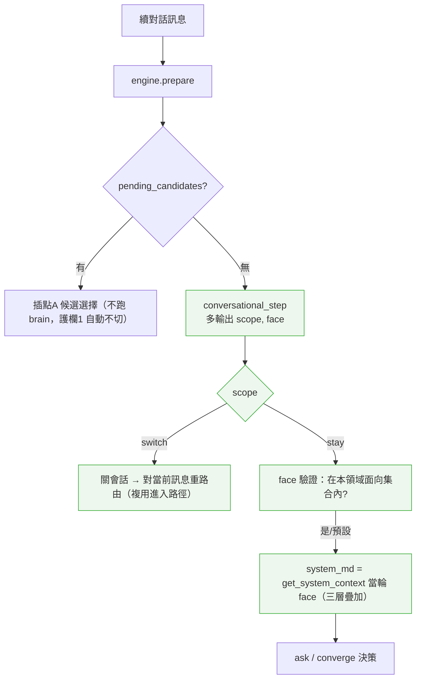

# 設計：對話中途切換（scope 換 config + face 換面向）— 方案 B

> 建立：2026-07-01｜承接：domain-conversational-facets（面向化三層疊加，見 facet-architecture.md）
> 性質：Extension。以「每輪本來就在跑的 brain（`conversational_step`）多報兩個訊號」為核心，解決「進入時鎖定 config／面向、中途無法切換」的問題。
> 狀態：design-draft（**待核准後才產 tasks / 實作**）。

## 一、問題與定案

現況（見 facet-architecture.md、chat.py 分派）：對話一旦進入，**config 與面向都鎖在進入那一輪**——
- config：續對話走 `state.config_key` 還原，`handle_conversational_session` 搶在 `handle_retrieval` 前，**不重路由**。
- 面向：`_domain_key(config)=topic_scope.category` 固定，系統脈絡不隨當輪問題換面向。

**定案（方案 B）**：偵測「該不該換」需要**對話脈絡**，而帶脈絡的 LLM（`conversational_step`）每輪本來就在跑——**讓它順便輸出兩個訊號**，比另外無狀態重檢索（方案 A）又準又便宜；C（維持現狀）接不住換話題。評估詳見對話記錄之打分表（B 加權 4.3 勝出）。

兩條軸、同一機制：
- **scope**：這句還屬不屬於目前 config 的職責 → 換 config（跨領域 合約→帳單、或進入路由錯）。
- **face**：這句屬本領域哪個面向 → 換系統脈絡面向（同領域 狀態判斷→違約金）。

## 二、架構



## 三、元件與介面契約

### 3.1 brain 輸出擴充（`conversational_step` JSON）
既有欄位不變，新增兩個（皆可選，缺省＝維持現狀，向後相容）：
```jsonc
{
  "action": "ask|converge", "converge_kind": "...", "extracted_fields": {...},
  "next_question": "...", "converge_topic": "...",
  "scope": "stay" | "switch",   // ★ 缺省='stay'。'switch'＝這句明顯不屬本 config 職責
  "face":  "<面向值>" | null      // ★ 缺省=null。本輪所屬面向（供載對應系統脈絡）
}
```
- brain 由 persona 規則指示如何判 scope/face（見 3.4）。
- **面向集合**由設定驅動：`config.topic_scope.faces`（明列）或衍生自 `category_config`（母分類＝`topic_scope.category` 之 parent，取其所有子分類）。集合注入 brain prompt（「【本領域可用面向】狀態判斷、違約金…」），brain 只能從中選。

### 3.2 引擎 `prepare` 控制流（改動點）
1. 讀 state → 還原 config（不變）。
2. **插點 A（pending_candidates）先行**（不變）——此時不跑 brain，**護欄1 自動成立**（候選選擇中不會被切走）。
3. 取 `system_md_step = get_system_context(當前 face)`，`當前 face = state.get('face') or _domain_key(config)`（沿用上一輪面向；首輪＝進入面向）。
4. 跑 `conversational_step(rules_text, system_md_step, state, user_message)` → 得 `scope`、`face`。
5. **scope='switch'（且非護欄1）** → `await self._close(session_id)`、回 `{"kind":"switch"}`（見 3.3 交接）。
6. **scope='stay'** →
   - `face_key = face if face in 面向集合 else _domain_key(config)`（護欄4：越界/空→退回進入面向）。
   - `state['face'] = face_key`（記住，下一輪沿用）。
   - 收斂路徑的 `system_md = get_system_context(face_key)`（換面向即在此生效；per-key 快取，換面向只多一次快取查詢）。
   - 其餘 ask/converge 決策（不變）。

### 3.3 中途換 config 的交接（複用既有降級路徑）
`scope='switch'` 的下游動作 = **關會話 + 對當前訊息重路由**，這正是既有「brain 降級」的處理：
- 引擎 `prepare` 回 `None`（或 `{"kind":"switch"}` 由 `handle` 轉 None）→ `_conversational_respond` 回 None。
- `handle_conversational_session`（chat.py）既有邏輯：關殘留會話、`ctx.session_state=None`、回 None → **落回一般流程 → `handle_retrieval` 對「當前這句」重跑路由** → 命中 B config（或落回一般知識/表單）。
- **關鍵前提**：switch 只在「**當前訊息是明確、可自行重路由的新主題**」時觸發（如「我帳單怎麼繳」）；靠它自己就能被檢索路由到 B。**不做跨輪「確認→切」**（否則使用者回「對」時，用「對」重路由會落空）——邊界情況改由 3.4 護欄2 處理。

### 3.4 persona 規則（資料，非程式）— 判 scope/face 的指示
加入診斷 persona（種子資料）：
- 【本輪範疇 scope】先判斷這句還是不是在處理你負責的事：
  - 是本領域、或在回答你剛問的識別/槽位（**即使字面像別的主題**，如合約名含「帳單」二字）→ `scope="stay"`。**護欄2 核心：槽位答案一律 stay。**
  - 明顯是另一個領域的新問題、且內容完整到可獨立理解（如「我這期帳單怎麼繳」）→ `scope="switch"`。
  - 不確定 → `scope="stay"` 並用 `next_question` 一句話澄清（**不要切**）。
- 【本輪面向 face】從【本領域可用面向】中選最貼近這句的一個；純識別/沒指向特定面向 → 沿用或留 null。

### 3.5 `_domain_key` 與面向集合（`conversational_engine.py`）
- 新增 `_domain_faces(config)`：回本領域面向集合（config.topic_scope.faces，或由 category_config 衍生）。
- `prepare` 用「當輪 face（驗證後）」取代固定 `_domain_key(config)` 作為系統脈絡鍵；`_domain_key(config)` 續作**預設/退回**值。

## 四、四條護欄（對應「品質」準則）

1. **待答中不切**：`pending_candidates` 存在 → 插點 A 先行、不跑 brain（自動）。另：state 有未答的必答槽位標記時，引擎**忽略 switch**（強制 stay，當作在答槽位）。
2. **邊界只澄清不切**：brain 不確定 → stay + 一句澄清；switch 僅限「明確、可獨立重路由」的新主題。→ 抗抖動核心。
3. **switch 後重路由當前訊息**，複用進入路徑；路由不到 → 落回一般流程（不阻斷）。
4. **face 護欄**：只接受本領域面向集合內的值；越界/空 → 退回進入面向（母共用；不出錯、不亂載）。

## 五、資料流程（三種代表情境）

```
情境1 誤路由更正（turn2）：
  turn1「合約狀態怪怪的」→ 進 狀態判斷診斷
  turn2「其實我想問這個月帳單」→ brain scope=switch → 關會話 → 重路由「…帳單」→ 帳單 config ✅

情境2 同領域換面向：
  turn1「合約狀態」→ 狀態判斷面向（base+系統合約+狀態判斷）
  turn3「那如果我要提前解約違約金怎算」→ brain scope=stay, face=違約金
     → system_md=get_system_context('違約金')=base+系統合約+違約金面向 ✅（config 不變）

情境3 抗抖動（槽位答案像 B）：
  turn1「查合約」→ 問「哪一份?」
  turn2「台電帳單大樓」→ brain 知道這是識別答案 → scope=stay（不因「帳單」二字誤切）✅
```

## 六、技術決策

- **D1 用 brain 訊號、不每輪重檢索**：偵測需脈絡；brain 每輪已跑，加欄位≈零成本；檢索只在 switch 時（罕見）才跑。抗抖動優於無狀態檢索。
- **D2 switch 複用降級路徑**：不新增派發器分支；`關會話 + session_state=None + 回 None` 既有機制即「重路由」。爆炸半徑小。
- **D3 不做跨輪確認切換**：避免「回『對』無法重路由」；邊界改為 stay+澄清。
- **D4 face 用當輪值、退回進入面向**：換面向只是把當輪 face 當系統脈絡鍵丟進既有三層疊加；越界安全退回。
- **D5 全設定驅動、向後相容**：未輸出 scope/face → 視為 stay / 進入面向 = **現狀行為不變**。面向集合讀設定或 category_config。

## 七、測試策略
- **單元**：mock `conversational_step` 回各種 (scope,face) →
  - scope=switch → 引擎關會話、回轉為 None（觸發重路由）；pending_candidates 在時 switch 被護欄1 忽略。
  - scope=stay + face=違約金 → 收斂 system_md == get_system_context('違約金')（三層含違約金面向）。
  - face 越界/None → 退回進入面向。
  - 槽位答案情境（brain 回 stay）→ 不切。
- **整合**：真 config（含 faces）→ 面向集合衍生正確；換面向載對應脈絡。
- **e2e**：情境 1/2/3 對真流程（gated）。

## 八、風險
| 風險 | 緩解 |
|---|---|
| brain 誤判 scope 亂切 | 護欄1/2（待答不切、邊界只澄清）；switch 僅限可獨立重路由之訊息；persona 明示「槽位答案一律 stay」 |
| switch 後重路由落空（訊息不夠明確）| 落回一般流程（不阻斷）；不做跨輪確認切 |
| 換面向載到不存在面向 | 護欄4 退回母共用 |
| brain 面向集合未注入→ face 亂填 | 面向集合注入 prompt、只接受集合內值 |
| 增加 step 輸出→ 舊 persona 無此欄位 | 缺省 stay/進入面向＝現狀不變（向後相容） |

## 九、影響檔案（實作預估）
- `services/llm_answer_optimizer.py::conversational_step`：輸出 schema + prompt 注入面向集合。
- `services/conversational_engine.py`：`prepare`（scope/face 處理、當輪 face 取脈絡）、`_domain_faces`、switch 交接。
- `routers/chat.py`：`handle_conversational_session` 確認 switch→重路由（多半沿用既有降級分支，微調）。
- 診斷 persona 種子：加 scope/face 判斷指示 + 可選 `topic_scope.faces`。
- 測試：新增 scope/face 單元 + 情境 e2e。

## 十、下一步
- 審核本設計 → 產 tasks（TDD）→ 實作。建議先 **scope（換 config）** 一個閉環綠燈，再加 **face（換面向）**（兩者同機制、可分階段）。

## 十一、實作狀態（2026-07-01，離線全綠 254 unit）

| 部件 | 狀態 | 備註 |
|---|---|---|
| brain `conversational_step` 輸出 scope/face + faces 注入 prompt + scope 正規化 | ✅ | `test_step_scope_face_req.py`（5）|
| 引擎 `_domain_faces` + prepare scope=switch（關會話回 None）/face 驗證載當輪面向/state.face 沿用/護欄1(插點A)/護欄4(越界退回) | ✅ | `test_engine_scope_face_req.py`（6）|
| 診斷 persona 種子加 scope/face 指示（含「槽位答案一律 stay」抗抖動）+ output schema | ✅ | seed |
| 面向集合來源：`topic_scope.faces` 明列**或**由 category_config 子分類**自動衍生**（明列優先、衍生為輔、失敗退空）| ✅ | `_domain_faces` async。合約 config **不明列**→ 由 category_config「系統合約」的子分類衍生（真 DB 驗得 `['狀態判斷']`）。加違約金面向＝category_config 加子分類列＋系統脈絡列，**config 不用改**。`test_engine_scope_face_req.py`（明列/衍生/失敗退空）|
| scope=switch → chat.py 重路由 | ✅（複用既有降級路徑，D2）| prepare 回 None → `handle_conversational_session` 關會話+`session_state=None`+回 None → `handle_retrieval` 對當前訊息重路由。無需改 chat.py。|
| 真環境 e2e（含第二面向實測換面向）| ⏳ 待 | 現只有單一「狀態判斷」面向，換面向骨架已就緒但無第二面向資料可實跑；scope 換 config 可對真流程驗（gated）|

**未涵蓋/後續**：scope 誤判率需真環境觀察調 persona；換面向真值 e2e 待第二面向（違約金）資料。`_domain_faces` 每輪查 category_config（表小、未加快取；如成熱點再快取）。
