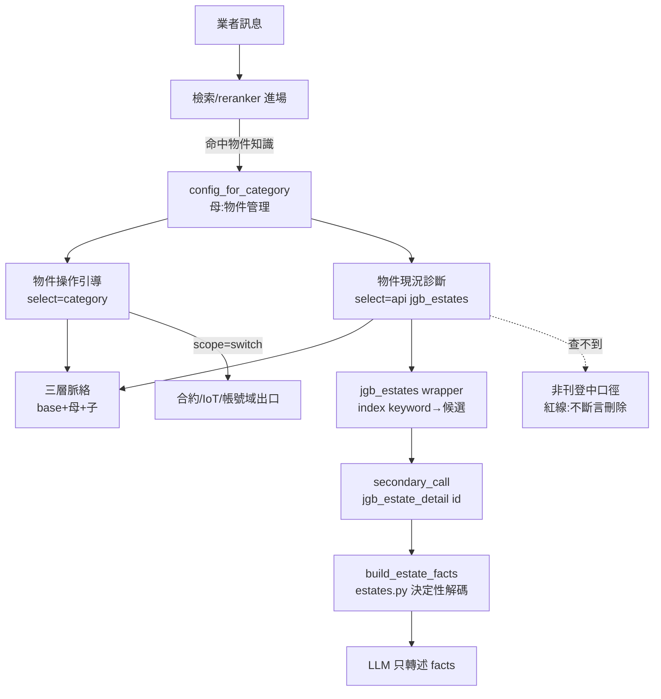

# 技術設計：estate-conversational-facets

> 建立時間：2026-07-04
> 需求文件：requirements.md（R1–R8）　研究依據：research.md（真碼定案 9 項）
> 承接：四域定型面向化路徑，**引擎零改程式**；本設計只含資料、領域檔與測試。

## 概述

### 設計目標
在既有母分類 `物件管理`（category_config id 61，重用不新建）下掛 2 個子面向，讓業者的物件操作 how-to 與個案現況問題進入多輪對話：通則問題以兩軸狀態機口徑正確引導，個案問題 ground `/external/v1/estates` 現值直答（含「能不能建約」缺欄真值）。既有 28+ 筆物件知識盤點補標，口徑統一到真碼裁決。

### 範圍與邊界
- 範圍內：2 子面向四件套資料、`jgb_estates`/`jgb_estate_detail` client 包裝、`services/jgb/estates.py` 新領域檔（builder＋FACE_BUILDERS）、知識工程（補標/複核/新產製/單發）、路由與三層測試。
- 範圍外：引擎/route 程式、四域既有行為、jgb2 端 G-E1/J-E1 實作、SOP 角色隔離（另案）。

## 架構設計

### Architecture Pattern & Boundary Map

沿四域定型模式——資料驅動面向擴充，無新架構元素：



邊界：合約/點交操作→合約域；綁電表→IoT；經理人→帳號域；VR→導廠商；資料異動→導客服。

### Technology Stack & Alignment

| 層級 | 技術 | 對齊 |
|---|---|---|
| 面向資料 | category_config＋knowledge_base（系統脈絡/對話規則/知識）migration ×4 | 四件套模式，冪等 WHERE NOT EXISTS |
| API client | `jgb_system_api.py` aiohttp wrapper | get_meters 同款（拉頁＋token 過濾＋純數字 id 直配） |
| 決定性解碼 | `services/jgb/estates.py`（新檔） | JGB 邏輯獨立檔案慣例；status 位元轉譯用程式不用 LLM |
| 引擎 | conversational_engine 既有 secondary_calls/候選/收斂 | **零改** |
| 測試 | pytest 三層（unit/integration RUN_INTEGRATION/e2e RUN_E2E） | conftest 分層慣例 |

## Components & Interface Contracts

### 元件 1：`jgb_estates` / `jgb_estate_detail` client 包裝（jgb_system_api.py）

**責任**：estates index/show 的取數與 client 端識別過濾；不做語義判讀。

```python
async def get_estates(
    self, role_id: str | int | None = None, keyword: str | int | None = None,
    status: int | None = None,
) -> dict:
    """GET /external/v1/estates。keyword 為 client 端過濾（API keyword 只搜 title
    LIKE，且我方需 token 化多詞比對 title+display_address）：
    - 拉頁 per_page=200（API 上限），沿 get_meters 分頁模式
    - kw = str(keyword).strip()（int 容錯——候選 refine 帶 int id 先例）
    - 純數字且命中列 id → id 直配；否則 token 化（去分隔符 AND）比對
      title｜display_address 拼接串
    - ★ sentinel 機制（validate-design Issue 1）：過濾後空集回單元素
      [{"found": False, "keyword": kw}]——引擎 0-row 會硬編短路
      （conversational_engine.py:610-615「查無對應資料」通用句＋清槽），
      「查不到＝非刊登中」口徑到不了 answer_rules；sentinel 讓引擎視為
      1 筆收斂，由 builder 轉決定性 facts（G-A1 registration found:false 先例）
    回傳 {"success": bool, "data": [estate...] | [sentinel], "error": str|None}"""

async def get_estate_detail(self, estate_id: str | int) -> dict:
    """GET /external/v1/estates/{id}。含 contract_required_fields 深欄位。
    單物件正規化為單元素 list（get_tenant_registration 先例）。"""
```

註冊：`api_call_handler.py` registry 加 **`jgb_estate_status`** / `jgb_estate_detail` 兩鍵（mock 同步加）。⚠️ 實作偏差註記（1.1 盤查發現）：`jgb_estates` 鍵已被現役修繕報修表單（form_schemas jgb_repair_create）使用且語義不同（keyword 透傳 API、per_page 10、無 sentinel）——診斷面向改用新鍵 `jgb_estate_status`，舊鍵零改動；diagnosis config 的 endpoint 同步改此鍵。

### 元件 2：`services/jgb/estates.py` 領域檔（新）

**責任**：物件現值決定性解碼；facts 只引用存值；個資紅線在此收口。

```python
ESTATE_STATUS_ZH: dict[int, str] = {1: "未刊登（剛建立）", 2: "刊登中",
                                    4: "洽談中（已綁合約未簽署）", 8: "租約中"}

ESTATE_FACE_BUILDERS: dict[str, Callable[..., list[str]]]  # face → builder

def build_estate_status_facts(estate: dict, detail: dict | None) -> list[str]:
    """個案現況 facts：
    - sentinel（found=False）優先：facts＝「對外刊登清單中找不到『{keyword}』：
      請先確認名稱是否正確；若名稱無誤，代表該物件目前非刊登中（未刊登或已
      下架）——不得斷言已刪除」（併含打錯字與非刊登兩情境，e2e 覆蓋打錯→更正）
    - status 位元 → ESTATE_STATUS_ZH 轉譯（研究定案 #1；不認識的值原樣標注，
      互斥性 tasks 階段以真資料 DISTINCT 驗證——validate-design Issue 3）
    - 建約判定：detail.contract_required_fields.all_filled=False → 列缺欄
      fields[].label；all_filled=True 且 status==2 → 可建約；
      status!=2 → 建約前提為刊登中（EstateController.php:279-283 口徑）
    - 個資紅線：facts 只含 title/display_address/serial_id——
      address/full_address/經緯度不出口
    - 「查不到」不在此處理（引擎候選空走 persona 口徑）"""

def face_estate_response(...) -> str | None:
    """入口：face 分發（jgb_response_formatter 掛 jgb_estates face）；
    face=None 回 None 恆等（零回歸慣例）"""
```

### 元件 3：面向對話 config ×2（seed migration 資料）

**`estate_guide`（物件操作引導）**——persona_role `pm_estate_guide`：
- topic_scope：category `物件操作引導`；grounding：`select=category`＋**明填 target_user=property_manager**（R1.7）
- persona 分流清單：單筆新增？批次上傳？編輯/刊登？狀態與功能？對外顯示/店舖？——**問句已含明確主題直接收斂**（IoT 分流先例）
- answer_rules 紅線：兩軸狀態機口徑；批次結果指路通知中心、停「處理中」逾一小時導客服**不教重傳**；不代操作（建立/編輯/刊登/刪除只指路）；刪除必講三擋條件；UI 路徑照 research（`/p/` 店舖、通知中心）

**`estate_diagnosis`（物件現況診斷）**——persona_role `pm_estate_diag`：
- grounding：`select=api`、endpoint `jgb_estates`、required_slots `[estate_ref]`、**`deterministic_id: false`**（識別多為物件名文字）、search_params `[{keyword: {form.estate_ref}}]`
- result_mapping：list_path data、id_field id、label_fields `[title, display_address, status]`（status 由 wrapper 附轉譯欄）、candidate_cap 8、refine_param keyword
- **secondary_call**：`jgb_estate_detail`（id={row.id}）attach `detail`——contract_required_fields 僅 show 有；**sentinel 列無 id**：wrapper `get_estate_detail` 對空/None id 回 `success:False` 優雅降級（引擎 attach 失敗即略過，builder 不依賴 detail 存在），單元測試釘死此路徑
- answer_rules 紅線：**查不到＝「對外刊登清單中找不到，若名稱無誤代表目前非刊登中」，禁止斷言已刪除/不存在**（G-E1 天花板口徑）；status/缺欄照 builder facts；地址只用 display 系

### 元件 4：系統脈絡三列（seed migration 資料）

- 母 `物件管理` 薄層（≤180 字）：兩軸狀態機一句話版＋領域邊界（合約/IoT/帳號出口）
- 子 `物件操作引導`：狀態×可做操作對照（研究定案 #2/#4/#5）、批次機制鏈（validators 必填欄/10MB/額度/通知中心）、地址雙層、店舖 `/p/`
- 子 `物件現況診斷`：status 轉譯表、建約決策樹（刊登中＋欄位齊）、查不到弱信號紅線

字數預算：base＋母＋子 ≤ 4500（R1.5；對外曝光併入後單子層仍寬裕）。

### 元件 5：知識工程（tasks 階段執行，設計定形狀）

- **複核補標**：既有 28+ 筆逐筆表（facet-backfill-review.md 慣例）——3428 狀態定義改兩軸、3505-3507 掛 `物件現況診斷`、3433 VR 改導 istaging 口徑、3894/3895/3862 補 categories
- **新知識**（批次檔＋人工閘門）：批次失敗原因與通知中心、停「處理中」處置、刪除三擋、地址雙層、店舖入口與 URL、儲存行為提醒
- **單發**：報表匯出、進階搜尋、點交點退快找（2025-12 文章）
- **錨點**：兩面向都要（validate-design Issue 2）——引導面向用操作強詞（刊登、批次上傳、招租店舖、對外顯示地址）；**診斷面向明列個案型錨點**（「物件為什麼不能建立合約」「這個物件現在什麼狀態」「物件租客看得到嗎 有沒有刊登」）。皆避「物件」裸詞（合約域誤吸）

## 資料設計

Migrations ×4（照四件套慣例命名）：
1. `add_estate_facet_categories.sql`——2 子分類 INSERT（parent_value='物件管理'）；**不動 id 61 母列**
2. `seed_estate_facet_system_context.sql`——母薄層＋2 子層
3. `seed_estate_facet_configs.sql`——2 config（形狀見元件 3）
4. `backfill_estate_knowledge_facet_categories.sql`——補標/複核批（明細以 review 表定案）

## 對外依賴與缺口清單

| 清單 | 項目 | 影響 |
|---|---|---|
| G-E1 | estates API 放寬 is_open 過濾（參數化）或露出 is_open/下架狀態 | 現況診斷「查不到」由弱信號升級為正面判定；存在性驅動，缺口不阻塞上線 |
| J-E1 | EstateBatchJob tries=1 無失敗通知——使用者停「處理中」 | 交 JGB 契約文件；AIChatbot 端以知識口徑緩解 |

## 測試策略

| 層 | 內容 |
|---|---|
| unit | seed 形狀（persona 專屬鍵/target_user 明填/deterministic_id:false/secondary_call 宣告/紅線斷言含 full_address 不出口負斷言）；wrapper（token 過濾/int 容錯/純數字 id 直配矩陣）；builder（status 轉譯×建約決策樹×缺欄列舉×個資負斷言） |
| integration | 真 DB 進場/脈絡疊加/候選→secondary attach→facts；mock handler endpoint 感知（G5 先例） |
| e2e | 真 LLM 多輪：①引導分流→收斂（批次失敗→通知中心 token）②現況診斷：識別→候選→status/缺欄 facts ③誤吸最小對比對負斷言（「這份合約的物件地址錯了」不進本域）④查不到口徑（不斷言刪除） |
| 回歸 | 路由回歸擴物件案；四域全套零回歸 |

## 需求追溯

| Requirement | 設計元件 |
|---|---|
| 1.1–1.7 | 元件 3/4＋migration 1（母重用、專屬鍵、target_user 明填、零改引擎） |
| 2.1–2.7 | estate_guide config＋子脈絡＋知識工程（狀態機/批次/儲存/刪除三擋口徑） |
| 3.1–3.4 | 併入 estate_guide（R3.4 併面向條款；案型全保留：地址雙層/可見性/店舖） |
| 4.1–4.3 | 元件 1/2＋estate_diagnosis config（端點已存在，直接接；G-E1 記缺口；個資紅線） |
| 5.1–5.3 | 單發知識三筆＋VR 導廠商口徑＋scope=switch 邊界（persona 明列） |
| 6.1–6.4 | 知識工程複核補標表＋人工閘門＋business_types=system_provider |
| 7.1–7.3 | 路由回歸擴案＋最小對比對＋操作強詞錨點 |
| 8.1–8.4 | 測試策略四層 |
