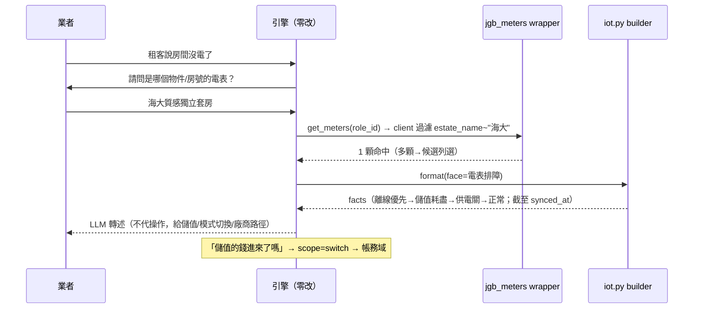

# 技術設計：iot-conversational-facets

> 建立時間：2026-07-04
> 需求文件：requirements.md（R1–R9）　研究記錄：research.md（jgb2 三路真碼盤查；台科電=DAE 使用者確認）

## 概述

### 設計目標
在既有面向化底座上，以純資料＋一個 builder＋一個 client wrapper 掛上智慧設備領域兩子面向（電表排障 grounded／IoT 設定引導 category），引擎零改程式。決定性判因全依 research 證實的機制語義：**未給電＝離線優先 → 儲值耗盡（電表端自動斷/復電）→ 供電關閉 → 供電正常轉硬體**；「度數不增加」以同步機制（每小時一次／DAE 帳號失效整批停同步）決定性解釋。

### 範圍與邊界
- 涵蓋:兩面向四件套、`services/jgb/iot.py` 擴充 `build_meter_facts`、`get_meters` client wrapper、門鎖硬體單發知識包、知識產製（舊案過濾工序）、J/G 清單文件、路由/整合/e2e 測試。
- 不涵蓋:引擎修改、遠端控制代操作、jgb2 端 J-I1~I3 修復、租客視角（錨點 pm-only）、recharge-accounts（定性修正：與電表無關）。

## 架構設計

### Architecture Pattern & Boundary Map

```mermaid
graph TD
    U[使用者訊息] --> RT[檢索＋reranker ≥0.75]
    RT -->|categories| CFG[config_for_category]
    subgraph 智慧設備（母，薄層：名詞對照）
      CFG --> F1[電表排障<br/>select=api jgb_meters]
      CFG --> F2[IoT設定引導<br/>select=category]
    end
    F1 --> ENG[conversational_engine（零改）]
    ENG -->|meter_ref（deterministic_id:false）| AD[get_meters wrapper<br/>全列＋client keyword 過濾]
    AD -->|多顆| CAND[候選列選<br/>name＋estate_name＋meter_type]
    AD -->|單顆| BLD[iot.py build_meter_facts<br/>離線優先→儲值耗盡→供電關→正常]
    BLD -->|facts（截至 synced_at 措辭）| LLM[LLM 轉述]
    F1 -.->|儲值錢入帳沒 switch| BILLING[帳務域]
    F1 -.->|租客看不到電表 switch| ACCOUNT[帳號域登入排障]
    HW[門鎖硬體問句] -->|單發知識| KB[知識庫直答＋導廠商]
```

### Technology Stack & Alignment
同前三域；無新相依。部署併統一 runbook（migrations＋知識批次＋reranker 重建）。

## Components & Interface Contracts

### 元件 1：分類與脈絡（資料）
- 母 `智慧設備`（薄層 ~150 字：雲端電表 vs 手動抄表、儲值模式、台科電=DAE 名詞對照）＋子 `電表排障`/`IoT設定引導`（各 300–600 字，內容＝research 主題 1/2 決策樹與機制數字：每小時 :35 同步、儲值帳單效期 4 天、webhook 對帳每小時）。
- 對應：R1.1, R1.3, R1.5, R2.6。

### 元件 2：對話 config（2 筆資料）

```python
{
  "電表排障": {
    "select": "api", "endpoint": "jgb_meters",
    "required_slots": ["meter_ref"],
    "deterministic_id": False,          # 識別多為物件名/房號（文字）
    "params": {"role_id": "{session.role_id}"},
    "search_params": [{"keyword": "{form.meter_ref}"}],   # wrapper 內 client 端過濾
    "result_mapping": {"list_path": "data", "id_field": "id", "label_field": "name",
                        "label_fields": ["name", "estate_name", "meter_type"],
                        "candidate_cap": 8, "refine_param": "keyword"},
    # persona：現象分流（沒電？離線？度數怪？）＋機制數字紅線＋不代操作紅線
  },
  "IoT設定引導": {
    "select": "category", "category": "IoT設定引導",
    "target_user": "property_manager",   # account 坑：漏填→grounding 恆空
    # persona：兩輪分流（串接/儲值單價/門鎖密碼/起始日）；涉特定設備現況→switch 電表排障；
    #          儲值的錢入帳沒→switch 帳務
  },
}
# persona_role：pm_iot_meter / pm_iot_setup（R1.6）
```
- 對應：R1.2, R1.6, R2.1, R3.1–3.4, R5.5, R6.1–6.3。

### 元件 3：`get_meters` client wrapper（`jgb_system_api.py`）

```python
async def get_meters(self, role_id: str, keyword: Optional[str] = None,
                     estate_id: Optional[str] = None, **kwargs) -> dict[str, Any]:
    """電表列表（識別 adapter）：端點無 keyword 參數 → 拉全列（≤200）後
    client 端以 keyword 對 estate_name/name 過濾（後端當裁判精神：查無回空列不拋）。
    registry 鍵：jgb_meters。"""
```
- 對應：R2.1, R8.1, R8.4。

### 元件 4：`iot.py` 擴充（唯一 builder）

```python
METER_FACE_BUILDERS: dict[str, MeterFaceBuilder] = {"電表排障": build_meter_facts}

def build_meter_facts(meter: dict, user_question: str = "") -> str:
    """決定性判因（research 主題 1/2 定案語義）：
    1. is_online=False → 離線分支優先（所有欄位標注「截至 {synced_at} 最後同步」；
       Miezo 無 synced_at → 措辭降級；DAE 高頻真因：廠商帳密失效/未開 API 服務 →
       引導 IoT 裝置頁重新驗證；仍離線導廠商附設備資訊）。
       ★ 離線時不引用 is_poweron 下結論（J-I1 三態失真防護）。
    2. online＋is_poweron=False＋enable_topup＋balance 低 → 儲值耗盡斷電
       （「電表端自動斷電；儲值入帳後電表端自動復電」——廠商行為措辭）。
    3. online＋is_poweron=False（非儲值/餘額足）→ 供電關閉（IoT 裝置頁供電模式切換路徑；
       無斷電原因紀錄，不臆測誰關的）。
    4. online＋is_poweron=True → 供電正常 → 轉硬體/迴路（導廠商）或確認是否問對表。
    度數/餘額/單價一律引用存值（本就是 DAE 回傳鏡像）；設備狀況查詢（R2.5）
    直出解碼（線上/供電/餘額/度數/最後同步）。
    既有 diagnose_iot（廠商綁定）零回歸：face 未命中走原路。"""
```
- formatter 分發：`jgb_meters` endpoint＋face 命中 → 本 builder（同 jgb_team_members 模式）。
- 對應：R2.2–2.5, R5.1–5.3, R9.1。

### 元件 5：知識工程（含過濾工序）
- **前置**：20 舊案逐案存廢表（research 主題 7 摘要已定調，任務中落表）。
- 新知識主軸＝現行痛點機制：未給電三態、儲值後電未來（webhook 對帳口徑）、度數落差（每小時同步）、帳號失效整批停同步、離線排查。
- 門鎖硬體單發包（悠遊卡/磁扣/電池/音量/QRCode→廠商功能面口徑＋導廠商附設備資訊清單）。
- 錨點 pm-only；語彙分工：IoT 用「沒電/未給電/離線/度數」，避「入帳/金流」（帳務）與「看不到」（帳號域）。
- 既有 5 筆補標人工確認。
- 對應：R4.1–4.3, R6.3–6.4, R7.1–7.4。

### 元件 6：J/G 契約文件（交付 jgb2）
- J-I1 `is_poweron=-1`→true 失真（建議三態/null；消費端已防護）；J-I2 setPowerOn DAE 死路徑；J-I3 SkyWatch 綁定查詢語法錯置；觀察：Miezo 靜默丟指令、無 synced_at。
- G：趨近於零（meters keyword/單筆直查列選配）。
- 對應：R8.2–8.3。

## 資料流程（未給電主流程）



## 技術決策

1. **識別走 client 端過濾**（vs 要求 jgb2 加 keyword）：role 電表 ≤200、零外部依賴；G 清單留選配。
2. **離線分支優先於供電判定**：J-I1 失真＋離線快照語義——is_online=false 時所有結論降級為「最後同步狀態」。
3. **recharge-accounts 不接**（研究修正）：與電表無關聯鍵；儲值單價/餘額資料源就在 meters。
4. **斷電/復電措辭歸廠商**：repo 只有 mode 鏡像證據——facts 說「電表端會自動…」，不稱系統行為（誠實邊界）。

## 非功能性設計
- 錯誤處理：G/欄位缺失存在性降級；離線快照措辭；wrapper 查無回空列。
- 安全：不代執行遠端控制（復電/重啟只指路）；個資面低（電表無個資欄）。
- 效能：全列拉取 ≤200＋分頁保護。

## 測試策略
- 單元：build_meter_facts 四分支×廠商（DAE/Miezo）×synced_at 有無矩陣；J-I1 防護（離線不引 poweron）；face=None 恆等（diagnose_iot 零回歸）；wrapper 過濾三路。
- 整合：識別→候選→ground 分支；設定引導 category 收斂（target_user 明填驗證）；跨域 switch（→帳務/→帳號）；四域零回歸。
- e2e：口語進場＋機制 token（「每小時」「自動復電」）＋單發準則；真電表資料〔待 JGB 指 role，無則降級態＋標注〕。
- 路由：IoT 錨點進對話＋門鎖/教學單發＋三組誤吸點名（儲值 vs 帳務、看不到 vs 帳號、門鎖 vs 電表）。

## 部署考量
併統一 runbook（migrations 2 支追加＋知識批次＋煙囪句 2 面向）。

## 風險與挑戰
| 風險 | 緩解 |
|---|---|
| e2e 無真電表資料（20151 空） | 請 JGB 指測試 role；stub 補整合覆蓋並誠實標注 |
| 「儲值」誤吸帳務 | 錨點語彙分工＋路由點名 |
| J-I1 修復前失真 | builder 離線優先天然規避 |

## 參考文件
[需求](requirements.md)｜[研究](research.md)｜[落差](gap-analysis.md)｜前三域 design/契約文件

### 變更歷史
| 日期 | 版本 | 變更 |
|---|---|---|
| 2026-07-04 | 1.0 | 初版（三路真碼盤查＋台科電=DAE 確認） |
