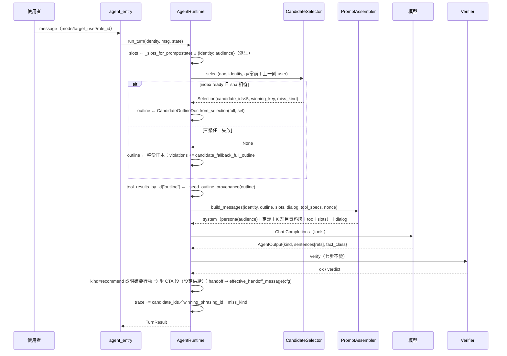
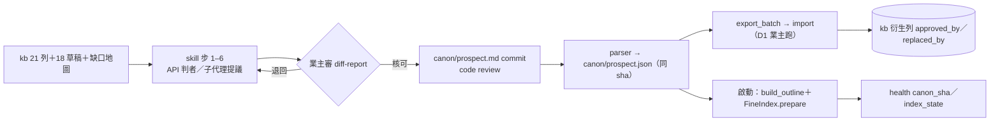

# 技術設計：knowledge-outline-and-intent-architecture

> 建立時間：2026-09-06T10:13:36+0800（1.0；HEAD `138084fa`）　本版：**1.3**（readiness epoch 2：plan-verifier r2 REVISE 6 條全處置，見附錄 G；closing 審用此版）　1.2（r1，附錄 F）　1.1（2026-09-06，security-reviewer 20 條全數處置——6 P1 FIX、P2 全 FIX、P3 ACCEPT＋補文字；處置表見附錄 E）
> 需求文件：requirements.md（v2，業主 2026-09-06 核可；R1.5 定向 hook＋Workflow；**v2.1 改判者＝API、提議＝子代理，Workflow 留參考**）　研究記錄：research.md　缺口分析：validation_gap.md
> 發現流程：**light**（既有 agent 路徑擴展；無新外部服務）。平台層（Runtime／Verifier／MCP／trace 本體）留在 `agentic-mcp-orchestration`，本 spec 只開需求票（R8）。
> 需求引用寫 `[需求 n.m]`，對應 requirements.md 的 `Rn.m`。

## 概述

### 設計目標
把「知識怎麼被找到」從**程式讀 kb 列自動分類**改成**人審正本（粗目／細目／講法）→ 程式組裝與索引 → 模型只在被給的細目內判意圖與組話**，並讓建立與重切正本的流程由機制（hook 閘門＋隔離判者／schema 強制；原 Workflow，2026-09-06 改 API 判者＋子代理提議）而非叮嚀文保證一致。三個支柱各對一組元件：
1. **完善大綱 skill**（元件 1–3）：每步 schema 輸出、四道閘門靠 hook、判者 fan-out 靠獨立 API 請求（原 Workflow）、可回放、記成本。[需求 1]
2. **正本與索引**（元件 4–6）：Markdown 正本 → 決定性 JSON → `OutlineDoc`（沿用既有組裝器）＋ `FineIndex`（細目標題向量＋講法向量取最大）→ 回合前程式選候選細目注入。[需求 2, 5]
3. **對話與驗證**（元件 7–11）：身分由程式預填、對話邏輯以定義搬入 agent、CTA／handoff 由程式與設定供給；每個變更先有受測物定義清單與假設表，免費的先做。[需求 4, 6, 7]

### 範圍與邊界
- **範圍內**：`.claude/skills/outline-curation/`、`.claude/workflows/`、`.claude/hooks/`、`.claude/settings.json`（repo 層 hooks 首例）；`services/agent/canon/`（parser／assembler／review_state／fine_index／candidate_selector）；`runtime.py`／`agent_rules.py`／`tools/session.py` 的接線改動；`tools/canon/`（導出批次、索引評估）、`tools/gapmap/coverage_map.py`、`tools/agent_eval.py` 擴充；`canon/` 正本目錄（售前、LINE 業者）；不變量 32–34。
- **範圍外**：Verifier 判定邏輯、MCP 門面、trace 本體（只加白名單鍵，走 R8 票）；LINE 面向流程／API 欄位（各 facets spec）；jgb2 API；線上部署；pm／tenant agent 對話實作（M4／M5）；embedding 模型更換；LLM 查詢改寫（裁定 8）。
- **對外契約不變**：`VendorChatResponse`／SSE 事件序／`handoff`／`quick_replies`。
- **路徑約定（r2 #1）**：本文凡寫 `canon/`（正本目錄）一律指 **`rag-orchestrator/canon/`**（相對 repo 根；映像內 `/app/canon`），⛔ 與 Python 套件 `services/agent/canon/` 不同物。hook matcher、個資掃描、測試、不變量 34、M-a stops 全部以此完整相對路徑比對。

### 本設計不做的四件事（額外聲明）
| 不做 | 理由 |
|---|---|
| 不新增 DB 表 | 講法存正本檔（選型 3）、索引在記憶體（選型 2）、審核狀態以既有欄位值域區分（主題 4）；唯一 migration＝一支 `ALTER TABLE knowledge_base ADD CONSTRAINT` 鎖 `outline_approved_by` 值域（附錄 E F4，比照 `help_center_pages_citable_requires_approval`） |
| 不動 `PromptAssembler.build()` 簽名 | R11.5 白名單由 `inspect.signature` 鎖住；候選走既有 `outline` 參數（Plan v3 路徑 (a)） |
| 不動 `build_visibility_predicate` | 不變量 29 單一來源；「內容已審」是第二個獨立謂詞，只拼在 agent 路徑 |
| 不在本 spec 改 Verifier 尺 | 引用單位仍是細目內容的句（DSP-029a unit）；尺的問題走 DSP-034 重提條件 |

## 架構設計

### Architecture Pattern & Boundary Map
模式：**正本驅動（canon-driven）＋ 程式選候選（program-selected candidates）＋ 機制化流程（gated skill）**。

```mermaid
graph TD
    subgraph CUR["完善大綱流程（離線，Claude Code）"]
        IN[輸入：kb 列／草稿／缺口地圖／既有正本] --> SK[元件 1 skill outline-curation<br/>決定性腳本各步 schema 輸出]
        SK --> WF[元件 2 判者／提議執行形態<br/>結構提議＝子代理 panel／可答性＝API 判者 fan-out]
        WF --> SK
        HK[元件 3 hooks outline_gate.py<br/>PreToolUse／PostToolUse／Stop] -. 閘門 .-> SK
        SK --> CANON[(canon/&lt;audience&gt;.md 正本<br/>版控＋code review)]
    end
    CANON -->|parser 決定性導出| CJ[canon/&lt;audience&gt;.json<br/>canon_sha256]
    CJ --> ASM[元件 5 canon_assembler<br/>→ OutlineDoc（沿用 _build_doc／check_budget）]
    CJ --> IDX[元件 6 FineIndex<br/>標題向量＋講法向量，取最大]
    CJ -->|export_batch| IMP[元件 8 import_facet_knowledge<br/>kb 衍生列＋approved_by／replaces]
    IMP --> KB[(knowledge_base)]
    subgraph RT["回合（rag-orchestrator）"]
        REQ[Identity：mode／target_user／role_id／vendor_id] --> PRE[元件 7 身分槽位派生<br/>只進 prompt 不落 DB]
        REQ --> SEL[元件 6 CandidateSelector.select<br/>可見性切子集 → top-K 細目]
        SEL --> COD[CandidateOutlineDoc<br/>K 細目 citable ＋ 目錄 citable=False]
        COD --> PA[PromptAssembler.build（簽名不動）]
        PRE --> PA
        PA --> LLM[(模型：判意圖／組話)]
        LLM --> VER[OutputVerifier（不變）]
        VER --> CTA[元件 7 CTA 程式端附加<br/>kind=recommend 或明確要行動]
        VER --> HO[handoff：effective_handoff_message(cfg)]
        SEL --> TR[trace：candidate_ids／winning_phrasing_id／miss_kind（R8.3）]
    end
    ASM -.整份正本＝降級路徑.-> COD
    KB -.kb.get 整數 id 受 content_reviewed_predicate（R8.4）.-> LLM
    subgraph VAL["驗證（元件 9–10）"]
        GM[coverage_map.py 格→細目去向] --> CANON
        IE[index_eval.py 三臂留一] --> IDX
        AE[agent_eval --candidates on/off ＋ outline-probe] --> RT
    end
    style HK fill:#fde68a
    style CANON fill:#dcfce7
    style COD fill:#fde68a
```

紅線（單一來源，⛔ 不複製）：`build_visibility_predicate`（不變量 29）；`content_reviewed_predicate`（本 spec 新增，不變量 32）；`provenance_units`／`resolve_refs`（r13 F-B）；`presales_gate.SENSITIVE`／`HANDOFF_WORDS`；`conversational_config.effective_handoff_message`／`effective_handoff_channel`／`PRESALES_CTA_RULES`。

### Technology Stack & Alignment
| 層級 | 技術 | 版本 | 對齊說明 |
|---|---|---|---|
| 流程機制 | Claude Code hooks（repo 層 `.claude/settings.json`）、判者腳本直打 API＋子代理提議（`.claude/workflows/*.js` 留參考）、skill（`.claude/skills/outline-curation/`） | 既有 harness | hook 形狀複製 `~/.claude/settings.json` 的 CANON 樣板；Workflow 依 `workflow-authoring` 規約（`meta` 純字面、`schema` 強制輸出、`pipeline()` 預設） |
| 正本 | Markdown＋固定五鍵 front matter；自寫 parser | — | 版控＋code review＝寫入權（R2.9／DSP-012） |
| 組裝／索引 | Python 3.11、pydantic ≥2.13、`tiktoken` 0.14.0、`EmbeddingClient` | 既有 | `OutlineDoc`／`OutlineSection` 沿用；索引記憶體內、啟動 prepare |
| 回合 | `AgentRuntime`、`PromptAssembler`、`OutputVerifier` | 既有 | 只加 selector 呼叫、槽位派生、CTA／handoff 接線 |
| 匯入 | `tools/import_facet_knowledge.py`（批次 JSON、冪等、rollback SQL） | 既有 | 批次由正本導出；新增 `approved_by`／`replaces` 兩欄 |
| 評估 | `tools/agent_eval.py`（manifest sha、`--repeat`、`--dump-texts`）、`answer-acceptance-verify` skill | 既有 | 加 `--candidates`、新 set；rubric 判對錯走 skill |
| 稽核 | `scripts/audit/checks/agent_boundary.py`、`check_invariants.sh` | 既有 | 新增不變量 32–34（附錄 B） |

## Components & Interface Contracts

### 元件 1：`.claude/skills/outline-curation/` — 完善大綱 skill
**責任**：首次建立與日後重切走同一條七步流程；每步以決定性腳本產出 schema 化 JSON；LLM 參與步標非決定性並保留原始輸出；記成本；只產待審清單、⛔ 不自動合併、⛔ 不自動入庫。[需求 1.1, 1.2, 1.3, 1.6, 1.7, 1.8, 1.9, 1.10]

**目錄**：
```text
.claude/skills/outline-curation/
  SKILL.md                     流程全圖＋七步＋四閘門＋成本表（指引，⛔ 不承載紀律）
  steps/01-intake.md … 07-import.md
  schemas/                     每步輸出 JSON Schema（draft 2020-12）
    intake.json  structure-proposal.json  phrasing-map.json
    answerability.json  coverage-reweigh.json  diff-report.json  cost.json
  scripts/
    intake.py                  讀 kb 列／草稿／缺口地圖／既有正本 → intake.json（含各輸入 sha）
    apply_proposal.py          結構提議 → 正本 Markdown 草稿＋id 對應表（決定性）
    phrasing_map.py            question_summary 關鍵字／幫助中心／問法正本 → 講法提案（status=proposed）
    reweigh.py                 呼叫 tools/gapmap/coverage_map.py 重量
    diff_report.py             結構差異＋影響清單＋取代對應表
    cost_ledger.py             彙總各步 journal 與 provider usage → cost.json
    answerability_agents.py    步 4 判者外殼：分組 prompt／collect／Reconcile（子代理執行；1.6 改）
    structure_propose.py／apply_proposal.py  步 2 提議外殼（子代理執行）＋決定性套用（2.3）
    similar_items.py           細目標題（含講法）向量兩兩相似 → 待審清單（⛔ 不合併）
```

**七步與執行形態**：
| 步 | 內容 | 形態 | 輸出 schema |
|---|---|---|---|
| 1 intake | 讀輸入、凍結 sha、產「受測物定義清單」骨架 | 腳本 | `intake.json` |
| 2 structure | 提議粗目／細目結構變更（拆／併／移／新增） | **子代理 judge panel**（N=3 角度：使用者提問路徑／內容邊界／受眾層級，互不可見）→ 第 4 個子代理合成（原 Workflow，2.3 改） | `structure-proposal.json` |
| 3 phrasing | 講法與缺口格重新掛到細目；相似細目待審清單 | 腳本＋人審 | `phrasing-map.json` |
| 4 answerability | 每格／每細目可答性標籤 | **API 判者 fan-out**（每格 2 個獨立請求、不一致加第 3；strict json_schema；原 Workflow，1.6 改） | `answerability.json` |
| 5 reweigh | 重量覆蓋（格去向） | 腳本 | `coverage-reweigh.json` |
| 6 diff | 結構差異、id 對應表、取代對應表、成本 | 腳本 | `diff-report.json`＋`cost.json` |
| 7 import | 業主核可後：正本 commit → `export_batch` → `import_facet_knowledge` | 腳本；⛔ 需業主授權（D1） | rollback SQL |

**介面定義（每步腳本共同契約）**：
```python
from typing import Literal, TypedDict

class StepEnvelope(TypedDict):
    step: Literal["intake", "structure", "phrasing", "answerability", "reweigh", "diff", "import"]
    skill_version: str                 # SKILL.md front matter version
    inputs_sha: dict[str, str]         # {"canon": ..., "gapmap": ..., "drafts": ..., "phrasings": ...}
    deterministic: bool                # LLM 參與 ⇒ False，並附 raw_outputs_path
    raw_outputs_path: str | None       # 原始輸出 journal／raw 路徑（非決定性步必填）
    cost: "StepCost"
    payload: dict                      # 該步 schema 的本體

class StepCost(TypedDict):
    agents: int; prompt_tokens: int; completion_tokens: int; usd: float; wall_s: float
```
**可回放** [需求 1.6]：`inputs_sha`＋`skill_version` 相同 ⇒ 決定性步輸出逐位元相同（unit 測試）；非決定性步以 journal key（prompt sha＋slot）續跑、原始輸出留 journal（原設計為 Workflow `resumeFromRunId`）。
**預算** [需求 1.7]（E4）：分「每步上限」與「整案上限」兩層，皆為 **初值、M-a 試作後由業主核定**：步 2 structure ≤ 6 代理／$0.5；步 4 answerability ≤ 180 代理／$3（55 格×2＋不一致第 3 判者 ≤ 55）；整案 ≤ 240 代理／$6。`cost_ledger.py` 任一層超支 ⇒ exit 2 並在 Stop hook 擋。unit：以 110 代理的假 journal 驗步 4 不誤擋、以 181 代理驗必擋（正對照）。
**取代規則** [需求 1.9]：`diff-report.json.replacements[]`＝`{old_kb_id, fine_id, how: "content"|"merged_into"|"phrasing_only"}`；首跑輸入＝21 列 prospect＋18 筆草稿；8 列 `IS NULL` 業者列 ⛔ 不進售前正本。
**與既有 skill 整合** [需求 1.10]：`retrieval-improvement-loop` 的 G0／G2／G4 閘門在本 skill 的 steps/05／06 引用同一份 `rules/`（連結，不複製）；`agent_eval` 以細目為單位重跑（元件 10）。

### 元件 2：判者 fan-out 與結構提議的執行形態（原 `.claude/workflows/outline-curation.js`）

> **現行（2026-09-06 業主裁，見決策 7 修訂 3）**：可答性判者＝`scripts/answerability_agents.py`（分組 prompt，每組 2 個互不可見的 Claude Code 子代理、不一致格第 3 個；事後驗證、Reconcile 等價）；結構提議＝`scripts/structure_propose.py` 產 prompt → 主 session 派 3 個 Claude Code 子代理＋1 個合成子代理 → `validate`／`package`。以下 Workflow 腳本形狀**留檔作參考**（1.4 已實作並乾跑；本機 8 GB 撐不住多子代理、判者間不共享快取）。

**責任（原文）**：把兩個需要獨立判斷的步驟（結構提議、可答性）做成固定順序、schema 強制輸出、判者互不可見的管線；可續跑。[需求 1.5, 3.4, 6.5]

**腳本形狀（依 `workflow-authoring` 規約；純 JS）**：
```javascript
export const meta = {
  name: 'outline-curation',
  description: '大綱正本：結構提議 judge panel 與可答性判者 fan-out（schema 強制、判者隔離）',
  phases: [{ title: 'Structure' }, { title: 'Answerability' }, { title: 'Reconcile' }],
}
// args = { step: 'structure'|'answerability', inputsPath, cells: [...], canonPath, frozenAt }
```
- **Structure**：`parallel(ANGLES.map(a => () => agent(prompt(a), {phase:'Structure', schema: STRUCTURE_SCHEMA})))` → 一個合成 agent 產 `structure-proposal.json`（保留三份原提案於 journal）。
- **Answerability**：`pipeline(cells, c => agent(judgePrompt(c,1), {phase:'Answerability', schema: ANSWERABILITY_SCHEMA}), (v1,c) => agent(judgePrompt(c,2), …).then(v2 => ({c, v1, v2})), r => r.v1.label===r.v2.label ? r : agent(judgePrompt(r.c,3), …).then(v3 => ({...r, v3})))`（各階段參數形狀 `(prevResult, originalItem, index)` 已對過本 session 載入的 `workflow-authoring` 規約）——判者 prompt 含：格的問句、**候選細目＝由程式列舉的正本草稿全部細目（id＋標題＋內容），⛔ 不經 FineIndex 或任何被驗檢索排序（裁定 10；E3）**、rubric；⛔ 不含系統判定、⛔ 不含其他判者輸出。`fine_id` 值域＝該草稿的細目 id 集合（schema `enum` 於組裝時注入）。unit：判者 prompt 組裝函式的輸入不含任何分數／排序／系統判定欄位（正對照：塞一個 `score` 鍵必紅）。
- **Reconcile**：純程式：一致率＝`agree/total`；`<0.80` ⇒ payload `needs_rubric_revision=true` **且** skill 步 5 腳本讀到此旗標即 exit 2、元件 3 Stop hook 亦擋（E6）——「停下回主 session」是機制不是叮嚀。
- `agent()` 一律 `effort: 'low'`（判者）／預設（合成）；`agentType` 省略（沿用 workflow 子代理）；⛔ 不用 `Date.now()`（時間戳由 `args.frozenAt` 傳入）。
- 判者輸出 schema（節錄）：
```python
class AnswerabilityVerdict(TypedDict):
    cell_id: str                                   # C01–C55
    label: Literal["answerable", "partial", "no_source", "deliberate_no"]
    fine_id: str | None                            # 正解細目（answerable／partial 必填）
    evidence_unit: int | None                      # 細目內容句序（DSP-029a unit）
    confidence: Literal["high", "medium", "low"]
```
**最小試作（R1.5；A1）**：只跑 Answerability 一步，**輸入不依賴正本**：候選＝F2 的 21 列 prospect＋18 筆草稿組成的**臨時細目集合**（id `tmp:kb:<id>`／`tmp:draft:<n>`，verdict 標 `provisional=true`，⛔ 不進正本、不進地圖），55 格 × 2 判者≈110 子代理。量：總 token／usd、wall 時間、一致率、`resumeFromRunId` 續跑快取命中率。結果只調 `effort`／分批大小，⛔ 不回頭改形態。

### 元件 3：`.claude/hooks/outline_gate.py`＋`.claude/settings.json` — 流程閘門
**責任**：四道紀律由 harness 事件強制，不靠 SKILL.md 文字。[需求 1.4, 5.5, 6.1]

| hook 事件 | matcher | 判定 | 違反時 |
|---|---|---|---|
| `PreToolUse` | `Edit\|Write` 且目標路徑（相對 `CLAUDE_PROJECT_DIR` 的完整相對路徑）匹配 `rag-orchestrator/canon/*.md` | 本 session 必須已產出 `diff-report.json`（含 id 對應表）且其 `inputs_sha.canon` ＝ 目標檔現 sha | exit 2（擋寫） |
| `PostToolUse` | `Edit\|Write` 且目標路徑匹配 `rag-orchestrator/canon/*.md` | parser 能解析、schema 通過、細目 id 唯一、講法 ∩ 凍結題集合＝∅（`.kiro/specs/agentic-mcp-orchestration/eval/samples-manifest.json` 各 set 題句，跨 spec 依賴） | 印錯誤、exit 2 |
| `Stop` | — | 本 session 若跑過 `agent_eval`／`index_eval`：`inputs/object-under-test.md` 存在且核可欄非空；材料 sha 已凍結（manifest）；`cost.json` 未超支（每步／整案兩層）；本 session 若有 `answerability.json` 且 `needs_rubric_revision=true` ⇒ 擋（E6） | 列出未滿足條件、擋回合結束 |

- 形狀複製 CANON 樣板：`sh -c '[ -f "$CLAUDE_PROJECT_DIR/.claude/hooks/outline_gate.py" ] && exec python3 "$CLAUDE_PROJECT_DIR/.claude/hooks/outline_gate.py" || exit 0'`——變數名 `CLAUDE_PROJECT_DIR` 由使用者層 CANON hook 實際在用（`~/.claude/canon/_canon.py`「hook 執行時 `CLAUDE_PROJECT_DIR` 會被設好」、`~/.claude/hooks/spec_gate.py` 讀它），⛔ 不用 `$REPO`（那只是 `check_invariants.sh` 內部變數）；**M-a 首件事＝一次實跑讓 hook 印出 `CLAUDE_PROJECT_DIR` 與解析到的腳本路徑**，⛔ 不憑文件。缺檔放行；只在目標路徑命中時動作（噪音會訓練人略過）。
- 狀態檔：`.claude/hooks/state/outline-gate/<session>.json`、Workflow journal、講法原始候選——**全部進 `.gitignore`**（現況 `.gitignore` 對 `claude`／`canon` 零命中，本 spec 補）。
- **閘門防意外、⛔ 不防對抗**：判定材料與 hook 腳本都在同一個可寫檔案系統內，想繞過者自寫一份即過；PostToolUse 在寫入後才跑、不還原檔案。R2.9 的真正保障是 git review ＋ 元件 5 的啟動 sha 重算，⛔ 不是 hook。
- hook 腳本約束：零第三方依賴、⛔ 不讀網路、⛔ 不讀 `.env`、只讀 stdin 事件與 repo 內檔案；review checklist 標明「`.claude/settings.json`／`.claude/hooks/` 變更＝高風險 diff」。
- 自證：`tests/unit/_meta/test_outline_gate_req.py` 以假事件驅動**五種**違反各紅一次（含 `needs_rubric_revision`）、五種合規各綠一次（正對照）；**假事件的 `file_path` 一律用完整相對路徑 `rag-orchestrator/canon/prospect.md`，並含一條「repo 根 `canon/prospect.md` ⇒ 不命中」的負對照**（r2 #1）；**另一條 meta 測試驗接線而非腳本**：解析 `.claude/settings.json` 每條 hook command，`$CLAUDE_PROJECT_DIR` 代入 repo 根後檔案必須存在，正對照＝故意改壞路徑必紅。
- **與 CANON 的關係**：CANON hook 住使用者層、管跨專案紀律；本 hook 住 repo 層、只管正本與驗證材料；兩者同時生效、互不取代。

### 元件 4：`services/agent/canon/canon_parser.py` — 正本格式與解析
**責任**：Markdown 正本 → `CanonDoc`（決定性、附 `canon_sha256`）；同時導出 `canon/<audience>.json`。[需求 2.1, 2.2, 2.3, 2.5, 2.8, 2.10, 7.1, 7.3]

**正本格式**（`rag-orchestrator/canon/prospect.md`；LINE 業者為 `rag-orchestrator/canon/property_manager-line.md`）：
```markdown
---
audience: prospect
version: 2026-09-06.1
reviewers: [owner]
language: zh-TW
budget_tokens: 10000
---
## A 產品基本盤 {#A}
### 系統定位與適用對象 {#prospect/A/positioning}
- phrasings:
  - {text: "你們系統適合我嗎", source: "question_summary:3585", status: approved}
  - {text: "適不適合小房東", source: "koyu:03#12", status: proposed}
- sources: [kb:3585, kb:3602]
- reviewed: {by: owner, at: 2026-09-06}
- see_also: [prospect/B/fit-by-scale]
金箍棒是……（可引用句，一句一行；句尾標點）
### …
## G 現有不足 {#G}
### 客製開發與計價 {#prospect/G/custom-dev}
- policy: deliberate_no
- policy_ref: DSP-009
- exit: handoff
目前不提供客製開發報價；可點下方「找真人」由專人說明。
```
- **粗目**＝`##` 標題＋`{#<粗目碼>}`；**細目**＝`###` 標題＋`{#<audience>/<粗目碼>/<slug>}`；id 穩定、重切保留（R2.8）。
- 細目屬性以固定鍵的 YAML 風格清單；內容＝屬性後的純文字行，**每行一句**＝引用單位（`provenance_units` 切法對它是恆等）。
- `see_also`＝跨受眾／跨細目「另見」；同受眾互斥由 `similar_items.py` 產待審（R2.5）。

**介面定義**：
```python
from dataclasses import dataclass
from typing import Literal

PhrasingSource = str   # "question_summary:<kb_id>" | "koyu:<article>#<n>" | "helpcenter:<slug>" | "traffic:<yyyymm>#<n>"
PhrasingStatus = Literal["proposed", "approved", "retired"]

@dataclass(frozen=True)
class Phrasing:
    text: str; source: PhrasingSource; status: PhrasingStatus

@dataclass(frozen=True)
class FineItem:
    id: str                    # "<audience>/<coarse>/<slug>"，正則 ^[a-z_]+/[A-Z]/[a-z0-9-]+$
    coarse_id: str; title: str
    phrasings: tuple[Phrasing, ...]
    content_units: tuple[str, ...]      # 一行一句；⛔ 不再切
    content_sha256: str
    sources: tuple[str, ...]            # kb:<id> | helpcenter:<slug> | owner
    reviewed_by: str | None; reviewed_at: str | None
    see_also: tuple[str, ...]
    policy: Literal["answerable", "deliberate_no", "not_available"] = "answerable"
    policy_ref: str | None = None
    # 三軸（F20）：kb 衍生列的可見性欄位由正本承載，⛔ 不由 export 猜。front matter 給受眾預設，細目可覆寫。
    target_user: tuple[str, ...]        # 預設＝front matter `target_user`
    business_types: tuple[str, ...]     # 預設＝front matter `business_types`（售前＝["system_provider"]）
    categories: tuple[str, ...]         # 面向提名用（裁定 001：nomination evidence），預設空
    instance_applicability: Literal["instance", "general"]   # 必填（steering 契約）

@dataclass(frozen=True)
class CoarseItem:
    id: str; title: str; fines: tuple[FineItem, ...]

@dataclass(frozen=True)
class CanonDoc:
    audience: Literal["prospect", "property_manager", "tenant"]
    version: str; reviewers: tuple[str, ...]; budget_tokens: int
    coarses: tuple[CoarseItem, ...]
    canon_sha256: str                   # Markdown 位元組 sha
    phrasing_set_sha256: str            # 所有 approved 講法 (fine_id, text) 排序後 sha

def parse_canon(path: str) -> CanonDoc: ...      # 格式錯誤 raise CanonFormatError（列號＋原因）
# 嚴格性（F8）：細目屬性區塊（`- phrasings:`…`- see_also:`）內任何無法解析的行一律 CanonFormatError，
# ⛔ 不得靜默落入 content_units——否則講法（含去識別後真流量）會進 system prompt 成可引用句。
# 守門測試：OutlineDoc.text ∩ 講法集合 = ∅（NFKC），正對照＝故意塞一句講法必紅（形狀比照不變量 34）。
def export_json(doc: CanonDoc, out_path: str) -> str: ...   # 回 canon_sha256；JSON 帶同一 sha
```
- front matter 固定鍵擴為：`audience, version, reviewers, language, budget_tokens, target_user, business_types`（後兩者為細目預設）。
- 內容變更 ⇒ `content_sha256` 變 ⇒ 依賴它的講法標 `needs_review`（元件 1 步 3 計算）、對應測試題進待審（R2.8）。
- **LINE 正本** [需求 7.1, 7.2, 7.3]：粗目另定（依 chatai 四文件：③損壞分類與判定、④語氣模板與禁止項、⑤帳單狀態語義與資料邊界、⑥「什麼時候說不」清單、⑦待裁／待驗）；API 實值以 `policy: not_available`＋`sources: [jgb2:<endpoint>]` 標「來自 JGB API」，內容只寫邊界句。

### 元件 5：`services/agent/canon/canon_assembler.py`＋`review_state.py` — 組裝與審核狀態
**責任**：`CanonDoc` → `OutlineDoc`（沿用 `_build_doc`／`check_budget`／`make_outline_resolver`）；只組已審細目；定義「內容已審」謂詞。[需求 2.6, 2.7, 5.4]

```python
def build_outline(doc: CanonDoc, *, include_unreviewed_titles: bool = True) -> OutlineDoc:
    """每細目一節：id=fine.id、title、text="\n".join(content_units)、source_ids=kb ids、citable=(reviewed_by is not None)。
    未審細目：include_unreviewed_titles ⇒ 只出標題行、text=""、citable=False（模型能說「此部分目前無資料」）。
    version=doc.version；sha=_build_doc（涵蓋 version＋text）。⛔ 無 LLM。"""

def build_toc(doc: CanonDoc, visible: frozenset[str]) -> OutlineSection:
    """id="outline:toc"、citable=False、text=每細目一行 "<fine.id>｜<title>"——**只列 visible（FineIndex.visible_subset）內且已審者**（F7）；
    既有 build_toc(db_pool, audience, vendor_id) 有 vendor 過濾，本函式不得拿掉這道控制。"""

def load_canon_or_die(canon_dir: str, audience: Audience) -> CanonDoc:
    """啟動：同時讀 canon/<audience>.md 與 .json；由 .md 位元組**重算** sha 並與 .json 內 canon_sha256 比對，
    不符 ⇒ raise（啟動即紅，與 check_budget 同款；F1）。映像 COPY 兩者。canon_dir 只接受映像內固定目錄；
    `AGENT_CANON_DIR` 覆寫僅在 `DB_ENV=test` 生效、其餘環境拒絕並印 resolved path 進 health（F2）。"""

# review_state.py（F4：白名單、fail-closed）
REVIEWED_PREFIX = "reviewed:"        # 內容已審＝ "reviewed:<reviewer>"
POOL_MARK_PREFIX = "pool-marked-"    # 池標記＝ "pool-marked-<date>"（D1 時由 owner-20260905 改寫）
def content_reviewed_predicate() -> tuple[str, list]:
    """回 (" AND kb.outline_approved_by LIKE %s", [REVIEWED_PREFIX + "%"])——**正向白名單**：值域外任何值（含現況 29 列的
    `owner-20260905`、大小寫變體、前導空白）一律視為未審。⇒ D1 執行前 agent 路徑對整個池視為未審，這是預期行為、不是回歸。
    ⛔ 只在 agent 路徑拼接（fetch_visible_row、正本衍生列查詢）；⛔ 不併入 build_visibility_predicate。
    值域由 migration `CHECK (outline_approved_by IS NULL OR outline_approved_by ~ '^(reviewed:[^[:space:]]+|pool-marked-[0-9]{8})$')` 鎖（3.1；`NOT VALID` 先加、D1 改寫 29 列後 `VALIDATE`）。
    ⚠️ 謂詞用 `~ REVIEWED_REGEX`（`^reviewed:[^[:space:]]+$`）而非 `LIKE`——`LIKE` 的 `_` 會吃空白，`reviewed: alice` 會被放行（plan-verifier 2026-09-07）。"""
```
- **呼叫鏈與失敗語義（寫死，E1）**：`app.py::_init_agent_runtime` → `build_prospect_outline(db_pool)` **首行** `doc = load_canon_or_die(canon_dir, "prospect")`（同時讀 `.md` 與 `.json`、由 `.md` 位元組重算 sha 比對 `.json.canon_sha256`）→ `build_outline(doc)` → `check_budget(default_token_limit)`。`.md` 缺檔／sha 不符／格式錯 ⇒ **raise**，與既有 `check_budget` 同一條例外路徑：`_agent_configured()` 為真時啟動紅、否則 agent 停用（既有語義，⛔ 不新增降級）。正本目錄＝`rag-orchestrator/canon/`（Dockerfile `COPY . .` 自然進映像 `/app/canon`；建置脈絡是 `./rag-orchestrator`，repo 根的 `canon/` 不會進映像），`AGENT_CANON_DIR` 預設＝`<rag root>/canon`；`SIX_MODULES`／`_classify_row`／`_CTA_TEXT`／`DSP009_DELIBERATE_GAPS`／`_extract_boundary_sentences` 退役（G／F 粗目承接，R2.6）。
- `tools/kb.py::fetch_visible_row` 加 `content_reviewed_predicate()`（R8.4 票；不變量 32 掃）。**`kb.search` 刻意不套**（F6，ACCEPT）：它只回 `question_summary` 且 `citable=False`，事實句仍需 refs；殘留＝模型可讀到未審列摘要並改寫成非事實句，由 Verifier 步②／④ 守。
- `make_outline_resolver`（`kb.get("outline:<fine_id>")`）改為在回傳前套 `visible_subset`：不可見或未審一律 `NO_MATCH`（與既有「不區分不存在／無權限」語義一致；F7）。

### 元件 6：`services/agent/canon/fine_index.py`＋`candidate_selector.py` — 細目索引與候選選擇
**責任**：啟動時為每細目建「標題向量＋approved 講法向量」；回合前依可見性切子集、取 top-K 細目；三態降級；記 `candidate_ids`／`winning_phrasing_id`／`miss_kind`。[需求 5.1, 5.2, 5.3, 5.5, 5.6, 5.9, 5.10, 5.11]

```python
class IndexEntry(TypedDict):
    fine_id: str; key_id: str            # key_id: "title" | "ph:<sha8>"
    vector: list[float]

class FineIndex:
    def __init__(self, embedding_client: EmbeddingClient, *, batch: int = 8) -> None: ...
    async def prepare(self, doc: CanonDoc) -> None:
        """快取鍵=(canon_sha256, phrasing_set_sha256)；任一向量 None ⇒ ready=False（⛔ 不以殘缺集合服務）。"""
    @property
    def state(self) -> Literal["absent", "not_ready", "ready"]: ...
    def visible_subset(self, identity: Identity, doc: CanonDoc, *, vendor_business_types: frozenset[str]) -> frozenset[str]:
        """可見細目 id：沿 build_visibility_predicate 語義在**記憶體**套用（E2）——
        b2b（pm／prospect）：fine.business_types ∩ {system_provider} 非空 且 target_user 命中或空；
        b2c：fine.business_types 空 或 ∩ vendor_business_types 非空，target_user 命中或含 all_users。
        `vendor_business_types` 由**呼叫端**解析後傳入（runtime 在回合開始以既有 `VendorParameterResolver.get_vendor_info(vendor_id)` 取得，b2b 傳 frozenset()），
        target_user 先過與 SQL 側同一個正規化 `VendorKnowledgeRetrieverV2._effective_target_user`（未知／None → tenant；r2 #3），⛔ 不另寫。
        ⛔ selector 內不做 DB 查詢。vendor 軸：正本細目無 vendor 欄、匯入寫 `vendor_ids=NULL` ⇒ 謂詞條件 1 恆真，記憶體版不套 vendor。三軸對帳見不變量 33。"""

class Selection(TypedDict):
    candidate_ids: list[str]             # ≤K，依分數降冪、同分 id 字典序
    winning_key: dict[str, str]          # fine_id → key_id（供講法命中數）
    scores: dict[str, float]
    miss_kind: Literal["hit", "none_visible", "no_candidate", "index_unavailable"]

class CandidateSelector:
    K: Final[int] = 5
    QUERY_EMBED_TIMEOUT_S: Final[float] = 3.0
    def __init__(self, index: FineIndex) -> None: ...
    async def select(self, doc: CanonDoc, identity: Identity, query: str) -> Selection | None:
        """首行 doc.canon_sha256 != index.prepared_sha ⇒ None（P1-2）。查詢＝當前 user 訊息＋上一則 user 訊息（程式規則，R5.10）。
        每細目分數＝max(cos(query, title), max cos(query, phrasing_i))；只在 visible_subset 內排序（R5.3）。
        回 None ⇒ runtime 走整份正本（降級，資訊更多不是更鬆）。⛔ 不 log 查詢字串。"""
```
- **匹配鍵預設**＝標題＋講法取最大（R5.2）；內文向量作元件 10 步 1 第三臂，⛔ 不在線上啟用直到步 1 結論。
- **講法治理** [需求 5.6]：trace 只記 `winning_key_kind ∈ {title, phrasing}`＋`fine_id`（F18：`ph:<sha8>` 對照表就在 repo，記它等於一次查表還原問句，解析度高於 Plan v3 P3-2 已接受的段落 id）；離線 SQL 聚合到**細目層**的 `hit_count`／`phrasing_hit_ratio`。講法層的命中與誤掛改由元件 10 的 `index_eval.py --report misrouted`（離線、材料凍結）計算，「勝出講法所屬細目 ≠ 判者正解」列為 `misrouted_phrasing[]` 待退役；零命中退役規則改為「該細目 phrasing 命中比 <5%（≥30 回合）且 index_eval 無該講法命中」。退役＝正本內 `status: retired`（可 revert）。**取捨**：線上失去單一講法的命中數，換取 trace 不可還原問句；記入收案取捨表。每細目講法上限 **12**、同細目講法兩兩去重（NFKC＋去空白相等即重複）。
- **reranker** [需求 5.11]：⛔ 不接；步 1 後若 top-5 增益 ≥5 點且 p95 不退步才另立 slice。
- **第二次機會** [需求 5.9]：目錄節 `outline:toc`（citable=False）＋ `kb.get("outline:<fine_id>")` 讀整細目（既有 resolver 依 section id 查）；`miss_kind` 分 `none_visible`（有細目但不可見）／`no_candidate`（可見但分數全低於 `MIN_SCORE=0.0`——⛔ 不設門檻，K 內全給，由模型與 Verifier 守）／`index_unavailable`。

### 元件 7：`runtime.py`／`agent_rules.py`／`tools/session.py` 接線 — 對話邏輯與身分
**責任**：身分預填、對話邏輯定義、CTA 程式端、handoff 設定接線、persona 分支。[需求 4.1–4.7, 5.7, 5.8]

| 接線 | 位置 | 內容 |
|---|---|---|
| 候選注入 | `run_turn`：`outline = agent_state.get("outline")` 之後 | `sel = await selector.select(doc, identity, q)`；`outline = CandidateOutlineDoc.from_selection(doc_outline, sel)` 或整份（降級＋`violations.append("candidate_fallback_full_outline")`）；同一物件餵 `_seed_outline_provenance` 與 `build_messages` |
| 身分派生 | `_slots_for_prompt(state)` 之後 | **強制覆寫** `slots["identity"] = identity.resolved_audience()`（F9：⛔ 不用 `setdefault`——DB 攤平在前，setdefault 會讓模型寫的值勝出）；`identity_source ∈ {entry, anonymous}`（有 `role_id`／`vendor_id` 為 entry，官網匿名 prospect 為 anonymous，F10）；⛔ 不寫 DB。**`identity` ⛔ 不在 `SlotKey` 內**，模型寫不到；模型可寫的子身分用另一鍵 `identity_detail`。契約測試：模型經 `slots_set` 寫入任何值後，prompt 的 `identity` 仍為 entry 派生值 |
| `SlotKey` 擴充 | `tools/session.py` | 加 `identity_detail`／`team`／`pain`／`interested`（`scale`＝既有 `unit_count`）；R8.2 票收窄為 enum 擴充 |
| 身分槽位用途護欄 | `agent_rules.py`、測試 | `identity`／`identity_detail` 只供對話控制（persona 分支、不重問、CTA），⛔ 不得作為任何資料可見性或查詢範圍依據（DSP-011：可見性仍由謂詞守）；測試以 AST 掃 `services/agent/` 禁止 `slots["identity"]` 流向 `jgb2.*`／`kb.*` 參數（F10） |
| 對話邏輯 | `agent_rules.py` | `_POLICY_TEXT` 改由三段定義組成：判準（A 事實題直答／B 推薦題補問；補問欄位封閉集合、一次一題、已知不重問、基本資訊門檻 identity＋(scale 或 pain)）、已推薦後三態（接受／追問／新題）、fact_class 七值＋「句形不是判準」；⛔ 不寫例子；`persona_provider(identity)` 依 `resolved_audience()` 三分支（R4.7） |
| 身分反問禁令 | `agent_rules.py`＋契約測試 | 政策文定義句「入口已帶身分者不得反問身分」；`tests/unit/agent/test_identity_no_reask_req.py`：pm／LINE（`identity_source=entry`）回合輸出不得含身分反問句型（封閉句型表由 `presales_gate` 同層維護）；**正對照（E5）**：同一支測試含 `identity_source=anonymous`＋候選細目依子身分分叉（R4.3）的正例，斷言句型表**匹配得到**該回合的反問句；故意清空句型表 ⇒ 正例必紅 |
| CTA | `_finalize` 之前 | `out.kind == "recommend"` 或 `explicit_action(user_message)`（封閉詞表：預約／試用／留資／方案）⇒ 附加 `PRESALES_CTA_RULES` 對應的固定 CTA 段（由 `conversational_config` 的 `cta_rules` 提取連結，⛔ 模型不寫連結；R4.5） |
| handoff 設定 | `_build_fixed`／handoff 分支 | `cfg = await config_for_target_user(db_pool, identity.target_user)`（啟動時快取，隨 `conversational_config` 快取失效）；`effective_handoff_message(cfg)`／`effective_handoff_channel(cfg)`（R4.6） |
| 部分回答＋轉人 | `AgentOutput`（R8.1 票） | D2 允許時：`kind="answer"` 且 `handoff_reason` 非空 ⇒ Verifier 對 `kind=fact` 句照驗、對 `kind=routing` 的轉人句免引用（平台層承接） |
| 敏感 | 既有 | 程式規則 `sensitive_patterns` 為準、模型 fact_class 為建議（R5.7；tasks 4.8 移交本 spec） |

**CandidateOutlineDoc**（滿足 `OutlineDocLike`）：
```python
@dataclass(frozen=True)
class CandidateOutlineDoc:
    audience: Audience; version: str; sha256: str; token_count: int
    sections: tuple[OutlineSection, ...]   # K 細目節（id=fine_id、citable=True）＋ toc（citable=False）
    text: str
    @classmethod
    def from_selection(cls, full: OutlineDoc, sel: Selection) -> "CandidateOutlineDoc":
        """audience／version／sha256 一律複製自 full（P1-2）；sections 依 sel.candidate_ids 順序取 full.sections；末尾接 toc。"""
```

### 元件 8：`tools/canon/export_batch.py`＋`import_facet_knowledge.py` 擴充 — 正本入庫
**責任**：正本 → 匯入批次 JSON（沿用既有格式）；舊列退役標記；`outline_approved_by` 語義切換（D1）。[需求 1.9, 2.7, 2.9]

```python
class CanonBatchEntry(TypedDict):        # 對應 import 工具 knowledge[] 一筆
    question: str                        # = fine.title
    answer: str                          # = "\n".join(content_units)
    target_user: list[str]; business_types: list[str]; categories: list[str]
    keywords: list[str]                  # = approved 講法文字（⛔ 不進 embedding；沿 steering）
    instance_applicability: Literal["instance", "general"]   # 正本細目屬性，必填
    approved_by: str                     # = fine.reviewed_by（新欄，寫 outline_approved_by）
    canon_ref: str                       # = fine.id（新欄，寫 generation_metadata.canon_ref）
    replaces: list[int]                  # 舊 kb id（新欄）

def export_batch(doc: CanonDoc, replacements: list[Replacement]) -> dict:
    """輸出 {spec, produced_at(由 args 傳入), canon_sha256, knowledge: [...], updates: [{id, generation_metadata: {replaced_by, ...}, outline_approved_by: "pool-marked-20260905"}], rollback}"""
```
- 匯入工具擴充（**fail-closed**，F3）：批次頂層 `canon_sha256` 必須等於工具當下由 `canon/<audience>.md` 重算的 sha，且每筆 `answer` 與 `canon_ref` 對應細目 `content_units` 逐字相符、`approved_by` 必須等於該細目 `reviewed_by`——任一不符整批不寫、exit 2；`--dry-run` 印逐筆比對結果。`approved_by` ⇒ 寫 `outline_approved_by = "reviewed:<reviewer>"`；`replaces` ⇒ 對舊列 `UPDATE generation_metadata = generation_metadata || {"replaced_by": fine_id}`、`outline_approved_by='pool-marked-<date>'`。
- rollback SQL 由 export 當下對每筆受影響列的 **pre-image SELECT 快照**生成（逐列還原 `outline_approved_by`／`generation_metadata` 原值，⛔ 不是設 NULL；F15）；批次 UPDATE 會撞 `updated_at` trigger ⇒ 不變量 10 連鎖（記憶 `project_kb_updated_at_trigger_trap`），部署步驟前後各跑 `make audit` 並在 runbook 標明預期反應。
- **首批 ⛔ 不寫 `keywords`**（F16）：講法進舊鏈詞面路徑的排序副作用未量（既知飽和塌陷病灶）；要開必須先對舊鏈同批回歸；此取捨進收案表。
- 冪等鍵改為 `canon_ref`：既有 `SELECT id FROM knowledge_base WHERE question_summary=$1` 兩處改為 `WHERE generation_metadata->>'canon_ref'=$1`（`run()` 的 knowledge／anchors 兩段）；`updates[]`（舊列退役）路徑亦 fail-closed：對每筆先讀 DB 現值，`outline_approved_by` 現值必須等於批次 `expect_current`（export 當下快照），不符即拒（plan-verifier d 殘留）。
- ⛔ 不動 `seeds.manifest` 的 `always regenerate_all_embeddings`（PLAN v2 §5 禁用）；新列 embedding 由匯入工具逐筆算（既有）。

### 元件 9：`tools/gapmap/coverage_map.py` — 覆蓋閉環
**責任**：格 →（cause_state／entry_state）→ **去向**；受眾×主題維護；跨受眾缺口提案；判者一致率。[需求 3.1–3.7]

```python
Disposition = Literal["fine", "not_available", "deliberate_no", "owner_decision"]
class CellRecord(TypedDict):
    cell_id: str; audience: Audience; topic: str
    cause_state: str; entry_state: str; coverage: str          # 沿 demand-v2 _meta.states
    disposition: Disposition; fine_id: str | None
    fix_type: Literal["add_knowledge", "add_phrasing", "list_not_available", "cross_audience_rewrite", "merge_similar", "owner_decision"] | None   # None＝已覆蓋／刻意不補無補法（2.6，業主 2026-09-07 核）
    gap_classes: list[Literal["content_gap", "retrieval_gap"]]   # R3.5 兩類可並列（2.6）
    min_verification: dict                                       # {"phrasings": [...], "expected_fine_id": ...}
    judge_agreement: float | None

def reweigh(canon: CanonDoc, demand_path: str, map_path: str, answerability_path: str) -> list[CellRecord]: ...   # map_path＝map-v2.json 量測層（cause/entry/coverage），2.6 新增：沒有它 R3.5 兩類分報無法決定性算
```
- 判「已覆蓋」的正解細目來自元件 2 判者（⛔ 不用被驗系統排序，裁定 10）；`answered`／`answered_handoff` 的 entry 仍由 `agent_eval` 實跑回填。
- 無去向格＝0 為元件 1 步 5 的出口條件（Stop hook 亦查）。
- 跨受眾缺口：同 topic 在 Y 有細目、X 無 ⇒ `fix_type=cross_audience_rewrite`＋草稿路徑（改寫為 X 的層級；⛔ 不直接開放 Y 的列）。**初版判準（2.6，只有一份正本時）**＝map-v2 `cause_state=="V"`（對題列只在 X 池外）；第二份正本出現後改為「Y 正本有細目」＝新 readiness epoch。
- 步 5b 權威來源核對（2026-09-07 業主裁）：`not_available`／`owner_decision` 的格必須先對 jgb2 程式／docs／幫助中心盤查（`source_audit.py`），事實回填 `docs/knowledge/jgb-product-facts.md`；只有 `owner_needed` 交業主；Stop hook 擋未核對即交業主。

### 元件 10：`tools/canon/index_eval.py`＋`agent_eval.py` 擴充＋受測物定義清單 — 驗證邏輯
**責任**：R6 四步各對一支工具；材料 sha 凍結；比較性結論 ≥30 題；盲標同批同判者。[需求 6.1–6.7]

| 步 | 工具 | 輸入 | 輸出 | 費用 |
|---|---|---|---|---|
| 0 | `coverage_map.py`＋`intake.py` | 正本＋缺口地圖 | 無去向格＝0、無來源細目＝0、`inputs/object-under-test.md` 核可 | $0 |
| 1 | `index_eval.py --arms title,title+phrasing,title+phrasing+content --loo` | 422 句（`inputs/phrasing-selection-rule-20260906.json`）＋判者標的 gold 細目 | recall@1/3/5 依粗目×問法型；臂間差 <10 點 ⇒ 該臂不值得 | $0（embedding 本機） |
| 2 | `agent_eval.py --set outline-probe --candidates on/off --repeat 3` | 新選 ≥30 題（跑前凍結入 manifest；round9 13 題只作對照） | 翻轉率／對照組維持轉人／引用細目＝gold／無據率（盲標 2 判者） | <$0.5 |
| 3 | `agent_eval.py --set scenarios`＋六套劇本＋LINE 口語材料 | 劇本 | A/B 判對率、一次一題、身分不重問、CTA 只在收斂、零捏造 | ~$0.3 |
| 4 | `agent_eval.py --set traffic` | D3 裁後材料 | 依受眾×問法型答到率／無據率／不硬答／敏感 0 漏；門檻跑前凍結 | 待裁 |

- `agent_eval.py` 擴充：`--candidates {on,off}`（DI，⛔ 不讀 env）、`--set outline-probe`、JSONL 加 `candidate_ids`／`miss_kind`／`candidates_mode`（同步 `_EXPECTED_JSONL_KEYS`）。
- **受測物定義清單**（`inputs/object-under-test.md`，元件 3 Stop hook 查）：知識正本 sha、對話邏輯正本（`agent_rules.py` 版本）、覆蓋來源與閉環、材料能證什麼／證不了什麼、事實 vs 待裁、假設表（命題／最小材料／尺／推翻條件／費用）。
- 幫助中心問法只證檢索層承載力（R6.7）；報表標明 arm 的 production 組態（R6.6）。

### 元件 11：`rag-orchestrator/canon/property_manager-line.md` — LINE OA 知識區塊
**責任**：LINE 業務受眾的知識層正本；可見細目集合契約測試。[需求 7.1–7.6]
- 受眾＝`property_manager`（`mode=b2b`、`target_user=property_manager`、`vendor_id` 缺→入口填 0 ⇒ b2b 嚴格 `system_provider` 過濾）；正本 front matter `audience: property_manager`、`channel: line`。
- 契約測試 `tests/unit/agent/test_line_visibility_req.py`：以 `Identity(vendor_id=0, target_user="property_manager", mode="b2b")` 對 `FineIndex.visible_subset` 與 `build_visibility_predicate` 各算一次可見集合，兩者相等（不變量 33 的單元版）。
- 21 案例中知識類 5 案＋文件實際使用者輸入句 ⇒ `inputs/line-phrasings-20260906.json`（照抄、標情境與多輪）。

### 元件 12：平台需求票（`agentic-mcp-orchestration`）
| 票 | 內容 | 本 spec 依賴它的元件 | 收窄後的實作量 |
|---|---|---|---|
| A [需求 8.1] | `AgentOutput` 允許 `kind=answer` 且 `handoff_reason` 非空；Verifier 對 `kind=routing` 句免引用 | 元件 7（D2 允許時） | Verifier 步② 一個分支＋schema enum |
| B [需求 8.2] | `SlotKey` 加 `identity_detail`／`team`／`pain`／`interested`（⛔ 不含 `identity`——它由程式派生、模型不可寫）；⛔ 不需改 `slots_set` 建列語義 | 元件 7 | enum＋schema |
| C [需求 8.3] | `decision_snapshot.agent` 加 `candidate_ids`／`winning_key_kind`／`miss_kind`（無原文、無講法 id，不變量 30；F18）；同步 `_ALLOWED_AGENT_DECISION_KEYS` | 元件 6 | 白名單三鍵 |
| D [需求 8.4] | `fetch_visible_row` 拼 `content_reviewed_predicate`；`outline` 介面改吃正本組裝結果 | 元件 5 | 一行謂詞＋不變量 32 |
| E [需求 8.5] | `nli_model/` 留離線抽審（DSP-034） | 元件 10 盲標輔助 | 無 |

### 資料模型
新增資料**只有兩類檔案**，DB 零新表：
```text
rag-orchestrator/canon/<audience>.md    人審正本（版控；在 rag-orchestrator 建置脈絡內 ⇒ `COPY . .` 進映像 `/app/canon`）
rag-orchestrator/canon/<audience>.json  parser 導出（版控；CI unit 驗與 .md 同 sha）
.claude/skills/outline-curation/runs/<frozenAt>/  各步 StepEnvelope JSON（版控；⛔ 只含已去識別文字，講法原始候選不在此）
.claude/skills/outline-curation/raw/               真流量原句與講法原始候選（**gitignore**；D3：保留 90 天由 `raw_purge.py` 依檔名日期刪除）
inputs/object-under-test.md  受測物定義清單（每次驗證一份）
```
**個資落點（F13／F14）**：能進版控的只有「人改寫過的短主題詞」講法；真流量原句、去識別前候選、Workflow journal 一律 gitignored——「保留 90 天」在 git 歷史裡不可實現，故只對 `raw/` 生效。
`knowledge_base` 只用既有欄位：`outline_approved_by`（值域：`reviewed:<reviewer>`（reviewer 非空、不含空白）或 `pool-marked-<YYYYMMDD>`；業主 2026-09-07 裁收嚴，3.1 CHECK 鎖）、`generation_metadata.canon_ref`／`replaced_by`／`instance_applicability`、`keywords`（＝approved 講法，供舊鏈詞面路徑；⛔ 不進 embedding）。

### API 設計
對外 `POST /api/v1/message` 契約不變。內部新增：
- `GET /api/v1/agent/health` 加 `canon: {audience, canon_sha256, phrasing_set_sha256, index_state, fine_items, approved_fine_items}`（每受眾一筆）。
- `tools/agent_trace.py`／`trace_view` 顯示 `candidate_ids`／`miss_kind`（id，無原文）。

## 資料流程

### 主要流程圖（prospect 回合）


### 正本生命週期


### 資料轉換
- Markdown → `CanonDoc`：決定性；`content_units` 一行一句，⛔ 不再切（`provenance_units` 對它恆等，Verifier 引用單位＝正本行）。
- `CanonDoc` → `OutlineDoc`：每細目一節；`text` 以 `_SECTION_SEP` 接、標題行帶 `【fine_id】`（DSP-020 沿用）；sha 涵蓋 version＋text。
- `OutlineDoc` → `CandidateOutlineDoc`：子集＋toc；audience／version／sha 複製自母 doc。
- `CanonDoc` → 匯入批次：`title→question`、`content→answer`、講法→`keywords`、`reviewed_by→outline_approved_by`。

## 技術決策

### 決策 1：正本格式＝Markdown 正本＋單向導出 JSON
**問題**：人審與機器讀取要同一份真相。**選項**：A 純 Markdown／B 純 JSON／C 混合單向。**決定**：C。**理由**：R2.9 把寫入權等同 prompt 寫入權，審核必須在 diff 可讀介面；JSON 為衍生物並帶同一 `canon_sha256`，CI 驗兩者同源。**參考**：research 選型 1。

### 決策 2：細目索引在記憶體、啟動 prepare、三態降級
**決定**：沿 DSP-035 Plan v3 P1-3；快取鍵＝正本 sha＋講法集 sha。**理由**：≤2k 向量、零 migration、決定性；失敗方向是「整份正本」（資訊更多）。**參考**：research 選型 2、主題 2。

### 決策 3：講法存正本、命中數走 trace
**決定**：tasks 4.7 的新表改為升級路徑。**理由**：治理走 review；退役可 revert；命中數是觀測值，不是正本的一部分。**參考**：research 選型 3。

### 決策 4：格＝(受眾, 主題)、細目帶受眾維度、同受眾互斥、跨受眾同主題＝各自細目＋另見
**決定**：`FineItem.id` 含 audience；`see_also` 表跨受眾關聯；同受眾相似由工具產待審、人裁。**理由**：R2.4／R3.2 覆蓋以受眾為單位；跨受眾同主題是不同層級（能力／操作／權益）不是重複（R2.5）。

### 決策 5：匹配鍵預設＝標題向量＋講法向量取最大；內文向量為量測臂
**決定**：線上不用內文向量直到 R6 步 1。**理由**：圖書館法（索引目錄不索引內容）；F10 的 86% 是內文代替品，⛔ 不得沿用為停損線。

**適用範圍（2026-09-06 補明，業主問）**：本決策的匹配鍵（標題向量＋講法向量取最大、細目＝檢索單位、top-K 候選、第二次機會）**只實作在 agent 路徑**（元件 6 `FineIndex`／`CandidateSelector`，M-c／M-d）。**舊鏈（`routers/chat.py`）不改檢索邏輯**：它只經元件 8 入庫拿到「一細目一列」（`question`＝標題、`answer`＝內容句），仍是一列一向量的既有檢索；講法首批不寫 `keywords`（F16），所以舊鏈得到更乾淨的知識、得不到講法匹配。⇒ 影子對照若只換知識不切路徑，量到的是知識品質不是本決策；本決策的效果以 M-c 步 1 三臂（標題／講法／內文）與 M-d 步 2 探針證明。

### 決策 6：身分預填＝每回合由 `Identity` 派生進 prompt，不落 DB
**問題**：`slots_set` 對無 `COLLECTING` 列回 NO_MATCH，預填時機不可靠。**決定**：派生（`entry` 來源）優先於 DB 值的 audience 層級；子身分（identity 細分、team、pain、interested）仍由模型經 `slots_set` 寫入。**理由**：入口身分是上游信任輸入（DSP-011），不需持久化就能保證「不重問」；R8.2 票因此縮為 enum 擴充。

### 決策 7：skill＝hook（紀律）＋Workflow（判者／提議）＋腳本（其餘）；預算分步（初值，M-a 後核定）
**決定**：只有兩步進 Workflow；四道閘門三個 hook 事件；最小試作先做可答性一步（以臨時細目集合跑，見附錄 C M-a）。**理由**：業主 2026-09-06 定向；Workflow 的價值在判者隔離與 schema 強制，決定性步驟進 Workflow 只增加成本；預算分步為初值、業主核。**參考**：research 主題 3。

**修訂（2026-09-06，1.5 試作後業主裁）**：判者隔離與 schema 強制**不依賴 Workflow**——skill 改為腳本直打 Messages API（`answerability_judge.py`：每判者獨立請求＝互不可見；`output_config.format=json_schema`＝schema 強制；rubric＋候選當共用快取前綴 `cache_control`；journal jsonl 續跑）。理由：8 GB 機器跑 Workflow 多子代理三次整機重開；且 Workflow 子代理之間不共享快取前綴，每判者 ≈60k cache write，44 格 $15.84（步預算 $3 的 5 倍），直打 API 估 <$2。**1.5 的 44 格 Workflow 結果不作廢**（業主裁：只用腳本補批 5 C45–C55，`--layout workflow` 讓 prompt 逐位元相同才能合併）；`outline-curation.js` 留檔作參考、不再是 skill 的執行路徑（是否刪除待裁）；2.3 結構提議業主再裁（同日）：**⛔ 不打 API、用 Claude Code 子代理**（3 角度各一子代理互不可見、第 4 個合成；`structure_propose.py` 只做 prompt／驗證／打包的決定性外殼）——只有 4 次呼叫，記憶體撐得住，且合成需要較強推理。證據：`inputs/m-a-trial-20260906.md` §4–§5。

**修訂 3（2026-09-06，同日業主再裁）**：**模型 API 只在真實對話（產品回合）使用，等同正式確認的最後一步；skill 流程絕大部分用 Claude Code 子代理。** 步 4 改 `answerability_agents.py`：格分組（預設 5 格一組、共用 rubric＋候選 prompt）、每組 2 個互不可見的子代理、不一致格第 3 個、主 session 控制 ≤4 並行（8 GB 實測 ≥10 並行整機重開）；事後驗證取代 schema 強制；API 判者 `answerability_judge.py` ⛔ 不留備援、已刪（1.6 的 gpt-4o-mini 55 格結果留 `inputs/m-a-trial-20260906.md` §8 作紀錄）。

### 決策 8：審核狀態以既有欄位值域區分，不加欄位
**決定**：`outline_approved_by ∈ {"reviewed:<reviewer>", "pool-marked-<YYYYMMDD>"}`（reviewer 非空、不含空白；業主 2026-09-07 裁收嚴，3.1 CHECK 鎖）；`content_reviewed_predicate` 為第二單一來源。**理由**：零 migration；`help_center_pages` 已有「可引用必有人核可」先例；D1 執行時只是一筆 UPDATE 的值改變。

### 決策 9：舊列退役＝標記不刪、舊鏈不受影響
**決定**：`generation_metadata.replaced_by`＋`pool-marked`；`is_active` 不動。**理由**：舊鏈仍讀 kb（範圍外硬約束）；agent 路徑由謂詞排除。**參考**：research 開放問題 1。

### 決策 10：LINE 受眾正本另立、粗目依 chatai 文件定；**其他受眾大綱等售前驗證有效後才開**（業主 2026-09-06）
**決定**：`canon/property_manager-line.md`；API 實值以 `policy: not_available` 標來源。**理由**：裁定 2（不套售前切法）、R7.1。

## 非功能性設計

### 效能考量
- `run_turn` p95 ≤ 6 s（每回合多一次查詢 embedding，本機 50–100 ms）；上下文由整份 3,078 tokens 降至 K=5 細目≈500–800 字＋toc ≤300 字。
- 啟動 prepare ≤ 2k 句、每批 8；失敗 ⇒ `not_ready`、回合走整份正本；health 紅。
- 判者：55 格×2 判者≈110 個獨立 API 請求（實測 gpt-4o-mini 107 請求 ≈$0.10）；原 Workflow 估 110 子代理 16 併發≈7 輪已作廢（實測 44 格 $15.84、整機重開）。

### 安全性設計
- 正本＝system prompt 一部分：只在 git、review 合併；DB 為衍生；`kb.get` 整數路徑受 `content_reviewed_predicate`。
- 注入面：候選細目經既有 `wrap_provenance_data`（nonce）；toc `citable=False`；selector ⛔ 不 log 查詢字串；`candidate_ids` 是低解析度代理（Plan v3 P3-2 已接受）。
- D3 落地（F13／F14，⛔ 不重開 D3 裁定，只把預設做對）：真流量原句只進 `raw/`（gitignored、90 天刪）；進 Workflow 或 `runs/` 的任何文字必須**已去識別**（步 3 的去識別在任何 agent 呼叫之前執行）；識別碼樣式掃描擴為：人名／地址／合約號／電話＋email／LINE id／統編／房號戶名／社區與物件名／車牌／金額＋日期組合，掛 PostToolUse（`rag-orchestrator/canon/*.md`、`.claude/skills/outline-curation/runs/`）與 CI unit，正對照＝故意塞一個 email 必紅；進 canon 的講法必須是人改寫過的短主題詞（`source: traffic:*` 者 parser 額外檢查 ≤ 20 字且不含數字串 ≥4 位）。
- 敏感五類：程式 `sensitive_patterns` 為準（R5.7）。

### 可擴展性
- 新受眾＝新 `canon/<audience>.md`＋front matter；組裝／索引／匯入零改程式。
- 講法量超過檔案可承受（>5k）⇒ 升級為 pgvector 表（選型 2／3 的升級路徑，另立 slice）。
- 新判者角度／新 rubric＝改 `answerability_args.py` 產出的 args／rubric 檔與 schema，不改流程骨架。

### 錯誤處理
| 情況 | 行為 |
|---|---|
| 正本格式錯 | `CanonFormatError`（列號＋原因）；PostToolUse hook 擋；啟動 `check_budget` 同款「即紅」 |
| 索引未就緒／sha 不符／查詢逾時 | `select` 回 None ⇒ 整份正本＋violation；health `not_ready`／`absent` 紅 |
| selector 例外 | `except Exception` ⇒ 整份正本＋`candidate_selector_error`（與 fallback 分開） |
| 未審細目被引用 | `citable=False` ⇒ Verifier `SOURCE_NOT_CITABLE`（既有） |
| 判者不一致 | 第 3 判者；一致率 <0.80 ⇒ `needs_rubric_revision` 停下回主 session（R6.2） |
| 預算超支 | `cost_ledger` exit 2；Stop hook 擋 |

## 測試策略

### 單元測試（容器內，`tests/unit/agent/`、`tests/unit/_meta/`）
- parser：固定 Markdown ↔ `CanonDoc` 決定性；格式錯誤列號；`content_units` 與 `provenance_units` 恆等；id 正則；`see_also` 解析。
- assembler：`build_outline` 每細目一節、未審只出標題且 `citable=False`；sha 涵蓋 version；toc 形狀。
- index／selector：同查詢同向量兩次相同；同分序；`visible_subset` 與 `build_visibility_predicate` 等價（元件 11 契約）；三態；`doc.sha` 不符回 None；⛔ 不 log 查詢（caplog）。
- runtime：`CandidateOutlineDoc` 同一物件餵兩側（`is`）；身分派生與 DB 值優先序；CTA 只在 `recommend`／明確要行動；handoff 讀設定；`candidate_ids` 形狀（`re.fullmatch(r"[a-z_]+/[A-Z]/[a-z0-9-]+")`、長度 ≤K）。
- hooks：四種違反各紅、四種合規各綠（正對照）。
- export／import：`replaces` 產 pre-image rollback；冪等鍵 `canon_ref`；`approved_by` 寫入 `reviewed:` 前綴；批次 sha／逐筆內容不符 ⇒ exit 2（正對照：改一字必紅）。
- **正本同源硬把關（F1，CI unit 層硬擋）**：`export_json(parse_canon("rag-orchestrator/canon/<a>.md"))` 與版控 `rag-orchestrator/canon/<a>.json` 逐位元相等；`load_canon_or_die` 對 sha 不符 raise。
- 個資掃描：`tests/unit/_meta/test_pii_scan_req.py` 對 `rag-orchestrator/canon/`、`.claude/skills/outline-curation/runs/` 全掃，故意塞 email／電話必紅。
- hook 接線 meta 測試（元件 3）。
- 追溯標記：新測試一律 `@pytest.mark.req("knowledge-outline-and-intent-architecture:<n.m>")`。

### 整合測試（`RUN_INTEGRATION=1`）
- `test_agent_turn_req.py` 用假 embedding client：候選路徑與降級路徑各一回合；`tool_results_by_id["outline"]` 只含 K 細目＋toc。
- 匯入 dry-run 對 `aichatbot_test`：影響列數＝正本細目數；rollback 逆轉。
- 啟動契約（E1）：`_agent_configured()` 為真時，刪除映像內 `.md` ⇒ 啟動紅；竄改 `.json` 一位元 ⇒ 啟動紅；正對照＝未竄改必綠。

### 端對端／驗證
- 元件 10 步 0–3（步 0／1 免費先做；步 2／3 需 `OPENAI_API_KEY`，規模與費用如表）；每步跑前凍結材料 sha 與假設表；比較性結論 ≥30 題。
- 最小試作（可答性；Workflow 版 1.5、API 版 1.6）：報 usd／時間／一致率／續跑命中率。

## 部署考量
### 環境需求
- `AGENT_CANON_DIR`（預設 `<rag root>/canon`，容器內 `/app/canon`）；映像**同時含** `canon/*.md` 與 `canon/*.json`（既有 `COPY . .` 涵蓋；E1）；embedding-api 啟動時可達（否則 index `not_ready` 紅、回合走整份正本）。
### 部署步驟（給業主逐條；⛔ 本 spec 不代跑）
1. `git pull` → 重建 `rag-orchestrator`（含 `canon/`）。
2. `python3 rag-orchestrator/tools/import_facet_knowledge.py scripts/knowledge-batches/canon-prospect-<date>.json --dry-run`（預期輸出：`canon_sha256 ✅ 相符`、逐筆 `✅ content match`、`knowledge N 筆／updates M 筆`）→ 核對 N＝正本已審細目數、M＝取代對應表列數 → **不帶 `--dry-run` 重跑即套用**（工具無 `--apply` 旗標，F17；D1 授權）→ `make audit`（預期不變量 10 對本批列有反應，runbook 標明）；runbook §17 記帳。
3. `GET /api/v1/agent/health` 核 `canon.canon_sha256` ＝ 版控檔 sha、`index_state=ready`。
4. semantic-model 重建（記憶 `project_deploy_semantic_model`；舊鏈仍讀 kb 衍生列）。
### 監控與告警
- health：`index_state≠ready` 紅；`canon_sha256` 與版控不符紅。
- trace：`candidate_fallback_full_outline`／`candidate_selector_error` 比率（影子期只觀測，視窗告警上線前另裁）。
- ⚠️ `PromptMeta.outline_sha` 複製自母 doc（Plan v3 P1-2），**不再標識本回合實際注入的文字**；要還原「這回合看了什麼」只能靠 `candidate_ids`（F19，ACCEPT）。

## 風險與挑戰
| 風險 | 影響 | 機率 | 緩解策略 |
|---|---|---|---|
| 售前原稿不存在，E 競品單薄 | 高 | 高 | skill 首跑產 G「現有不足」；E 只用既有來源；業主審草稿時補 |
| 標題＋講法匹配上限低於預期 | 高 | 中 | R6 步 1 三臂先量（$0）；低於臂間 10 點差則加內文臂或增講法密度，⛔ 不調 K |
| 判者變異 | 中 | 高 | 兩判者＋第三判者；一致率 <0.80 停下修 rubric |
| Workflow／hook 首例成本 | 中 | 中 | 最小試作一步先量（結果：Workflow 成本與記憶體不可行 ⇒ 改 API 判者） |
| 平台票未排 | 高 | 中 | 票 B／C／D 已收窄為 enum／白名單／一行謂詞；票 A 只在 D2 允許時 |
| LINE 可見集合未實查 | 中 | 中 | 元件 11 契約測試前先一次 SQL 對照（正對照：pm 可見 285） |
| 舊鏈與 agent 路徑對同一 kb 列的雙軌語義 | 中 | 中 | 決策 9：標記不刪；不變量 33 對帳 |

## 參考文件
- [需求文件](requirements.md)、[研究記錄](research.md)、[缺口分析](validation_gap.md)
- `.kiro/specs/agentic-mcp-orchestration/design.md`（元件 5／6／7）、`reviews/plan-dsp035-s1-candidate-paragraphs-v3-WITHDRAWN.md`
- `.claude/skills/retrieval-improvement-loop/SKILL.md`、`.claude/skills/answer-acceptance-verify/`
- `docs/architecture/COMPLETE_CONVERSATION_ARCHITECTURE.md` §0、`.claude/DECISIONS.md` DSP-009／012／026／034

## 附錄

### A. 名詞
粗目／細目／講法／正本／受測物定義清單／命題與推翻條件：見 requirements.md「名詞定義」。**候選細目**：回合前由程式選出、注入為可引用資料段的 K 個細目。**降級整份正本**：selector 三態任一失敗時注入整份 `OutlineDoc`。

### B. 新增不變量（編號接續 27–31）
| # | 名稱 | 檢查 |
|---|---|---|
| 32 | 內容已審謂詞單一來源 | `tools/kb.py:fetch_visible_row`、`canon_assembler` 衍生列查詢、`tools/import_facet_knowledge.py`、`tools/canon/export_batch.py` 必經 `review_state`（謂詞或 `REVIEWED_PREFIX` 常數）；掃描面＝`services/agent/**`＋`tools/**`——**落點（E7）：擴 `agent_boundary.py`，新增 `_review_state_paths()` 走訪函式只供 32 用，既有 `_agent_py_paths` 與 27／30 的掃描面不動（r2 #2：原寫的 `_is_agent_path` 查無，刪）**；其他處 ⛔ 不得出現 `outline_approved_by` 字面；**命中數 <1 ⇒ FAIL**（空跑不得綠，F5）；DB 側：值域外的 `outline_approved_by` 列數必為 0 |
| 33 | 正本可見性與 kb 衍生列三軸對帳 | **必查組＝本 spec 有正本的身分**：b2b（pm、vendor_id=0）、b2b（prospect）；b2c（tenant、vendor 1）標「M4 開放 tenant 正本時納入」、現階段列 notes 不列 bad（E2）。每組：`FineIndex.visible_subset(identity, doc, vendor_business_types=由 resolver 解析)` 集合 ＝ 以 `build_visibility_predicate` 查衍生列（`generation_metadata.canon_ref`）的集合；**每必查組命中數 <1 ⇒ FAIL**；突變控制：故意把一列 `business_types` 改錯必紅（F5／F20） |
| 34 | 凍結題不入講法 | `rag-orchestrator/canon/*.json` 所有講法 ∩ `.kiro/specs/agentic-mcp-orchestration/eval/samples-manifest.json` 各 set 題句（NFKC）＝∅（**跨 spec 依賴**：該 manifest 異動同時影響兩 spec 稽核，E8）；正對照：故意塞一句必紅 |

### C. 里程碑與 done 條件（供 tasks 切分；依賴順序）
1. **M-a 機制**（A1–A4）：元件 3 hooks＋元件 2 Workflow 最小試作（可答性，**以臨時細目集合跑**：F2 的 21 列＋18 筆草稿，`fine_id=tmp:*`、verdict `provisional=true`，⛔ 不進正本）＋元件 1 步 1／4／6 腳本。
   - **prerequisites**：不需 `canon/prospect.md`；需 `inputs/` 三檔＋缺口地圖 v2.1。
   - **done（可證偽）**：① hook 接線實跑印出 `CLAUDE_PROJECT_DIR` 與腳本路徑；② hooks 自證 5 違反各紅（含 `needs_rubric_revision`）、5 合規各綠；③ 試作一致率 ≥0.80（原 0.90；2026-09-06 業主裁 1.5 實測 0.841 可接受 ⇒ 門檻改 0.80，見 D. 1.4；否則出口＝回修 rubric，⛔ 不算通過）；④ `resumeFromRunId`（Workflow 工具的既有參數，本 session 工具 schema 實證；tasks 起手再以一次乾跑確認）續跑快取命中＝100%；⑤ **單次**試作代理數 ≤180、usd ≤3——一致率 <0.80 的重跑不計入此上限，重跑前回主 session 重核預算（r2 M-a #2）；⑥ `intake.py`／`diff_report.py` 決定性 unit 綠（同輸入兩次逐位元相等）；⑦ `cost_ledger` 超支必 exit 2（正對照）。
   - **獨佔檔案**：`.claude/settings.json`、`.claude/hooks/**`、`.claude/workflows/**`、`.claude/skills/outline-curation/**`、`.gitignore`（本 slice 內不得有他線同時改）。
   - **rollback**：移除 `.claude/settings.json` 對應 hook 條目（單檔 revert）；Workflow／skill 目錄可整目錄刪。
   - **stops**：自證或試作出現**非目標路徑被 hook 擋**（任何 `rag-orchestrator/canon/`、`.claude/skills/outline-curation/runs/` 以外的 Edit／Stop 被擋）⇒ 立即停用該條目、回主 session；一致率 <0.80 ⇒ 停下修 rubric。
2. **M-b 正本**：元件 4 parser＋元件 1 全七步首跑（售前）→ done：`canon/prospect.md` 草稿＋diff-report 交業主審；步 0 出口（無去向格＝0）。
3. **M-c 組裝與索引**：元件 5＋6＋票 D → done：health 三 sha；步 1 三臂結果；決策 5 定案。
4. **M-d 回合接線**：元件 7＋票 B／C → done：步 2 探針；契約測試綠。
5. **M-e 對話邏輯**：元件 7 定義搬遷＋CTA／handoff → done：步 3 劇本。
6. **M-f 閉環與 LINE**：元件 9＋11 → done：地圖重量；LINE 正本草稿。
7. **M-g 入庫**：元件 8＋D1 → done：業主跑 dry-run／apply；舊列退役；步 4 門檻凍結。

### E. 1.1 安全審處置（security-reviewer 2026-09-06，20 條；正本結論見代理報告）
| # | 嚴重度 | 處置 | 落點 |
|---|---|---|---|
| F1 sha 自證循環 | P1 | FIX | 元件 5 `load_canon_or_die`；測試策略「正本同源硬把關」 |
| F2 `AGENT_CANON_DIR` | P2 | FIX | 元件 5：只在 `DB_ENV=test` 生效、health 印 resolved path |
| F3 匯入無 sha 綁定 | P1 | FIX | 元件 8 fail-closed 比對 |
| F4 否定式謂詞 fail-open | P1 | FIX | 元件 5 白名單 `reviewed:`＋CHECK 值域；D1 前整池視為未審 |
| F5 不變量 32／33 無正對照 | P2 | FIX | 附錄 B |
| F6 `kb.search` 未套謂詞 | P3 | ACCEPT＋補文字 | 元件 5 |
| F7 toc／resolver 繞過可見性 | P1 | FIX | 元件 5 `build_toc(doc, visible)`、resolver 套 `visible_subset` |
| F8 講法靠 parser 邊界 | P2 | FIX | 元件 4 嚴格性＋守門測試 |
| F9 `setdefault` 讓模型勝出 | P1 | FIX | 元件 7 強制覆寫、`identity` 不入 `SlotKey` |
| F10 派生身分升格為事實 | P2 | ACCEPT＋護欄 | 元件 7 用途護欄＋AST 測試 |
| F11 `$REPO` 未定義 | P1 | FIX | 元件 3 改 `CLAUDE_PROJECT_DIR`（使用者層 hook 實證）、M-a 實跑、接線 meta 測試 |
| F12 hook 可自行滿足／供應鏈 | P2 | FIX（文字＋gitignore＋腳本約束） | 元件 3 |
| F13 判者／runs 個資 | P2 | FIX | 資料模型、安全性設計 |
| F14 D3 90 天不可實現＋識別類不足 | P1 | FIX | 資料模型 `raw/`、安全性設計掃描擴類 |
| F15 rollback 無 pre-image | P2 | FIX | 元件 8 |
| F16 `keywords` 進舊鏈 | P2 | FIX（首批不寫） | 元件 8、收案取捨 |
| F17 `--apply` 不存在 | P3 | FIX | 部署步驟 2 |
| F18 講法 id 解析度 | P2 | FIX | 元件 6 trace 改 `winning_key_kind`；票 C |
| F19 `outline_sha` 語義 | P3 | ACCEPT＋補文字 | 監控與告警 |
| F20 三軸來源缺 | P2 | FIX | 元件 4 `FineItem` 三軸＋front matter 預設；不變量 33 三組身分 |

### F. 1.2 plan-verifier r1 處置（REVISE 11 條）
| # | 等級 | 處置 | 落點 |
|---|---|---|---|
| E1 啟動契約矛盾 | P1 | FIX | 元件 5 呼叫鏈寫死；部署考量映像含 .md＋.json；正本目錄改 `rag-orchestrator/canon/`（建置脈絡實查）；整合測試兩條 |
| E2 不變量 33 b2c 組恆紅／業態來源 | P2 | FIX | 附錄 B 33 必查組收窄＋突變控制；`visible_subset` 增 `vendor_business_types` 注入參數 |
| E3 判者候選來源 | P2 | FIX | 元件 2：程式列舉草稿全部細目、⛔ 不經 FineIndex；`fine_id` enum |
| E4 預算自洽 | P2 | FIX | 元件 1 預算分步／整案兩層，初值待 M-a 後核 |
| E5 R4.2 無正對照 | P2 | FIX | 元件 7 契約測試加 anonymous 分叉正例 |
| E6 一致率停損無機制 | P2 | FIX | 元件 2 Reconcile→步 5 exit 2；Stop hook 加判 |
| E7 不變量 32 落點 | P3 | FIX | 附錄 B：擴 `agent_boundary.py` 專用走訪函式 |
| E8 manifest 跨 spec 路徑 | P3 | FIX | 附錄 B 34、元件 3 全路徑＋標跨 spec |
| A1 M-a 輸入不存在 | P1 | FIX | 附錄 C：臨時細目集合、prerequisites 不含正本 |
| A2 M-a done 無數字 | P2 | FIX | 附錄 C 七條可證偽 done |
| A3 hooks 無 rollback／stop | P2 | FIX | 附錄 C rollback／stops |
| A4 owner／獨佔檔案 | P3 | FIX | 附錄 C 獨佔檔案清單 |
| d 殘留（updates 未比 DB 現值、冪等鍵查法） | P3 | FIX | 元件 8 |
| 查不到：Workflow 片段 | — | 已於本 session 對規約核對（元件 2 註記） | 元件 2 |
| 查不到：`canon/` 相對根 | — | FIX（建置脈絡實查：`build: ./rag-orchestrator`＋`COPY . .`） | 元件 5、資料模型、部署 |
| 查不到：`agent_eval --set` 擴充 | — | tasks 階段實查 `_EXPECTED_JSONL_KEYS` | 元件 10 |

### G. 1.3 plan-verifier r2 處置（REVISE 6 條；readiness epoch 2）
| # | 等級 | 處置 | 落點 |
|---|---|---|---|
| #1 正本目錄六處未同步 ⇒ 閘門靜默失效 | P2（阻擋） | FIX | 範圍與邊界「路徑約定」；元件 3 matcher 改完整相對路徑＋負對照；元件 4／11 檔頭；安全性設計 PII 掃描面；測試策略兩條；M-a stops |
| #2 `_is_agent_path` 查無 | P3 | FIX | 附錄 B 32 刪該符號 |
| #3 `visible_subset` 未寫 target_user 正規化 | P3 | FIX | 元件 6 docstring 引 `_effective_target_user` |
| M-a #1 自證 4 vs 5 種不一致 | P3 | FIX | 元件 3 同步為五種 |
| M-a #2 重跑破預算 | P3 | FIX | 附錄 C done ⑤ 明寫單次、重跑重核 |
| 查不到：`resumeFromRunId` | — | 本 session Workflow 工具 schema 有此參數（實證）；tasks 起手乾跑再證 | 附錄 C done ④ |
| 查不到：`workflow-authoring` 規約檔 | — | 該規約以 Skill 工具載入、非檔案（本 session 已載）；元件 2 已註記 | 元件 2 |

### H. 2026-09-06 業主裁決彙整與待裁（M-a 收案／M-b 進行中）

**已裁（同日，均已落到對應段落）**：
| # | 裁決 | 落點 |
|---|---|---|
| H1 | 一致率門檻 0.90 → 0.80（1.5 實測 0.841 可接受） | 附錄 C ③、`outline-curation.js`／`merge_answerability_batches.py`／`answerability_judge.py` 同值、unit 鎖 |
| H2 | ~~可答性判者改腳本直打 API（gpt-4o-mini）~~ **同日再裁（H7）撤回**：模型 API 只在真實對話（產品）使用，skill 流程用 Claude Code 子代理；API 判者不留備援、已刪 | 決策 7 修訂 3、元件 2 現行、1.6 |
| H7 | **原則**：API 只在真實對話上才使用（避免浪費；等同正式確認的最後一步）；skill 流程絕大部分＝Claude Code 子代理。步 4 改 `answerability_agents.py`（分組 5 格、每組 2 判者、≤4 並行） | 決策 7 修訂 3、steps/04、SKILL.md |
| H3 | 1.5 的 44 格 Workflow 結果不作廢（`--layout workflow` 逐位元同 prompt 才可合併） | 決策 7 修訂、`inputs/m-a-trial-20260906.md` §7 |
| H4 | 結構提議（步 2）⛔ 不打 API、用 Claude Code 子代理（3 角度＋合成） | 決策 7 修訂、2.3、`steps/02-structure.md` |
| H5 | 決策 5 匹配鍵只在 agent 路徑；舊鏈不改檢索、只經入庫得一細目一列 | 決策 5 適用範圍 |
| H6 | 先用售前大綱驗證有效（4.4 探針＋7.4 放量），業主點頭後才補其他受眾大綱 | 決策 10、tasks 6.2 前置 |

**已定、⛔ 不再端上來（2026-09-06 業主指正）**：
- M-a 試作（1.5 sonnet 44 格、1.6 gpt-4o-mini 55 格）的 verdict 皆 `provisional`，⛔ 不進正本、不進地圖、不需在兩者間擇一「為準」；2.4b 以正本細目為候選、用 H7 的子代理判者（`answerability_agents.py`）重跑。
- 步 4 預算上限 $3 維持（API 判者實測 55 格 ≈$0.10 在內）；usd 依 OpenAI 公告牌價計，不另對帳。

**待裁**：
| # | 問題 | 影響 |
|---|---|---|
| P3 | design 元件 4 範例含 `- exit: handoff`，`ATTR_KEYS` 無 `exit`（verifier advisory）：範例過期或補鍵 | canon 格式 |
| P4 | `.claude/workflows/outline-curation.js` 留參考或刪除（API 判者已刪；JS 是 Claude Code 機制但實測撐不住） | repo 整潔 |
| P5 | rubric 0.3.0（`partial` 子問題定義）是否補：門檻已降為可選 | 判者一致性 |
| P6 | **待定義清單（業主 2026-09-07：先列、不用現在處理）**：(a) 三個無來源問題各一句答案——C22 簽約另外收費嗎、C39 私人門鎖 vs 共用門鎖差別、C53 單合約 vs 雙合約差別；(b) C25 差額發票（kb 3798 等）、C29 儲值金回充（kb 3417）、C46 多語系（kb 3798／4652）、C54 發票載具（kb 3414／3423／3419）知識在庫但不在售前池：開放列給 prospect 或另寫售前版細目；(c) C52「系統管理模組」名稱對照句 | G 現有不足與 5 格覆蓋；2.4b 這些格預期 no_source，不算判者錯 |

### D. 變更歷史
| 日期 | 版本 | 變更內容 | 修改者 |
|---|---|---|---|
| 2026-09-07 | 1.10 | 3.1 值域收嚴（`reviewed:<reviewer>` 非空不含空白、`pool-marked-<YYYYMMDD>`；謂詞改 regex 非 LIKE）三處同步；元件 9 回寫 2.6 四點（`map_path`、`fix_type|None`、`gap_classes`、V 判準）＋步 5b 權威來源核對（業主 2026-09-07 裁） | 業主／AI |
| 2026-09-06T10:13:36+0800 | 1.0 | 初始版本（需求 v2 核可、R1.5 定向後） | AI |
| 2026-09-06 | 1.1 | security-reviewer 20 條處置（附錄 E）：sha 重算、匯入 fail-closed、白名單謂詞、可見性補洞、身分強制覆寫、hook 變數與接線測試、D3 落地、三軸欄位 | AI |
| 2026-09-06 | 1.3 | plan-verifier r2 REVISE 6 條處置（附錄 G）：正本目錄全文統一為 `rag-orchestrator/canon/`、hook matcher 改完整相對路徑＋負對照、自證五種、done ⑤ 單次上限 | AI |
| 2026-09-06 | 1.9 | 決策 7 修訂 3：API 只在真實對話；步 4 改分組子代理（`answerability_agents.py`）、刪 API 判者；附錄 H H2 撤回、H7 | 業主／AI |
| 2026-09-06 | 1.8 | 文件整併：Workflow 用語全面改「API 判者／子代理提議」、元件 2 標現行與參考、附錄 H 裁決彙整與待裁（業主 2026-09-06 要求） | AI |
| 2026-09-06 | 1.7 | 決策 10 補時序：售前大綱先驗證（4.4 探針＋7.4 放量）有效，業主點頭後才補其他受眾大綱、開始切；tasks 6.2 加前置、不再與 M-b～M-e 並行 | 業主／AI |
| 2026-09-06 | 1.6 | 決策 5 補「適用範圍」：講法向量匹配只在 agent 路徑；舊鏈只經入庫得一細目一列、不改檢索（業主問後補明） | AI |
| 2026-09-06 | 1.5 | 決策 7 修訂：判者改腳本直打 API（`answerability_judge.py`，共用快取前綴、structured outputs、journal 續跑）；Workflow 留參考；2.3 同改（業主裁：硬體撐不住 Workflow） | 業主／AI |
| 2026-09-06 | 1.4 | 一致率門檻 0.90→**0.80**（業主裁：1.5 試作 44 格實測 0.841 可接受；`outline-curation.js`／`merge_answerability_batches.py` 同步；預算超支另裁，見 inputs/m-a-trial-20260906.md §7） | 業主／AI |
| 2026-09-06 | 1.2 | plan-verifier r1 REVISE 11 條處置（附錄 F）：啟動呼叫鏈寫死、正本目錄移入 rag-orchestrator、不變量 33 收窄、判者候選程式列舉、預算分步、M-a 改臨時細目集合並補可證偽 done／rollback／stops | AI |

---

*本文件遵循專案規範中的設計原則，所有介面定義採用 Python type hints；DB 零新表、對外契約不變。*
