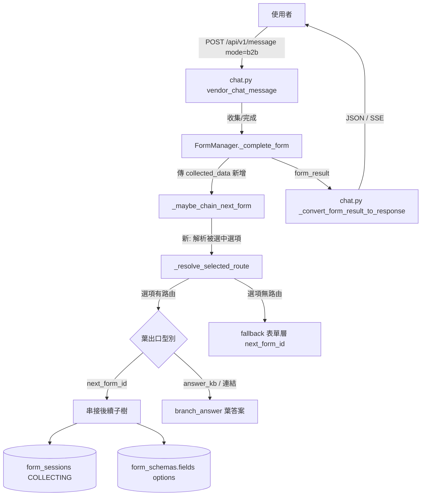
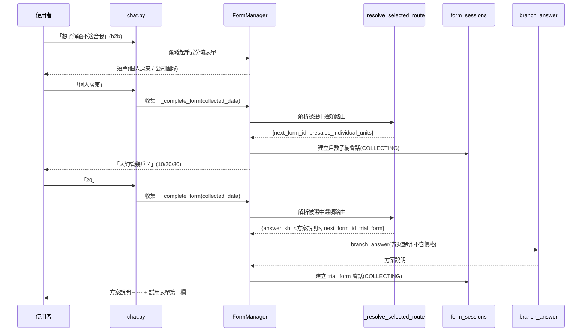

# 技術設計：option-routing（選項層決策樹路由）

> 建立時間：2026-06-20
> 需求文件：requirements.md（R1–R10）

## 概述

### 設計目標
將表單系統的「後續路由」來源從**表單層**（`form_schemas.next_form_id`）下放到**被選中的選項層**，使 select 選單的每個選項能各自分歧到不同的後續子樹或葉出口，實現依答案分歧的決策樹。本設計最大化重用既有 form-chaining 引擎，僅新增「依選項解析路由」一段邏輯與選項層的可選資料欄位。

### 範圍與邊界
- **涵蓋**：選項層路由資料模型（`options[]` 擴充）、路由解析（`_resolve_selected_route`）、`_maybe_chain_next_form` 接入選項路由與向後相容、三型葉出口（知識答案 / 動作表單 / 導向連結）、與表單層串接的 precedence、presales 決策樹範例資料、R9/R10 合規以資料落地。
- **不涵蓋**：樹根入口觸發（沿用既有 b2b 檢索觸發）、向量檢索 / reranker 改動、新增 `presales` mode、CTA 留資表單重做、公開頁本身實作、`VendorChatResponse` 新增連結欄位。

## 架構設計

### Architecture Pattern & Boundary Map
沿用既有分層（FastAPI router → `FormManager` service → PostgreSQL）。本功能不新增服務，僅在 `FormManager` 完成流程內新增「選項路由解析」並擴充串接判斷；選項路由設定承載於既有 `form_schemas.fields` JSONB，無資料表變更。



### Technology Stack & Alignment

| 層級 | 技術 | 版本 | 說明 |
|------|------|------|------|
| 後端 | Python / FastAPI | 既有 | `FormManager` 擴充，型別提示沿用既有風格 |
| 資料庫 | PostgreSQL | 既有 | `form_schemas.fields`（JSONB）選項加可選路由欄位，**無 migration** |
| 回覆引擎 | `branch_answer`（內部端點） | 既有 | 葉答案（含 URL 連結之知識）回覆，不經檢索 |
| 檢索 scope | b2b / `system_provider` | 既有 | presales 知識掛 b2b，沿用既有檢索觸發 |

## Components & Interface Contracts

### 核心元件

#### 元件 1：選項層路由資料模型（`form_schemas.fields[].options` 擴充）
**責任**：在 select 選項上承載可選的後續路由設定。純 JSONB 擴充，向後相容（未設即沿用舊行為）。[需求 1.1, 1.2, 4.1, 4.3, 7.1, 7.3]

**資料模型（Python 型別提示，TypedDict）**：
```python
class OptionRoute(TypedDict, total=False):
    # 既有
    label: str
    value: str
    # 新增（皆可選）
    next_form_id: str        # 後續子樹（內部節點）
    answer_kb: int           # 葉答案：知識 id（URL 葉出口＝該知識內含連結）
```
> 葉出口三型對應：**子樹**＝`next_form_id`；**知識答案**＝`answer_kb`；**導向連結**＝`answer_kb` 指向一筆內含 `/pricing` 等連結的知識（決策 2）。

#### 元件 2：`FormManager._resolve_selected_route()`（新 helper）
**責任**：依完成的表單與收集資料，解出「被選中選項」的路由；無則回 None（交由呼叫端 fallback 表單層）。純函式、可單元測試。[需求 2.1, 3.1, 3.2, 3.3]

**介面定義（Python 型別提示）**：
```python
def _resolve_selected_route(
    self,
    form_schema: Dict[str, Any],
    collected_data: Dict[str, Any],
) -> Optional[Dict[str, Any]]:
    """
    回傳 None 表示「該選項無選項層路由」（呼叫端 fallback 表單層 next_form_id）；
    否則回傳被選中選項的路由：
    {
        "next_form_id": Optional[str],   # 後續子樹
        "answer_kb": Optional[int],      # 葉答案知識 id
    }
    解析步驟：
    1. 取終端 select 欄位：以 current_field_index 對應之欄位為主；
       若該欄位非 select（多欄位 / REVIEWING / skip_review 等非預期情形），
       退而取「fields 中最後一個 select 欄位」；仍無 → 回 None（穩健 fallback，議題 3）。
    2. field_name → collected_data[field_name] = 被選 value。
    3. 於該欄位 options 找 value 相符之 option（無相符 → None）。
    4. option 含 next_form_id 或 answer_kb → 回該路由；否則 None。
    """
```

#### 元件 3：`FormManager._maybe_chain_next_form()`（擴充既有）
**責任**：接受新鮮 `collected_data`，先試「選項層路由」，無則 fallback 既有「表單層 `next_form_id`」串接。三型葉出口與子樹在此分派。全程容錯（沿用既有 try/except 回 None）。[需求 2.1–2.5, 3.1–3.3, 4.1–4.4, 6.1–6.4]

**介面定義（簽章擴充，向後相容）**：
```python
async def _maybe_chain_next_form(
    self,
    source_form_schema: Dict[str, Any],
    session_state: Dict[str, Any],
    collected_data: Optional[Dict[str, Any]] = None,  # 新增，預設 None 保相容
) -> Optional[Dict[str, Any]]:
    """
    路由來源解析順序（決策 5：擴充共存 precedence）：
    1. route = _resolve_selected_route(source_form_schema, collected_data)（collected_data 存在時）
    2. route.next_form_id → 串接該子樹（沿用既有載入/會話/深度/循環/呈現）；
       若 route 同時含 answer_kb，先解葉答案再合併（元件 4）。
    3. route.answer_kb（無 next_form_id）→ 葉答案，分支結束（form_completed=True）。
    4. route 為 None → fallback：source_form_schema['next_form_id']（既有主幹串接）。
    5. 皆無 → 回 None（不串接）。

    葉答案解析（議題 2，async 邊界）：answer_kb → 知識文字需呼叫
    api_call_handler._handle_branch_answer（async, DB）。此呼叫納入本函式
    既有 try/except；失敗 → 回 None（fallback 表單層），不影響來源完成。
    回傳結構沿用既有串接契約，葉答案時另含 leaf 標記與 answer 內容。
    """
```

#### 元件 4：`FormManager._complete_form()`（擴充既有）
**責任**：在既有串接呼叫處改為傳入新鮮 `collected_data`；依 `_maybe_chain_next_form` 結果分派回應（子樹 → 合併呈現 + 串接旗標契約；葉答案 → 完成 + branch_answer 內容）。未路由時回傳與現況完全一致。[需求 2.4, 2.5, 3.2, 4.1, 4.2, 7.1, 7.2]

**回傳契約（不變部分沿用 form-chaining）**：
- **後續子樹**：`form_completed=False`、`form_triggered=True`、`form_id`/`current_field`/`current_field_type`/`quick_replies` 指向後續、`answer = 葉答案?(branch) + "\n\n---\n\n" + 後續第一欄`。
- **純葉答案**：`form_completed=True`、`answer = 選項 answer_kb 知識內容`。
- **未路由 / fallback 表單層**：與現有 form-chaining 行為一致。

**葉答案與 `completion_message` 的覆寫規則（議題 1，決策 7）**：當被選中選項提供 `answer_kb` 時，該選項葉答案**覆寫**（取代）`_format_completion_message` 算出的 `completion_message`，而非附加——避免雙重回答。採選項葉答案的選單表單，其 `on_complete_action` 應設為 `show_knowledge` 或 none（表單層不另跑 `api_config` branch_answer），使選項層為唯一答案來源。

#### 元件 5：葉答案與導向連結（重用 `branch_answer`，無程式落差）
**責任**：選項 `answer_kb` 經既有 `_handle_branch_answer` 回該知識 `answer`；導向連結為該知識內容內含的 markdown 連結（`/pricing` 等）。[需求 4.1, 4.3, 9.1]

#### 元件 6：presales 決策樹範例資料（純資料，掛 b2b）
**責任**：以既有表擴充資料實作可運作範例，不新增資料表。[需求 8.1–8.6]
- **表單（`form_schemas`，select）**：起手式分流（個人/團隊）→ 個人下接戶數子樹；痛點選單；各選項帶 `next_form_id` / `answer_kb`。
- **CTA 表單**：`trial_form`（`POST /api2/trial_form`）、`demo_form`（`POST /api2/demo_form`），`on_complete_action=call_api`，對齊既有 demoForm 欄位。
- **知識（`knowledge_base`，b2b/`system_provider` scope）**：模組 C1–C6、分流 B1、痛點 B2、競品 E1–E3、方案（不含價格、價格導 `/pricing`）。
- **方案分級表達（決策 6）**：起手式先問個人/團隊；個人分支接「戶數」select（10/20/30 各選項 → 方案說明知識 + 可串 `trial_form`）；身分先決化解 31–49 模糊。

#### 元件 7：R9/R10 合規（資料與內容，非機制）
**責任**：以知識內容與既有路徑落地合規，不新增機制。[需求 9.1–9.3, 10.1–10.4]
- **不報價（R9.1）**：方案/IoT 知識不含價格；價格選項採導向連結（`/pricing`）。
- **IoT 不主動（R9.2）**：IoT 僅於使用者主動詢問時以知識回覆「細節由專人說明」並導留資。
- **競品（R10）**：「被問才回」走既有 b2b 知識檢索（KB-E1/E2/E3），中立性由知識內容與答案優化提示確保；非選項路由。

---

## 修訂（R11–R13）：葉答案 LLM 個人化 + 系統脈絡 md

> 接續修訂。決策樹路由與知識/CTA 選擇維持決定性（元件 1–7 不變）；本段新增「合成層」——僅 prospect 情境啟用。

#### 元件 8：跨步情境累積（Chain Context Accumulator）[需求 12]
**責任**：把決策樹各步被選中選項的情境沿串接累積，供葉答案合成個人化。
- **資料**：串接 metadata 新增 `chain_context: List[{form_id, field_label, selected_label, selected_value}]`。
- **行為**：`_maybe_chain_next_form` 串接時，將來源表單被選中選項（label/value）append 進 `chain_context`，隨後續會話 metadata 傳遞（沿用既有 metadata 機制，**不新增表**）。
- **邊界**：限本會話；取消/完成清除（R12.4）。決定性路由**不受**累積影響（R12.3）。

#### 元件 9：售前答案合成（擴充既有 `LLMAnswerOptimizer`，新增 presales 模式）[需求 11]
**責任**：以「選定知識 + 系統脈絡 md + 累積情境」合成個人化葉答案；失敗回 None 交呼叫端降級。重用既有 LLM provider/設定。
```python
async def synthesize_presales_answer(
    self,
    grounding_knowledge: str,             # 選定/檢索知識（事實源之一）
    accumulated_context: List[Dict],      # 累積情境（元件 8）
    system_context_md: str,               # 系統脈絡 md（元件 10）
    user_question: Optional[str] = None,  # 自由問答時帶
) -> Optional[str]:                       # 例外/逾時/超 token → None（降級）
    """system prompt = system_context_md + 嚴格指令（只用提供事實、不報價、
       競品只用本次 E1、無事實導出口）；grounding 限「知識 + md」。"""
```
- 兩進入點共用：①葉答案（option-routing）②自由問答（chat.py RAG synthesize，prospect 時）。

#### 元件 10：系統脈絡 md 載入器（System Context Loader）[需求 13]
**責任**：載入 + 快取系統脈絡 md，供 prospect 合成注入。
- 來源：`knowledge_base` 中 `category='系統脈絡'`（決策 11）；啟動載入、記憶體快取（每次合成注入，不可每次查庫）。
- `get_system_context() -> str`；大小守門（載入時檢查，超上限告警）。
- 載入失敗 → 回內建最小合規 prompt（不阻斷，告警）。

#### 改：元件 3/4（葉答案處理）
- `_resolve_leaf_answer(answer_kb)` → `_synthesize_leaf_answer(answer_kb, chain_context)`：載入知識 + md + 情境 → 元件 9 合成；**回 None 沿用既有 `_degrade_to_leaf`，降級內容為知識原文**（R11.5）。
- CTA / 表單第一欄段維持決定性、**不經 LLM**（R11.4）。
- `chat.py` 自由問答：`mode=b2b + target_user=prospect` 時 synthesize 注入 md（R13.2，競品/功能推薦走此路徑）。

### 資料模型

```python
# form_schemas.fields[].options（JSONB）— 選項層路由
class OptionRoute(TypedDict, total=False):
    label: str
    value: str
    next_form_id: str   # 後續子樹
    answer_kb: int      # 葉答案（知識；URL 葉出口＝知識內含連結）

# _resolve_selected_route 回傳
class ResolvedRoute(TypedDict, total=False):
    next_form_id: Optional[str]
    answer_kb: Optional[int]
```

## 資料流程

### 主要流程圖（presales：個人 → 戶數 → 方案 → 試用）



### 資料轉換
- 被選中選項 value（`collected_data[field_name]`）→ option 路由（`_resolve_selected_route`）→ 葉答案內容（`branch_answer`）與/或後續第一欄提示（`_present_first_field`）→ 合併 `answer`（`\n\n---\n\n` 分隔）。
- 串接情境（`role_id` / `chain_depth` / `chain_visited`）由來源會話 metadata 傳遞至後續會話（沿用 form-chaining）。

## 技術決策

### 決策 1：路由解析放置點
**問題**：選項路由解析放哪？
**選項**：A 在 `_maybe_chain_next_form` 內（抽 `_resolve_selected_route`）／B 在 `_complete_form` 先解再傳／C 葉答案沿用 api_config、選項只加子樹。
**決定**：**A + C 組合**。
**理由**：A 維持單一收斂點與最小改動；抽 `_resolve_selected_route` 維持可讀與可測；C 使知識葉答案相容既有 api_config。詳見 research.md 選型 1。

### 決策 2：URL 葉出口承載
**問題**：導向連結（`/pricing`）如何承載？
**選項**：A answer 內嵌 markdown 連結（＝含連結之知識）／B `quick_reply` 帶 URL／C 新增 `VendorChatResponse.cta_link`。
**決定**：**A**（URL 葉出口＝`answer_kb` 指向內含連結之知識）。
**理由**：`QuickReply`(text/value/style) 無 URL 動作、回應模型無連結欄位；A 免 schema 變更、最小落差。若未來需專屬 CTA 連結 UI 再評估 C（不在本 spec）。

### 決策 3：葉答案承載——選項內嵌 vs api_config
**問題**：葉答案放選項 `answer_kb` 還是沿用 `api_config.params.mapping`？
**決定**：**選項內嵌 `answer_kb` 為新標準**，既有 api_config mapping 保留向後相容；並存時選項層優先。
**理由**：決策樹的邊集中於選項、單一真相，便於設定與閱讀；與 R3 precedence 一致。

### 決策 4：`collected_data` 傳入
**問題**：路由需被選中選項值，但 `_maybe_chain_next_form` 未持有。
**決定**：簽章新增 `collected_data: Optional[...] = None`，由 `_complete_form` 傳入。
**理由**：預設 None 保既有呼叫相容；`_complete_form` 已持有新鮮 `collected_data`。

### 決策 5：擴充共存 precedence
**問題**：選項層路由與表單層 `next_form_id` 衝突時誰優先？
**決定**：**選項層優先、表單層 fallback、非-select 結尾沿用表單層**。
**理由**：對應 R3；非 select 結尾無選項可承載路由，必須保留表單層機制（form-chaining 既有金流範例即屬此）。

### 決策 6：方案分級樹表達
**問題**：戶數 + 有無團隊兩維、31–49 模糊如何表達？
**決定**：起手式先問個人/團隊；個人分支下接戶數 select 子樹；身分先決化解模糊。
**理由**：避免數值條件運算，純以選單分歧表達，與 option-routing 機制一致。

### 決策 7：選項葉答案 `answer_kb` 與表單 `on_complete_action`/`api_config` 的關係（議題 1）
**問題**：既有 `_complete_form` 於步驟 2 即依 `on_complete_action='call_api'`+`api_config` 跑 branch_answer 並算出 `completion_message`；選項層 `answer_kb` 又是另一葉答案來源。兩者同存可能雙重回答 / 衝突。
**選項**：A 選項層 `answer_kb` 覆寫 `completion_message`、選單表單用 `show_knowledge`/none（不在表單層跑 api_config）／B 表單層 api_config 為主、選項層僅子樹／C 兩者皆出（附加）。
**決定**：**A**。採選項葉答案的選單表單 `on_complete_action=show_knowledge`/none；選項 `answer_kb` 葉答案**覆寫** `completion_message`（單一答案來源）。若表單層 `api_config` 與選項 `answer_kb` 罕見並存，**選項層優先**（與 R3 一致）。
**理由**：決策樹的答案邊集中於選項、單一真相、避免雙重回答；既有 form-chaining 金流範例（payment_gateway_*）屬「表單層 api_config + 表單層 next_form_id、無選項路由」，走 fallback 路徑，完全不受影響（向後相容 R7.2）。
**參考資料**：research.md 主題 3；`_complete_form` 步驟 2（`form_manager.py:~2164`）、步驟 5（`~2321`）。

### 決策 8：樹內 LLM 合成的合規護欄（R11）
**問題**：樹內加 LLM 會否破壞合規 / 決定性？
**決定**：**路由與選知識 100% 決定性；僅「措辭」交 LLM**，三重護欄——①grounding 限「選定知識 + 系統脈絡 md」②嚴格 system prompt（不報價 / 競品只用 E1 / 無事實導出口）③失敗降級回知識原文。
**理由**：個人化價值 > 嚴格措辭決定性；合規靠 grounding + prompt + 決定性選材守住。

### 決策 9：md 注入範圍 = 所有 prospect 合成（葉 + 自由問答）（R13.2）
**問題**：md 只掛葉答案夠嗎？
**決定**：凡 prospect 情境（`mode=b2b + target_user=prospect`）的 LLM 合成都注入 md。
**理由**：競品 / 功能推薦是自由問答（非葉節點），需同一合規護欄與功能索引。

### 決策 10：情境累積放 metadata，不新增表（R12）
**決定**：沿用串接 metadata 傳遞 `chain_context`，限本會話、隨會話清除。
**理由**：最小改動、與既有串接情境（role/depth/visited）一致。

### 決策 11：系統脈絡 md 存放——專屬分類 `'系統脈絡'`
**問題**：md 存哪、如何確保不被檢索？
**決定**：存 `knowledge_base` 一筆，掛**保留分類 `category='系統脈絡'`**；①載入端以該分類直接 SELECT ②檢索端（vector + keyword 兩處）WHERE 明確加 `AND category IS DISTINCT FROM '系統脈絡'` ③該筆無 embedding 作防呆。**零 schema 變更**——`answer`(text) 裝全文、`generation_metadata`(jsonb) 裝 version/last_verified/char_count、`embedding`/`business_types` 留空。
**理由**：顯性排除（意圖明確、可擴充其他注入用系統文件）＞ 靠「無 embedding」隱性排除；既有欄位足夠、後台可編輯。

---

## 修訂（R14–R18）：AI 引導式售前顧問對話

> 決策樹的「問問題」職能由 AI 顧問取代（決策 14=A：棄用 presales_intro/units/pain 問問題表單）。保留 `presales_entry`（fast-path 快速選主題）+ CTA 結構化表單（trial/demo 留資）。

### 架構
```
prospect 訊息
  ├─ fast-path：presales_entry 選單（快速選主題）
  │    ├ 適不適合/想解決問題 → seed 顧問狀態（topic）→ 顧問迴圈
  │    ├ 方案費用 → D1 直答（不入顧問）
  │    └ 跟別家比較 → E1 直答
  └─ 自由問答 → 顧問迴圈
        每輪：LLM(系統 md + 對話狀態 + 使用者訊息 + 相關知識)
              → JSON{extracted_fields, action:"ask"|"converge", next_question?, converge_topic?}
          ├ ask     → 回下一題（一次一題，標準欄位優先）
          └ converge→ 依已收集欄位取知識 grounding → synthesize_presales_answer → 推薦 + CTA
```

#### 元件 11：顧問對話狀態（Advisor State）[需求 16]
存於既有 `form_sessions`（偽 form_id `presales_advisor`，沿用 session_id + metadata）：`collected_fields`{身分/規模(戶數)/有無團隊/痛點/有興趣功能}、已知缺口、累積情境、提問計數。限本會話；取消/結束/收斂清除。

#### 元件 12：顧問 brain（控制迴圈）[需求 14, 15]
單次 **structured-output LLM call**，三合一：
- **輸入**：系統 md（合規鐵則 + 功能索引）+ 當前狀態（已知欄位/缺口/提問計數）+ 使用者最新訊息 +（收斂時）檢索知識。
- **輸出（JSON，驗證）**：`{extracted_fields:{...}, action:"ask"|"converge", next_question?:str, converge_topic?:str}`。
- **規則（system prompt）**：優先問標準欄位缺口；需釐清才動態生成新題（限售前 scope）；提問計數 ≥ 4 或收斂門檻達成（身分 +「規模或痛點」）→ converge；使用者要求 → converge；一次一題。

#### 元件 13：收斂推薦合成 [需求 15]
`action=converge` → 依 `collected_fields`（痛點/身分/規模）選定相關知識 → 重用 `synthesize_presales_answer(grounding_knowledge, accumulated_context=狀態, system_md)` 生成個人化推薦（方案級距不報價 + 對應模組 + 明確 CTA）。

#### 元件 14：進入與降級 [需求 17, 18]
- prospect 自由問答（非選單、非進行中 CTA 會話）→ 進顧問迴圈（元件 12）。
- `presales_entry` fast-path：適不適合/痛點選項 → seed 顧問 topic；方案費用/競品 → D1/E1 直答。
- brain LLM 失敗/逾時/輸出驗證失敗 → 降級回既有自由問答合成（`_maybe_synth_prospect_freetext`）或選單，不阻斷。

### 改既有元件
- **`presales_entry` 選項改 seed 顧問**：「適不適合我用」「想解決管理上的問題」不再 `next_form_id` 到舊表單，改 seed advisor topic 進顧問；方案費用→D1、競品→E1 維持直答。
- **棄用** `presales_intro` / `presales_individual_units` / `presales_pain_points`（`is_active=false`），移除其觸發；**對應知識保留**（個人方案 #3596-98、團隊 #3584、模組 #3599-3605 等）供顧問收斂 grounding。

### 技術決策（R14–R18）
- **決策 14：棄用問問題表單（A）**：問問題交 AI 顧問；保留 entry 快速選 + CTA。理由：避免固定表單與 AI 自適應提問重複/衝突；知識保留供 grounding。
- **決策 15：顧問 brain = 單次 structured LLM call**（抽欄位+決策+提問三合一，JSON 輸出 + scope 驗證）。理由：單次往返省延遲/成本；結構化輸出可驗證、防越界（報價/競品/越 scope）。
- **決策 16：狀態存 `form_sessions` metadata**（偽 form_id `presales_advisor`），不新增表。
- **決策 17：收斂 grounding**：痛點→模組知識、身分+規模→方案知識（沿用既有 #3584/3596-3605），選定後 synthesize。

### 非功能 / 合規 / 降級（R14–R18）
- **合規**：md 護欄 + grounding 限「md + 知識」+ 結構化輸出驗證（拒絕越界提問/報價/競品斷言）+ 決定性 CTA。
- **效能**：每輪一次 LLM（brain）+ 收斂時一次（合成），gpt-4o；非 prospect 不受影響。
- **降級**：brain 失敗 → 自由問答合成；收斂合成失敗 → 知識原文/選單。
- **決定性**：grounding 來源（知識選擇）與 CTA 結構化可控；提問與措辭交 AI。

### 修訂（R19）：reframe 為「對話式回答模式」（generic + 資料驅動）

> R14–R18 的「AI 引導顧問」其本質為**通用對話式回答模式**；售前適配為首例。命名 `advisor`→`conversational`。

#### 元件 15：對話式回答設定（Conversational Config，資料驅動）[需求 19]
一筆設定 = 一個面向，含：`answer_mode`(direct|conversational)、入口（觸發/選項 `advisor_topic`）、`persona/rules`（依 target_user 載入：DB `category='對話規則'` + code 內建 fallback）、`grounding_scope`（收斂檢索範圍，如 category/keywords）、seed。**新增面向/角色 = 加設定資料，不動程式。**

#### 改：元件 12/13（brain / 收斂）依設定參數化
- brain `advisor_step(rules_text, system_md, state, message)`：規則由設定載入後**外部傳入**（不綁角色）。
- 收斂檢索：依該設定的 `grounding_scope` 限定知識（多面向不互撈）；presales 首例 scope = prospect 售前知識。

#### 技術決策
- **決策 18：回答模式 opt-in、資料驅動**：未設定者一律 `direct`；conversational 設定（含規則 + grounding 範圍）存資料，可擴充至其他面向。理由：避免直答題被拖進迴圈；通用、前瞻、加面向不改 code。

## 非功能性設計

### 效能考量
- **路由解析**為記憶體內 dict 比對；串接僅多一次 `_get_form_schema_sync` + 一次 `create_form_session`（皆既有 DB 操作）；**路由層不引入 LLM**（R-非功能 3 修訂）。
- **葉答案 / 自由問答合成（R11/R13，僅 prospect 情境）多一次 LLM 呼叫**；系統脈絡 md **記憶體快取**（不每次查庫）；**非 prospect 情境完全不受影響**（不注入、不合成）；合成失敗 / 逾時降級回知識原文，**不阻斷對話**。

### 安全性設計
- 沿用既有 vendor_id 隔離與 b2b/`system_provider` scope；後續表單須 `is_active=true` 才串接。
- 合規（不報價、競品中立）為內容層約束，由知識資料與審核保障（R9/R10）。

### 可擴展性
- 選項層路由為通用機制，任何 select 表單皆可組成決策樹，不限 presales。

### 錯誤處理
- `_resolve_selected_route` 找不到選項/路由 → 回 None → fallback 表單層 → 不分歧。
- `_maybe_chain_next_form` 整段 try/except，任何失敗回 None，來源完成照常（R6.3/6.4）。

## 測試策略

### 單元測試
- `_resolve_selected_route`：終端非 select→None；選項有 `next_form_id`→回子樹；有 `answer_kb`→回葉答案；兩者皆有→回兩者；選項無路由→None；value 不匹配→None。
- 葉出口三型分派；URL＝含連結知識回覆。

### 整合測試
- 選項分歧：同一選單不同選項→不同後續子樹（real DB）。
- 葉答案：選項→branch_answer 知識，分支結束。
- **葉答案覆寫（決策 7）**：採選項 `answer_kb` 的選單（`on_complete_action=show_knowledge`）→ `answer` 為選項知識內容、**不雙重回答**；驗證未誤跑表單層 api_config。
- 合併：選項同時葉答案 + 子樹→合併 `answer` + 串接旗標。
- **終端 select fallback（議題 3）**：完成欄位非 select 時 `_resolve_selected_route` 回 None → 走表單層 fallback。
- 擴充共存：選項無路由→fallback 表單層 `next_form_id`（form-chaining 金流範例不受影響）。
- 向後相容：未設選項路由之既有表單行為不變。

### 端對端測試（b2b mode）
- presales：個人→戶數→方案說明(不報價)→試用；團隊→demo；痛點→模組→demo / IoT→專人；問價格→/pricing；問競品→中立比較→收束 demo；取消→結束。

## 部署考量

### 環境需求
- **無 migration**（選項路由承載於既有 `fields` JSONB）。
- presales 範例為資料寫入（知識 + 表單），掛 b2b/`system_provider` scope。

### 部署步驟
1. 部署 `form_manager.py` 變更（`_resolve_selected_route` + `_maybe_chain_next_form`/`_complete_form` 擴充）。
2. 寫入 presales 範例資料（知識 C1–C6/B1/B2/E1–E3、起手式/痛點/CTA 表單與選項路由）。
3. 回歸測試既有表單與 form-chaining 金流範例。

### 監控與告警
- 日誌：選項路由命中/未命中（fallback）、葉出口型別、深度達上限、循環中止、串接失敗。

## 風險與挑戰

| 風險 | 影響 | 機率 | 緩解策略 |
|------|------|------|---------|
| 改 `_maybe_chain_next_form` 簽章破壞既有呼叫 | 高 | 低 | 新參數預設 None；無選項路由 fallback 表單層 |
| 選項路由與表單層衝突 | 中 | 低 | R3 precedence（選項優先、表單層 fallback） |
| 不報價內容外洩價格（合規） | 高 | 中 | 內容紀律 + 價格選項導 /pricing；內容審核 |
| 競品中立性（合規） | 中 | 中 | KB-E 事實 + 答案優化提示；非機制 |
| 終端 select 判定（多欄位表單） | 中 | 低 | 以 `current_field_index` 終端欄位為準、非 select fallback |

## 參考文件
- [需求文件](requirements.md)
- [研究記錄](research.md)
- [落差分析](gap-analysis.md)

## 附錄

### 名詞解釋
- **選項層路由（option route）**：掛在 select 選項上的後續走向（子樹 / 葉答案 / 導向連結）。
- **葉出口（leaf outlet）**：分支底端去向，三型——知識答案、動作表單、導向連結。
- **擴充共存**：選項層路由與表單層 `next_form_id` 並存，選項優先、表單層 fallback。

---

## 修訂（藍圖）：對話式回答通用化擴充 —（角色＋主題範圍）/ grounding 三態 / 設定管理畫面

> 狀態（2026-06-21 更新）：**Phase 1/2 已實作；Phase 3 待做**。
> - **Phase 1（已實作）**：X2 grounding 三態（ids/category/vector）+ X3 設定模型（topic_scope/enabled/grounding.select）。
> - **Phase 2（已實作）**：X4 設定管理畫面 + upsert/list/delete API（knowledge-admin「對話設定」頁）。
> - **Phase 3（待做，按需）**：X1 主題級「檢索命中就進」的進入觸發（目前啟用僅 prospect freetext，由
>   `CONVERSATIONAL_ENABLED_ROLES` 白名單明確控制；有真實主題場景再實作並驗證）。
> - **調整**：X1「選單 entry」進入方式已捨棄（engine-first 已涵蓋 prospect）；進入方式收斂為
>   **freetext（整角色）/ topic（主題命中）** 兩種。現況：prospect=（freetext, grounding vector）。

### 背景
- 角色有限（粗門）；同一角色內非每個問題都該對話（細門需「主題」）。R19 原意即「opt-in 決定**哪些問題/主題**走 conversational」。目前實作把粒度簡化成「整個角色」（prospect）。

### 設計 X1：統一啟用模型（角色 + 主題範圍）
- 設定 = **(角色 role, 主題範圍 topic_scope)**；`prospect = (prospect, ALL)` 為特例（整角色皆對話）。
- **進入判斷（粗→細）**：
  1. 角色在啟用白名單？（`CONVERSATIONAL_ENABLED_ROLES`，明確控制；不因 DB 有設定就自動開）→ 否：直答。
  2. 該角色設定 `topic_scope=ALL`？→ 是：進對話（prospect 走這條）。
  3. 否（主題級）：本訊息是否**命中該主題**（用既有檢索/`category` 判定）→ 命中才進，否則維持直答。
- 「單一角色進入」＝主題範圍設 ALL 的特例；兩者同一套機制、不衝突。

### 設計 X2：grounding 選材三態（決定性優先）
對應非功能需求 #1（**知識選擇決定性、措辭才交 LLM**）。`grounding_scope.mode`：
- **`ids`**：明列 `kb_ids`（最決定性）。
- **`category`**：某分類**整批撈**（決定性；**窄主題首選**，如退租結算；該批知識甚至可無 embedding）。
- **`vector`**：語意檢索＋過濾（**廣主題**用，如 presales 多主題顧問）。

`_converge` 依 mode 取知識；**選材決定性、合成 LLM、事實只能來自選定那批**。窄主題用 category/ids、廣主題才用 vector。

### 設計 X3：設定資料模型（擴充 ConversationalConfig）
- 既有：`key/answer_mode/persona_role/grounding_scope/entry/seed`。
- 擴充：`topic_scope`（ALL | category | keywords | ids）、`enabled`（布林）、`grounding_scope.mode`（ids/category/vector）。
- 仍存於 `knowledge_base` `category='對話規則'` 列的 `generation_metadata.conversational_config`（一列＝規則 `answer` + 設定 metadata）。

### 設計 X4：設定管理畫面（前端 admin｜knowledge-admin 新頁）
> 解決現況痛點：`generation_metadata` 目前**無 UI 可編**，加設定只能下 SQL。本頁讓「加一組」變純畫面。
- **列表頁**：顯示所有對話設定（角色 / 主題範圍 / 啟用 / grounding 模式 / 入口），可新增/編輯/停用。
- **編輯表單欄位**：
  - 角色 `target_user`（白名單下拉）、`enabled` 啟用、`answer_mode`
  - persona 規則文字（＝`knowledge_base.answer`）
  - 主題範圍 `topic_scope`（ALL / 選 category / 關鍵字 / 選知識 ids）
  - grounding 模式與範圍（ids＝多選知識 / category＝分類下拉 / vector＝條件）
  - 入口 `entry`（選單 `form_id` + option values）、`seed`
- **後端 API**：新增一支 upsert 端點，寫入 `knowledge_base`（`answer` + `generation_metadata.conversational_config`）；存檔後 `reset_cache()`（或提示重啟）。
- **防呆**：寫入前驗證設定 schema；該分類沿用檢索排除（不被當答案回傳）。

### 範圍與分期
- **現在**：只補本藍圖文件；prospect 維持 `(prospect, ALL, vector)`，不動程式。
- **之後**：出現第一個真實主題（例：`tenant 退租結算 = (tenant, topic_scope=category:退租結算, grounding.mode=category)`）時，才實作 X1–X4 對應部分並真實驗證。

### 技術決策（藍圖）
- **決策 19：啟用＝角色白名單明確控制**（非「有設定就自動開」）——避免誤加設定誤觸；要擴充才加角色。
- **決策 20：grounding 選材決定性優先**——窄主題 category/ids（不靠向量、可無 embedding），廣主題才 vector；守住非功能需求 #1。
- **決策 21：設定統一存 `對話規則` 列的 metadata**＋**管理畫面**——資料驅動且可由後台維護，避免 SQL。

---

### 變更歷史
| 日期 | 版本 | 變更內容 | 修改者 |
|------|------|---------|--------|
| 2026-06-20 | 1.0 | 初始版本（含 G1–G5） | AI |
| 2026-06-20 | 1.1 | 設計審查補強：決策 7（葉答案覆寫 vs on_complete_action）、async 葉答案邊界容錯、終端 select 穩健 fallback | AI |
| 2026-06-20 | 2.0 | R11–R13 修訂：新增元件 8（情境累積）/9（擴充 LLMAnswerOptimizer presales 合成）/10（系統脈絡 md 載入），決策 8–11（樹內 LLM 護欄 / md 注入範圍 / 情境累積 / 專屬分類存放），更新非功能效能 | AI |
| 2026-06-21 | 3.0 | R14–R18 修訂：AI 引導式售前顧問——元件 11（顧問狀態）/12（brain 控制迴圈）/13（收斂推薦）/14（進入與降級），決策 14–17（棄用問問題表單 / 單次 structured LLM call / 狀態存 form_sessions / 收斂 grounding）。決策樹問問題職能交 AI，保留 entry 快速選 + CTA 結構化 | AI |
| 2026-06-21 | 3.1 | 對話式回答通用化擴充——設計 X1（角色＋主題範圍）/X2（grounding 三態）/X3（設定資料模型）/X4（設定管理畫面），決策 19–21 | AI |
| 2026-06-21 | 3.2 | 實作：Phase 1（X2 grounding 三態 + X3 模型 topic_scope/enabled/grounding.select）、Phase 2（X4 管理畫面 + API）完成；進入方式捨棄選單 entry、收斂為 freetext/topic；prospect 移除 vendor_id/entry。Phase 3（X1 主題命中觸發）待真實主題 | AI |

---

*本文件遵循專案規範中的設計原則，所有介面定義採用強型別（Python 型別提示），於邊界驗證輸入。*
