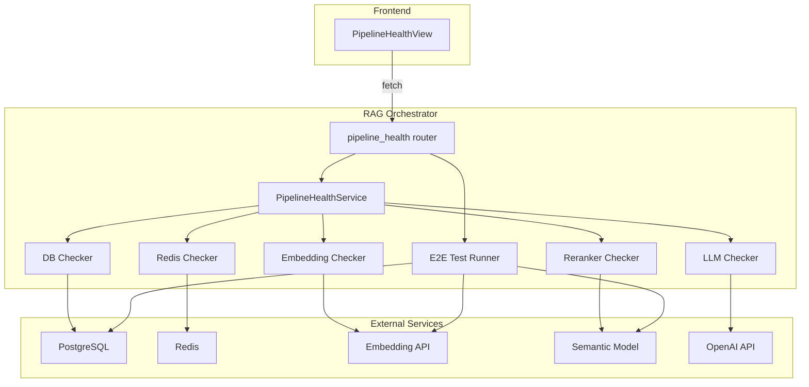
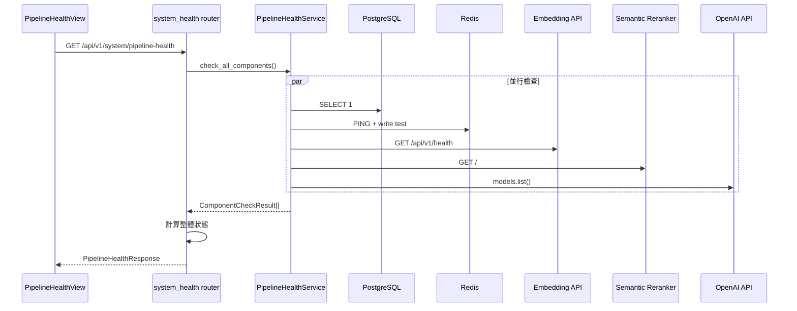
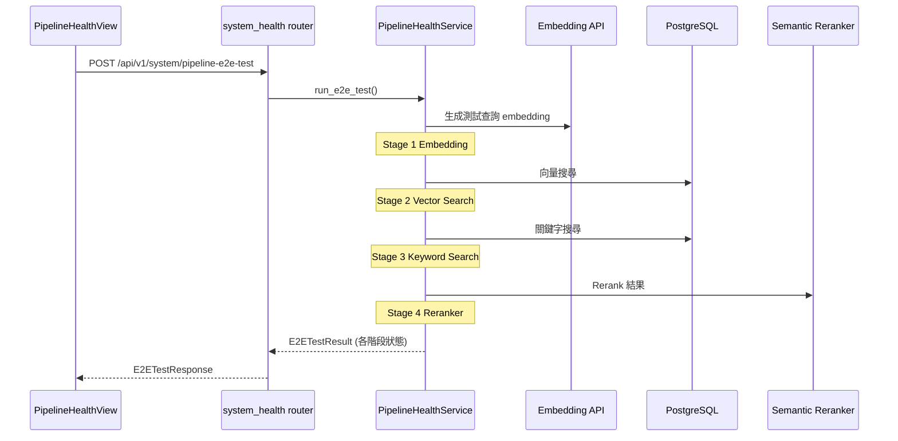

# 設計文件：pipeline-health-dashboard

> **建立時間**：2026-04-18T06:30:00Z
> **需求文件**：requirements.md
> **研究記錄**：research.md
> **語言**：Traditional Chinese (zh-TW)

---

## Overview

**Purpose**：本功能在 knowledge-admin 系統設定層新增「Pipeline 健康儀表板」，讓管理者一眼掌握 RAG pipeline 各元件的運作狀態，並可執行端到端測試驗證完整流程。

**Users**：系統管理者在回答異常時使用此頁面快速定位問題元件，無需登入容器查日誌。

**Impact**：在 rag-orchestrator 新增 2 個 API 端點（健康檢查 + 端到端測試），在 knowledge-admin 前端新增 1 個 Vue 頁面。

### Goals
- 提供單一端點聚合所有 pipeline 元件的健康狀態
- 區分核心/非核心元件，支援降級狀態判斷
- 一鍵端到端測試驗證完整 RAG pipeline
- 前端儀表板即時呈現檢查結果

### Non-Goals
- 不做歷史趨勢或時序監控
- 不做告警推送或自動修復
- 不做環境變數或閾值的線上修改
- 不做效能 profiling 或日誌搜尋

## Boundary Commitments

### This Spec Owns
- `GET /api/v1/system/pipeline-health` 端點：聚合各元件健康檢查
- `POST /api/v1/system/pipeline-e2e-test` 端點：端到端 pipeline 驗證
- `PipelineHealthView.vue` 前端頁面：儀表板 UI
- 各元件的 health checker 實作（DB、Redis、Embedding、Reranker、LLM）
- 核心/非核心分類邏輯與整體狀態計算

### Out of Boundary
- 各元件服務本身的健康端點（已存在，本 spec 僅呼叫）
- 認證機制（沿用既有 admin auth）
- 導航權限系統（沿用既有 permission guard）
- 既有 `/api/v1/health` 端點（保留不動）

### Allowed Dependencies
- rag-orchestrator 的 DB 連線（`db_utils.get_db_config`）
- rag-orchestrator 的 Redis 連線（`cache_service`）
- rag-orchestrator 的 embedding client（`embedding_utils`）
- rag-orchestrator 的 semantic reranker（`semantic_reranker`）
- rag-orchestrator 的 LLM provider（`llm_provider`）
- knowledge-admin 前端的 API config 與 auth store

### Revalidation Triggers
- 新增或移除 pipeline 元件時需更新 checker 清單
- 元件 API 端點格式變更時需更新對應 checker
- 前端認證或權限機制變更時需調整頁面 meta

## Architecture

### Architecture Pattern & Boundary Map



**Architecture Integration**：
- 新增 `routers/system_health.py` router，掛在 `/api/v1/system`
- 新增 `services/pipeline_health_service.py` 聚合各 checker
- 各 checker 內嵌於 service，不另建獨立檔案（共用結構簡單，無需額外抽象）
- 前端新增 Vue 頁面，沿用 CacheManagementView 的 fetch + card 模式

### Technology Stack

| Layer | Choice / Version | Role in Feature |
|-------|------------------|-----------------|
| Backend | FastAPI + asyncio | API 端點與並行健康檢查 |
| Frontend | Vue 3 (Options API) | 儀表板頁面 |
| Data | PostgreSQL (psycopg2) | DB 連線測試 |
| Cache | Redis (redis-py) | Redis 連線測試 |
| HTTP | httpx (async) | 呼叫 Embedding/Reranker/LLM 健康端點 |

## File Structure Plan

### New Files
```
rag-orchestrator/
├── routers/
│   └── system_health.py          # API 端點：pipeline-health + e2e-test
└── services/
    └── pipeline_health_service.py # 健康檢查聚合邏輯 + 各元件 checker

knowledge-admin/frontend/src/
└── views/
    └── PipelineHealthView.vue     # 健康儀表板頁面
```

### Modified Files
- `rag-orchestrator/app.py` — 註冊 system_health router
- `knowledge-admin/frontend/src/router.js` — 新增 `/pipeline-health` 路由
- `knowledge-admin/frontend/src/App.vue` — 在系統設定層導航加入「系統健康」項目
- `knowledge-admin/frontend/src/config/api.js` — 新增 pipeline-health 端點定義

## System Flows

### 元件健康檢查流程



### 端到端測試流程



## Requirements Traceability

| Requirement | Summary | Components | Interfaces |
|-------------|---------|------------|------------|
| 1.1 | 元件狀態回傳格式 | PipelineHealthService | GET pipeline-health |
| 1.2 | 檢查 7 個元件 | PipelineHealthService (5 checkers + E2E 涵蓋 2) | GET pipeline-health |
| 1.3 | 逾時隔離 | PipelineHealthService (per-checker timeout) | GET pipeline-health |
| 1.4 | 15 秒內完成 | PipelineHealthService (asyncio.gather) | GET pipeline-health |
| 1.5 | 整體狀態計算 | system_health router | GET pipeline-health |
| 2.1 | 端到端驗證 | PipelineHealthService.run_e2e_test | POST pipeline-e2e-test |
| 2.2 | 失敗階段標示 | PipelineHealthService.run_e2e_test | POST pipeline-e2e-test |
| 2.3 | 30 秒內完成 | PipelineHealthService.run_e2e_test | POST pipeline-e2e-test |
| 3.1 | 導航位置 | App.vue 修改 | — |
| 3.2 | 頁面載入自動檢查 | PipelineHealthView.vue | — |
| 3.3 | 卡片式狀態顯示 | PipelineHealthView.vue | — |
| 3.4 | 錯誤訊息醒目顯示 | PipelineHealthView.vue | — |
| 3.5 | 整體狀態摘要 | PipelineHealthView.vue | — |
| 4.1 | 重新檢查按鈕 | PipelineHealthView.vue | — |
| 4.2 | 載入狀態 | PipelineHealthView.vue | — |
| 4.3 | 端到端測試按鈕 | PipelineHealthView.vue | — |
| 4.4 | 測試進度 | PipelineHealthView.vue | — |
| 5.1 | 核心元件分類 | PipelineHealthService | GET pipeline-health |
| 5.2 | 非核心元件分類 | PipelineHealthService | GET pipeline-health |
| 5.3 | 降級影響說明 | PipelineHealthView.vue + API | GET pipeline-health |
| 6.1 | API 身份驗證 | system_health router | — |
| 6.2 | 前端權限控制 | router.js + App.vue | — |

## Components and Interfaces

| Component | Domain/Layer | Intent | Req Coverage | Key Dependencies | Contracts |
|-----------|--------------|--------|--------------|------------------|-----------|
| system_health router | Backend/Router | API 端點定義 | 1.1-1.5, 2.1-2.3, 5.1-5.3, 6.1 | PipelineHealthService (P0) | API |
| PipelineHealthService | Backend/Service | 健康檢查聚合 + 端到端測試 | 1.1-1.5, 2.1-2.3, 5.1-5.2 | DB/Redis/Embedding/Reranker/LLM (P0) | Service |
| PipelineHealthView | Frontend/View | 儀表板 UI | 3.1-3.5, 4.1-4.4, 5.3, 6.2 | system_health API (P0) | — |

### Backend / Router

#### system_health router

| Field | Detail |
|-------|--------|
| Intent | 定義 pipeline 健康檢查與端到端測試的 API 端點 |
| Requirements | 1.1-1.5, 2.1-2.3, 5.1-5.3, 6.1 |

**Responsibilities & Constraints**
- 提供 2 個 API 端點
- 計算整體狀態（healthy/degraded/unhealthy）
- 所有端點需要管理者認證

**Dependencies**
- Inbound: PipelineHealthView (P0)
- Outbound: PipelineHealthService (P0)

**Contracts**: API [x]

##### API Contract

| Method | Endpoint | Request | Response | Errors |
|--------|----------|---------|----------|--------|
| GET | /api/v1/system/pipeline-health | — | PipelineHealthResponse | 401, 500 |
| POST | /api/v1/system/pipeline-e2e-test | — | E2ETestResponse | 401, 500 |

### Backend / Service

#### PipelineHealthService

| Field | Detail |
|-------|--------|
| Intent | 聚合各元件健康檢查並提供端到端測試 |
| Requirements | 1.1-1.5, 2.1-2.3, 5.1-5.2 |

**Responsibilities & Constraints**
- 並行執行所有元件健康檢查（asyncio.gather）
- 每個 checker 獨立 timeout（5 秒），總體 15 秒內完成
- 端到端測試使用硬編碼的測試查詢（如「漏水怎麼處理」）
- 維護核心/非核心元件分類

**Dependencies**
- Outbound: db_utils (P0), cache_service (P1), embedding_utils (P0), semantic_reranker (P1), llm_provider (P0)

**Contracts**: Service [x]

##### Service Interface

```python
from typing import TypedDict, Optional, Literal
from enum import Enum

class ComponentStatus(str, Enum):
    HEALTHY = "healthy"
    UNHEALTHY = "unhealthy"
    DEGRADED = "degraded"

class ComponentCheckResult(TypedDict):
    name: str                           # 元件名稱（如 "PostgreSQL"）
    status: ComponentStatus             # healthy / unhealthy / degraded
    latency_ms: float                   # 回應延遲（毫秒）
    version: Optional[str]              # 版本或模型資訊
    error: Optional[str]                # 錯誤訊息（僅 unhealthy 時）
    is_core: bool                       # 是否為核心元件
    degradation_impact: Optional[str]   # 降級影響說明（非核心元件）

class E2EStageResult(TypedDict):
    stage: str                          # 階段名稱
    status: ComponentStatus             # 通過/失敗
    latency_ms: float                   # 耗時
    error: Optional[str]                # 錯誤訊息
    detail: Optional[str]               # 補充資訊（如匹配筆數）

class PipelineHealthService:
    async def check_all_components(self) -> list[ComponentCheckResult]:
        """並行檢查所有元件，每個 checker 5 秒 timeout"""
        ...

    async def run_e2e_test(self) -> list[E2EStageResult]:
        """執行端到端 pipeline 測試（embedding → vector → keyword → reranker）"""
        ...
```

**Implementation Notes**
- 各 checker 實作為 service 的 private method（`_check_db`, `_check_redis`, `_check_embedding`, `_check_reranker`, `_check_llm`）
- DB checker：`SELECT 1` + 取 PostgreSQL version
- Redis checker：沿用 cache_service.health_check() 邏輯
- Embedding checker：`GET /api/v1/health` 到 embedding-api
- Reranker checker：`GET /` 到 semantic-model，檢查 model_loaded
- LLM checker：呼叫 `openai.models.list()`，驗證 API key 有效
- 端到端測試用 vendor_id=2 的固定測試查詢，依序跑 4 個 stage
- 核心元件定義：`CORE_COMPONENTS = {"PostgreSQL", "Embedding API", "LLM API"}`
- 非核心元件降級說明硬編碼：Redis → 「快取不可用，回應速度可能下降」、Reranker → 「重排序不可用，回答排序品質可能下降」

### Frontend / View

#### PipelineHealthView

| Field | Detail |
|-------|--------|
| Intent | 健康儀表板頁面，顯示元件狀態與端到端測試結果 |
| Requirements | 3.1-3.5, 4.1-4.4, 5.3, 6.2 |

**Implementation Notes**
- 沿用 CacheManagementView 的 Options API + fetch 模式
- 頂部：整體狀態摘要卡片（大圖示 + 「X/Y 元件正常」）
- 中間：元件狀態 grid（每個元件一張卡片）
- 底部：端到端測試區域（按鈕 + 各階段結果列表）
- 狀態圖示：✅ healthy / ❌ unhealthy / ⚠️ degraded
- CSS class：`status-healthy`（綠色）/ `status-unhealthy`（紅色）/ `status-degraded`（黃色）
- 頁面載入時 `mounted()` 自動呼叫一次健康檢查

## Data Models

### API Response Models

**PipelineHealthResponse**（GET /api/v1/system/pipeline-health）：

```python
class PipelineHealthResponse(BaseModel):
    overall_status: ComponentStatus         # healthy / degraded / unhealthy
    healthy_count: int                      # 正常元件數
    total_count: int                        # 總元件數
    components: list[ComponentCheckResult]  # 各元件檢查結果
    checked_at: str                         # ISO 8601 時間戳
```

**E2ETestResponse**（POST /api/v1/system/pipeline-e2e-test）：

```python
class E2ETestResponse(BaseModel):
    overall_status: ComponentStatus         # 全部通過為 healthy，否則 unhealthy
    test_query: str                         # 使用的測試查詢
    stages: list[E2EStageResult]            # 各階段結果
    total_latency_ms: float                 # 總耗時
    tested_at: str                          # ISO 8601 時間戳
```

無需新增資料庫表或持久化存儲 — 所有結果為即時計算。

## Error Handling

### Error Strategy

- **元件檢查隔離**：每個 checker 用 `asyncio.wait_for(timeout=5)` 包裹，單一元件逾時或例外不影響其他元件
- **整體逾時**：`asyncio.gather` 外層用 `asyncio.wait_for(timeout=15)` 做最終保護
- **降級容忍**：非核心元件失敗時整體狀態為 degraded 而非 unhealthy
- **前端錯誤**：API 呼叫失敗時顯示錯誤提示並保留上次成功的結果

### Error Categories

| 類型 | 處理方式 |
|------|----------|
| 單一元件逾時 | 標記該元件 unhealthy，error = "檢查逾時（5 秒）" |
| 單一元件例外 | 標記該元件 unhealthy，error = 例外訊息 |
| 全部元件逾時 | 回傳已完成的部分結果 + 整體 unhealthy |
| 認證失敗 | 401 Unauthorized |
| 前端 fetch 失敗 | 顯示錯誤訊息，重新檢查按鈕保持可用 |

## Testing Strategy

### Unit Tests
- `PipelineHealthService.check_all_components`：mock 各元件回傳，驗證結果格式
- `PipelineHealthService`：mock 某元件逾時，驗證其他元件不受影響
- 整體狀態計算：全 healthy → healthy；核心 unhealthy → unhealthy；僅非核心 unhealthy → degraded

### Integration Tests
- `GET /api/v1/system/pipeline-health`：驗證 API 回傳格式與 HTTP status
- `POST /api/v1/system/pipeline-e2e-test`：驗證端到端測試各階段回傳
- 認證：無 token 時回 401

### E2E / Manual Tests
- 開啟健康儀表板頁面，確認自動載入並顯示所有元件狀態
- 點擊「重新檢查」，確認狀態更新
- 點擊「端到端測試」，確認各階段結果顯示
- 停止 semantic-model 容器，確認 Reranker 顯示 unhealthy + 整體顯示 degraded

## Security Considerations

- API 端點需管理者 JWT 認證（沿用既有 `get_current_user` dependency）
- 前端路由需 `meta: { requiresAuth: true }` guard
- 健康檢查不回傳敏感資訊（不顯示連線密碼、API key）
- LLM checker 僅驗證 API key 有效性，不顯示 key 內容

## Performance & Scalability

- 所有元件檢查並行執行，總體 < 15 秒
- 端到端測試使用輕量測試查詢，< 30 秒
- 無 polling 機制，僅手動觸發，不增加背景負載
- 各 checker 使用獨立連線，不影響正常業務流量
