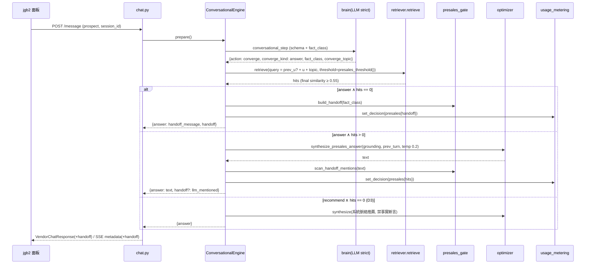

# 技術設計：presales-grounding-gate

> 建立時間：2026-09-04
> 需求文件：requirements.md（v2）　研究記錄：research.md　落差分析：validation_gap.md　版本：1.0
> 發現流程：light（擴充型；整合點於 validation_gap 逐符號對碼，門檻以容器內 12 題實測）

## 概述

### 設計目標
讓 prospect 身分的售前對話在**知識庫無佐證時不再由 LLM 生成事實**：grounding 過相關性門檻（final similarity）、事實題空 grounding 走決定性固定句並附結構化 `handoff`、brain 回封閉 `fact_class`、多輪追問保留上一輪問句。所有改動守在 `CONVERSATIONAL_ENABLED_ROLES={'prospect'}` 與 `request.target_user=='prospect'` 兩道既有守門之內。[需求 1–8]

### 範圍與邊界
- 範圍內：`services/conversational_engine.py`（grounding、決策、handoff 分支）、`services/llm_answer_optimizer.py`（schema、解析、合成 prompt 帶上一輪）、`routers/chat.py`（回應契約、SSE、無 session 路徑）、`services/conversational_config.py`／`conversational_rules.py`（規則文字、handoff 文案設定鍵）、新模組 `services/presales_gate.py`（門檻讀值、enum、handoff 建構、封閉三詞掃描）、`usage_events.decision_snapshot` 落點、兩份 API 文件。
- 範圍外：知識條目、起手式策略、jgb2 前端、一般 b2b／b2c 檢索路徑、DB 3645／3798 的實際寫入（提供 SQL，業主執行）。

## 架構設計

### Architecture Pattern & Boundary Map

模式：**既有分層不變（Router → Engine → Optimizer → Retriever）**，新增一個純函式模組 `presales_gate` 承載門檻讀值、enum 正規化、handoff 建構與封閉三詞掃描；Engine 與 Router 只呼叫它，不各自實作。

```mermaid
graph TD
    LB[jgb2 面板<br/>PresalesChat.vue] -->|POST /api2/assistant/chat 原樣透傳| R[routers/chat.py]
    R -->|prospect＋session_id| CE[handle_conversational_entry<br/>→ _conversational_respond]
    R -->|prospect 無 session_id 零命中| NK[_handle_no_knowledge_found<br/>prospect 分支]
    CE --> E[ConversationalEngine.prepare/handle/stream_answer]
    E --> B[brain conversational_step_result<br/>+ fact_class]
    E --> G[_converge_grounding<br/>retriever.retrieve(threshold)]
    G --> RT[VendorKnowledgeRetrieverV2.retrieve<br/>final similarity ≥ 門檻]
    E -->|answer ∧ 空 grounding| PG[presales_gate<br/>threshold / FactClass / build_handoff / scan]
    E -->|有 grounding| O[LLMAnswerOptimizer._build_presales_synth<br/>+ prev_turn, temp ≤0.2]
    NK --> PG
    PG --> M[usage_metering.set_decision<br/>decision_snapshot.presales]
    E --> RESP[VendorChatResponse<br/>+ handoff]
    NK --> RESP
    style PG fill:#fde68a
```

紅線：`_top1_relevance_gate`、`vendor_knowledge_retriever_v2` 的過濾 SQL、`_build_knowledge_response` 對非 prospect 的行為**不動**。[需求 6.1]

### Technology Stack & Alignment

| 層級 | 技術 | 說明 |
|------|------|------|
| 後端 | Python 3.11／FastAPI／Pydantic | 沿用；新欄位以 Pydantic 子模型定型 |
| 檢索 | `BaseRetriever.retrieve()`（pgvector＋reranker） | 與 `_make_kb_search` 同款呼叫；門檻比 final `similarity` |
| LLM | gpt-4o-mini（`OPENAI_MODEL`），strict JSON schema | brain 加 enum 欄位；合成 temp 由 `LLM_ANSWER_SYNTH_TEMP` 守 0.2 |
| 設定 | env＋`DecisionConfig`＋`ConversationalConfig`（DB metadata 供給、code 保底） | 門檻與文案皆可覆寫 |
| 計量 | `usage_metering.set_decision` → `decision_snapshot` JSONB | 零 migration |

## Components & Interface Contracts

### 核心元件

#### 元件 1：`services/presales_gate.py`（PresalesGate，新，純函式）
**責任**：售前閘門的決定性部分——門檻讀值（唯一讀值點）、`fact_class` 正規化、handoff 建構、封閉三詞掃描。⛔ 無 I/O、無 LLM。

```python
class FactClass(str, Enum):
    customer_reference = "customer_reference"; pricing = "pricing"; contract_sla = "contract_sla"
    compliance = "compliance"; security = "security"; feature = "feature"; other = "other"

SENSITIVE: Final[frozenset[FactClass]] = frozenset({customer_reference, pricing, contract_sla, compliance, security})
HANDOFF_WORDS: Final[tuple[str, ...]] = ("專人", "真人", "客服")          # 封閉集合，⛔ 不擴充成開放語義判斷

def presales_threshold() -> float:
    """env PRESALES_GROUNDING_THRESHOLD（[0,1]）> DecisionConfig.load().kb_threshold；壞值回後者並 print 警告。唯一讀值點。"""

def parse_fact_class(value: object) -> FactClass:
    """非 str／不在 enum → FactClass.other；⛔ 不做大小寫或同義正規化。"""

class HandoffReason(str, Enum):
    no_grounding = "no_grounding"; sensitive_no_grounding = "sensitive_no_grounding"; llm_mentioned_handoff = "llm_mentioned_handoff"

@dataclass(frozen=True)
class Handoff:
    reason: HandoffReason; fact_class: FactClass; channel: str; message: str

def build_handoff(fact_class: FactClass, *, channel: str, message: str) -> Handoff:
    """reason 由 fact_class ∈ SENSITIVE 決定（sensitive_no_grounding／no_grounding）。"""

def scan_handoff_mentions(text: str) -> bool:
    """任一 HANDOFF_WORDS 出現 → True（供 LLM 路徑補 handoff{reason=llm_mentioned_handoff}）。"""
```
**與需求對應**：[需求 1.2, 1.3, 2.2, 3.2, 4.1, 4.2]

#### 元件 2：`ConversationalEngine._converge_grounding`（改）
**責任**：售前收斂作答的 grounding 選材；vector 路改走 `retrieve()`＋門檻；回傳結構化結果而非占位字串。

```python
@dataclass(frozen=True)
class ConvergeGrounding:
    text: str                 # 過門檻的 answer 串接；空 grounding 時為 ""（⛔ 不再塞占位字串）
    ctx: Optional[list[dict]] # 推薦型情境；answer 型 None（不變）
    cta_mode: Literal["force", "suppress"]
    empty: bool               # text == ""（answer 型與 recommend 型皆計）
    hits: int                 # 過門檻筆數
    threshold: float          # 本輪使用的門檻（記錄用）
    score_source: Optional[str]  # top-1 的 score_source（rerank/keyword/vector），供漂移偵測

async def _converge_grounding(self, state, converge_topic, user_message, config, converge_kind,
                              prev_user_message: Optional[str] = None) -> ConvergeGrounding: ...
```
規則：`select=vector` 時呼叫 `self.retriever.retrieve(query=..., vendor_id=scope.vendor_id or 0, top_k=3, similarity_threshold=presales_threshold(), target_user=scope_target_user, mode=scope.mode or 'b2b')`；`answer` 型且 `prev_user_message` 非空 ⇒ query＝`prev_user_message + user_message`＋`converge_topic`；`ids`／`category` 兩路不變。`recommend` 型 `empty=True` 時由呼叫端決定是否以系統脈絡推薦（D3），本函式不塞文字。[需求 1.1, 1.4, 5.1]

#### 元件 3：`ConversationalEngine.prepare/handle/stream_answer`（改）
**責任**：把 brain 的 `fact_class` 與 grounding 結果併進 decision；answer 型空 grounding 走 handoff 分支，⛔ 不進 optimizer。

```python
# prepare() 的 converge decision 新增鍵
{"kind": "converge", ..., "fact_class": FactClass, "grounding_empty": bool, "grounding_hits": int,
 "prev_turn": Optional[dict],          # state["dialog"][-1]（{"u","a"}），同 converge_topic 才帶
 "handoff": Optional[Handoff]}         # answer ∧ empty 時預先建好

# handle() 回傳擴充
{"answer": str, "conversational": True, "converged": bool, "handoff": Optional[dict]}
```
規則：
- `answer ∧ grounding_empty` ⇒ `answer = config.handoff_message`（元件 6），`handoff = build_handoff(fact_class, channel=config.handoff_channel, message=...)`，`_finalize_converge` 照常 `_note_turn`；`stream_answer` 比照 `ask` 分支整句一次 yield。[需求 2.1, 2.2, 2.6, 4.4]
- `answer ∧ hits>0` ⇒ 現行合成，`cta_mode=suppress`（temp 0.2）；傳 `prev_turn` 給元件 5。[需求 2.3, 5.2]
- `recommend ∧ grounding_empty` ⇒ D3 預設：`grounding` 以系統脈絡推薦、`system_md` 追加「⛔ 不得含客戶名單、價格數字、合約條款、法遵、資安的事實斷言」的提示（由 `PRESALES_ANSWER_RULES` 新增段落供給，程式只選擇是否附加）。[需求 2.4]
- 「岔題不被拖走」：`prev_turn` 只在 `converge_topic == state.get("last_converge_topic")` 時帶入；`_finalize_converge` 更新 `state["last_converge_topic"]`。[需求 5.4]
- LLM 路徑合成完成後 `scan_handoff_mentions(answer)` 為真 ⇒ 補 `Handoff(reason=llm_mentioned_handoff, fact_class, ...)`。[需求 4.2]
- 每輪 `set_decision({"presales": {"fact_class", "grounding_hits", "threshold", "score_source", "handoff": reason|None}})`。[需求 7.1, 7.2]

#### 元件 4：`LLMAnswerOptimizer.CONVERSATIONAL_STEP_SCHEMA`／`_parse_conversational_step`（改）
**責任**：brain 輸出新增 `fact_class`（strict enum），解析層正規化。

```python
# schema 片段（strict: True ⇒ 必進 required）
"fact_class": {"type": "string",
               "enum": ["customer_reference","pricing","contract_sla","compliance","security","feature","other"],
               "description": "本輪問題的事實類別；非事實題回 other"}
# 解析
payload["fact_class"] = parse_fact_class(data.get("fact_class"))   # BRAIN_STRICT_SCHEMA=off 時缺值 → other
```
規則文字（DB 3645／code fallback）新增【fact_class】段：七值定義各一句＋範例。[需求 3.1, 3.2, 3.3, 3.4]

#### 元件 5：`LLMAnswerOptimizer._build_presales_synth`／`synthesize_presales_answer(_stream)`（改）
**責任**：合成 prompt 帶上一輪 Q/A。

```python
def synthesize_presales_answer(self, grounding_knowledge, accumulated_context, system_context_md,
                               user_question, cta_mode="auto", *, prev_turn: Optional[dict] = None) -> Optional[str]: ...
# prompt 新增區塊（prev_turn 非 None 時）：
# 【上一輪】使用者：{u}／你：{a}
# 【本輪追問延續上一輪的動作意圖】追問的主題若在可用知識中無對應，明說「這部分我沒有資料」，⛔ 不得換一組功能回答。
```
`chat.py` 三處既有直呼不帶 `prev_turn`，簽名以關鍵字預設值相容。[需求 5.2, 5.3]

#### 元件 6：`ConversationalConfig`（改）與規則文字四處
**責任**：handoff 文案與 channel 資料化；「導專人」話術對齊入口。

```python
@dataclass
class ConversationalConfig:
    ...
    handoff_message: Optional[str] = None   # DB metadata 供給；缺則 PRESALES_HANDOFF_MESSAGE（code 保底）
    handoff_channel: Optional[str] = None   # 缺則 PRESALES_HANDOFF_CHANNEL="line_official"（D1）

PRESALES_HANDOFF_MESSAGE: Final = "這題我這邊沒有可靠資料，幫您轉專人——點下方的『找真人』。"
```
規則文字改動：`PRESALES_ANSWER_RULES`「系統脈絡與知識都沒有的『細節』才導 demo/專人」→「…才說『這題我幫您轉專人，點下方的找真人』」；`PRESALES_CTA_RULES`「由專人帶您看」句改為同一入口；`CONVERSATIONAL_RULES_BY_ROLE['prospect']`【合規】與 (b) 段同步；DB 3645／3798 由業主套 SQL（本 spec 附文字）。⛔ 保留「轉專人」「不報價」「不杜撰」字樣（既有測試釘字）。[需求 4.3]

#### 元件 7：`routers/chat.py`（改）
**責任**：回應契約、SSE、無 session 路徑。

```python
class HandoffSignal(BaseModel):
    reason: Literal["no_grounding", "sensitive_no_grounding", "llm_mentioned_handoff"]
    fact_class: Literal["customer_reference","pricing","contract_sla","compliance","security","feature","other"]
    channel: str
    message: str

class VendorChatResponse(BaseModel):
    ...
    handoff: Optional[HandoffSignal] = Field(None, description="無知識佐證／需轉真人時的結構化訊號；None＝不需轉人")
```
- `_conversational_to_response`：`handoff=result.get("handoff")`。
- `_conversational_sse`：`_metadata["handoff"] = decision["handoff"]`（與 `quick_replies` 同位置）；串流完成後對累積文字 `scan_handoff_mentions` 補 `llm_mentioned_handoff`。
- `_handle_no_knowledge_found` prospect 分支：刪 `md_only_grounding` 合成，改 `fallback_answer = config.handoff_message`、`response.handoff = build_handoff(FactClass.other, ...)`（此路徑無 brain ⇒ `fact_class=other`）；`_meter_path('no_knowledge_found')` 保留，另 `set_decision({"presales": {...}})`。[需求 2.5, 4.1, 4.4, 7.1]

### 資料模型

```python
# usage_events.decision_snapshot["presales"]（JSONB 子鍵，淺層合併不與決策層鍵衝突）
{"fact_class": "customer_reference", "grounding_hits": 0, "threshold": 0.55,
 "score_source": None, "handoff": "sensitive_no_grounding", "path": "brain" | "no_session"}
```

### API 設計

```
POST /api/v1/message   （既有；prospect 形狀不變：message／mode=b2b／target_user=prospect／session_id）

Response（新增欄位，其餘不變）:
{ "answer": "這題我這邊沒有可靠資料，幫您轉專人——點下方的『找真人』。",
  "intent_type": "conversational", "confidence": 1.0,
  "handoff": {"reason": "sensitive_no_grounding", "fact_class": "customer_reference",
              "channel": "line_official", "message": "…同 answer…"} }

SSE: metadata 事件多 "handoff" 鍵（同形狀）；無 handoff 時鍵不出現。
```

## 資料流程

### 主要流程圖



### 資料轉換
brain JSON → `parse_fact_class` → `FactClass`；`retrieve()` 列表 → `ConvergeGrounding(text, hits, threshold, score_source)`；`Handoff` dataclass → `HandoffSignal` Pydantic → JSON／SSE metadata；同一輪一次 `set_decision`。

## 技術決策

### 決策 1：門檻在 `retrieve()` 層過濾 final similarity（D2）
**問題**：`_vector_search` 不過濾。**選項**：A `retrieve()`；B 自比 vector 分。**決定**：A，門檻＝`PRESALES_GROUNDING_THRESHOLD` 覆寫 > `DecisionConfig.kb_threshold`（0.55）。**理由**：research 主題 1——12 題實測 0.55／0.6／0.65 結果相同，取最低者；B 會發明第二套門檻語義。**參考**：`tech.md`「閾值對應欄位」。

### 決策 2：handoff 分支落在 Engine（`handle`／`stream_answer`）而非 Router 前置
**問題**：閘門放哪。**選項**：Engine 內／Router 前置檢索／只改 prompt。**決定**：Engine 內。**理由**：前置檢索會誤殺推薦型對話（identity／scale 收集不需要知識）；只改 prompt 是現況（P0-1 五次實測仍生成）。**參考**：validation_gap §三。

### 決策 3：計量落 `decision_snapshot["presales"]`
**理由**：零 migration、命名空間獨立；`escape_kind` 原意在封存 spec（D-003）；`decision_case` 語義混用。**參考**：research 選型 2。

### 決策 4：文案與 channel 走 `ConversationalConfig` 資料化＋code 保底（D1）
**理由**：與 `answer_rules／cta_rules` 外移慣例一致；jgb2 切片 2 的 channel 值未定，改文案不必 rebuild。

### 決策 5：LLM 路徑的 handoff 用封閉三詞後置掃描
**理由**：三個詞是封閉集合，只加訊號不改文字；LLM 自發提「專人」無法在生成前預測。⛔ 不擴充為語義判斷。

### 決策 7：事實題抽取式作答（D6，業主 2026-09-04）
**問題**：e2e 兩輪皆抓到 LLM 對部分相關 grounding 加料（知識只提物件／租客匯入，答成四項全可匯）。**選項**：加強 prompt（已做，降低不消滅）／抽取式（不經 LLM）／接受殘留。**決定**：抽取式——`fact_class≠other ∧ hits>0` ⇒ `_extractive_decision` 回 top-1 知識原文；多項目問句（`presales_gate.MULTI_ITEM_SEPARATORS`）接 `PRESALES_PARTIAL_TAIL`＋`handoff(partial_grounding)`。converge 與 inline 兩條路都走。**代價**：事實題失去潤飾與個人化（售前池文案本為客戶面）。

### 決策 8：售前門檻 env 0.5（D2，業主 2026-09-04）
`PRESALES_GROUNDING_THRESHOLD: 0.5` 寫進 `docker-compose.prod.yml`；程式預設不動。與 D6 同時上：放寬只讓更多題進抽取式，不再進 LLM。

### 決策 9：ask 反問句的結構閘門（R2.11，e2e 第三輪）
**問題**：brain 三條出口（converge／inline／next_question）前兩條有閘門後，假事實改從第三條漏：`ask` 不填 `inline_answer`，把「我們支援…合約和歷史帳單」放在反問句前面。**選項**：規則文字再加禁令（已有，無效）／用 LLM 判反問句有沒有斷言（開放語義，違反「規則只能治封閉集合」的另一面——多一層 LLM 再多一個漏點）／結構判定。**決定**：結構判定——使用者句含封閉問句標記 ∧ 反問句陳述部分 ≥ 8 字 ⇒ 該回合改走 grounding 閘門（抽取或固定句）。誤判方向刻意往「多查一次知識」與「多一次固定句」錯，不往「放行斷言」錯。子句層（斷言與反問同一句、逗號分隔）同樣判定；沒知識時子句層只剝掉子句不升格固定句，轉人詞子句例外。純反問與非問句回合零影響（單元測試釘住）。

### 決策 6：推薦型空 grounding 維持系統脈絡推薦（D3 預設）
**理由**：功能索引（DB 3798 §7）就是為推薦而存在；只在 prompt 加禁事實斷言。業主可改選 handoff。

## 非功能性設計

### 效能考量
無佐證路徑省一次 LLM 合成；有 grounding 路徑多 `retrieve()` 的 keyword／reranker 段（brain 的 `kb_search` 工具已承受同等成本）。`score_source` 進快照以偵測 reranker 靜默停用造成的門檻語義漂移。

### 安全性設計
- `handoff.message` 固定文案，不回顯使用者輸入。
- 無佐證路徑不把原句送 LLM。
- 日誌僅 `fact_class／hits／threshold／reason`。

### 可擴展性
`FactClass` 為封閉 enum；新增類別＝改 enum＋規則文字＋測試，⛔ 不改判斷邏輯。`handoff.channel` 資料化，換入口不改程式。

### 錯誤處理
| 情境 | 處理 |
|------|------|
| 門檻 env 壞值 | 回 `DecisionConfig.kb_threshold`，print 警告，⛔ 不 500 |
| brain 失敗／逾時 | 既有降級（`prepare` 回 None → 一般檢索）；`fact_class=other` |
| `retrieve()` 例外 | 視為空 grounding（fail-closed）；answer 型 ⇒ handoff；記 `presales.error` |
| optimizer 合成回空 | 既有 `return None` 降級不變 |
| DB 規則文字未更新 | code 保底文案生效；行為一致但文案舊 |

## 測試策略

### 單元測試（`tests/unit/conversational/`，marker `unit`，貼 `@pytest.mark.req("presales-grounding-gate:N.M")`）
- `test_presales_gate_req.py`：門檻讀值（好／壞／缺／越界）、`parse_fact_class`（enum／變體／None）、`build_handoff` reason 對映、`scan_handoff_mentions` 三詞正反例。[1.2, 1.3, 3.2, 4.1, 4.2]
- `test_presales_grounding_gate_req.py`：mock `retriever.retrieve` 回空／回 hits；answer 型空 ⇒ handoff 且 optimizer **未被呼叫**（assert_not_called）；recommend 型空 ⇒ optimizer 被呼叫且 prompt 含禁斷言段；prev_turn 併入 query 與 prompt；`converge_topic` 變更 ⇒ 不併。[1.1, 1.4, 2.1–2.4, 2.6, 5.1–5.4]
- 既有 `test_presales_grounding_req.py::test_grounding_default_vector_path` 改斷言 `retriever.retrieve.assert_awaited()`。
- `test_brain_strict_schema_req.py` 更新 required 集合；新增 `fact_class` 缺值→`other`。[3.1, 3.4]
- `tests/unit/chat_flow/`：`VendorChatResponse.handoff` 形狀；`_conversational_to_response` 透傳；`_handle_no_knowledge_found` prospect 分支不呼叫 optimizer。[2.5, 4.1, 4.4]
- `tests/unit/usage/`：`set_decision` 的 `presales` 子鍵落入 snapshot。[7.1, 7.2]
- **突變控制**：門檻改 0.0／移除 handoff／移除 prev_turn 各至少一條轉紅。[8.2]

### 整合測試（`integration`，`RUN_INTEGRATION=1`）
`usage_events` 真 DB 一列含 `decision_snapshot->'presales'`。

### 端對端（`e2e`，`RUN_E2E=1`；本機 :8100 rebuild 後）
盤查 P0-1 原句 5 次逐字相同＋handoff；P0-3 固定句；P1-3 兩輪無「合約可匯入」；b2b 10 題 A/B 逐字相同（`run_batch.py`＋`compare_runs.py`）。[6.2, 8.3]

## 部署考量

### 環境需求
| 變數 | 預設 | 說明 |
|------|------|------|
| `PRESALES_GROUNDING_THRESHOLD` | **prod compose 設 0.5**；未設＝`KB_SIMILARITY_THRESHOLD`（prod 0.65／程式 0.55） | [0,1]；壞值回預設（D2） |
| `PRESALES_HANDOFF_CHANNEL` | `line_official` | D1；DB metadata 可覆寫 |
| `BRAIN_STRICT_SCHEMA` | on（既有） | off 時 `fact_class` 可能缺 → other |

### 部署步驟
`docker compose -f docker-compose.prod.yml build rag-orchestrator && up -d rag-orchestrator`；DB 3645／3798 文案 SQL 由業主執行後 `reset_cache()` 或重啟。⚠️ 與 jgb2 切片 2 上線對齊：chatai 先上不會壞（欄位可選），但固定句會指向尚不存在的按鈕——上線時間由業主排。

### 監控與告警
`decision_snapshot->'presales'->>'handoff'` 佔比、`fact_class` 分布、`score_source` 非 rerank 的比例（reranker 漂移）。

## 風險與挑戰

| 風險 | 影響 | 機率 | 緩解策略 |
|------|------|------|---------|
| strict enum 讓 brain 失敗率升 ⇒ 整輪降級 | 高 | 中 | 20 題量降級率（Q1）；失敗歸 other 不阻斷 |
| reranker 靜默停用 ⇒ 門檻語義漂移 | 中 | 中 | 快照記 `score_source`；稽核對照 |
| 語義錯配仍過門檻（3596 對「對帳單格式」0.759） | 中 | 中 | 已知限制；知識層補條目 |
| 「舊系統匯入」變 handoff 與盤查期待相反 | 中 | 高 | DSP-008 裁後補知識；未裁前為正確行為 |
| 規則文字釘字測試 | 低 | 高 | 保留既有字樣 |

## 參考文件
- [需求文件](requirements.md)（v2）、[研究記錄](research.md)、[落差分析](validation_gap.md)
- `docs/presales-assistant-rootcause-20260904.md`、`docs/presales-assistant-quality-audit-20260902.md`
- steering：`tech.md`、`dialogue.md`、`testing-code.md`

## 附錄

### 名詞解釋
- **grounding**：合成時餵給 LLM 的知識 answer 集合；空＝過門檻零筆。
- **fact_class**：brain 對本輪問題的封閉分類，程式據此決定出口與計量。
- **handoff**：結構化轉人訊號；前端據此畫入口按鈕。

### 變更歷史
| 日期 | 版本 | 變更內容 | 修改者 |
|------|------|---------|--------|
| 2026-09-04 | 1.0 | 初始版本（依 requirements v2、research 12 題實測） | AI |

---

*本文件遵循專案規範中的設計原則，所有介面定義採用強型別。*
