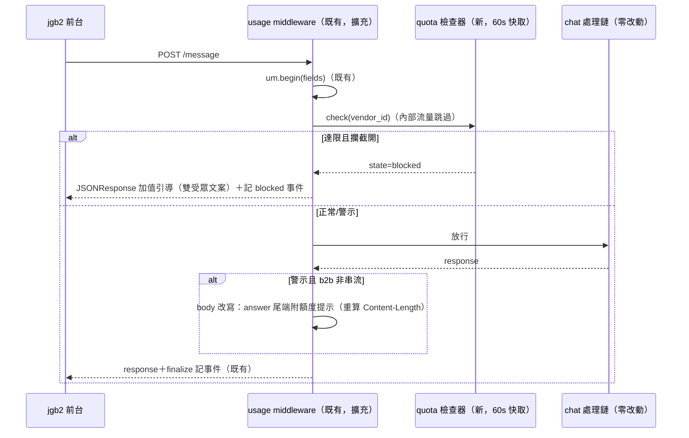

# 技術設計：quota-management

> 建立時間：2026-07-06　需求：requirements.md（R1–R5）　研究：research.md（4 裁決＋2 實查約束）

## 概述

### 設計目標
每團隊月訊息額度：後台設定 → 請求時快取化檢查 → 警示（b2b 回答尾端附提示＋後台進度條）→ 達限攔截（middleware 短路、零 LLM 成本、雙受眾文案）→ 加值即時恢復。chat.py 零侵入。

### 範圍與邊界
範圍＝設定表＋檢查器＋middleware 警示/攔截＋後台額度卡＋稽核條目。範圍外＝金流、外部通知、非訊息數額度、jgb2 改動。

## 架構設計

### Architecture Pattern & Boundary Map

全部動作收在既有 `usage_metering_middleware` 的進出場（單 choke point，沿 usage-metering 已驗證模式）：



### Technology Stack & Alignment

| 層 | 技術 | 對齊 |
|---|---|---|
| 設定表 | `vendor_quotas`（冪等 migration） | migrations 慣例 |
| 檢查器 | `services/usage_metering.py` 內擴充（quota 區段）——同 contextvar 生命週期、同 fail-open 哲學 | 不另立檔：與計量共享 pool/日界/內部判定 |
| 攔截/警示 | middleware 擴充（app.py） | usage-metering 同 choke point |
| 後台 | admin app.py CRUD 端點＋UsageStatsView 額度卡 | 既有認證/版面 |

## Components & Interface Contracts

### 元件 1：`vendor_quotas` 表（migration `add_vendor_quotas.sql`）

```sql
CREATE TABLE IF NOT EXISTS vendor_quotas (
    vendor_id          INTEGER PRIMARY KEY,
    monthly_message_quota INTEGER NOT NULL CHECK (monthly_message_quota > 0),
    warn_threshold_pct SMALLINT NOT NULL DEFAULT 80 CHECK (warn_threshold_pct BETWEEN 1 AND 99),
    block_on_exceed    BOOLEAN NOT NULL DEFAULT TRUE,   -- 關=寬限模式（只警示不攔）
    is_active          BOOLEAN NOT NULL DEFAULT TRUE,
    updated_at         TIMESTAMPTZ NOT NULL DEFAULT now(),
    updated_by         VARCHAR(50)
);
```
對應：R1.1、R1.2（無列/停用＝不管制）、R4.4（block_on_exceed=false 寬限）。
加值＝UPDATE monthly_message_quota（R1.4 下次檢查生效；60s 快取內誤差受 R2.4 涵蓋——**加值方向設計為清快取立即生效**，見元件 2）。

### 元件 2：quota 檢查器（`services/usage_metering.py` 擴充）

```python
@dataclass
class QuotaState:
    state: str            # 'none'|'ok'|'warn'|'blocked'（none=未設額度）
    used: int = 0
    quota: int = 0
    pct: int = 0

def quota_check(db_pool, vendor_id: Optional[int], is_internal: bool) -> QuotaState
    # 內部流量/無 vendor/計量關閉 → 'none'（R2.2/R2.5）
    # 快取：{vendor_id: (QuotaState, fetched_monotonic)}，TTL 60s
    # 本月 count：date_tpe >= 月初(Asia/Taipei) AND is_internal=FALSE AND status<>'blocked'
    # 例外 → 'none'＋log（fail-open，R5.2）
def quota_cache_clear(vendor_id: Optional[int] = None) -> None
    # 後台調整額度時由 admin 端點透過…（跨行程：admin 與 rag 分屬容器）
```
**跨行程快取失效**：admin 調額度無法直接清 rag 行程快取——TTL 60 秒即自然收斂；「加值下一次請求即恢復」（R4.5）的口徑釋義為 **≤60 秒內恢復**，需求層面以「不需重啟即生效」為準（R1.4 滿足）。攔截狀態的請求**每次直查不走快取**（blocked 是稀有路徑，直查消除恢復延遲——加值後第一句即恢復，R4.5 嚴格滿足）。

同步 API（middleware 為 async——檢查器提供 async 版 `await quota_check(...)`，型別同）。

### 元件 3：middleware 擴充（app.py）

進場（`um.begin` 之後）：
```python
qs = await quota_check(pool, fields.get('vendor_id'), ctx.is_internal)
if qs.state == 'blocked':
    um.set_path('quota_blocked'); um.finalize('blocked', 429, db_pool=pool)   # 記事件（R4.6）
    return JSONResponse(status_code=200, content=_blocked_body(ctx.user_type, qs))
request.state.quota = qs      # 供出場警示
```
- 攔截回應 body（research §1 形狀）：`answer`＝依 user_type 分文案（property_manager→加值引導含數字；其餘→中性暫停文案，R4.2/R4.3）、`mode`/`session_id`/`timestamp`/`source_count=0`/`action_type='quota_blocked'`。HTTP 200（前台不視為錯誤，正常渲染 answer）。
- 事件：status='blocked'、llm_calls=0；count 排除 blocked → 不計入額度（R4.6）。

出場（非串流且 `qs.state=='warn'` 且 user_type=='property_manager'）：
```python
body = json.loads(response_body)
body['answer'] += f"\n\n──\n📊 本月 AI 客服額度已使用 {qs.pct}%（{qs.used:,}/{qs.quota:,}）"
# 重建 Response（Content-Length 重算——research 風險 2）
```
對應：R3.1/R3.2（分流沿 user_type，與計量同源）/R3.3（append-only）。串流不附（documented，生產非串流）。

### 元件 4：admin 額度 CRUD＋進度資料（app.py）

```
GET  /api/usage/quotas                → [{vendor_id, vendor_name?, monthly_message_quota,
                                          warn_threshold_pct, block_on_exceed, is_active,
                                          used_this_month, pct, state}]   # 進度條資料一次帶回
PUT  /api/usage/quotas/{vendor_id}    → upsert（欄位驗證 400；updated_by=登入者）
DELETE /api/usage/quotas/{vendor_id}  → 停用（is_active=false，不刪列保歷史）
```
`Depends(get_current_user)`；對應 R1.1/R1.3/R1.4。

### 元件 5：UsageStatsView 額度管理卡

- 「額度管理」table-card（沿頁面慣例）：每 vendor 一列——進度條（ok 綠/warn 黃/blocked 紅，R3.4）、已用/額度、閾值、攔截開關、編輯（inline 或 modal）。
- 未設額度 vendor 顯示「未管制＋設定」入口。

### 元件 6：稽核（`check_invariants.sh` 不變量 6）

- FAIL：`status='blocked'` 事件存在但該 vendor 無 `is_active` 額度設定（幽靈攔截）。
- WARN：本月用量超過額度 120% 且 block_on_exceed=false（寬限模式燒錢雷達）。
對應 R5.5。

## 錯誤處理

| 情境 | 行為 | 需求 |
|---|---|---|
| quota 查詢例外/DB 不可達 | state='none' 放行＋log | R5.2 |
| 快取邊界（60s 內多放行） | 允許（寬鬆不誤殺） | R2.4 |
| body 改寫失敗 | 原回應原樣送出＋log（警示丟失優於回應損毀） | R3.3 |
| 內部流量 | 不計數、不攔截、不提示 | R2.2 |
| 計量開關關 | 檢查器直回 'none' | R2.5 |

## 測試策略（TDD）

| 層 | 案例 |
|---|---|
| unit | 狀態機矩陣（無設定/停用/ok/warn 邊界/blocked 邊界/寬限模式）；文案分流（pm vs tenant/prospect/unknown）；count 排除 blocked 與 internal；fail-open；快取 TTL 行為；body 改寫（含 Content-Length 斷言、非 JSON 防呆） |
| integration（活體） | 設低額度真打：warn 附提示（b2b）→ blocked 攔截（雙文案）→ 調高額度恢復；租客形狀不見商業字眼；內部流量不受限；blocked 事件落庫 status='blocked' |
| 回歸 | 未設額度 vendor 全行為不變（既有 unit/integration 全綠） |

## 部署（併 runbook）

migration `add_vendor_quotas.sql` → 版更（app.py/usage_metering.py/admin app.py＋前端 build）→ 驗證：設測試額度→真打三段（ok/warn/blocked）→ 稽核全綠。

## 需求覆蓋對照

| 需求 | 元件 |
|---|---|
| R1.1–1.5 | 1/4/5（月界滾動窗口免排程） |
| R2.1–2.5 | 2 |
| R3.1–3.4 | 3（出場改寫）/5（進度條） |
| R4.1–4.6 | 3（進場短路）/1（寬限開關）/2（blocked 直查） |
| R5.1–5.5 | 2（fail-open）/6（稽核）＋測試策略 |
