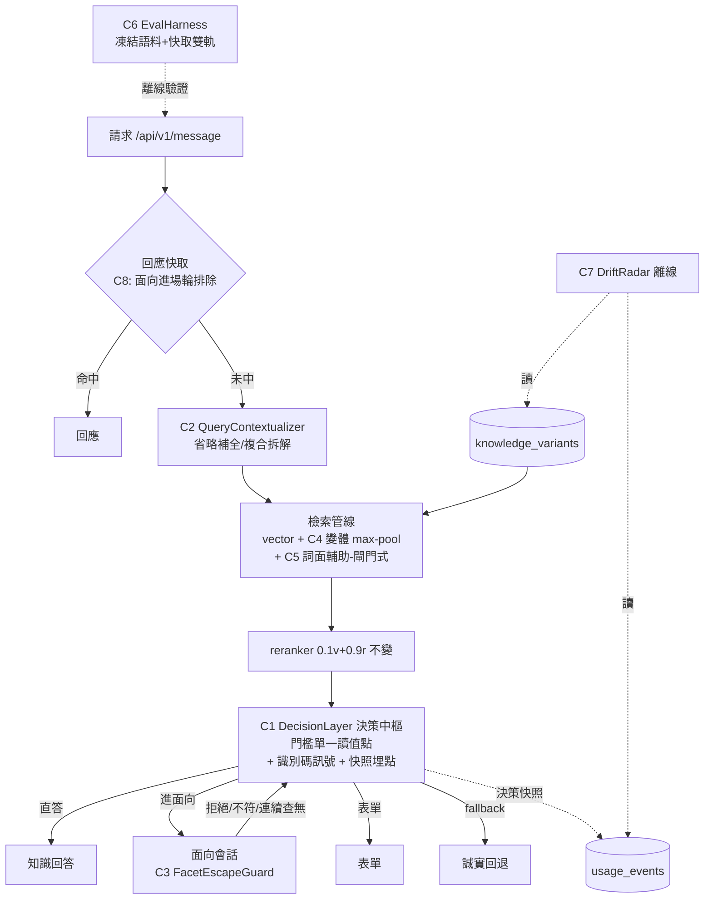
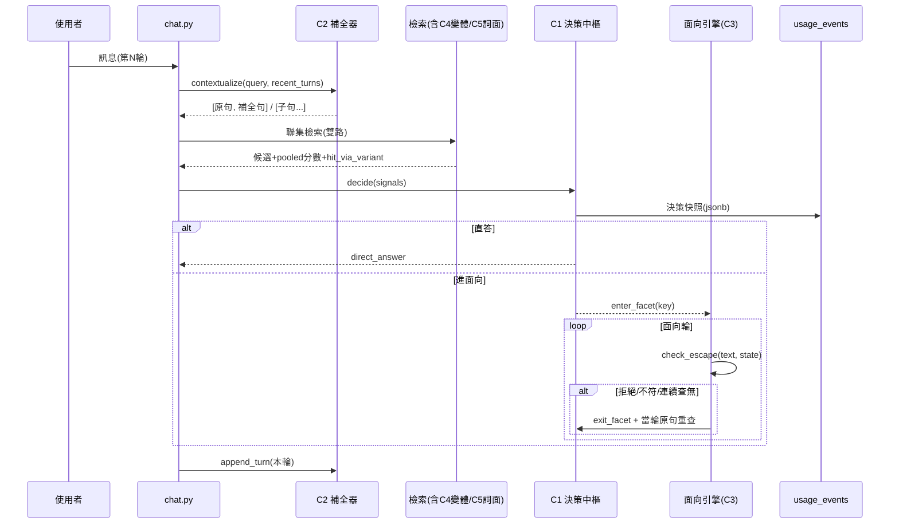

# 技術設計：retrieval-decision-layer（對話與檢索決策層韌性）

> 建立時間：2026-08-10T13:45:00Z
> 需求文件：requirements.md（2026-08-10 核准，含 R7.1 證據修訂）
> 證據底座：gap-analysis.md（現碼查證）＋research.md（六支藥效實驗＋反證覆核）

## ⚠ 元件狀態表（2026-08-19）

下列元件契約經反證盤查發現缺陷，**修訂前不得作為實作或驗收依據**。
證據與裁決見 `decisions/DECISIONS.md`。

| 元件 | 問題 | 決策 | 狀態 |
|---|---|---|---|
| **C1 RoutingSignals** | 無 `calibrated_confidence` 欄位，R7.1 的「校準信心」只剩由絕對分數算出的 `gray_zone: bool` | **D-01** | 🔴 待業主裁決 |
| **C1 ↔ C6 詞彙衝突** | C1 的 `verdict` 為六值路由去向，C6 的 `routing_class` 為五值且**從答案文字反推**——同一份設計兩套詞彙 | **D-04** | 🟡 待套用 |
| **C1 ↔ C3 詞彙衝突** | C3 的 `EscapeVerdict.action` 四值與 C1 verdict 無映射 → `degrade_knowledge/honest`（R4.2/4.3 主要療效）在路由尺上不可見 | **D-07** | 🟡 待套用 |
| **C1 RoutingSignals 輸入不足** | 缺 `user_text`／`topic_terms`／`EscapeState`，但 C3 的再進場抑制判準需要它們——**用宣告的輸入算不出宣告的行為**；`SessionFeatures` 全 spec 無定義；欄位名 `escape_count`/`escape_events`、`question_type`/`query_type` 不一致 | **D-08** | 🟡 待套用 |
| **C1 快照欄位** | 缺 `query_text`（或雜湊），C7 的查詢聚類（R10.1）無從計算 | **D-08** | 🟡 待套用 |
| **C1 灰帶** | 灰帶種子 0.55–0.75 未標分數尺；設計自己量到 final 中位 0.50–0.53 落在下界外 → 對語料主體恆 False | **D-09** | 🟡 待套用 |
| **C4 K_MAX=5** | 標「EXP-4 定」但 EXP-4 未量過 k=5，且採用的是實驗自陳的**上界值**去訂不可逆 DB 硬約束 | **D-12** | 🟡 待套用 |
| **C5 閘門 ↔ R5.3** | 「永不觸碰強向量命中」與 R5.3「雙證據一致時融合分數高於單通道」互斥 | **D-10** | 🟡 待套用 |
| **C6 EvalHarness** | 見 C1↔C6；另 FORM 在全語料 1291 輪成立 0 次，「⇄表單」那一支實質量不到 | **D-04** | 🟡 待套用 |
| **C8 統一出口** | 原則已為 `append_turn` 定案（審查修訂 3），**未推廣至決策快照** → 快照覆蓋 54.8%、面向續輪 0% | **D-19** | 🟢 補做 |

**未列於上表者視為有效。**

## 概述

### 設計目標

把「檢索評分 → 路由去向」重造為**一個可盤點、可校準、可觀測的決策層**，同時建立變體表與查詢補全兩個承接機制。設計完全由實驗證據定向：

1. **主病灶在決策層**（EXP-1/2 交叉印證：3/4 MISS 的正解本在向量 top-3，被路由蓋掉）→ 決策集中化是主軸。
2. **margin 訊號已證偽**（EXP-1/1b，反證覆核 C2：無差異證據）→ 校準訊號改押絕對分數灰帶＋會話狀態＋識別碼訊號。
3. **全語料泡在門檻灰帶**（final top1 中位 0.50–0.53 vs 門檻 0.55–0.6）→ E-5 主嫌為上游 LLM 波動，決策層必須記錄可歸因快照。
4. **變體有效但偏誤巨大**（EXP-3 P2：3→1；EXP-4：Δ(8)=+0.14 換 seed 穩定）→ 變體表附硬上限＋計分補償。
5. **補全有效**（EXP-5：rank 10→2）、**MISS 需分型**（EXP-3 P1：複合句變體救不動）→ 補全器與變體表分工明確。

### 範圍與邊界

- **涵蓋**：決策中樞模組、查詢補全器、面向逃生門、變體表（含遷移）、詞面輔助通道（降級）、評測基礎設施、偏差雷達、快取修正。
- **不涵蓋**（沿需求「範圍外」）：jgb2 上游、四筆保留知識缺漏（收案驗收題）、embedding 模型、售前/b2c 舊表單體系、LINE bot。
- **結構鐵則**：六 case 答題仲裁**結構不動**（171 條整合測試護欄；gap-analysis G6 選項 A 定案），決策集中化以「搬讀值點、不改判定結構」起步；margin 不再出現在任何設計元素。

## 架構設計

### Architecture Pattern & Boundary Map

模式：**集中決策層（Policy Module）＋管線攔截點注入**——不重寫管線，在三個既有攔截點（檢索前／候選後／面向會話內）掛新元件，全部帶獨立開關可逐項回退（撤案教訓 R-a）。



### Technology Stack & Alignment

| 層級 | 技術 | 對齊說明 |
|------|------|---------|
| 決策/補全/逃生門 | Python 3.11（FastAPI 容器內 services/） | 沿現行 services 分層；type hints 全量 |
| 變體儲存 | PostgreSQL＋pgvector（`knowledge_variants` 新表） | 沿 kb 慣例（vector(1536)、GIN/ivfflat 索引）；獨立表（gap-analysis G5 選 A） |
| 詞面通道 | jieba（容器內既有）＋`question_tsv`（DB 已回填）＋pg_trgm 兜底 | 撿封存分支零件，逐件過藥效門（風險 R-c 裁決規則） |
| 對話歷史 | Redis 滾動清單（cache_service 擴充） | gap-analysis G1 選 A；訊號審計另落 usage_events |
| 可觀測 | usage_events ADD COLUMN IF NOT EXISTS | 沿 20260720 埋點慣例 |
| 開關 | env（每元件一開關）＋決策設定納入 config_version | 沿 ENABLE_QUERY_REWRITE 慣例；R7.6 |

## Components & Interface Contracts

### C1：DecisionLayer（決策中樞）——R7、R8

**責任**：全系統唯一的路由判定與門檻讀值點；產出可歸因決策快照。

**介面定義**：
```python
class RoutingSignals(TypedDict):
    kb_top1_final: float | None        # 檢索後 final 分數
    sop_top1_final: float | None
    kb_top1_vector: float | None
    gray_zone: bool                    # final 落校準灰帶（校準集定界）
    identifier: IdentifierSignal       # 識別碼偵測結果
    session: SessionFeatures           # 輪次、當前面向、zero_row_count、escape_count
    top1_categories: list[str]         # top-1 知識分類（面向進場判定用）

class IdentifierSignal(TypedDict):
    has_id: bool
    id_kind: Literal["contract", "bill", "estate", "user", "none"]
    question_type: Literal["data_query", "knowledge", "ambiguous"]  # 決定性規則判定

class RoutingDecision(TypedDict):
    verdict: Literal["direct_answer", "enter_facet", "form", "fallback", "stay_facet", "exit_facet"]
    # ⚠ D-04/D-07：本枚舉與 C6 的 routing_class（五值）、C3 的 EscapeVerdict.action（四值）
    #    三套詞彙不一致。修訂方向：三者共用單一枚舉，且面向續輪須可細分
    #    （否則 #07 型黏著在此尺上前後皆為 stay_facet＝判為一致，主病灶量不到）
    facet_key: str | None
    snapshot: dict                     # 全部輸入訊號＋門檻值＋規則版本（落 usage_events）

def decide(signals: RoutingSignals, config: DecisionConfig) -> RoutingDecision: ...

class DecisionConfig:                  # 單一讀值點；雜湊納入 config_version（R7.6）
    @classmethod
    def load(cls) -> "DecisionConfig": ...   # env + DB 設定，一處集中
```

**設計決策**：
- **搬移不重構**：`chat.py` 4 處＋`engine.py:428`＋`FORM_TRIGGER_THRESHOLD`（chat.py:976/3091）的散落讀值全部改經 `DecisionConfig`；六 case 判定邏輯原樣搬入 `decide()`。
- **等價驗證方法（審查修訂 1）**：基線本身非決定性（E-5：13%），「A/B 零漂移」不成立。等價判準兩層：①**先埋快照後搬移**——快照隔離出決定性子決策（門檻比對、分類路由、識別碼規則），對這些子決策逐輪驗嚴格等價（同輸入同輸出）；②整體行為採**統計等價**——搬移前後各跑 ≥3 輪凍結語料，路由類別「逐輪多數決」的不一致率不得高於基線重跑變異（run2 vs run3 基準），LLM 生成環節的變異排除在判準外。
- **校準訊號（R7.1 修訂版）**：灰帶偵測（校準集定界，種子＝20260803 D-3 的 0.55–0.75 帶）＋識別碼訊號＋會話狀態；**不含 margin**（已證偽）。
- **面向進場強化（R4.4/4.5）**：`IdentifierSignal.question_type` 由決定性規則（正則＋疑問詞表）判定「查實值 vs 問機制」；帳單號/合約號同表同權重（治不對稱）；knowledge 型帶編號 → 偏向直答（治 #18T2）。
- **快照（R8.3）**：每輪落 `usage_events.decision_snapshot`（jsonb）＋`facet_event`，任何路由不一致可離線歸因。

**與需求對應**：7.1–7.6、4.4、4.5、8.3

### C2：QueryContextualizer（查詢補全器）——R3

**責任**：direct 路徑檢索前的省略補全與複合拆解；含對話歷史層。

**介面定義**：
```python
class TurnRecord(TypedDict):
    role: Literal["user", "assistant"]
    text: str
    topic_terms: list[str]             # 該輪主題詞（離線可重算）

class ContextualizeResult(TypedDict):
    queries: list[str]                 # [原句] 或 [原句, 補全句] 或 [核心子句...]
    kind: Literal["passthrough", "ellipsis_completed", "compound_split"]
    evidence: dict                     # 判定依據（快照用）

def contextualize(query: str, history: list[TurnRecord]) -> ContextualizeResult: ...

# cache_service 擴充（G1 選 A；修掉 save_conversation 幽靈呼叫）
def append_turn(session_id: str, turn: TurnRecord, ttl_sec: int = 7200) -> None: ...
def get_recent_turns(session_id: str, n: int = 6) -> list[TurnRecord]: ...
```

**設計決策**：
- **選擇性補全（EXP-5）**：省略判定（長度＋代詞/無實體詞的決定性規則，LLM 只在規則不確定時介入）通過才補全；補全句與原句**雙路檢索取聯集**（重用 `precomputed_rewrites` 機制，零改 base_retriever 結構）；EXP-5 B 顯示天真串接低害，故判定寬鬆度可從「中」起步。
- **複合拆解（EXP-3 P1）**：偵測多意圖長句（長度＋多疑問結構），抽核心子句分別檢索；裁決規則決定性：子句 final 最高者為主答，其餘列補充。
- **防黏連（R3.3）**：換主題偵測（新句自帶完整主語＋與前文主題詞零重疊 → passthrough），以凍結語料換主題輪迴歸。

**與需求對應**：3.1–3.4

### C3：FacetEscapeGuard（面向逃生門）——R4

**責任**：面向會話內偵測三事件（拒絕／主題不符／連續查無）並執行退出或降級。

**介面定義**：
```python
class EscapeState(TypedDict):          # 掛在既有面向 state（沿 _refine_requested 先例）
    id_ask_count: int                  # 同一識別資訊索取次數
    zero_row_count: int                # 連續查無次數
    escape_events: list[str]
    exited_facets: dict[str, int]      # 審查修訂 2：facet_key → 退出時輪次（再進場抑制）

class EscapeVerdict(TypedDict):
    action: Literal["stay", "exit_requery", "degrade_knowledge", "degrade_honest"]
    reason: str

def check_escape(user_text: str, state: EscapeState, config: DecisionConfig) -> EscapeVerdict: ...
```

**設計決策**：
- **偵測方式**：決定性詞表起步（沿 `_CANCEL_WORDS` 先例擴充拒絕/不符詞表），詞表未中而語意可疑時輕量 LLM 判定（gap-analysis 待決 6 的折衷：詞表管 8 成、LLM 兜底）。
- **上限行為（R4.2）**：`id_ask_count ≥ 2` → 停止索取，改給該主題通則知識（用 top-1 分類反查同分類知識，重用既有 category grounding）；治 RV-3 三輪索取。
- **查無降級（R4.3／E-1）**：`zero_row_count ≥ 2` → 通則知識＋權限圈提示，禁逐字重播（文案模板化多樣）。
- **exit_requery**：退出面向後把當輪原句直接送回 C2→檢索→C1，不要求使用者重打（R4.1）。
- **再進場抑制（審查修訂 2，防旋轉門）**：`decide()` 對 `exited_facets` 內的 facet 施加同 session 抑制——再進場需滿足「使用者主動帶識別碼」或「新輪主題詞相對退出輪已變更」其一，否則改走直答/通則知識；抑制觸發與解除均落決策快照。無此機制時 exit_requery 的 top-1 大概率仍是同面向分類知識，會形成退出→再進場迴圈（E-3 的鏡像 bug）。

**與需求對應**：4.1–4.3、4.6

### C4：KnowledgeVariants（變體表）——R6

**責任**：一知識多問法的儲存、歸戶檢索、偏誤管制與治理。

**資料模型**：
```python
# migration: knowledge_variants
# id SERIAL PK
# knowledge_id INT NOT NULL REFERENCES knowledge_base(id)
# variant_text TEXT NOT NULL
# embedding vector(1536)              -- 一變體一向量
# source_type VARCHAR(20) NOT NULL    -- manual / report / backtest / anchor_migrated
# source_ref VARCHAR(50)              -- R-編號 / 批次號 / 原錨點 kb id
# hit_count INT DEFAULT 0
# last_hit_at TIMESTAMP
# is_active BOOL DEFAULT TRUE
# created_at TIMESTAMP DEFAULT now()
# 約束：每 knowledge_id active 變體 ≤ K_MAX（預設 5，EXP-4 定；DB trigger 硬擋）
```

**歸戶檢索（SQL 形態，沿 SOP GREATEST 先例）**：
```sql
-- 主向量與變體向量分開排序後歸戶取 max（LEFT JOIN 版；效能不足時改 UNION+GROUP BY）
SELECT kb.id,
       GREATEST(1 - (kb.embedding <=> $q),
                COALESCE(MAX(1 - (kv.embedding <=> $q)), 0)) AS pooled_similarity,
       (MAX(1 - (kv.embedding <=> $q)) > 1 - (kb.embedding <=> $q)) AS hit_via_variant
FROM knowledge_base kb
LEFT JOIN knowledge_variants kv ON kv.knowledge_id = kb.id AND kv.is_active
WHERE <既有過濾不變>
GROUP BY kb.id ORDER BY pooled_similarity DESC LIMIT <既有>
```

**設計決策**：
- **偏誤管制雙保險（EXP-4：Δ(4)=+0.10、Δ(8)=+0.14）**：①硬上限 K_MAX=5（DB trigger）；②計分補償——候選公式三案（a. pooled 不補償只靠上限；b. `pooled − λ·(k−1)`；c. max 與主向量差超過 τ 才採 pooled），由實作期 pilot 在凍結語料＋30 題集選定（R6.3 藥效門），設計預設傾向 c（語意：變體只在「顯著更貼」時代表知識，天然抑制無關抬分）。
- **rerank 輸入（R6.4）**：`hit_via_variant=true` 時送**命中變體文本**為主、summary 為輔（併入 payload 的 question_summary 欄），pilot A/B 定案。
- **錨點收編（R6.5，審查修訂 3 收窄）**：98 筆空答案錨點**先逐筆映射再遷移**——遷移前產出映射清單（每筆錨點 → 歸戶知識 id ＋ 預期路由行為）。錨點分兩型：①換講法型（存在明確答案知識）→ 轉變體（`source_type='anchor_migrated'`、原列停用）；②**面向進場型**（存在目的是把查實值句拉進面向，父知識不存在或未掛面向分類）→ **保留不遷**（或歸戶到已掛面向分類的知識並驗證仍進面向）。映射不出的一律保留。回歸判準以**路由行為**為準（原觸發句仍進原面向），不只看檢索命中——防止把 T-1 修好的「進面向查實值」退化成「直答機制說明」。
- **入庫防搶答（R6.6）**：新變體入庫走檢查腳本——變體向量對全庫 top-3 內若含**其他**知識 → 標記衝突需人工裁決；掛 `make audit` 不變量。
- **MISS 分型閘（EXP-3）**：維護 SOP 明定三型判別（陌生人可懂＋單一意圖→變體；靠前文→E-2；多意圖→拆解），登錄簿工作流程同步改寫。

**與需求對應**：6.1–6.8

### C5：LexicalChannel（詞面輔助通道，閘門式）——R5

**責任**：灰帶救援專用的詞面證據通道；**永不觸碰強向量命中**。

**介面定義**：
```python
def lexical_search(query: str, vendor_id: int, top_n: int = 10) -> list[LexicalHit]: ...
# 閘門（EXP-2 M2 教訓：裸 RRF 會把 rank3 拉到 6）：
# 僅當 vector top1 final < GRAY_UPPER（灰帶）時才引入詞面證據做 RRF；
# 否則詞面結果只落快照不參與排序。
```

**設計決策**：撿封存分支 `lexical_channel.py`/`lexical_segmenter.py`/userdict＋回填腳本，**逐件重跑藥效**（R-c：無實驗紀錄不合入）；先驗「舊回填 vs 現分詞」一致性；tsv 維護線（trigger）補上並入 audit 不變量（R-d）；pg_trgm 留錯字兜底（X1 型）。優先級：**在 C1/C2/C4 之後實作**（EXP-2 定性：本語料邊際價值小）。

**與需求對應**：5.1–5.4

### C6：EvalHarness（評測基礎設施）——R1、R9

**責任**：凍結語料重播、路由類別判定（版本化）、雜訊分層、快取雙軌、容器閘門。

**介面定義**：
```python
# scripts/backtest/decision_replay.py（重播 harness 入 repo，源自 corpus-20260810/replay_harness.py）
class TurnResult(TypedDict):
    case_id: str; turn: int
    routing_class: Literal["ANSWER","ASK_ID","FACET_EMPTY","FORM","FALLBACK"]
    # ⚠ D-04：本五值為人工歸納，與 C1 verdict 不一致；且從答案文字反推，
    #    看不見「同類別但知識接地翻轉」（實測漏計 36% 不穩定輪）。改讀決策快照。
    classifier_version: str            # R1.3 版本化
    noise_tags: list[str]              # R1.4 機器可讀雜訊標記（testcase/carryover/probe/paraphrased）

def classify_routing(answer: str) -> tuple[str, str]: ...   # (class, version)
def run_corpus(cache_mode: Literal["off","on"]) -> list[TurnResult]: ...  # R1.7 雙軌
# 前置：make audit 不變量 3 未過 → 直接 abort（R1.2）
```

**設計決策**：雜訊標記做成 `corpus-20260810/noise_manifest.json`（獨立 review，風險 R-f）；holdout 工具（run_holdout/check_contamination）從封存分支撿並過檢；R8.1 歸因實驗（rewriter/意圖分類重跑變異）做成 harness 子命令。

**與需求對應**：1.1–1.7、8.1、8.2、9.2

### C7：DriftRadar（偏差雷達）——R10

**責任**：離線盤點四訊號：殭屍知識／無主查詢聚類／低灰帶擁擠區／零貢獻變體。

```python
# tools/drift_radar.py（離線批次；輸入 usage_events 快照 + knowledge_variants 統計 + unclear_questions）
class RadarReport(TypedDict):
    zombies: list[KnowledgeEvidence]       # 全變體長期零命中
    orphan_clusters: list[QueryCluster]    # 查詢聚類離所有知識超門檻
    crowded_zones: list[CrowdEvidence]     # 同灰帶多知識擁擠（搶答雷區）
    dead_variants: list[VariantEvidence]   # 零貢獻變體（回收候選）
# 只產報告與證據連結，不自動刪除（R10.3）；支援兩次結果 diff（R10.4）
```

**與需求對應**：10.1–10.4

### C8：快取修正——R1.7、R7.6

**設計決策**：面向進場輪**排除出回應快取**（判定：RoutingDecision.verdict ∈ {enter_facet, form} 的回應不 cache——比鍵加維度簡單且不膨脹快取空間；gap-analysis 待決 4 定案）；`DecisionConfig` 雜湊納入 `_generate_config_version()`（調參自動失效舊快取）。
**record_turn 落位（審查修訂 3，前身 spec v1.3 處方回收）**：`append_turn` 統一放 dispatcher 出口層，**含快取命中路徑**——否則快取命中輪不入史，其後的省略補全（C2）拿到殘缺前文。

**與需求對應**：1.7、7.6

## 資料流程（主決策序列）



## 實作優先序與階段

| 階段 | 內容 | 理由 |
|---|---|---|
| P0 | C6 評測基礎（含容器閘門、分類器版本化、快取雙軌）＋C1 決策集中化（行為等價搬移＋快照埋點） | 一切調參的量尺；快照是 E-5 歸因前提 |
| P1 | R8.1 歸因實驗（rewriter/意圖分類變異）→ C1 校準調參；C3 逃生門；C8 快取修正 | 決策層是主病灶（EXP-1/2） |
| P2 | C2 補全器（省略→拆解漸進）；C4 變體表（pilot 選補償公式→錨點收編） | 兩承接機制，各有實證 |
| P3 | C5 詞面通道（閘門式）；C7 偏差雷達 | 輔助與維運 |

每元件獨立 env 開關；每階段末跑凍結語料全量＋既有回歸（R1.6）＋fresh 代理 CONFIRMED 才進下一階段（R9.1）。

## 需求對應總表

| Requirement | 元件 | 驗收錨點 |
|---|---|---|
| 1.1–1.7 | C6、C8 | 凍結語料雙軌重播、分類器版本化、容器閘門 abort |
| 2.1–2.3 | 流程（research.md 藥效紀錄延續） | 每機制 pilot 紀錄 |
| 3.1–3.4 | C2 | EXP-5 案例＋A 組情境＋換主題回歸 |
| 4.1–4.6 | C3、C1（識別碼） | RV-3 重演退出、#18T2 直答、查無不逐字重播 |
| 5.1–5.4 | C5 | 30 題集持平以上、強命中零劣化（M2 案） |
| 6.1–6.8 | C4 | P2 案例、K_MAX trigger、錨點遷移回歸、搶答檢查 |
| 7.1–7.6 | C1、C8 | 散讀值點=0（audit 不變量）、分數平移路由穩定 |
| 8.1–8.4 | C6、C1 快照 | 歸因報告、不一致率 vs 目標上限 |
| 9.1–9.5 | 流程＋C6 | 雙軌收案報告、保留驗收題補上後 e2e |
| 10.1–10.4 | C7 | 四訊號報告＋diff |

## 風險與緩解

| 風險 | 緩解 |
|---|---|
| 熱路徑改動擾動六 case 隱性行為 | C1 先做「行為等價搬移」以凍結語料 A/B 證零漂移；每元件獨立開關 |
| E-5 目標上限定不下來 | P0 快照＋R8.1 歸因先行，上限值以歸因結果報業主核定後寫死 |
| 變體補償公式選錯 | 三案 pilot 在凍結語料＋30 題集對比；EXP-4 腳本可複用 |
| 錨點遷移破壞既有命中 | 遷移前後全量觸發句回歸；不過即回退（原錨點停用可逆） |
| 校準集過小（n≈70 有效輪） | 校準/驗收分離＋30 題集補充；不足時擴充邊界案例經獨立 review（R-f） |
| subagent 環境凍結（今日兩例） | 收案驗證改同步 foreground 執行或主 session 監督下分段派工 |
