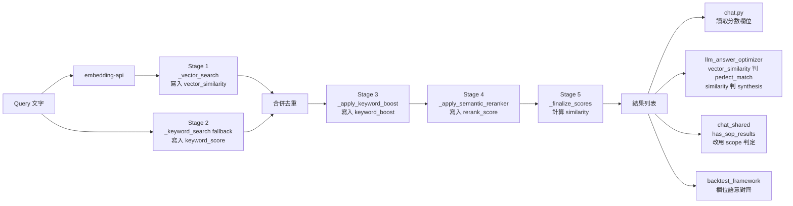
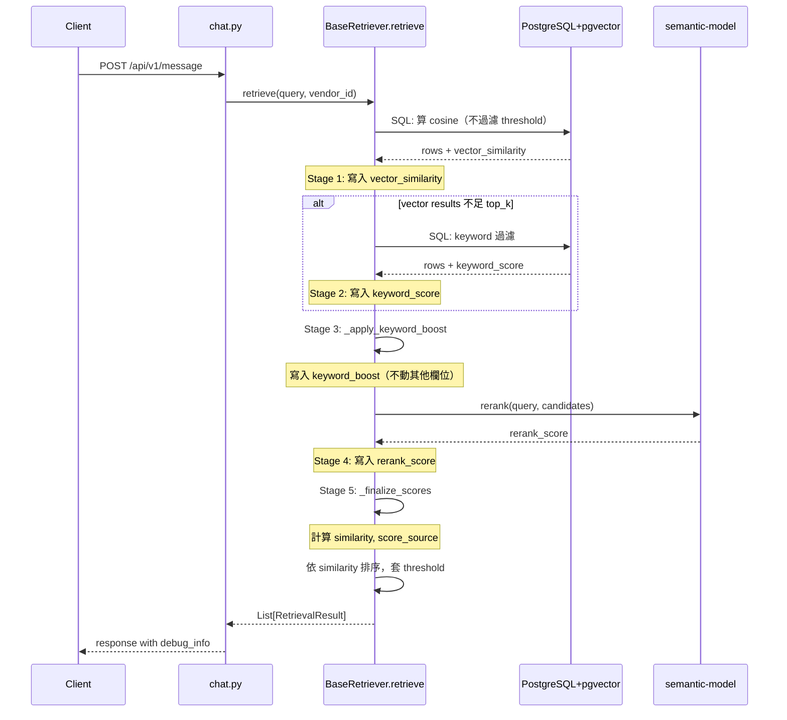

# 技術設計：retriever-similarity-refactor

> 建立時間：2026-04-16T14:39:12Z
> 需求文件：requirements.md
> 研究記錄：research.md

## 概述

### 設計目標

本設計針對現有 retriever pipeline 的 `similarity` 欄位多階段覆寫問題，建立分離式分數欄位架構，使每個 pipeline 階段（向量檢索、關鍵字配對、加成、語意重排序）的分數獨立可追蹤，並由統一公式組合出最終排序分數。

### 範圍與邊界

**包含**：
- `BaseRetriever`、`VendorSOPRetrieverV2`、`VendorKnowledgeRetrieverV2` 的分數欄位重構
- `_format_result`、`_apply_keyword_boost`、`_apply_semantic_reranker` 的覆寫邏輯改造
- `chat.py`、`chat_shared.py`、`llm_answer_optimizer.py`、`backtest_framework_async.py` 的欄位讀取更新
- 環境變數註解標註對應的分數欄位語意
- **移除死碼**：刪除 `services/sop_keywords_handler.py` 整個檔案（盤查確認無外部調用點）

**不包含**：
- 變更 embedding 模型、reranker 模型、pgvector 索引策略
- 變更 retriever pipeline 的整體階段順序（vector → keyword → boost → rerank 不變）
- 變更 API endpoint 路徑或 HTTP method

## 架構設計

### Architecture Pattern & Boundary Map

採用 **Pipeline Pattern**，每個 stage 函數為純資料增補（不覆寫前階段結果），最終由 `_finalize_scores` 階段依公式組合 final similarity。



### Technology Stack & Alignment

| 層級 | 技術 | 版本 | 說明 |
|------|------|------|------|
| 後端框架 | FastAPI | 0.104.1 | 既有 |
| 資料庫 | PostgreSQL + pgvector | 16 | 既有 |
| Python | psycopg2 / asyncpg | 既有 | 同步/非同步 DB 存取 |
| 中文分詞 | jieba | 0.42.1 | keyword 配對 |
| 語意重排序 | semantic-model 容器（HTTP API） | 內部 | bge-reranker-base |

無新增依賴，遵循 `.kiro/steering/tech.md` 既有技術棧規範。

## Components & Interface Contracts

### 核心元件

#### 元件 1：RetrievalResult（資料模型）

**責任**：
統一表達一筆 retriever 結果，包含所有 pipeline 階段的分數欄位。

**介面定義（Python TypedDict / Pydantic）**：

```python
from typing import TypedDict, Optional, List

class RetrievalResult(TypedDict):
    # 既有欄位（保留）
    id: int
    item_name: str  # SOP 用 item_name；KB 用 question_summary
    content: str
    keywords: List[str]
    search_method: str  # "vector" | "keyword_fallback"

    # 新增分數欄位
    vector_similarity: float       # Stage 1：原始 cosine（0.0–1.0）；無向量結果為 0.0
    keyword_score: Optional[float] # Stage 2：keyword 配對分數（0.0–1.0）；未走 keyword 為 None
    keyword_boost: float            # Stage 3：boost 倍率；未套用為 1.0
    rerank_score: Optional[float]  # Stage 4：reranker 分數；未經 rerank 為 None

    # 最終分數
    similarity: float               # Stage 5：依公式計算的綜合分數，用於排序

    # Debug 輔助
    score_source: str               # "rerank" | "keyword" | "vector"
    keyword_matches: List[str]     # 命中哪些 keyword

    # 既有 metadata（保留向後相容）
    # ⚠️ 語意變更：alias 為 vector_similarity（純向量 cosine）
    # 舊版語意為「reranker 前的 similarity」（可能是 0.77 等含 boost 值）
    # 新版語意符合決策 5：_has_perfect_match 改用純向量分數
    # 後續可考慮在獨立 task 中廢棄此 alias，下游全部改讀 vector_similarity
    original_similarity: float     # = vector_similarity（alias）
```

**與需求對應**：
- 需求 1：欄位定義
- 需求 9：向後相容（保留 `original_similarity` 作為 alias）

---

#### 元件 2：BaseRetriever（pipeline 編排）

**責任**：
編排檢索 pipeline 的各 stage，確保每階段只寫入自己的欄位，不覆寫前階段結果。

**介面定義**：

```python
class BaseRetriever(ABC):
    async def retrieve(
        self,
        query: str,
        vendor_id: int,
        top_k: int = 5,
        similarity_threshold: float = 0.6,
        enable_keyword_fallback: bool = True,
        enable_keyword_boost: bool = True,
        **kwargs
    ) -> List[RetrievalResult]:
        """
        Pipeline 階段：
        1. _vector_search → 寫入 vector_similarity
        2. _keyword_search (fallback) → 寫入 keyword_score
        3. _apply_keyword_boost → 寫入 keyword_boost
        4. _apply_semantic_reranker → 寫入 rerank_score
        5. _finalize_scores → 計算 similarity 與 score_source

        最終以 similarity 排序後回傳 top_k 筆
        """

    @abstractmethod
    async def _vector_search(
        self, query_embedding: List[float], vendor_id: int,
        top_k: int, similarity_threshold: float, **kwargs
    ) -> List[RetrievalResult]:
        """SQL 端不再過濾 threshold，回傳所有候選含真實 vector_similarity"""

    @abstractmethod
    async def _keyword_search(
        self, query: str, vendor_id: int, limit: int, **kwargs
    ) -> List[RetrievalResult]:
        """寫入 keyword_score 不 cap；vector_similarity 設為 0 或從 DB 補算"""

    async def _apply_keyword_boost(
        self, results: List[RetrievalResult], query: str
    ) -> List[RetrievalResult]:
        """只寫 keyword_boost 與 keyword_matches，不修改 vector_similarity / similarity"""

    def _apply_semantic_reranker(
        self, query: str, candidates: List[RetrievalResult], top_k: int
    ) -> List[RetrievalResult]:
        """
        只寫 rerank_score，不修改其他分數欄位。

        ⚠️ 必須保留 SOP→KB 欄位映射（reranker 服務需要 answer 與 question_summary）：
            if 'answer' not in item and 'content' in item:
                item['answer'] = item['content']
            if 'question_summary' not in item:
                item['question_summary'] = item.get('item_name', '')
        重構時不可誤刪此映射，否則 SOP 重排序會收到空字串。
        """

    def _finalize_scores(
        self, results: List[RetrievalResult]
    ) -> List[RetrievalResult]:
        """
        依公式計算 similarity 與 score_source：

        1. rerank_score is not None:
             similarity = 0.1 × vector_similarity + 0.9 × rerank_score
             score_source = "rerank"
        2. keyword_score is not None:
             base = max(vector_similarity, keyword_score)
             similarity = min(1.0, base × keyword_boost)
             score_source = "keyword"
        3. else:
             similarity = min(1.0, vector_similarity × keyword_boost)
             score_source = "vector"
        """
```

**與需求對應**：
- 需求 1, 2, 3：分數欄位定義與獨立記錄
- 需求 4：最終分數計算公式
- 需求 10：可觀測性（log）

---

#### 元件 3：VendorSOPRetrieverV2 / VendorKnowledgeRetrieverV2

**責任**：
實作 SOP 與知識庫的 `_vector_search`、`_keyword_search`、`_format_result`，回傳結構符合 `RetrievalResult`。

**介面定義**（差異點）：

```python
class VendorSOPRetrieverV2(BaseRetriever):
    async def _vector_search(...) -> List[RetrievalResult]:
        """
        SQL 變更：
        - 移除 WHERE GREATEST(...) >= threshold 過濾
        - 改在 application 層由 _finalize_scores 後過濾（threshold 比對 similarity）
        - SQL 加 LIMIT (top_k * N) 控制回傳量，N 預設 5
        """

    async def _keyword_search(...) -> List[RetrievalResult]:
        """
        - 不再 cap normalized_score 在 0.70
        - keyword fallback 命中項目的 vector_similarity 預設為 0.0
          理由：
          1. 簡單、無額外 DB query 成本
          2. chat-test 顯示 vector_similarity=0 即代表「向量沒命中，純靠 keyword 找到」
             這是有意義的 debug 資訊，不會誤導
          3. final similarity 公式中 keyword 路徑 = max(vector, keyword) × boost
             vector_similarity=0 不影響 final 分數計算
        - 若未來需要真實向量分數，再改為 retrieve() 主流程傳入 query_embedding 補算
        """

    def _format_result(self, row: Dict) -> RetrievalResult:
        """
        欄位對應：
        - vector_similarity = row['similarity']  # SQL cosine
        - keyword_score = None  # 由 _keyword_search 設定
        - keyword_boost = 1.0   # 由 _apply_keyword_boost 設定
        - rerank_score = None   # 由 _apply_semantic_reranker 設定
        - similarity = vector_similarity  # 暫時值，由 _finalize_scores 重算
        - original_similarity = vector_similarity  # alias
        """
```

知識庫 retriever 邏輯相同。

**與需求對應**：
- 需求 2：vector_similarity 保留
- 需求 3：keyword 路徑獨立記錄

---

#### 元件 4：chat.py 與 chat_shared.py（消費者更新）

**責任**：
更新 debug response 的欄位對應，改用新分數欄位。

**介面定義（變更點）**：

```python
# chat.py：debug response 構建
debug_item: CandidateSOP = {
    'id': sop_item['id'],
    'item_name': sop_item['item_name'],
    'group_name': sop_item['group_name'],
    'base_similarity': sop_item['vector_similarity'],  # 改用 vector_similarity
    'boosted_similarity': min(1.0, sop_item['vector_similarity'] * sop_item['keyword_boost']),
    'rerank_score': sop_item.get('rerank_score'),
    'similarity': sop_item['similarity'],  # 最終分數
    'score_source': sop_item['score_source'],
    'is_selected': sop_item.get('is_selected', False),
}

# chat_shared.py:202：has_sop_results
def has_sop_results(search_results: List[Dict]) -> bool:
    return any(r.get('scope') == 'vendor_sop' for r in search_results)
    # 移除 == 1.0 比對，改用 scope 判定
```

**與需求對應**：
- 需求 5：決策邏輯明確化
- 需求 6：前端 debug 顯示對應

---

#### 元件 5：llm_answer_optimizer.py（決策邏輯明確化）

**責任**：
明確指定 perfect_match 與 synthesis 觸發判定使用哪個欄位。

**介面定義（變更點）**：

```python
# perfect_match 判定（用純向量分數）
def _has_perfect_match(self, results: List[Dict]) -> bool:
    max_vec = max(r.get('vector_similarity', 0) for r in results)
    threshold = self.config['perfect_match_threshold']  # 對應 vector_similarity
    return max_vec >= threshold

# synthesis 觸發（用最終分數）
def _should_synthesize(self, results: List[Dict], min_results: int) -> bool:
    max_final = max(r['similarity'] for r in results[:min_results])
    threshold = self.config['synthesis_threshold']  # 對應 similarity（最終）
    no_perfect_match = max_final < threshold
    return self._has_complex_pattern() and no_perfect_match
```

**與需求對應**：
- 需求 5：決策邏輯明確化

---

#### 元件 6：backtest_framework_async.py（回測對齊）

**責任**：
回測注入 sources similarity 時改用一致的欄位語意。

**介面定義（變更點）**：

```python
# Line 177 變更
similarity = (
    candidate.get('similarity', 0.0)        # 主排序使用最終分數
)
vector_similarity = candidate.get('vector_similarity', 0.0)  # 額外記錄

source['similarity'] = similarity
source['vector_similarity'] = vector_similarity  # 新增欄位供分析
```

**與需求對應**：
- 需求 7：回測欄位語意一致

---

### 資料模型

詳見元件 1 的 `RetrievalResult` 定義。下游消費者使用 `Dict[str, Any]`，但需遵循此結構契約。

### API 設計

本重構**不變更 API endpoint 與請求/回應結構**，僅在 response 的 `debug_info.sop_candidates[]` / `knowledge_candidates[]` 中：

- `base_similarity` 欄位語意修正為「vector_similarity」（純向量分數）
- 新增 `score_source` 欄位（"rerank" | "keyword" | "vector"）
- 既有欄位（`boosted_similarity`、`rerank_score`、`similarity`）保留

```
POST /api/v1/message
Content-Type: application/json

Request: （不變）
{
  "message": "...",
  "vendor_id": 2,
  "include_debug_info": true,
  ...
}

Response.debug_info.sop_candidates[i]:
{
  "id": 44,
  "item_name": "退租通知流程",
  "base_similarity": 0.62,        // ← 修正：原本 0.77，現在為真實向量分數
  "boosted_similarity": 0.682,    // = vector_similarity × keyword_boost
  "rerank_score": 0.95,           // 不變
  "similarity": 0.918,            // 不變（最終排序分數）
  "score_source": "rerank",       // ← 新增
  "is_selected": true
}
```

## 資料流程

### 主要流程圖



### 資料轉換

| 階段 | 輸入欄位 | 輸出欄位 | 是否覆寫前階段 |
|------|---------|---------|---------------|
| _vector_search | （無前階段） | vector_similarity | N/A |
| _keyword_search | （無前階段或為 fallback） | keyword_score | 否（不同 row 或補欄位） |
| _apply_keyword_boost | vector_similarity, keywords, query | keyword_boost, keyword_matches | 否 |
| _apply_semantic_reranker | item content, query | rerank_score | 否 |
| _finalize_scores | vector_similarity, keyword_score, keyword_boost, rerank_score | similarity, score_source | 是（only similarity） |

## 技術決策

### 決策 1：分數欄位命名策略

**問題**：
如何在保留向後相容的前提下，分離各 pipeline 階段的分數？

**選項**：
1. 完全重新命名（廢棄 `similarity`）— 語意清楚但破壞性大
2. 保留 `similarity` 為最終分數，新增獨立欄位（如 `vector_similarity`、`keyword_score`、`keyword_boost`、`rerank_score`）— 漸進式
3. namespace 包覆（`scores: { vector, keyword, ... }`）— 結構化但 API 變更大

**決定**：選項 2

**理由**：
本專案已有 `original_similarity`、`rerank_score` 等欄位的命名慣例，沿用此風格新增欄位即可，下游消費者可漸進式切換。

**參考資料**：
- research.md 選型 1

---

### 決策 2：keyword_search 不再 cap 0.70

**問題**：
原本 `_keyword_search` 對 normalized_score 套 `min(0.70, ...)` 上限，重構後是否保留？

**選項**：
1. 保留 0.70 cap — 行為穩定但仍會出現固定值
2. 移除 cap，回傳真實 normalized_score — 真實反映匹配度

**決定**：選項 2（移除 cap）

**理由**：
keyword_score 寫入獨立欄位後，不再影響 vector_similarity。final similarity 公式中再用 `max(vector, keyword) × boost` 控制權重，不需 cap。

**參考資料**：
- research.md 選型 2

---

### 決策 3：取消 SQL 端 threshold 過濾

**問題**：
`_vector_search` 是否仍在 SQL 端過濾 threshold？

**選項**：
1. 保留 SQL threshold 過濾 — 效能好但低分項目資料遺失
2. 取消 SQL 過濾，回傳全部加 vector_similarity，application 端用 LIMIT 控制 — 完整保留資料

**決定**：選項 2

**理由**：
本專案 SOP 規模 ~50 筆/業者、知識庫 ~1500 筆/業者，pgvector 索引 + LIMIT (SOP 500 / KB 1000) 效能影響有限。換取「Req 6 前端可顯示低分候選」的價值。

**參考資料**：
- research.md 選型 3

---

### 決策 4：final similarity 計算公式

**問題**：
如何由四個獨立分數欄位組合出最終排序分數？

**選項**：
1. 線性加權（如 0.3×vector + 0.3×keyword + 0.4×rerank）— 簡單但難調權重
2. 階層式（rerank > keyword > vector，依存在性決定）— 與現有行為對齊
3. 取最大值（max(vector, keyword) × boost）— 簡化但忽略 rerank

**決定**：選項 2（階層式）

**理由**：
與現有 `_apply_semantic_reranker` 的「10% 原始 + 90% rerank」邏輯一致；無 rerank 時 fallback 到 keyword 路徑、再 fallback 到 vector，行為可預測。

**公式**：
```
1. rerank_score is not None:
     similarity = 0.1 × vector_similarity + 0.9 × rerank_score
     score_source = "rerank"
2. keyword_score is not None:
     similarity = min(1.0, max(vector_similarity, keyword_score) × keyword_boost)
     score_source = "keyword"
3. else:
     similarity = min(1.0, vector_similarity × keyword_boost)
     score_source = "vector"
```

---

### 決策 5：環境變數對應的分數欄位明文標註

**問題**：
重構後 `PERFECT_MATCH_THRESHOLD`、`SOP_SIMILARITY_THRESHOLD` 等閾值對應哪個欄位？

**決定**：
在 `.env.example`、`docker-compose.prod.yml` 註解中明確標註：

| 環境變數 | 對應欄位 | 比對位置 |
|---------|---------|---------|
| `PERFECT_MATCH_THRESHOLD` | vector_similarity | llm_answer_optimizer._has_perfect_match |
| `SOP_SIMILARITY_THRESHOLD` | similarity（最終） | retrieve() 後的 application 端過濾 |
| `KB_SIMILARITY_THRESHOLD` | similarity（最終） | retrieve() 後的 application 端過濾 |
| `HIGH_QUALITY_THRESHOLD` | similarity（最終） | llm_answer_optimizer 高品質判定 |
| `SYNTHESIS_THRESHOLD` | similarity（最終） | _should_synthesize |

**理由**：
研究發現現有閾值語意不清（部分是 SQL 端過濾、部分是應用層比較），重構後統一以 final similarity 為主，僅 perfect_match 例外（用純向量分數）。

---

### 決策 6：PERFECT_MATCH_THRESHOLD 校準步驟

**問題**：
`PERFECT_MATCH_THRESHOLD` 從「比較含 boost 的 similarity」改為「比較純 vector_similarity」，**閾值語意改變**，必須重新校準避免對話品質倒退。

**校準步驟**：

#### Step 1：建立 baseline（重構前）

1. 選定校準資料集：`vendor_id=2` 的 `test_scenarios WHERE status='approved' AND is_active=true`
2. 跑一次完整回測（用既有 `BacktestFrameworkClient.execute_batch_backtest`），記錄：
   - 每題的 `system_answer`
   - 每題的 `optimization_method`（perfect_match / synthesis / template / llm）
   - `pass_rate`
3. 統計 `optimization_method='perfect_match'` 的觸發比例（baseline_perfect_match_rate）

#### Step 2：重構後跑同樣測試集

1. 部署重構版本到 staging
2. 跑相同測試集回測，記錄相同指標
3. 統計重構後的 `perfect_match_rate`

#### Step 3：比對與校準

| 觀察 | 行動 |
|------|------|
| `pass_rate` 變化 ≤ ±5% 且 `perfect_match_rate` 變化 ≤ ±10% | ✅ 通過，現有閾值即可 |
| `perfect_match_rate` 大幅下降（> 10%） | 閾值過高，需降低 `PERFECT_MATCH_THRESHOLD` |
| `perfect_match_rate` 大幅上升（> 10%） | 閾值過低，需提高 `PERFECT_MATCH_THRESHOLD` |
| `pass_rate` 下降 > 5% | 不通過，需檢查 retriever 排序邏輯 |

#### Step 4：閾值映射預估

重構前 `PERFECT_MATCH_THRESHOLD=0.90` 比對的是「含 boost 的 similarity」（典型值 0.7×1.1 ≈ 0.77 到 0.9×1.3 ≈ 1.0）。

重構後比對純 `vector_similarity`，預估映射關係：

| 重構前閾值（含 boost） | 重構後對應閾值（純 vector） | 推論 |
|--------------------|--------------------------|------|
| 0.90 | 0.82 | 假設 boost 平均約 ×1.1 |
| 0.85 | 0.77 | 同上 |
| 0.80 | 0.73 | 同上 |

**注意**：上述是預估，實際值需依 Step 3 校準結果決定。

#### Step 5：記錄校準結果

校準完成後，在 `docs/architecture/retriever-pipeline.md` 新增章節記錄：
- 校準日期、執行人
- baseline vs 重構後的數據比對表
- 最終閾值決定與理由

## 非功能性設計

### 效能考量

#### 影響分析

| 變更項目 | 影響評估 | 緩解策略 |
|---------|---------|---------|
| 取消 SQL 端 threshold 過濾 | 回傳 row 數從「過濾後 5–10 筆」增加到「LIMIT 上限」 | 設定保守 LIMIT |
| Reranker 對候選做 HTTP 呼叫 | 候選數越多 reranker 延遲越高 | 限制 reranker 候選數 |
| `_apply_keyword_boost` 對所有候選做 jieba | 候選數越多越慢 | 候選數受 vector LIMIT 控制 |

#### 階段性 LIMIT 設計

避免「為了 chat-test debug 顯示而拖慢正式對話」，採用兩階段 LIMIT：

```
SQL vector search:      LIMIT 50    （取真實 vector 分數最高的 50 筆）
                                    這 50 筆全部進入後續 stage
Keyword fallback:       LIMIT 10    （補充候選，不超過總候選數 60）
Apply keyword boost:    對全部候選    （O(N) jieba，N <= 60，可接受）
Apply semantic rerank:  對全部候選    （HTTP 呼叫，N <= 60，預計 < 1s）
最終回傳:                top_k=5
```

**關鍵點**：
- 即使「不過濾 threshold」，SQL 端仍用 `LIMIT 50` 控制單次查詢回傳量
- pgvector 索引（IVFFlat/HNSW）對 top-50 查詢效能優異
- Reranker 對 ≤ 60 個候選的 HTTP 呼叫實測延遲 < 1s
- vector_similarity 仍可被低分項目（rank 6–50）保留供 chat-test debug 顯示

#### 效能基準目標

| 指標 | 重構前（baseline） | 重構後目標 | 驗證方法 |
|------|---------------|-----------|---------|
| `/api/v1/message` 平均延遲 | 待測（vendor_id=2，100 次相同 query） | 差異 < 10% | task 中加入基準測試 |
| `_vector_search` 執行時間 | 待測 | 差異 < 20%（單筆增加 < 50ms） | log 抽樣 |
| `_apply_semantic_reranker` 執行時間 | 待測 | 差異 < 30%（候選數增加導致） | log 抽樣 |

#### 快取

保留現有 Redis 快取機制，快取 key 不需變更。

### 安全性設計

- 不變更 API endpoint 與認證機制
- 不新增資料外洩風險（debug_info 仍受 `include_debug_info` 控制）

### 可擴展性

- `RetrievalResult` 為 TypedDict 可擴充新增欄位
- `_finalize_scores` 公式可由子類覆寫（如未來知識庫想用不同權重）

### 錯誤處理

| 錯誤類型 | 處理策略 |
|---------|---------|
| embedding API 失敗 | 降級為純 keyword 檢索（既有行為） |
| reranker 服務不可用 | 跳過 rerank stage，`rerank_score = None`，公式 fallback 到 keyword/vector |
| jieba 分詞失敗 | 略過 keyword boost，回傳純 vector 結果 |
| SQL 查詢失敗 | 拋出 exception，上層捕捉返回錯誤 response |

## 測試策略

### 單元測試

| 測試項目 | 測試內容 |
|---------|---------|
| `BaseRetriever._finalize_scores` | 三種公式分支（rerank / keyword / vector）皆正確 |
| `BaseRetriever._apply_keyword_boost` | 不修改 vector_similarity，只更新 keyword_boost |
| `BaseRetriever._apply_semantic_reranker` | 不修改 vector_similarity / keyword_score |
| `VendorSOPRetrieverV2._format_result` | 包含所有新欄位且預設值正確 |
| `VendorSOPRetrieverV2._vector_search` | SQL 不過濾 threshold，回傳含 vector_similarity |

### 整合測試

| 測試項目 | 測試內容 |
|---------|---------|
| 完整 retrieve pipeline | 同一 query 跑完整 pipeline，驗證每階段欄位正確累積 |
| chat-test debug 顯示 | 不同 SOP 的 base_similarity 顯示不同數值 |
| llm_answer_optimizer perfect_match | 用 vector_similarity 判定，與閾值比對正確 |
| chat_shared.has_sop_results | 改用 scope 判定不依賴 similarity == 1.0 |

### 端對端測試

| 測試項目 | 測試內容 |
|---------|---------|
| 完整回測 | 用既有 test_scenarios 跑回測，比對重構前後 pass_rate 差異 < 5% |
| 對話品質手測 | 在 chat-test 介面測試多種查詢，驗證回答品質與重構前一致 |

## 部署考量

### 環境需求

- 無新增基礎設施需求
- 環境變數註解更新需同步部署

### 部署步驟

1. 部署本服務（rag-orchestrator）新版本
2. 重啟 rag-orchestrator 容器
3. 驗證：在 chat-test 跑指定 query，確認 base_similarity 顯示真實向量分數
4. 跑回測，比對 pass_rate

### 監控與告警

- log 中觀察 `[Reranker]`、`[向量檢索]`、`[關鍵字加成]` 的輸出格式
- 若回測 pass_rate 下降 > 5%，回滾到前一版

## 風險與挑戰

| 風險 | 影響 | 機率 | 緩解策略 |
|------|------|------|---------|
| `chat_shared.has_sop_results` 改用 scope 判定可能影響 SOP 觸發行為 | 高 | 中 | 完整回測 + 比對 conversation_logs |
| `PERFECT_MATCH_THRESHOLD` 語意改變需重新校準（從含 boost 改為純 vector） | 高 | 高 | 依決策 6 的 5 步驟校準流程；映射預估 0.90 → 0.82 |
| 排序結果改變（因為 final similarity 公式改變） | 中 | 高 | 回測驗證 + 手測重要 query |
| ~~`sop_keywords_handler.py` 與 `base_retriever._apply_keyword_boost` 邏輯重複~~ | ~~中~~ | ~~中~~ | ✅ 已盤查確認為死碼，重構時整檔刪除 |
| backtest 結果無法直接與舊基準比對 | 低 | 中 | 重構後重跑 baseline 作為新基準 |
| 取消 SQL threshold 過濾後效能下降 | 中 | 中 | SQL `LIMIT 50` 控制單次回傳量；task 加入基準測試 |

## 參考文件

- [需求文件](requirements.md)
- [研究記錄](research.md)
- [pgvector README](https://github.com/pgvector/pgvector)

## 附錄

### 名詞解釋

| 術語 | 說明 |
|------|------|
| vector_similarity | query embedding 與 item embedding 的 cosine similarity（0.0–1.0） |
| keyword_score | 關鍵字配對的 normalized 分數（0.0–1.0） |
| keyword_boost | 命中關鍵字後的加成倍率（1.0 = 無加成） |
| rerank_score | semantic-model（bge-reranker-base）的重排序分數（0.0–1.0） |
| similarity | 最終用於排序的綜合分數，由公式組合 |
| score_source | similarity 的計算來源（rerank / keyword / vector） |

### 變更歷史

| 日期 | 版本 | 變更內容 | 修改者 |
|------|------|---------|--------|
| 2026-04-16 | 1.0 | 初始版本 | AI |

---

*本文件遵循專案規範中的設計原則，所有介面定義採用強型別（Python TypedDict / Pydantic），避免使用 `any` 型別。*
