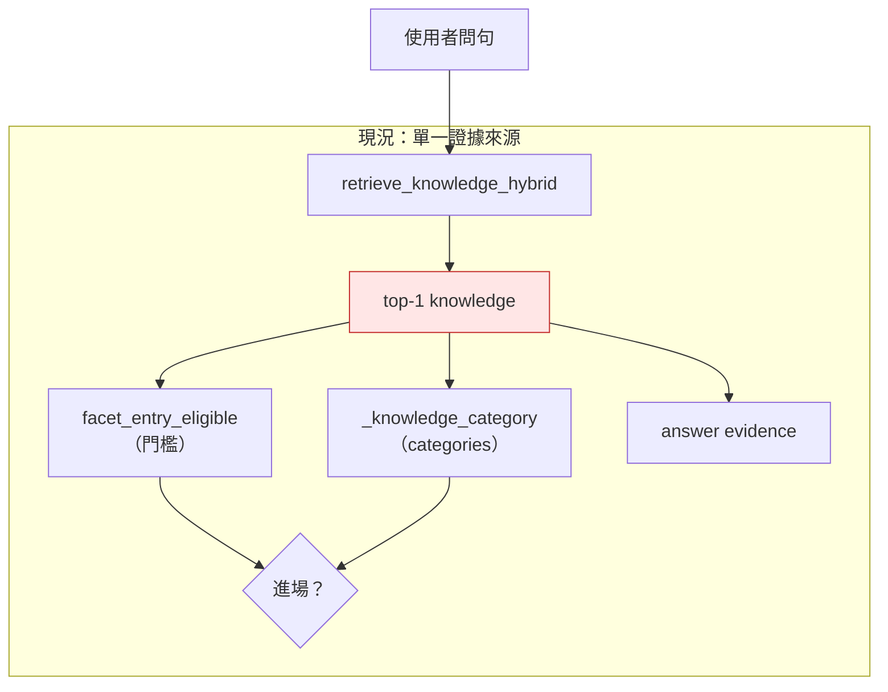
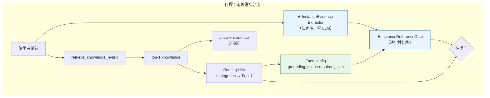
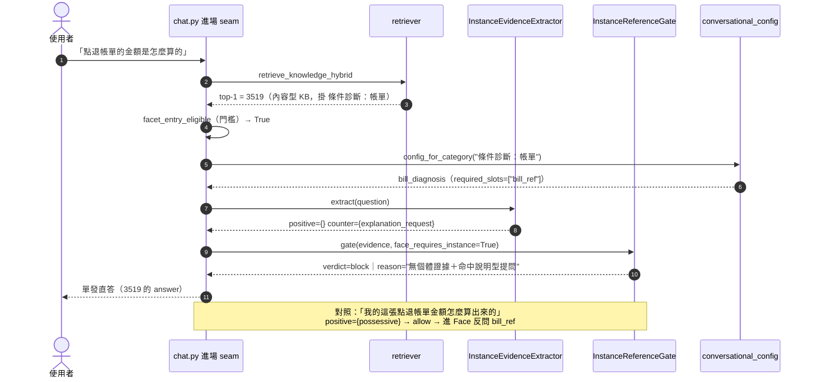

# 技術設計：routing-disambiguation

> 建立時間：2026-08-23T10:30:00Z｜語言 zh-TW
> 需求文件：[requirements.md](./requirements.md)（APPROVED，9 需求／35 子需求）
> 落差分析：[gap-analysis.md](./gap-analysis.md)（APPROVED，**no winner selected**）
> 研究記錄：[research.md](./research.md)
> 發現流程：**Light Discovery**（既有系統擴充；gap 階段已完成六層盤查，本階段只補設計缺口）

## 概述

### 設計目標

gap 階段的結論是一句話：

> **「問句是否指涉特定個體」目前沒有被 production 以
> 可供 routing 穩定消費的第一級訊號顯式表示。**

本設計要建立那個訊號，並回答它**由誰產生、由誰消費、如何驗證**。

⚠️ **本設計的起點不是「挑一個 `SUPPORTED` 的層」**。`SUPPORTED` ≠ winner；
候選層可組合，也可能全都不足（Req.2.4）。本文件呈現**三個候選架構與取捨**，
給出建議，並明訂**每個候選都必須通過已凍結的 protocol v1 才算成立**。

### 範圍與邊界

**涵蓋**：rule／instance 判別訊號的表示、產生層、消費層、驗證方式。

**不涵蓋**（Req.8）：更多 anchor tuning／對測試集調向量排名／全域 routing heuristic／
調整 similarity threshold 或 `top_k`／重建 retrieval pipeline。

⚠️ **適用範圍（Req.2.5）於本設計中為 `Level A` 提案、`Level B` 待驗**：

```text
Level A  帳單診斷域驗證      → 可修四筆 known-red，結論僅限帳單域
Level B  跨 144 exposure surface → 需 ≥30 跨域可判定案例（Req.9.3）方得宣稱
```

---

## 架構設計

### Architecture Pattern & Boundary Map

**架構模式：新增獨立的 routing authorization evidence，
使 KB 提供的 Routing Hint 不再自動生效。**

⚠️ **本設計並未拆開 KB 中的 Routing Hint 與 Answer Evidence**——兩者仍共居同一列，
144 筆 exposure surface 原封不動。如實表述為：

```text
現況：
  top-1 KB 同時提供 answer evidence 與 candidate Routing Hint
  且該 Hint 幾乎直接造成 Face entry

本案：
  candidate Routing Hint 仍由 KB 提供（不變）
  但**該 Hint 是否允許生效**，改由獨立的
  InstanceEvidence × Face contract 決定
```

> **本案是在約束 144 exposure surface 的「使用方式」，不是在消滅結構共居。**
> L6／data hygiene 仍為**後續獨立工作**，不在本案。

前案立下的原則「routing evidence ≠ answer evidence」在此**部分落地**：
分離出來的是 **routing authorization／applicability evidence**，
**不是** Routing Hint 本身。





**關鍵洞察（research.md 主題 2）**：缺口是**單邊**的——問句側缺少對應表示。
Face 側**在帳單域已有可用的既有宣告**（`bill_diagnosis.grounding_scope.required_slots = ["bill_ref"]`）。
故本設計新增的是**問句側的表示**，不是新的 KB metadata。

> ⚠️ **但 `required_slots` 非空 ≠ 需要特定個體**（見「技術決策 6」）。
> `required_slots` 的語義是「本 Face 執行需要哪些欄位」——
> 未來 Face 可能 required `date`／`reason`／`category`／`amount`，皆非 entity reference。
> **Level A 不建立這個全域等價。**

### Technology Stack & Alignment

不引入任何新外部依賴。

| 層級 | 技術／位置 | 對齊說明 |
|---|---|---|
| 訊號產生 | Python，純規則（`re`）| 沿 `conversational_engine.py:88,113,118,137,241` 既有 deterministic 抽取慣例 |
| 訊號消費 | `services/decision_layer.py` | 與 `facet_entry_eligible` **同層**——決定性子決策、唯一讀值點；不新建平行決策路徑（前案 Req.6.7）|
| 進場整合 | `routers/chat.py::_diagnosis_config_for_knowledge` | 現行唯一進場 seam |
| 失敗策略 | fail-open | 沿 `_preentry_routable` 慣例：gate 故障不阻斷對話 |
| 驗證 | protocol v1（已凍結，digest `4690a258f502d98d`）| Req.3.5；不得事後改尺 |

---

## Components & Interface Contracts

### 元件 1：`InstanceEvidence` 訊號契約

**責任**：把「問句是否指涉特定個體」表示為 **first-class、可程式消費、決定性**的值物件。

```python
from dataclasses import dataclass
from typing import Final, Literal

EvidenceKind = Literal["identifier", "possessive", "lookup_verb", "problem_report"]
CounterKind = Literal["explanation_request"]

@dataclass(frozen=True)
class InstanceEvidence:
    """問句側的個體指涉證據（決定性；零 LLM）。

    ⚠️ **正反兩種證據都要帶**——research.md 主題 1 實測顯示反向標記
    （explanation_request）比任一正向特徵更強（8/9 vs 最高 5/11）。
    只找正向特徵會漏掉「規則問句」這一半。
    """
    positive: frozenset[EvidenceKind]      # 指涉個體的證據
    counter: frozenset[CounterKind]        # 指涉通則的反向證據
    spans: tuple[tuple[str, str], ...]     # 各證據命中的原文片段（可解釋性／稽核）
    #  ⚠️ 用 tuple 而非 dict：`@dataclass(frozen=True)` 只凍結欄位綁定，
    #     dict 內容仍可 mutate——型別契約會名不副實。

    @property
    def has_instance_signal(self) -> bool: ...
    @property
    def has_explanation_signal(self) -> bool: ...

class InstanceEvidenceExtractor:
    """決定性抽取器。**SHALL NOT 呼叫 LLM、SHALL NOT 讀取相似度分數。**

    與相似度正交是本元件存在的理由（Req.3.1）：判別若再度依賴分數，
    等於換個地方做同樣的相似度競爭（Req.2.3）。
    """
    #: 正向特徵（規則集為版本化資產，變更須重跑 protocol v1）
    RULESET_VERSION: Final[str] = "ie-v1"

    def extract(self, question: Optional[str]) -> InstanceEvidence:
        """⚠️ `None` 或空白字串 → 回**空 evidence**（正反皆空）→ gate `abstain`。

        明訂此行為，**不依賴 exception → fail-open 間接處理**——
        靠例外達成的行為不會被型別或測試鎖住。單元測試 SHALL 鎖此路徑。
        """
```

**與需求對應**：[需求 2.1]（L1 層的可觀測 signal）[需求 3.1]（不由相似度邊際決定）
[需求 2.3]（提供現行機制拿不到的資訊）

⚠️ **本元件的最大風險已登記**：規則集是**看著 protocol v1 的 20 筆案例事後挑出**的
（research.md 主題 1），屬定義上的 overfit。**未經未見案例驗證前，
SHALL NOT 宣稱本元件可用**（見「測試策略」與 Req.9.3）。

---

### 元件 2：`InstanceReferenceGate` 進場判別

**責任**：把 `InstanceEvidence`（問句側）與 `grounding_scope.required_slots`（Face 側）
比對，產出**決定性**的進場建議。

```python
from typing import Optional

GateVerdict = Literal["allow", "block", "abstain"]

@dataclass(frozen=True)
class GateDecision:
    verdict: GateVerdict
    reason: str                       # 可稽核：命中哪些正／反向證據
    evidence: "InstanceEvidence"
    face_requires_instance: bool      # 來自 grounding_scope.required_slots 非空

def instance_reference_gate(
    evidence: "InstanceEvidence",
    *,
    face_requires_instance: bool,
) -> GateDecision:
    """決定性比對。三值輸出，**`abstain` 是一等公民**。

    判定表（初版；`explain_ask` 的角色為待決事項，見下）：
      face 不需要個體                    → allow（本 gate 不管轄）
      有 instance 證據                   → allow
      無 instance 證據 且 有 explanation 證據 → block
      兩者皆無 / 兩者皆有                 → **abstain**（不阻擋，交由既有流程）

    ⚠️ **`abstain` 不得被摺疊成 allow 或 block**：訊號不足時假裝有結論，
    正是本案要消滅的失敗形態。abstain 的後續處置見「技術決策 3」。
    """
```

**與需求對應**：[需求 1.1][需求 1.2][需求 1.3]（雙邊）[需求 3.1][需求 3.4]（不由邊際決定）

> ⚠️ **為何不放進 `facet_entry_eligible`**：該函式是「搬移不重構」的等價契約
> （`decision_layer` 檔頭：對任意輸入須與搬移前 inline 邏輯**嚴格同輸出**）。
> 新 gate SHALL 為**獨立函式**，由 `_diagnosis_config_for_knowledge` 依序呼叫，
> 使既有門檻判定的等價性不被破壞。

---

### 元件 3：進場 seam 整合

**責任**：在唯一的進場點串接元件 1、2，且**不新建平行決策路徑**。

```python
async def _diagnosis_config_for_knowledge(
    db_pool, best_knowledge, config: "DecisionConfig",
    user_message: Optional[str] = None,
):
    """現行順序（不變）：
         facet_entry_eligible（門檻）→ _knowledge_category → config_for_category
         → _preentry_routable（flag 預設關）

       新增（旗標控制）：於 config_for_category 命中之後、_preentry_routable 之前，
         evidence = InstanceEvidenceExtractor().extract(user_message)
         decision = instance_reference_gate(
             evidence, face_requires_instance=is_instance_requiring_face(cfg))
         # ⚠️ **不是** bool(cfg.grounding_scope.required_slots)——見決策 6：
         #    Level A 以白名單判定（face key == "bill_diagnosis" 且 "bill_ref" ∈ required_slots）
         verdict == "block" → **抑制該問句對所有「白名單內 instance-requiring Face」
                               的 Hint**，不只是續試下一個分類
         verdict in ("allow", "abstain") → 照舊
    """
```

#### ⚠️ `block` 的作用域：抑制同型 Hint，**不是** `continue` 下一個分類

現行 `_preentry_routable` 判 `block` 後是 `continue` 試該知識的**下一個分類**。
**沿用該語義無法保證 Req.1.2**：

```text
某 KB 的 categories = ["條件診斷：帳單", "帳單異常"]
  第一個被 instance gate block → continue
  → 第二個分類 → 仍可能進另一個 Face
  → rule question 依然進了 Face
```

凍結案例集中的三筆恰為**單一相關分類**，故測試可全綠而機制未達標——
**又一次「案例綠了但契約沒成立」**。

**決定（Level A）**：gate 判的是「**此 query 是否允許任何 instance-requiring Face Hint 生效**」，
故 `block` SHALL **抑制該問句對白名單內所有 instance-requiring Face 的 Hint**，
而非只跳過當前分類。非白名單的 Face（如純知識型面向）不受影響。

⚠️ 驗收 SHALL 包含至少一筆 **multi-category negative control**：
一個 rule 問句，其 top-1 KB 掛有兩個以上分類且其中兩個皆為 instance-requiring Face，
斷言最終仍為 `single`。**此案例須加入 protocol v2（不得改 v1）。**

**旗標**：`INSTANCE_REFERENCE_GATE`（預設 `false`）。
沿前案慣例：新 routing 行為一律旗標控制、預設關、可獨立回退。

**與需求對應**：[需求 1.1][需求 1.2][需求 7.1]（routing 變更同等審查）

---

### 元件 4：規則集的版本化與稽核

**責任**：使規則集成為**可追溯、可比較**的資產，而非散落的正規表示式。

```python
from types import MappingProxyType
from typing import Mapping

HoldoutStatus = Literal["not_run", "passed", "failed"]

@dataclass(frozen=True)
class HoldoutRecord:
    """一次 holdout 驗證的結果。**綁定它驗的是「哪一版規則、用哪一份資料、依哪支量尺」。**"""
    status: HoldoutStatus
    ruleset_digest: str        # 被驗的規則集內容雜湊
    protocol_digest: str       # 量尺版本，如 "4690a258f502d98d"
    dataset_id: str            # holdout 資料集識別 ＋ 版本
    dataset_digest: str        # 資料集內容雜湊（防同 id 換內容）

@dataclass(frozen=True)
class RulesetManifest:
    """規則集版本化——變更即須重跑並保留前版結果。"""
    version: str                          # "ie-v1"
    positive_patterns: Mapping[str, str]  # kind → regex（唯讀映射）
    counter_patterns: Mapping[str, str]
    digest: str                           # 內容雜湊，進版控
    holdout: HoldoutRecord

def assert_gate_enablable(m: RulesetManifest, *, active_protocol_digest: str) -> None:
    """啟用守門。**三條皆須成立，缺一即拒絕啟用。**

        m.holdout.status == "passed"
        m.holdout.ruleset_digest  == m.digest              ← 防「舊版 PASS 沿用到新規則」
        m.holdout.protocol_digest == active_protocol_digest ← 防「舊尺 PASS 沿用到新尺」

    違反 → raise GateNotEnablable（不得降級為 warning）。
    """
```

⚠️ **原設計 `holdout_result: Optional[str]` ＋「非 None 才可上線」是假的 fail-closed**：
`holdout_result = "FAILED"` 也是 non-None，照那份契約反而可以開旗標——
**只防 missing，不防 failed**。這正是本 spec 一路在治的「看似守門、實則恆真」形態
（前案：`startswith("[gate]")` 恆為 False 的分類器）。

改為**強型別三值 ＋ digest 三重綁定**後，下列四種情形皆被擋：

| 情形 | 結果 |
|---|---|
| `not_run` | ❌ 拒絕啟用 |
| `failed` | ❌ 拒絕啟用（原設計會放行）|
| `passed` 但 `ruleset_digest ≠ m.digest`（regex 改過）| ❌ 拒絕啟用 |
| `passed` 但 `protocol_digest ≠` 現行量尺（換尺了）| ❌ 拒絕啟用 |
| `passed` 且三者相符 | ✅ 允許 |

**與需求對應**：[需求 3.5]（量尺凍結）[需求 9.3]（≥30 可判定案例）[需求 7.2]

---

## 資料流程



### 資料轉換

| 階段 | 輸入 | 輸出 | 責任 |
|---|---|---|---|
| 抽取 | `question: str` | `InstanceEvidence`（正／反證據 ＋ spans）| 元件 1（決定性）|
| Face 需求 | `cfg.grounding_scope` | `face_requires_instance: bool` | **Level A：白名單判定**（見決策 6），非 `bool(required_slots)` |
| 判別 | 上兩者 | `GateDecision`（三值）| 元件 2（決定性）|
| 進場 | `GateDecision` ＋ 既有門檻／分類 | `cfg \| None` | 元件 3 |

---

## 技術決策

### 決策 1：訊號由 deterministic 規則產生，不由 LLM

**問題**：`InstanceEvidence` 的產生層？

**選項**：A. deterministic 規則（L1）／B. LLM applicability judge（L4-b）／
C. intent taxonomy 增維（L3-b）／D. A ＋ B 混合。

**決定**：**A selected for falsification / Level-A validation**——
選為**最值得實作驗證的候選**，**不是** `winner proven`；D 列為備案（若 holdout 顯示覆蓋率不足）。

⚠️ 這與 gap 的 `no winner` 結論**不矛盾**：design 階段本就可以選一個最值得驗證的 candidate，
但它是否成立**由 holdout 決定**。規則集是看著 protocol v1 案例事後挑出的，
**未經未見案例前不得宣稱可用**。

**理由**：
- **B 已實測非決定性**——`_preentry_routable` 在**無擾動**的三輪重跑中即有 1/8 翻面
  （gap 實測 1）。Req.3 的核心是「判別不得由邊際決定」，非決定性是同一問題家族的另一種形態。
- **C 的訊號在資料上不存在**——`api_required` 於 54 筆 intent 中 0 筆為真；
  且 rule／instance 的分界**與 intent taxonomy 正交**（7/8 同一 intent），
  要用 L3 必須先讓 taxonomy 長出新維度（gap 結構發現 1）。
- **A 可單元測試、可版本化、可解釋**（`spans` 保留命中片段），
  且與相似度正交——直接對應 Req.3.1。

**參考**：gap-analysis 實測 1／2；research.md 主題 1、選型 1。

---

### 決策 6：`face_requires_instance` 在 Level A 以**白名單**判定，非 `bool(required_slots)`

**問題**：如何判定「本 Face 需要指涉一個既存個體」？

**選項**：A. `bool(cfg.grounding_scope.required_slots)`／
B. Level A 白名單（面向 key ＋ 具名 slot）／C. 新增 schema predicate `instance_reference_slots`。

**決定（v1.1 原判）**：**B**（Level A 白名單）。
**決定（v1.2 erratum 01 改判）**：**C ＋ 獨立 rollout scope**——見
[design-erratum-01-block-scope.md](./design-erratum-01-block-scope.md)。

```text
face_requires_instance ≠ bool(required_slots)          ← 兩版皆成立

v1.2 起，實際納管須**兩層同時成立**：
  requires_instance_reference == True        ← C：Face 自身第一級語義宣告
  AND face_key ∈ LEVEL_A_INSTANCE_GATE_SCOPE ← D：本次 release 啟用邊界
```

⚠️ **v1.1 的白名單 B 被撤回為 membership source**（它把語義權威放在 decision code，
與 Face config 形成第二 truth source）；**明列 key 的正確位置是 D 的 rollout list**。
⚠️ **Face 逐一裁定，禁止批次推導**：不得因四個 Face 都有 `bill_ref` 就一次全標 `true`
——那是把已否決的「family」方案從後門裝回來。現況僅 `bill_diagnosis` 為 `true`；
`billing_anomaly` 待逐 Face 裁定（Req.4 已不再阻塞它）；
`billing_invoice`／`billing_flow` **不得因名稱或 slot 自動跟進**。

**理由**：`required_slots` 的語義是「執行需要哪些欄位」，**不天然等於**
「必須指涉一個既存個體」。未來 Face 可能 required `date`／`reason`／`category`／`amount`，
皆非 entity reference。把兩者等價會讓旗標一開就**自動作用於所有宣告 required_slots 的 Face**——
**直接越過 Req.2.5 的 Level A 範圍宣告**，正是本 spec 要防的「帳單 8/8 但偷偷改了 21 Faces」。

⚠️ **在跨域 holdout（Level B）通過前，`INSTANCE_REFERENCE_GATE=true`
SHALL NOT 作用於白名單以外的任何 Face。**

~~**選項 C 留待 Level B**~~ —— **v1.2 撤回**：N4（multi-category）與任務 1.4 已反證
「以 slot 推導 responsibility」不成立，該抽象**不能等到 Level B**，
否則 Level A 的 membership 就只能靠 allowlist，語義權威落在錯的地方。

**與需求對應**：[需求 2.5]（範圍宣告）[需求 5.2]（不鎖機制、不擴散）[需求 8]

---

### 決策 2：不新增 KB metadata；Level A 複用既有宣告

**問題**：Face 側是否需要新的 routing metadata（L2 的 schema 變更）？

**決定（v1.1 原判）**：**不新增**，以決策 6 的白名單判定。

**決定（v1.2 erratum 01 修訂）**——**精確描述修了什麼**：

```text
保留：KB-row Routing Hint metadata 不新增；categories／Hint schema 不改
撤回：「Face 側不需要新的 routing semantic contract，
      required_slots 已足以表示 instance requirement」
新增：Face-level `requires_instance_reference` 第一級語義契約
```

> 修訂後表述：**不新增 KB-row Routing Hint metadata；不再以 `required_slots`
> 推導 instance responsibility；新增 Face-level `requires_instance_reference`
> 第一級語義契約。**

⚠️ 反證來源：N4 ＋ 任務 1.4——**22 個 Face 中 13 個 `required_slots` 非空**，
以 slot 推導會一次納管 13 個。此修訂發生在 candidate implementation **之前**。

**理由**：缺口是**單邊**的（research.md 主題 2）——Face 側已有第一級契約化宣告，
問句側缺席。新增欄位會重複既有語義，且擴大 144 筆的變更面。

⚠️ **這不否決 L2**：`categories` 的雙重語義（144 筆共居）仍是獨立的**資料衛生**問題
（gap L6），只是它未必是**判別機制**的前提——gap 已明訂不得推論任一層為其他層的必要條件。

---

### 決策 3：`abstain` 是一等公民；clarification 暫不新建

**問題**：訊號不足以安全判定時怎麼辦？（research.md 開放問題 2；gap L5 `INSUFFICIENT_EVIDENCE`）

**選項**：A. 新建 clarification 分岔／B. `abstain` → 不阻擋，交既有流程處理。

**決定**：**B**。`abstain` 時 gate 不阻擋，維持既有行為。

**⚠️ `abstain` 的語義必須precise——它是 rollout policy，不是對 query intent 的判真。**

`abstain` 代表：**目前的 evidence contract 無法判斷這句是 rule 還是 instance。**
「抽不到 instance evidence」至少有三種原因，而 gate **無從分辨**：

```text
① 真的是 instance 問句，只是沒提供 bill_ref
② 是 rule 問句，但 ruleset 沒抓到 explanation signal（規則覆蓋不足）
③ 真正 ambiguous
```

故 Level A 的處置是：**為保持向後相容而 fail-open，不阻擋 Face entry**——
這是 **rollout policy**（不確定時不改變現況），**不是**宣告「它屬於缺執行欄位」。

⚠️ 原稿把 `abstain` 語義上宣告為前案分類的「缺執行欄位」，
是**用 implementation 的處置去為 product semantic 背書**——
與前案 3.3 判 `REGRESSION` 所依據的 **provenance ≠ justification**（本案 Req.7.3）
是同一種越界，只是方向相反。已改正。

**L5 的結論（明確回答，非默默消失）**：

```text
clarification 暫不實作——
  ✗ 不是因為 abstain 已被證明屬「缺執行欄位」
  ✓ 而是：目前沒有可靠的 ambiguity detector（gap L5 實測：
    brain 對 Route-R3 全數判 stay），故 Level A 採 backward-compatible abstain policy；
    若 holdout 顯示 abstain 對 precision／coverage 造成實質問題，
    再重新評估 L5。
```

（前案原則「缺執行欄位 → 進 Face 後反問」仍然成立，且**恰好**與 fail-open 的結果一致——
但那是**巧合的一致**，不是本決策的依據。）

---

### 決策 4：反向標記的角色 —— `block` 需正反雙條件

**問題**：`explanation_request` 命中即判 rule（veto），還是需搭配正向證據缺席？
（research.md 開放問題 1）

**決定**：**`block` 需同時滿足「無正向證據」且「有反向證據」**；
單有反向證據而正向也命中者 → `abstain`。

**理由**：反向標記在案例集上雖強（8/9），但 `explain_ask` **也命中一筆 dialog 案例**
（「我的這張點退帳單金額怎麼算出來的」同時有 possessive 與 explain_ask）。
若採 veto，該筆會被誤殺——**正是 3.4 那類「修一邊傷另一邊」的失敗**。
雙條件使正向證據優先，符合 Req.1.3「雙邊同時成立」。

---

### 決策 5：以旗標獨立上線，且以 `holdout_result` 結構性阻擋

**決定**：`INSTANCE_REFERENCE_GATE` 預設 `false`；
啟用前 SHALL 通過 `assert_gate_enablable()` 的**三條**檢查
（`status == "passed"` ＋ ruleset digest 相符 ＋ protocol digest 相符）。

**理由**：規則集是事後挑出的（已登記為最高風險）。把「未經 holdout 驗證不得上線」
寫成程式約束而非流程備忘，是前案「加不變量必做 negative control」紀律的延伸。

⚠️ **原稿的 `holdout_result is None` 判定是假的 fail-closed**——
`"FAILED"` 也是 non-None，照那份契約反而可以開旗標；且舊版 PASS 可沿用到改過的 regex。
三重 digest 綁定後，`failed`／換規則／換尺三種假通過皆被擋（見元件 4）。

---

## 非功能性設計

### 效能考量

| 項目 | 影響 |
|---|---|
| `InstanceEvidenceExtractor` | 純 regex，微秒級；**零 LLM、零 IO**——與決策 1 否決的 B 方案（每次進場一次 LLM）形成對比 |
| 進場 seam | 新增兩次函式呼叫，無網路往返 |
| 相較 L3 方案 | 省下重啟 Step 3 的 ~1.5s／請求 |

### 安全性設計

| 邊界 | 對策 |
|---|---|
| gate 故障阻斷對話 | **fail-open**：例外一律回 `abstain`（沿 `_preentry_routable` 慣例）|
| 規則集誤殺正常流量 | 旗標預設關 ＋ `holdout_result` 結構性阻擋 ＋ 可獨立回退 |
| `spans` 記錄原文片段 | 僅存**命中的關鍵詞片段**，非完整問句；不進 log 的個資欄位 |

### 可擴展性

- 規則集以 `RulesetManifest` 版本化；新增語言變體 ＝ 升版 ＋ 重跑 protocol v1。
- Face 側零改動——但**擴充管轄範圍是明示動作**：新增 Face 須經 Level B 的跨域驗證
  並顯式加入白名單（決策 6），**不因宣告 `required_slots` 而自動納入**。

### 錯誤處理

| 分類 | 策略 |
|---|---|
| 抽取例外 | 回空 `InstanceEvidence` → gate `abstain` → 不阻擋 |
| Face 無 `grounding_scope` | `face_requires_instance=False` → gate 不管轄 → `allow` |
| 規則集未通過 holdout | **拒絕啟用旗標**（唯一不 fail-open 之處，理由同決策 5）|

---

## 測試策略

### 單元測試

| 對象 | 案例 |
|---|---|
| `InstanceEvidenceExtractor` | 五類特徵各自的命中／未命中；`spans` 正確；**零 LLM／零 IO** |
| `instance_reference_gate` | 四種判定路徑；`abstain` **不得**被摺疊成 allow／block |
| `assert_gate_enablable` | **negative control 四路皆須拒絕**：`not_run`／`failed`／`passed` 但 ruleset digest 不符／`passed` 但 protocol digest 不符；僅三者相符才允許 |
| `InstanceEvidenceExtractor.extract(None)` ／ `("")` | 回空 evidence（**不靠 exception**）|
| `block` 作用域 | multi-category 情境下 SHALL 抑制所有白名單內 instance-requiring Face 的 Hint |

### 整合測試

以 protocol v1 的凍結案例集驅動 production seam（Req.6.1）：
`RULE 4` → `single`；`INSTANCE 4` → `dialog:條件診斷：帳單`（斷言到 facet）；
`BLAST 7`（Req.5.2 判定後才入 assertion）；`CONTROL 5` 不得改變。

### 驗收（protocol v1，不得改尺）

| 指標 | 門檻 |
|---|---|
| `bilateral_pass` | **8/8**（雙邊缺一不可）|
| `flip_rate_under_perturbation` | ≤ 1/8 且不得反覆翻面（P1×3／P2×1／P3×1）|
| `decision_margin` | **只記錄**——用於證明判別不靠邊際 |
| `control_unchanged` | 5/5 |

### ⚠️ Holdout（Req.9.3）——本設計成立與否的關鍵

規則集**必須**在**未見過**的案例上驗證，數量 **≥30 可判定案例**（Req.9.3）。

> **未通過 holdout 者，本設計的核心主張（deterministic 訊號可行）即未成立**——
> protocol v1 的 20 筆全分**不構成證據**，因為規則與資料同源。

#### ⚠️ Holdout 程序（順序不可對調）

144 是 **KB rows**，但真正要驗的是 **user utterance routing**。
若直接「抽 30 個 KB → 照其 wording 改寫 query → 驗 regex」，
query 仍與 source text 高度同源，**等於換個形式的 overfit**。故：

```text
① 抽樣：自 exposure KB／domains 抽取（記錄抽樣方法與 seed）
② 取得 utterance：產生或蒐集**未參與 ruleset 建構**的 user utterances
                  （優先取真實回報／既有語料；生成者須與規則作者隔離）
③ 盲標：在**不知道 extractor 判定結果**的情況下做產品標註
④ 凍結 labels：標註完成即凍結，並記入 dataset_digest
⑤ 最後才跑 extractor
```

⚠️ **rule 與 instance 兩側都必須有案例**——只驗一側就會重演前案的單邊假綠
（「三筆 regression 綠了」而 T-1 能力無人守）。兩側各自的最小數量於 protocol v2 定義。

⚠️ Req.9.2：holdout SHALL NOT 參與規則集調整、門檻設定或 protocol 修訂。
⚠️ holdout 結果 SHALL 以 `HoldoutRecord` 記錄（含 `dataset_digest`），
使「同 id 換內容」也會被啟用守門擋下。

---

## 風險與挑戰

| 風險 | 影響 | 機率 | 緩解策略 |
|---|---|---|---|
| **規則集 overfit 於 20 筆凍結案例** | **高**——重演 3.4「對著測試集調」 | **高** | holdout ≥30 未見案例（**盲標＋凍結 labels**）；`assert_gate_enablable` 三重 digest 綁定；protocol v1 已凍結 |
| **holdout query 與 KB source text 同源** | 高——換個形式的 overfit | 中 | holdout 程序五步（抽樣→取得 utterance→盲標→凍結→跑）；生成者與規則作者隔離 |
| **旗標一開即作用於所有 required_slots Face** | **高**——越過 Level A 範圍宣告 | 中 | 決策 6：Level A 白名單（`bill_diagnosis` ＋ `bill_ref`）；擴充須經 Level B |
| **`block` 沿用 `continue` 而未達成 Req.1.2** | 中——案例綠但契約未成立 | 中 | `block` 抑制同型 Hint；protocol v2 加 multi-category negative control |
| 語言變體長尾覆蓋不足 | 中 | 高 | 反向標記補強；備案 D（A＋B 混合）；`abstain` 使不確定不致誤殺 |
| 判別上移至進場＝新增全域 routing 訊號 | 中 | 中 | 旗標預設關；Req.2.5 範圍宣告先為 Level A |
| `abstain` 比例過高使 gate 形同虛設 | 中 | 中 | 量測 abstain 率；過高則重啟 L5 評估（決策 3）|
| 144 筆產品判定成本 | 中 | 高 | 兩級 scope；Level A 不需一次做完 |

---

## 參考文件

- [需求文件](requirements.md)｜[落差分析](gap-analysis.md)｜[研究記錄](research.md)
- [穩健性 protocol v1](robustness-protocol.json)（digest `4690a258f502d98d`）
- 前案：[conversational-routing-execution](../conversational-routing-execution/tasks.md)

## 附錄

### 名詞解釋

| 名詞 | 意義 |
|---|---|
| **InstanceEvidence** | 問句側「是否指涉特定個體」的第一級訊號；含正向與反向證據 |
| **abstain** | gate 的第三值：訊號不足以判定，**不阻擋**、交既有流程 |
| **exposure surface** | 144 筆同時承載 Knowledge Evidence 與 Routing Hint 的內容型 KB；**潛在**風險面，非已證實缺陷 |
| **Level A／B** | Req.2.5 的適用範圍宣告：帳單域驗證／跨 exposure surface 泛化 |

### 變更歷史

| 日期 | 版本 | 變更內容 | 修改者 |
|---|---|---|---|
| 2026-08-23T10:30:00Z | 1.0 | 初始版本；承接 gap 的 no-winner 結論，提出 InstanceEvidence 訊號契約 | AI |
| 2026-08-23 | 1.2 | **erratum 01（block scope）裁定**：membership 改採 Face-level `requires_instance_reference`（選項 C），與 **rollout scope（選項 D）正交**，兩層同時成立才納管；撤回 v1.1 的 key allowlist 作為 membership source（改列為 D 的 rollout list）；家族方案判 `INSUFFICIENT_JUSTIFICATION`；整筆 KB suppression 判 REJECTED 並保留為 explicitly rejected alternative；決策 2 精確修訂（不新增 KB-row metadata、撤回以 `required_slots` 推導、新增 Face 層語義契約）；Face **逐一裁定禁止批次推導**，現況僅 `bill_diagnosis` 為 `true` | AI |
| 2026-08-23 | 1.1 | 業主審查修正 5 Must ＋ 3 Should：①`face_requires_instance` 改 Level A 白名單（決策 6），不等價 `bool(required_slots)`；②架構敘事如實命名——本案分離的是 **routing authorization evidence**，**未**消除 KB 中 Hint／Evidence 共居；③啟用守門改 `HoldoutStatus` 三值 ＋ ruleset／protocol／dataset **三重 digest 綁定**（原 `result != None` 只防 missing、不防 failed）；④`block` 改為抑制同型 Hint，非 `continue` 下一分類，並要求 multi-category negative control；⑤`abstain` 正名為 **rollout policy**，非對 query intent 的判真；另：`spans` 改 immutable tuple、`extract(None)` 行為明訂、holdout 程序五步防同源 | AI |

---

*本文件遵循 `.kiro/settings/rules/design-principles.md`：介面採強型別（Python type hints ＋
`dataclass`／`Literal`／`Final`），複雜流程以 Mermaid 呈現，每個元件標示對應需求 ID。*
