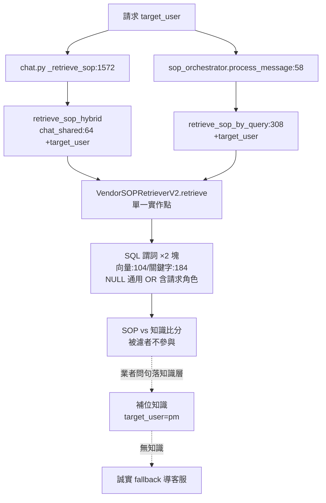

# 技術設計：sop-audience-isolation

> 建立時間：2026-07-04
> 需求文件：requirements.md（R1–R5）　研究依據：research.md（定案 5 項＋jgb2 真相 3 題＋內容體系查證）
> 內容體系查證（使用者提問後補）：vendor SOP 14 分類 407 筆**全部為業者對租客的服務流程**（修繕/租金/契約/社區/居住規範…），零 JGB 系統操作內容——受眾錯位的本質是「業者問系統操作（knowledge_base 域）被租客服務話術（SOP 域）以相似度攔截」，SOP 裡不存在業者要的答案，攔到必錯。

## 概述

### 設計目標
為 SOP 體系補受眾維度：schema 加欄、407 筆回填（預設 tenant＋37 筆人工審）、檢索單點過濾（比分前天然滿足）、業者向補位知識（jgb2 真相已盤）接住被過濾問句。租客側零回歸、未帶 target_user 向下相容。

### 範圍與邊界
範圍內：vendor_sop_items schema/回填、VendorSOPRetrieverV2 過濾＋三層穿線、補位知識 4 筆、回歸三組、runbook。範圍外：SOP 後台 UI、SOP 內容改寫、platform_sop_templates（同構缺口已證實——vendors.py:706/1023 範本派生鏈無 target_user，掛帳另案）、五域面向行為。

## 架構設計

### Architecture Pattern & Boundary Map



### Technology Stack & Alignment

| 層級 | 技術 | 對齊 |
|---|---|---|
| schema | `ALTER TABLE vendor_sop_items ADD COLUMN IF NOT EXISTS target_user text[]`（407 筆小表免索引） | knowledge_base 同型別語義 |
| 回填 | 一次性審表腳本（不 commit）→ 人工閘門 → `backfill_sop_target_user.sql`（id 清單冪等） | 知識工程閘門慣例 |
| 過濾 | psycopg2 SQL 謂詞（retriever 層） | KB target_user 過濾同語義 |
| 補位知識 | estate-knowledge-batch 同款批次檔＋import 工具 | 知識工程慣例 |

## Components & Interface Contracts

### 元件 1：schema＋回填（資料）

- Migration 1：`add_sop_target_user_column.sql`——加欄，冪等，不動任何列值（全庫暫為 NULL=通用，**部署此支後行為零變化**）。
- 審表 `sop-audience-review.md`：370 筆規則預判（口吻特徵→tenant）＋37 筆逐筆欄＋4 實彈與 1166 明列＋每 vendor 抽樣 10 筆複核欄。內容體系查證後預期：**例外趨近零，全 tenant**。
- Migration 2：`backfill_sop_target_user.sql`——閘門後產出；`UPDATE ... SET target_user=ARRAY['tenant'] WHERE id IN (…) AND target_user IS NULL`（冪等；例外清單各自 UPDATE）；不動 content/embedding（R1.4）。

### 元件 2：檢索過濾（程式，單點）

**穿線（全部 Optional[str] = None，未帶不過濾——R2.5）**：

```python
# routers/chat.py _retrieve_sop → 傳 request.target_user
async def retrieve_sop_hybrid(vendor_id, intent_ids, query, top_k=5,
                              similarity_threshold=None, return_debug_info=False,
                              target_user: Optional[str] = None) -> list | tuple

# services/sop_orchestrator.py（兩呼叫端 chat.py:520/1678 補傳 request.target_user）
async def process_message(..., role_id=None, target_user: Optional[str] = None)

# services/vendor_sop_retriever_v2.py
async def retrieve_sop_by_query(..., target_user: Optional[str] = None)
# → retrieve(..., target_user) → _vector_search/_keyword_search 兩 SQL 塊加謂詞：
#   AND (si.target_user IS NULL OR %s = ANY(si.target_user))   -- 僅 target_user 非 None 時附加
```

語義規則（單元釘死）：
- 請求 None → 不附加謂詞（現行行為，向下相容）
- 請求 tenant → 謂詞附加，但回填後絕大多數列=['tenant'] ⇒ 命中集合不變（零回歸）
- 請求 property_manager/prospect → tenant-only 全排除；NULL（未回填/新匯入）仍通過（過渡安全）
- **不沿 KB 的 None→tenant 正規化**（research 定案 #3：未帶流量真實存在）

〔設計討論——更強語義選項：內容體系查證後，pm 請求可直接跳過 SOP 檢索（SOP 全是租客服務內容）。**不採**：NULL=通用的過渡語義保留了未來業者向 SOP 的可能性、且與資料標注一致；跳過檢索是隱式硬編，違反資料驅動慣例。效果等價（回填後 pm 請求命中集=空），但語義走資料不走程式。〕

### 元件 3：b2b 知識缺口補齊（批次檔＋閘門，口徑照 research jgb2 真相）

定位（使用者裁定 2026-07-05）：這 4 筆**不是 SOP 的業者版**——是 knowledge_base 本來就缺的 b2b 知識（SOP 越界遮住了查無）。歸屬既有領域分類：

| question | 口徑要點（真碼定案） |
|---|---|
| 租客繳租方式 信用卡 支援管道 | 信用卡真支援（藍新/永豐/台大金流）＋Google Pay/Samsung Pay/中信轉帳Pay/icash Pay＋ATM 虛擬帳號/超商代碼/條碼＋信用卡自動扣款；**視業者收款設定啟用哪些通道而定**（收款設定頁旗標）；LINE Pay/Apple Pay 不支援 |
| 退租結算 業者側 押金結算 | 點退流程產生結算清單（押金退還/修繕扣抵），租客同意後點退帳單自動成立；金額異動走帳單端——業者視角口徑（區別於租客向 SOP 1193） |
| 電費收法 設定 六種模式 | 建約「租金費用」電費欄六模式：租金已包含/租客自繳/每月固定/按度數（可設夏季電價）/當期每度平均電價/依儲值電錶設定（台科電）；儲值電錶模式收款限信用卡/ATM/現金 |
| 統編發票 公司抬頭 開立 | 建約/編約「稅務與發票」填買受人統編＋抬頭（合約層級，影響後續所有發票）；齊備自動開 B2B（強制紙本）；**已開立發票改統編須作廢重開**（後台客服），無法直接改號 |

target_user=['property_manager']、business_types=['system_provider']、categories 歸既有領域（繳租方式→付款金流；退租結算→退租收尾；電費設定→帳單設定引導或合約域；統編→發票開立），人工閘門後匯入。

### 元件 4：測試

| 層 | 內容 |
|---|---|
| unit | 謂詞附加三態（None 不附加/tenant/pm）；穿線 default None 不改既有呼叫；migration 檔形狀（冪等/不動 embedding 斷言） |
| integration | 真 DB 插測試 SOP 列（tenant-only/NULL/雙值）驗過濾三態＋tenant 請求命中集不縮；比分前驗證（pm 請求高分 tenant-SOP 不出現在 smart retrieval 結果） |
| e2e | 4 實彈改判（pm 問信用卡/押金/電費/統編→補位知識口徑 token，負斷言「您的管理師」不出現）＋租客對照句（tenant 問同題→SOP 照常）＋「房間沒電」改判（pm→電表錨點或誠實 fallback）；五域全套零回歸 |

## 資料設計

Migrations ×2：`add_sop_target_user_column.sql`（先上，零行為變化）→ `backfill_sop_target_user.sql`（閘門後）。部署順序（runbook）：加欄 → 補位知識匯入 → 回填 → 程式版更（過濾生效）→ 煙囪（實彈句＋租客對照句）。

## 需求追溯

| Requirement | 設計元件 |
|---|---|
| 1.1–1.5 | 元件 1（兩支 migration＋審表閘門） |
| 2.1–2.5 | 元件 2（單點謂詞＋三層穿線＋None 語義） |
| 3.1–3.4 | 元件 3（4 筆口徑已依 jgb2 真相定案；fallback 過渡態） |
| 4.1–4.5 | 元件 4（三層測試＋比分前驗證） |
| 5.1–5.3 | runbook 部署順序＋治理註記＋platform 掛帳（research 定案 #4） |
