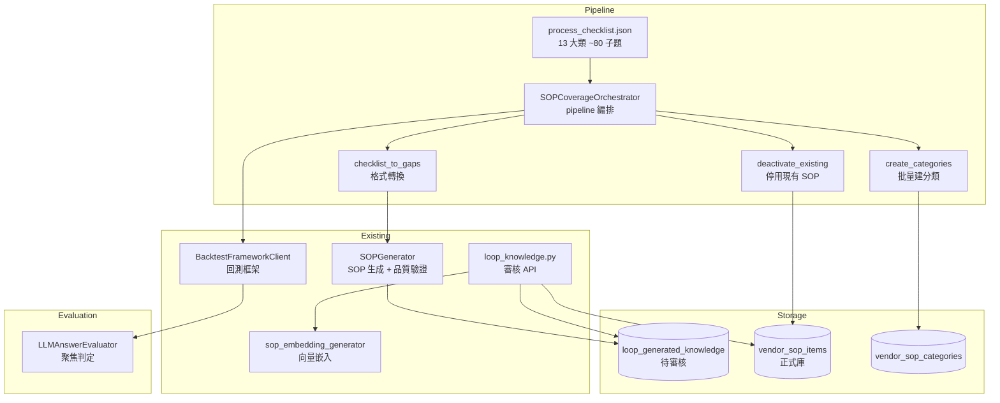
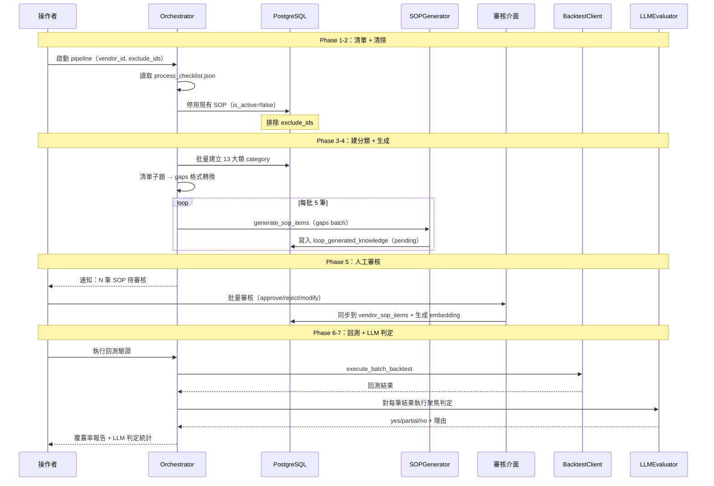

# 技術設計：sop-coverage-completion

> 建立時間：2026-04-17T00:00:00+08:00
> 需求文件：requirements.md
> 研究記錄：research.md

## Overview

**Purpose**：本功能為包租/代管業 AI 客服建立完整的 SOP 知識庫，從目前 19 筆提升至涵蓋 13 大類 ~80 子題的完整覆蓋。
**Users**：知識庫管理者透過 script 執行批量生成與回測驗證；審核者透過現有前端審核介面批准 SOP。
**Impact**：現有 SOP 全數停用後重建，回測 pass_rate 目標從 ~57% 提升至 75%+。

### Goals
- 建立包租/代管業完整 SOP 流程清單（13 大類 ~80 子題）
- 清除現有 SOP 後全量生成新 SOP
- 經人工審核後同步到正式庫
- 回測驗證覆蓋率 + 聚焦 LLM 判定答案品質

### Non-Goals
- 修改 retriever pipeline 分數機制
- 答案品質改善迴圈（留給 backtest-scoring-answer-quality）
- 前端新功能開發
- 非流程類知識（api_query、jgb_system 類問題）

## Boundary Commitments

### This Spec Owns
- SOP 流程清單的定義與維護（`process_checklist.json`）
- 現有 SOP 停用邏輯
- 流程清單 → SOPGenerator 輸入的轉換
- SOP 分類（category/group）的批量建立
- 回測後的聚焦 LLM 答案判定函數
- 整體 pipeline 的編排（orchestrator）

### Out of Boundary
- SOPGenerator 內部的生成邏輯（已有，複用）
- 審核介面與同步邏輯（已有，複用 loop_knowledge.py）
- 回測框架本身（已有，複用 BacktestFrameworkClient）
- 答案品質改善（另一個 spec）
- Retriever 分數計算

### Allowed Dependencies
- `SOPGenerator`（P0）：SOP 生成核心
- `BacktestFrameworkClient`（P0）：回測執行
- `sop_embedding_generator`（P0）：向量嵌入生成
- `loop_generated_knowledge` 表（P0）：生成結果暫存
- `vendor_sop_items` 表（P0）：正式 SOP 庫
- `loop_knowledge.py` 審核 API（P1）：人工審核流程
- OpenAI API / gpt-4o-mini（P0）：SOP 生成與 LLM 判定

### Revalidation Triggers
- SOPGenerator 的 prompt 或品質驗證邏輯變更
- `vendor_sop_items` 表結構變更
- 回測評分公式（`evaluate_answer_v2`）變更
- 流程清單內容更新（新增/移除子題）

## Architecture

### Existing Architecture Analysis

現有系統已具備完整的知識完善迴圈：回測 → 缺口分析 → 生成 → 審核 → 同步。本設計的核心差異是**主動盤點驅動**而非**回測失敗驅動**。

需延伸的模組：
- `SOPGenerator`：接受「流程清單子題」作為輸入（而非只接受回測失敗的 gap）
- `evaluate_answer_v2`：新增 LLM 判定步驟

### Architecture Pattern & Boundary Map



**架構選擇**：Pipeline Pattern — 清單→停用→建分類→轉換→生成→審核→回測→LLM 判定，每階段獨立可重試。

### Technology Stack

| 層級 | 技術 | 用途 |
|------|------|------|
| 後端 | Python 3.x + asyncio | orchestrator script |
| AI | OpenAI gpt-4o-mini | SOP 生成 + LLM 答案判定 |
| 資料庫 | PostgreSQL + pgvector | SOP 儲存 + 重複偵測 |
| 向量 | embedding-api 服務 | SOP 嵌入生成 |

無新增依賴。

## File Structure Plan

### Directory Structure
```
scripts/sop_coverage/
├── process_checklist.json       # 流程清單靜態資料（13 大類 ~80 子題）
├── orchestrator.py              # pipeline 編排（Phase 1-7）
├── coverage_utils.py            # 停用 SOP、建分類、格式轉換
└── llm_answer_evaluator.py      # 聚焦 LLM 答案判定
```

### Modified Files
- `rag-orchestrator/services/knowledge_completion_loop/sop_generator.py` — 新增 `generate_from_checklist()` 方法，接受流程清單格式輸入
- `scripts/backtest/backtest_framework_async.py` — 在 `evaluate_answer_v2` 結果中新增 `llm_quality_judgment` 欄位

## System Flows

### 主要流程：SOP 覆蓋率補齊 Pipeline



## Requirements Traceability

| Requirement | Summary | Components | Flows |
|-------------|---------|------------|-------|
| 1 | SOP 流程清單盤點 | process_checklist.json | Phase 1 |
| 2 | 清除現有 SOP | coverage_utils.deactivate_existing | Phase 2 |
| 3 | SOP 批量生成 | SOPGenerator.generate_from_checklist, coverage_utils.checklist_to_gaps | Phase 3 |
| 4 | 分類與歸屬 | coverage_utils.create_categories | Phase 3 |
| 5 | 人工審核與同步 | loop_knowledge.py（既有） | Phase 5 |
| 6 | 回測驗證覆蓋率 | BacktestFrameworkClient（既有）, orchestrator | Phase 6 |
| 7 | 聚焦 LLM 答案品質判定 | llm_answer_evaluator | Phase 7 |

## Components and Interfaces

| Component | Layer | Intent | Req | Dependencies | Contracts |
|-----------|-------|--------|-----|-------------|-----------|
| process_checklist.json | Data | 定義 13 大類 ~80 子題的完整清單 | 1 | — | — |
| orchestrator.py | Script | 編排 7 階段 pipeline | 1-7 | 所有元件 | Batch |
| coverage_utils.py | Utility | 停用 SOP、建分類、格式轉換 | 2, 3, 4 | PostgreSQL (P0) | Service |
| SOPGenerator（擴展） | Service | 接受流程清單格式輸入生成 SOP | 3 | OpenAI (P0), pgvector (P0) | Service |
| llm_answer_evaluator.py | Evaluation | 聚焦判定「答案有沒有回答到租客問題」 | 7 | OpenAI (P0) | Service |

---

### Data Layer

#### process_checklist.json

| Field | Detail |
|-------|--------|
| Intent | 定義包租/代管業所有 SOP 流程子題 |
| Requirements | 1 |

**結構定義**：

```python
# process_checklist.json 結構
ProcessChecklist = List[Category]

class Category(TypedDict):
    category_name: str               # e.g. "租賃契約"
    description: str                  # 分類描述
    subtopics: List[Subtopic]

class Subtopic(TypedDict):
    topic_id: str                    # e.g. "contract_01"
    question: str                    # 租客問題，e.g. "定型化契約有哪些應記載事項？"
    business_type: str               # "sublease" | "management" | "both"
    keywords: List[str]              # 搜尋關鍵字
    cashflow_relevant: bool          # 是否涉及金流
    priority: str                    # "p0" | "p1" | "p2"
```

**內容涵蓋**（13 大類，依需求 1.1 列出）：

| # | 大類 | 預估子題數 | 重點子題範例 |
|---|------|-----------|-------------|
| 1 | 制度與法規 | 6 | 包租 vs 代管差異、租賃專法重點 |
| 2 | 租賃契約 | 6 | 定型化契約、審閱期、公證流程 |
| 3 | 租金與費用 | 7 | 繳納方式、調漲規定、管理費、租金補貼 |
| 4 | 押金 | 6 | 上限規定、退還流程、可/不可扣抵情形 |
| 5 | 入住與退租 | 5 | 點交流程、退租預告、清潔標準 |
| 6 | 提前解約 | 5 | 法定終止、違約金、最短租期 |
| 7 | 修繕與維護 | 6 | 房東/房客責任、報修流程、緊急修繕 |
| 8 | 居住規範 | 7 | 轉租限制、裝潢規定、寵物、噪音 |
| 9 | 社區管理 | 6 | 公設使用、停車位、門禁、漏水責任 |
| 10 | 安全與保險 | 5 | 熱水器安全、火災保險、天災處理 |
| 11 | 稅務 | 4 | 房屋稅、租金扣除額、稅賦優惠 |
| 12 | 爭議處理 | 6 | 調處管道、消保申訴、法律扶助 |
| 13 | 戶籍與居住證明 | 3 | 遷入戶籍權利、居住證明 |
| | **合計** | **~72** | |

---

### Utility Layer

#### coverage_utils.py

| Field | Detail |
|-------|--------|
| Intent | SOP 停用、分類建立、清單格式轉換 |
| Requirements | 2, 3, 4 |

**Dependencies**
- Inbound: orchestrator.py — 呼叫各 utility 函數 (P0)
- External: PostgreSQL — SOP 與分類 CRUD (P0)

**Contracts**: Service [x]

##### Service Interface

```python
from typing import List, Dict, Optional

async def deactivate_existing_sops(
    db_pool,
    vendor_id: int,
    exclude_ids: Optional[List[int]] = None
) -> Dict:
    """
    停用指定業者的所有 SOP

    Preconditions: vendor_id 存在
    Postconditions:
      - 所有 vendor_sop_items（除 exclude_ids）的 is_active = false
      - 回傳 {"deactivated_count": int, "excluded_count": int, "deactivated_items": List[Dict]}
    """

async def create_categories_from_checklist(
    db_pool,
    vendor_id: int,
    checklist: List[Dict]
) -> Dict[str, int]:
    """
    根據流程清單批量建立 SOP 分類與群組

    Preconditions: checklist 格式符合 ProcessChecklist
    Postconditions:
      - 每個 category 在 vendor_sop_categories 中存在（已存在則跳過）
      - 回傳 category_name → category_id 的映射
    """

def checklist_to_gaps(
    checklist: List[Dict],
    category_map: Dict[str, int],
    exclude_topic_ids: Optional[List[str]] = None
) -> List[Dict]:
    """
    將流程清單子題轉換為 SOPGenerator 接受的 gaps 格式

    輸入: ProcessChecklist + category_id 映射
    輸出: List[Dict] 符合 SOPGenerator.generate_sop_items() 的 gaps 參數格式：
      [{
        "test_question": subtopic.question,
        "gap_type": "sop_knowledge",
        "failure_reason": "COVERAGE_GAP",
        "priority": subtopic.priority,
        "category_id": category_map[category_name],
        "keywords": subtopic.keywords,
        "business_type": subtopic.business_type,
        "cashflow_relevant": subtopic.cashflow_relevant
      }]
    """
```

---

### Service Layer（擴展）

#### SOPGenerator.generate_from_checklist()

| Field | Detail |
|-------|--------|
| Intent | 接受流程清單格式輸入，批量生成 SOP |
| Requirements | 3 |

**Contracts**: Service [x]

##### Service Interface

```python
async def generate_from_checklist(
    self,
    loop_id: int,
    vendor_id: int,
    gaps: List[Dict],
    iteration: int = 1,
    batch_size: int = 5
) -> List[Dict]:
    """
    封裝 generate_sop_items()，新增以下行為：

    1. 每筆 gap 中的 category_id 直接使用（不再呼叫 LLM 選分類）
    2. 每筆 gap 中的 keywords 作為初始關鍵字（仍由 LLM 補充）
    3. 每筆 gap 中的 cashflow_relevant 決定是否標註金流模式

    Preconditions: gaps 格式包含 category_id 欄位
    Postconditions: 與 generate_sop_items() 相同
    """
```

**Implementation Notes**
- 複用現有 `generate_sop_items` 的品質驗證（2-pass AI QA）與重複偵測
- 差異僅在分類選擇策略：已知 category_id 直接指定，省去 LLM 分類呼叫
- 預估生成時間：72 筆 × batch_size=5 ≈ 15 批 × ~2 分鐘/批 ≈ 30 分鐘

---

### Evaluation Layer

#### llm_answer_evaluator.py

| Field | Detail |
|-------|--------|
| Intent | 聚焦判定「答案是否從租客角度回答了租客的問題」 |
| Requirements | 7 |

**Dependencies**
- External: OpenAI gpt-4o-mini (P0)

**Contracts**: Service [x]

##### Service Interface

```python
from typing import List, Dict, Literal

class LLMJudgment(TypedDict):
    verdict: Literal["yes", "partial", "no"]
    reason: str  # 50 字以內

async def evaluate_answer_quality(
    question: str,
    answer: str,
    model: str = "gpt-4o-mini"
) -> LLMJudgment:
    """
    單筆答案判定

    Prompt 核心：
      「以下是租客的問題和 AI 客服的回答。
       請判斷：這個回答是否從租客角度回答了租客的問題？
       回答 yes / partial / no，並用一句話說明理由。」

    Preconditions: question 和 answer 非空
    Postconditions: 回傳 verdict + reason
    """

async def evaluate_batch(
    results: List[Dict],
    concurrency: int = 5
) -> List[Dict]:
    """
    批量判定回測結果

    Preconditions: results 為回測結果列表，每筆包含 test_question 和 system_answer
    Postconditions: 每筆結果新增 llm_judgment 欄位
    """
```

**成本預估**：72 筆 × ~200 tokens/筆 ≈ 14,400 tokens ≈ $0.02（gpt-4o-mini）

---

### Script Layer

#### orchestrator.py

| Field | Detail |
|-------|--------|
| Intent | 編排 7 階段 pipeline，提供 CLI 入口 |
| Requirements | 1-7 |

**Contracts**: Batch [x]

##### Batch Contract

```python
async def run_pipeline(
    vendor_id: int,
    exclude_sop_ids: Optional[List[int]] = None,
    skip_phases: Optional[List[str]] = None,
    backtest_scenario_ids: Optional[List[int]] = None
) -> Dict:
    """
    完整 pipeline 執行

    Phases:
      1. load_checklist — 讀取 process_checklist.json
      2. deactivate — 停用現有 SOP（可排除特定 ID）
      3. create_categories — 批量建分類
      4. generate — 轉換 + 批量生成 SOP
      5. (pause) — 等待人工審核
      6. backtest — 執行回測
      7. llm_evaluate — 聚焦 LLM 判定

    skip_phases: 可跳過已完成的 phase（重試用）
    backtest_scenario_ids: 指定回測用的測試集 ID

    Trigger: CLI 手動執行
    Idempotency: 每個 phase 可獨立重試，停用/建分類有 upsert 語意
    """
```

**CLI 使用方式**：

```bash
# 完整 pipeline（Phase 1-4，生成後暫停等待審核）
python scripts/sop_coverage/orchestrator.py --vendor-id 2

# 保留特定 SOP
python scripts/sop_coverage/orchestrator.py --vendor-id 2 --exclude-sop-ids 1,2,3

# 審核完成後，執行回測 + LLM 判定（Phase 6-7）
python scripts/sop_coverage/orchestrator.py --vendor-id 2 --skip-phases load,deactivate,create,generate

# 指定回測測試集
python scripts/sop_coverage/orchestrator.py --vendor-id 2 --skip-phases load,deactivate,create,generate --scenario-ids 1,2,3,...
```

## Data Models

### Physical Data Model

**無新表**。使用現有表：

| 表 | 用途 | 變更 |
|---|------|------|
| `vendor_sop_items` | 正式 SOP 庫 | 無變更（is_active 已存在） |
| `vendor_sop_categories` | SOP 分類 | 新增 13 大類 category |
| `vendor_sop_groups` | SOP 群組 | 可選新增 |
| `loop_generated_knowledge` | 待審核 SOP | 無變更（複用現有流程） |
| `knowledge_completion_loops` | 迴圈記錄 | 新建一筆 loop 記錄本次生成 |
| `backtest_runs` | 回測記錄 | 無變更 |
| `backtest_results` | 回測結果 | evaluation JSONB 新增 `llm_judgment` |

### Data Contracts

**backtest_results.evaluation 擴充**：

```python
# 現有
{
    "passed": bool,
    "confidence_score": float,
    "max_similarity": float,
    ...
}

# 新增
{
    ...
    "llm_judgment": {
        "verdict": "yes" | "partial" | "no",
        "reason": "答案只提到流程但沒回答可不可以提前退租"
    },
    "final_passed": bool  # 綜合 confidence + LLM 判定
}
```

## Error Handling

| 錯誤場景 | 處理策略 |
|---------|---------|
| OpenAI API 限流 | tenacity 重試（現有機制） |
| SOP 生成品質不合格 | SOPGenerator 內建 2-pass 驗證，不合格跳過 |
| 重複偵測命中 | 標記 similar_knowledge，不生成（現有機制） |
| 分類建立失敗 | 回傳錯誤，pipeline 中止 |
| 回測 API 不可用 | 回傳錯誤，可跳過重試 |
| LLM 判定回傳格式異常 | fallback 為 `{"verdict": "partial", "reason": "判定失敗"}` |

## Testing Strategy

### Unit Tests
- `checklist_to_gaps()`：驗證清單→gaps 格式轉換正確（含 category_id 映射、exclude 邏輯）
- `deactivate_existing_sops()`：驗證停用邏輯（含 exclude_ids 排除）
- `evaluate_answer_quality()`：驗證 LLM 判定 prompt 回傳格式解析（mock OpenAI）
- `create_categories_from_checklist()`：驗證分類 upsert 邏輯（已存在不重建）

### Integration Tests
- 完整 pipeline Phase 1-4：清單讀取→停用→建分類→生成 5 筆 SOP（用測試 vendor）
- LLM 判定 + 回測結果合併：驗證 evaluation JSONB 正確擴充
- 審核流程整合：生成的 SOP 經審核後正確同步到 vendor_sop_items

### E2E Tests
- 完整 pipeline 執行（vendor_id=2，小規模清單 5 筆子題）→ 審核 → 回測 → LLM 判定 → 驗證 pass_rate 提升
