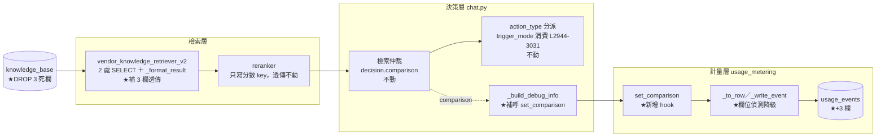
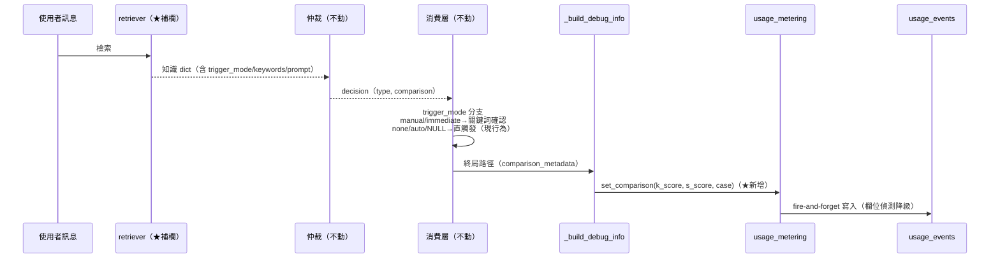

# 技術設計：trigger-vocabulary-debt（觸發語彙還債 P0）

> 建立時間：2026-07-11
> 需求文件：requirements.md　研究記錄：research.md　差距分析：gap-analysis.md

## 概述

### 設計目標
1. 修復知識層觸發配置的檢索斷鏈，使 `trigger_mode`／`trigger_keywords`／`immediate_prompt` 從資料庫透傳至既有消費邏輯［需求 1.1–1.4］。
2. 移除三個零讀取的死欄位及其附屬約束與索引，收斂觸發語彙至單一可信機制［需求 2.1–2.5］。
3. 於使用事件記錄檢索仲裁分數，使灰帶占比可直接量測［需求 3.1–3.5］。
4. 建立「消費欄位 ⊆ 檢索欄位」的機器防回歸［需求 4.1］。

### 範圍與邊界
- **不改變任何觸發行為語義**：仲裁邏輯、門檻（0.55／0.6／0.75）、Case 分支、消費邏輯（chat.py:2944-3031）全部不動。經 gap-analysis 資料實查，修復後零筆既有知識改變行為（manual/immediate＝0 筆）。
- **不新增元件、不新增服務**：全案為 4 個既有檔案的擴充＋2 個 migration。
- 範圍外：admin 觸發配置編輯 UI、灰帶數據分析、值域正規化（見技術決策 1）。

## 架構設計

### Architecture Pattern & Boundary Map

擴充既有三層（檢索層→決策層→計量層），不引入新邊界：



★＝本案改動點（5 處程式＋2 migration）。

### Technology Stack & Alignment

| 層級 | 技術 | 對齊方式 |
|---|---|---|
| 檢索 | Python／psycopg（既有） | 沿用 `_format_result` 明列 key 房式與分區註解慣例 |
| 計量 | Python contextvar（既有） | `set_comparison` 依 `set_path`（usage_metering.py:158）同款：ctx None 靜默、值截斷 |
| DB | PostgreSQL 16 | 加欄用 `ADD COLUMN IF NOT EXISTS`（add_vendor_quotas.sql 前例）；刪欄獨立分檔 |
| 測試 | pytest（容器內，既有分層 conftest） | unit（靜態不變量）＋integration＋e2e（G-gated fixture） |

## Components & Interface Contracts

### 元件 1：檢索層欄位透傳（修改 `vendor_knowledge_retriever_v2.py`）

**責任**：向量與關鍵詞兩條查詢路徑帶出觸發配置三欄，並經 `_format_result` 透傳至知識 dict。

**介面契約**（知識 dict 新增 key，型別以 Python type hints 表述）：

```python
class KnowledgeResult(TypedDict, total=False):
    # ─── 既有 key（節錄，不變）───
    id: int
    form_id: Optional[str]
    action_type: Optional[str]
    similarity: float
    # ─── 觸發配置（本案新增透傳）───
    trigger_mode: Optional[str]        # 'none' | 'auto' | 'manual' | 'immediate' | None
    trigger_keywords: Optional[list[str]]   # DB JSONB → list；NULL → None
    immediate_prompt: Optional[str]
```

**改動點**：
1. `_vector_search` SELECT（L89-106）補 `kb.trigger_mode, kb.trigger_keywords, kb.immediate_prompt`
2. `_keyword_search` SELECT（L196-215）同上
3. `_format_result`（L297-341）補三個 `row.get(...)` 映射，比照既有分區註解標記

**與需求對應**：［需求 1.1］兩路徑一致；［需求 1.3］NULL 透傳後消費層預設行為不變。

### 元件 2：消費層（零改動，契約確認）

chat.py:2944-3031 既有邏輯：`trigger_mode in ['manual','immediate']` → 借道 `sop_orchestrator.handle_knowledge_trigger`；else → 直接觸發。本設計**不修改此段**——斷鏈修復後其 `.get()` 開始收到真值即完成［需求 1.2、1.4］。

### 元件 3：計量分數 hook（修改 `usage_metering.py`＋`chat.py`）

**介面定義**：

```python
def set_comparison(
    knowledge_score: Optional[float] = None,
    sop_score: Optional[float] = None,
    decision_case: Optional[str] = None,
) -> None:
    """檢索仲裁分數落入當前使用事件 context。
    非計量路徑（ctx None）或已定稿（_finalized）靜默略過；
    decision_case 截斷 [:60]（與 processing_path 同款）。"""
```

**呼叫點**（實作時修正，v1.1）：chat.py `handle_retrieval` 內 `decision` 誕生處（L745，`_smart_retrieval_with_comparison` 唯一生產點）——經 `_meter_comparison` helper **無條件**呼叫（與 `_meter_path` 同款計量防護）。原設計掛 `_build_debug_info` 有誤：該函式被 `include_debug_info` 閘住，正式流量永不執行，違背生產遙測目的。短路路徑（表單續填／偽會話續跑／快取／圖片直觸發／b2b skip_sop）不產 decision → 不呼叫，分數欄自然留 NULL［需求 3.1、3.2］。

**降級機制**（欄位未建時，需求 3.5）：`_to_row` 前以一次性欄位偵測（首寫時查 `information_schema.columns`，結果快取於模組層）決定是否加入三個 key——欄位不存在時事件照舊完整寫入（無分數），**避免動態 INSERT 整筆失敗**（research.md 選型 2A；此為 fire-and-forget 原則的延伸：分數是加值，不得危及事件本體）［需求 3.3、3.5］。

### 元件 4：資料庫遷移（2 個 migration）

**M1（加性，migrations/）**：
```sql
ALTER TABLE usage_events
  ADD COLUMN IF NOT EXISTS knowledge_score NUMERIC(4,3),
  ADD COLUMN IF NOT EXISTS sop_score       NUMERIC(4,3),
  ADD COLUMN IF NOT EXISTS decision_case   VARCHAR(60);
```
［需求 3.4：灰帶查詢 `WHERE knowledge_score >= 0.6 AND knowledge_score < 0.75` 免 join 免解析］

**M2（破壞性，migrations/ 獨立分檔＋rollback 檔）**：
```sql
ALTER TABLE knowledge_base
  DROP CONSTRAINT IF EXISTS check_trigger_form_condition;
DROP INDEX IF EXISTS idx_kb_trigger_form_condition;
ALTER TABLE knowledge_base
  DROP COLUMN IF EXISTS trigger_form_condition,
  DROP COLUMN IF EXISTS trigger_conditions,
  DROP COLUMN IF EXISTS auto_keywords;
```
rollback 檔重建三欄與約束/索引（依 add_knowledge_form_auto_option.sql 原定義；資料不可回復——經雙重確認零資訊內容，可接受）。**prod 執行由使用者操作**，runbook 提供指令［需求 2.1、2.3、2.5］。

### 元件 5：防回歸不變量（新增 unit 測試）

**責任**：靜態斷言「chat.py 消費的知識 dict key 集合 ⊆ `_format_result` 產出 key 集合」且「`_format_result` 映射的 DB 欄位 ⊆ 兩條 SELECT 欄位集合」。

```python
def test_knowledge_dict_contract() -> None:
    consumed: set[str]   # 解析 chat.py best_knowledge.get('<key>') 字面量
    produced: set[str]   # 解析 _format_result return dict 的 key 字面量
    selected: set[str]   # 解析兩條 SELECT 的欄位清單
    assert consumed <= produced
    assert db_backed(produced) <= selected  # 排除計算欄位（similarity 等）
```

離線可跑、無 DB 依賴，納入既有 unit 套件（隨 `make test` 與 CI 執行，等效納入稽核閘）［需求 4.1］。

## 資料流程



## 技術決策

### 決策 1：trigger_mode 值域不正規化
**問題**：DB 現值 `none`=983 筆，消費語彙為 auto/manual/immediate，`none` 靠 else 分支等同 auto。
**選項**：A 不動資料＋文件化；B 正規化 none→auto＋CHECK。
**決定**：A。**理由**：行為等價（else 分支），改 983 筆無收益有風險；CHECK 約束增加匯入路徑破壞面；違反本案「零行為改變」立場。值域語義記入本文件附錄。（research.md 選型 1）

### 決策 2：分數獨立欄位＋啟動偵測降級
**問題**：R3.4 要求 SQL 直查；`_write_event` 動態 INSERT 使「欄位未建」變成整筆失敗風險。
**決定**：三獨立欄（非 JSONB）＋首寫時 `information_schema` 偵測快取。**理由**：灰帶一句 SQL；降級後事件本體零損失；偵測成本一次性。（research.md 選型 2）

### 決策 3：不變量採靜態 unit 斷言
**決定**：AST/正則靜態比對三個集合，不建執行期檢查。**理由**：離線、快、CI 天然覆蓋；執行期驗證已由 R4.2 e2e 實質覆蓋，不重複。（research.md 選型 3）

## 非功能性設計

### 效能
- 檢索 SELECT 增 3 欄：均為既有列上的小欄位（varchar/jsonb），無新 JOIN、無新索引需求，查詢計畫不變。
- 計量 hook：contextvar 讀寫，微秒級；欄位偵測一次性快取。

### 安全性
- 不觸碰身分、授權、個資路徑；分數為非敏感遙測。
- migration 權限沿用既有部署流程；破壞性 M2 由使用者手動執行（權限與責任邊界既定）。

### 錯誤處理
- `set_comparison`：ctx None／已定稿→靜默略過（與 add_llm_usage 同款）。
- 事件寫入：沿用 fire-and-forget——任何計量失敗不影響回答（既有原則，本案不新增失敗模式）。
- 欄位偵測失敗（DB 暫時不可達）：視同欄位不存在，本次不帶分數，下次重試偵測。

### 可擴展性
- 未來 P2 意圖路由若需更多仲裁遙測（如 rerank_score、gap），依同款 hook＋加欄模式擴充。

## 測試策略

| 層 | 測試 | 對應需求 |
|---|---|---|
| unit | 不變量三集合斷言（元件 5） | 4.1 |
| unit | `_format_result` 透傳三欄（含 NULL 案例） | 1.1、1.3 |
| unit | `set_comparison` ctx None／截斷／已定稿略過 | 3.3 |
| integration | 真實 DB 檢索回傳 dict 含三欄（向量＋關鍵詞路徑） | 1.1 |
| integration | 欄位偵測降級：無分數欄的表→事件仍完整寫入 | 3.5 |
| e2e（G-gated） | fixture 建 manual+keywords 知識→命中→等待→關鍵詞觸發／非關鍵詞不觸發→清理 | 4.2、1.2 |
| e2e 回歸 | auto 知識直觸發、direct_answer、api_call、面向進場不變 | 1.4、4.3 |
| 煙囪（部署後） | 一則真請求→usage_events 帶分數；短路路徑分數 NULL | 3.1、3.2、4.5 |

不觸碰 embedding 相關欄位與流程［需求 4.4］。

## 部署考量

1. 順序：M1（加欄）→ 推程式 → 煙囪 → M2（刪欄，**使用者自行執行**）——程式不依賴 M2，M2 可延後。
2. semantic-model 無需重建（不動 embedding／知識語料）。
3. runbook（docs/deployment-runbook.md）增補本案段落：兩 migration 指令、煙囪步驟、M2 的 rollback 指令［需求 2.5、4.5］。

## 風險與挑戰

| 風險 | 影響 | 機率 | 緩解策略 |
|---|---|---|---|
| 動態 INSERT 因欄位未建整筆失敗 | 高 | 高（未處理時） | 決策 2 欄位偵測（設計內建） |
| e2e fixture 知識污染資料庫 | 低 | 低 | fixture 自建自清＋G-gated |
| M2 誤自動執行於 prod | 中 | 低 | 獨立分檔＋runbook 明示手動＋rollback 檔 |
| 修復後有人設 manual 但 admin 無 UI 可設 | 低 | 確定 | 已知限制記錄（範圍外），SQL/匯入可設 |

## 參考文件
- [需求文件](requirements.md)、[研究記錄](research.md)、[差距分析](gap-analysis.md)
- docs/chat-architecture-overview.md §3（問題盤點）、docs/conversation-first-architecture-assessment.md（P0 定位）

## 附錄

### trigger_mode 值域語義（決策 1 的文件化）
| 值 | 消費行為（chat.py:2948） | 備註 |
|---|---|---|
| `manual` | 借道 SOP orchestrator：等待 trigger_keywords 確認 | 修復後開始可用 |
| `immediate` | 借道 SOP orchestrator：立即詢問 immediate_prompt＋確認詞 | 修復後開始可用 |
| `auto`／`none`／NULL | 直接觸發表單（else 分支） | 現行為，等價三值 |

### 變更歷史
| 日期 | 版本 | 變更內容 | 修改者 |
|---|---|---|---|
| 2026-07-11 | 1.0 | 初始版本 | AI |
