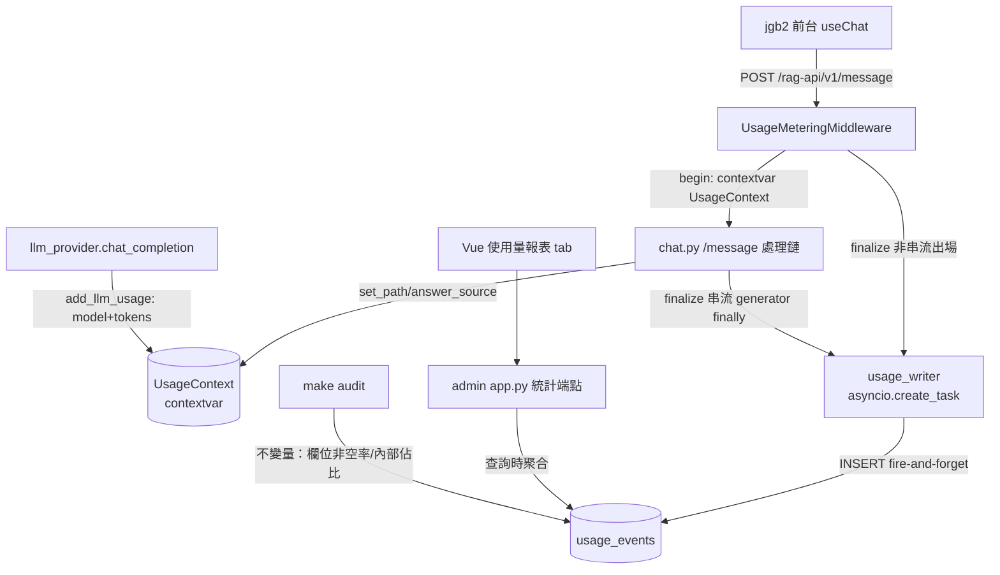
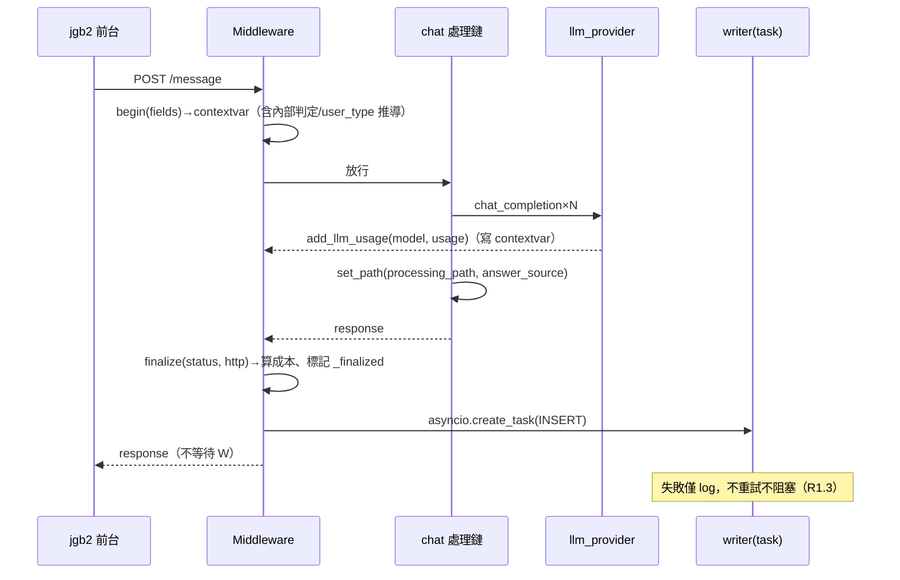

# 技術設計：usage-metering

> 建立時間：2026-07-06　需求文件：requirements.md　研究依據：research.md／gap-analysis.md

## 概述

### 設計目標
每次 AI 客服請求落一筆全維度使用事件（身分×路徑×token 成本），以日粒度統計 API 與後台報表呈現，作為未來計費模型的原料。計量對線上行為零影響（fire-and-forget＋總開關）。

### 範圍與邊界
- 範圍：`/api/v1/message`（含 stream 分支）的事件記錄、查詢時聚合統計、admin API、後台報表 tab、稽核條目、runbook。
- 邊界外：計費金額計算／費率／帳單、legacy `/chat` 端點、jgb2 改動、歷史回補。

## 架構設計

### Architecture Pattern & Boundary Map

沿既有分層：FastAPI middleware（殼）＋ contextvar 歸集（芯）＋ asyncpg fire-and-forget（尾），統計走 admin 後端既有模式。



### Technology Stack & Alignment

| 層級 | 技術 | 對齊 |
|------|------|------|
| 記錄 | FastAPI middleware＋`contextvars`＋asyncpg（`app.state.db_pool`） | loops.py 既有 pool 用法；無新依賴 |
| 事件表 | PostgreSQL `usage_events`（冪等 migration） | migrations 慣例；`conversation_logs` 棄用不動 |
| 統計 | admin `app.py`（psycopg2＋`get_current_user`） | backtest 統計端點同款 |
| 報表 | Vue tab（`UsageStatsView` 或掛既有後台導航） | BacktestView 慣例 |
| 單價 | JSON 設定檔（env `LLM_PRICING_PATH`，內建預設） | research §5-3 |

## Components & Interface Contracts

### 元件 1：UsageContext 歸集器（`services/usage_metering.py`）

**責任**：以 contextvar 承載「本請求」的計量狀態；提供全鏈路寫入 API；`finalize` 冪等（uuid 判重，雙落點只寫一次）。

**介面定義**（Python type hints）：
```python
@dataclass
class UsageContext:
    request_id: str                 # uuid4，冪等鍵
    ts: datetime                    # 進場時間（UTC 存、date_tpe 以 Asia/Taipei 算）
    vendor_id: Optional[int]
    mode: Optional[str]
    target_user: Optional[str]
    user_type: str                  # 寫入時推導：target_user｜b2b+無role_id→prospect｜internal｜unknown
    role_id: Optional[str]
    user_id: Optional[str]
    session_id: Optional[str]
    channel: str = "web"
    is_internal: bool = False
    internal_kind: Optional[str] = None   # backtest|loop|smoke|dev
    message_len: int = 0            # 不存原文（R7）
    processing_path: Optional[str] = None
    answer_source: Optional[str] = None
    status: str = "success"         # success|error
    http_status: Optional[int] = None
    duration_ms: Optional[int] = None
    llm_calls: int = 0
    prompt_tokens: int = 0
    completion_tokens: int = 0
    est_cost_usd: Optional[Decimal] = None   # 單價表缺模型→None（R2.4）
    model_breakdown: dict = field(default_factory=dict)  # {model: {calls,pt,ct}}
    _finalized: bool = False

def begin(request_fields: dict) -> None          # middleware 進場；含內部流量判定
def add_llm_usage(model: str, usage: dict) -> None   # llm_provider 尾端呼叫；無 context 時靜默略過
def set_path(processing_path: str = None, answer_source: str = None) -> None
def finalize(status: str, http_status: int) -> None  # 冪等；算成本；create_task 寫入
def is_enabled() -> bool                          # env USAGE_METERING_ENABLED，預設 true（R8.2）
```

**內部流量判定**（`begin` 內，規則資料驅動可增補，R3.2）：
```python
INTERNAL_RULES = [  # (kind, predicate)
    ("backtest", lambda r: (r.get("session_id") or "").startswith("backtest_")),
    ("backtest", lambda r: r.get("disable_answer_synthesis") or r.get("skip_sop")),
    ("loop",     lambda r: (r.get("session_id") or "").startswith(("loop_", "kcl_"))),
    ("smoke",    lambda r: (r.get("session_id") or "").startswith(("smoke_", "verify_", "probe_", "demo_", "fp_", "reg_", "vgap"))),
]
```

**與需求對應**：R1.1-1.5、R2.3-2.5、R3.1-3.2、R8.2。

### 元件 2：Middleware＋落點掛線

**責任**：路徑白名單（`/api/v1/message`）進場 `begin`／出場 `finalize`；串流分支由 generator `finally` 呼叫 `finalize`（冪等使雙落點安全）。

**掛線點（全部 ≤5 行侵入）**：
- `main.py`（或 chat router 所在 app）：`app.middleware("http")` 白名單包裝。
- `llm_provider.chat_completion`：回傳前 `usage_metering.add_llm_usage(model, resp['usage'])`。
- `chat.py`：回應構建處 `set_path(...)`（非串流一處＋串流 generator 一處）；串流 generator `finally: finalize(...)`。

**與需求對應**：R1.1-1.3、R8.1。

### 元件 3：`usage_events` 表（migration `add_usage_events.sql`）

```sql
CREATE TABLE IF NOT EXISTS usage_events (
    id             BIGSERIAL PRIMARY KEY,
    request_id     UUID UNIQUE NOT NULL,          -- 冪等鍵（雙落點防重）
    ts             TIMESTAMPTZ NOT NULL,
    date_tpe       DATE NOT NULL,                 -- Asia/Taipei 日界（寫入時算）
    vendor_id      INTEGER,
    mode           VARCHAR(10),
    target_user    VARCHAR(30),
    user_type      VARCHAR(20) NOT NULL,          -- tenant|property_manager|prospect|internal|unknown
    role_id        VARCHAR(50),
    user_id        VARCHAR(100),
    session_id     VARCHAR(120),
    channel        VARCHAR(20) NOT NULL DEFAULT 'web',
    is_internal    BOOLEAN NOT NULL DEFAULT FALSE,
    internal_kind  VARCHAR(20),
    message_len    INTEGER NOT NULL DEFAULT 0,
    processing_path VARCHAR(60),
    answer_source  VARCHAR(40),
    status         VARCHAR(10) NOT NULL,          -- success|error
    http_status    SMALLINT,
    duration_ms    INTEGER,
    llm_calls      SMALLINT NOT NULL DEFAULT 0,
    prompt_tokens  INTEGER NOT NULL DEFAULT 0,
    completion_tokens INTEGER NOT NULL DEFAULT 0,
    est_cost_usd   NUMERIC(10,6),
    model_breakdown JSONB
);
CREATE INDEX IF NOT EXISTS idx_usage_date_vendor ON usage_events (date_tpe, vendor_id, is_internal);
CREATE INDEX IF NOT EXISTS idx_usage_session ON usage_events (session_id);
```

**與需求對應**：R1.1、R2.1-2.2、R7.1、R8.3。被遺忘權（R7.4）：`UPDATE usage_events SET user_id=NULL, role_id=NULL WHERE user_id=$1`（計數欄不動）。

### 元件 4：統計 API（admin `app.py`）

```
GET /api/usage/stats?date_from&date_to&vendor_id[]&user_type&include_internal&granularity=day|month
→ { "groups": [ {date|month, vendor_id, vendor_name, user_type, channel,
                 messages, sessions, distinct_users,
                 prompt_tokens, completion_tokens, est_cost_usd, errors} ],
    "totals": {...同量值...} }
GET /api/usage/export.csv?...同參數        # UTF-8 BOM（R6.3）
```
- 認證：`Depends(get_current_user)`；不回傳 user_id 明細（R5.3）。
- `sessions`＝`COUNT(DISTINCT session_id)`；跨日 session 歸屬首事件日（R2.2）＝group by 該 session 首事件之 date_tpe——實作以視窗/子查詢，EXPLAIN 驗證（tasks）。
- 參數非法／區間超過保留期→400（R5.4）。

### 元件 5：報表頁（Vue tab）

- 期間（預設本月）／業者多選／user_type 分列／日‧月切換／內部流量開關（預設關）。
- 呈現：業者排行（訊息/對話/成本）、日趨勢、user_type 佔比、CSV 匯出鈕。
- 掛在後台既有導航（與 Backtest 平行的新 tab 或選單項——實作時依現有導航結構取最小改動）。

**與需求對應**：R6.1-6.4。

### 元件 6：稽核與清理

- `check_invariants.sh` 新增不變量 5（WARN 級起步）：近 24h `usage_events` 中 `vendor_id IS NULL AND is_internal=false` 佔比 >5% 警示（維度缺失雷達）；`is_internal=false` 之 `session_id` 帶已知內部前綴＝FAIL（漏標鐵證）。
- 保留期：env `USAGE_RETENTION_MONTHS`（預設 18）；提供冪等清理 SQL（`DELETE ... WHERE ts < now() - interval`），排程化掛帳（R7.3）。

**與需求對應**：R8.4-8.5、R3.3-3.4（重標：提供按規則 UPDATE 的冪等 SQL 模板）。

## 資料流（非串流主路徑）



## 錯誤處理

| 情境 | 行為 | 需求 |
|---|---|---|
| 寫入失敗/pool 滿 | log warning，事件丟棄 | R1.3 |
| 請求 5xx/例外 | middleware except 路徑仍 finalize(status='error') | R1.2 |
| 單價表缺模型 | tokens 記、est_cost_usd=NULL | R2.4 |
| 計量開關關 | begin 即 no-op，全鏈零行為 | R8.2 |
| contextvar 不存在（非 /message 路徑呼叫 add_llm_usage） | 靜默略過 | 邊界防呆 |

## 測試策略（TDD 先紅後綠）

| 層 | 案例 |
|---|---|
| unit：歸集器 | begin/add/finalize 冪等；token 合計＝各呼叫總和（R2.5）；內部流量判定表驅動（各前綴/旗標）；user_type 推導矩陣；成本計算與缺模型留空；開關關閉 no-op |
| unit：統計 SQL | 聚合正確性（訊息/session 去重/跨日歸屬）；零值日（R4.4）；參數驗證 |
| integration | middleware 掛真 app：一次 /message 落一筆、欄位齊；例外請求落 error 事件；串流分支落一筆不重複 |
| e2e/回歸 | 既有 e2e 全綠（R8.1）；迴圈跑後 internal 事件出現（R8.5）；`make audit` 新條目 |

## 部署（併 `docs/deployment-runbook.md`）

1. migration `add_usage_events.sql`（冪等）
2. 服務版更（middleware/llm_provider/chat 掛線＋admin 端點）＋前端 `npm run build`
3. env：`USAGE_METERING_ENABLED`（預設 true）、`LLM_PRICING_PATH`（可省用內建）、`USAGE_RETENTION_MONTHS`
4. 驗證：真打一句→`SELECT` 事件到位；跑一題回測→`is_internal=true`；`make audit` 全綠

## 需求覆蓋對照

| 需求 | 元件 |
|---|---|
| R1.1-1.5 | 元件 1/2/3 |
| R2.1-2.5 | 元件 1/3/4＋單價設定 |
| R3.1-3.4 | 元件 1（INTERNAL_RULES）/6（重標 SQL） |
| R4.1-4.4 | 元件 4（查詢時聚合） |
| R5.1-5.4 | 元件 4 |
| R6.1-6.4 | 元件 5 |
| R7.1-7.4 | 元件 1（不存原文）/3（被遺忘權 UPDATE）/6（保留期） |
| R8.1-8.5 | 元件 1（開關）/6（稽核）＋測試策略＋部署節 |
