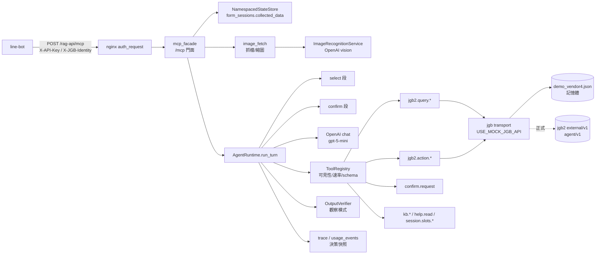
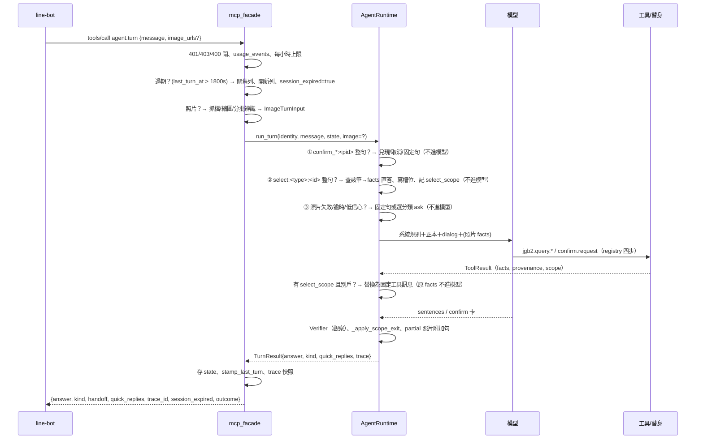

# Agentic MCP 對話線架構（demo 版，2026-09-08 上線）

> 讀者：要改這條線的工程、要接它的 line-bot、要驗它的稽核。
> 對象：`rag-orchestrator/services/agent/**`＋`/mcp` 門面。舊鏈（REST `/api/v1/message`、SOP、面向）不在本文，見 `COMPLETE_CONVERSATION_ARCHITECTURE.md`。
> 事實紀律：每個機制都附可 grep 的符號；行號會漂，⛔ 不當事實。決策依據在 `.claude/DECISIONS.md` DSP-011／037～042、demo 帳本 `.kiro/specs/knowledge-outline-and-intent-architecture/inputs/demo-ledger-line-oa-20260907.md` §1b。

## 0. 一句話

LINE 業務（房東管家）的一句話進 `/mcp` 的 `agent.turn`，Runtime 先用**程式**處理三種機器值（清單點選、確認按鈕、過期），其餘交模型在封閉工具清單裡查 JGB 替身資料；要寫入一律先出確認卡、按了才兌現；答案在 `grounding_observe` 模式的 Verifier 下**只有引用類只記不擋**，極性類與機敏類照擋（W6-b3，2026-09-09 落地）。

## 1. 元件與責任

| 元件 | 檔案（符號） | 責任 | ⛔ 不做 |
|---|---|---|---|
| 門面 | `services/agent/mcp_facade.py`（`build_asgi_app`、`AGENT_TURN_SPEC`、`_agent_turn`、`AgentTurnOutput`、`check_and_record_agent_turn`） | 驗 key／Origin／身分 header、命名空間 `mcp:{api_key_id}:{vendor_id}:{session_id}`、每呼叫一列 `usage_events`、每小時上限、照片前處理、會話過期、呼叫 Runtime | 不判授權（DSP-011：授權由 JGB API 依 role 收口） |
| 狀態 | `services/agent/state_store.py`（`NamespacedStateStore`、`stamp_last_turn`、`is_expired`、`SESSION_IDLE_TTL_S`） | 對話歷史、槽位、待確認表、過期戳，落 `form_sessions.collected_data` | 不存 token、不存照片 |
| Runtime | `services/agent/runtime.py`（`AgentRuntime.run_turn`、`_run_confirm_segment`、`_run_select_segment`、`_enforce_tool_scope`、`_apply_scope_exit`、`_scope_gate_confirm_request`、`_begin_pending_confirm`、`_finalize`） | 機器值程式段、模型迴圈、工具結果包裝、範圍守門、固定句、trace | 不讓模型判「同一戶」「同意詞」 |
| 工具註冊 | `services/agent/tools/registry.py`（`ToolRegistry.call`、`register`、`_validate_value`、`ToolError`） | 四步：可見性（stage×旗標）、速率、schema、執行；寫入工具強制 `mcp_only`＋已兌現 | schema 只有 `maxLength/enum/required/additionalProperties`，⛔ 無 `maxItems/pattern` |
| 查詢工具 | `services/agent/tools/jgb2.py`（`query_bills/contracts/estates/meters/repairs/accounts`、`_ok_single` 帶 `scope.estate_id`） | face 封閉列舉、ref／keyword 縮小、facts 由 formatter 決定性組句 | 不讓模型算數字（逾期天數程式算） |
| 寫入工具 | `services/agent/tools/action.py`（`bill_due_extend`、`repair_create`、`_resolve_estate`、`_resolve_category`） | 形狀→範圍讀→寫；冪等鍵＝確認 token；分類缺值歸「其他」、急迫缺值 1 | 不模糊比對物件／分類 |
| 確認卡 | `services/agent/tools/confirm.py`（`confirm_request`、`_is_valid_repair_category`、`open_repairs` 注入）、`services/agent/confirm_card.py`（`render`、`category_name_of`、`emergency_status_of`） | 卡文字由程式依 action＋payload 決定性產出；雜湊綁卡；卡外 `hint` | 模型 summary 不上卡 |
| 照片 | `services/agent/image_fetch.py`、`services/image_recognition_service.py`、`services/s3_image_service.py`（`downscale_image`） | 抓 relay 簽章網址（硬邊界）、縮圖去 EXIF、分批辨識、決定性驗證輸出 | bytes 不落地、不進任何紀錄；描述硬留空 |
| Verifier | `services/agent/verifier.py`（`OutputVerifier`、`_is_observed`、`_ref_failures`、`_verify_routes`）、`app.py`（`_wrap_verifier_observe_only` 只交模式的相容層） | **模式感知在 `verify()` 內部**：觀察類記進 `verdict.observed` 後**繼續跑後面的類**、照擋類立刻擋（DSP-040／W6-b3） | `observe_only` 只在 `USE_MOCK_JGB_API=true` 允許（否則啟動 raise）；`grounding_observe` 配真 API ⇒ 健檢紅旗 |
| 規則與正本 | `services/agent/agent_rules.py`（`_POLICY_TEXT_NON_PROSPECT`）、`canon/property_manager.md`（2026-09-08.4）＋`.json` | 模型每回合看到的定義句與受眾正本 | 只寫定義不寫例子 |
| 健檢 | `services/agent/health.py`（`verifier_mode`） | `write_tools_enabled`、`use_mock_jgb_api`、`verifier_mode`、`verifier_observe_only`（保留鍵）、`image_recognition{…}` | `grounding_observe`×非 mock ⇒ `premise.red_flags` |

## 2. 一回合的路徑（`agent.turn`）

**`outcome`（DSP-043）**：第七鍵 `{state, expects, action, ref}`，`state` 八態（answered／clarifying／confirm_pending／confirmed／cancelled／failed／handoff／out_of_scope）由各出口程式設、一般出口依 `kind`／`quick_replies` 導出（`runtime.make_outcome`／`default_outcome`／`receipt_ref`）；呼叫端只看它決定畫面。

**三個程式段永遠先於模型**（`run_turn` 內順序：confirm → select → image 終止路徑 → 模型迴圈），這是「機器值不承載意圖」的實作：按鈕與點選不需要模型理解，也不讓模型看到 pid／id 原值。

## 3. 寫入鏈（延到期日、開修繕單）

1. 模型呼叫 `confirm.request(summary, payload)`；handler 驗 payload 形狀（`confirm_card.render`）、分類是否在樹內（缺值放行）、發 token（DB 只存雜湊與 `pending_id`）、回卡文字＋三顆 `quick_replies`（`confirm_submit|edit|cancel:<pending_id>`）；卡外附 `hint`（同物件未結單）。
2. Runtime `_begin_pending_confirm` 把 `{action, payload, card_sha256, estate_id}` 存 `agent_state["pending_confirm"][pid]`，回合以 `kind=ask` 結束。
3. 使用者按鍵 ⇒ 下一回合整句等值匹配 ⇒ `_run_confirm_segment`：`redeem_pending(session_id, pid)` 先燒 token、比對卡雜湊 ⇒ `registry.call(jgb2.action.<x>, {payload, confirmation_token})` ⇒ 工具內 `assert_redeemed` 再驗一次 ⇒ 寫替身／JGB ⇒ `receipt` 存回 pending（重送回同一 receipt，R4.3）。
4. 失敗誠實回固定句；取消燒 token 不覆蓋既有 receipt；pid 不在本 session（含過期後舊鍵）⇒ 固定句「這筆確認已失效」。
5. 有 `select_scope` 時 `_scope_gate_confirm_request` 先比物件（報修比 `estate_id`、延期現查該帳單物件），別戶不建 pending。

## 4. 邊界與紀律（誰擋什麼）

| 面 | 機制 | 符號 |
|---|---|---|
| 呼叫者 | key（無條件 401）、Origin 三態、身分 header fail-closed | `mcp_facade.parse_identity`、`check_origin`、`load_allowed_origins` |
| 授權 | 不在本系統；查詢帶呼叫者 `role_id`／`user_id` 交 JGB API 收口；不存在與不在範圍同一句「查無此筆」 | DSP-011；`SELECT_NOT_FOUND_TEXT` |
| 別戶 | 清單點選後以 `estate_id` 等值程式判定；候選過濾、單列替換、寫入閘；聊天進場不設限（正本） | `_enforce_tool_scope`、`SCOPE_EXIT_TEXT`、`_SELECT_DEFAULT_FACE`（最小揭露 face，⛔ 無 email／電話） |
| 寫入 | 旗標×stage 可見；`mcp_only`；token 單次、雜湊綁卡、冪等鍵 | `registry.register` 強制、`redeem_pending`、`assert_redeemed` |
| 機敏 | **W6-b3（2026-09-09）落地後**：demo 線上值改 `AGENT_VERIFIER_MODE=grounding_observe` ⇒ `SENSITIVE_TOPIC`／`ROUTE_NOT_ALLOWED`／`FORBIDDEN_TERM`／`POLARITY_MISMATCH`／`SCHEMA` 的安全子成因（`marker_in_answer`／`handoff_reason_*`／`ask_target_invalid`／`empty_*`）**照擋**；只有引用解析與涵蓋類（`UNCITED_ASSERTION`／`QUOTE_TOO_SHORT`／`QUOTE_NOT_COVERING`／`SOURCE_NOT_CITABLE`＋`SCHEMA` 的 `ref_*`／`unit_out_of_range`）記進 `verdict.observed` 不擋。模式感知在 `verify()` **內部**、觀察類記錄後繼續跑（`grep -n "def _is_observed" rag-orchestrator/services/agent/verifier.py`）——⛔ 外層不再翻判定，那個作法會讓先命中的引用類把機敏類整段跳過。`observe_only`（＝舊旗語義）仍是全部放行、且只准配替身。清單點選 facts 出口另外直呼 `_verify_routes`（`grep -n "verify_routes = getattr" rag-orchestrator/services/agent/runtime.py`），那條一直都擋。 | `verifier.OutputVerifier.verify`／`_is_observed`、`health.verifier_mode`、`config/agent_verifier_rules.json` |
| 照片 | 白名單等值主機、https、不跟轉址、私網 IP 拒、5 MB 串流硬閘、型別驗證、去 EXIF、bytes 不落地、描述硬留空 | `image_fetch.validate_image_url`／`fetch_image`、`downscale_image` |
| 額度 | 每呼叫一列 `usage_events`（內部 key 不計額度）；`RATE_PER_MIN` 60、`AGENT_TURN_CAP` 120／時、照片 200 張／時（皆行程內） | `_check_and_record_rate`、`check_and_record_agent_turn`、`check_and_record_image_count` |
| 紀錄 | trace／決策快照只有結構化欄位（白名單守測 21 鍵）；dialog 只寫程式摘要或卡文字；token、照片、ref 原值不進 trace | `_emit_agent_decision`、`DECISION_BANNED_KEYS`、不變量 27–31 |

## 4b. 回合出口與「為什麼轉人」——對碼事實表（2026-09-09）

> 動機：2026-09-09 我把「答案被 Verifier 打回所以轉人」講成線上原因，業主指出線上是觀察模式。這一節把「誰決定轉人」寫死，每句附查證指令；⛔ 引用時先跑指令再說。

**A. 轉人是誰決定的（四個來源）**

| 來源 | 觸發 | 使用者看到 | 查證 |
|---|---|---|---|
| 模型自報 | 模型輸出 `kind=handoff`＋`handoff_reason=no_grounding`／`sensitive_no_grounding`（值域見 `HandoffReason`） | `PRESALES_HANDOFF_MESSAGE`（「這題我這邊沒有可靠資料，幫您轉專人——點下方的『找真人』。」，`effective_handoff_message(None)`） | `grep -n "class HandoffReason" rag-orchestrator/services/presales_gate.py`；`grep -n "PRESALES_HANDOFF_MESSAGE" rag-orchestrator/services/conversational_config.py rag-orchestrator/services/agent/tools/handoff.py` |
| 預算耗盡 | Verifier **擋**（非觀察模式）兩次改寫仍不過 ⇒ `handoff_reason=budget_exhausted` | 同上固定句 | log 行 `agent_turn trace_id=… kind=handoff handoff_reason=budget_exhausted … verifier_rejects=2` |
| 範圍退出 | 清單點選會話問別戶（L15） | `SCOPE_EXIT_TEXT` | `grep -n "def _apply_scope_exit" rag-orchestrator/services/agent/runtime.py` |
| 程式降級（S4，2026-09-09） | 模型自報 `no_grounding` 但零工具呼叫、無範圍、非敏感類 ⇒ **不轉人**，改追問 `ASK_TARGET_TEXT` | 「想處理哪一戶或哪一筆？…」 | `grep -n "def _apply_handoff_without_lookup" rag-orchestrator/services/agent/runtime.py` |

**B. 線上（demo）到底擋不擋：`AGENT_VERIFIER_MODE=grounding_observe`（runbook §20-2；W6-b3 於 2026-09-09 落地）**

- 讀值點唯一：`health.verifier_mode()`（含相容舊旗 `AGENT_VERIFIER_OBSERVE_ONLY` ⇒ `observe_only`，一版後移除）。查證：`grep -n "def verifier_mode" rag-orchestrator/services/agent/health.py`。
- 效果：**引用解析與涵蓋類只記錄**（記進 `VerifierVerdict.observed`，評估繼續往下跑），**主題錨定極性（`polarity_source=pair`，「尚未逾期」對「已逾期 8 天」）與機敏類照擋**；**裸否定詞表極性（`polarity_source=term`）只記錄**——2026-09-09 誤殺量測：裸詞表對稱整段比對在 98 句裡命中 12、幾乎全假陽性（引文側含否定詞、多 ref 一側缺否定詞），曾造成 7 回合預算耗盡轉人。查證：`grep -n "polarity_source" rag-orchestrator/services/agent/verifier.py`。查證：`grep -n "_GROUNDING_OBSERVE_REASONS\|_GROUNDING_OBSERVE_SCHEMA_CAUSES" rag-orchestrator/services/agent/verifier.py`。
- `app._wrap_verifier_observe_only` 只剩**相容層**：交模式、守 `observe_only` 只准配替身，⛔ 不再包 `verify()`、不再翻判定。查證：`grep -n "def _wrap_verifier_observe_only" rag-orchestrator/app.py`。
- 因此線上**可能**出現 `budget_exhausted` 轉人了（極性／機敏類擋兩次）——這是刻意的：那正是「尺在守什麼」看得見的地方。B 段 2026-09-09 之前的實證（24 回合 `agent_verifier_reject` 0 次）是**舊組態**的數字，⛔ 不得再引用為現況。
- 前一版的「衝突待裁」（帳本 R8 說機敏類照擋、程式卻全放行）**已由本次落地消解**：現在程式與帳本一致。

**C. 模型為什麼傾向轉人（提示詞層，觀察模式改變不了）**

- 鐵則：「只講工具回傳內容裡能引用的事實；沒有工具佐證的事實一律不說」、「`kind=fact` 的句子要有 `refs`」。查證：`grep -n "沒有工具佐證的事實一律不說\|要有 \`refs\`" rag-orchestrator/services/agent/agent_rules.py`。判斷題沒有可引用事實 ⇒ 依規則不說 ⇒ 剩轉人。
- 2026-09-09 前【判準】只定義「資料段與工具都查無 ⇒ `no_grounding`」，沒有「缺對象先問」「判斷題依資料段給建議」「查無先確認編號」；S4 補了這三句定義。查證：`grep -n "判斷句與指令句先確定對象" rag-orchestrator/services/agent/agent_rules.py`。
- 已知：提示詞越長模型越傾向先轉人（`agent_rules.py` 檔頭註解的回歸實測）。

**D. 尺的版本（r2／r3／DSP-039）是 Verifier 的事，不是提示詞的事**

| 名稱 | 意思 | 現況 |
|---|---|---|
| r2 | Verifier 引用類判定照擋（`UNCITED_ASSERTION`／`QUOTE_NOT_COVERING`…） | 業主 R8 停用 |
| r3 觀察模式 | 引用類只記不擋 | **線上 demo 組態**＝`AGENT_VERIFIER_MODE=grounding_observe`（引用類觀察、其餘照擋，見 B） |
| DSP-039 值級尺 | 工具事實片段以值級比對 | 備援，未啟用 |
| W6-b3 `AGENT_VERIFIER_MODE` | 引用類觀察＋極性與機敏類照擋的正式參數（三態；`observe_only` 為舊旗語義） | **已落地（2026-09-09）**；`self_test` 釘死 `enforce` 不受旗影響 |

**E. 怎麼判讀一回合**：看 log 行 `agent_turn trace_id=<id> kind=<kind> handoff_reason=<reason> tool_calls=<n> verifier_rejects=<n> llm_calls=<n>`——`kind=handoff` 且 `verifier_rejects=0` ⇒ 模型自選；`tool_calls=0` ⇒ 它一個查詢都沒做；`handoff_reason=budget_exhausted` ⇒ 是 Verifier 擋出來的（`grounding_observe` 下**仍可能出現**——擋的是極性類或機敏類；只有 `observe_only` 才不會出現）。

## 5. 資料落點

| 資料 | 位置 | 保留 |
|---|---|---|
| 對話歷史、槽位、待確認表（含 receipt、estate_id）、`last_turn_at`、`select_scope` | `form_sessions.collected_data`（命名空間鍵） | 隨會話；過期關列（`state='COMPLETED'`） |
| 確認 token | `agent_confirmation_tokens`（雜湊、`pending_id`、卡雜湊、TTL） | 兌現即燒 |
| 用量 | `usage_events`、`openai_cost_tracking`（`operation='image_recognition'`） | 計量 |
| trace | 決策快照（`/api/v1/agent/trace/{trace_id}`） | 結構化欄位 |
| 替身寫入 | 行程記憶體（`services/jgb/transport.py`） | 重啟歸零 |

## 6. 組態（demo 值；正式站 `.env`，見 runbook §20）

| 鍵 | demo | 說明 |
|---|---|---|
| `USE_MOCK_JGB_API` | true | 整站替身；`false` 需 `JGB_API_KEY`（S-5 刻意 raise） |
| `AGENT_STAGE`／`AGENT_TURN_ENABLED` | M1／true | 工具面可見與 `agent.turn` 註冊 |
| `AGENT_WRITE_TOOLS_ENABLED` | true | `jgb2.action.*` 可見（AND stage） |
| `AGENT_VERIFIER_MODE` | grounding_observe | 正式參數（DSP-040／W6-b3）：`enforce`（預設）／`grounding_observe`（引用類觀察、極性與機敏類照擋）／`observe_only`（全部觀察，只在 mock 允許、否則啟動 raise）。`grounding_observe`×非 mock ⇒ 健檢 `premise.red_flags` 記紅但不阻起 |
| `AGENT_VERIFIER_OBSERVE_ONLY` | 不設 | **相容旗，一版後移除**：truthy ⇒ 解析成 `observe_only`；`AGENT_VERIFIER_MODE` 有設時它說了不算 |
| `AGENT_MODEL`／`AGENT_REASONING_EFFORT` | gpt-5-mini／low | 對話模型 |
| `IMAGE_RECOGNITION_MODEL` | gpt-4o（R12，覆寫 compose 預設 mini） | 照片辨識 |
| `IMAGE_URL_ALLOWLIST`／`IMAGE_MAX_BYTES`／`IMAGE_COUNT_CAP_PER_HOUR` | relay.jgbsmart.com／5,000,000／200 | 照片硬邊界；白名單空＝關 |
| `AGENT_BUDGET_DEADLINE_S`／`AGENT_TURN_TIMEOUT_S` | 45／60 | 回合預算／門面逾時 |
| `UVICORN_WORKERS` | 1 | `/mcp` 與行程內計數需單 worker |
| `MCP_ALLOWED_ORIGINS` | `-` | 伺服器對伺服器不送 Origin |

⛔ 不設 `AGENT_BUDGET_REWRITES=0`（探針組態）、不設 `AGENT_ATTEMPT_LOG_PATH`（開發量測；W6-b3 起它會多記引文原文 `resolved_unit` 與 `observed`，供極性誤殺量測逐句人看——**線上一律不設**）。

## 7. 測試層

| 層 | 位置 | 跑法 |
|---|---|---|
| unit（假 API、假模型、真 registry） | `tests/unit/agent/test_*_req.py`（select／scope／confirm／expired／image） | `./scripts/run-tests.sh unit tests/unit/agent -q`（1419） |
| integration（真 DB） | `tests/integration/agent/`（token、select 槽位） | `./scripts/run-tests.sh integration …` |
| 真線路（一次性、gate） | `tests/integration/agent/test_image_real_req.py`（`RUN_REAL_OPENAI=1`） | 素材不進 repo |
| 情境回測 | 帳本 §1h 劇本（LIFF 21、W6 36、L15 六）；harness 在 scratchpad | 隔離實例 `smoke-rag`＋內部 key |
| 稽核 | `scripts/audit/check_invariants.sh`（不變量 27–31 為本線） | `make audit` |

## 8. 已知限制（demo 期）

- 線⑤ 模型偶爾在有工具結果時自判「無依據」轉人（三輪 2/21 情境不穩）；屬答案層定義文（5.1）範圍。
- `AGENT_VERIFIER_MODE=grounding_observe`（線上值）下引用類不擋——模型講的事實**沒有被要求對得上引文**，只有極性、機敏、標記外洩、schema 契約這幾類在守；重開引用類的依據是觀察紀錄（`verdict.observed`）中「真該擋」的計數（DSP-040 絆線）。相容旗 `AGENT_VERIFIER_OBSERVE_ONLY` 一版後移除。
- 照片線的 LIFF 五案尚未在 `/mcp` 端到端跑（等 relay 簽章網址）；`scope_exit` 機器可讀鍵未加；confirm 卡回合不接指路句（A1）。
- 速率與配額為行程內計數（單 worker 正確；多 worker 會乘倍）。
- 替身寫入只在記憶體；正式 `agent/v1` 簽章 client 與 JGB 端 `PATCH bills`、冪等、更新權限為 demo 後切片（需求文 `inputs/jgb-api-needs-line-oa-demo-20260907.md`）。
