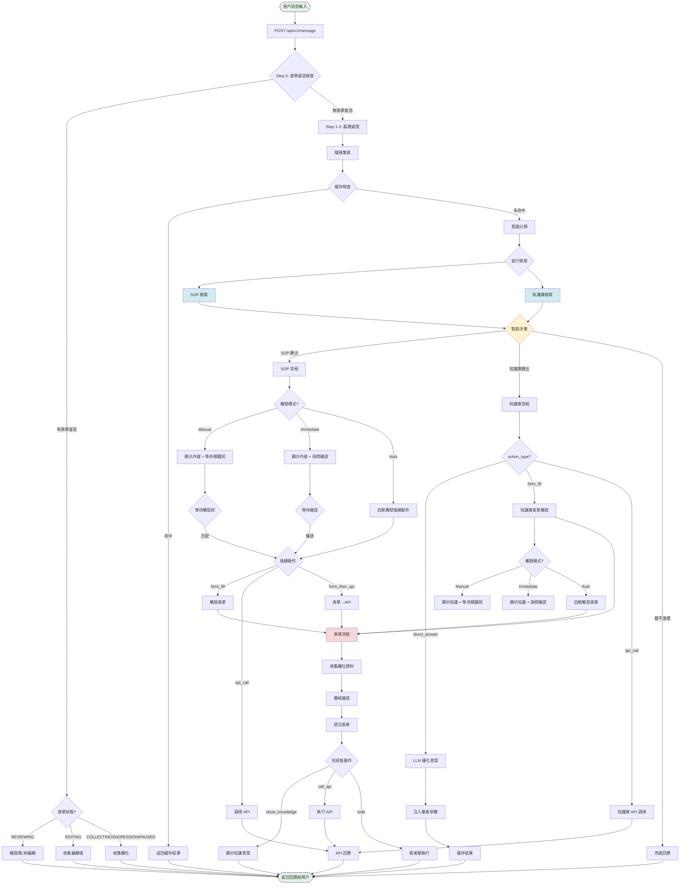
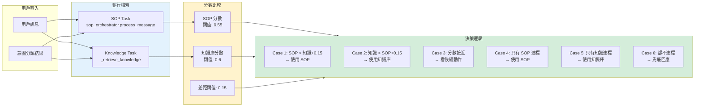
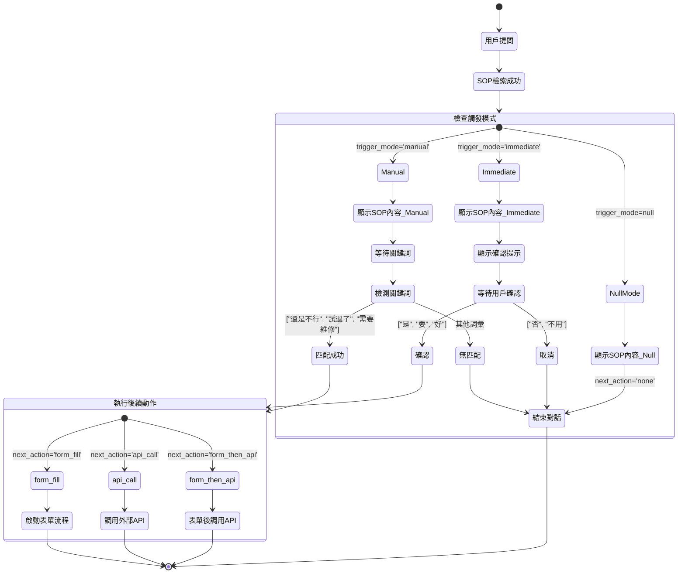
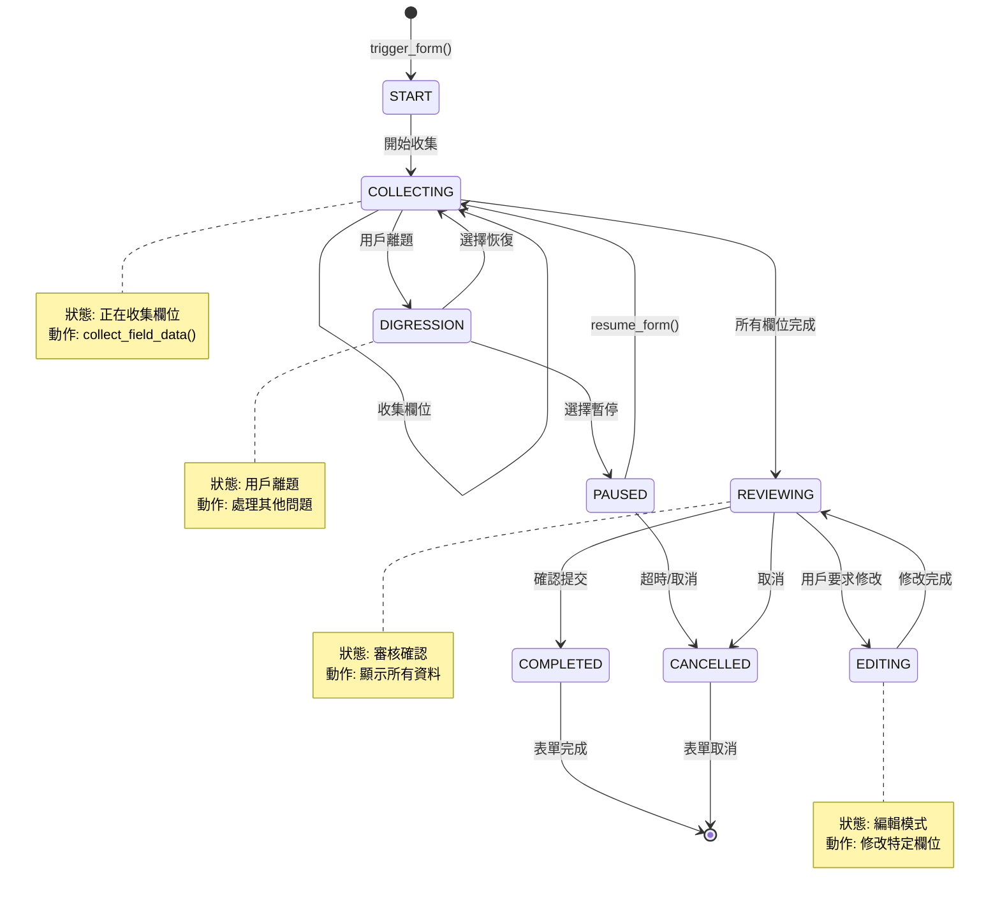
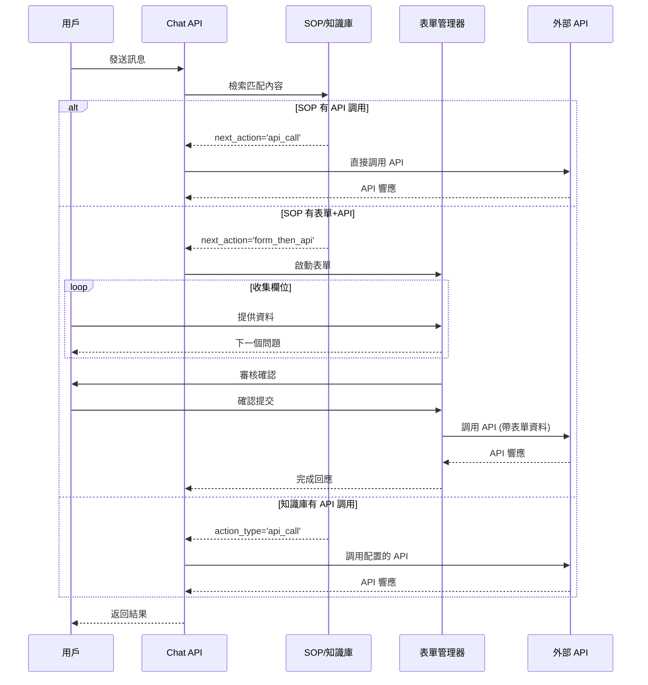
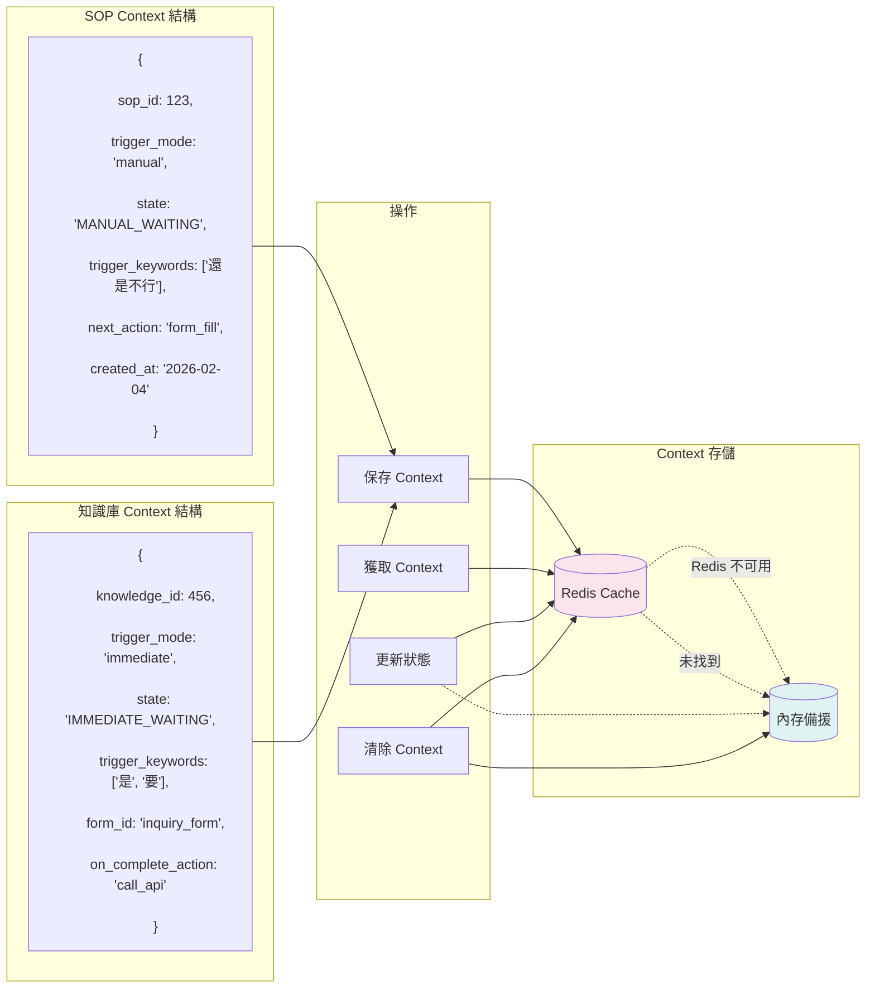
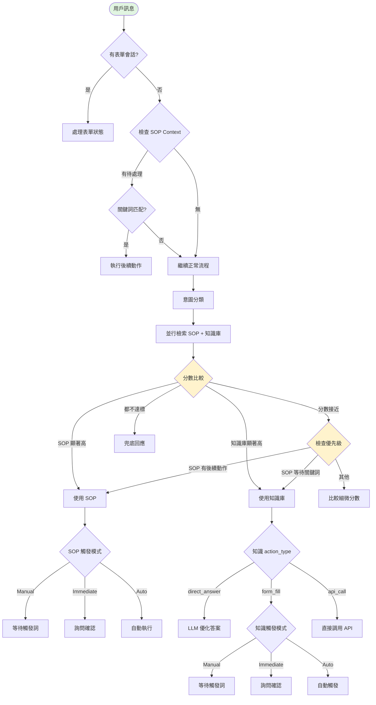
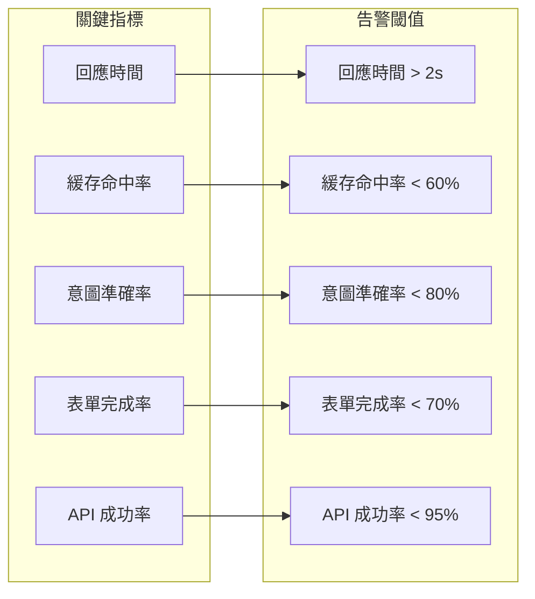

# 🏗️ AIChatbot 完整對話架構圖
**最後更新**: 2026-02-04
**版本**: 1.0
**類型**: 完整架構文件（含圖示）

---

## 📊 1. 總體對話架構流程圖



---

## 🔄 2. SOP 與知識庫並行檢索決策機制



---

## 🎯 3. SOP 觸發模式詳細流程



---

## 📝 4. 表單生命週期狀態機



---

## 🔌 5. API 調用流程



---

## 🎨 6. 知識庫表單觸發流程（2026-02-03 新增）

```mermaid
flowchart TB
    subgraph KnowledgeRetrieval[知識庫檢索]
        Query[用戶查詢]
        Search[向量搜尋 + 意圖過濾]
        Match{找到匹配?}
    end

    Query --> Search
    Search --> Match

    Match -->|是| CheckAction{檢查 action_type}
    Match -->|否| NoMatch[無結果]

    CheckAction -->|direct_answer| DirectAnswer[直接回答]
    CheckAction -->|form_fill| FormTrigger{檢查 trigger_mode}
    CheckAction -->|api_call| DirectAPI[直接調用 API]
    CheckAction -->|form_then_api| FormThenAPIFlow[表單→API]

    FormTrigger -->|NULL/auto| AutoForm[自動觸發表單]
    FormTrigger -->|manual| ManualFlow[Manual 流程]
    FormTrigger -->|immediate| ImmediateFlow[Immediate 流程]

    subgraph ManualProcess[Manual 處理]
        ManualFlow --> ShowKnowledge1[顯示知識內容]
        ShowKnowledge1 --> AddPrompt1[添加觸發提示]
        AddPrompt1 --> SaveContext1[保存 Context]
        SaveContext1 --> WaitKeyword1[等待關鍵詞]
        WaitKeyword1 -->|"是"/"要"| TriggerForm1[觸發表單]
        WaitKeyword1 -->|其他| Continue1[繼續對話]
    end

    subgraph ImmediateProcess[Immediate 處理]
        ImmediateFlow --> ShowKnowledge2[顯示知識內容]
        ShowKnowledge2 --> AskConfirm[詢問是否需要表單]
        AskConfirm --> SaveContext2[保存 Context]
        SaveContext2 --> WaitConfirm2[等待確認]
        WaitConfirm2 -->|"是"/"要"| TriggerForm2[觸發表單]
        WaitConfirm2 -->|"否"/"不用"| Continue2[結束]
    end

    AutoForm --> FormSession[創建表單會話]
    TriggerForm1 --> FormSession
    TriggerForm2 --> FormSession
    FormThenAPIFlow --> FormSession

    FormSession --> CollectData[收集表單資料]
    CollectData --> FormComplete{表單完成}

    FormComplete --> OnCompleteAction{on_complete_action?}
    OnCompleteAction -->|show_knowledge| ShowResult[顯示知識答案]
    OnCompleteAction -->|call_api| CallConfigAPI[調用配置的 API]
    OnCompleteAction -->|both| BothAction[兩者都執行]

    style ManualProcess fill:#e8f5e9
    style ImmediateProcess fill:#e3f2fd
    style FormSession fill:#fff3e0
```

---

## 🔐 7. Context 管理機制



---

## 📊 8. 完整決策樹



---

## 🏷️ 9. 系統角色與職責

| 組件 | 職責 | 關鍵決策點 |
|------|------|-----------|
| **Chat Router** | 主入口，協調整體流程 | 表單優先、SOP 優先、分數比較 |
| **SOP Orchestrator** | SOP 檢索與觸發管理 | 觸發模式判斷、關鍵詞匹配 |
| **Knowledge Retriever** | 知識庫檢索與過濾 | 向量相似度、意圖匹配 |
| **Form Manager** | 表單生命週期管理 | 狀態轉換、欄位驗證 |
| **Intent Classifier** | 意圖識別 | 多意圖支援、信心度評估 |
| **LLM Optimizer** | 答案優化與合成 | 合成策略、參數注入 |
| **Cache Service** | 三層緩存管理 | 緩存命中、過期策略 |
| **API Handler** | 外部 API 調用 | 重試機制、錯誤處理 |

---

## 🎯 10. 關鍵參數配置

```yaml
# 分數閾值
SOP_MIN_THRESHOLD: 0.55          # SOP 最低分數
KNOWLEDGE_MIN_THRESHOLD: 0.6     # 知識庫最低分數
SCORE_GAP_THRESHOLD: 0.15        # 顯著差距閾值

# 優化閾值
PERFECT_MATCH_THRESHOLD: 0.90    # 完美匹配閾值
SYNTHESIS_THRESHOLD: 0.80        # 答案合成閾值
HIGH_QUALITY_THRESHOLD: 0.80     # 高質量閾值

# 觸發配置
DEFAULT_TRIGGER_KEYWORDS:         # 預設觸發關鍵詞
  - "是"
  - "要"
  - "好"
  - "確認"

CANCEL_KEYWORDS:                  # 取消關鍵詞
  - "否"
  - "不用"
  - "取消"
  - "算了"

# Context 配置
CONTEXT_TTL: 3600                 # Context 存活時間（秒）
CONTEXT_STORAGE: "redis"          # 存儲方式（redis/memory）

# 表單配置
FORM_SESSION_TIMEOUT: 1800        # 表單會話超時（秒）
MAX_FORM_FIELDS: 20               # 最大欄位數
DIGRESSION_THRESHOLD: 0.7        # 離題判定閾值
```

---

## 📈 11. 性能優化點

1. **並行檢索**: SOP 和知識庫同時檢索，減少延遲
2. **三層緩存**: 問題緩存 → 向量緩存 → 結果緩存
3. **懶加載**: 服務實例按需載入
4. **Context 備援**: Redis 不可用時自動切換內存
5. **智能決策**: 根據分數和業務邏輯快速選擇路徑

---

## 🔍 12. 監控指標



---

## 📝 總結

本架構圖完整展示了 AIChatbot 的對話處理流程，包括：

1. ✅ **10 層對話處理流程**
2. ✅ **SOP 與知識庫並行檢索**
3. ✅ **三種觸發模式（Manual/Immediate/Auto）**
4. ✅ **表單完整生命週期**
5. ✅ **API 調用機制**
6. ✅ **Context 管理與備援**
7. ✅ **智能決策樹**
8. ✅ **所有特殊情境處理**

系統設計充分考慮了性能、擴展性和用戶體驗，通過並行處理、智能決策和完善的狀態管理，提供了靈活且高效的對話服務。