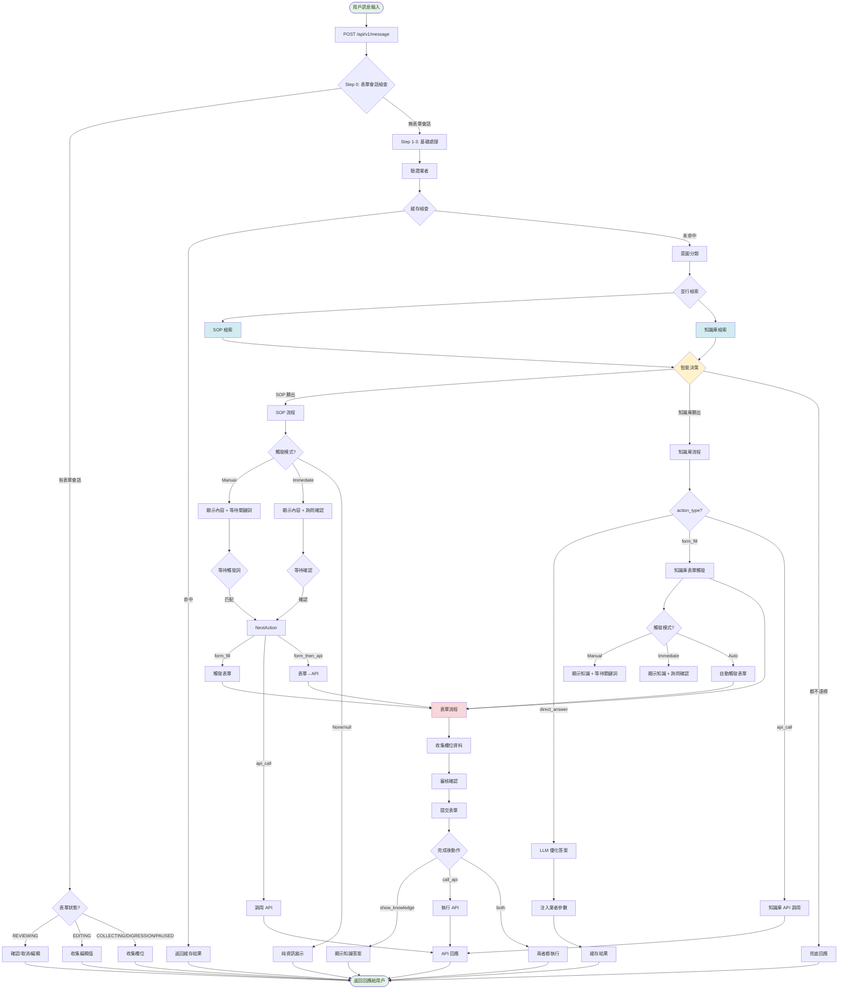
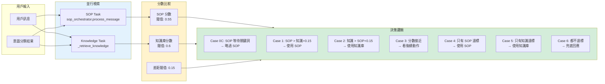
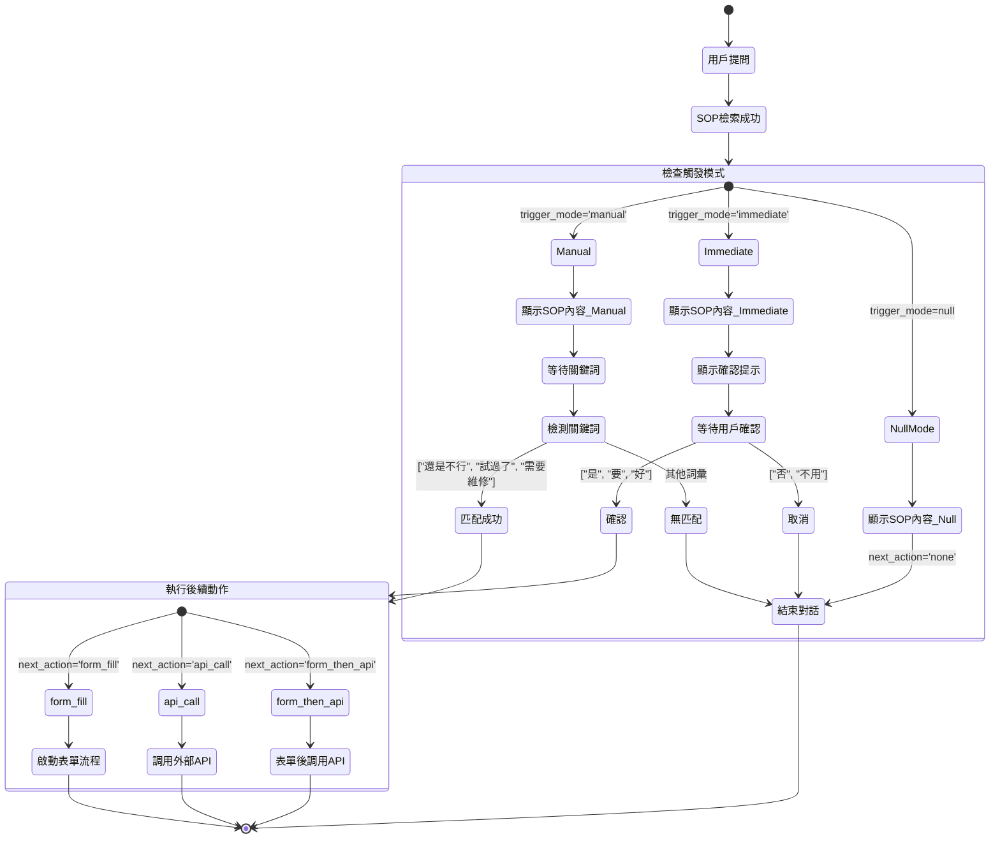
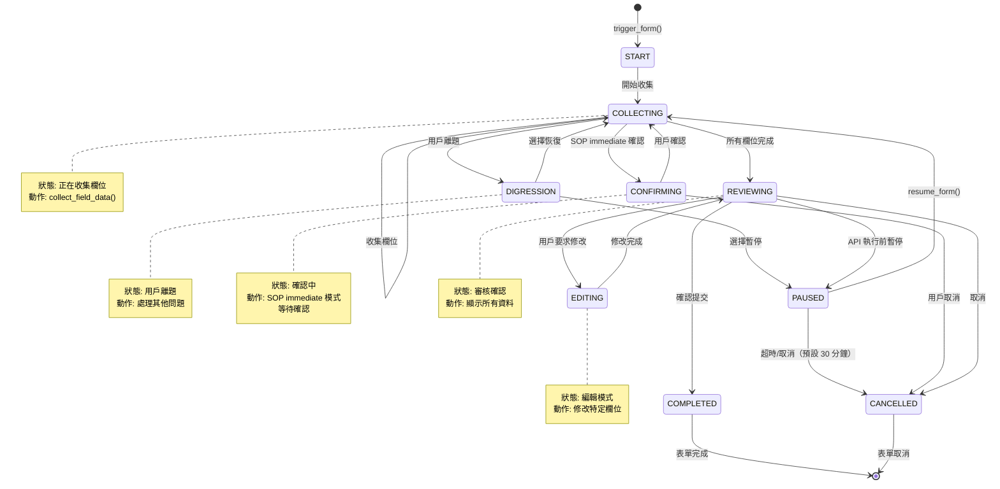
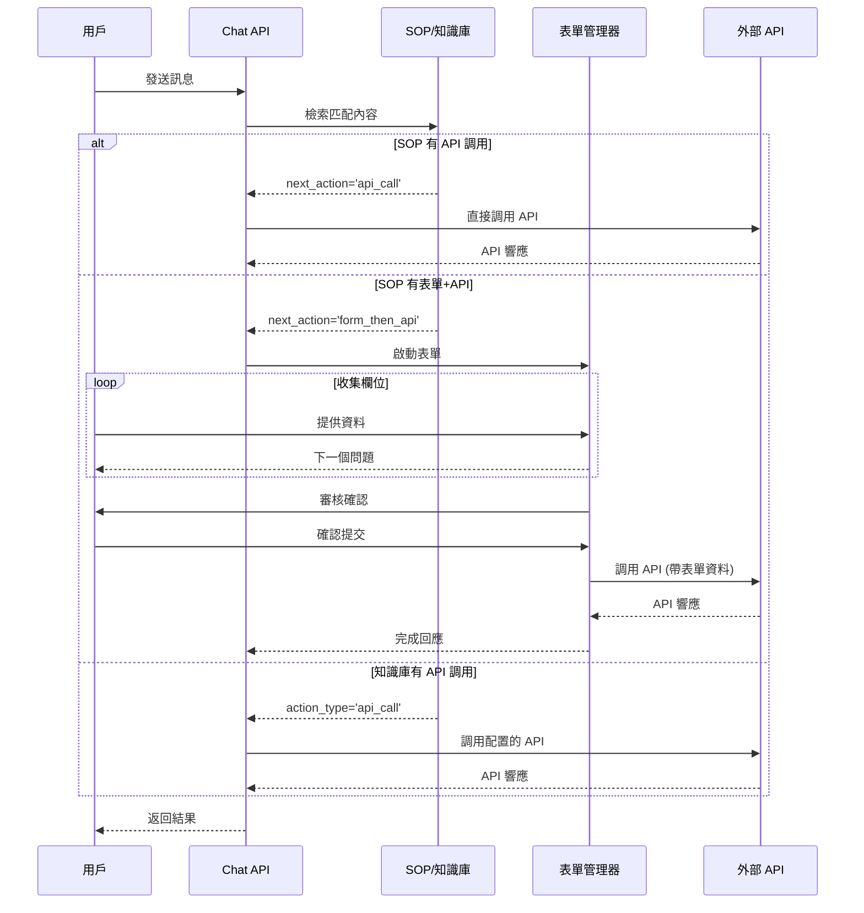
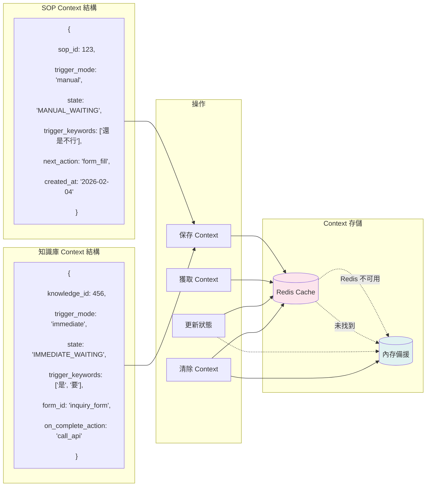

# 完整對話架構

**最後更新**: 2026-05-18
**版本**: 2.0

> **相關文件**：
> - Retriever Pipeline 分數欄位：[retriever-pipeline.md](./retriever-pipeline.md)
> - 知識資料結構：[DATABASE_SCHEMA.md](./DATABASE_SCHEMA.md)

---

## 1. 總體對話流程

### 流程圖


```mermaid
flowchart TB
    Start([用戶訊息輸入]) --> API[POST /api/v1/message]

    API --> Step0{Step 0: 表單會話檢查}

    Step0 -->|有表單會話| FormState{表單狀態?}
    FormState -->|REVIEWING| FormReview[確認/取消/編輯]
    FormState -->|EDITING| FormEdit[收集編輯值]
    FormState -->|COLLECTING/DIGRESSION/PAUSED| FormCollect[收集欄位]

    Step0 -->|無表單會話| Step1[Step 1-3: 基礎處理]

    Step1 --> Validate[驗證業者]
    Validate --> Cache{緩存檢查}
    Cache -->|命中| CachedResponse[返回緩存結果]
    Cache -->|未命中| Intent[意圖分類]

    Intent --> Parallel{並行檢索}

    Parallel --> SOP[SOP 檢索]
    Parallel --> Knowledge[知識庫檢索]

    SOP --> Decision{智能決策}
    Knowledge --> Decision

    Decision -->|SOP 勝出| SOPFlow[SOP 流程]
    Decision -->|知識庫勝出| KnowledgeFlow[知識庫流程]
    Decision -->|都不達標| Fallback[兜底回應]

    SOPFlow --> SOPTrigger{觸發模式?}
    SOPTrigger -->|Manual| Manual[顯示內容 + 等待關鍵詞]
    SOPTrigger -->|Immediate| Immediate[顯示內容 + 詢問確認]
    SOPTrigger -->|None/null| NoneMode[純資訊展示]

    Manual --> WaitKeyword{等待觸發詞}
    Immediate --> WaitConfirm{等待確認}
    NoneMode --> Response

    WaitKeyword -->|匹配| NextAction
    WaitConfirm -->|確認| NextAction

    NextAction -->|form_fill| TriggerForm[觸發表單]
    NextAction -->|api_call| CallAPI[調用 API]
    NextAction -->|form_then_api| FormThenAPI[表單→API]

    KnowledgeFlow --> KnowledgeAction{action_type?}
    KnowledgeAction -->|direct_answer| LLMOptimize[LLM 優化答案]
    KnowledgeAction -->|form_fill| KnowledgeForm[知識庫表單觸發]
    KnowledgeAction -->|api_call| KnowledgeAPI[知識庫 API 調用]

    KnowledgeForm --> KnowledgeTrigger{觸發模式?}
    KnowledgeTrigger -->|Manual| KManual[顯示知識 + 等待關鍵詞]
    KnowledgeTrigger -->|Immediate| KImmediate[顯示知識 + 詢問確認]
    KnowledgeTrigger -->|Auto| KAuto[自動觸發表單]

    TriggerForm --> FormFlow[表單流程]
    FormThenAPI --> FormFlow
    KnowledgeForm --> FormFlow
    KAuto --> FormFlow

    FormFlow --> CollectFields[收集欄位資料]
    CollectFields --> Review[審核確認]
    Review --> Submit[提交表單]
    Submit --> OnComplete{完成後動作}

    OnComplete -->|show_knowledge| ShowKnowledge[顯示知識答案]
    OnComplete -->|call_api| ExecuteAPI[執行 API]
    OnComplete -->|both| BothActions[兩者都執行]

    LLMOptimize --> InjectParams[注入業者參數]
    InjectParams --> CacheResult[緩存結果]

    CallAPI --> APIResponse[API 回應]
    ExecuteAPI --> APIResponse
    KnowledgeAPI --> APIResponse

    CacheResult --> Response([返回回應給用戶])
    CachedResponse --> Response
    Fallback --> Response
    ShowKnowledge --> Response
    APIResponse --> Response
    BothActions --> Response

    FormReview --> Response
    FormEdit --> Response
    FormCollect --> Response

    style Start fill:#e1f5e1
    style Response fill:#e1f5e1
    style Decision fill:#fff3cd
    style SOP fill:#d1ecf1
    style Knowledge fill:#d1ecf1
    style FormFlow fill:#f8d7da
```

### 請求/回應模型

**請求核心欄位**：
- `vendor_id`: 業者 ID（業者隔離）
- `message`: 用戶訊息
- `session_id`: 會話 ID（表單狀態追蹤）
- `target_user`: 目標角色（tenant/landlord/property_manager）
- `mode`: 業務模式（b2c/b2b）
- `debug`: Debug 模式（跳過緩存）

**回應核心欄位**：
- `answer`: 答案內容
- `intent_name` + `intent_type`: 意圖資訊
- `confidence`: 信心度（0-1）
- `action_type`: 動作類型（direct_answer/form_fill/api_call/sop_knowledge）
- `form_triggered` + `form_completed`: 表單狀態

### 緩存機制

**三層緩存架構**：

| 層級 | 緩存鍵格式 | 用途 |
|------|-----------|------|
| L1 問答緩存 | `rag:question:{vendor_id}:{target_user}:{config_version}:{question_hash}` | 完整回答結果 |
| L2 向量緩存 | `rag:vector:{text_hash}` | embedding 向量 |
| L3 RAG 結果緩存 | `rag:result:{vendor_id}:{intent_id}:{question_hash}` | 檢索結果 |

**失效追蹤鍵**（event-driven 失效）：
- `rag:relation:knowledge:{knowledge_id}`
- `rag:relation:intent:{intent_id}`
- `rag:relation:vendor:{vendor_id}`

**跳過緩存條件**：
- Debug 模式開啟
- 有進行中的表單會話
- 用戶訊息包含表單觸發關鍵字

---

## 2. 意圖識別系統

### 意圖分類邏輯

**LLM Function Calling 架構**：
```python
classify_intent(question, available_intents) → {
    primary_intent: {name, confidence},      # 主要意圖
    secondary_intents: [{name, confidence}]  # 次要意圖（最多2個）
}
```

### 多意圖支援

| 意圖級別 | 數量限制 | 用途 |
|---------|---------|------|
| 主要意圖 | 1 個 | RAG 檢索 1.3x 加成 |
| 次要意圖 | 最多 2 個 | RAG 檢索 1.1x 加成 |

**意圖配置來源**：
1. **資料庫** (intents 表)：動態配置，支援業者自定義
2. **YAML 配置** (fallback)：系統預設意圖

### 信心度評估

**獨立閾值檢查**：每個意圖有自己的 `confidence_threshold`

```python
for intent in [primary, *secondary]:
    if intent.confidence < intent.threshold:
        filtered_out()  # 不參與檢索加成
```

**信心度標準**：
- **0.9-1.0**：非常確定
- **0.7-0.9**：較為確定（預設閾值）
- **0.5-0.7**：不太確定
- **< 0.5**：不確定

### 降級機制

**主意圖失敗處理**：
```python
if primary_failed AND has_valid_secondary:
    promote_best_secondary_to_primary()
    demote_original_primary_to_secondary()
```

**無有效意圖**：
```python
if all_intents_failed:
    return unclear_intent  # intent_name = "unclear"
```

---

## 3. 檢索引擎

### 並行檢索架構


```mermaid
flowchart LR
    subgraph Input[用戶輸入]
        Message[用戶訊息]
        Intent[意圖分類結果]
    end

    subgraph Parallel[並行檢索]
        SOPT[SOP Task<br/>sop_orchestrator.process_message]
        KnowledgeT[Knowledge Task<br/>_retrieve_knowledge]
    end

    Message --> SOPT
    Intent --> SOPT
    Message --> KnowledgeT
    Intent --> KnowledgeT

    subgraph Scoring[分數比較]
        SOPScore[SOP 分數<br/>閾值: 0.55]
        KnowledgeScore[知識庫分數<br/>閾值: 0.6]
        Gap[差距閾值: 0.15]
    end

    SOPT --> SOPScore
    KnowledgeT --> KnowledgeScore

    subgraph DecisionLogic[決策邏輯]
        C0C[Case 0C: SOP 等待關鍵詞<br/>→ 略過 SOP]
        C1[Case 1: SOP > 知識+0.15<br/>→ 使用 SOP]
        C2[Case 2: 知識 > SOP+0.15<br/>→ 使用知識庫]
        C3[Case 3: 分數接近<br/>→ 看後續動作]
        C4[Case 4: 只有 SOP 達標<br/>→ 使用 SOP]
        C5[Case 5: 只有知識達標<br/>→ 使用知識庫]
        C6[Case 6: 都不達標<br/>→ 兜底回應]
    end

    SOPScore --> DecisionLogic
    KnowledgeScore --> DecisionLogic
    Gap --> DecisionLogic

    style Parallel fill:#e3f2fd
    style Scoring fill:#fff3cd
    style DecisionLogic fill:#d4edda
```

### SOP vs 知識庫決策邏輯

**閾值定義**：
- `SOP_MIN_THRESHOLD = 0.55`
- `KNOWLEDGE_MIN_THRESHOLD = 0.6`
- `SCORE_GAP_THRESHOLD = 0.15`（顯著差異）

**決策樹**：

```python
# Case 0A: SOP 被用戶取消
if sop_cancelled:
    return sop_result  # 優先處理取消回應

# Case 0B: SOP 已觸發並執行動作
if sop_triggered_with_action:
    return sop_result  # 優先完成 SOP 流程

# Case 0C: SOP 等待關鍵詞（response 為 None）
if sop_has_result AND NOT sop_has_response:
    if kb_score >= 0.6:
        return knowledge_result  # 讓知識庫先回答
    else:
        return none_result  # 都無法回答

# Case 1: SOP 顯著更高
if sop_score >= 0.55 AND sop_score > kb_score + 0.15:
    return sop_result

# Case 2: 知識庫顯著更高
if kb_score >= 0.6 AND kb_score > sop_score + 0.15:
    return knowledge_result

# Case 3: 分數接近（兩者都達標）
if sop_score >= 0.55 AND kb_score >= 0.6:
    if sop_has_next_action:
        return sop_result  # 優先處理後續動作（表單/API）
    else:
        return higher_score_result

# Case 4: 只有 SOP 達標
if sop_score >= 0.55:
    return sop_result

# Case 5: 只有知識庫達標
if kb_score >= 0.6:
    return knowledge_result

# Case 6: 都不達標
return unclear_response
```

### 過濾機制

- **業者隔離**：`vendor_ids @> ARRAY[$vendor_id]`
- **角色隔離**：`target_user @> ARRAY[$user_role]`
- **業態過濾**：`business_types IS NULL OR business_types @> ARRAY[$business_type]`
- **啟用狀態**：`is_active = true`

### 優先級加成（知識庫專屬）

```python
if priority > 0 AND similarity >= 0.70:
    boosted_similarity += 0.15  # 固定加成
```

> Retriever Pipeline 各階段分數欄位的詳細說明，請參考 [retriever-pipeline.md](./retriever-pipeline.md)。

---

## 4. 信心度評估

### 評估指標

**加權分數**：
```python
confidence_score = (
    max_similarity * 0.7 +             # 相似度（權重 70%）
    min(result_count / 5, 1.0) * 0.2 + # 結果數量（權重 20%）
    keyword_match_rate * 0.1            # 關鍵字匹配（權重 10%）
)
```

### 信心度等級與處理決策

| 等級 | 分數範圍 | 額外條件 | 處理決策 |
|------|---------|---------|---------|
| **high** | >= 0.85 | 結果數 >= 2 | `direct_answer` — 可能啟用快速路徑 |
| **medium** | 0.70-0.85 | - | `needs_enhancement` — LLM 優化 |
| **low** | < 0.70 | - | `unclear` — 轉人工或提示重新描述 |

---

## 5. 答案優化

### 條件式優化決策樹

```python
# 1. 完美匹配（跳過 LLM）— 使用純向量分數 vector_similarity
if max_vector_similarity >= 0.90:
    return original_answer

# 2. 答案合成（多高品質結果）
high_quality = [r for r in results if r.similarity > 0.80]
if len(high_quality) >= 2 AND is_complex_question:
    synthesize_answers(high_quality)

# 3. 快速路徑（單一高品質）
elif confidence >= 0.75 AND single_result:
    format_with_template()

# 4. 模板格式化（中等信心）
elif 0.55 <= confidence < 0.75:
    apply_template()

# 5. 完整 LLM 優化（低信心）
else:
    full_llm_optimization()
```

### 答案合成觸發條件

**必須同時滿足**：
1. `ENABLE_SYNTHESIS = true`（環境變數）
2. 結果數 >= 2
3. 包含複雜問題模式：
   - 流程問題（「如何」「怎麼」「流程」「步驟」「程序」「過程」）
   - 廣泛查詢（「條款」「規定」「說明」「內容」「包括」「有哪些」「什麼」「包含」）+ 主題多樣性 >= 3
4. 無單一完美匹配（max_vector_similarity < 0.90）

**合成策略**：
```python
LLM Prompt: """
整合以下多個答案片段，生成一個完整、連貫的回答：
1. [答案1]
2. [答案2]
3. [答案3]

要求：
- 保留所有關鍵資訊
- 去除重複內容
- 邏輯連貫
- 結構清晰（使用列表或步驟）
"""
```

### 業者參數注入

**階段 1：確定性替換**（正則表達式）
```python
# 模板變數替換
{company_name} → 實際公司名稱
{service_phone} → 實際服務電話
{business_hours} → 實際營業時間

# 智能替換（語境感知）
"我們的客服" → "{company_name}的客服"
"撥打服務專線" → "撥打 {service_phone}"
```

**階段 2：語氣調整**（已停用）
- 原因：避免 LLM 誤刪替換後的參數

### 優化參數配置

| 參數 | 預設值 | 用途 |
|------|--------|------|
| `PERFECT_MATCH_THRESHOLD` | 0.90 | 完美匹配閾值 |
| `SYNTHESIS_THRESHOLD` | 0.80 | 答案合成閾值 |
| `FAST_PATH_THRESHOLD` | 0.75 | 快速路徑閾值 |
| `LLM_ANSWER_TEMPERATURE` | 0.7 | 答案生成溫度 |
| `LLM_SYNTHESIS_TEMP` | 0.5 | 合成專用溫度 |
| `LLM_ANSWER_MAX_TOKENS` | 800 | 最大 token 數 |

---

## 6. SOP 編排

### 觸發模式


```mermaid
stateDiagram-v2
    [*] --> 用戶提問

    用戶提問 --> SOP檢索成功

    SOP檢索成功 --> 檢查觸發模式

    state 檢查觸發模式 {
        [*] --> Manual: trigger_mode='manual'
        [*] --> Immediate: trigger_mode='immediate'
        [*] --> NullMode: trigger_mode=null

        Manual --> 顯示SOP內容_Manual
        顯示SOP內容_Manual --> 等待關鍵詞
        等待關鍵詞 --> 檢測關鍵詞
        檢測關鍵詞 --> 匹配成功: ["還是不行", "試過了", "需要維修"]
        檢測關鍵詞 --> 無匹配: 其他詞彙
        無匹配 --> 結束對話

        Immediate --> 顯示SOP內容_Immediate
        顯示SOP內容_Immediate --> 顯示確認提示
        顯示確認提示 --> 等待用戶確認
        等待用戶確認 --> 確認: ["是", "要", "好"]
        等待用戶確認 --> 取消: ["否", "不用"]
        取消 --> 結束對話

        NullMode --> 顯示SOP內容_Null
        顯示SOP內容_Null --> 結束對話: next_action='none'
    }

    匹配成功 --> 執行後續動作
    確認 --> 執行後續動作

    state 執行後續動作 {
        [*] --> form_fill: next_action='form_fill'
        [*] --> api_call: next_action='api_call'
        [*] --> form_then_api: next_action='form_then_api'

        form_fill --> 啟動表單流程
        api_call --> 調用外部API
        form_then_api --> 表單後調用API
    }

    啟動表單流程 --> [*]
    調用外部API --> [*]
    表單後調用API --> [*]
    結束對話 --> [*]
```

| 模式 | 行為 | 等待條件 | 使用場景 |
|------|------|---------|---------|
| `none`/null | 純資訊展示 | 無 | 政策說明、規範解釋 |
| `manual` | 等待特定關鍵詞 | `trigger_keywords` | 需用戶主動確認的流程 |
| `immediate` | 立即詢問確認 | 確認詞列表 | 需即時確認的操作 |
| `auto` | 立即執行後續動作 | 無（不等待） | 自動觸發表單/API |

### 觸發關鍵字匹配邏輯

**immediate 模式特殊處理**：
```python
# 1. 純粹否定詞（優先級最高）
if message in ['不用', '不要', '不需要', '算了', '不必', '免了', '不了', '不']:
    cancel_action()

# 2. 問句檢測（不視為確認）
elif any(ind in message for ind in ['？', '?', '嗎', '呢', '什麼', '如何', '怎麼', '怎樣', '為何', '為什麼', '哪裡', '誰', '何時']):
    not_confirmed()

# 3. 訊息過長（可能是新問題）
elif len(message) > 10:
    not_confirmed()

# 4. 確認詞匹配（immediate 預設：確認/好/是的/可以/ok/yes/要/需要/開始）
elif message in trigger_keywords:
    trigger_action()
```

**manual 模式**：
```python
if any(keyword in message for keyword in trigger_keywords):
    trigger_action()
```

### 多輪對話管理

**Context 結構**：
```python
{
    'sop_id': int,
    'sop_name': str,
    'trigger_mode': str,
    'trigger_keywords': List[str],
    'next_action': str,              # none/form_fill/api_call/form_then_api
    'next_form_id': int,
    'next_api_config': dict,
    'state': 'WAITING' | 'TRIGGERED',
    'original_question': str         # 相似問題檢測用
}
```

**相似問題處理**：
```python
if has_pending_context:
    similarity = compare(new_question, original_question)

    if similarity >= 0.7:
        # 視為新問題，重新檢索
        clear_context()
        start_new_retrieval()
    else:
        # 視為回應，檢查關鍵字
        check_keywords()
```

### 後續動作執行

```python
if next_action == 'form_fill':
    trigger_form(next_form_id)

elif next_action == 'api_call':
    execute_api(next_api_config)

elif next_action == 'form_then_api':
    trigger_form(next_form_id, pause_mode=True)
    # 表單完成後自動執行 API
```

---

## 7. 表單管理

### 狀態機


```mermaid
stateDiagram-v2
    [*] --> START: trigger_form()

    START --> COLLECTING: 開始收集

    COLLECTING --> COLLECTING: 收集欄位
    COLLECTING --> DIGRESSION: 用戶離題
    COLLECTING --> REVIEWING: 所有欄位完成
    COLLECTING --> CONFIRMING: SOP immediate 確認

    DIGRESSION --> COLLECTING: 選擇恢復
    DIGRESSION --> PAUSED: 選擇暫停

    PAUSED --> COLLECTING: resume_form()
    PAUSED --> CANCELLED: 超時/取消（預設 30 分鐘）

    CONFIRMING --> COLLECTING: 用戶確認
    CONFIRMING --> CANCELLED: 用戶取消

    REVIEWING --> EDITING: 用戶要求修改
    REVIEWING --> COMPLETED: 確認提交
    REVIEWING --> PAUSED: API 執行前暫停
    REVIEWING --> CANCELLED: 取消

    EDITING --> REVIEWING: 修改完成

    COMPLETED --> [*]: 表單完成
    CANCELLED --> [*]: 表單取消

    note right of COLLECTING
        狀態: 正在收集欄位
        動作: collect_field_data()
    end note

    note right of DIGRESSION
        狀態: 用戶離題
        動作: 處理其他問題
    end note

    note right of CONFIRMING
        狀態: 確認中
        動作: SOP immediate 模式等待確認
    end note

    note right of REVIEWING
        狀態: 審核確認
        動作: 顯示所有資料
    end note

    note right of EDITING
        狀態: 編輯模式
        動作: 修改特定欄位
    end note
```

### 離題偵測

**偵測邏輯**：
```python
detect_digression(message, current_field, form_schema, intent) → {
    is_digression: bool,
    digression_type: str,  # explicit_exit/question/irrelevant_response
    confidence: float
}
```

**離題類型與處理**：

| 離題類型 | 範例 | 處理策略 |
|---------|------|---------|
| `explicit_exit` | 「取消」「算了」「不填了」 | 取消表單 |
| `question` | 包含 "?" 或問題關鍵字 | 回答問題後回到當前欄位 |
| `irrelevant_response` | 與當前欄位無關 | 澄清後重試 |

### 欄位驗證

**驗證類型**：
- `text`: 文字長度、格式
- `phone`: 台灣手機格式（09xxxxxxxx）
- `email`: Email 格式
- `date`: 日期格式（YYYY-MM-DD）
- `number`: 數字範圍
- `select`: 選項匹配

**驗證失敗處理**：
```python
if not is_valid:
    return {
        "answer": f"{error_message}\n\n{field_prompt}",
        "validation_failed": True
    }
```

### 審核與編輯

**審核模式觸發**：
```python
if all_fields_collected:
    if form_schema.skip_review:
        complete_form()  # 直接完成
    else:
        show_review_summary()  # 進入審核模式
```

**審核摘要格式**：
```
請確認以下資訊是否正確：

1. 姓名：王小明
2. 電話：0912345678
3. 地址：台北市信義區...

輸入「確認」提交，或輸入欄位編號修改（例如：「修改2」）
```

**編輯模式**：
```python
if message.startswith('修改'):
    field_number = extract_number(message)
    enter_editing_mode(field_number)
```

### 完成後動作

```python
if on_complete_action == 'call_api':
    result = execute_api(form_data)
    show_result(result)

elif on_complete_action == 'show_knowledge':
    show_knowledge_answer(related_kb_id)

elif on_complete_action == 'both':
    result = execute_api(form_data)
    knowledge = get_knowledge(related_kb_id)
    show_combined_response(result, knowledge)
```

### API 重試機制

```python
MAX_RETRIES = 2

if api_error in ['ambiguous_match', 'no_match', 'invalid_input']:
    retry_count += 1

    if retry_count >= MAX_RETRIES:
        cancel_form()  # 自動取消，避免無限重試
        notify_manual_intervention()
    else:
        show_retry_hint(api_error)
```

---

## 8. API 調用流程


```mermaid
sequenceDiagram
    participant User as 用戶
    participant Chat as Chat API
    participant SOP as SOP/知識庫
    participant Form as 表單管理器
    participant External as 外部 API

    User->>Chat: 發送訊息
    Chat->>SOP: 檢索匹配內容

    alt SOP 有 API 調用
        SOP-->>Chat: next_action='api_call'
        Chat->>External: 直接調用 API
        External-->>Chat: API 響應
    else SOP 有表單+API
        SOP-->>Chat: next_action='form_then_api'
        Chat->>Form: 啟動表單

        loop 收集欄位
            User->>Form: 提供資料
            Form-->>User: 下一個問題
        end

        Form->>User: 審核確認
        User->>Form: 確認提交

        Form->>External: 調用 API (帶表單資料)
        External-->>Form: API 響應
        Form-->>Chat: 完成回應
    else 知識庫有 API 調用
        SOP-->>Chat: action_type='api_call'
        Chat->>External: 調用配置的 API
        External-->>Chat: API 響應
    end

    Chat-->>User: 返回結果
```

---

## 9. 知識庫表單觸發流程

```mermaid
flowchart TB
    subgraph KnowledgeRetrieval[知識庫檢索]
        Query[用戶查詢]
        Search[向量搜尋 + 意圖過濾]
        Match{找到匹配?}
    end

    Query --> Search
    Search --> Match

    Match -->|是| CheckAction{檢查 action_type}
    Match -->|否| NoMatch[無結果]

    CheckAction -->|direct_answer| DirectAnswer[直接回答]
    CheckAction -->|form_fill| FormTrigger{檢查 trigger_mode}
    CheckAction -->|api_call| DirectAPI[直接調用 API]
    CheckAction -->|form_then_api| FormThenAPIFlow[表單→API]

    FormTrigger -->|NULL/auto| AutoForm[自動觸發表單]
    FormTrigger -->|manual| ManualFlow[Manual 流程]
    FormTrigger -->|immediate| ImmediateFlow[Immediate 流程]

    subgraph ManualProcess[Manual 處理]
        ManualFlow --> ShowKnowledge1[顯示知識內容]
        ShowKnowledge1 --> AddPrompt1[添加觸發提示]
        AddPrompt1 --> SaveContext1[保存 Context]
        SaveContext1 --> WaitKeyword1[等待關鍵詞]
        WaitKeyword1 -->|"是"/"要"| TriggerForm1[觸發表單]
        WaitKeyword1 -->|其他| Continue1[繼續對話]
    end

    subgraph ImmediateProcess[Immediate 處理]
        ImmediateFlow --> ShowKnowledge2[顯示知識內容]
        ShowKnowledge2 --> AskConfirm[詢問是否需要表單]
        AskConfirm --> SaveContext2[保存 Context]
        SaveContext2 --> WaitConfirm2[等待確認]
        WaitConfirm2 -->|"是"/"要"| TriggerForm2[觸發表單]
        WaitConfirm2 -->|"否"/"不用"| Continue2[結束]
    end

    AutoForm --> FormSession[創建表單會話]
    TriggerForm1 --> FormSession
    TriggerForm2 --> FormSession
    FormThenAPIFlow --> FormSession

    FormSession --> CollectData[收集表單資料]
    CollectData --> FormComplete{表單完成}

    FormComplete --> OnCompleteAction{on_complete_action?}
    OnCompleteAction -->|show_knowledge| ShowResult[顯示知識答案]
    OnCompleteAction -->|call_api| CallConfigAPI[調用配置的 API]
    OnCompleteAction -->|both| BothAction[兩者都執行]

    style ManualProcess fill:#e8f5e9
    style ImmediateProcess fill:#e3f2fd
    style FormSession fill:#fff3e0
```

---

## 10. Context 管理機制


```mermaid
flowchart LR
    subgraph ContextStorage[Context 存儲]
        Redis[(Redis Cache)]
        Memory[(內存備援)]
    end

    subgraph SOPContext[SOP Context 結構]
        SOPData["{<br/>
        sop_id: 123,<br/>
        trigger_mode: 'manual',<br/>
        state: 'MANUAL_WAITING',<br/>
        trigger_keywords: ['還是不行'],<br/>
        next_action: 'form_fill',<br/>
        created_at: '2026-02-04'<br/>
        }"]
    end

    subgraph KnowledgeContext[知識庫 Context 結構]
        KnowledgeData["{<br/>
        knowledge_id: 456,<br/>
        trigger_mode: 'immediate',<br/>
        state: 'IMMEDIATE_WAITING',<br/>
        trigger_keywords: ['是', '要'],<br/>
        form_id: 'inquiry_form',<br/>
        on_complete_action: 'call_api'<br/>
        }"]
    end

    subgraph Operations[操作]
        Save[保存 Context]
        Get[獲取 Context]
        Update[更新狀態]
        Delete[清除 Context]
    end

    Save --> Redis
    Redis -.->|Redis 不可用| Memory

    Get --> Redis
    Redis -.->|未找到| Memory

    Update --> Redis
    Update -.-> Memory

    Delete --> Redis
    Delete --> Memory

    SOPData --> Save
    KnowledgeData --> Save

    style Redis fill:#fce4ec
    style Memory fill:#e0f2f1
```

---

## 11. 系統角色與職責

| 組件 | 職責 | 關鍵決策點 |
|------|------|-----------|
| **Chat Router** (`routers/chat.py`) | 主入口，協調整體流程 | 表單優先、SOP 優先、分數比較 |
| **SOP Orchestrator** (`services/sop_orchestrator.py`) | SOP 檢索與觸發管理 | 觸發模式判斷、關鍵詞匹配 |
| **Knowledge Retriever** (`services/vendor_knowledge_retriever_v2.py`) | 知識庫檢索與過濾 | 向量相似度、意圖匹配 |
| **Form Manager** (`services/form_manager.py`) | 表單生命週期管理 | 狀態轉換、欄位驗證 |
| **Intent Classifier** (`services/intent_classifier.py`) | 意圖識別 | 多意圖支援、信心度評估 |
| **LLM Optimizer** (`services/llm_answer_optimizer.py`) | 答案優化與合成 | 合成策略、參數注入 |
| **Cache Service** (`services/cache_service.py`) | 三層緩存管理 | 緩存命中、過期策略 |
| **Confidence Evaluator** (`services/confidence_evaluator.py`) | 品質評估 | 信心度計算、等級判定 |
| **Base Retriever** (`services/base_retriever.py`) | 統一檢索策略 | Pipeline stages、分數組合 |

---

## 12. 關鍵參數配置

```yaml
# 分數閾值（硬編碼於 routers/chat.py）
SOP_MIN_THRESHOLD: 0.55          # SOP 最低分數
KNOWLEDGE_MIN_THRESHOLD: 0.6     # 知識庫最低分數
SCORE_GAP_THRESHOLD: 0.15        # 顯著差距閾值

# 優化閾值（環境變數，可配置）
PERFECT_MATCH_THRESHOLD: 0.90    # 完美匹配閾值（比對 vector_similarity）
SYNTHESIS_THRESHOLD: 0.80        # 答案合成閾值（比對 similarity）
HIGH_QUALITY_THRESHOLD: 0.80     # 高質量閾值
FAST_PATH_THRESHOLD: 0.75        # 快速路徑閾值

# 信心度閾值（環境變數）
CONFIDENCE_HIGH_THRESHOLD: 0.85  # 高信心度
CONFIDENCE_MEDIUM_THRESHOLD: 0.70 # 中信心度

# LLM 模型配置（環境變數）
OPENAI_MODEL: gpt-4o-mini              # 答案優化模型（預設）
INTENT_CLASSIFIER_MODEL: gpt-3.5-turbo # 意圖分類模型
KNOWLEDGE_GEN_MODEL: gpt-4o-mini       # 知識生成模型
DOCUMENT_CONVERTER_MODEL: gpt-4o       # 文件轉換模型（fallback: KNOWLEDGE_GEN_MODEL）
QUERY_REWRITE_MODEL: gpt-3.5-turbo     # 查詢改寫模型（fallback: OPENAI_MODEL）
EMBEDDING_MODEL: text-embedding-3-small # Embedding 模型

# LLM 溫度與 token 配置（環境變數）
LLM_ANSWER_TEMPERATURE: 0.7            # 答案生成溫度
LLM_ANSWER_MAX_TOKENS: 800             # 答案最大 token 數
LLM_SYNTHESIS_TEMP: 0.5                # 合成專用溫度
LLM_TONE_ADJUSTMENT_TEMP: 0.3          # 語氣調整溫度（已停用）
INTENT_CLASSIFIER_TEMPERATURE: 0.1     # 意圖分類溫度
INTENT_CLASSIFIER_MAX_TOKENS: 500      # 意圖分類最大 token 數
KNOWLEDGE_GEN_TEMPERATURE: 0.7         # 知識生成溫度
KNOWLEDGE_GEN_MAX_TOKENS: 800          # 知識生成最大 token 數
QUERY_REWRITE_TEMPERATURE: 0.3         # 查詢改寫溫度
QUERY_REWRITE_MAX_TOKENS: 100          # 查詢改寫最大 token 數

# 觸發配置
DEFAULT_TRIGGER_KEYWORDS:
  - "是"
  - "要"
  - "好"
  - "確認"

CANCEL_KEYWORDS:
  - "否"
  - "不用"
  - "取消"
  - "算了"

# Context 配置
CONTEXT_TTL: 3600                 # Context 存活時間（秒）
CONTEXT_STORAGE: "redis"          # 存儲方式（redis/memory）

# 表單配置
FORM_SESSION_TIMEOUT: 1800        # 表單會話超時（秒）
MAX_FORM_FIELDS: 20               # 最大欄位數
DIGRESSION_THRESHOLD: 0.7         # 離題判定閾值
```

---

## 13. 串流回應（SSE）

**事件類型依序**：`start` → `intent` → `search` → `answer_chunk`（逐 token）→ `form_field`（如有表單）→ `metadata` → `done`

```
IF request.stream == True:
  └─ StreamingResponse(generate_answer_stream(...))
ELSE:
  └─ JSON 即時回傳
```
