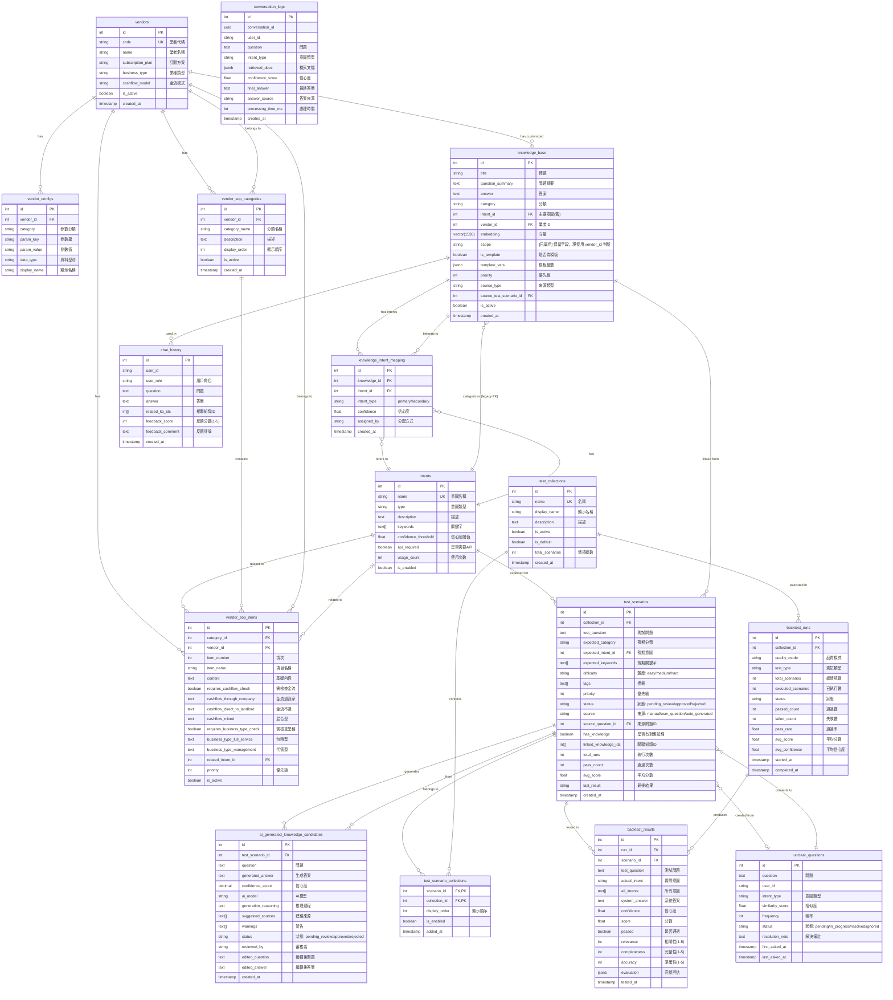

# AIChatbot Database Schema & ERD

**版本**: 2025-10-22
**資料庫**: PostgreSQL 16 + pgvector
**總表數**: 16 個核心表 + 多個視圖和函數

---

## 📊 目錄

1. [ERD 總覽](#erd-總覽)
2. [核心模組](#核心模組)
3. [資料表詳細說明](#資料表詳細說明)
4. [關係說明](#關係說明)
5. [索引策略](#索引策略)
6. [特殊功能](#特殊功能)

---

## ERD 總覽

### 完整 ERD 圖



---

## 核心模組

系統分為 **6 個核心模組**：

### 1. 業者管理模組 (Multi-Vendor)
- **vendors** - 包租代管業者主表
- **vendor_configs** - 業者配置參數（繳費日、押金月數等）
- 支援多租戶隔離和差異化配置

### 2. 意圖分類模組 (Intent Classification)
- **intents** - 意圖定義表（帳務查詢、退租流程等）
- **knowledge_intent_mapping** - 知識-意圖多對多關聯
- 支援一筆知識關聯多個意圖（1 主要 + 2 次要）

### 3. 知識庫模組 (Knowledge Base)
- **knowledge_base** - 核心知識庫
  - 支援 pgvector 向量搜尋
  - 三層範圍：global → vendor → customized
  - 注意：知識內容不使用模板變數，模板變數僅用於系統兜底回應
- **chat_history** - 對話歷史記錄

### 4. RAG 對話模組 (RAG Orchestrator)
- **conversation_logs** - RAG 對話記錄（含檢索結果、信心度）
- **unclear_questions** - 未釐清問題追蹤（頻率統計）

### 5. 測試回測模組 (Testing & Backtesting)
- **test_collections** - 測試集合（smoke, full, regression）
- **test_scenarios** - 測試情境（問題 + 預期結果）
- **test_scenario_collections** - 多對多關聯
- **backtest_runs** - 回測執行記錄
- **backtest_results** - 回測結果詳細

### 6. AI 知識生成模組 (AI Knowledge Generation)
- **ai_generated_knowledge_candidates** - AI 生成知識審核佇列
- 支援從測試情境自動生成知識
- 審核流程：pending_review → approved/rejected

### 7. SOP 管理模組 (Vendor SOP)
- **vendor_sop_categories** - SOP 分類
- **vendor_sop_items** - SOP 項目
- 支援金流模式和業種類型動態調整

---

## 資料表詳細說明

### 1. vendors（包租代管業者）

```sql
CREATE TABLE vendors (
    id SERIAL PRIMARY KEY,
    code VARCHAR(50) UNIQUE NOT NULL,                -- 業者代碼（API 識別用）
    name VARCHAR(200) NOT NULL,                      -- 業者名稱
    short_name VARCHAR(100),                         -- 簡稱

    -- 訂閱設定
    subscription_plan VARCHAR(50) DEFAULT 'basic',   -- 訂閱方案
    subscription_status VARCHAR(20) DEFAULT 'active',
    subscription_start_date DATE,
    subscription_end_date DATE,

    -- 業務設定
    business_type VARCHAR(50) DEFAULT 'property_management',  -- 包租型/代管型
    cashflow_model VARCHAR(50) DEFAULT 'direct_to_landlord', -- 金流模式

    -- 狀態
    is_active BOOLEAN DEFAULT true,
    created_at TIMESTAMP DEFAULT CURRENT_TIMESTAMP,
    updated_at TIMESTAMP DEFAULT CURRENT_TIMESTAMP
);
```

**用途**: 系統支援多個包租代管業者，每個業者有獨立的配置和知識庫。

**業種類型**:
- `full_service` - 包租型（房東把房子租給業者，業者再轉租）
- `property_management` - 代管型（業者只負責管理，不承租）

**金流模式**:
- `through_company` - 金流過我家（租金先到業者，再轉房東）
- `direct_to_landlord` - 金流不過我家（租金直接付房東）
- `mixed` - 混合型

---

### 2. vendor_configs（業者配置參數）

```sql
CREATE TABLE vendor_configs (
    id SERIAL PRIMARY KEY,
    vendor_id INTEGER NOT NULL REFERENCES vendors(id),

    category VARCHAR(50) NOT NULL,      -- payment, contract, service, contact
    param_key VARCHAR(100) NOT NULL,    -- payment_day, late_fee, deposit_months
    param_value TEXT NOT NULL,          -- 實際值

    data_type VARCHAR(20) DEFAULT 'string',  -- string, number, date, boolean
    display_name VARCHAR(200),               -- 前端顯示名稱
    description TEXT,                        -- 說明
    unit VARCHAR(20),                        -- 單位（元、天、月）

    UNIQUE(vendor_id, category, param_key)
);
```

**範例配置**:
```sql
-- 業者 A 的配置
INSERT INTO vendor_configs (vendor_id, category, param_key, param_value, unit)
VALUES
    (1, 'payment', 'payment_day', '1', '號'),
    (1, 'payment', 'late_fee', '200', '元'),
    (1, 'contract', 'deposit_months', '2', '月');
```

**用途**: 動態注入知識庫模板變數，實現差異化回答。

---

### 3. intents（意圖分類）

```sql
CREATE TABLE intents (
    id SERIAL PRIMARY KEY,
    name VARCHAR(100) UNIQUE NOT NULL,       -- 意圖名稱
    type VARCHAR(50) NOT NULL,               -- knowledge/data_query/action/hybrid
    description TEXT,                        -- 詳細描述
    keywords TEXT[],                         -- 關鍵字陣列

    confidence_threshold FLOAT DEFAULT 0.7,  -- 信心度閾值

    -- API 配置（如果需要呼叫外部 API）
    api_required BOOLEAN DEFAULT false,
    api_endpoint VARCHAR(255),
    api_action VARCHAR(100),

    -- 統計
    usage_count INTEGER DEFAULT 0,           -- 使用次數
    last_used_at TIMESTAMP,

    -- 狀態
    is_enabled BOOLEAN DEFAULT true,
    priority INTEGER DEFAULT 0,              -- 優先級

    created_at TIMESTAMP DEFAULT CURRENT_TIMESTAMP
);
```

**意圖類型**:
- `knowledge` - 純知識查詢（知識庫可回答）
- `data_query` - 資料查詢（需要呼叫 API）
- `action` - 執行動作（觸發業務邏輯）
- `hybrid` - 混合型（知識 + API）

**範例意圖**:
- 帳務查詢
- 退租流程
- 報修問題
- 合約查詢
- IOT 設備使用

---

### 4. knowledge_base（知識庫）

```sql
CREATE TABLE knowledge_base (
    id SERIAL PRIMARY KEY,

    -- 基本資訊
    title VARCHAR(255) NOT NULL,
    question_summary TEXT,               -- 問題摘要
    answer TEXT NOT NULL,                -- 答案
    category VARCHAR(100),               -- 分類

    -- 意圖關聯（舊欄位，保留相容性）
    intent_id INTEGER REFERENCES intents(id),

    -- 多業者支援
    vendor_id INTEGER REFERENCES vendors(id),  -- NULL = 全域知識, 非NULL = 業者專屬
    scope VARCHAR(20) DEFAULT 'global',        -- [已棄用] 保留向後兼容，現用 vendor_id 判斷
    priority INTEGER DEFAULT 0,                -- 優先級（數字越大越優先）

    -- 模板欄位（已棄用，保留向後相容）
    is_template BOOLEAN DEFAULT false,         -- 已棄用：知識不使用模板
    template_vars JSONB DEFAULT '[]',          -- 已棄用：知識不使用模板

    -- 向量搜尋
    embedding vector(1536),                    -- OpenAI text-embedding-3-small

    -- 來源追蹤
    source_type VARCHAR(20) DEFAULT 'manual',  -- manual/ai_generated/imported
    source_test_scenario_id INTEGER REFERENCES test_scenarios(id),
    generation_metadata JSONB,                 -- AI 生成詳情

    -- 狀態
    is_active BOOLEAN DEFAULT true,

    created_at TIMESTAMP DEFAULT CURRENT_TIMESTAMP,
    updated_at TIMESTAMP DEFAULT CURRENT_TIMESTAMP
);

-- 向量索引（IVFFlat）
CREATE INDEX idx_kb_embedding ON knowledge_base
USING ivfflat (embedding vector_cosine_ops) WITH (lists = 100);
```

**知識範圍判斷 (vendor_id)**:
- `vendor_id = NULL` - 全域知識（適用所有業者）
- `vendor_id = <id>` - 業者專屬知識（只有該業者可用）
- 註：scope 欄位已棄用，保留僅供向後兼容
- `customized` - 客製化知識（覆蓋全域知識）

**查詢優先級**: `customized (priority DESC) > vendor (priority DESC) > global (priority DESC)`

**已棄用功能**:
- `is_template` 和 `template_vars` 欄位已不再使用
- 知識庫內容不使用模板變數替換
- 模板變數僅用於系統兜底回應（如「請撥打 {{service_hotline}}」）

---

### 5. knowledge_intent_mapping（知識-意圖多對多關聯）

```sql
CREATE TABLE knowledge_intent_mapping (
    id SERIAL PRIMARY KEY,
    knowledge_id INT NOT NULL REFERENCES knowledge_base(id),
    intent_id INT NOT NULL REFERENCES intents(id),

    intent_type VARCHAR(20) NOT NULL DEFAULT 'secondary',  -- primary/secondary
    confidence FLOAT DEFAULT 1.0,                          -- 信心度
    assigned_by VARCHAR(50) DEFAULT 'migration',           -- manual/auto/migration

    created_at TIMESTAMP DEFAULT NOW(),

    UNIQUE(knowledge_id, intent_id)
);
```

**用途**: 支援一筆知識關聯多個意圖（最多 3 個：1 主要 + 2 次要）

**範例**:
```sql
-- 知識：「退租押金如何退還？」
-- 主要意圖：退租流程 (primary)
-- 次要意圖：帳務查詢 (secondary)

INSERT INTO knowledge_intent_mapping (knowledge_id, intent_id, intent_type)
VALUES
    (123, 10, 'primary'),     -- 退租流程
    (123, 15, 'secondary');   -- 帳務查詢
```

---

### 6. conversation_logs（RAG 對話記錄）

```sql
CREATE TABLE conversation_logs (
    id SERIAL PRIMARY KEY,
    conversation_id UUID DEFAULT gen_random_uuid(),
    user_id VARCHAR(100),

    -- 問題
    question TEXT NOT NULL,
    intent_type VARCHAR(50),
    sub_category VARCHAR(100),
    keywords TEXT[],

    -- 檢索結果
    retrieved_docs JSONB,        -- 檢索到的文檔
    similarity_scores FLOAT[],   -- 相似度分數陣列
    confidence_score FLOAT,      -- 答案信心度

    -- API 呼叫
    api_called BOOLEAN DEFAULT false,
    api_endpoints TEXT[],
    api_responses JSONB,

    -- 答案
    final_answer TEXT,
    answer_source VARCHAR(50),   -- knowledge/api/llm_enhanced/unclear
    processing_time_ms INTEGER,

    -- 反饋
    user_rating INTEGER CHECK (user_rating BETWEEN 1 AND 5),
    user_feedback TEXT,
    is_resolved BOOLEAN DEFAULT true,

    created_at TIMESTAMP DEFAULT CURRENT_TIMESTAMP
);
```

**用途**: 記錄每次 RAG 對話的完整過程，用於分析和優化。

---

### 7. unclear_questions（未釐清問題）

```sql
CREATE TABLE unclear_questions (
    id SERIAL PRIMARY KEY,
    question TEXT NOT NULL,
    user_id VARCHAR(100),
    intent_type VARCHAR(50),

    -- 檢索結果
    similarity_score FLOAT,
    retrieved_docs JSONB,

    -- 統計
    frequency INTEGER DEFAULT 1,      -- 被問次數
    first_asked_at TIMESTAMP DEFAULT CURRENT_TIMESTAMP,
    last_asked_at TIMESTAMP DEFAULT CURRENT_TIMESTAMP,

    -- 處理狀態
    status VARCHAR(20) DEFAULT 'pending',  -- pending/in_progress/resolved/ignored
    assigned_to VARCHAR(100),
    resolved_at TIMESTAMP,
    resolution_note TEXT,

    -- 建議答案
    suggested_answers TEXT[],

    created_at TIMESTAMP DEFAULT CURRENT_TIMESTAMP,
    updated_at TIMESTAMP DEFAULT CURRENT_TIMESTAMP
);
```

**用途**: 當系統無法回答問題時（信心度 < 閾值），記錄到此表並追蹤頻率。

**處理流程**:
1. 系統無法回答 → 記錄到 `unclear_questions`
2. 問題被問多次 → `frequency` 增加
3. 高頻問題 → 創建 `test_scenario` 待審核
4. 審核通過 → 生成 AI 知識候選
5. 批准 → 加入正式知識庫

---

### 8. test_scenarios（測試情境）

```sql
CREATE TABLE test_scenarios (
    id SERIAL PRIMARY KEY,
    collection_id INTEGER REFERENCES test_collections(id),

    -- 測試內容
    test_question TEXT NOT NULL,
    expected_category VARCHAR(100),
    expected_intent_id INTEGER REFERENCES intents(id),
    expected_keywords TEXT[],

    -- 測試屬性
    difficulty VARCHAR(20) DEFAULT 'medium',   -- easy/medium/hard
    tags TEXT[],
    priority INTEGER DEFAULT 50,

    -- 預期結果
    expected_min_confidence FLOAT DEFAULT 0.6,
    expected_source_count INTEGER,

    -- 狀態
    status VARCHAR(20) DEFAULT 'pending_review',  -- pending_review/approved/rejected
    is_active BOOLEAN DEFAULT true,

    -- 來源追蹤
    source VARCHAR(50) DEFAULT 'manual',  -- manual/user_question/auto_generated
    source_question_id INTEGER REFERENCES unclear_questions(id),

    -- 關聯知識
    has_knowledge BOOLEAN DEFAULT FALSE,
    linked_knowledge_ids INTEGER[],
    knowledge_generation_requested BOOLEAN DEFAULT FALSE,

    -- 統計
    total_runs INTEGER DEFAULT 0,
    pass_count INTEGER DEFAULT 0,
    fail_count INTEGER DEFAULT 0,
    avg_score FLOAT,
    last_result VARCHAR(20),

    created_at TIMESTAMP DEFAULT CURRENT_TIMESTAMP
);
```

**用途**: 儲存測試問題，用於回測系統性能。

**來源類型**:
- `manual` - 人工新增
- `user_question` - 從 unclear_questions 轉換
- `auto_generated` - 自動生成
- `imported` - 批量匯入

---

### 9. ai_generated_knowledge_candidates（AI 知識候選）

```sql
CREATE TABLE ai_generated_knowledge_candidates (
    id SERIAL PRIMARY KEY,
    test_scenario_id INTEGER NOT NULL REFERENCES test_scenarios(id),

    -- 生成內容
    question TEXT NOT NULL,
    generated_answer TEXT NOT NULL,
    confidence_score DECIMAL(3,2),     -- AI 信心度 (0.00-1.00)

    -- 生成詳情
    generation_prompt TEXT,
    ai_model VARCHAR(50),              -- gpt-4, gpt-3.5-turbo
    generation_reasoning TEXT,         -- AI 推理過程
    suggested_sources TEXT[],          -- 建議參考來源
    warnings TEXT[],                   -- 風險警告

    -- 審核狀態
    status VARCHAR(20) DEFAULT 'pending_review',  -- pending_review/approved/rejected/needs_revision
    reviewed_by VARCHAR(100),
    reviewed_at TIMESTAMP,
    review_notes TEXT,

    -- 編輯記錄
    edited_question TEXT,
    edited_answer TEXT,
    edit_summary TEXT,

    created_at TIMESTAMP DEFAULT NOW(),
    updated_at TIMESTAMP DEFAULT NOW()
);
```

**用途**: AI 自動生成知識的審核佇列，確保品質後才加入正式知識庫。

**流程**:
1. 從 `test_scenario` 生成知識候選
2. AI 生成答案 + 信心度 + 警告
3. 人工審核：批准/拒絕/要求修訂
4. 批准後 → 轉為 `knowledge_base` 正式記錄

---

### 10. vendor_sop_items（業者 SOP 項目）

```sql
CREATE TABLE vendor_sop_items (
    id SERIAL PRIMARY KEY,
    category_id INTEGER REFERENCES vendor_sop_categories(id),
    vendor_id INTEGER REFERENCES vendors(id),

    -- 項目基本資訊
    item_number INTEGER,
    item_name VARCHAR(200),
    content TEXT NOT NULL,           -- 基礎內容

    -- 金流模式動態內容
    requires_cashflow_check BOOLEAN DEFAULT FALSE,
    cashflow_through_company TEXT,   -- 金流過我家版本
    cashflow_direct_to_landlord TEXT, -- 金流不過版本
    cashflow_mixed TEXT,              -- 混合型版本

    -- 業種類型動態內容
    requires_business_type_check BOOLEAN DEFAULT FALSE,
    business_type_full_service TEXT,  -- 包租型語氣
    business_type_management TEXT,    -- 代管型語氣

    -- 關聯意圖
    related_intent_id INTEGER REFERENCES intents(id),
    priority INTEGER DEFAULT 0,

    is_active BOOLEAN DEFAULT TRUE
);
```

**用途**: 儲存業者的標準作業流程（SOP），根據金流模式和業種類型動態調整答案。

**範例**:
```sql
-- SOP 項目：「租金收取流程」
-- 基礎內容：「每月 {{payment_day}} 日收取租金」

-- 金流過我家：「租金由租客匯入本公司帳戶，本公司扣除管理費後轉給房東」
-- 金流不過我家：「租金由租客直接匯入房東指定帳戶」

-- 包租型：「我們負責收租並承擔空租風險」
-- 代管型：「我們協助催繳，實際租金歸房東所有」
```

---

## 關係說明

### 1. 業者 ↔ 知識庫（三層架構）

```
vendors (業者)
    ↓
    ├─ vendor_configs (配置參數)
    │   → 用於兜底回應的參數替換
    │
    └─ knowledge_base (知識)
        ├─ vendor_id = NULL     (全域知識，所有業者共用)
        └─ vendor_id = <id>     (業者專屬知識)
```

**查詢邏輯**:
```sql
-- 查詢業者 1 的知識（按優先級）
SELECT * FROM knowledge_base
WHERE (vendor_id = 1 OR vendor_id IS NULL)
  AND is_active = true
ORDER BY
  CASE
    WHEN vendor_id IS NOT NULL THEN 2  -- 業者專屬優先
    WHEN vendor_id IS NULL THEN 1
    WHEN 'global' THEN 1
  END DESC,
  priority DESC;
```

---

### 2. 知識 ↔ 意圖（多對多）

```
knowledge_base (知識)
    ↓
knowledge_intent_mapping (關聯表)
    ├─ intent_type = 'primary'   (主要意圖，1 個)
    └─ intent_type = 'secondary' (次要意圖，最多 2 個)
    ↓
intents (意圖)
```

**範例**:
```sql
-- 知識：「租金逾期怎麼辦？」
-- 主要意圖：帳務查詢
-- 次要意圖：合約規定、違約處理

SELECT
    kb.question_summary,
    i.name AS intent_name,
    kim.intent_type
FROM knowledge_base kb
JOIN knowledge_intent_mapping kim ON kb.id = kim.knowledge_id
JOIN intents i ON kim.intent_id = i.id
WHERE kb.id = 123
ORDER BY
  CASE kim.intent_type
    WHEN 'primary' THEN 1
    ELSE 2
  END;
```

---

### 3. 未釐清問題 → 測試情境 → AI 知識（自動化流程）

```
unclear_questions (高頻未釐清問題)
    ↓
    [觸發條件: frequency >= 2]
    ↓
test_scenarios (測試情境，待審核)
    ↓
    [審核通過: status = 'approved']
    ↓
ai_generated_knowledge_candidates (AI 生成答案)
    ↓
    [人工審核批准]
    ↓
knowledge_base (正式知識庫)
```

**輔助函數**:
```sql
-- 從 unclear_question 創建測試情境
SELECT create_test_scenario_from_unclear_question(
    p_unclear_question_id := 42,
    p_expected_category := '帳務查詢',
    p_difficulty := 'medium'
);

-- 審核測試情境
SELECT review_test_scenario(
    p_scenario_id := 100,
    p_action := 'approve',
    p_reviewer := 'admin',
    p_add_to_collection := 'full'
);

-- 批准 AI 知識候選
SELECT approve_ai_knowledge_candidate(
    p_candidate_id := 50,
    p_reviewed_by := 'admin',
    p_use_edited := TRUE
);
```

---

### 4. 測試情境 → 回測執行（品質監控）

```
test_collections (測試集合)
    ├─ smoke (煙霧測試，快速驗證)
    ├─ full (完整測試)
    └─ regression (回歸測試)
    ↓
test_scenario_collections (多對多關聯)
    ↓
test_scenarios (測試情境)
    ↓
backtest_runs (執行回測)
    ↓
backtest_results (詳細結果)
    ├─ passed / failed
    ├─ confidence score
    ├─ relevance / completeness / accuracy
    └─ optimization tips
```

---

## 索引策略

### 向量索引（pgvector）

```sql
-- IVFFlat 索引（加速向量搜尋）
CREATE INDEX idx_kb_embedding ON knowledge_base
USING ivfflat (embedding vector_cosine_ops)
WITH (lists = 100);

-- 查詢範例（餘弦相似度）
SELECT
    id,
    question_summary,
    1 - (embedding <=> query_vector) AS similarity
FROM knowledge_base
WHERE embedding IS NOT NULL
ORDER BY embedding <=> query_vector
LIMIT 10;
```

### 關鍵欄位索引

```sql
-- 業者相關
CREATE INDEX idx_knowledge_vendor ON knowledge_base(vendor_id);
-- CREATE INDEX idx_knowledge_scope ON knowledge_base(scope); -- 已棄用
CREATE INDEX idx_vendor_configs_vendor_id ON vendor_configs(vendor_id);

-- 意圖相關
CREATE INDEX idx_knowledge_intent_mapping_knowledge ON knowledge_intent_mapping(knowledge_id);
CREATE INDEX idx_knowledge_intent_mapping_intent ON knowledge_intent_mapping(intent_id);

-- 測試相關
CREATE INDEX idx_test_scenarios_status ON test_scenarios(status);
CREATE INDEX idx_test_scenarios_source ON test_scenarios(source);
CREATE INDEX idx_test_scenarios_source_question ON test_scenarios(source_question_id);

-- 對話追蹤
CREATE INDEX idx_unclear_questions_status ON unclear_questions(status);
CREATE INDEX idx_unclear_questions_frequency ON unclear_questions(frequency DESC);
```

### GIN 索引（陣列查詢）

```sql
-- 關鍵字搜尋
CREATE INDEX idx_kb_keywords ON knowledge_base USING GIN(keywords);
CREATE INDEX idx_test_scenarios_tags ON test_scenarios USING GIN(tags);

-- 查詢範例
SELECT * FROM knowledge_base
WHERE keywords @> ARRAY['租金', '繳費'];
```

---

## 特殊功能

### 1. 語義去重（Semantic Deduplication）

系統使用 pgvector 進行語義相似度檢查，防止重複知識。

**三個去重系統**:

#### 系統 1：知識匯入去重
- **位置**: `knowledge_import_service.py`
- **閾值**: 0.85
- **檢查範圍**: knowledge_base + ai_generated_knowledge_candidates + test_scenarios

#### 系統 2：Unclear Question 去重
- **位置**: `chat.py` 的 `_record_unclear_question`
- **閾值**: 0.80
- **檢查範圍**: test_scenarios（僅測試場景庫）

#### 系統 3：意圖分類去重
- **位置**: `intent_suggestion_engine.py`
- **策略**: 精確文字匹配（目前無語義檢查）

---

### 2. 業者參數與兜底回應

業者配置參數（vendor_configs）用於系統兜底回應的動態替換。

**重要說明**:
- 知識庫（knowledge_base）的內容**不使用**模板變數
- 模板變數**僅用於**系統兜底回應（如找不到知識時）
- 業者差異化通過 `vendor_id` 欄位實現（NULL=全域, 非NULL=業者專屬）

**範例 - 兜底回應使用參數**:
```sql
-- 業者 A 配置
INSERT INTO vendor_configs (vendor_id, category, param_key, param_value)
VALUES
    (1, 'contact', 'service_hotline', '02-1234-5678'),
    (1, 'payment', 'payment_day', '1');

-- 業者 B 配置
INSERT INTO vendor_configs (vendor_id, category, param_key, param_value)
VALUES
    (2, 'contact', 'service_hotline', '04-8765-4321'),
    (2, 'payment', 'payment_day', '5');

-- 系統兜底回應模板（在程式碼中）
-- "很抱歉，我找不到相關資訊。請撥打客服專線 {{service_hotline}} 查詢。"

-- 業者 A 看到 → 「請撥打客服專線 02-1234-5678 查詢」
-- 業者 B 看到 → 「請撥打客服專線 04-8765-4321 查詢」
```

**業者差異化知識範例**:
```sql
-- 全域知識（所有業者共用）
INSERT INTO knowledge_base (question_summary, answer, vendor_id)
VALUES ('什麼是押金？', '押金是租賃契約的保證金。', NULL);

-- 業者 A 專屬知識
INSERT INTO knowledge_base (vendor_id, question_summary, answer)
VALUES (1, '押金幾個月？', '本公司押金為 2 個月租金。');

-- 業者 B 專屬知識
INSERT INTO knowledge_base (vendor_id, question_summary, answer)
VALUES (2, '押金幾個月？', '本公司押金為 1.5 個月租金。');
```

---

### 3. 觸發器與自動更新

```sql
-- 自動更新 updated_at
CREATE TRIGGER update_kb_updated_at
    BEFORE UPDATE ON knowledge_base
    FOR EACH ROW
    EXECUTE FUNCTION update_updated_at_column();

-- 更新測試集合的情境總數
CREATE TRIGGER trigger_update_collection_count_insert
    AFTER INSERT ON test_scenario_collections
    FOR EACH ROW
    EXECUTE FUNCTION update_collection_scenario_count();

-- 更新測試情境統計（從回測結果）
CREATE TRIGGER trigger_update_scenario_stats
    AFTER INSERT ON backtest_results
    FOR EACH ROW
    EXECUTE FUNCTION update_scenario_statistics();
```

---

### 4. 視圖（便捷查詢）

#### v_pending_ai_knowledge_candidates（待審核 AI 知識）
```sql
CREATE VIEW v_pending_ai_knowledge_candidates AS
SELECT
    kc.id,
    ts.test_question,
    ts.expected_category,
    kc.generated_answer,
    kc.confidence_score,
    kc.ai_model,
    kc.warnings,
    kc.status,
    uq.frequency AS source_question_frequency
FROM ai_generated_knowledge_candidates kc
INNER JOIN test_scenarios ts ON kc.test_scenario_id = ts.id
LEFT JOIN unclear_questions uq ON ts.source_question_id = uq.id
WHERE kc.status IN ('pending_review', 'needs_revision')
ORDER BY
    uq.frequency DESC NULLS LAST,
    kc.created_at ASC;
```

#### v_test_scenario_details（測試情境詳情）
```sql
CREATE VIEW v_test_scenario_details AS
SELECT
    ts.id,
    ts.test_question,
    i.name AS expected_intent_name,
    ts.difficulty,
    ts.status,
    ts.total_runs,
    ts.pass_count,
    ROUND((ts.pass_count::numeric / NULLIF(ts.total_runs, 0) * 100), 2) AS pass_rate,
    ARRAY_AGG(DISTINCT tc.name) AS collections
FROM test_scenarios ts
LEFT JOIN intents i ON ts.expected_intent_id = i.id
LEFT JOIN test_scenario_collections tsc ON ts.id = tsc.scenario_id
LEFT JOIN test_collections tc ON tsc.collection_id = tc.id
GROUP BY ts.id, i.name;
```

#### v_unclear_question_candidates（高頻問題候選）
```sql
CREATE VIEW v_unclear_question_candidates AS
SELECT
    uq.id,
    uq.question,
    uq.frequency,
    uq.first_asked_at,
    uq.last_asked_at,
    ts.id AS existing_scenario_id,
    CASE WHEN ts.id IS NULL THEN true ELSE false END AS can_create_scenario
FROM unclear_questions uq
LEFT JOIN test_scenarios ts ON ts.source_question_id = uq.id
WHERE uq.status IN ('pending', 'in_progress')
  AND uq.frequency >= 2
ORDER BY uq.frequency DESC;
```

---

## 資料庫統計

### 表數量
- **核心表**: 16 個
- **視圖**: 6 個以上
- **函數**: 10+ 個
- **觸發器**: 8+ 個

### 向量維度
- **embedding**: 1536 維（OpenAI text-embedding-3-small）
- **索引類型**: IVFFlat（加速餘弦相似度搜尋）

### 關鍵約束
- **外鍵**: 30+ 個（保證參照完整性）
- **唯一約束**: 10+ 個（防止重複資料）
- **檢查約束**: 5+ 個（資料驗證）

---

## 遷移歷史

系統經歷 **37+ 次 migration**，主要里程碑：

1. **01-enable-pgvector** - 啟用向量搜尋
2. **02-create-knowledge-base** - 建立核心知識庫
3. **03-create-rag-tables** - RAG 對話記錄
4. **06-vendors-and-configs** - 多業者支援
5. **09-knowledge-multi-intent** - 多意圖支援
6. **23-ai-knowledge-generation** - AI 知識生成
7. **28-knowledge-import-jobs** - 批量匯入
8. **29-semantic-similarity** - 語義相似度檢查
9. **37-create-vendor-sop-tables** - SOP 管理

---

## 效能優化建議

### 1. 向量搜尋優化
```sql
-- 調整 IVFFlat 的 lists 參數（建議 = sqrt(總筆數)）
ALTER INDEX idx_kb_embedding SET (lists = 200);  -- 如果知識庫 > 40000 筆

-- 調整 probes 參數（查詢時使用）
SET ivfflat.probes = 10;  -- 預設 1，增加提高準確度但降低速度
```

### 2. 查詢優化
```sql
-- 使用 EXPLAIN ANALYZE 分析慢查詢
EXPLAIN ANALYZE
SELECT * FROM knowledge_base
WHERE vendor_id = 1
ORDER BY priority DESC;

-- 考慮新增複合索引
CREATE INDEX idx_kb_vendor_priority
ON knowledge_base(vendor_id, priority DESC)
WHERE is_active = true;
```

### 3. 資料歸檔
```sql
-- 定期歸檔舊對話記錄（> 6 個月）
CREATE TABLE conversation_logs_archive (LIKE conversation_logs);

INSERT INTO conversation_logs_archive
SELECT * FROM conversation_logs
WHERE created_at < NOW() - INTERVAL '6 months';

DELETE FROM conversation_logs
WHERE created_at < NOW() - INTERVAL '6 months';
```

---

## 備份與恢復

### 備份指令
```bash
# 完整備份
pg_dump -h postgres -U aichatbot -d aichatbot_admin > backup_$(date +%Y%m%d).sql

# 只備份 schema
pg_dump -h postgres -U aichatbot -d aichatbot_admin --schema-only > schema.sql

# 只備份資料
pg_dump -h postgres -U aichatbot -d aichatbot_admin --data-only > data.sql
```

### 恢復指令
```bash
psql -h postgres -U aichatbot -d aichatbot_admin < backup_20251022.sql
```

---

## 相關文檔

- [知識庫去重系統對比](/tmp/deduplication_comparison.md)
- [會話總結 2025-10-22](/tmp/session_summary_2025-10-22.md)
- [文檔更新清單](/tmp/docs_update_checklist.md)
- [API 端點文檔](../README.md)

---

**最後更新**: 2025-10-22
**維護者**: Claude Code
**版本**: v2.0
