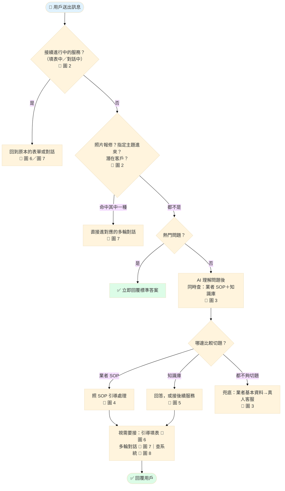
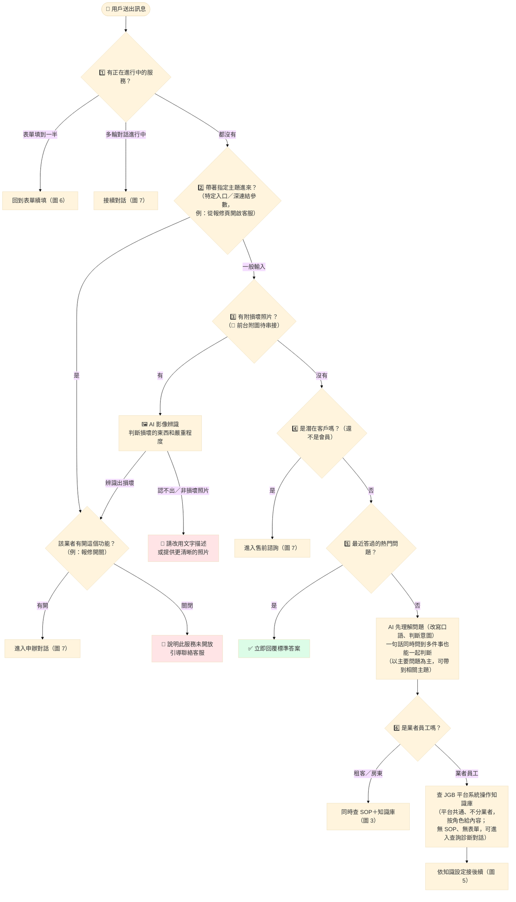
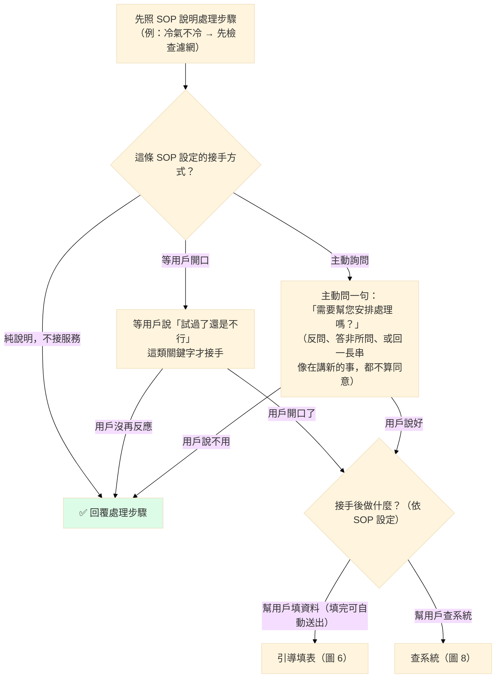
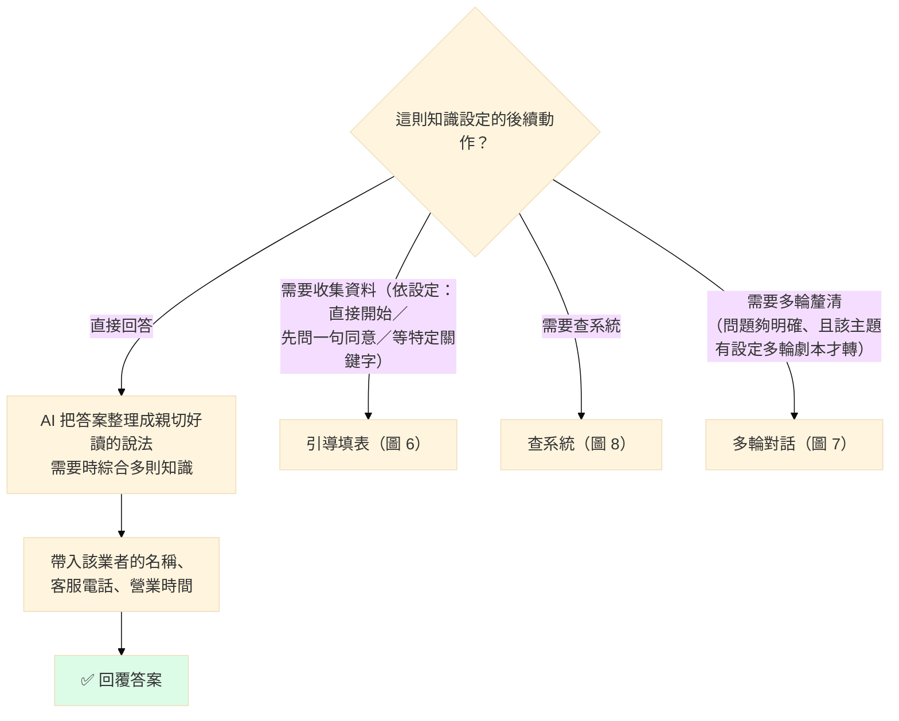
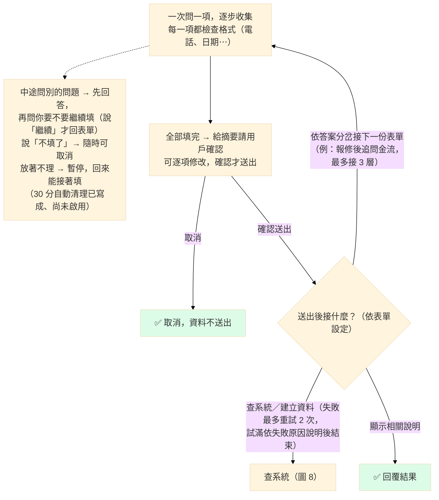
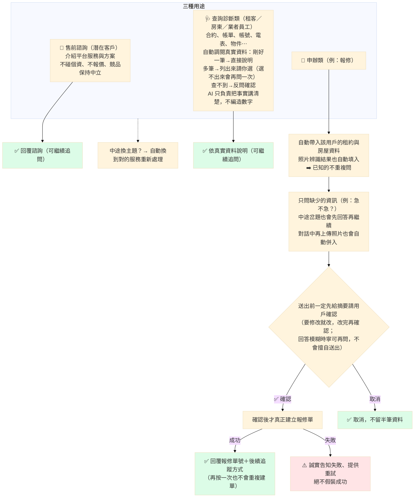
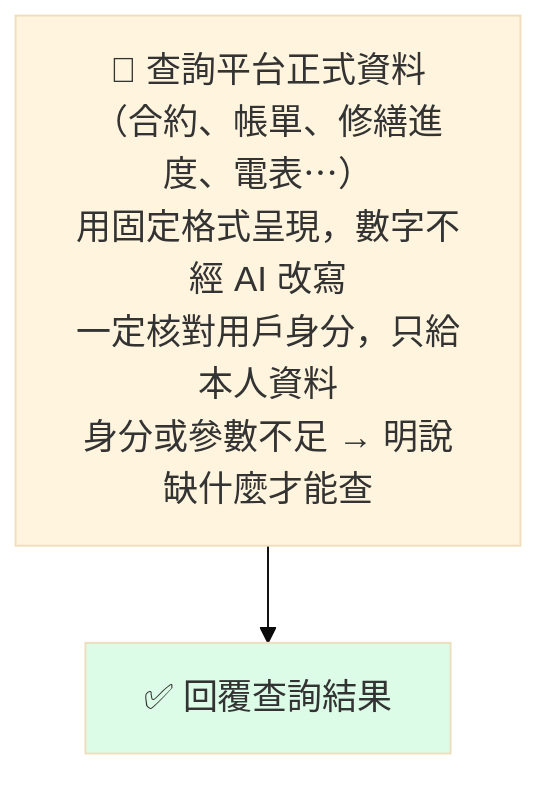
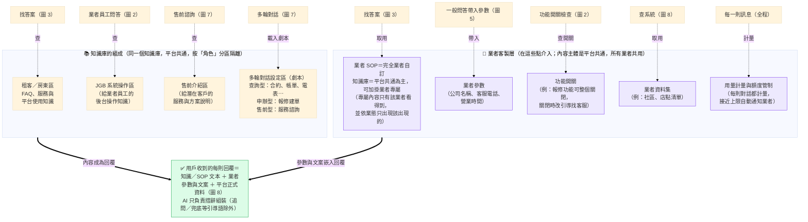

# AI 客服對話邏輯——業務版流程圖

> 受眾：非技術人員。技術對照版：[conversation-flow-complete.mmd](./conversation-flow-complete.mmd)（兩版同步維護）。
> 呈現方式說明：所有回覆都是**逐字即時顯示**（像真人打字）。
> **通路現況（2026-07-16 對 jgb2 程式查實）**：已上線進線＝業者員工（後台）＋售前訪客；租客／房東進線與**照片上傳**＝後端已建成並以 mock 驗證，**等 jgb2 前台串接後才開放**（照片放開場或流程中屬前台設計待拍板，後端兩路皆支援）。
> 最後更新：2026-07-16（逐節點對碼驗證：46 條斷言，證據見 [conversation-flow-evidence.md](./conversation-flow-evidence.md)）。

## 怎麼讀這份文件

- **圖 1 是主流程總覽**：一則訊息從進來到回覆的骨幹，每個粗框對應一張詳細圖。
- 圖 2～8 是各段落的放大圖，內容互相銜接。
- 圖示慣例：菱形＝判斷、綠色＝回覆用戶、紅色＝降級或失敗處理、紫色＝業者可自訂的部分。

---

## 圖 1｜主流程總覽

---

## 圖 2｜開場判斷（由上而下攔截，命中就直接接手）

---

## 圖 3｜找答案與裁決（租客／房東）

```mermaid
%%{init: {"theme":"base","themeVariables":{"fontSize":"18px"}}}%%
flowchart TB
    SEARCH["🔍 同時查兩個來源：<br/>業者 SOP（該業者自訂）<br/>＋知識庫（平台共通為主，可加掛業者專屬）"]
    SEARCH --> JUDGE{"哪邊的答案比較切題？<br/>（都切題時，有後續服務的優先<br/>→ 業者客製壓過平台通用）"}
    JUDGE -->|"業者 SOP 較切題"| SOP["走 SOP 路線（圖 4）"]
    JUDGE -->|"知識庫較切題"| KB["走一般問答路線（圖 5）"]
    JUDGE -->|"兩邊都不夠切題"| PARAMTRY{"問的是業者基本資料？<br/>（電話、營業時間、地址⋯）"}
    PARAMTRY -->|"是"| RPARAM["✅ 用業者登錄的資料直接答"]
    PARAMTRY -->|"否"| R4["🙋 禮貌說明沒有把握回答<br/>並提供真人客服管道"]
    style RPARAM fill:#dcfce7
    style R4 fill:#ffe4e6
```

---

## 圖 4｜路線一：業者 SOP（各業者自訂的處理流程）

---

## 圖 5｜路線二：一般問答（知識庫）

---

## 圖 6｜路線三：引導填表

---

## 圖 7｜路線四：智慧多輪對話（同一顆引擎，三種用途）

---

## 圖 8｜查系統（平台正式資料）

---

## 圖 9｜資料層：內容從哪裡來、業者能客製什麼

> 這一層不是流程的「一步」，而是前面所有路線**隨時取用的資料架**——所以它沒有自己的後續，箭頭指向它的，就是在用它的那些流程。

---

## 附註（完整性聲明）

- 本文件涵蓋全部對話機制：開場攔截、熱門秒回、SOP（三種接手方式）、一般問答、引導填表（含離題、暫停、修改、接續表單）、多輪對話（售前／診斷／申辦）、查系統、兜底、業者客製與知識庫組成。
- 刻意不畫的內部實作：相似度門檻數值、快取層數結構、AI 模型參數、檢索工程細節——這些不影響用戶可感知的行為，技術版都有。
- 單張合併大圖（工程用）：[conversation-flow-complete.mmd](./conversation-flow-complete.mmd)。
