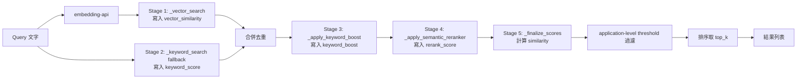

# Retriever Pipeline 架構

> 建立時間：2026-04-16
> 相關 spec：`.kiro/specs/retriever-similarity-refactor/`

## 概述

本文件描述 rag-orchestrator 的 retriever pipeline 設計，包含各階段職責、分數欄位語意、環境變數閾值對應、以及 `PERFECT_MATCH_THRESHOLD` 校準歷史。

---

## Pipeline 階段



每個 stage 為純資料增補（不覆寫前階段欄位），最終由 `_finalize_scores` 階段依公式組合 final `similarity`。

---

## 分數欄位定義

| 欄位 | 型別 | 來源 | 語意 |
|------|------|------|------|
| `vector_similarity` | float | Stage 1 SQL (`GREATEST(primary, fallback)` 的 cosine) | 純向量 cosine 分數（0.0–1.0）。keyword 路徑項目預設 0.0 |
| `keyword_score` | Optional[float] | Stage 2 `_keyword_search` | 關鍵字 normalized 分數（0.0–1.0）；未走 keyword 路徑為 `None` |
| `keyword_boost` | float | Stage 3 `_apply_keyword_boost` | 關鍵字命中加成倍率；未套用為 `1.0` |
| `rerank_score` | Optional[float] | Stage 4 `_apply_semantic_reranker` | bge-reranker-base 輸出（0.0–1.0）；未經 rerank 為 `None` |
| `similarity` | float | Stage 5 `_finalize_scores` | 最終排序分數（依下方公式計算） |
| `score_source` | str | Stage 5 `_finalize_scores` | `"rerank"` / `"keyword"` / `"vector"`，標示 `similarity` 的計算來源 |
| `original_similarity` | float | `_format_result` | `vector_similarity` 的向後相容 alias |

### Final similarity 計算公式（`_finalize_scores`）

```python
if rerank_score is not None:
    similarity = 0.1 * vector_similarity + 0.9 * rerank_score
    score_source = "rerank"
elif keyword_score is not None:
    similarity = min(1.0, max(vector_similarity, keyword_score) * keyword_boost)
    score_source = "keyword"
else:
    similarity = min(1.0, vector_similarity * keyword_boost)
    score_source = "vector"
```

**設計理由**：階層式取代線性加權，與現有 reranker「10% 原始 + 90% rerank」邏輯一致，無 rerank 時 fallback 到 keyword/vector 路徑，行為可預測。

---

## Stage 欄位轉換表

| Stage | 讀取欄位 | 寫入欄位 | 不可變更 |
|-------|---------|---------|---------|
| `_vector_search` | （query embedding, vendor_id） | `vector_similarity`, 基本 metadata | N/A |
| `_keyword_search` | （query, vendor_id） | `keyword_score`, `vector_similarity=0.0` | N/A |
| `_apply_keyword_boost` | `keywords`, `query` | `keyword_boost`, `keyword_matches` | `vector_similarity`, `keyword_score`, `similarity` |
| `_apply_semantic_reranker` | `content`/`answer`, `item_name`/`question_summary`, `query` | `rerank_score` | `vector_similarity`, `keyword_score`, `keyword_boost` |
| `_finalize_scores` | 上述所有分數欄位 | `similarity`, `score_source` | 所有前階段欄位 |
| application 端過濾 | `similarity` | - | - |

> ⚠️ `_apply_semantic_reranker` 必須保留 SOP→KB 欄位映射（`content→answer`、`item_name→question_summary`），否則 reranker HTTP 服務會收到空字串。

---

## 環境變數閾值對應

| 環境變數 | 對應欄位 | 比對位置 | 預設值 |
|---------|---------|---------|-------|
| `PERFECT_MATCH_THRESHOLD` | `vector_similarity` | `llm_answer_optimizer.optimize_answer` | 0.90 |
| `SOP_SIMILARITY_THRESHOLD` | `similarity`（final） | SOP retrieve() 後的 application 端過濾 | 0.75 |
| `KB_SIMILARITY_THRESHOLD` | `similarity`（final） | 知識庫 retrieve() 後的 application 端過濾 | 0.65 |
| `HIGH_QUALITY_THRESHOLD` | `similarity`（final） | `llm_answer_optimizer` 高品質判定 | 0.80 |
| `SYNTHESIS_THRESHOLD` | `similarity`（final） | `_should_synthesize` 合成觸發判定 | 0.80 |

**關鍵差異**：只有 `PERFECT_MATCH_THRESHOLD` 比對純向量分數（`vector_similarity`），其餘都比對 final `similarity`。

---

## 下游消費者欄位語意

| 檔案 / 位置 | 欄位 | 對應來源 |
|-----------|------|---------|
| `chat.py` debug_info.sop_candidates[].base_similarity | 純向量分數 | `vector_similarity` |
| `chat.py` debug_info.knowledge_candidates[].base_similarity | 純向量分數 | `vector_similarity` |
| `chat.py` debug_info.sop_candidates[].boosted_similarity | final 分數 | `similarity` |
| `chat.py` debug_info.*.score_source | 計算來源 | `score_source` |
| `chat_shared.has_sop_results` | SOP 檢測 | `scope == 'vendor_sop'`（不再依賴 similarity == 1.0） |
| `llm_answer_optimizer` perfect_match | 純向量分數 | `vector_similarity` |
| `llm_answer_optimizer._should_synthesize` | final 分數 | `similarity` |
| `backtest_framework_async` sources 注入 | final + 純向量 | `similarity` (主) + `vector_similarity`（輔助） |

---

## 效能設計

### 階段性 LIMIT

避免 SQL 取消 threshold 過濾後回傳量失控：

```
SQL vector search:      LIMIT 50    （SOP） / LIMIT 100 （知識庫）
Keyword fallback:       LIMIT 10
_apply_keyword_boost:   O(N) jieba
Reranker 過濾:          下限 + 上限截斷（見下方）
_apply_semantic_reranker: 過濾後送 HTTP 到 semantic-model
最終回傳:                top_k=5
```

### Reranker 效能調校（2026-04-17 新增）

> 問題來源：`.kiro/issues/reranker-returning-zero.md`
> 根因：bge-reranker-base CPU 推論對大批次較慢（56 筆 ~27s），client timeout 15s 必超時。

送進 reranker 前套用**兩層過濾**（見 `base_retriever.py` Step 5）：

**第一層：下限過濾** `RERANKER_MIN_VECTOR_SIMILARITY`（預設 0.3）
- `vector_similarity < threshold` 的候選直接丟棄
- rerank 對低向量分項目幾乎不可能打高分，送進去只是浪費推論時間
- ⚠️ `keyword_fallback` 項目**不受下限影響**（它們 `vector_similarity=0` 是設計預設值，代表走 keyword 路徑）

**第二層：上限截斷** `RERANKER_INPUT_LIMIT`（預設 20）
- 若剩餘候選仍超過上限，優先保留 `keyword_fallback` 項，再以 `vector_similarity` 補足 vector 項
- 避免因為 `vector_similarity=0` 預設值把 keyword 項誤砍

**第三層：全 0 防護**（`_apply_semantic_reranker`）
- 若 reranker 回傳所有 `semantic_score == 0`，視為服務異常
- 不寫入 `rerank_score`，讓 `_finalize_scores` 退回 vector / keyword 分支
- 避免 reranker 失效時 final similarity 全部退化成 `0.1 × vector_similarity`

### HTTP Timeout `RERANKER_HTTP_TIMEOUT`（預設 60 秒）

原本 15 秒 timeout 無法支撐 CPU 推論，提高到 60 秒。正常請求約 3–10 秒內完成。

### Reranker 環境變數總覽

| 變數 | 預設 | 說明 |
|------|------|------|
| `RERANKER_MIN_VECTOR_SIMILARITY` | 0.3 | vector 下限，低於此值的 vector 項不送 rerank |
| `RERANKER_INPUT_LIMIT` | 20 | 送進 reranker 的候選數上限（優先保留 keyword_fallback）|
| `RERANKER_HTTP_TIMEOUT` | 60 | HTTP client timeout（秒）|

### 實測效果（vendor_id=2，查詢「合約簽署」）

| 路徑 | vector_search 回傳 | 下限過濾後 | rerank 處理時間 |
|------|------------------|-----------|---------------|
| SOP | 15 | 7 | ~2s |
| KB | 56 | 10 | ~3-4s |

（調校前 KB 56 筆要 ~27s，100% 超時失敗；調校後降到 10 筆，約 3-4s 穩定完成）

### 快取

保留現有 Redis 快取；快取 key 不變。

---

## 校準歷史

### PERFECT_MATCH_THRESHOLD 校準

> ⚠️ 重構後 `PERFECT_MATCH_THRESHOLD` 語意從「含 boost 的 similarity」改為「純 vector_similarity」，
> 預估閾值映射 `0.90 → 0.82`，但實際值須依 staging 回測結果決定。

| 日期 | 版本 | 閾值 | pass_rate | perfect_match_rate | 決策 |
|------|------|------|-----------|-------------------|------|
| _待測_ | baseline（重構前） | 0.90 | — | — | — |
| _待測_ | refactored（重構後） | 0.90 | — | — | 預期下降，需校準 |
| _待測_ | refactored（校準後） | 0.82（預估） | — | — | 依回測結果調整 |

**校準流程**（詳見 `.kiro/specs/retriever-similarity-refactor/design.md` 決策 6）：

1. **Step 1** — 以重構前版本跑 vendor_id=2 的 approved scenarios 回測，記錄為 `baseline_metrics.json`
2. **Step 2** — 部署重構版本到 staging，跑相同測試集，記錄為 `refactored_metrics.json`
3. **Step 3** — 比對：
   - `pass_rate` 變化 ≤ ±5% 且 `perfect_match_rate` 變化 ≤ ±10% → ✅ 通過
   - `perfect_match_rate` 大幅下降（> 10%）→ 降低 `PERFECT_MATCH_THRESHOLD`
   - `pass_rate` 下降 > 5% → 檢查 retriever 排序邏輯
4. **Step 4** — 更新 `.env.example` 與 `docker-compose.prod.yml` 的閾值，並在本文表格記錄決策

---

## 效能基準

| 指標 | 重構前（baseline） | 重構後目標 | 驗證方法 |
|------|---------------|-----------|---------|
| `/api/v1/message` 平均延遲 | 待測 | 差異 < 10% | 100 次相同 query 腳本 |
| `_vector_search` 執行時間 | 待測 | 差異 < 20%（單筆增加 < 50ms） | log 抽樣 |
| `_apply_semantic_reranker` 執行時間 | 待測 | 差異 < 30%（候選數增加） | log 抽樣 |

若平均延遲增加 > 10%，縮小 vector `LIMIT`（50→30）或排查 reranker bottleneck。

---

## 變更歷史

| 日期 | 版本 | 變更內容 |
|------|------|---------|
| 2026-04-16 | 1.0 | 初始版本（retriever-similarity-refactor 實作） |

---

## 參考資料

- [Spec：retriever-similarity-refactor](../../.kiro/specs/retriever-similarity-refactor/)
  - `requirements.md`
  - `design.md`
  - `tasks.md`
- [Steering：tech.md](../../.kiro/steering/tech.md)
