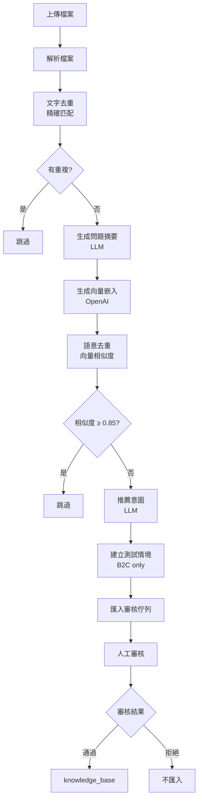

# 📥 知識匯入功能文檔

## 概述

知識匯入功能提供了一個完整的流程，讓使用者可以批量匯入知識到系統中。所有匯入的知識都會先進入審核佇列，經過人工審核後才會加入正式知識庫。

### 核心特色

- ✅ **多格式支援**：Excel (.xlsx), CSV (.csv), JSON, TXT
- 🔍 **雙層去重機制**：文字去重 + 語意去重
- 🤖 **AI 自動處理**：問題生成、向量嵌入、意圖推薦
- 🧪 **自動測試情境**：B2C 知識自動創建測試情境
- 📋 **審核佇列**：所有知識需經人工審核
- 💰 **成本優化**：文字去重在 LLM 前執行，節省 API 成本
- 🌐 **多語言支援**：CSV 格式支援 JSON 欄位，自動提取繁體中文

---

## 📊 匯入流程



---

## 🔍 去重機制

### 階段 1：文字去重（精確匹配）

**執行時機**：在 LLM 前執行，節省 OpenAI API 成本

**檢查範圍**：3 張表
1. `knowledge_base` - 正式知識庫（問題 + 答案）
2. `ai_generated_knowledge_candidates` - 審核佇列（問題 + 答案）
3. `test_scenarios` - 測試情境（問題）

**判斷邏輯**：
```sql
SELECT COUNT(*) FROM (
    SELECT 1 FROM knowledge_base
    WHERE question_summary = ? AND answer = ?
    UNION ALL
    SELECT 1 FROM ai_generated_knowledge_candidates
    WHERE question = ? AND generated_answer = ?
    UNION ALL
    SELECT 1 FROM test_scenarios
    WHERE test_question = ?
) AS combined
```

**結果**：完全相同 → 跳過

### 階段 2：語意去重（向量相似度）

**執行時機**：生成 embedding 後

**檢查範圍**：3 張表
1. `knowledge_base` (embedding 相似度)
2. `ai_generated_knowledge_candidates` (embedding 相似度)
3. `test_scenarios` (embedding 相似度)

**判斷邏輯**：
- 相似度閾值：**0.85**
- 使用 pgvector 的 cosine distance (`<=>` operator)
- 函數：`check_knowledge_exists_by_similarity(embedding, threshold)`

**結果**：相似度 ≥ 0.85 → 跳過

---

## 📂 支援的檔案格式

### 1. CSV (.csv)

**特色**：
- ✅ 支援標準 CSV 格式
- ✅ 支援 JSON 欄位格式（自動解析）
- ✅ 支援多語言（自動提取 zh-TW）
- ✅ 自動清理 HTML 標籤

**支援的欄位名稱**（不區分大小寫）：

| 欄位 | 別名 | 必填 | 說明 |
|------|------|------|------|
| 問題 | question, 問題摘要, question_summary, title, 標題 | 否* | 若無提供，LLM 自動生成 |
| 答案 | answer, 回覆, response, content, 內容 | ✅ 是 | 至少 10 字 |
| 分類 | category, 類別, type | 否 | 預設「一般問題」 |
| 對象 | audience, 受眾, target_user | 否 | 預設「租客」 |
| 關鍵字 | keywords, 標籤, tags | 否 | 逗號分隔 |

#### 格式 1：標準 CSV

**範例檔案**：

```csv
分類,問題,答案,對象,關鍵字
帳務查詢,如何繳納租金？,請於每月 1 號前透過 ATM 轉帳...,租客,"繳費,租金,ATM"
寵物規定,可以養寵物嗎？,部分物件允許飼養小型寵物...,租客,"寵物,飼養"
```

#### 格式 2：JSON 欄位格式（help_datas.csv）

**說明**：欄位值為 JSON 字串，自動提取繁體中文（zh-TW）

**範例檔案**：

```csv
title,title.1,content
"{""zh-TW"":""物件"",""en-US"":""Property""}","{""zh-TW"":""如何新增物件？"",""en-US"":""How to add property?""}","{""zh-TW"":""<p>房東可到「物件管理」...</p>""}"
```

**處理邏輯**：
1. 自動偵測 JSON 格式（`{` 開頭 `}` 結尾）
2. 解析 JSON 並提取 `zh-TW` 欄位
3. 自動清理 HTML 標籤：
   - 移除 `style` 屬性
   - 移除 `<span>` 標籤
   - 將 `<p>` 轉換為換行
4. 生成向量嵌入

**處理前**：
```json
{
  "zh-TW": "<p><span style=\"font-size:18px\">房東可到「物件管理」中的「物件總表」...</span></p>",
  "en-US": "<p>The lessor can go to...</p>"
}
```

**處理後**：
```
房東可到「物件管理」中的「物件總表」...
```

#### 欄位映射邏輯

**智能偵測**：
- 如果找不到標準欄位名稱，自動偵測 `help_datas.csv` 格式
- 第一欄 → 分類（title）
- 第二欄 → 問題（title.1）
- 第三欄 → 答案（content）

**日誌範例**：
```
📖 解析 CSV 檔案: help_datas.csv
   讀取 72 行資料
   欄位: ['title', 'title.1', 'content']
   偵測到特殊格式 CSV，使用欄位: title, title.1, content
   ✅ 解析出 72 個有效知識項目
```

---

### 2. Excel (.xlsx, .xls)

**支援的欄位名稱**（不區分大小寫）：

| 欄位 | 別名 | 必填 | 說明 |
|------|------|------|------|
| 問題 | question, 問題摘要, question_summary, title, 標題 | 否* | 若無提供，LLM 自動生成 |
| 答案 | answer, 回覆, response, content, 內容 | ✅ 是 | 至少 10 字 |
| 分類 | category, 類別, type | 否 | 預設「一般問題」 |
| 對象 | audience, 受眾 | 否 | 預設「租客」 |
| 關鍵字 | keywords, 標籤, tags | 否 | 逗號分隔 |

**範例檔案**：

| 問題 | 答案 | 分類 | 對象 | 關鍵字 |
|------|------|------|------|--------|
| 如何繳納租金？ | 請於每月 1 號前透過 ATM 轉帳... | 帳務查詢 | 租客 | 繳費, 租金, ATM |
| 可以養寵物嗎？ | 部分物件允許飼養小型寵物... | 寵物規定 | 租客 | 寵物, 飼養 |

### 2. JSON

**格式 1**：
```json
{
  "knowledge": [
    {
      "question": "如何繳納租金？",
      "answer": "請於每月 1 號前透過 ATM 轉帳...",
      "category": "帳務查詢",
      "audience": "租客",
      "keywords": ["繳費", "租金"]
    }
  ]
}
```

**格式 2**：
```json
[
  {
    "question_summary": "如何繳納租金？",
    "answer": "請於每月 1 號前透過 ATM 轉帳...",
    "category": "帳務查詢"
  }
]
```

### 3. TXT（純文字）

**處理方式**：使用 LLM 自動提取知識

**範例**：
```
租金繳費說明

租金應於每月 1 號前繳清。可透過以下方式繳費：
1. ATM 轉帳
2. 線上刷卡
3. 超商繳費

逾期將加收手續費。
```

LLM 會自動分析並提取：
- 問題摘要：「如何繳納租金？」
- 答案：完整的繳費說明
- 分類：「帳務查詢」
- 關鍵字：["繳費", "租金", "ATM"]

---

## 🤖 AI 自動處理

### 1. 問題摘要生成

**觸發條件**：Excel/JSON 未提供問題欄位

**使用模型**：`gpt-4o-mini`

**Prompt 範例**：
```
請根據以下答案，生成一個簡潔的問題摘要（15字以內）。

分類：帳務查詢
答案：租金應於每月 1 號前繳清。可透過 ATM 轉帳、線上刷卡或超商繳費...

只輸出問題摘要，不要加其他說明。
```

**輸出**：「如何繳納租金？」

### 2. 向量嵌入生成

**使用模型**：`text-embedding-3-small` (1536 維度)

**輸入文字**：`問題摘要 + 答案前 200 字`

**範例**：
```
如何繳納租金？ 租金應於每月 1 號前繳清。可透過 ATM 轉帳、線上刷卡或超商繳費。逾期 5 天後將加收 200 元手續費...
```

**輸出**：`[0.023, -0.045, 0.012, ..., 0.089]` (1536 個浮點數)

**儲存位置**：
- `knowledge_base.embedding` (審核通過後)
- `ai_generated_knowledge_candidates.question_embedding` (審核佇列)
- `test_scenarios.question_embedding` (測試情境)

### 3. 意圖推薦

**使用模型**：`gpt-4o-mini`

**Prompt 範例**：
```
請根據以下問答內容，從意圖清單中選擇最合適的意圖。

問題：如何繳納租金？
答案：租金應於每月 1 號前繳清...
分類：帳務查詢

可用的意圖清單：
- 1: 預約看房 (租客預約看房相關問題)
- 2: 入住流程 (新租客入住流程說明)
- 6: 帳務查詢 (租金繳費、帳單查詢)
- ...

請以 JSON 格式回應：
{
  "intent_id": 推薦的意圖 ID（數字）,
  "intent_name": 意圖名稱,
  "confidence": 信心度（0.0-1.0）,
  "reasoning": 推薦理由（簡短說明）
}
```

**輸出範例**：
```json
{
  "intent_id": 6,
  "intent_name": "帳務查詢",
  "confidence": 0.95,
  "reasoning": "問題涉及繳納租金的方式和期限，屬於帳務查詢的範疇。"
}
```

---

## 🧪 測試情境自動創建

### 觸發條件

1. **對象為 B2C**：租客、房東 (audience in ['租客', '房東', 'tenant', 'landlord'])
2. **測試情境表中不存在相同問題**

### 創建內容

```sql
INSERT INTO test_scenarios (
    test_question,           -- 問題
    expected_category,       -- 分類
    difficulty,             -- 難度（預設 'medium'）
    status,                 -- 狀態（'pending_review'）
    source,                 -- 來源（'imported'）
    created_at
) VALUES (?, ?, ?, ?, ?, CURRENT_TIMESTAMP)
```

### 範例

**匯入知識**：
- 問題：「如何繳納租金？」
- 對象：租客
- 分類：帳務查詢

**自動創建測試情境**：
- test_question: 「如何繳納租金？」
- expected_category: 「帳務查詢」
- difficulty: 'medium'
- status: 'pending_review'
- source: 'imported'

---

## 📋 審核佇列

### 資料表結構

**測試情境** (`test_scenarios`):
```
id: 測試情境 ID
test_question: 問題
expected_category: 預期分類
difficulty: 難度 (easy/medium/hard)
status: 狀態 (pending_review/approved/rejected)
source: 來源 (imported/manual/user_question)
question_embedding: 問題向量 (1536 維度)
```

**知識候選** (`ai_generated_knowledge_candidates`):
```
id: 候選 ID
test_scenario_id: 關聯的測試情境 (外鍵)
question: 問題
generated_answer: 答案
question_embedding: 問題向量 (1536 維度)
confidence_score: 信心分數
ai_model: AI 模型 ('knowledge_import' 表示來自匯入)
generation_reasoning: 生成理由（含意圖推薦資訊）
status: 狀態 (pending_review/approved/rejected)
```

### 審核流程

```
1. 知識匯入 → ai_generated_knowledge_candidates (status='pending_review')
                ↓
2. 人工審核 → 審核中心介面
                ↓
3. 審核決定 → approved / rejected
                ↓
4. 審核通過 → knowledge_base (正式知識庫)
```

---

## 🔧 API 使用

### 1. 上傳檔案匯入知識

**端點**：`POST /api/v1/knowledge-import/upload`

**Request**：
```bash
curl -X POST http://localhost:8100/api/v1/knowledge-import/upload \
  -F "file=@test_knowledge_data.xlsx" \
  -F "vendor_id=1" \
  -F "import_mode=append" \
  -F "enable_deduplication=true"
```

**參數說明**：
- `file`: 上傳的檔案 (CSV/Excel/JSON/TXT)
- `vendor_id`: 業者 ID（可選，通用知識可不填）
- `import_mode`: 匯入模式
  - `append`: 追加（預設）
  - `replace`: 取代業者現有知識
  - `merge`: 合併（去重後追加）
- `enable_deduplication`: 是否啟用去重（預設 true）

**Response**：
```json
{
  "job_id": "f87958b1-a660-477f-8725-17b074da76f0",
  "status": "processing",
  "message": "檔案上傳成功，開始處理中。所有知識將進入審核佇列，需經人工審核後才會正式加入知識庫。"
}
```

### 2. 查詢匯入作業狀態

**端點**：`GET /api/v1/knowledge-import/jobs/{job_id}`

**Request**：
```bash
curl http://localhost:8100/api/v1/knowledge-import/jobs/f87958b1-a660-477f-8725-17b074da76f0
```

**Response（處理中）**：
```json
{
  "job_id": "f87958b1-a660-477f-8725-17b074da76f0",
  "status": "processing",
  "progress": {
    "current": 55,
    "total": 100,
    "stage": "生成向量嵌入"
  },
  "created_at": "2025-10-12T10:48:20Z",
  "updated_at": "2025-10-12T10:48:25Z"
}
```

**Response（完成）**：
```json
{
  "job_id": "f87958b1-a660-477f-8725-17b074da76f0",
  "status": "completed",
  "progress": {
    "current": 100,
    "total": 100
  },
  "result": {
    "imported": 10,
    "skipped": 0,
    "errors": 0,
    "total": 10,
    "test_scenarios_created": 8,
    "mode": "review_queue"
  },
  "completed_at": "2025-10-12T10:48:30Z"
}
```

### 3. 查詢審核佇列

**端點**：`GET /api/v1/knowledge/candidates`

**Request**：
```bash
curl "http://localhost:8100/api/v1/knowledge/candidates?status=pending_review&ai_model=knowledge_import"
```

**Response**：
```json
{
  "candidates": [
    {
      "id": 45,
      "test_scenario_id": 20,
      "question": "如何繳納租金？",
      "generated_answer": "租金應於每月 1 號前繳清...",
      "confidence_score": 0.95,
      "ai_model": "knowledge_import",
      "generation_reasoning": "分類: 帳務查詢, 對象: 租客\n\n【推薦意圖】\n意圖 ID: 6\n意圖名稱: 帳務查詢\n信心度: 0.95",
      "status": "pending_review",
      "created_at": "2025-10-12T10:48:30Z"
    }
  ],
  "total": 10
}
```

---

## 📊 驗證測試結果

### 測試場景

**測試檔案**：10 條知識
- 1 條完全重複（項目 1 & 8）
- 2 組語意相似（1&2 租金，3&4 寵物）
- 9 條 B2C（租客/房東）
- 1 條 B2B（管理師）

### Round 1：第一次匯入（資料庫為空）

**結果**：
```
✅ 匯入知識: 10 條
✅ 測試情境: 8 個（9 條 B2C - 1 條重複）
✅ 審核佇列: 13 條（10 條匯入 + 3 條舊資料）
✅ 處理時間: ~15 秒
✅ 意圖推薦: 全部成功（信心度 0.95-1.0）
```

### Round 2：第二次匯入（驗證去重）

**結果**：
```
✅ 匯入知識: 0 條（全部攔截）
✅ 測試情境: 0 個
✅ 審核佇列: 13 條（維持不變）
✅ 處理時間: < 1 秒
✅ 去重階段: 文字去重（節省 10 次 embedding 呼叫）
```

**去重日誌**：
```
🔍 執行文字去重（精確匹配）...
   跳過重複: 如何繳納租金？...
   跳過重複: 租金要怎麼繳？...
   跳過重複: 可以養寵物嗎？...
   ... (共 10 條)
🔍 文字去重: 跳過 10 條完全相同的項目，剩餘 0 條
📊 總計跳過: 10 條（文字: 10, 語意: 0）
```

---

## 🎯 效能優化

### 1. 文字去重在 LLM 前執行

**原因**：節省 OpenAI API 成本

**流程**：
```
解析檔案 (10 條)
  ↓
文字去重 → 跳過 10 條 → 剩餘 0 條
  ↓
❌ 不執行：問題生成 (gpt-4o-mini)
❌ 不執行：向量嵌入 (text-embedding-3-small)
❌ 不執行：語意去重
❌ 不執行：意圖推薦 (gpt-4o-mini)
```

**節省成本**：
- 0 次問題生成呼叫
- 0 次 embedding 呼叫（**省最多**）
- 0 次意圖推薦呼叫

### 2. 批次處理

**embedding 生成**：
- 每處理 10 條顯示進度
- Sleep 0.05 秒避免 rate limit

**意圖推薦**：
- 每處理 1 條 sleep 0.1 秒
- 避免 OpenAI rate limit

---

## 🗄️ 資料庫設計

### Migration 31: 審核佇列語意去重支援

**檔案**：`database/migrations/31-add-embedding-to-review-queue.sql`

**變更**：
1. 為 `ai_generated_knowledge_candidates` 增加 `question_embedding` 欄位
2. 為 `test_scenarios` 增加 `question_embedding` 欄位
3. 創建 `find_similar_knowledge_candidate()` 函數
4. 建立 ivfflat 索引提升查詢效能

### Migration 32: 測試情境語意檢查

**檔案**：`database/migrations/32-add-test-scenario-similarity-check.sql`

**變更**：
1. 創建 `find_similar_test_scenario()` 函數
2. 更新 `check_knowledge_exists_by_similarity()` 函數支援 3 張表檢查
3. 返回 `exists_in_test_scenarios` 欄位

**函數定義**：
```sql
CREATE OR REPLACE FUNCTION check_knowledge_exists_by_similarity(
    p_question_embedding vector(1536),
    p_similarity_threshold DECIMAL DEFAULT 0.85
)
RETURNS TABLE (
    exists_in_knowledge_base BOOLEAN,
    exists_in_review_queue BOOLEAN,
    exists_in_test_scenarios BOOLEAN,    -- 新增
    knowledge_id INTEGER,
    candidate_id INTEGER,
    scenario_id INTEGER,                 -- 新增
    matched_question TEXT,
    similarity_score DECIMAL,
    source_table VARCHAR
)
```

---

## 🚨 常見問題

### Q1: 為什麼第一次匯入沒有去重？

**A**: 第一次匯入時資料庫為空，沒有可比對的資料。去重功能會在：
- 第二次匯入相同檔案時生效
- 已有測試情境/審核佇列/知識庫資料時生效

### Q2: 為什麼要檢查 test_scenarios？

**A**: 因為匯入流程會先創建測試情境（status='pending_review'），如果不檢查測試情境：
- 第二次匯入會創建重複的測試情境
- 即使知識候選被攔截，測試情境還是會重複

### Q3: 語意去重的閾值可以調整嗎？

**A**: 可以。閾值預設為 0.85，可在 `_deduplicate_by_similarity()` 函數中調整：
```python
knowledge_list = await self._deduplicate_by_similarity(
    knowledge_list,
    threshold=0.85  # 調整此值
)
```

**建議值**：
- 0.90-0.95：嚴格（只過濾非常相似的）
- 0.85：平衡（預設）
- 0.75-0.80：寬鬆（過濾較多相似問題）

### Q4: 如何查看匯入的詳細日誌？

**A**: 使用 Docker logs：
```bash
docker logs aichatbot-rag-orchestrator 2>&1 | grep -A 50 "job_id"
```

### Q5: 匯入失敗如何排查？

**A**: 檢查以下項目：
1. **檔案格式**：確認是 .csv / .xlsx / .json / .txt
2. **必填欄位**：答案欄位至少 10 字
3. **OpenAI API Key**：確認環境變數已設定
4. **容器狀態**：`docker-compose ps`
5. **資料庫連線**：`docker logs aichatbot-postgres`

---

## 📚 相關文件

- [API 參考文件](../api/KNOWLEDGE_IMPORT_API.md)
- [測試情境管理](./TEST_SCENARIO_STATUS_MANAGEMENT.md)
- [AI 知識生成](./AI_KNOWLEDGE_GENERATION_FEATURE.md)
- [審核中心使用指南](../guides/REVIEW_CENTER_GUIDE.md)

---

**建立日期**: 2025-10-12
**最後更新**: 2025-11-13
**版本**: 1.1 (新增 CSV 支援)
**維護者**: Claude Code
