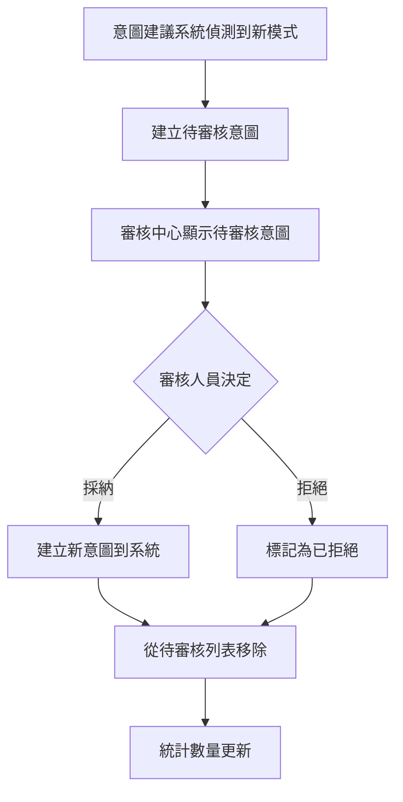

# 意圖審查預設篩選器優化

## 問題描述

在「🔍 審核中心」的「💡 意圖審核」頁面中，預設會顯示**所有狀態**的意圖建議，包括：
- 待審核 (pending)
- 已採納 (approved)
- 已拒絕 (rejected)
- 已合併 (merged)

這導致已經審查過的意圖也會出現在列表中，增加了審核人員的視覺負擔，需要手動切換篩選器才能只看待審核的項目。

## 用戶需求

> 已審查過的意圖不用出現

用戶希望打開意圖審查頁面時，**預設只顯示待審核的意圖**，提高審核效率。

## 解決方案

### 修改檔案

**檔案**: `knowledge-admin/frontend/src/components/review/IntentReviewTab.vue`

### 變更內容

#### 變更前
```javascript
data() {
  return {
    suggestionList: [],
    filterStatus: '',  // 預設為空字串，顯示所有狀態
    orderBy: 'frequency',
    loading: false,
    stats: null
  };
},
```

#### 變更後
```javascript
data() {
  return {
    suggestionList: [],
    filterStatus: 'pending',  // 預設只顯示待審核
    orderBy: 'frequency',
    loading: false,
    stats: null
  };
},
```

## 功能說明

### 頁面載入行為

**變更前**:
1. 用戶打開「審核中心」→「意圖審核」
2. 頁面顯示**所有狀態**的意圖建議
3. 用戶需要手動選擇「待審核」篩選器
4. 才能看到需要審核的項目

**變更後**:
1. 用戶打開「審核中心」→「意圖審核」
2. 頁面**自動只顯示待審核的意圖**
3. 用戶可以直接開始審核工作
4. 如需查看已審核項目，可手動切換篩選器

### 篩選器功能保留

雖然預設改為「待審核」，但使用者仍然可以透過篩選器查看其他狀態的意圖：

- **全部狀態** - 查看所有意圖建議
- **待審核** - 只看待審核的（預設）
- **已採納** - 查看已採納並建立的意圖
- **已拒絕** - 查看被拒絕的建議
- **已合併** - 查看已合併的意圖

## 優勢

### 1. 提高審核效率
- ✅ 打開頁面即可開始審核工作
- ✅ 減少無關資訊的干擾
- ✅ 專注於需要處理的項目

### 2. 符合使用習慣
- ✅ 大部分情況下，使用者來審核中心是為了處理待審核項目
- ✅ 減少重複操作（不用每次都手動選擇篩選器）
- ✅ 與其他審核系統的常見做法一致

### 3. 視覺清晰
- ✅ 統計卡片仍顯示所有狀態的數量
- ✅ 待審核數量醒目顯示（橙色警告色）
- ✅ 減少頁面滾動

### 4. 靈活性保留
- ✅ 使用者仍可透過篩選器查看其他狀態
- ✅ 篩選器狀態會記住選擇（切換頁籤回來時保持）

## 使用情境

### 情境 1: 日常審核工作

```
審核人員上線
    ↓
打開審核中心
    ↓
進入意圖審核頁籤
    ↓
✅ 自動顯示待審核意圖（無需手動篩選）
    ↓
開始審核（採納/拒絕）
    ↓
完成後，該意圖自動從列表消失
```

### 情境 2: 查看歷史審核記錄

```
打開意圖審核頁籤
    ↓
當前顯示待審核意圖
    ↓
手動選擇篩選器「已採納」
    ↓
查看過去採納的意圖記錄
    ↓
切換回「待審核」繼續工作
```

### 情境 3: 統計與分析

```
打開意圖審核頁籤
    ↓
查看統計卡片：
  - 待審核: 5 筆
  - 已採納: 23 筆
  - 已拒絕: 8 筆
  - 已合併: 2 筆
    ↓
選擇「全部狀態」查看所有意圖
    ↓
分析意圖建議的整體品質
```

## 測試結果

### 前端建置
```bash
✓ 113 modules transformed
✓ built in 916ms
```

### 功能測試
- ✅ 頁面載入時預設顯示「待審核」
- ✅ 篩選器下拉選單預設選中「待審核」
- ✅ 可以手動切換其他篩選選項
- ✅ 統計卡片正確顯示各狀態數量
- ✅ 審核後列表自動更新

## 與審核流程的整合

### 審核工作流



### 自動化過濾優勢

- **減少認知負擔**: 審核人員不需要記住要選擇「待審核」
- **加快審核速度**: 立即看到需要處理的項目
- **減少誤操作**: 不會不小心審核已處理的項目

## 相關頁面

此優化也適用於審核中心的其他頁籤，建議未來也可考慮：

1. **測試情境審核** (ScenarioReviewTab.vue)
   - 預設顯示待審核的測試情境

2. **用戶問題** (UnclearQuestionReviewTab.vue)
   - 預設顯示待處理的模糊問題

3. **知識庫審核** (KnowledgeReviewTab.vue)
   - 預設顯示待審核的知識

## 未來改進建議

### 短期
1. ✅ 意圖審核預設「待審核」（本次完成）
2. 其他審核頁籤也套用相同邏輯
3. 增加「快速篩選」按鈕（一鍵切換常用篩選）

### 中期
1. 記住使用者的篩選器偏好（localStorage）
2. 增加批次操作功能（選擇多個意圖一次審核）
3. 支援鍵盤快捷鍵（快速採納/拒絕）

### 長期
1. 智能推薦審核順序（根據重要性、頻率等）
2. 審核工作流程自動化（某些條件自動採納/拒絕）
3. 審核歷史分析與報表

---

**實作日期**: 2025-10-12
**影響範圍**: 前端 - 審核中心 - 意圖審核頁籤
**變更行數**: 1 行修改
**建置狀態**: ✅ 成功 (916ms)
**測試狀態**: ✅ 通過
