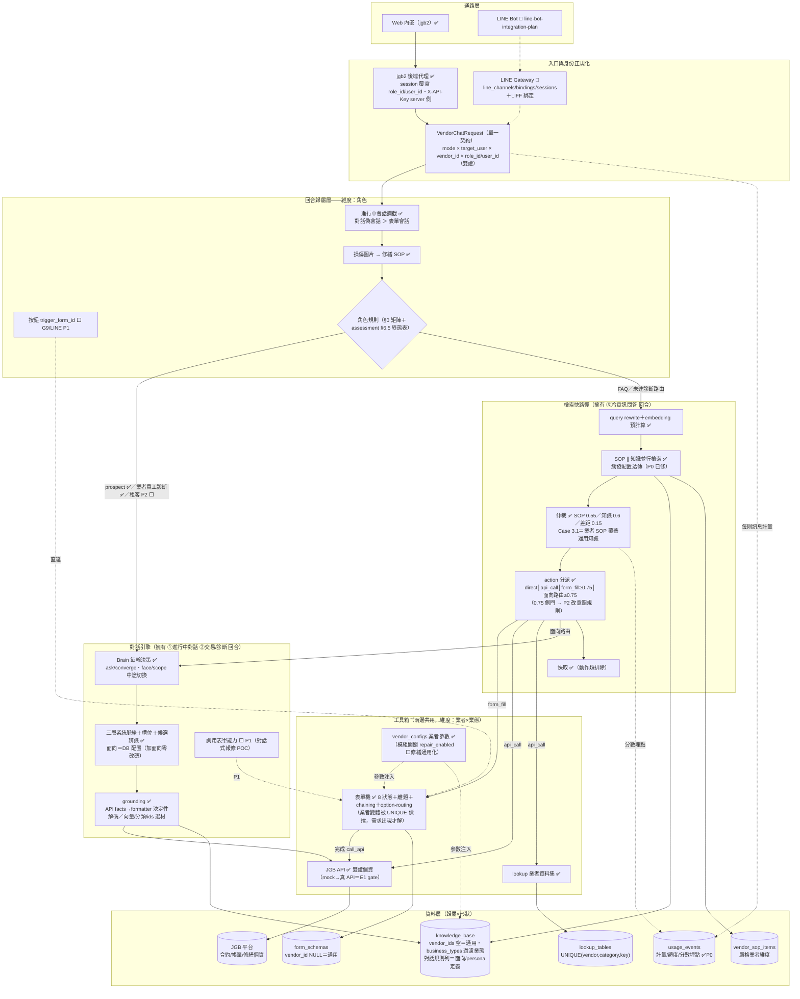

# Chat 對話系統架構全貌：知識／SOP／表單／API／對話面向／lookup

> 版本：v2（2026-07-10）
> 性質：對碼查實的「實然」＋定案的「應然」＋設計方向判定。關鍵事實均附 file:line；與既有記錄矛盾處（option-routing、pending_question）已親自核實以碼為準。
> ⚠️ **行號僅供參考，以符號為準**——行號會隨 commit 漂移，引用前以檔名＋可 grep 的符號重新對碼。

## 全景架構圖（實然＋終態，狀態標記：✅ 生產/已收案　🚧 已規劃有案　⬜ 未立案/待建）

> 2026-07-11 補。骨架（回合歸屬→引擎/快路徑→工具箱→資料層）× 四維度（通路/角色/業者/業態）的完整圖；角色終態表與遷移路徑見 conversation-first-architecture-assessment.md §6.5。



**遷移進度尺**：P0 觸發語彙還債 ✅收案（18f64a4，待部署）→ P1 引擎調表單 ⬜ → P2 租客反轉 ⬜（前置：視角補全＋多輪基準＋灰帶數據）→ P3 表單機收斂 ⬜；並行：LINE Phase 1 🚧（等三拍板＋E2/E3）、修繕通用化 ⬜（零依賴可開）、E1 真 API＝上線 gate。

## 0. 入口 × 角色矩陣

| 角色 | mode | 進場路徑 | 能力邊界 |
|---|---|---|---|
| 租客/房東（b2c） | b2c | 完整管線（§1） | SOP＋知識＋表單＋API＋對話面向；個資雙證 |
| 業者員工（b2b） | b2b | 跳過 SOP、只檢索 JGB 系統知識庫（chat.py:1742-1761），但知識命中診斷分類後**照樣進對話面向引擎**（分類路由無 mode 驗證，chat.py:646-659）——五面向 e2e 即以 b2b＋property_manager＋真 role_id 收案 | 問答＋診斷面向（含 JGB API facts）；無 SOP/表單 |
| 潛在客戶（prospect） | b2b＋無 role_id | **engine-first**：優先進對話引擎（售前配置，chat.py:589） | 售前四鐵則，無個資能力 |

## 1. 一則訊息的完整決策管線（實然）

```
請求（mode, vendor_id, role_id, user_id, session_id, message, image_urls）
│
├─ Step 0a  role_id 自動補全（vendors.settings.jgb_role_id，chat.py:3782）
├─ Step 0   會話攔截（最優先，chat.py:3800-3822）——讀取順序：
│           ①對話偽會話（form_id='conversational'）→ 續對話引擎
│           ②表單會話 REVIEWING/EDITING → 確認/修改；COLLECTING → 續收欄位
│           ※ 有進行中會話時，下面全部不跑
├─ Step 0.5 圖片辨識（chat.py:3823）：損傷圖片→直接觸發修繕 SOP，非損傷降級文字
├─ Step 1   業者驗證
├─ Step 1.5 prospect engine-first（handle_conversational_entry，chat.py:589）
├─ Step 2   快取（動作類 form_fill/api_call 不進快取；串流/debug 排除）
├─ Step 3   query rewriting＋embedding 預計算（一次算好 SOP/KB 共用，chat.py:1770-1784）
│
├─ Step 4   檢索與仲裁
│   ├─ 4a  b2b → 只走系統知識庫（chat.py:1742）
│   ├─ 4b  b2c → SOP 與知識「並行」檢索（asyncio.gather，chat.py:1786-1812）
│   ├─ 4c  分數仲裁（chat.py:1815-2104）：SOP 閾值 0.55、知識 0.6、差距線 0.15
│   │       0A SOP 被取消→禮貌回應│0B SOP 已執行動作→絕對優先│SOP 等關鍵詞→讓知識答
│   │       Case1 SOP 顯著高→SOP│Case2 KB 顯著高→知識│
│   │       Case3 接近：SOP 有動作→SOP 優先（3.1，業者覆蓋語義實現點）；無動作→比分
│   │       Case4/5 單方達標→該方│Case6 都不達→fallback
│   ├─ 4e  知識勝出→分類路由（chat.py:769-788）：top1≥0.75 且分類命中診斷面向配置
│   │       → 進對話引擎；錨點防呆濾空答案錨點（L791）；top1 不相關讓次筆晉位
│   └─ 4f  action_type 分派（chat.py:2940-3069）：
│           form_fill（需相似度≥FORM_TRIGGER_THRESHOLD 0.75，chat.py:2852）→ 表單
│           api_call → lookup／jgb_*│form_then_api│direct_answer → LLM 優化
│
└─ Step 4g fallback 鏈：參數答案（check_param_question→vendor_configs）→ LLM 兜底
```

## 2. 機制總表

| 機制 | 職責 | 業者維度 | 觸發 | 回答方式 | 關鍵位置 |
|---|---|---|---|---|---|
| **知識** | 語義錨點：直答或掛動作 | `vendor_ids` 陣列，空＝通用 | 向量檢索 ≥0.6；表單觸發另需 ≥0.75 | direct_answer 走 LLM 優化；掛動作交棒 | vendor_knowledge_retriever_v2.py:109 |
| **SOP** | 業者客製路由＋開場 | 嚴格業者維度，無全域 | 向量 ≥0.55＋trigger_mode（none/manual/immediate）＋關鍵詞確認 | prompt＋next_action 交棒 | sop_trigger_handler.py:148-276 |
| **表單** | 多輪槽位收集 | vendor_id，NULL＝通用（⚠️ UNIQUE 債） | 知識/SOP form_fill | 逐欄位＋quick_replies；完成走 on_complete_action（show_knowledge/call_api/both） | form_manager.py:34-43（8 狀態機） |
| **form-chaining＋option-routing** | 表單接表單／選項分岔決策樹 | 隨表單 | 表單完成時 | 選項層路由（next_form_id/answer_kb）優先、表單層 fallback、深度上限 3 | form_manager.py:539-717 **已實作** |
| **API** | 平台交易與個資（雙證） | 平台層 | api_call | 決定性 facts→formatter | api_call_handler.py:54-62 |
| **lookup** | 業者結構化資料集 | 嚴格業者維度 | 知識錨點 api_call endpoint=lookup | 決定性組合無 LLM | lookup.py:172-199 |
| **對話面向引擎** | 診斷/顧問類多輪 | 平台層配置＋業者資料 | prospect engine-first／b2c 分類路由（≥0.75） | 三層系統脈絡＋Brain 每輪決策＋facts 決定性 grounding→LLM 組話 | conversational_engine.py:117-828 |

**對話面向引擎要點**（同一套引擎服務 prospect 與 b2c 診斷）：
- 配置**全資料驅動**：knowledge_base `category='對話規則'` 的 JSON 配置，加面向＝加一筆配置列（conversational_config.py:27-45）
- 偽會話共用 `form_sessions`（form_id='conversational'），與表單會話同表互斥，讀取順序對話優先（chat.py:422-495）
- facts 兩路：`_ground_by_api`（JGB API＋formatter 決定性解碼，1 筆答/0 筆追問/N 筆列候選）或 `_converge_grounding`（ids/category/vector 選材）
- 中途切換：face 切換（同會話換面向、重載脈絡）；scope switch（離題）→ 關會話回 None 重路由
- 對話中觸發表單：**目前無此路**——面向與表單是平行機制，靠分類路由分流

## 3. 觸發語彙盤點（碎片化診斷）

語義命中後「要不要/怎麼執行動作」的決策因子，分佈在三套機制中，活度不一：

| 因子 | 所屬 | 生效位置 | 活度 |
|---|---|---|---|
| SOP trigger_mode（none/manual/immediate） | SOP | sop_trigger_handler.py:148-276 | 🟢 活 |
| SOP trigger_keywords（關鍵詞確認/等待） | SOP | sop_orchestrator.py:209-278 | 🟢 活 |
| FORM_TRIGGER_THRESHOLD（0.75，env） | 知識 | chat.py:2852 | 🟢 活 |
| action_type＋form_id | 知識 | chat.py:2944-3031 | 🟢 活 |
| form_schemas.trigger_intents | 表單 | 離題偵測用（digression_detector.py:165）＋find_form_by_intent | 🟢 活 |
| 知識 trigger_mode/trigger_keywords/immediate_prompt | 知識 | chat.py:2948/2976 有讀，**但 retriever SELECT 未查這些欄**（vendor_knowledge_retriever_v2.py:89-106）→ 永遠回退預設 'auto' | 🟡 **半失效（P0）** |
| 知識 trigger_form_condition/trigger_conditions/auto_keywords | 知識 | **無任何程式碼讀取** | 🔴 死欄位 |

**診斷**：SOP 側觸發機制完整；知識側觸發配置「欄位建了、chat.py 也寫了消費邏輯，但檢索層沒把欄位帶出來」——中間斷鏈，使用者在 admin 設的知識觸發詞實際被忽略。另有三個死欄位（auto 判斷機制設計完成度 0%）。這是把交易觸發放到知識層（通用化方向）前**必須先修**的債。

**門檻不對稱**（設計影響）：SOP 觸發表單的有效門檻是 0.55＋關鍵詞確認；知識觸發表單是 0.6 勝出＋0.75 才觸發，0.6–0.75 灰帶會**靜默降級**成其他知識直答（chat.py:2912）。交易觸發從 SOP 遷往知識層時，錨點問法品質必須把常見句式推過 0.75，或重新檢視雙門檻。

## 4. 關係規則

**攔截順序**：進行中會話（對話優先於表單）> 損傷圖片 > prospect 引擎 > 快取 > 檢索仲裁。
**覆蓋規則**：業者 SOP 覆蓋通用知識＝仲裁 Case 3.1（分數接近且 SOP 有動作）；邊角：KB 高出 0.15 以上時知識勝——客製 SOP 錨點需對齊通用問法。
**交棒關係**（單向）：知識/SOP --form_fill--> 表單 --完成--> API／chaining／option-routing 決策樹；知識 --api_call--> lookup/jgb_*；知識 --分類路由--> 對話面向 --facts--> JGB API。
**資料歸屬**（歸屬×形狀）：業者參數單值→vendor_configs；業者資料多列→lookup_tables；平台動態個資→JGB API（雙證）；靜態文本→knowledge_base.answer。

## 5. 應然 vs 實然差距

| # | 應然 | 實然 | 處置 |
|---|---|---|---|
| 1 | 知識層觸發配置生效 | **retriever SELECT 缺欄致半失效（P0）**；三死欄位 | 補 SELECT；死欄位先定標準再啟用或清除 |
| 2 | 交易觸發門檻一致可預期 | SOP 0.55 vs 知識 0.6+0.75 雙門檻，灰帶靜默降級 | 通用化交易觸發前重新檢視；錨點品質實測把關 |
| 3 | 平台交易觸發坐通用知識錨點 | 修繕觸發只在 vendor 2 SOP | 建全域觸發＋查詢知識；先修 #1 |
| 4 | 通用表單 vendor_id=NULL | jgb_repair_create 綁 vendor 2 | migration |
| 5 | 同 form_id 可有業者變體 | UNIQUE(form_id) 擋死 vs 解析層 NULLS LAST 已備（form_manager.py:102） | 需求出現時改複合唯一鍵 |
| 6 | 明確入口決定性觸發 | 無 trigger_form_id，按鈕缺直達路徑 | chat API 小擴充（LINE Phase 1） |
| 7 | 交易意圖有獨立分類層 | 意圖＝檢索兼職 | 現規模合理，交易意圖成長後再抽 |
| 8 | 業者能力就緒度統一管理 | 開關/lookup 就緒/SOP 建置散落 | 上架 checklist 統一 |
| 9 | 記錄與碼一致 | option-routing 索引記錄為「待實作」實已實作（ed36fdb 起）；pending_question 已修（fix 檔在 database/fixes/，gitignore 不進版控，dev 已套、prod 待套） | 本文件為準；prod 套用由使用者執行 |

## 6. 設計方向判定（2026-07-10 確認）

> **升級**：本節驗的是「分層一致性」（機制各歸其位）。更根本的「骨架重心」評估——檢索問答骨架 vs 對話優先重心——另立 **docs/conversation-first-architecture-assessment.md**：結論為混合骨架（對話脈絡與交易/診斷意圖由引擎擁有回合、冷資訊問答保留檢索快路徑），四階段遷移，prospect engine-first 為已驗證的目標形狀。

**方向正確的證據**（系統的實際演化與四層應然一致）：
1. 對話面向已全配置驅動（加面向＝加 DB 配置），語義層薄的方向已在面向引擎實現
2. facts 決定性 grounding＋formatter 解碼、LLM 只組話——「決定性優先」已是面向引擎的內建紀律
3. option-routing 已實作、快取排除動作類、偽會話統一在 form_sessions——流程機器承重的基座就位
4. 仲裁 Case 3.1 實現業者覆蓋語義——通用/客製分層有碼支撐

**方向對但有前置債**：語義層的觸發語彙是目前最大架構債（§3）：碎片化＋半失效＋死欄位。任何「觸發通用化」工作（修繕、未來帳單/合約交易）都建立在知識層觸發之上，**P0 先修 retriever 斷鏈，再動觸發搬遷**。

**演化原則**（定案）：
1. 語義層保持薄：錨點只做認出與路由，不承載流程與資料
2. 流程機器承重：多步驟進表單/chaining/決策樹/面向；判準＝有沒有「下一步」
3. 通用 vs 客製就近落位：平台語義→通用知識；業者差異按強度→configs/業者知識/SOP/表單變體
4. 決定性優先：明確場景 template/formatter，模糊場景才 LLM
5. 入口越明確越早攔截：按鈕→入口層；明確句式→語義錨點；模糊→檢索兜底＋澄清
6. 觸發語彙收斂：以 SOP 側（活的那套）為基準統一觸發語義，知識側修斷鏈、死欄位定生死——不再新增第四套觸發機制
