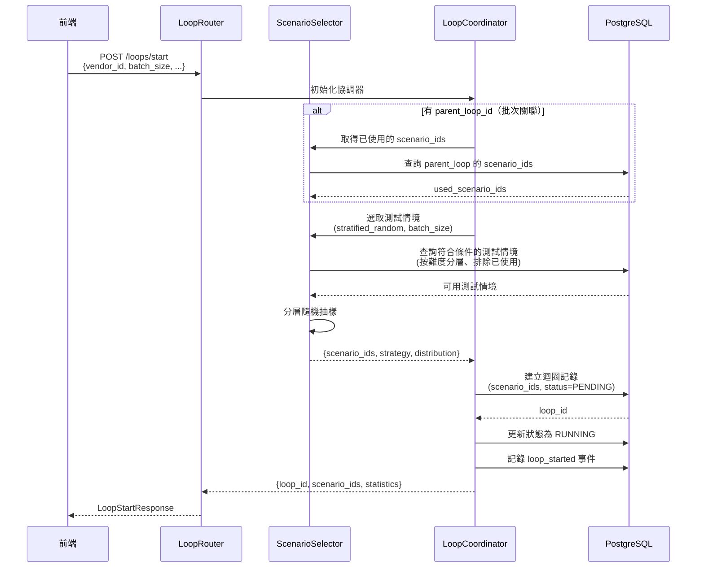
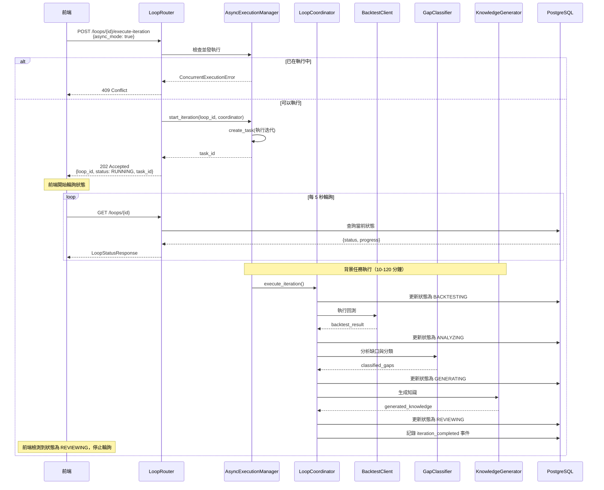
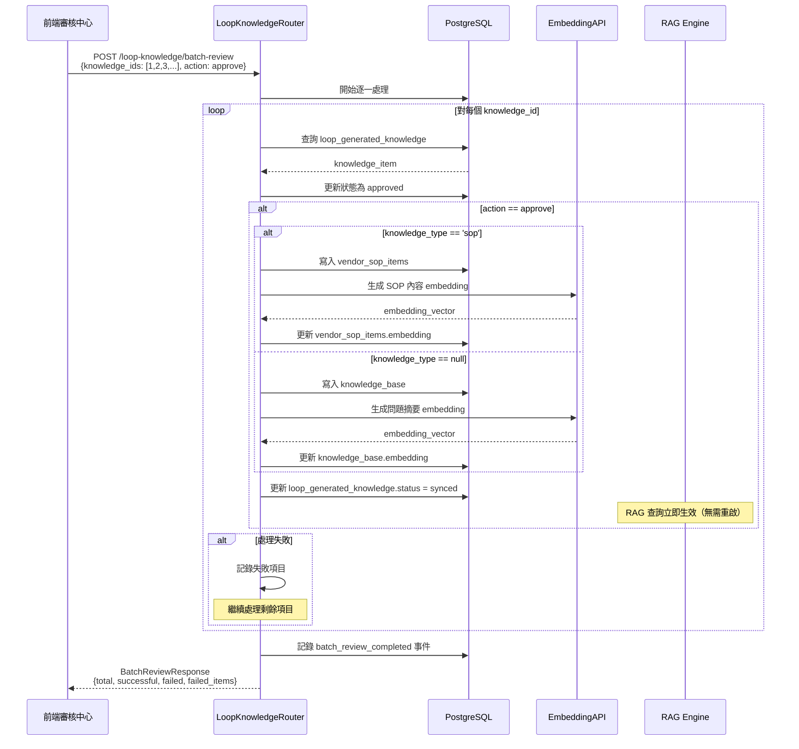

# 🏗️ 知識完善迴圈系統架構文檔

> **最後更新**: 2026-03-27
> **版本**: backtest-knowledge-refinement v1.0
> **目標讀者**: 後端開發者、架構師

---

## 📋 目錄

1. [系統概述](#系統概述)
2. [架構設計](#架構設計)
3. [核心元件](#核心元件)
4. [資料模型](#資料模型)
5. [API 設計](#api-設計)
6. [資料流程](#資料流程)
7. [技術決策](#技術決策)
8. [測試策略](#測試策略)
9. [效能優化](#效能優化)
10. [安全性設計](#安全性設計)
11. [部署架構](#部署架構)
12. [監控與告警](#監控與告警)

---

## 系統概述

### 目標

知識完善迴圈系統旨在建立**迭代式的知識優化流程**，透過以下 8 個步驟持續改善知識庫品質：

```
1. 執行回測 → 2. 分析失敗案例 → 3. 智能分類 (OpenAI) → 4. 按類別分離 →
5. 分別聚類 → 6. 生成知識 → 7. 人工審核 → 8. 檢查通過率並決定是否迭代
```

### 核心價值

1. **固定測試集保證**：確保迭代間測試一致性（`scenario_ids` 欄位）
2. **非同步執行架構**：避免 HTTP 請求超時（10-120 分鐘執行時間）
3. **批量審核效率**：支援一次審核 1-100 個知識項目
4. **批次間避免重複**：`parent_loop_id` 關聯排除已用測試情境
5. **成本追蹤與控制**：`budget_limit_usd` 預算限制與追蹤
6. **重複檢測機制**：pgvector 向量相似度搜尋（≥0.95 為 duplicate）

---

## 架構設計

### 分層架構（Layered Architecture）

系統採用**分層架構**搭配**狀態機模式**：

```
┌─────────────────────────────────────────────────────────────┐
│  前端層 (Frontend Layer)                                      │
│  - 管理介面 (http://localhost:8087)                           │
│  - 審核中心 (/review-center)                                   │
└─────────────────────────────────────────────────────────────┘
                          ↓ HTTP REST API
┌─────────────────────────────────────────────────────────────┐
│  API 路由層 (Router Layer)                                    │
│  - routers/loops.py (迴圈管理 API - 10 個端點)                 │
│  - routers/loop_knowledge.py (知識審核 API - 3 個端點)         │
└─────────────────────────────────────────────────────────────┘
                          ↓ 調用服務層
┌─────────────────────────────────────────────────────────────┐
│  服務層 (Service Layer)                                       │
│  - LoopCoordinator (迴圈協調器)                                │
│  - AsyncExecutionManager (非同步執行管理器)                     │
│  - ScenarioSelector (測試情境選取器)                            │
│  - BacktestFrameworkClient (回測客戶端)                         │
│  - GapClassifier (缺口分類器)                                  │
│  - SOPGenerator (SOP 生成器)                                   │
│  - KnowledgeGeneratorClient (知識生成器)                       │
│  - OpenAICostTracker (成本追蹤器)                              │
└─────────────────────────────────────────────────────────────┘
                          ↓ 資料存取
┌─────────────────────────────────────────────────────────────┐
│  資料層 (Data Layer) - PostgreSQL 14+ with pgvector           │
│  - knowledge_completion_loops (迴圈記錄)                       │
│  - loop_execution_logs (執行日誌)                              │
│  - loop_generated_knowledge (生成的知識)                       │
│  - knowledge_gap_analysis (缺口分析)                           │
│  - test_scenarios (測試情境)                                   │
│  - backtest_results (回測結果)                                 │
│  - knowledge_base (知識庫)                                     │
│  - vendor_sop_items (SOP 項目)                                │
└─────────────────────────────────────────────────────────────┘
                          ↓ 外部服務調用
┌─────────────────────────────────────────────────────────────┐
│  外部服務 (External Services)                                 │
│  - OpenAI API (GPT-4o-mini - 知識分類、生成)                   │
│  - RAG API (/api/v1/message - 回測使用)                        │
│  - Embedding API (/api/v1/embeddings - 向量生成)              │
└─────────────────────────────────────────────────────────────┘
```

### 技術棧

| 層級 | 技術 | 版本 | 說明 |
|------|------|------|------|
| **前端** | Vue.js 3 | 3.x | 管理介面與審核中心（待開發） |
| **API 框架** | FastAPI | 0.100+ | 高效能非同步 Web 框架 |
| **非同步執行** | asyncio | Python 標準庫 | 背景任務執行（create_task） |
| **資料庫** | PostgreSQL | 14+ | 主要資料庫 |
| **向量擴展** | pgvector | 0.5+ | 向量相似度搜尋（重複檢測） |
| **資料庫驅動** | asyncpg / psycopg2 | - | 非同步/同步驅動 |
| **AI 服務** | OpenAI API | gpt-4o-mini | 知識分類、聚類、生成 |
| **重試機制** | tenacity | - | API 調用失敗重試 |
| **資料驗證** | Pydantic | 2.x | 請求/回應模型驗證 |

---

## 核心元件

### 1. LoopRouter（迴圈路由器）

**位置**: `rag-orchestrator/routers/loops.py`

**責任**：
- 處理前端對迴圈生命週期的所有 HTTP 請求
- 驗證請求參數與業者身份
- 初始化 LoopCoordinator 並調用對應方法
- 格式化回應並處理錯誤

**核心 API 端點**：

| 端點 | 方法 | 說明 | 回應時間 |
|------|------|------|---------|
| `/api/v1/loops/start` | POST | 啟動新迴圈 | < 1 秒 |
| `/api/v1/loops/{id}/execute-iteration` | POST | 執行迭代 | < 1 秒（非同步） |
| `/api/v1/loops/{id}` | GET | 查詢迴圈狀態 | < 300ms |
| `/api/v1/loops/{id}/validate` | POST | 驗證效果回測 | 5-20 分鐘 |
| `/api/v1/loops/{id}/complete-batch` | POST | 完成批次 | < 1 秒 |
| `/api/v1/loops/{id}/pause` | POST | 暫停迴圈 | < 1 秒 |
| `/api/v1/loops/{id}/resume` | POST | 恢復迴圈 | < 1 秒 |
| `/api/v1/loops/{id}/cancel` | POST | 取消迴圈 | < 1 秒 |
| `/api/v1/loops/start-next-batch` | POST | 啟動下一批次 | < 1 秒 |
| `/api/v1/loops` | GET | 列出迴圈（分頁） | < 1 秒 |

**關鍵設計**：
- 使用 Pydantic 模型驗證請求/回應
- 使用 FastAPI `BackgroundTasks` 搭配 `AsyncExecutionManager` 實現非同步執行
- 統一錯誤處理（`HTTPException`）
- 業者隔離驗證（`vendor_id`）

**範例代碼**：

```python
@router.post("/start", response_model=LoopStartResponse)
async def start_loop(request: LoopStartRequest, req: Request):
    """啟動新迴圈"""
    # 1. 驗證業者存在
    vendor = await verify_vendor(request.vendor_id)

    # 2. 初始化協調器
    coordinator = LoopCoordinator(
        db_pool=req.app.state.db_pool,
        vendor_id=request.vendor_id
    )

    # 3. 啟動迴圈（選取固定測試集）
    result = await coordinator.start_loop(
        loop_name=request.loop_name,
        config=LoopConfig(
            batch_size=request.batch_size,
            max_iterations=request.max_iterations,
            target_pass_rate=request.target_pass_rate,
            ...
        ),
        parent_loop_id=request.parent_loop_id
    )

    # 4. 返回回應
    return LoopStartResponse(**result)
```

---

### 2. AsyncExecutionManager（非同步執行管理器）

**位置**: `rag-orchestrator/services/knowledge_completion_loop/async_execution_manager.py`

**責任**：
- 管理長時間運行的迭代任務（10-120 分鐘）
- 追蹤任務狀態與進度
- 防止並發執行
- 處理任務錯誤與超時

**核心方法**：

```python
class AsyncExecutionManager:
    """非同步執行管理器"""

    def __init__(self, db_pool):
        self.db_pool = db_pool
        self.running_tasks: Dict[int, asyncio.Task] = {}  # loop_id -> Task

    async def start_iteration(
        self,
        loop_id: int,
        coordinator: LoopCoordinator
    ) -> str:
        """啟動非同步迭代任務"""
        # 1. 檢查並發執行
        if loop_id in self.running_tasks:
            raise ConcurrentExecutionError(f"Loop {loop_id} 已在執行中")

        # 2. 建立背景任務
        task = asyncio.create_task(
            self._execute_iteration_background(loop_id, coordinator)
        )
        self.running_tasks[loop_id] = task

        # 3. 返回任務 ID
        return f"task_{loop_id}_{datetime.now().timestamp()}"

    async def _execute_iteration_background(
        self,
        loop_id: int,
        coordinator: LoopCoordinator
    ):
        """背景執行迭代（內部方法）"""
        try:
            # 執行完整的迭代流程（10-120 分鐘）
            result = await coordinator.execute_iteration()

            # 更新狀態為 REVIEWING
            await coordinator._update_loop_status(LoopStatus.REVIEWING)

            # 記錄成功事件
            await coordinator._log_event(
                event_type="iteration_completed",
                event_data=result
            )
        except BudgetExceededError as e:
            # 預算超出，停止迴圈
            await coordinator._update_loop_status(LoopStatus.FAILED)
            await coordinator._log_event(
                event_type="budget_exceeded",
                event_data={"error": str(e)}
            )
        except Exception as e:
            # 其他錯誤
            await coordinator._update_loop_status(LoopStatus.FAILED)
            await coordinator._log_event(
                event_type="iteration_failed",
                event_data={"error": str(e), "traceback": traceback.format_exc()}
            )
        finally:
            # 清理任務記錄
            self.running_tasks.pop(loop_id, None)
```

**關鍵設計**：
- 使用 `asyncio.create_task` 而非 `BackgroundTasks`（保持任務狀態）
- 並發控制：`self.running_tasks` 字典追蹤執行中任務
- 錯誤處理：捕獲所有異常，更新狀態為 FAILED
- 資源清理：`finally` 塊清理任務記錄

---

### 3. ScenarioSelector（測試情境選取器）

**位置**: `rag-orchestrator/services/knowledge_completion_loop/scenario_selector.py`

**責任**：
- 實作測試情境選取策略（分層隨機抽樣）
- 避免批次間重複選取
- 記錄選取策略與分布

**核心方法**：

```python
class ScenarioSelector:
    """測試情境選取器"""

    async def select_scenarios(
        self,
        vendor_id: int,
        batch_size: int,
        strategy: SelectionStrategy = SelectionStrategy.STRATIFIED_RANDOM,
        distribution: Optional[DifficultyDistribution] = None,
        exclude_scenario_ids: Optional[List[int]] = None,
        filters: Optional[Dict] = None
    ) -> Dict:
        """選取測試情境"""
        if strategy == SelectionStrategy.STRATIFIED_RANDOM:
            return await self._stratified_random_sampling(
                vendor_id, batch_size, distribution, exclude_scenario_ids, filters
            )
        # ... 其他策略

    async def _stratified_random_sampling(
        self,
        vendor_id: int,
        batch_size: int,
        distribution: Optional[DifficultyDistribution],
        exclude_scenario_ids: Optional[List[int]],
        filters: Optional[Dict]
    ) -> Dict:
        """分層隨機抽樣"""
        if not distribution:
            distribution = DifficultyDistribution()  # 預設：20% 簡單, 50% 中等, 30% 困難

        # 計算每個難度的目標數量
        target_easy = int(batch_size * distribution.easy)
        target_medium = int(batch_size * distribution.medium)
        target_hard = batch_size - target_easy - target_medium

        selected_ids = []
        actual_distribution = {"easy": 0, "medium": 0, "hard": 0}

        # 對每個難度等級抽樣
        for difficulty, target_count in [
            ("easy", target_easy),
            ("medium", target_medium),
            ("hard", target_hard)
        ]:
            # 查詢該難度的可用情境
            query = """
                SELECT id FROM test_scenarios
                WHERE difficulty = $1
                  AND status = 'approved'
                  AND ($2::INTEGER[] IS NULL OR id != ALL($2))
                ORDER BY RANDOM()
                LIMIT $3
            """
            rows = await self.db_pool.fetch(
                query,
                difficulty,
                exclude_scenario_ids,
                target_count
            )

            ids = [row["id"] for row in rows]
            selected_ids.extend(ids)
            actual_distribution[difficulty] = len(ids)

        return {
            "scenario_ids": selected_ids,
            "selection_strategy": "stratified_random",
            "difficulty_distribution": actual_distribution,
            "total_available": len(selected_ids)
        }
```

**關鍵設計**：
- 使用 `ORDER BY RANDOM() LIMIT N` 對每個難度層隨機抽樣
- 使用 `id != ALL($2)` 排除已使用的測試情境（批次間避免重複）
- 返回實際分布（可能與目標分布不同，如果某難度測試情境不足）

---

### 4. LoopCoordinator Extensions（協調器擴展）

**位置**: `rag-orchestrator/services/knowledge_completion_loop/coordinator.py`

**責任**：
- 擴展現有 LoopCoordinator，新增缺少的方法
- 實作 `load_loop()` 方法支援跨 session 續接
- 實作驗證回測方法（可選）

**新增方法**：

```python
async def load_loop(self, loop_id: int) -> Dict:
    """載入已存在的迴圈"""
    # 從資料庫載入迴圈資訊
    loop_record = await self._fetch_loop_record(loop_id)
    if not loop_record:
        raise LoopNotFoundError(f"Loop {loop_id} 不存在")

    # 初始化協調器狀態
    self.loop_id = loop_id
    self.vendor_id = loop_record["vendor_id"]
    self.loop_name = loop_record["loop_name"]
    self.current_status = LoopStatus(loop_record["status"])
    self.config = LoopConfig(**loop_record["config"])

    # 初始化成本追蹤器
    self.cost_tracker = OpenAICostTracker(
        loop_id=loop_id,
        db_pool=self.db_pool,
        budget_limit_usd=self.config.budget_limit_usd
    )

    return {
        "loop_id": self.loop_id,
        "status": self.current_status.value,
        "current_iteration": loop_record["current_iteration"],
        "loaded_at": datetime.now().isoformat()
    }
```

---

### 5. LoopKnowledgeRouter（知識審核路由器）

**位置**: `rag-orchestrator/routers/loop_knowledge.py`

**責任**：
- 處理知識審核相關的 HTTP 請求
- 提供單一審核與批量審核功能
- 查詢待審核知識清單
- 執行知識同步到正式庫

**核心 API 端點**：

| 端點 | 方法 | 說明 | 回應時間 |
|------|------|------|---------|
| `/api/v1/loop-knowledge/pending` | GET | 查詢待審核知識 | < 1 秒 |
| `/api/v1/loop-knowledge/{id}/review` | POST | 單一審核 | 1-3 秒 |
| `/api/v1/loop-knowledge/batch-review` | POST | 批量審核 | 5-20 秒 |

**批量審核關鍵設計**：
- **部分成功模式**：一個失敗不影響其他項目
- **錯誤處理**：記錄失敗項目供重試
- **立即同步**：審核通過立即同步到 `knowledge_base` / `vendor_sop_items`

**範例代碼**：

```python
@router.post("/batch-review", response_model=BatchReviewResponse)
async def batch_review_knowledge(
    request: BatchReviewRequest,
    req: Request
):
    """批量審核知識"""
    start_time = datetime.now()
    successful = 0
    failed = 0
    failed_items = []

    # 逐一處理每個知識項目
    for knowledge_id in request.knowledge_ids:
        try:
            # 1. 查詢知識項目
            knowledge = await fetch_knowledge(knowledge_id)

            # 2. 更新狀態
            if request.action == "approve":
                await update_knowledge_status(knowledge_id, "approved")

                # 3. 同步到正式庫
                if knowledge["knowledge_type"] == "sop":
                    await sync_to_sop_items(knowledge)
                else:
                    await sync_to_knowledge_base(knowledge)

                # 4. 生成 embedding
                await generate_embedding(knowledge_id)

                successful += 1
            else:
                await update_knowledge_status(knowledge_id, "rejected")
                successful += 1
        except Exception as e:
            failed += 1
            failed_items.append(BatchReviewFailedItem(
                knowledge_id=knowledge_id,
                error=str(e)
            ))
            # 繼續處理剩餘項目

    duration_ms = (datetime.now() - start_time).total_seconds() * 1000

    return BatchReviewResponse(
        total=len(request.knowledge_ids),
        successful=successful,
        failed=failed,
        failed_items=failed_items,
        duration_ms=int(duration_ms)
    )
```

---

## 資料模型

### 核心資料表

#### 1. knowledge_completion_loops（迴圈記錄）

**用途**：記錄迴圈的執行狀態、配置與統計資訊

**關鍵欄位**：

| 欄位 | 型別 | 說明 | 新增版本 |
|------|------|------|---------|
| `id` | SERIAL | 主鍵 | v1.0 |
| `loop_name` | VARCHAR(200) | 迴圈名稱 | v1.0 |
| `status` | VARCHAR(50) | 狀態（13 種） | v1.0 |
| `vendor_id` | INT | 業者 ID | v1.0 |
| `config` | JSONB | 迴圈配置 | v1.0 |
| `scenario_ids` | INTEGER[] | **固定測試集 ID 列表** | **v2.0 (2026-03-27)** |
| `selection_strategy` | VARCHAR(50) | 選取策略 | **v2.0** |
| `difficulty_distribution` | JSONB | 難度分布 | **v2.0** |
| `parent_loop_id` | INTEGER | 父迴圈 ID（批次關聯） | **v2.0** |
| `max_iterations` | INTEGER | 最大迭代次數 | **v2.0** |
| `current_iteration` | INT | 當前迭代次數 | v1.0 |
| `current_pass_rate` | FLOAT | 當前通過率 | v1.0 |
| `target_pass_rate` | FLOAT | 目標通過率 | v1.0 |
| `budget_limit_usd` | NUMERIC(10,2) | 預算上限（USD） | v1.0 |
| `total_openai_cost_usd` | NUMERIC(10,6) | 累計成本（USD） | v1.0 |

**狀態機**（13 種狀態）：

```
pending → running → backtesting → analyzing → classifying → generating →
reviewing → validating → syncing → completed / failed / paused / cancelled
```

**索引**：

```sql
CREATE INDEX idx_loops_scenario_ids ON knowledge_completion_loops USING GIN (scenario_ids);
CREATE INDEX idx_loops_vendor_status ON knowledge_completion_loops(vendor_id, status);
CREATE INDEX idx_loops_parent ON knowledge_completion_loops(parent_loop_id);
```

---

#### 2. loop_generated_knowledge（生成的知識）

**用途**：儲存迴圈生成的臨時知識（與正式知識庫隔離）

**關鍵欄位**：

| 欄位 | 型別 | 說明 | 新增版本 |
|------|------|------|---------|
| `id` | SERIAL | 主鍵 | v1.0 |
| `loop_id` | INT | 迴圈 ID | v1.0 |
| `iteration` | INT | 迭代次數 | v1.0 |
| `question` | TEXT | 問題 | v1.0 |
| `answer` | TEXT | 答案 | v1.0 |
| `status` | VARCHAR(50) | 狀態（5 種） | v1.0 |
| `similar_knowledge` | JSONB | **重複檢測結果** | **v2.0 (2026-03-27)** |
| `duplication_warning` | VARCHAR(500) | **重複警告文字** | **v2.0** |
| `knowledge_type` | VARCHAR(20) | 知識類型（sop/null） | **v2.0** |
| `sop_config` | JSONB | SOP 配置 | **v2.0** |
| `embedding` | VECTOR(1536) | 向量（OpenAI） | v1.0 |
| `synced_to_kb` | BOOLEAN | 是否已同步 | v1.0 |
| `kb_id` | INT | 同步後的 knowledge_base.id | v1.0 |

**狀態機**（5 種狀態）：

```
pending → approved / rejected → synced / rolled_back
```

**重複檢測結果格式**（JSONB）：

```json
{
  "detected": true,
  "items": [
    {
      "id": 456,
      "source_table": "knowledge_base",
      "question_summary": "租金繳納日期說明",
      "similarity_score": 0.93
    }
  ]
}
```

---

#### 3. knowledge_gap_analysis（知識缺口分析）

**用途**：記錄失敗測試案例的分類與聚類結果

**關鍵欄位**：

| 欄位 | 型別 | 說明 |
|------|------|------|
| `id` | SERIAL | 主鍵 |
| `loop_id` | INT | 迴圈 ID |
| `iteration` | INT | 迭代次數 |
| `scenario_id` | INT | 測試情境 ID |
| `test_question` | TEXT | 測試問題 |
| `gap_type` | VARCHAR(20) | 缺口類型（4 種） |
| `failure_reason` | VARCHAR(50) | 失敗原因 |
| `priority` | VARCHAR(10) | 優先級（p0/p1/p2） |
| `cluster_id` | INTEGER | 聚類 ID |
| `should_generate_knowledge` | BOOLEAN | 是否應生成知識 |
| `classification_metadata` | JSONB | OpenAI 分類完整結果 |

**缺口類型**（4 種）：
- `sop_knowledge`：SOP 流程知識
- `form_fill`：表單填寫
- `system_config`：系統配置知識
- `api_query`：API 查詢（不生成靜態知識）

**索引**：

```sql
CREATE INDEX idx_gap_analysis_loop_iteration ON knowledge_gap_analysis(loop_id, iteration);
CREATE INDEX idx_gap_analysis_scenario ON knowledge_gap_analysis(scenario_id);
CREATE INDEX idx_gap_analysis_cluster ON knowledge_gap_analysis(cluster_id);
```

---

## API 設計

### RESTful 設計原則

1. **資源導向**：URL 代表資源（`/loops`, `/loop-knowledge`）
2. **HTTP 方法語義**：
   - `GET`：查詢資源
   - `POST`：創建資源或執行操作
   - `PUT`：完整更新資源（未使用）
   - `PATCH`：部分更新資源（未使用）
   - `DELETE`：刪除資源（未使用）
3. **統一前綴**：所有 API 使用 `/api/v1/` 前綴
4. **分頁支援**：使用 `limit` 和 `offset` 參數
5. **篩選支援**：使用查詢參數（`?vendor_id=2&status=pending`）

### 錯誤處理規範

**標準錯誤回應格式**：

```json
{
  "error_code": "LOOP_NOT_FOUND",
  "message": "迴圈不存在",
  "details": {
    "loop_id": 123
  },
  "timestamp": "2026-03-27T00:00:00Z"
}
```

**錯誤碼定義**：

| HTTP 狀態碼 | 錯誤碼 | 說明 |
|-----------|-------|------|
| 400 | `BAD_REQUEST` | 參數驗證錯誤 |
| 404 | `NOT_FOUND` | 迴圈或知識不存在 |
| 409 | `CONFLICT` | 並發執行衝突、狀態不允許操作 |
| 422 | `UNPROCESSABLE_ENTITY` | 業務邏輯錯誤（預算超出、狀態轉換非法） |
| 500 | `INTERNAL_SERVER_ERROR` | 系統錯誤（資料庫錯誤、OpenAI API 錯誤） |
| 503 | `SERVICE_UNAVAILABLE` | 外部服務不可用（OpenAI API 超時） |

---

## 資料流程

### 迴圈啟動與固定測試集選取



---

### 非同步執行迭代



---

### 批量審核與立即同步



---

## 技術決策

### 決策 1: 非同步執行框架選擇

**問題**：迭代執行耗時 10-120 分鐘，如何避免前端 HTTP 請求超時？

**選項**：
1. **FastAPI BackgroundTasks** - 內建、簡單、無狀態追蹤
2. **asyncio.create_task** - 保持任務狀態、配合資料庫追蹤
3. **Celery / Redis Queue** - 生產級、分散式、引入額外依賴

**決定**：選擇 **asyncio.create_task + 資料庫狀態追蹤**

**理由**：
- 現有系統已使用 FastAPI 非同步框架，天然支援 asyncio
- 迴圈狀態已儲存於 `knowledge_completion_loops` 表，無需額外狀態管理服務
- 前端輪詢模式簡單可靠，無需 WebSocket 或 Server-Sent Events
- 避免引入 Celery/Redis Queue 等重量級依賴，降低系統複雜度

---

### 決策 2: 批量審核錯誤處理策略

**問題**：批量審核 10-50 個知識項目時，如何處理部分失敗？

**選項**：
1. **全成功或全失敗（事務模式）** - 資料一致性強，但一個失敗導致全部失敗
2. **部分成功（容錯模式）** - 最大化成功數量，需管理部分失敗狀態

**決定**：選擇 **部分成功（容錯模式）**

**理由**：
- 審核操作不需強一致性，部分成功優於全部失敗
- 失敗項目保持 `pending` 狀態，可稍後重試
- 提升使用者體驗，避免因單一項目錯誤導致整批審核失敗

---

### 決策 3: 測試情境選取策略

**問題**：初次建立迴圈時，如何選取測試情境？

**選項**：
1. **分層隨機抽樣** - 按難度分層，每層按比例隨機選取
2. **順序選取** - 按 ID 順序選取前 N 題
3. **完全隨機** - 完全隨機選取 N 題

**決定**：選擇 **分層隨機抽樣**（預設），同時支援其他策略

**理由**：
- 確保測試覆蓋不同難度等級（easy 20%, medium 50%, hard 30%）
- 避免測試集偏向某一難度，導致結果不具代表性
- 保持隨機性，避免順序選取的可預測性

---

## 測試策略

### 單元測試

**需要測試的元件和方法**：

| 元件 | 方法 | 測試重點 |
|------|------|---------|
| `ScenarioSelector` | `select_scenarios()` | 測試三種選取策略 |
| `ScenarioSelector` | `_stratified_random_sampling()` | 測試分層抽樣邏輯、難度分布 |
| `AsyncExecutionManager` | `start_iteration()` | 測試並發控制 |
| `AsyncExecutionManager` | `_execute_iteration_background()` | 測試錯誤處理、狀態更新 |
| `LoopCoordinator` | `load_loop()` | 測試載入已存在的迴圈 |
| `LoopCoordinator` | `validate_loop()` | 測試驗證回測邏輯 |

**測試框架**：
- `pytest`（Python 單元測試）
- `pytest-asyncio`（非同步函數測試）
- `pytest-mock`（模擬資料庫與外部 API）

**範例測試**：

```python
@pytest.mark.asyncio
async def test_stratified_random_sampling():
    """測試分層隨機抽樣"""
    selector = ScenarioSelector(db_pool=mock_db_pool)

    result = await selector.select_scenarios(
        vendor_id=2,
        batch_size=50,
        strategy=SelectionStrategy.STRATIFIED_RANDOM,
        distribution=DifficultyDistribution(easy=0.2, medium=0.5, hard=0.3)
    )

    # 驗證
    assert len(result["scenario_ids"]) == 50
    assert result["difficulty_distribution"]["easy"] == 10
    assert result["difficulty_distribution"]["medium"] == 25
    assert result["difficulty_distribution"]["hard"] == 15
```

---

### 整合測試

**測試場景**：

1. **完整迴圈流程**：啟動迴圈 → 執行迭代 → 批量審核 → 完成批次
2. **批次間流程**：完成第一批次 → 啟動第二批次（避免重複）
3. **錯誤處理流程**：並發執行檢測、預算超出停止、OpenAI API 限流重試

**範例測試**：

```python
@pytest.mark.asyncio
async def test_complete_loop_flow():
    """測試完整迴圈流程"""
    # 1. 啟動迴圈
    loop_result = await start_loop(vendor_id=2, batch_size=50)
    loop_id = loop_result["loop_id"]

    # 2. 執行迭代（非同步）
    execute_result = await execute_iteration(loop_id, async_mode=True)
    assert execute_result["status"] == "running"

    # 3. 輪詢狀態直到完成
    while True:
        status = await get_loop_status(loop_id)
        if status["status"] == "reviewing":
            break
        await asyncio.sleep(1)

    # 4. 批量審核知識
    knowledge_ids = [1, 2, 3, 4, 5]
    review_result = await batch_review_knowledge(knowledge_ids, action="approve")
    assert review_result["successful"] == 5

    # 5. 完成批次
    complete_result = await complete_batch(loop_id)
    assert complete_result["status"] == "completed"
```

---

## 效能優化

### 瓶頸分析

| 瓶頸 | 影響 | 緩解策略 |
|------|------|---------|
| **OpenAI API 速率限制** | 3,500 req/min | 控制並發數（預設 5），使用 tenacity 重試 |
| **Embedding 生成延遲** | 每個知識需調用 API | 批量生成，異步執行 |
| **向量相似度搜尋** | 重複檢測耗時 | 使用 pgvector IVFFlat 索引加速搜尋 |
| **資料庫連接池耗盡** | 長時間任務佔用連接 | 使用連接池，及時釋放，合理設定 min_size/max_size |

### 優化策略

1. **Redis 快取常用查詢**：
   - 迴圈狀態（TTL: 5 秒）
   - 待審核知識清單（TTL: 30 秒）

2. **批量操作使用 executemany**：
   - 批量寫入 `loop_generated_knowledge`
   - 批量更新狀態

3. **向量搜尋使用 LIMIT**：
   - 限制返回數量（LIMIT 3）
   - 避免全表掃描

---

## 安全性設計

### 威脅模型（STRIDE）

| 威脅 | 緩解措施 |
|------|---------|
| **Spoofing（偽造）** | 業者隔離驗證（所有 API 驗證 `vendor_id`） |
| **Tampering（竄改）** | 狀態機驗證（防止非法狀態轉換） |
| **Information Disclosure（資訊洩漏）** | 業者隔離查詢（WHERE vendor_id = $1） |
| **Denial of Service（阻斷服務）** | 預算控制（budget_limit_usd），速率限制 |
| **Elevation of Privilege（提升權限）** | 無直接同步 API（必須經過審核流程） |

### 安全措施

1. **業者隔離**：所有 API 驗證 `vendor_id`，確保只能操作自己的迴圈
2. **參數驗證**：使用 Pydantic 驗證所有請求參數
3. **狀態機保護**：使用狀態機驗證操作合法性
4. **預算控制**：使用 `OpenAICostTracker` 追蹤成本，超過預算自動停止
5. **敏感資料保護**：OpenAI API Key 透過環境變數注入，不記錄到日誌

---

## 部署架構

### Docker Compose 架構

```yaml
services:
  rag-orchestrator:
    build: ./rag-orchestrator
    environment:
      - OPENAI_API_KEY=${OPENAI_API_KEY}
      - EMBEDDING_API_URL=http://localhost:5001/api/v1/embeddings
      - DB_HOST=aichatbot-postgres
    depends_on:
      - postgres
      - embedding-api
    ports:
      - "8100:8000"

  postgres:
    image: pgvector/pgvector:pg14
    environment:
      - POSTGRES_USER=aichatbot
      - POSTGRES_PASSWORD=aichatbot_password
      - POSTGRES_DB=aichatbot
    volumes:
      - postgres-data:/var/lib/postgresql/data

  embedding-api:
    build: ./embedding-api
    ports:
      - "5001:5000"
```

---

## 監控與告警

### 關鍵指標

| 指標 | 目標值 | 監控方式 |
|------|--------|---------|
| API 回應時間（啟動迴圈） | < 1 秒 | Prometheus |
| 迭代執行時間（50 題） | 10-15 分鐘 | `loop_execution_logs` 表 |
| 批量審核 10 項 | < 5 秒 | API 日誌 |
| OpenAI API 成本 | < 預算限制 | `openai_cost_tracking` 表 |
| 服務可用性 | ≥ 99.9% | 健康檢查 |

### 告警規則

- ⚠️  迴圈執行時間 > 20 分鐘（50 題預期 10-15 分鐘）
- ⚠️  OpenAI API 錯誤率 > 10%
- ⚠️  預算使用率 > 90%
- ⚠️  待審核知識數量 > 100（需人工處理積壓）
- 🚨 資料庫連接池使用率 > 80%

---

## 參考文件

- [API 文檔 - 迴圈管理](../api/loops_api.md)
- [API 文檔 - 知識審核](../api/loop_knowledge_api.md)
- [使用者指南](../user_guide/knowledge_completion_loop.md)
- [部署指南](../deployment/2026-03-27/DEPLOY_KNOWLEDGE_COMPLETION_LOOP.md)
- [技術設計文檔](../../.kiro/specs/backtest-knowledge-refinement/design.md)

---

**最後更新**：2026-03-27
**維護者**：AI Development Team
