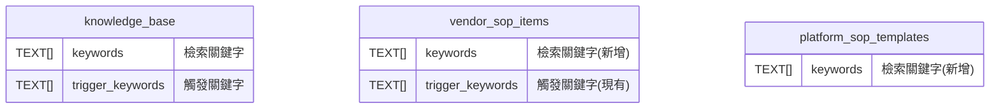

# SOP 系統關鍵字欄位對照說明

> 更新日期：2026-02-11
> 目的：釐清 keywords 與 trigger_keywords 的差異

## 📊 關鍵字欄位對照表

| 系統 | 表名 | 欄位名 | 用途 | 範例 |
|------|------|--------|------|------|
| **知識庫** | knowledge_base | keywords | 檢索匹配 | ["租金", "繳費", "匯款"] |
| **SOP (新增)** | vendor_sop_items | **keywords** | 檢索匹配 | ["冷氣", "空調", "AC"] |
| **SOP (現有)** | vendor_sop_items | trigger_keywords | 觸發動作 | ["還是不行", "試過了"] |

## 🎯 使用時機對比

### keywords（檢索關鍵字）
- **時機**：用戶提問時，尋找相關內容
- **目的**：提升檢索準確度
- **統一性**：知識庫、SOP 都使用相同命名

### trigger_keywords（觸發關鍵字）
- **時機**：SOP 顯示後，等待特定回應
- **目的**：決定是否執行後續動作
- **獨特性**：僅 SOP 系統使用

## 💡 實際案例

### 案例：冷氣故障處理

```yaml
vendor_sop_items:
  item_name: "冷氣故障排查"

  # 檢索用 - 幫助找到這個 SOP
  keywords:
    - "冷氣"
    - "空調"
    - "AC"
    - "不冷"
    - "不涼"
    - "冷房"
    - "air conditioner"

  # 觸發用 - 決定何時執行維修申請
  trigger_keywords:
    - "還是不行"
    - "試過了"
    - "無效"
    - "沒用"

  trigger_mode: "manual"
  next_action: "api_call"  # 呼叫維修 API
```

### 完整對話流程

```
👤 用戶: 空調不涼怎麼辦？
         ↓
    [keywords 匹配: "空調", "不涼"]
         ↓
🤖 系統: 找到 SOP「冷氣故障排查」
        請按照以下步驟檢查：
        1. 確認電源開關
        2. 檢查遙控器電池
        3. 清潔濾網

        如果問題仍未解決，請告訴我。
         ↓
👤 用戶: 都試過了，還是不行
         ↓
    [trigger_keywords 匹配: "試過了", "還是不行"]
         ↓
🤖 系統: 了解，我現在幫您提交維修申請...
        [執行 next_action: api_call]
```

## 📈 效益說明

### 統一使用 `keywords` 的好處：

1. **一致性**：與知識庫系統保持相同命名規範
2. **易理解**：開發者容易理解欄位用途
3. **可複用**：相同的檢索邏輯可套用到不同系統
4. **易維護**：減少混淆，降低維護成本

### 保留 `trigger_keywords` 的原因：

1. **功能明確**：清楚表示這是「觸發」專用
2. **向下相容**：不影響現有功能
3. **邏輯分離**：檢索和觸發是兩個獨立流程

## 🔄 資料庫關係圖



## ✅ 實作檢查清單

- [x] 建立 migration 檔案
- [ ] 更新 VendorSOPRetriever 服務
- [ ] 更新 API 模型定義
- [ ] 更新前端表單
- [ ] 撰寫測試案例
- [ ] 更新 API 文檔

---

*保持系統一致性，讓 keywords 成為檢索的統一標準*