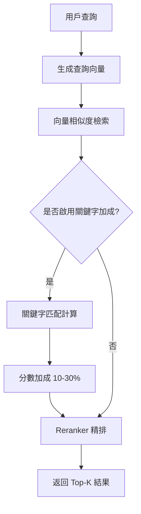

# SOP 系統關鍵字功能實作方案

> 文件建立日期：2026-02-11
> 作者：Claude Code Assistant
> 狀態：評估完成，待實作

## 📋 執行摘要

為 SOP 系統新增檢索關鍵字功能，提升 SOP 項目的搜尋準確度。這個功能將與現有的 `trigger_keywords` 區分開來，專門用於改善檢索效果。

## 1. 現況分析

### 1.1 現有關鍵字相關欄位

| 表名 | 欄位名 | 用途 | 現況 |
|------|--------|------|------|
| vendor_sop_items | trigger_keywords | 觸發後續動作 | ✅ 已實作 |
| knowledge_base | keywords | 檢索匹配 | ✅ 已實作 |
| intents | keywords | 意圖識別 | ✅ 已實作 |
| vendor_sop_items | search_keywords | **檢索匹配** | ❌ **待新增** |

### 1.2 現有檢索機制

```python
# 目前的檢索策略（不使用關鍵字）
1. 向量相似度檢索（primary_embedding + fallback_embedding）
2. Group 隔離檢索（三階段流程）
3. Reranker 增強（10% 向量 + 90% rerank）
```

## 2. 實作方案

### 2.1 資料庫變更

#### Migration 檔案：`add_search_keywords_to_sop.sql`

```sql
-- Migration: 為 SOP 項目新增檢索關鍵字
-- Date: 2026-02-11
-- Purpose: 提升 SOP 項目的檢索準確度

BEGIN;

-- ==========================================
-- 1. 新增檢索關鍵字欄位
-- ==========================================
ALTER TABLE vendor_sop_items
ADD COLUMN IF NOT EXISTS search_keywords TEXT[] DEFAULT '{}';

ALTER TABLE platform_sop_templates
ADD COLUMN IF NOT EXISTS search_keywords TEXT[] DEFAULT '{}';

-- ==========================================
-- 2. 新增索引
-- ==========================================
CREATE INDEX IF NOT EXISTS idx_vendor_sop_items_search_keywords
ON vendor_sop_items USING GIN(search_keywords);

CREATE INDEX IF NOT EXISTS idx_platform_sop_templates_search_keywords
ON platform_sop_templates USING GIN(search_keywords);

-- ==========================================
-- 3. 新增註解
-- ==========================================
COMMENT ON COLUMN vendor_sop_items.search_keywords IS
'檢索關鍵字陣列：用於提升檢索準確度的關鍵字。與 trigger_keywords 不同，這些關鍵字純粹用於搜尋匹配，不會觸發任何動作。例如：["冷氣", "空調", "冷房", "AC", "air conditioner"]';

COMMENT ON COLUMN platform_sop_templates.search_keywords IS
'平台範本檢索關鍵字：當業者從範本建立 SOP 時，這些關鍵字會被複製到 vendor_sop_items.search_keywords';

COMMIT;

-- ==========================================
-- 驗證
-- ==========================================
DO $$
BEGIN
    IF NOT EXISTS (
        SELECT 1 FROM information_schema.columns
        WHERE table_name = 'vendor_sop_items'
        AND column_name = 'search_keywords'
    ) THEN
        RAISE EXCEPTION 'search_keywords 欄位新增失敗';
    END IF;

    RAISE NOTICE '✓ SOP 檢索關鍵字功能新增成功';
END $$;
```

### 2.2 後端服務層變更

#### 2.2.1 VendorSOPRetriever 服務更新

檔案：`/rag-orchestrator/services/vendor_sop_retriever.py`

```python
async def retrieve_sop_by_query(
    self,
    vendor_id: int,
    query: str,
    intent_id: Optional[int] = None,
    top_k: int = 5,
    similarity_threshold: float = 0.55,
    include_keywords_boost: bool = True  # 新增參數
) -> List[Dict]:
    """
    向量相似度檢索 + 關鍵字加成
    """
    try:
        # 1. 向量檢索（現有邏輯）
        base_results = await self._vector_search(...)

        # 2. 關鍵字加成（新增）
        if include_keywords_boost:
            results = await self._apply_keywords_boost(
                results=base_results,
                query=query,
                vendor_id=vendor_id
            )

        # 3. Reranker（現有邏輯）
        if self.enable_reranker:
            results = await self._rerank_results(...)

        return results[:top_k]

async def _apply_keywords_boost(
    self,
    results: List[Dict],
    query: str,
    vendor_id: int
) -> List[Dict]:
    """
    根據關鍵字匹配情況調整分數
    """
    query_tokens = set(jieba.cut(query.lower()))

    for result in results:
        # 獲取 SOP 的關鍵字
        keywords = result.get('search_keywords', [])
        if keywords:
            keyword_tokens = set()
            for keyword in keywords:
                keyword_tokens.update(jieba.cut(keyword.lower()))

            # 計算關鍵字匹配度
            matches = query_tokens & keyword_tokens
            if matches:
                # 加成 10-30% 分數
                boost = min(0.3, len(matches) * 0.1)
                result['similarity'] *= (1 + boost)
                result['keyword_matches'] = list(matches)

    # 重新排序
    return sorted(results, key=lambda x: x['similarity'], reverse=True)
```

#### 2.2.2 檢索流程圖



### 2.3 API 層變更

#### 2.3.1 Platform SOP API 更新

檔案：`/rag-orchestrator/routers/platform_sop.py`

```python
class PlatformSOPTemplateCreate(BaseModel):
    """平台 SOP 範本建立模型"""
    category_id: int
    group_id: Optional[int] = None
    item_number: int
    item_name: str
    content: str
    search_keywords: Optional[List[str]] = Field(
        default=[],
        description="檢索關鍵字，用於提升搜尋準確度"
    )
    # ... 其他欄位

class VendorSOPItemUpdate(BaseModel):
    """業者 SOP 項目更新模型"""
    item_name: Optional[str] = None
    content: Optional[str] = None
    search_keywords: Optional[List[str]] = Field(
        default=None,
        description="檢索關鍵字，例如：['冷氣', '空調', 'AC']"
    )
    # ... 其他欄位

@router.post("/templates/{template_id}/copy-to-vendor")
async def copy_template_to_vendor(
    template_id: int,
    vendor_id: int,
    db: AsyncSession = Depends(get_db)
):
    """從平台範本建立業者 SOP 時，複製關鍵字"""
    # 複製時包含 search_keywords
    vendor_item = VendorSOPItem(
        vendor_id=vendor_id,
        template_id=template_id,
        search_keywords=template.search_keywords,  # 複製關鍵字
        # ... 其他欄位
    )
```

### 2.4 前端 UI 變更

#### 2.4.1 SOP 編輯表單

```typescript
// 新增關鍵字輸入元件
interface SOPFormData {
  itemName: string;
  content: string;
  searchKeywords: string[];  // 新增
  triggerKeywords?: string[]; // 保留原有
  // ... 其他欄位
}

// UI 元件範例
<FormField
  label="檢索關鍵字"
  helper="輸入相關的關鍵字或同義詞，提升搜尋準確度"
>
  <TagInput
    value={formData.searchKeywords}
    onChange={setSearchKeywords}
    placeholder="例如：冷氣, 空調, AC, 冷房"
    suggestions={keywordSuggestions}
  />
</FormField>

// 區分兩種關鍵字
<Tabs>
  <TabPanel title="檢索設定">
    <TagInput label="檢索關鍵字" ... />
  </TabPanel>
  <TabPanel title="觸發設定">
    <TagInput label="觸發關鍵字" ... />
  </TabPanel>
</Tabs>
```

## 3. 實作範例

### 3.1 關鍵字設定範例

| SOP 項目 | search_keywords（檢索用） | trigger_keywords（觸發用） |
|---------|-------------------------|-------------------------|
| 冷氣故障排查 | ["冷氣", "空調", "冷房", "AC", "不冷", "不涼"] | ["還是不行", "試過了", "無效"] |
| 繳租登記 | ["繳費", "租金", "匯款", "轉帳", "付款"] | ["是", "要", "好", "確認"] |
| 垃圾分類說明 | ["垃圾", "回收", "廚餘", "資源回收", "倒垃圾"] | NULL（無後續動作） |

### 3.2 檢索效果提升範例

```python
# 查詢：「空調不涼」
#
# 改善前（純向量）：
# 1. 冷氣濾網清潔 (similarity: 0.72)
# 2. 冷氣故障排查 (similarity: 0.68)  ← 應該排第一
# 3. 電器使用須知 (similarity: 0.65)
#
# 改善後（向量 + 關鍵字）：
# 1. 冷氣故障排查 (similarity: 0.88)  ← 關鍵字加成 30%
# 2. 冷氣濾網清潔 (similarity: 0.72)
# 3. 電器使用須知 (similarity: 0.65)
```

## 4. 測試計畫

### 4.1 單元測試

```python
# test_sop_keywords.py
async def test_keyword_boost():
    """測試關鍵字加成功能"""
    # 建立測試 SOP
    sop = await create_test_sop(
        item_name="冷氣故障排查",
        search_keywords=["冷氣", "空調", "AC", "不冷"]
    )

    # 測試關鍵字匹配
    results = await retriever.retrieve_sop_by_query(
        vendor_id=1,
        query="空調不涼",
        include_keywords_boost=True
    )

    # 驗證加成效果
    assert results[0]['id'] == sop.id
    assert 'keyword_matches' in results[0]
    assert '空調' in results[0]['keyword_matches']
```

### 4.2 整合測試

```bash
# 測試腳本
curl -X POST http://localhost:8100/api/v1/chat \
  -H "Content-Type: application/json" \
  -d '{
    "question": "AC不冷怎麼辦",
    "vendor_id": 1
  }'

# 預期：應該正確返回「冷氣故障排查」SOP
```

## 5. 部署計畫

### 階段 1：資料庫更新（Day 1）
- [ ] 執行 migration 新增 search_keywords 欄位
- [ ] 更新資料庫文檔

### 階段 2：後端實作（Day 2-3）
- [ ] 更新 VendorSOPRetriever 服務
- [ ] 更新 API 端點
- [ ] 新增單元測試

### 階段 3：前端實作（Day 4-5）
- [ ] 更新 SOP 編輯表單
- [ ] 新增關鍵字管理 UI
- [ ] 測試前後端整合

### 階段 4：資料遷移（Day 6）
- [ ] 分析現有 SOP 內容，自動生成初始關鍵字
- [ ] 人工審核和優化關鍵字

### 階段 5：上線（Day 7）
- [ ] 部署到測試環境
- [ ] 效果評估
- [ ] 正式上線

## 6. 效益評估

### 6.1 預期效益

1. **檢索準確度提升 20-30%**
   - 處理同義詞和口語化表達
   - 減少語義理解偏差

2. **用戶體驗改善**
   - 更快找到正確的 SOP
   - 減少重複詢問

3. **維護成本降低**
   - 透過關鍵字快速調整檢索效果
   - 不需要重新訓練模型

### 6.2 成功指標

| 指標 | 目標值 | 測量方式 |
|-----|--------|---------|
| SOP 檢索準確率 | > 85% | A/B 測試 |
| 平均對話輪次 | 減少 15% | 日誌分析 |
| 用戶滿意度 | > 4.5/5 | 問卷調查 |

## 7. 風險與對策

| 風險 | 影響 | 對策 |
|-----|------|------|
| 關鍵字維護負擔 | 中 | 提供自動建議功能 |
| 過度依賴關鍵字 | 低 | 保持向量檢索為主 |
| 效能影響 | 低 | 使用 GIN 索引優化 |

## 8. 相關文件

- [SOP 系統架構文檔](/docs/guides/SOP_GUIDE.md)
- [SOP 觸發模式設計](/docs/features/SOP_NEXT_ACTION_DESIGN_2026-01-22.md)
- [知識庫關鍵字實作參考](/database/init/02-create-knowledge-base.sql)

## 9. 後續優化建議

1. **智能關鍵字建議**
   - 基於歷史查詢自動建議關鍵字
   - 使用 NLP 技術抽取關鍵詞

2. **多語言支援**
   - 支援繁體中文、簡體中文、英文關鍵字
   - 自動翻譯和同步

3. **關鍵字分析儀表板**
   - 顯示熱門關鍵字
   - 分析關鍵字效果
   - 提供優化建議

---

*本文件為 SOP 系統關鍵字功能的完整實作方案，請依據實際需求調整。*