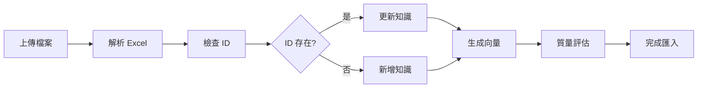

# 知識庫匯入/匯出功能使用指南

## 目錄

- [功能概述](#功能概述)
- [匯出功能](#匯出功能)
- [匯入功能](#匯入功能)
- [ID 更新功能 (UPSERT)](#id-更新功能-upsert)
- [使用範例](#使用範例)
- [檔案格式規範](#檔案格式規範)
- [注意事項](#注意事項)
- [常見問題](#常見問題)
- [API 參考](#api-參考)

---

## 功能概述

知識庫匯入/匯出功能提供完整的知識管理解決方案，支援：

- ✅ **批次匯出**：將知識庫匯出為 Excel 格式
- ✅ **批次匯入**：從 Excel 批次新增或更新知識
- ✅ **ID 更新**：支援基於 ID 的知識更新（UPSERT）
- ✅ **格式兼容**：匯出格式與匯入格式完全兼容
- ✅ **大量資料**：支援 10 萬+ 筆知識的分批處理
- ✅ **vendor 隔離**：支援按業者過濾匯出/匯入

---

## 匯出功能

### 功能說明

將知識庫資料匯出為標準 Excel 格式（.xlsx），包含所有欄位資訊。

### 匯出欄位

匯出的 Excel 包含以下欄位（按順序）：

| 欄位名稱 | 說明 | 範例 | 是否必填 |
|---------|------|------|---------|
| `id` | 知識 ID（用於更新） | `5011` | ❌（新增時留空） |
| `question_summary` | 問題摘要 | `如何繳納租金？` | ✅ |
| `answer` | 答案內容 | `租金繳納方式有...` | ✅ |
| `vendor_id` | 業者 ID（NULL=全域, 非NULL=業者專屬） | `2` 或留空 | ❌ |
| `business_types` | 業態類型（逗號分隔） | `租賃,物業管理` | ❌ |
| `target_user` | 目標用戶 | `tenant` / `landlord` | ❌ |
| `intent_names` | 意圖名稱 | `租金繳納` | ❌ |
| `keywords` | 關鍵字（逗號分隔） | `租金,繳費,付款` | ❌ |
| `priority` | 優先級 | `0` / `1` | ❌ |

### 使用方式

#### 方式 1: 前端操作

1. 訪問：`http://your-domain/knowledge-export`
2. 選擇匯出選項：
   - **業者 ID**：留空表示匯出所有知識
   - **匯出格式**：標準格式（預設）
3. 點擊「開始匯出」
4. 等待處理完成（大量資料可能需要數十秒）
5. 下載檔案

#### 方式 2: API 呼叫

```bash
# 匯出所有知識
curl -X POST http://your-domain/api/v1/knowledge-export/export \
  -H "Content-Type: application/json" \
  -d '{
    "vendor_id": null,
    "export_mode": "standard"
  }'

# 回應範例
{
  "job_id": "abc-123-def",
  "status": "processing",
  "message": "匯出任務已建立..."
}

# 查詢進度
curl http://your-domain/api/v1/knowledge-export/jobs/abc-123-def

# 下載檔案
curl -O http://your-domain/api/v1/knowledge-export/jobs/abc-123-def/download
```

### 匯出選項

| 參數 | 說明 | 可選值 | 預設值 |
|-----|------|--------|--------|
| `vendor_id` | 業者 ID | `null`（全部）或數字 | `null` |
| `export_mode` | 匯出模式 | `standard` | `standard` |

---

## 匯入功能

### 功能說明

從 Excel 檔案批次匯入知識，支援新增和更新。

### 匯入模式

| 模式 | 說明 | 使用時機 |
|-----|------|---------|
| `append` | 附加模式 | 新增知識，不影響現有資料 |
| `replace` | 替換模式 | 清空後重新匯入（謹慎使用） |
| `merge` | 合併模式 | 智能合併（開發中） |

### 使用方式

#### 方式 1: 前端操作

1. 訪問：`http://your-domain/knowledge-import`
2. 上傳 Excel 檔案
3. 設定匯入選項：
   - **業者 ID**：指定業者（可選）
   - **匯入模式**：選擇 `append`（建議）
   - **啟用去重**：建議啟用
   - **跳過審核**：生產環境建議關閉
4. 點擊「開始匯入」
5. 等待處理完成

#### 方式 2: API 呼叫

```bash
curl -X POST http://your-domain/api/v1/knowledge-import/upload \
  -F "file=@knowledge_export.xlsx" \
  -F "vendor_id=2" \
  -F "import_mode=append" \
  -F "enable_deduplication=true" \
  -F "skip_review=false"
```

### 匯入處理流程



### 資料驗證

匯入時會自動驗證：

- ✅ 答案長度（至少 10 字元）
- ✅ 必填欄位完整性
- ✅ ID 有效性（如果提供）
- ✅ 質量評估（可選，分數 ≥ 6/10）

---

## ID 更新功能 (UPSERT)

### 功能說明

支援基於 `id` 欄位的智能更新，實現「有則更新，無則新增」(UPSERT)。

### 運作邏輯

```
如果 Excel 有 id 欄位：
  ├─ id 存在於資料庫 → ✏️ 更新該筆知識
  └─ id 不存在於資料庫 → ➕ 新增知識（忽略 ID）
否則：
  └─ ➕ 新增知識（自動生成新 ID）
```

### 使用流程

#### 步驟 1: 匯出現有知識

```bash
# 匯出包含 id 欄位
GET /api/v1/knowledge-export/export
```

匯出的 Excel 範例：

| id | question_summary | answer | ... |
|----|-----------------|--------|-----|
| 5011 | 如何繳納租金？ | 租金繳納方式... | ... |
| 5012 | 租約到期怎麼辦？ | 租約到期前... | ... |

#### 步驟 2: 修改 Excel

保留 `id` 欄位，修改任何其他欄位：

| id | question_summary | answer | ... |
|----|-----------------|--------|-----|
| 5011 | 如何繳納租金？ | **【已更新】租金繳納方式有...** | ... |
| 5012 | 租約到期怎麼辦？ | 租約到期前... | ... |
| | **新問題：如何申請退租？** | **退租流程如下...** | ... |

#### 步驟 3: 重新匯入

```bash
POST /api/v1/knowledge-import/upload
```

匯入結果：
- ✏️ ID 5011 → **更新**（答案已修改）
- ⏭️ ID 5012 → **跳過**（內容相同，去重）
- ➕ 無 ID → **新增**（生成新 ID 5013）

### 日誌輸出

匯入時會顯示操作類型：

```
✏️  更新知識 ID: 5011
⏭️  跳過重複: ID 5012
➕  新增知識 ID: 5013
```

---

## 使用範例

### 範例 1: 批次新增知識

**準備 Excel 檔案（new_knowledge.xlsx）：**

| id | question_summary | answer | vendor_id |
|----|-----------------|--------|-----------|
| | 如何報修水管？ | 請聯繫... | 2 |
| | 如何更換門鎖？ | 更換門鎖... | 2 |

**匯入：**

```bash
curl -X POST http://localhost:8100/api/v1/knowledge-import/upload \
  -F "file=@new_knowledge.xlsx" \
  -F "vendor_id=2" \
  -F "import_mode=append" \
  -F "skip_review=true"
```

**結果：**
- ➕ 新增 2 筆知識

---

### 範例 2: 批次更新知識

**步驟 1: 匯出現有知識**

```bash
curl -X POST http://localhost:8100/api/v1/knowledge-export/export \
  -H "Content-Type: application/json" \
  -d '{"vendor_id": 2, "export_mode": "standard"}'
```

**步驟 2: 修改 Excel**

下載後修改 `answer` 欄位，保留 `id` 欄位。

**步驟 3: 重新匯入**

```bash
curl -X POST http://localhost:8100/api/v1/knowledge-import/upload \
  -F "file=@modified_knowledge.xlsx" \
  -F "vendor_id=2" \
  -F "import_mode=append" \
  -F "skip_review=true"
```

**結果：**
- ✏️ 更新所有有 ID 的知識

---

### 範例 3: 混合操作（新增 + 更新）

**Excel 內容：**

| id | question_summary | answer |
|----|-----------------|--------|
| 5011 | 如何繳租金？（修改） | 【更新】租金繳納... |
| | 新問題：如何退押金？ | 押金退還流程... |

**匯入後：**
- ✏️ ID 5011 → 更新
- ➕ 無 ID → 新增

---

## 檔案格式規範

### Excel 格式要求

- **檔案類型**：`.xlsx`（Excel 2007+）
- **工作表**：第一個工作表
- **標題行**：第 1 行必須是欄位名稱
- **資料行**：從第 2 行開始
- **編碼**：UTF-8

### 欄位值規範

#### target_user（目標用戶）

| 值 | 說明 |
|---|------|
| `tenant` | 租客 |
| `landlord` | 房東 |
| `property_manager` | 物業管理師 |
| `all` | 所有用戶 |

#### vendor_id（業者 ID）

| 值 | 說明 |
|---|------|
| 留空或NULL | 全域知識（所有業者共用） |
| 數字（如 1, 2） | 業者專屬知識（只有指定業者可見） |

#### priority（優先級）

| 值 | 說明 |
|---|------|
| `0` | 一般優先級 |
| `1` | 高優先級 |

### 資料範例

```excel
id    | question_summary | answer                  | vendor_id | priority
------|-----------------|-------------------------|-----------|----------
5011  | 如何繳租金？     | 租金繳納方式有...        | 2         | 1
      | 如何報修？       | 請聯繫客服...            |           | 0
```

---

## 注意事項

### ⚠️ 重要提醒

1. **保留 ID 欄位**
   - 如果要更新知識，必須保留 `id` 欄位
   - 刪除 `id` 欄位會被視為新增

2. **去重機制**
   - 啟用去重會跳過完全相同的知識
   - 基於文字內容和語意相似度（0.85+）

3. **質量評估**
   - 預設啟用，分數低於 6/10 會被拒絕
   - 可在匯入時設定 `enable_quality_evaluation=false` 關閉

4. **大量資料**
   - 10 萬+ 筆資料建議分批匯入
   - 每批建議 5,000-10,000 筆

5. **vendor_id 隔離**
   - 匯入時指定 `vendor_id` 設定業者專屬知識
   - 留空 `vendor_id` 設定全域知識
   - 不同業者的知識會自動隔離

### 🔒 安全建議

1. **備份資料**
   - 使用 `replace` 模式前務必備份
   - 建議先用 `append` 模式測試

2. **審核流程**
   - 生產環境建議啟用審核（`skip_review=false`）
   - 重要知識建議人工審核後再啟用

3. **權限控制**
   - 確保只有授權人員可以執行匯入/匯出
   - 建議記錄操作日誌

---

## 常見問題

### Q1: 匯出的檔案沒有 id 欄位？

**A:** 請確認使用最新版本的程式碼。舊版本不包含 id 欄位。

```bash
# 確認版本
git log --oneline -1

# 應該看到類似：
# d936620 feat: 知識庫匯出/匯入支援 ID 更新功能 (UPSERT)
```

---

### Q2: 匯入時提示「答案過短」？

**A:** 答案必須至少 10 字元。如果確實需要短答案，可以：

1. 擴充答案內容，提供更詳細的說明
2. 或聯繫管理員調整最小長度限制

---

### Q3: 如何只更新部分欄位？

**A:** 目前不支援部分更新，更新會覆蓋整筆知識。建議流程：

1. 匯出現有知識
2. 只修改需要的欄位
3. 重新匯入（會更新整筆資料）

---

### Q4: 匯入失敗，如何查看錯誤？

**A:** 查看匯入任務詳情：

```bash
# 查詢任務狀態
curl http://your-domain/api/v1/knowledge-import/jobs/{job_id}

# 回應包含錯誤訊息
{
  "status": "failed",
  "error_message": "找不到答案欄位...",
  "error_details": {...}
}
```

---

### Q5: 如何批次刪除知識？

**A:** 目前不支援批次刪除。替代方案：

1. 匯出知識
2. 在 Excel 中標記要刪除的知識（例如新增 `delete` 欄位）
3. 聯繫管理員執行 SQL 刪除

---

### Q6: 匯入後為什麼有些知識被拒絕？

**A:** 可能原因：

1. **質量評估失敗**：分數 < 6/10
   - 解決：改善答案內容，或關閉質量評估

2. **重複內容**：與現有知識相似度 > 85%
   - 解決：檢查內容是否重複，或關閉去重

3. **格式錯誤**：欄位值不符合規範
   - 解決：檢查 Excel 格式

---

### Q7: 中文檔名下載時出現亂碼？

**A:** 已在最新版本修正。如果仍有問題：

1. 確認瀏覽器版本（建議使用 Chrome/Firefox/Edge 最新版）
2. 確認程式碼已更新到最新版本

---

## API 參考

### 匯出 API

#### POST /api/v1/knowledge-export/export

建立匯出任務。

**請求參數：**

```json
{
  "vendor_id": 2,              // 業者 ID（null=全部）
  "export_mode": "standard",    // 匯出模式
  "include_intents": false,     // 保留欄位（未使用）
  "include_metadata": false     // 保留欄位（未使用）
}
```

**回應：**

```json
{
  "job_id": "abc-123-def",
  "status": "processing",
  "message": "匯出任務已建立...",
  "export_mode": "standard",
  "vendor_id": 2
}
```

---

#### GET /api/v1/knowledge-export/jobs/{job_id}

查詢匯出任務狀態。

**回應：**

```json
{
  "job_id": "abc-123-def",
  "status": "completed",
  "progress": {
    "stage": "exporting",
    "current": 2142,
    "total": 2142
  },
  "result": {
    "exported": 2142,
    "file_path": "/tmp/export_abc-123.xlsx",
    "file_size_kb": 375.44
  },
  "created_at": "2025-12-05T12:00:00",
  "completed_at": "2025-12-05T12:00:05"
}
```

---

#### GET /api/v1/knowledge-export/jobs/{job_id}/download

下載匯出檔案。

**回應：** Excel 檔案（application/vnd.openxmlformats-officedocument.spreadsheetml.sheet）

---

### 匯入 API

#### POST /api/v1/knowledge-import/upload

上傳並匯入 Excel 檔案。

**請求參數（multipart/form-data）：**

| 參數 | 類型 | 必填 | 說明 |
|-----|------|-----|------|
| `file` | File | ✅ | Excel 檔案 |
| `vendor_id` | Integer | ❌ | 業者 ID |
| `import_mode` | String | ✅ | `append` / `replace` / `merge` |
| `enable_deduplication` | Boolean | ❌ | 是否啟用去重（預設 true） |
| `skip_review` | Boolean | ❌ | 是否跳過審核（預設 false） |
| `default_priority` | Integer | ❌ | 統一優先級 0/1 |

**回應：**

```json
{
  "job_id": "xyz-456-abc",
  "status": "processing",
  "message": "匯入任務已建立..."
}
```

---

#### GET /api/v1/knowledge-import/jobs/{job_id}

查詢匯入任務狀態。

**回應：**

```json
{
  "job_id": "xyz-456-abc",
  "status": "completed",
  "total_records": 100,
  "success_records": 98,
  "failed_records": 2,
  "skipped_records": 0,
  "created_at": "2025-12-05T12:10:00",
  "completed_at": "2025-12-05T12:10:30"
}
```

---

## 更新記錄

| 版本 | 日期 | 更新內容 |
|-----|------|---------|
| v1.1 | 2025-12-05 | 新增 ID 更新功能 (UPSERT) |
| v1.0 | 2025-11-21 | 初始版本，支援基本匯入/匯出 |

---

## 相關文件

- [統一 Job 系統設計](./planning/UNIFIED_JOB_SYSTEM_DESIGN.md)
- [知識匯入/匯出介面規劃](./planning/KNOWLEDGE_EXPORT_IMPORT_INTERFACE_PLANNING.md)
- [API 文件](./API_DOCUMENTATION.md)

---

**文件維護者**：開發團隊
**最後更新**：2025-12-05
